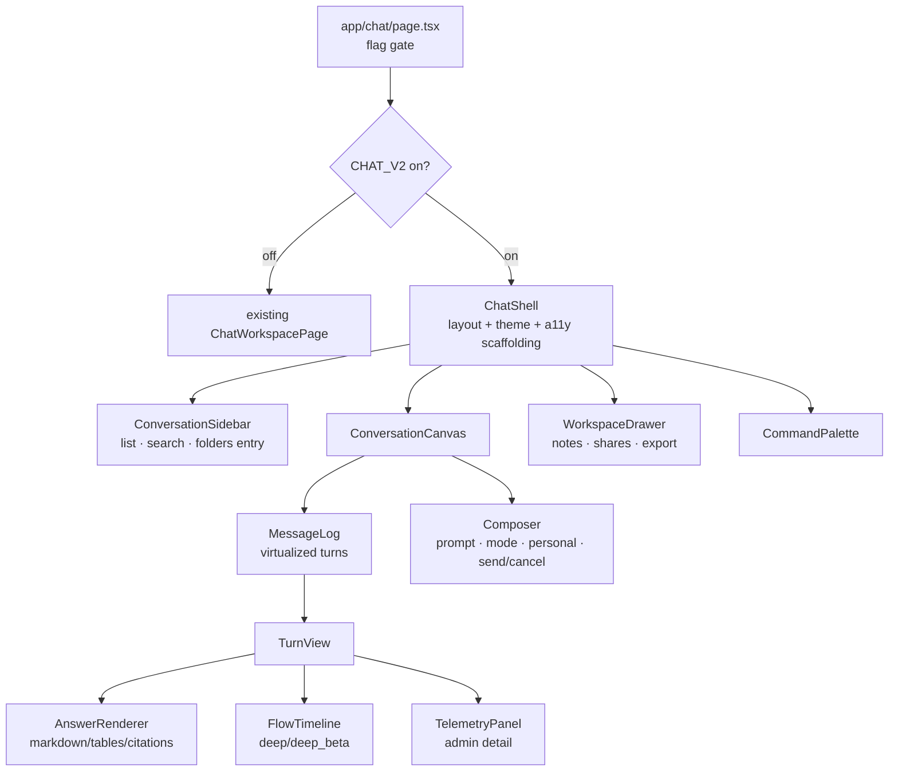

# Design Document

## Overview

This design rebuilds `apps/web/app/chat/page.tsx` (~4,200 lines, one component,
60+ `useState`) into a **componentized, answer-first, accessible chat** built on
a coherent design system. It is a **front-end-only** rebuild: it reuses every
existing API/SSE contract (`lib/research.ts`, `lib/http-client.ts`, chat proxy,
tier2 jobs, flow-event SSE) and changes no backend behavior or guardrail.

It ships **incrementally behind a flag/route**: the new chat lives alongside the
current page until it reaches documented parity, then becomes default; the old
file is removed only in a later cleanup.

### Strategy

| Concern | Today | Rebuilt |
|---|---|---|
| Structure | 1 file, 1 component | feature folder: components + hooks + presentational primitives |
| State | 60+ `useState` in one closure | colocated hooks (`useConversations`, `useChatTurns`, `useWorkspace`, `useChatStream`) + reducer where appropriate |
| Layout | dense workspace grid first | answer-first canvas; workspace as collapsible drawers |
| Styling | ad-hoc classes | shared design tokens + primitives |
| A11y | partial | keyboard, ARIA live regions, focus mgmt, WCAG AA |
| Rollout | in place | flag-gated parallel mount |

## Architecture

### Component tree (new)



### Folder layout (new)

```
apps/web/app/chat/
  page.tsx                      # flag gate: legacy vs v2
  _legacy/page-legacy.tsx       # current implementation moved verbatim (temporary)
  _v2/
    ChatShell.tsx
    components/
      ConversationSidebar.tsx
      ConversationCanvas.tsx
      MessageLog.tsx
      TurnView.tsx
      AnswerRenderer.tsx
      FlowTimeline.tsx
      TelemetryPanel.tsx
      Composer.tsx
      WorkspaceDrawer.tsx
      CommandPalette.tsx
    hooks/
      useConversations.ts
      useChatTurns.ts
      useChatStream.ts
      useWorkspace.ts
      useCommandPalette.ts
    lib/
      chat-format.ts            # markdown export, day buckets, etc. (moved from page)
      telemetry-format.ts       # logic-flow/source-intel formatting (moved from page)
```

### Design system

Reuse existing tokens (the app already themes legal pages via CSS vars like
`--text-brand`). Consolidate chat-specific tokens (surface, elevation, status
colors for flow states) into the shared token layer so light/dark are
consistent (Req 4.1, 4.2). Build small primitives (Button, IconButton, Drawer,
Tooltip, StatusDot, Tabs) if not already present, with accessible states
(Req 4.3, 5).

## Components and Interfaces

- **ChatShell** — owns responsive layout (sidebar / canvas / drawer), theme,
  global keyboard shortcuts, skip-link, and ARIA landmarks (Req 2.1, 5.1, 5.2).
- **ConversationCanvas + MessageLog + TurnView** — the hero. `MessageLog`
  virtualizes turns (Req 7.1); `TurnView` composes `AnswerRenderer` (typographic
  markdown, tables, citations — Req 2.2), `FlowTimeline` (inline deep/deep_beta
  stages — Req 2.3, 3.2), and `TelemetryPanel` (lazy, admin-only detail —
  Req 6.6, 7.3).
- **Composer** — prompt, mode selector (fast/deep/deep_beta), personal-mode
  toggle, send/cancel; stays responsive during runs (Req 3.5, 4.4).
- **WorkspaceDrawer** — folders/notes/shares/export behind progressive
  disclosure (Req 2.4, 6.1, 6.2).
- **CommandPalette** — parity actions (Req 6.3), keyboard-first (Req 5.1).

### Hooks (state/data, no presentation)

- `useConversations` — list/create/select/rename/delete/favorite/folder + local
  fallback when workspace API down (Req 6.1, 6.5).
- `useChatTurns` — load/persist turns per conversation.
- `useChatStream` — fast token streaming + tier2 job create/poll/SSE +
  streaming-fallback, exposing `status` and `cancel` (Req 3.1–3.5). Wraps the
  existing `lib/research.ts` transport unchanged (Req 8.3).
- `useWorkspace` — notes/shares/export/search.
- `useCommandPalette` — registry + filtering + execution.

## Data / Contracts

No backend or schema change. The hooks consume the **existing** client APIs:
chat proxy, `/research/tier2/jobs` (+ poll/SSE), flow events, workspace
endpoints, share/export. Client telemetry/analytics calls stay **PII-free**
(Req 8.5).

## Correctness Properties

1. **Flag isolation**: with `CHAT_V2` off, the served chat is byte-equivalent to today (Req 8.2).
2. **Contract reuse**: no new backend endpoints; all calls map to existing client functions (Req 8.3).
3. **Parity**: every capability in the parity checklist has a v2 implementation + test (Req 6).
4. **No turn loss**: streaming-fallback and job-poll paths persist the final turn exactly once (Req 3.3).
5. **Degraded labeling**: a `local-synth-*` answer is visibly labeled degraded (Req 3.4).
6. **A11y**: keyboard reachability + ARIA live region for streaming + AA contrast verified (Req 5).
7. **Telemetry visibility**: detailed telemetry renders only for authorized roles (Req 6.6).
8. **No-PII client analytics**: analytics payloads contain no query text/PII (Req 8.5).
9. **Performance**: long lists/logs virtualize; advanced panels lazy-load (Req 7).
10. **Consent/disclaimer/RBAC preserved** (Req 8.4).

## Error Handling

- Workspace API unavailable → local-fallback workspace (current behavior),
  surfaced as a non-blocking notice.
- Stream/job error → preserve the turn, show a clear retry affordance, never
  lose user input.
- Render errors isolated per turn via error boundaries so one bad turn does not
  crash the log.

## Testing Strategy

- **Vitest unit tests** per component/hook (Req 1.3): composer behavior, turn
  rendering, flow timeline status mapping, command-palette filtering,
  conversation CRUD + local fallback.
- **Property tests** (fast-check, matching existing web tests) for formatting
  utilities (day buckets, markdown export, telemetry formatting) and no-turn-loss.
- **A11y checks** for keyboard nav and ARIA live region.
- **Flag-off regression**: route renders legacy unchanged.

## Backward-Compatibility, Guardrail & Privacy Strategy

The legacy page is preserved under `_legacy/` and served while `CHAT_V2` is off
or until parity. Consent gate, medical disclaimer, RBAC nav, admin-only
telemetry detail, and no-PII analytics are all preserved and re-asserted by
tests. The new chat changes presentation only; the answer content, safety
labels, and backend behavior are unchanged.
