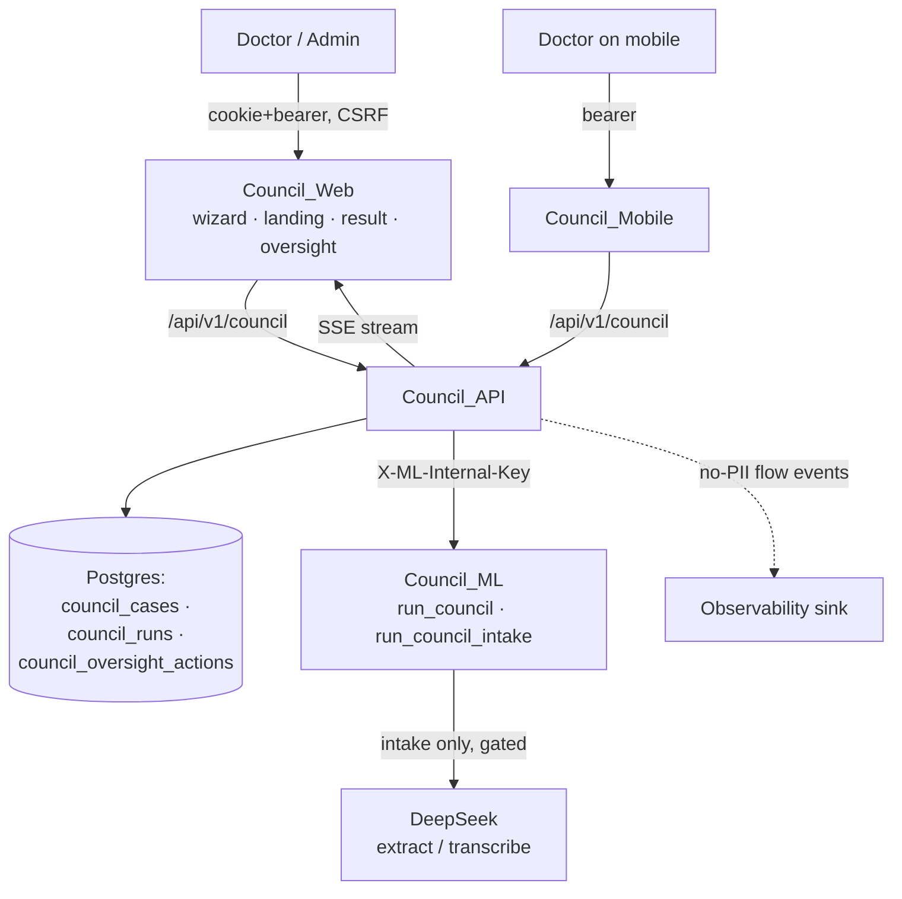
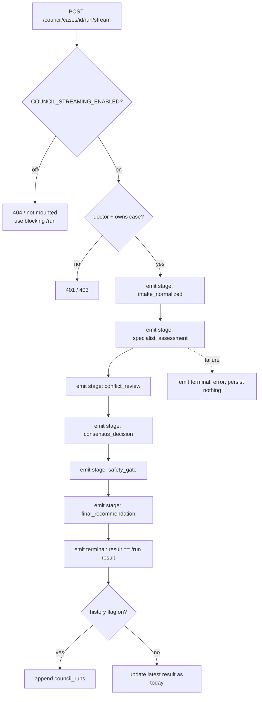
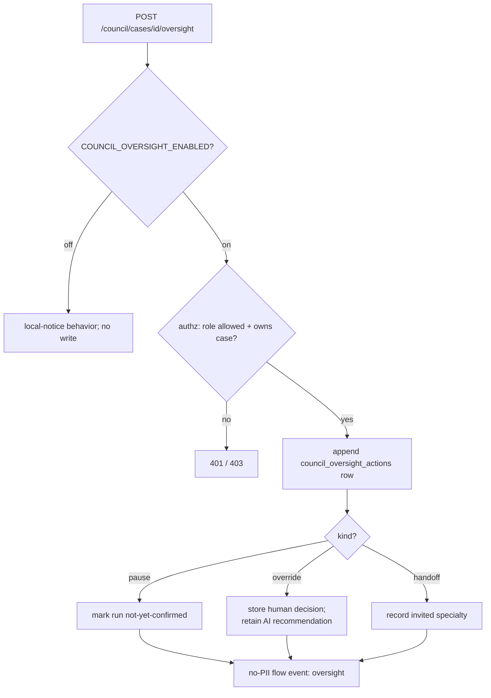

# Design Document

## Overview

This design upgrades the CLARA-Care **Council** to production-grade quality while
keeping every change **additive and feature-flagged** (default OFF). With all
flags off, the Council behaves exactly as it does today: the same
`POST /council/cases/{id}/run` blocking proxy to `/v1/council/run`, the same
deterministic `run_council` output, the same three-step web wizard, the same
doctor-only RBAC and owner isolation, and the same deterministic safety behavior.

The work closes the concrete gaps observed in the current code:

| Gap (observed in code) | Existing mechanism (reused) | New seam (added, flag-gated) |
|---|---|---|
| Blocking run, no streaming | `chat_stream_sse` + `/v1/chat/stream`, `run_council` already emits a `reasoning_timeline` | `/v1/council/run/stream` SSE that yields each stage then the existing result envelope |
| Runs overwrite, no history | `CouncilCase.result_json` / `last_run_at` | append-only `council_runs` table + `GET /council/cases/{id}/runs` |
| Oversight controls are browser-only stubs | landing page `setActionNotice`, `require_roles` | `council_oversight_actions` table + `POST /council/cases/{id}/oversight` with server-side authz |
| UI grants admin actions backend doesn't authorize | `require_roles("doctor")`, `TokenPayload` | explicit oversight authz policy + capability echo to client |
| Generic 502, silent intake fallback | `_call_council_intake_ml`, `proxy_ml_post` | bounded retry/timeout wrapper + user-visible fallback label |
| No model disclosure on Council | compliance `ai_disclosure` design, `model_used` / `mode` fields | `ai_disclosure` block on intake/run outputs |
| Coarse analytics only | `trackCouncilViewed/Run`, flow-event infra | per-stage no-PII flow events + run metrics |
| Mobile is a stripped form | `api_client.runCouncil`, feature-flags endpoint | case/intake/result parity reusing existing endpoints |

### Feature Flags (all default OFF / preserving current behavior)

```
COUNCIL_STREAMING_ENABLED=false        # SSE progressive deliberation endpoint
COUNCIL_RUN_HISTORY_ENABLED=false      # append-only versioned run records
COUNCIL_OVERSIGHT_ENABLED=false        # persisted + enforced handoff/override/pause
COUNCIL_RESILIENCE_ENABLED=false       # bounded retry/timeout + fallback labeling
COUNCIL_MODEL_DISCLOSURE_ENABLED=false # ai_disclosure on intake/run outputs
COUNCIL_OBSERVABILITY_ENABLED=false    # per-stage flow events + run metrics
COUNCIL_MOBILE_PARITY_ENABLED=false    # mobile case/intake/result parity
```

API flags follow the existing `pydantic` `Field(default=..., validation_alias=...)`
pattern in `services/api/src/clara_api/core/config.py`. ML reuses its
`clara_ml.config.settings` pattern (mirroring `COUNCIL_NEURAL_*`). When a flag is
off, the corresponding endpoint returns the existing shape / is not mounted, and
the corresponding enforcement is skipped, reproducing today's behavior
(Requirement 8.1, 8.2).

## Architecture

### System context



### Streaming deliberation flow (Req 1)



The stream is derived from the **same** `run_council` computation. Because
`run_council` is synchronous and deterministic, the streaming endpoint computes
the result and emits the already-present `reasoning_timeline` steps as ordered
`stage` events, then emits the full result as the terminal event (Req 1.2). This
guarantees stream/blocking result equivalence by construction.

### Oversight enforcement flow (Req 3, 4)



### Where it lives

- **Backend** (`services/api/src/clara_api/`):
  - New flags in `core/config.py`.
  - New SQLAlchemy models `CouncilRun` and `CouncilOversightAction` in `db/models.py`.
  - New Alembic migration (next sequence number after the latest) adding
    `council_runs` and `council_oversight_actions`; reversible downgrade.
  - New endpoints in `api/v1/endpoints/council.py`: `POST /cases/{id}/run/stream`,
    `GET /cases/{id}/runs`, `POST /cases/{id}/oversight`, `GET /cases/{id}/oversight`.
  - A small `CouncilOrchestrationService` helper that wraps the ML proxy with the
    bounded retry/timeout policy and the model-disclosure/observability decoration.- **ML** (`services/ml/src/clara_ml/`):
  - `agents/council.py`: add `ai_disclosure` to the `run_council` return (gated by
    a flag passed through the payload, mirroring `council_neural_enabled`).
  - `agents/council_intake.py`: surface `is_fallback` / `ai_disclosure` for the
    heuristic path; add an SSE-friendly stage generator that reuses the existing
    timeline construction.
  - `main.py`: add `POST /v1/council/run/stream` (SSE) reusing `chat_stream`'s
    `StreamingResponse` pattern.
- **Frontend** (`apps/web/`):
  - `lib/council.ts`: add `streamCouncilRun`, `listCouncilRuns`, `submitOversightAction`.
  - `app/council/page.tsx`: wire the existing handoff/override/pause controls to
    the real oversight endpoint when the flag is on; render `ai_disclosure`.
  - `app/council/result/page.tsx` + workspace: show run history and disclosure.
- **Mobile** (`apps/mobile/`): extend `core/api_client.dart` and add
  case/intake/result screens behind the parity flag and the existing
  feature-flags gate.

### Design principles

1. **Additive & reversible.** New tables/columns only; every migration has a
   downgrade. No change to `council_cases` semantics when flags are off.
2. **Result equivalence.** The streaming result and the blocking result are the
   same object; streaming only changes *delivery*, not *content*.
3. **No new PII surfaces.** Runs and oversight rows live inside the existing
   owner-isolated case boundary; telemetry stays clinical-content-free.
4. **Server is the authority.** Oversight capabilities are decided server-side;
   the client only mirrors what the server permits.
5. **Reuse, don't reinvent.** Streaming reuses `chat_stream` patterns; disclosure
   reuses the compliance `ai_disclosure` shape; flow events reuse existing infra.

## Components and Interfaces

### A. Streaming endpoint (Req 1)

- `POST /api/v1/council/cases/{id}/run/stream` (Council_API) → proxies to ML
  `POST /v1/council/run/stream`, returns `text/event-stream`.
- Events: `stage` (one per `reasoning_timeline` step, with `sequence`, `step`,
  non-PII `metadata`), then `result` (the full `run_council` envelope), or `error`
  (terminal, with an error class only).
- Only mounted when `COUNCIL_STREAMING_ENABLED`; otherwise the existing blocking
  `/cases/{id}/run` is the only path (Req 1.3).

### B. Run history (Req 2)

- `CouncilRun` rows are appended on each run when `COUNCIL_RUN_HISTORY_ENABLED`.
- `GET /api/v1/council/cases/{id}/runs` returns the owner's run list, newest first.
- The case's `result_json`/`last_run_at` continue to mirror the latest run so
  existing consumers are untouched (Req 2.3).

### C. Oversight service (Req 3, 4)

- `CouncilOversightAction` rows: `kind ∈ {handoff, override, pause}`, `actor_ref`,
  `reason`, `created_at`, plus `override_original` / `override_decision` for
  overrides and `handoff_specialty` for handoffs.
- `POST /cases/{id}/oversight` validates role + ownership server-side; a `pause`
  flips a case-level `oversight_state` so the final recommendation renders as
  *not yet confirmed* (Req 3.2). Override retains the AI recommendation (Req 3.3).

### D. Resilience wrapper (Req 5)

- `CouncilOrchestrationService.run_with_policy(...)` wraps `proxy_ml_post` /
  `_call_council_intake_ml` with bounded attempts + timeout when
  `COUNCIL_RESILIENCE_ENABLED`; on exhaustion returns a PII-free error and leaves
  case state unchanged (Req 5.2). Intake fallback is labeled (Req 5.3).

### E. Disclosure (Req 6)

- ML attaches `ai_disclosure = { model_family, model_version, is_fallback }`:
  intake → `is_fallback = (model_used == "heuristic-fallback-v1")`; run →
  `model_version = "rule_based_council_v2"`, `is_fallback = false`. Gated by
  `COUNCIL_MODEL_DISCLOSURE_ENABLED`.

### F. Observability (Req 7)

- Per-stage flow events `{ stage, duration_ms, outcome }` and run metrics
  `{ latency_ms, specialist_count, conflict_count, emergency_triggered,
  fallback_used }` — all clinical-content-free. Gated by
  `COUNCIL_OBSERVABILITY_ENABLED`.

## Data Models

All new and additive, created by one reversible Alembic migration.

### `council_runs` (append-only)

| column | type | note |
|---|---|---|
| id | int pk | |
| case_id | int fk → council_cases.id (CASCADE) | indexed |
| user_id | int fk → users.id (CASCADE) | owner; indexed |
| request_json | JSON | normalized run payload |
| result_json | JSON | `run_council` result snapshot |
| model_version | str(64) | e.g. `rule_based_council_v2` |
| emergency_triggered | bool | denormalized for fast filtering |
| created_at | datetime | run timestamp |

### `council_oversight_actions` (append-only)

| column | type | note |
|---|---|---|
| id | int pk | |
| case_id | int fk → council_cases.id (CASCADE) | indexed |
| run_id | int fk → council_runs.id (nullable) | target run |
| actor_ref | str(64) | acting user (owner-scoped) |
| kind | str(16) | handoff / override / pause |
| reason | Text | owner-isolated; never telemetered |
| handoff_specialty | str(64) null | for handoff |
| override_decision | Text null | human decision (override) |
| override_original | Text null | retained AI recommendation (override) |
| created_at | datetime | |

### `council_cases` (additive column only)

| column | type | note |
|---|---|---|
| oversight_state | str(16) default `none` | `none` / `paused` — drives "not yet confirmed" render |

## Correctness Properties

These properties are the contract for property-based tests (hypothesis for Python, fast-check for TypeScript). Each is phrased for universal quantification over generated inputs.

### Property 1: Stream/blocking result equivalence
For any valid case payload, the terminal `result` event of the streaming run equals the result returned by the blocking `/run` for the same payload.

**Validates: Requirements 1.1, 1.2**

### Property 2: Stage ordering and completeness
A streamed run emits stages in strictly increasing `sequence` covering exactly the six pipeline steps, terminated by exactly one `result` or one `error` event, never both.

**Validates: Requirements 1.1, 1.4**

### Property 3: Run history append-only
Running a case N times yields N immutable `council_runs` rows; no prior row's `result_json` or `created_at` is mutated, and the case's latest result equals the newest run's result.

**Validates: Requirements 2.1, 2.2, 2.3**

### Property 4: Owner isolation
For any two distinct users, neither can read or write the other's cases, runs, or oversight actions (always 403/404), for every Council endpoint.

**Validates: Requirements 2.5, 3.4, 4.3**

### Property 5: Oversight override retention
After an `override`, both the original AI recommendation and the human decision are retrievable; the AI recommendation is never null/overwritten.

**Validates: Requirements 3.3**

### Property 6: Pause gates confirmation
When a case's `oversight_state` is `paused`, the rendered/serialized final recommendation is flagged not-confirmed; clearing the pause restores the confirmed presentation.

**Validates: Requirements 3.2**

### Property 7: Authorization soundness
An oversight or run action succeeds iff the caller is authenticated, holds an authorized role, and owns the case; otherwise it has no side effect.

**Validates: Requirements 4.2, 4.5**

### Property 8: Flags-off equivalence
With all Council upgrade flags off, request/response shapes, persisted side effects, and emitted telemetry equal the pre-feature baseline.

**Validates: Requirements 9.1, 9.2**

### Property 9: No-PII telemetry
Every Council flow event, metric, and analytics payload passes a redaction projection that finds no transcript/symptom/lab/medication/history text.

**Validates: Requirements 7.3, 9.5**

### Property 10: Disclosure correctness
`ai_disclosure.is_fallback` is true iff the producing path was degraded (`heuristic-fallback-v1` for intake); for a rule-engine run it is false and `model_version == "rule_based_council_v2"`.

**Validates: Requirements 6.1, 6.2, 6.6**

### Property 11: Safety preservation
For any input containing a non-negated red-flag phrase, the run's consensus/escalation still forces `emergency_escalation` with `triggered = true`, independent of every upgrade flag.

**Validates: Requirements 9.3**

### Property 12: Resilience non-corruption
When the upstream fails (including mid-stream), the case's persisted result and `oversight_state` are byte-identical to their pre-attempt values.

**Validates: Requirements 5.2, 5.6**

### Property 13: CSRF preserved
Cookie-authenticated mutating Council endpoints reject missing/invalid CSRF tokens.

**Validates: Requirements 4.4, 9.6**

### Property 14: Neural shadow containment
The neural risk score never changes the deterministic consensus triage, with the upgrade flags on or off.

**Validates: Requirements 9.4**

## Error Handling

- **Fail safe, never corrupt.** Run/stream/oversight writes are transactional;
  a partial failure rolls back, leaving the case unchanged (Req 5.2, 5.6,
  Property 12). A stream failure emits a terminal `error` event and writes nothing.
- **Bounded upstream policy.** With `COUNCIL_RESILIENCE_ENABLED`, ML calls use
  bounded attempts + timeout; exhaustion returns a PII-free `502`-class error.
  With the flag off, the existing single-attempt 400/413/415/502 mapping is kept.
- **Degraded labeling.** Heuristic intake is labeled `is_fallback = true` so a
  degraded extraction is never silently presented as primary-model output.
- **Authorization first.** Authz and ownership checks run before any side effect;
  failures return 401/403 with PII-free messages.
- **Validation preserved.** Empty-input runs → 400; oversize/wrong-type audio →
  413/415, exactly as today.

## Testing Strategy

- **Property tests** (hypothesis in `services/api/tests` and `services/ml/tests`;
  fast-check for web `lib/council.ts` normalization) covering Properties 1–14.
- **Flags-off regression gate**: a test asserting that with all Council upgrade
  flags off, the run/intake endpoints, the wizard payloads, and the response
  envelopes are byte-equivalent to the current baseline (Property 8).
- **No-PII CI guard**: feed adversarial PII (symptoms/labs/transcript) through
  Council flow-event and metric writers and assert the persisted projection drops
  it (Property 9), mirroring the existing no-PII telemetry tests.
- **Safety regression**: reuse the existing red-flag/negation fixtures to assert
  emergency escalation is preserved with every flag permutation (Property 11).
- **Migration test**: upgrade/downgrade round-trip for the new migration.
- **Streaming contract test**: assert stage ordering/termination (Property 2) and
  stream/blocking equivalence (Property 1) against `run_council`.
- **Mobile**: widget/integration test that the parity flow reuses the shared
  endpoints and renders the shared result shape (Req 8.2, 8.3).

## Backward-Compatibility, Guardrail & Privacy Strategy

Every existing invariant — doctor-role RBAC, owner isolation, no-PII telemetry,
CSRF, negation-aware red-flag escalation, the immediate-referral action, the
"review with a clinician" directive, and shadow-mode neural risk — is preserved
and, where touched, re-asserted by a new test. The feature ships dark (all flags
off), is enabled per environment, and can be fully disabled by flipping flags
without redeploying the deterministic clinical engine.
