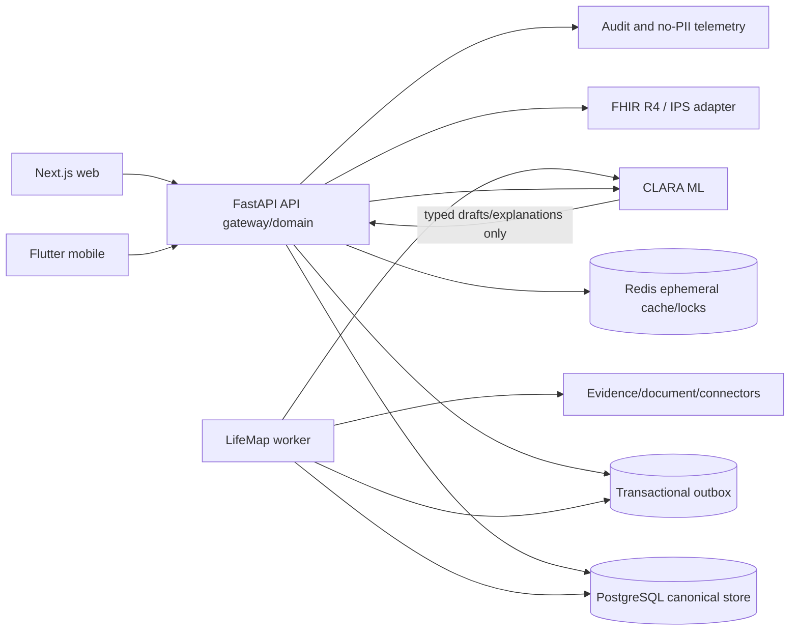
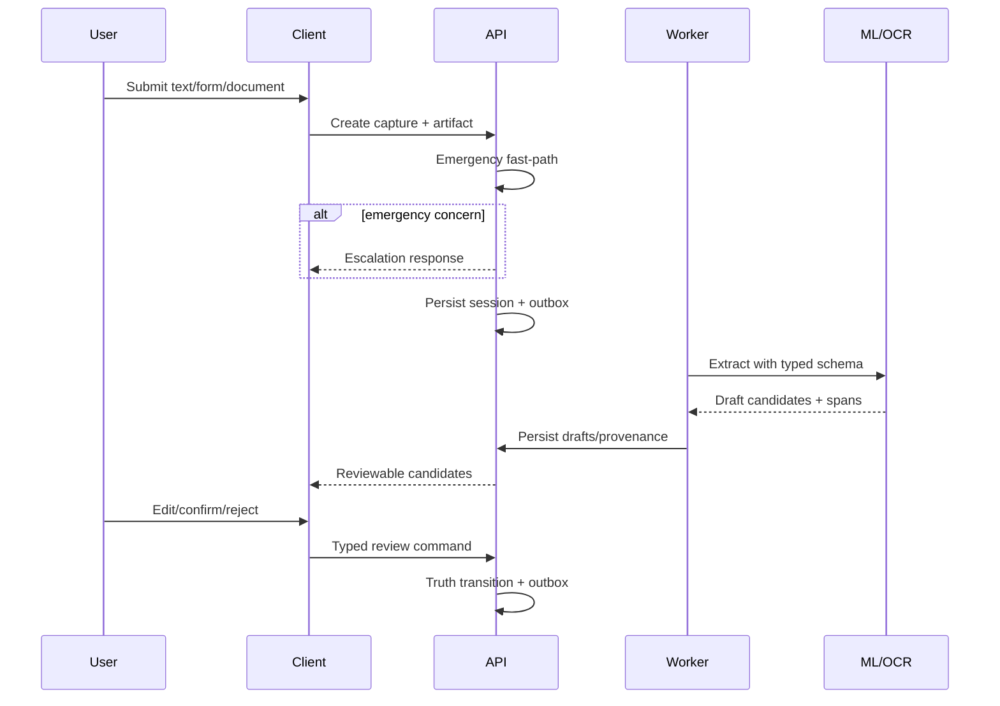
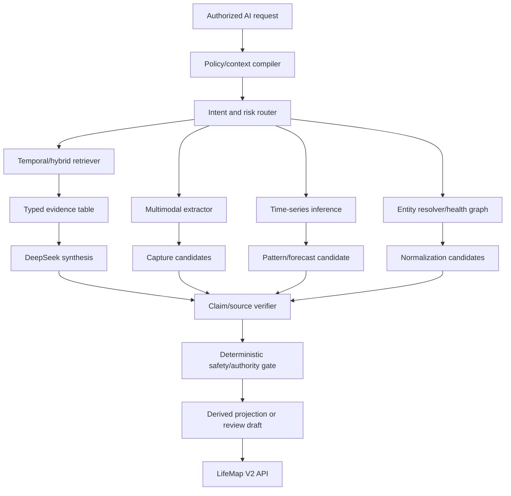

# Technical Design — CLARA LifeMap Production Convergence

Status: proposed
Date: 2026-07-28
Requirements: [requirements.md](requirements.md)
Execution plan: [tasks.md](tasks.md)
AI portfolio: [ai-capability-analysis.md](ai-capability-analysis.md)

## 1. Design goals

The target is an auditable longitudinal-health platform in which:

- the API owns health-domain truth, policy, and authorization;
- ML can extract and explain but cannot confirm or authorize;
- every derived view is reproducible from versioned inputs;
- background delivery and recomputation are durable;
- consumers can inspect and correct the history;
- sharing is purpose-bound and revocable; and
- interoperability is an adapter, not the internal persistence model.

The design preserves the established request path:

`Web / Mobile -> API (/api/v1/*) -> ML (internal key)`

PostgreSQL remains the source of truth. Redis may accelerate short-lived locks,
rate limits, and caches, but it must not become the sole record of a confirmed
fact, consent, task transition, or delivery obligation.

## 2. Architectural decisions

### AD-1 — Canonical domain model plus FHIR projection

CLARA's workflow concepts do not map one-to-one to a single FHIR resource, and
FHIR is an exchange standard rather than a required database schema. Keep typed
LifeMap tables and publish validated FHIR R4/IPS Bundles through an adapter.

Consequences:

- internal migrations remain understandable and performant;
- provenance and user confirmation can be stricter than generic FHIR;
- export profiles can evolve independently;
- the adapter must have mapping and round-trip tests; and
- import never bypasses CLARA's draft/confirmation policy.

### AD-2 — Append-only clinical history

Canonical facts, decisions, grants, and actions are revised through append-only
records. Current-state columns/tables may be retained as transactional indexes,
but the audit/replay truth is never reconstructed from overwritten values.

### AD-3 — Command/query split without a new platform dependency

Typed command services own authorization, idempotency, transition validation,
canonical writes, and outbox creation. Query services own profile-scoped read
models. This is a code-level CQRS boundary, not a requirement to deploy a new
event-sourcing product.

### AD-4 — Deterministic safety core, ML-assisted edges

Profile authorization, truth transitions, task states, consent, emergency
routing, baseline eligibility, question eligibility, and projection invalidation
are deterministic. ML is used for draft extraction, semantic normalization,
research synthesis, and plain-language explanation behind typed schemas.

### AD-5 — Dedicated durable workers

Outbox relay, document extraction, baseline rebuild, projection rebuild, evidence
subscriptions, and deletion/export jobs run in a separately deployed worker.
They do not run as API lifespan loops in production.

### AD-6 — Additive V2 contracts

Introduce `/api/v1/lifemap/v2/*` for commands and projections whose semantics
cannot be made safe additively. Keep current endpoints as adapters during the
migration window. New clients use opaque public IDs and a standard envelope.

### AD-7 — Portfolio architecture, not one universal health model

Use the simplest independently testable component for each task:

- rules/state machines for safety, consent, eligibility, and truth;
- robust statistics/classical ML for structured longitudinal signals;
- embeddings and graphs for candidate retrieval and entity linking;
- OCR/ASR/layout/vision models for multimodal draft extraction;
- LLM plus RAG for grounded language and research synthesis; and
- trained neural sequence models only as challengers against simpler baselines.

No single LLM receives unrestricted LifeMap context or authority to execute
commands. An orchestrator may compose typed tools, but policy, authorization,
source selection, verification, and persistence remain outside the model.

## 3. Target context



Trust boundaries:

1. clients are untrusted and may not choose profile authorization or truth;
2. uploaded/imported content is untrusted and may contain prompt injection;
3. ML output is untrusted structured draft data;
4. external evidence and connector data are untrusted until normalized,
   provenance-linked, and policy-checked;
5. family/clinician share holders are separate principals with narrow grants.

## 4. Domain model

### 4.1 Identity and scope

Add `HealthProfileScope` or evolve `PhrProfile` with:

| Field | Purpose |
| --- | --- |
| `id` | internal bigint key |
| `public_id` | UUIDv7/ULID, unique, API-visible |
| `owner_user_id` | owning account |
| `status` | active, suspended, archived, deletion_pending |
| `locale`, `timezone` | interpretation and display boundary |
| `version` | optimistic concurrency |

`ProfileAccessPolicy` resolves a request into:

```text
actor_id, profile_id, actor_role, grant_id?, purpose, allowed_actions,
allowed_data_classes, valid_until
```

Every repository method that reads health data takes a resolved scope object.
Never accept `profile_id` alone as proof of access.

### 4.2 Canonical event and revision

Evolve `LifeMapEvent` and add `LifeMapEventRevision`:

```text
event:
  id, public_id, profile_id, event_type, effective_period,
  current_revision_id, lifecycle_status, created_at

revision:
  id, public_id, event_id, revision_no, truth_state,
  structured_payload_json, display_summary,
  source_reference_id, asserted_by_actor_id,
  confidence, reason_code, supersedes_revision_id,
  policy_version, recorded_at
```

Add `HealthSourceReference`:

```text
source_kind, source_public_id, document_object_key?, connector_account_id?,
author_type, author_public_id?, device_identity?, observed_at,
received_at, checksum, original_language, source_span_json
```

Allowed truth transitions:

| From | To |
| --- | --- |
| draft | user_reported, confirmed, invalidated, entered_in_error |
| user_reported | confirmed, disputed, superseded, invalidated |
| confirmed | disputed, superseded, invalidated |
| disputed | confirmed, superseded, invalidated |
| superseded | none |
| invalidated | none |
| entered_in_error | none |

A correction creates a new revision and transitions the former active revision
to `superseded`. Terminal revisions are never edited.

### 4.3 Episodes and links

Retain `LifeMapEpisode`, adding `public_id`, optimistic `version`, archive state,
and neutral classification. Add:

- `LifeMapEpisodeEventLink(event_id, episode_id, linked_revision_id, reason,
  actor_id, created_at, removed_at)`;
- `LifeMapGoal` plus append-only `LifeMapGoalRevision`;
- `LifeMapQuestionInstance` for offered/answered/dismissed/cooldown state; and
- `LifeMapDecisionInput` to link decision-ledger entries to exact revisions.

### 4.4 Tasks and actions

Retain `LifeMapCareTask` as the current-state index. Add
`LifeMapTaskAction`:

```text
task_id, action, from_state, to_state, actor_id, source_decision_id?,
idempotency_record_id, reason, occurred_at
```

Database constraints and the command service enforce the state machine. Today
queries only `accepted|in_progress` tasks whose due window is eligible and whose
source decision has not been invalidated.

### 4.5 Capture

Add:

- `CaptureSession(profile_id, source_kind, status, expires_at, locale)`;
- `CaptureArtifact(session_id, object_key, checksum, media_type, scan_status)`;
- `CaptureCandidate(session_id, field_key, typed_value_json, confidence,
  sensitivity, source_reference_id, status)`;
- `CaptureReviewAction(candidate_id, actor_id, action, edited_value_json,
  reason, occurred_at)`.

Artifact bytes stay in encrypted object storage; the database stores object
identity/checksum, not public URLs.

### 4.6 Baselines and change signals

Add a code-managed `BaselineDefinitionRegistry`, serialized version in results:

```text
signal_key, canonical_unit, allowed_sources, valid_range,
aggregation, min_samples, min_span, exclusion_rules,
baseline_window, comparison_window, change_rule
```

Persist:

- `BaselineSnapshot(profile_id, signal_key, definition_version, input_watermark,
  median, mad, q1, q3, sample_count, day_count, window, status, computed_at)`;
- `BaselineInputLink(snapshot_id, event_revision_id, inclusion, reason)`; and
- `ChangeSignal(snapshot_id, magnitude, duration, confidence, status,
  explanation_key, detected_at, resolved_at)`.

The first algorithm is deterministic:

1. normalize units and local day boundaries;
2. reject invalid/duplicate samples;
3. apply per-signal exclusion rules;
4. require minimum count and time coverage;
5. compute median, MAD, Q1/Q3;
6. compare a recent robust aggregate with the baseline;
7. require configured magnitude and persistence; and
8. output `insufficient_data`, `stable`, `change_detected`, or `stale`.

Do not label the result “abnormal” unless a separate, sourced reference-range
layer supports that term.

### 4.7 Visit and evidence extensions

Extend visit extraction candidates with:

```text
instruction_type, candidate_text, normalized_value_json,
document_id, page, bounding_box/text_offsets, confidence,
review_status, reviewed_by, reviewed_at
```

Extend evidence subscriptions with:

```text
next_run_at, lease_owner, lease_until, checkpoint,
last_success_at, consecutive_failures, status
```

Add `EvidenceChangeAssessment` linking old/new evidence sets, contradiction
result, applicability rule version, model/rule version, reviewer state, and
notification state.

## 5. Command processing

All V2 mutations use:

```http
Idempotency-Key: <128 chars max>
If-Match: "<entity-version>"              # updates where conflicts matter
X-Profile-Scope: <opaque profile id>      # optional for self, required if acting for another
```

Standard command flow:

1. authenticate and resolve `ProfileAccessPolicy`;
2. validate CSRF for cookie-authenticated mutation;
3. canonicalize request and calculate digest;
4. claim idempotency record scoped to actor/profile/operation;
5. lock target rows and validate `If-Match`/state transition;
6. write canonical records, action history, audit intent, and outbox in one DB
   transaction;
7. store status/body in the idempotency record;
8. return the same result for a valid retry;
9. reject key reuse with a different digest as `409`.

ML is never called while holding a database transaction. Long processing uses a
job command and worker; confirmation is a separate short command.

## 6. V2 API surface

Responses use:

```json
{
  "data": {},
  "meta": {
    "schema_version": "lifemap.v2",
    "request_id": "...",
    "freshness": "current",
    "generated_at": "..."
  }
}
```

Core routes:

| Method and path | Purpose |
| --- | --- |
| `GET /lifemap/v2/health` | component health/readiness, admin detail sanitized for consumers |
| `GET /lifemap/v2/today` | versioned Today projection |
| `POST /lifemap/v2/captures` | create capture session |
| `POST /lifemap/v2/captures/{id}/artifacts` | presigned/streamed artifact registration |
| `POST /lifemap/v2/captures/{id}/extract` | enqueue typed extraction |
| `GET /lifemap/v2/captures/{id}` | candidates and review state |
| `POST /lifemap/v2/candidates/{id}/confirm` | create/advance canonical fact |
| `POST /lifemap/v2/candidates/{id}/reject` | reject candidate |
| `POST /lifemap/v2/events/{id}/correct` | append correction |
| `POST /lifemap/v2/events/{id}/dispute` | append dispute |
| `GET/POST /lifemap/v2/episodes` | list/create |
| `GET /lifemap/v2/episodes/{id}/replay` | revision-aware replay |
| `POST /lifemap/v2/episodes/{id}/tasks` | propose task |
| `POST /lifemap/v2/tasks/{id}/{action}` | accept/reject/start/complete/cancel |
| `GET /lifemap/v2/baselines` | snapshots and sufficiency |
| `GET /lifemap/v2/episodes/{id}/next-question` | one eligible instance |
| `POST /lifemap/v2/questions/{id}/answer` | answer into capture flow |
| `POST /lifemap/v2/questions/{id}/dismiss` | cooldown/preference |
| `GET /lifemap/v2/export/ips` | enqueue or produce authorized IPS Bundle |

Existing medication, visit, family, and evidence routes can remain under their
current mounts, but adopt the same ProfileScope, public-ID, idempotency,
provenance, and envelope rules in an additive version.

Error bodies use stable codes such as:

`profile_required`, `scope_forbidden`, `consent_required`, `version_conflict`,
`invalid_transition`, `dependency_unavailable`, `source_span_required`,
`insufficient_data`, and `idempotency_conflict`.

Raw exceptions and upstream bodies never reach End_User clients.

## 7. Universal Capture flow



Extraction schema validation rejects unknown fields, missing required spans, bad
units, and unsupported confidence formats. Prompts explicitly delimit source
content and instruct the model that source text cannot alter system policy;
server-side validation remains authoritative.

## 8. Projection and invalidation graph

`ProjectionDependency` records:

```text
projection_type, projection_public_id, input_type, input_revision_id,
rule_version, produced_at, invalidated_at, invalidation_reason
```

On correction, deletion restriction, connector revocation, or consent change:

1. append the canonical change;
2. enqueue `lifemap.dependencies.invalidate`;
3. mark affected projections stale in bounded batches;
4. enqueue recomputation by projection type;
5. prevent stale safety outputs from being presented as current;
6. keep the last safe read only when policy permits and label its timestamp.

Today is recomputed synchronously for simple task transitions and asynchronously
verified. Baselines, replay summaries, Visit Packs, and evidence applicability
are asynchronous with freshness metadata.

## 9. Next-best-question engine

Question definitions live as reviewed YAML/JSON plus schema tests, for example:

```yaml
id: symptom_onset_v1
episode_classes: [symptom_tracking]
answer_type: date_or_duration
sensitivity: medical
rationale_key: nbq.symptom_onset.rationale
critical_field: onset
impact_weight: 80
cooldown_days: 30
```

Eligibility filters:

1. feature flag, profile, and consent;
2. episode class;
3. unanswered critical field;
4. active truth not already satisfying the field;
5. not dismissed/cooldown/do-not-ask;
6. within daily and weekly burden budgets; and
7. question can change an enumerated output.

Ranking is deterministic: safety impact, expected action change, freshness, then
stable definition order. The response includes `why_asked` and
`what_it_may_change`.

## 10. Medication, visit, and evidence boundaries

### Medication

Normalization uses a terminology adapter that retains original Vietnamese label
text. A normalization match is a candidate until confirmed. DDI calls receive
confirmed/current medication revisions only unless the UI explicitly labels a
hypothetical check.

### Visit

The extractor returns instructions only with source spans. Classification
distinguishes user note, clinician instruction, prescription text, appointment,
test/result, and unknown. Unknown or ambiguous candidates cannot produce tasks.

### Living Evidence

Retrieval and synthesis remain separate jobs. The material-change assessor
compares source identity, study/guideline status, conclusion direction,
certainty, contradictions, and validated applicability. A notification requires
a completed assessment and safe consumer projection.

## 11. FHIR R4 and IPS adapter

Suggested mapping:

| CLARA | FHIR R4 |
| --- | --- |
| ProfileScope demographics | Patient |
| confirmed measurement/event | Observation |
| confirmed allergy | AllergyIntolerance |
| user-reported condition | Condition with verification/status and provenance |
| medication course | MedicationStatement; MedicationRequest only for a genuine order source |
| episode/plan | CarePlan |
| goal | Goal |
| accepted task | Task |
| guided answer | QuestionnaireResponse |
| source document | DocumentReference |
| revision/source lineage | Provenance |
| sharing choice | Consent |
| security access/action | AuditEvent |
| Visit Pack summary | Composition + document Bundle / IPS profile where conformant |

Rules:

- pin exact validator and IG package versions;
- include `meta.profile`;
- preserve `dataAbsentReason`/empty-reason semantics;
- handle modifier elements and unknown critical codes safely;
- use UCUM for quantities;
- retain original text beside code;
- include provenance for generated or transformed resources;
- never encode a user plan as a clinician order;
- never imply IPS conformance unless validation passes.

## 12. Outbox and worker

Extend `LifeMapOutboxEvent`:

```text
public_id, aggregate_type, aggregate_public_id, event_type, payload,
occurred_at, available_at, attempt_count, max_attempts,
lease_owner, lease_until, last_error_code, delivered_at, dead_lettered_at
```

Worker claim query uses PostgreSQL `FOR UPDATE SKIP LOCKED`, sets a short lease,
commits, performs work, then records success or retry. A heartbeat extends only
the worker's lease. Crashed leases become eligible after expiry.

Retry policy:

- retry transient network, timeout, 429, and configured 5xx outcomes;
- do not retry schema, authorization, revoked consent, or unsupported-source
  failures without a new event;
- exponential backoff with jitter and maximum age;
- dead-letter after the configured attempt/age limit;
- admin replay requires reason, actor, and audit event.

Event payloads contain opaque IDs and minimum necessary data, not document
content or broad profile snapshots.

## 13. Security and privacy design

Authorization order:

`authenticate -> resolve profile -> resolve grant/purpose -> consent -> RBAC/
object policy -> command/query`.

Controls:

- envelope encryption for source artifacts and backups;
- service-managed object keys; no guessable paths;
- checksum and malware-scan state before processing;
- signed URLs with short expiry and exact object/action;
- database row-level tests even if PostgreSQL RLS is not initially enabled;
- audit-log access separated from consumer domain reads;
- log redaction at source, not post-processing;
- job payloads reference records rather than embedding PHI;
- revocation fan-out invalidates cache, sessions, tokens, and queued jobs;
- DSAR/deletion jobs retain a tombstone and required audit proof without
  retaining deleted content.

Before release, update the privacy inventory and data-flow assessment for Vietnam
Law 91/2025/QH15. EU release additionally requires an AI Act role/risk and data-
protection assessment. These are governance gates, not runtime feature flags.

## 14. AI safety and evaluation

Maintain a versioned safety case with:

- intended use and prohibited use;
- hazard log with severity/probability/detectability;
- data/source/model cards;
- prompt and rule inventory;
- offline test-set provenance;
- Vietnamese and English subgroup results;
- human-factors comprehension results;
- monitoring thresholds and rollback owners.

Minimum model-output contract:

```text
schema_version
candidate_fields[]
source_spans[]
confidence_by_field
missing_critical_fields[]
uncertainties[]
safety_disposition
model_id
template_version
```

No free-form model output is persisted as canonical structured truth.

## 15. AI capability architecture



The policy/context compiler accepts the resolved ProfileScope and creates a
short-lived `AIContextManifest`:

```text
request_id
use_case_id
actor/profile/purpose policy references
allowed data classes and time/episode bounds
consent and grant versions
input revision/source IDs
maximum sensitivity
retrieval/index watermark
expiry
```

The manifest is private server state. ML receives the minimum necessary typed
context plus opaque evidence IDs, not authorization tokens or broad database
access.

### 15.1 Use-case registry

Every AI route resolves an `AIUseCaseDefinition`:

```text
id, risk_class, release_state, owner
allowed_roles, allowed_purposes, required_consents
input_schema, output_schema, forbidden_outputs
champion, challenger[], fallback
timeout/cost/data limits
verification_policy, abstention_policy
evaluation_suite, minimum_metrics, kill_switch
```

The registry is code-reviewed configuration. Client-supplied model names,
prompts, temperatures, tool sets, or release states are ignored.

### 15.2 Ask My LifeMap: temporal RAG

Do not embed one concatenated patient record. Index profile-scoped, revision-
aware retrieval documents:

```text
retrieval_document_id
profile_id
source_type/source_revision_id
effective_start/effective_end
recorded_at
episode_ids
truth_state
sensitivity/data_class
language
normalized entities
text_for_retrieval
embedding/index version
is_active
```

Query path:

1. authorization produces a hard SQL/metadata filter;
2. intent/risk routing executes before retrieval;
3. lexical, dense, temporal, and graph retrieval run within that filter;
4. reranking cannot introduce an ID outside the filtered candidate set;
5. the API materializes an evidence table with exact current revisions;
6. DeepSeek produces a strict typed answer citing only evidence-table IDs;
7. citation existence, entailment, temporal order, and contradiction checks run;
8. unsupported claims are removed or the response abstains;
9. medical claims continue through existing legal guards and FIDES where
   applicable.

The retrieval store contains no cross-profile global patient index. Profile ID is
a physical/mandatory partition key, not merely text metadata.

### 15.3 Hierarchical summary pipeline

Summary projections form a dependency tree:

```text
event revisions -> daily summary -> episode/weekly summary
                                -> visit-preparation/caregiver digest
```

Each level receives structured child claims and source IDs, not only prose from
the previous level. This prevents repeated summarization from washing out
provenance. Corrections invalidate ancestors. A deterministic template produces
the fallback and comparison baseline.

### 15.4 Multimodal model router

Add a model-neutral extraction interface under `services/ml`:

```python
class LifeMapExtractor(Protocol):
    async def extract(
        self,
        artifact: AuthorizedArtifact,
        schema: ExtractionSchema,
    ) -> ExtractionResult: ...
```

Adapters:

- existing OCR bridge for medication labels;
- existing Whisper/ASR composition for audio;
- document layout/OCR adapter for visit documents;
- optional vision-language adapter for field candidate generation;
- DeepSeek structured extraction for normalized text.

Model output is validated for schema, offsets/regions, units, allowed vocabulary,
confidence bounds, and artifact checksum before candidates are persisted.
Medical-image diagnostic adapters are not registered.

### 15.5 Entity-resolution ensemble

Create `services/ml/src/clara_ml/lifemap/entity_resolution/` with:

- Unicode/Vietnamese normalization;
- exact and alias dictionary candidates;
- dense candidate retrieval;
- terminology and HealthGraph constraint checks;
- optional cross-encoder/LLM reranking;
- calibration and decision thresholds.

Outputs:

```text
raw_text
candidates[{system, code, display, score, evidence}]
decision: accepted_low_risk | suggest | ambiguous | no_match
model/dictionary/graph versions
```

The API decides whether policy permits automatic low-risk coding. Medication and
other critical entities remain review candidates.

### 15.6 Contradiction and missingness ensemble

Run deterministic conflicts first. NLI or LLM proposes extra pairs from a
bounded candidate set; it cannot compare the entire unrestricted profile or
commit a resolution.

Persist `LifeMapReviewFinding`:

```text
finding_type, severity, left_revision_id, right_revision_id?,
missing_field?, rule/model_version, explanation_key,
status, reviewed_by, resolution_revision_id?
```

Findings are review workflow objects, not clinical facts.

## 16. Time-series ML design

### 16.1 Feature and label plane

Training and inference use versioned feature views derived from canonical,
consent-eligible records. Models never query mutable OLTP rows ad hoc.

`FeatureSetSnapshot` records:

```text
feature_schema_version
profile cohort/dataset version
observation watermark
source/device/timezone normalization
window start/end and missingness mask
feature values/object reference
input revision lineage
```

Initial engineered features include coverage, robust location/dispersion,
quantiles, trend, seasonality, autocorrelation, entropy/variability, source
changes, missingness, and task-history features. Raw high-frequency waveform
models are a separate research dataset and consent class.

Labels must be purpose-specific:

- self-supervised representation labels require no clinical outcome claim;
- question usefulness comes from explicit utility review, not answer click alone;
- task-friction labels do not imply clinical adherence;
- health outcomes require clinically governed definitions and adjudication.

### 16.2 Champion/challenger bake-off

For each target, train/evaluate in increasing complexity:

1. deterministic heuristic/robust statistical baseline;
2. regularized linear/logistic or survival baseline;
3. tree/gradient-boosted model;
4. isolation/one-class model for unlabeled change;
5. TCN/autoencoder/Transformer;
6. pretrained time-series foundation model only if licensing, modality alignment,
   and domain evidence are acceptable.

Complexity is promoted only for a predefined material improvement after
calibration, subgroup, shift, latency, cost, and explainability penalties.

The existing `council-neural-shadow-v1` is registered as
`fixed_weight_heuristic`, not `trained_neural`, until replaced by a governed
artifact.

### 16.3 Uncertainty and abstention

Use task-appropriate uncertainty:

- calibrated probabilities with reliability analysis;
- prediction intervals for regression/forecasting;
- conformal sets/intervals only when calibration assumptions and shift behavior
  are evaluated;
- ensemble disagreement where useful;
- explicit data-sufficiency and OOD detectors.

Uncertainty is not one universal confidence score. The authority gate uses:

```text
if insufficient_data or ood or calibration_invalid:
    abstain
elif risk_class requires shadow:
    store_private_shadow_result
elif uncertainty outside release boundary:
    show unavailable/needs_review
else:
    release bounded output
```

### 16.4 Relationship discovery

The relationship engine computes deterministic candidate associations over
approved signal pairs and lags. It uses minimum coverage, effect size,
uncertainty, and multiple-comparison control or a discovery/confirmation split.
The LLM verbalizes a supplied result using a constrained non-causal vocabulary.

### 16.5 Forecasting boundary

Forecast service output:

```text
target_key, horizon, point/range_or_set
coverage/calibration metadata
input sufficiency and watermark
ood/abstention
top approved contributors
model/feature versions
release_state=shadow|pilot|released
```

The model catalogue initially permits only low-risk wellness/organizational
targets. Clinical outcomes are rejected by the use-case registry.

## 17. Adaptive intelligence

### 17.1 Learned question ranker

The deterministic engine emits an eligible action set. The learned component
receives only:

- stable non-content context features;
- eligible question IDs;
- burden/cooldown state; and
- prior explicit utility/dismissal outcomes.

It returns scores for those IDs. It cannot generate question text or modify
eligibility. Off-policy evaluation records propensity and policy version.

Contextual-bandit exploration, if ever approved, is server-side and limited to
safe eligible questions. The deterministic ordering remains the fallback.

### 17.2 Friction model

The model predicts workflow friction, not patient compliance or health risk.
Allowed actions are `reduce_reminders`, `change_time`, `offer_pause`,
`offer_smaller_user_step`, and `offer_help`. Notification pressure has an
absolute policy ceiling independent of model score.

### 17.3 Personalized evidence intelligence

PICO and eligibility extraction produces typed candidates with source spans.
Rule evaluation compares confirmed facts with validated criteria. The LLM can
explain:

- confirmed match;
- confirmed mismatch;
- unknown/not assessed; and
- evidence conflict.

It cannot infer a missing profile fact, declare trial eligibility, or transform
the result into treatment advice.

## 18. MLOps, datasets, and model governance

### 18.1 Persistent registry

Add API-owned registry tables or equivalent immutable artifact manifests:

- `MLDatasetVersion`;
- `MLFeatureSchemaVersion`;
- `MLTrainingRun`;
- `MLModelArtifact`;
- `MLModelEvaluation`;
- `MLDeployment`;
- `MLInferenceManifest`;
- `MLDriftSnapshot`; and
- `MLFeedbackRecord`.

Large artifacts and detailed private manifests live in encrypted object storage;
PostgreSQL stores identity, checksum, policy, status, and lineage.

### 18.2 Dataset and artifact isolation

- Never train directly from the production OLTP database.
- Build purpose/consent-filtered snapshots through an audited export job.
- Pseudonymize subjects and separate mapping keys.
- Split by person/household/site/time before window generation.
- Apply deletion/withdrawal lineage to derived datasets and determine whether
  retraining/unlearning is required by policy.
- Keep held-out test sets access-controlled and protected from prompt/model
  development.
- Record pretrained model origin, license, known training-data limitations, and
  supply-chain checksum.

### 18.3 Training runtime

The current ML service has NumPy but no governed training stack. Add training
dependencies in a separate optional package/container rather than the online API
image. A candidate stack may include scikit-learn/LightGBM and PyTorch, selected
through an architecture decision record and locked versions.

Training jobs emit an immutable manifest and signed artifact. Online inference
loads only allowlisted signed artifacts. Failure to verify an artifact prevents
model start and selects the safe fallback.

### 18.4 Promotion and change control

Model state:

```text
research -> offline_passed -> redteam_passed -> shadow
         -> pilot -> challenger -> champion -> retired|recalled
```

Each transition stores approvers, evidence package, cohort/flag, start/end,
monitoring thresholds, and rollback. A provider model alias is resolved to an
immutable identity in the inference manifest. Silent provider changes trigger a
hold or fallback.

No continuous online learning is allowed. Proposed changes to a health-decision
model require a predefined modification and evaluation plan; if regulated, the
applicable change-control process must be approved.

### 18.5 Drift

Monitor:

- schema/type/unit/missingness;
- device/provider/source mix;
- language and population slices;
- temporal and embedding distribution;
- retrieval/citation quality;
- calibration/outcomes where labels arrive;
- OOD and abstention;
- safety-block and contradiction rates;
- latency/cost/provider failures; and
- human overrides/corrections under consent.

Drift alerts do not automatically retrain. They pause expansion, select fallback,
or open an investigation.

### 18.6 DeepSeek and inference resilience

The existing DeepSeek-only default remains. LifeMap uses the default configured
client when runtime identity matches, preserving its longer timeout. API request
timeouts remain greater than or equal to ML synthesis timeouts for the same
request class.

LLM operations have:

- bounded context and evidence count;
- strict structured output;
- provider/model disclosure;
- circuit breaker and deterministic fallback;
- prompt/template version;
- prompt-injection delimiters and tool allowlist;
- no direct database, share, consent, or task-mutation tool.

## 19. Observability

Allowed example metrics:

- command latency/count by stable operation and status code;
- outbox oldest age, lease count, retry count, dead-letter count;
- capture completion rate and candidate-confirm/reject aggregates;
- baseline sufficiency/change rates by signal key;
- question offered/answered/dismissed aggregates by definition ID;
- projection stale age by type;
- FHIR validation pass/fail counts;
- authorization/consent denial counts;
- safety-block counts by non-content reason code.

Forbidden dimensions include free text, source spans, names, emails, medication
lists, raw signal values, document names, or public share tokens.

AI-specific allowed metrics include use-case/model version, release state,
abstention/OOD, calibration bucket aggregates, citation pass/fail, extraction
field class, drift status, fallback, and cost/latency. Private inference manifests
contain exact input lineage but are not telemetry.

## 20. Feature flags and rollout

All materially new behavior starts default OFF:

```text
LIFEMAP_V2_ENABLED
LIFEMAP_CAPTURE_ENABLED
LIFEMAP_BASELINES_V2_ENABLED
LIFEMAP_NEXT_QUESTION_V2_ENABLED
LIFEMAP_REPLAY_V2_ENABLED
LIFEMAP_VISIT_EXTRACTION_ENABLED
LIFEMAP_EVIDENCE_MONITOR_ENABLED
LIFEMAP_FHIR_EXPORT_ENABLED
LIFEMAP_ASK_AI_ENABLED
LIFEMAP_AI_SUMMARIES_ENABLED
LIFEMAP_AI_ENTITY_RESOLUTION_ENABLED
LIFEMAP_AI_REVIEW_FINDINGS_ENABLED
LIFEMAP_AI_PATTERN_SHADOW_ENABLED
LIFEMAP_AI_FORECAST_SHADOW_ENABLED
LIFEMAP_AI_QUESTION_RANKER_SHADOW_ENABLED
LIFEMAP_AI_EVIDENCE_MATCHING_ENABLED
```

Flags are server-authoritative; clients may use returned capabilities for UI but
cannot enable server behavior. Rollout: local -> CI -> staging shadow -> internal
dogfood -> allowlisted pilot -> percentage cohort -> general availability.

Stop conditions include any cross-profile access, incorrect consent enforcement,
emergency delay, confirmed fact without valid actor/provenance, unsafe
medication output, silent data loss, or unreconciled dead-letter growth.

## 21. Legacy convergence

### Remove when replacement gates pass

- direct client-controlled confirmation in generic event creation;
- in-process production outbox relay;
- unversioned baseline algorithm;
- placeholder visit “safe unavailable” as the final implementation;
- evidence subscriptions that never execute;
- duplicate primary medication/navigation surfaces;
- legacy mobile/V2 root branches after the rollback window;
- stale spec claims that phases are complete when release gates are not met.
- the `council-neural-shadow-v1` trained-neural label while it remains a fixed
  hand-authored heuristic.

### Rehome, do not blindly delete

- tested Chat streaming/emergency UI;
- Scribe, DDI, OCR/cabinet, PHR, consent, and data-rights components;
- redirect aliases and compatibility adapters still receiving traffic;
- audit records and immutable historical revisions.

Each deletion requires reference search, route telemetry, replacement tests,
rollback expiry, and an explicit data-migration decision.

## 22. Testing strategy

### Unit and property tests

- truth/task transition matrices;
- idempotency key/digest behavior;
- scope non-interference;
- baseline invariance under input order and unit conversion;
- correction invalidation closure;
- question eligibility/burden rules;
- redaction and telemetry schemas;
- FHIR mapping and validator fixtures.

### Integration tests

- transaction atomically writes canonical record + outbox;
- worker crash/lease expiry/retry/dead-letter/replay;
- consent/grant expiry during queued work;
- capture -> draft -> confirm -> episode -> Today -> correct -> replay;
- document -> grounded visit instruction -> approve pack -> share -> revoke;
- evidence checkpoint -> change assessment -> notification;
- DSAR/export/deletion across canonical and derived records.

### Safety and adversarial tests

- emergency fast-path latency and bypass;
- diagnosis/prescribing/personal-dose intent;
- OCR ambiguity and wrong-product lookalikes;
- prompt injection in documents/web evidence;
- poisoned citations and contradiction;
- timezone, unit, duplicate, late-data, and sensor-gap cases;
- cross-profile IDOR and confused-deputy attempts.
- temporal RAG cross-profile retrieval, unsupported citations, and time-order
  errors;
- multimodal prompt injection and invalid source spans;
- user/window/device/time leakage in ML datasets;
- OOD, abstention, calibration, drift, provider alias, and artifact-signature
  failure;
- learned ranker containment to the deterministic eligible action set.

### ML evaluation tests

- dataset datasheet and manifest completeness;
- reproducible baseline and training-run checksums;
- person/household/site/time split audits;
- simple-baseline versus challenger comparison;
- subgroup/worst-slice and bootstrap confidence intervals;
- temporal external validation;
- model-card/release-gate validation;
- shadow containment and fallback equivalence;
- correction/consent/deletion propagation into features and manifests.

### Client and accessibility tests

- complete states on web and Flutter;
- keyboard/screen reader/text scale/reduced motion/contrast;
- stale/offline/dependency-unavailable language;
- no unaccepted tasks in Today;
- explicit review before confirmation/share.

## 23. Deployment and recovery

Deployment order:

1. additive schema and public IDs;
2. backfill and reconciliation;
3. worker deployed but flags off;
4. shadow projections and comparison;
5. V2 reads;
6. V2 commands;
7. capture and advanced modules by flag;
8. client convergence;
9. compatibility retirement.

Backups and restore drills must prove that canonical history, outbox state,
consent/grants, and audit records recover to a mutually consistent point.
Projection tables may be rebuilt, but rebuild tooling must be tested and
version-pinned.

ML additions deploy in this order:

1. registry and signed-artifact loader;
2. datasets/features/evaluation offline only;
3. grounded AI features with deterministic fallbacks;
4. shadow structured/time-series models;
5. reviewed pilot by use case;
6. challenger/champion promotion;
7. retirement after manifest and projection retention requirements are met.

## 24. Open decisions requiring owner approval

1. Exact Vietnam terminology strategy and licenses (SNOMED CT availability,
   local drug terminology, LOINC translation).
2. Whether caregiver confirmation is permitted for minors or legally represented
   adults, and under which evidence of authority.
3. Retention durations for draft artifacts, source binaries, health history,
   audit, and backups.
4. Initial signals and thresholds approved for personal baselines.
5. Initial question catalogue and clinical-review process.
6. Whether IPS export is consumer download only or also a provider-to-provider
   exchange.
7. Jurisdictions for launch and resulting regulated-software assessment.
8. Which Ask My LifeMap intents are permitted in the first release and their
   exact evidence/abstention thresholds.
9. Whether any vision-language provider may process source images and in which
   data regions.
10. Initial entity terminology datasets, licenses, and auto-coding thresholds.
11. Initial ML targets and labels; no training begins before this decision.
12. Training stack and compute environment separate from online `services/ml`.
13. Whether any prospective AI intervention study is planned and which
   DECIDE-AI/SPIRIT-AI/CONSORT-AI pathway applies.
