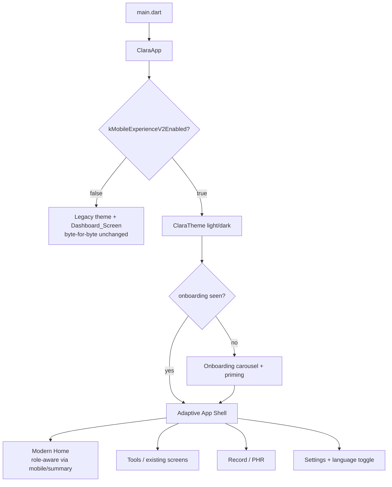
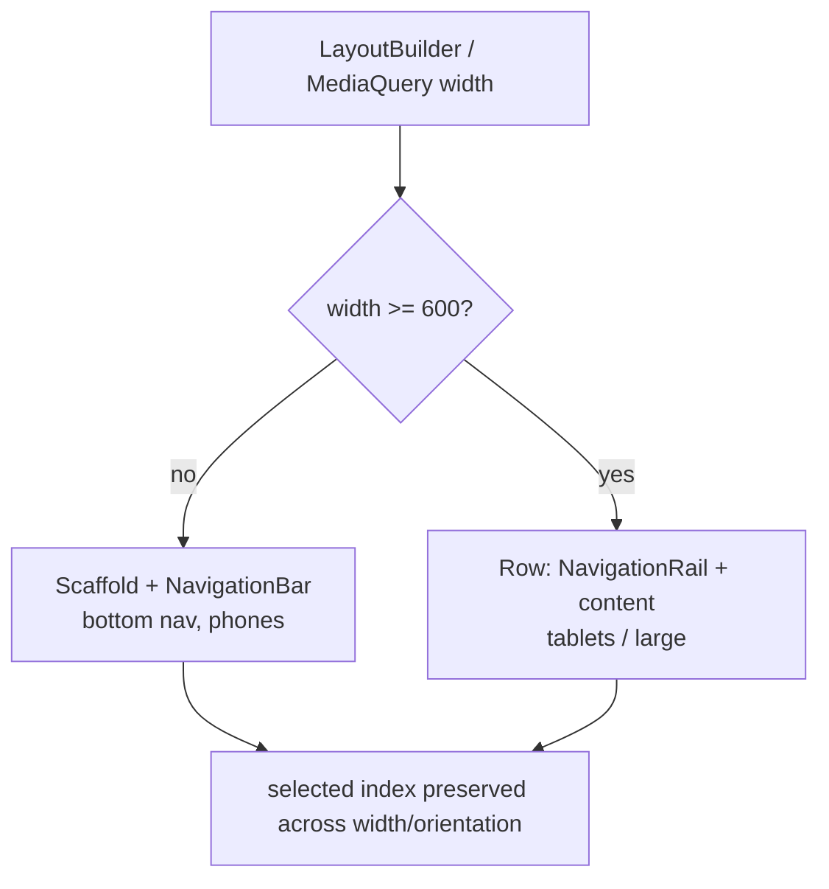

# Design Document

## Overview

This design modernizes the CLARA-Care Flutter mobile app (`apps/mobile/`) into a
polished, modern, easy-to-use experience — a Material 3 design system, an
adaptive app shell, a modern role-aware Home, first-run onboarding, polished
loading/empty/success/error states, tasteful micro-interactions, refreshed
branding, and a global vi/en language toggle. It is **purely additive and gated
behind one build flag**: `MOBILE_EXPERIENCE_V2_ENABLED` (default `false`). With
the flag off, the app is **byte-for-byte unchanged** — it boots through the
existing `ClaraApp` → `DashboardScreen` path with the existing teal Material 3
theme and the same CLARA_API calls.

The design **reuses** the primitives already in the repo rather than
re-inventing them:

| Concern | Reused module | How Experience_V2 uses it |
|---|---|---|
| Reduced motion / text scaling / semantics / ≥48dp | `lib/core/a11y.dart` | Components and shell resolve motion durations and text scaler through `A11y`; nav/onboarding controls wrap with `A11yLabeled` / `MinTapTarget` |
| Feature gating, fail-closed defaults | `lib/core/feature_flags.dart` | Add one build-time constant for the experience flag; Home reuses the existing role-scoped `mobile/summary` resolver |
| Consent + PII-guarded analytics | `lib/core/analytics.dart` | New coarse events (home viewed, onboarding completed/skipped, language changed) via the shared client; no PII |
| Error / offline states | `lib/widgets/error_retry_view.dart`, `lib/widgets/offline_banner.dart` | Polished states wrap these rather than new error widgets |
| Persistence | `flutter_secure_storage` (already in pubspec) | "onboarding seen" + language preference; no new dependency |

Nothing here changes a backend contract, the router, or the ML pipeline. The
flag only selects between the legacy surfaces and the new client-side
experience.

### The single flag (default OFF)

```dart
// lib/core/feature_flags.dart (additive)
const bool kMobileExperienceV2Enabled = bool.fromEnvironment(
  'MOBILE_EXPERIENCE_V2_ENABLED',
  defaultValue: false,
);
```

The flag is read at one place — `app.dart` — to choose the root surface. Every
Experience_V2 file is unreachable when the flag is off, so the off path loads
none of the new code paths and preserves today's behavior exactly (Requirements
1.1–1.3).

## Architecture

### Root selection (single decision point)



`ClaraApp` keeps its existing session-hydration `FutureBuilder` and
`ConsentGate`; Experience_V2 wraps the *authenticated* child only, so login,
hydration, and the consent gate behave identically. When the flag is off the
authenticated child is the legacy `DashboardScreen`, unchanged.

### Where it lives (all new files under `apps/mobile/lib/`)

- **Theme** (`lib/theme/`): `tokens.dart` (spacing/radius/elevation/duration +
  brand seed), `clara_theme.dart` (`ClaraTheme.light` / `ClaraTheme.dark`
  `ThemeData` builders), `typography.dart` (M3 text theme), and
  `components/` (`clara_button.dart`, `clara_card.dart`, `clara_chip.dart`,
  `clara_input.dart`, `section_header.dart`).
- **Experience** (`lib/experience/`): `experience_flag.dart` (re-exports the
  build flag), `app_shell.dart` (adaptive bottom-nav / nav-rail scaffold),
  `home_screen.dart` (modern Home), `onboarding/onboarding_carousel.dart` +
  `onboarding/onboarding_store.dart`, `language_controller.dart` +
  `language_store.dart`, and `states/` (`skeleton.dart`, `empty_state.dart`,
  `success_snackbar.dart`, `motion.dart` page-transition helpers).
- **Core** (`lib/core/`): extend `feature_flags.dart` additively with
  `kMobileExperienceV2Enabled`. Reuse `a11y.dart`, `analytics.dart` unchanged in
  contract.
- **App wiring** (`lib/app.dart`): single writer adds the flag branch.
- **Tests** (`test/`): add widget tests for shell, Home, onboarding,
  theme/components, plus the flags-off equivalence test and a no-PII property
  test. Keep existing tests green.
- **Branding** (docs only): `apps/mobile/README.md` (or `docs/branding.md`)
  documents display name, adaptive launcher icon, and themed splash steps; no
  binaries committed.

### Adaptive shell breakpoints



A single `selectedIndex` is held in the shell state and preserved across width
class changes (Requirement 3.2). Navigation transitions resolve through
`A11y.resolveMotionDuration`, collapsing to instant under reduced motion (3.4).

### Design principles

1. **One switch, two worlds.** The flag is read once; the off path is the
   untouched legacy app, the on path is Experience_V2. No surface straddles both.
2. **Reuse, don't reinvent.** A11y, analytics, feature-flag, and error/offline
   primitives are consumed, not duplicated; the design system standardizes their
   use across new surfaces.
3. **Tokens over literals.** Components read spacing/radius/elevation/typography
   from `tokens.dart`, so the look is consistent and tunable in one place.
4. **Accessible by construction.** Every interactive Experience_V2 control wraps
   with semantics + ≥48dp targets and resolves motion through the A11y module.
5. **No new PII, no new deps.** New analytics events are coarse and PII-free;
   persistence reuses `flutter_secure_storage`.

## Components and Interfaces

### A. Design system (Req 2)

- `ClaraTokens`: `const` spacing (`xs..xxl`), radius, elevation, and motion
  duration tokens; `brandSeed` color. No widgets — pure constants so components
  and tests share one source of truth.
- `ClaraTheme.light()` / `ClaraTheme.dark()` → `ThemeData` from
  `ColorScheme.fromSeed(seedColor: ClaraTokens.brandSeed, brightness: …)` with
  `useMaterial3: true`, the shared `TextTheme`, and component themes (buttons,
  cards, chips, inputs) wired to the tokens.
- Components (`ClaraPrimaryButton`, `ClaraSecondaryButton`, `ClaraCard`,
  `ClaraChip`, `ClaraInput`, `SectionHeader`): thin wrappers over M3 widgets that
  consume tokens, resolve text scaling/motion via `A11y`, and expose semantics.

### B. Adaptive app shell (Req 3)

- `AppShell({required List<ShellDestination> destinations, required int initialIndex})`:
  renders `NavigationBar` (compact) or `NavigationRail` (medium/expanded) by a
  600dp breakpoint, holds `selectedIndex`, and hosts the selected destination's
  body. Each destination carries an icon, vi/en label, and a builder. Nav
  controls use `MinTapTarget` + `A11yLabeled`.

### C. Modern Home (Req 4)

- `HomeScreen({required apiClient, required sessionStore})`: loads
  `GET /api/v1/mobile/summary` (same call/role semantics as `DashboardScreen`),
  renders a greeting, role-aware quick-action `ClaraCard`s (gated by the existing
  `MobileFeatureFlagResolver`), and a recent-items region. Fails closed on
  summary-load failure with an `ErrorRetryView` (Requirement 4.3); PHR card is
  always present (4.5); admin-only surfaces never shown to non-admin (4.4).

### D. Onboarding (Req 5)

- `OnboardingCarousel`: skippable paged intro + permission/consent priming
  copy; collapses paging animation under reduced motion. On finish/skip it calls
  `OnboardingStore.markSeen()`.
- `OnboardingStore`: thin wrapper over `flutter_secure_storage` exposing
  `hasSeen()` / `markSeen()` under a dedicated key. Emits a coarse, no-PII
  analytics event on completion/skip.

### E. Polished states (Req 6)

- `Skeleton` / `SkeletonList`: shimmer-free (or motion-aware) placeholder blocks
  sized from tokens.
- `EmptyState`: icon + Vietnamese-first title/body + optional action.
- `showSuccess(context, message)`: themed success snackbar/confirmation.
- Error/offline reuse the existing `ErrorRetryView` and `OfflineBanner`;
  scrollable surfaces wrap in `RefreshIndicator` for pull-to-refresh.

### F. Micro-interactions (Req 7)

- `motion.dart`: a `ClaraPageTransitionsBuilder` and helpers that read
  `A11y.resolveMotionDuration`; under reduced motion every duration resolves to
  `Duration.zero`, so transitions are instant and input is never blocked.

### G. Branding (Req 8) — documentation only

- Documented steps: display name (`android:label`, iOS `CFBundleDisplayName`),
  adaptive launcher icon (foreground/background layers + densities), themed
  splash (brand seed background, light/dark). Notes that
  `flutter_launcher_icons` / `flutter_native_splash` are the usual generators but
  are kept optional/manual so no dependency is forced and no binaries committed.
  Launch retains the existing session-hydration splash; no artificial delay.

### H. Language toggle (Req 9)

- `LanguageController` (a `ChangeNotifier`): holds the current `Locale`
  (`vi` default), exposes `setLanguage(...)`, persists via `LanguageStore` over
  `flutter_secure_storage`, and is read at the app root to apply app-wide.
  Toggling emits a coarse, no-PII analytics event.

## Data Models

All client-side, additive; no backend schema change.

### `ClaraTokens` (constants)
| group | members | note |
|---|---|---|
| spacing | xs, sm, md, lg, xl, xxl | logical px |
| radius | sm, md, lg, pill | corner radii |
| elevation | flat, raised, overlay | M3 tonal elevation |
| motion | fast, base, slow | base durations, resolved via A11y |
| brand | brandSeed | seed color for `ColorScheme.fromSeed` |

### `ShellDestination`
| field | type | note |
|---|---|---|
| icon | IconData | selected/unselected variants |
| labelVi | String | Vietnamese label (default) |
| labelEn | String | English label |
| builder | WidgetBuilder | destination body |

### `LanguagePref`
| field | type | note |
|---|---|---|
| locale | Locale | `vi` or `en`; defaults to `vi` |
| persistedKey | String | secure-storage key |

### `OnboardingState`
| field | type | note |
|---|---|---|
| seen | bool | persisted; false on first run |
| persistedKey | String | secure-storage key |

## Correctness Properties

### Property 1: Flags-off equivalence

With `MOBILE_EXPERIENCE_V2_ENABLED` false, the authenticated root resolves to the legacy `DashboardScreen`, no Experience_V2 surface is constructed, and reachable navigation equals the pre-feature baseline.

**Validates: Requirements 1.1, 1.2, 1.3, 2.6, 3.5, 4.6, 5.6, 6.6, 7.4**

### Property 2: Reduced-motion collapse

For any Experience_V2 animated surface, when reduced motion is requested every non-essential animation duration resolves to `Duration.zero`; functional state changes still occur.

**Validates: Requirements 2.4, 3.4, 5.4, 7.2, 7.3, 9.5**

### Property 3: Accessibility invariants

Every interactive Experience_V2 control exposes a non-empty semantics label and meets the ≥48dp minimum tap target, and status is conveyed by text/semantics, not color alone.

**Validates: Requirements 2.3, 3.3, 5.4, 9.3, 9.4, 9.5**

### Property 4: Home fail-closed gating

When `mobile/summary` cannot be loaded, the Home shows no privileged quick action and presents a retry; admin-only surfaces are never derived for a non-admin role; PHR is always reachable.

**Validates: Requirements 4.2, 4.3, 4.4, 4.5**

### Property 5: Onboarding persistence

After onboarding is completed or skipped once, `OnboardingStore.hasSeen()` returns true and onboarding is not shown on subsequent launches.

**Validates: Requirements 5.1, 5.3, 5.6**

### Property 6: Language persistence & default

The language preference defaults to Vietnamese, and a persisted selection round-trips across restart and is applied app-wide.

**Validates: Requirements 9.1, 9.2**

### Property 7: No-PII analytics

Every Experience_V2 analytics event (home viewed, onboarding completed/skipped, language changed) passes the existing redaction projection: no name/email/phone/free-text/medical content at any nesting depth, and identity is an opaque pseudonymous id.

**Validates: Requirements 5.5, 9.6**

## Error Handling

- Home and other Experience_V2 data surfaces reuse the existing fail-closed and
  error/offline patterns: a failed `mobile/summary` load shows `ErrorRetryView`
  with a retry and no privileged tiles (Requirement 4.3); offline surfaces show
  `OfflineBanner`.
- All Experience_V2 copy is Vietnamese-first and PII-free; backend `detail`
  strings are surfaced only when non-sensitive, otherwise a generic message.
- Persistence failures (secure storage unavailable) degrade gracefully:
  onboarding falls back to "not seen" (shows onboarding) and language falls back
  to the Vietnamese default, never crashing launch — mirroring `app.dart`'s
  existing hydrate `catchError` discipline.
- Branding/splash changes never introduce a fixed artificial delay; launch
  remains driven by session hydration (Requirement 8.5).

## Testing Strategy

- **Flags-off equivalence (Property 1):** with the build flag false, assert the
  authenticated root is the legacy `DashboardScreen` and that no Experience_V2
  widget is in the tree — the byte-for-byte off-path guarantee.
- **Widget tests (added):** `AppShell` (bottom-nav vs. rail by width; selected
  index preserved), `HomeScreen` (loading skeleton / success / empty / fail-
  closed error), `OnboardingCarousel` (skip + completion persists "seen"),
  theme/components (tokens applied; text scaling honored).
- **A11y + motion tests:** reduced-motion collapses Experience_V2 durations to
  zero (Property 2); interactive controls expose semantics and meet ≥48dp
  (Property 3), reusing the patterns in the existing `a11y_test.dart`.
- **Property tests (generated-input, no platform channels):** flags-off
  navigation equivalence (Property 1), no-PII across Experience_V2 event builders
  (Property 7). These run under `flutter test` matching the existing mobile test
  style.
- **Retained:** existing analytics, a11y, feature-flag, and session-store tests
  stay green; `flutter analyze` is clean.

## Backward-Compatibility, Guardrail & Privacy Strategy

The entire modernization sits behind one default-off flag, so the current app is
preserved exactly until explicitly enabled. No CLARA_API contract changes; no new
pubspec plugin dependency (persistence reuses `flutter_secure_storage`); the
existing a11y, analytics, and feature-flag contracts are extended only
additively. Analytics stays opaque-id + PII-stripped, copy is Vietnamese-first,
and the self-declared / decision-support-only positioning and existing
disclaimers are preserved on every modernized surface. Branding is documented,
not committed as binaries, and the launcher-icon/splash generator packages are
kept optional/manual.
