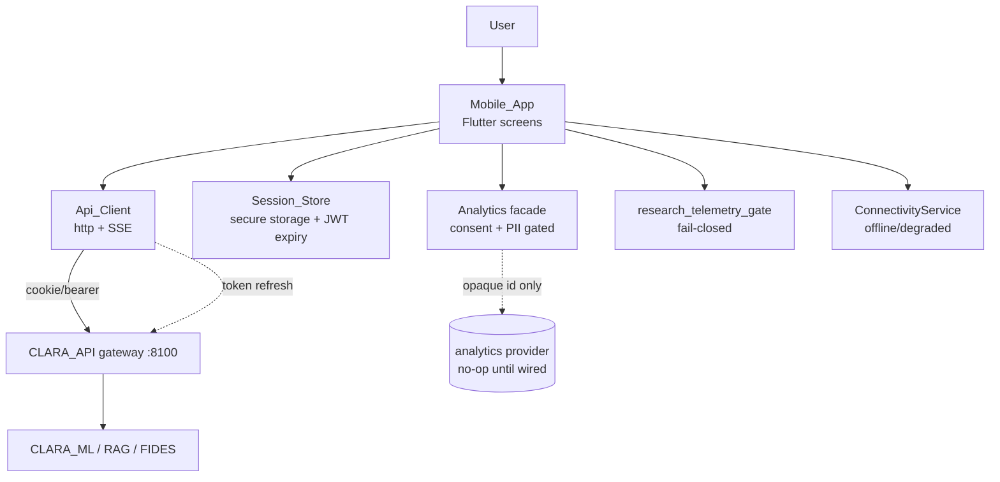
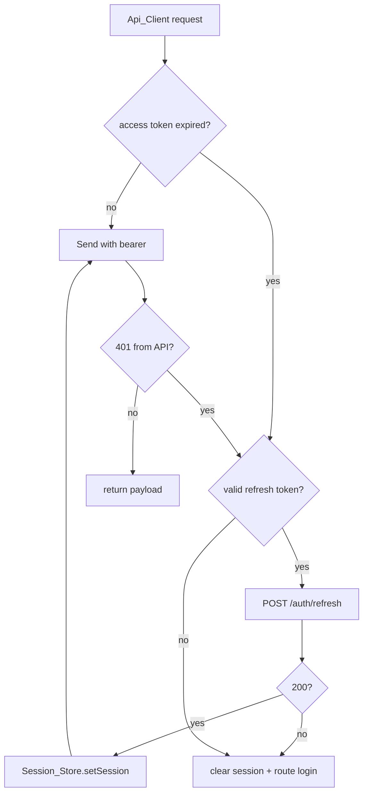
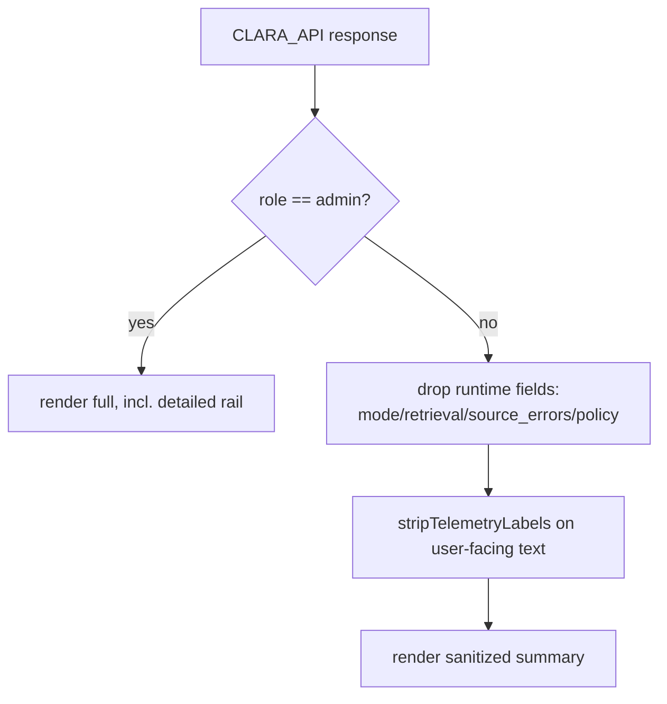

# Design Document

## Overview

This design brings the CLARA-Care Flutter mobile app (`apps/mobile/`) to **full
feature parity with the web app** and to **production-grade quality**. It is
purely **additive and flag-gated**: with every new flag off, the app is
byte-equivalent to today's six-screen starter, calling the same CLARA_API
contracts. Nothing here changes backend behavior, the router, or the RAG/ML
pipeline — all parity is achieved through additive Dart client code.

The work reuses the mobile primitives that already exist and only adds the
missing surfaces and the production seams around them:

| Capability | Web reference | Mobile today | Added by this design |
|---|---|---|---|
| Chat (streaming) | `chat/_v2/ChatShell`, `/chat/stream` SSE | — (missing) | `ChatScreen` + SSE consumer + End_User-safe answer view |
| Deep research | `research/*` job + SSE | `research_screen.dart` (present) | hardening: timeouts, backgrounding, recovery |
| Self-med cabinet | `selfmed/*` CRUD + consent gate | DDI analyze only | `SelfMedCabinetScreen` (list/add/delete) feeding existing DDI |
| Ambient scribe | `scribe/page.tsx` | — (missing) | `ScribeScreen` + transcribe/SOAP/consent |
| Enhanced PHR | `phr/page.tsx` | legacy record only | provenance/verification badges, export, emergency card |
| Auth lifecycle | register/verify/reset/refresh | login only | `AuthFlows` + token refresh in `Api_Client` |
| Transparency/disclosure | compliance Req 1 | — | notice gate + model-disclosure chips |
| Consent center / DSAR | `account/consent`, `account/data` | — | `ConsentCenterScreen`, `DsarScreen` |
| Sharing / deep links | `share/[token]` | — | read-only `SharedResourceScreen` |
| Offline / a11y / errors | implicit | partial | `ConnectivityService`, semantics, error states |

### Feature Flags (all default OFF / preserving current behavior)

Mobile flags are sourced two ways, both preserving current behavior when
absent: per-role flags from `GET /api/v1/mobile/summary` (`feature_flags`), and
compile-time `--dart-define` switches for surfaces not yet represented in the
summary contract.

```
# Remote-config (mobile/summary feature_flags) — server-owned, role-scoped
research                       # existing
careguard                      # existing
council                        # existing
system_monitor                 # existing

# Mobile remote/compile flags (additive, default false)
chat_mobile_enabled=false              # Chat surface (Req 1)
research_mobile_deep=false             # existing deep-research gate (Req 2)
selfmed_cabinet_mobile_enabled=false   # Self-med cabinet CRUD (Req 3)
scribe_mobile_enabled=false            # Scribe surface (Req 4)
phr_enhanced_mobile_enabled=false      # Enhanced PHR reads (Req 5)
transparency_notice_mobile_enabled=false   # AI notice gate (Req 7)
model_disclosure_mobile_enabled=false      # model/version chips (Req 7)
consent_center_mobile_enabled=false        # consent center + DSAR (Req 8)
sharing_mobile_enabled=false               # share / deep links (Req 12)
```

When a flag is off, the corresponding entry point is hidden/disabled and the
corresponding screen is unreachable, exactly reproducing today's navigation
(Requirements 13.2, 15.1, 15.2).

## Architecture

### System context



### Where it lives (all new files under `apps/mobile/lib/`)

- **Screens** (`lib/screens/`): add `chat_screen.dart`, `selfmed_cabinet_screen.dart`,
  `scribe_screen.dart`, `auth/` (register/verify/reset), `consent_center_screen.dart`,
  `dsar_screen.dart`, `shared_resource_screen.dart`, `legal_screen.dart`. Extend
  existing `research_screen.dart`, `careguard_screen.dart`, `phr_screen.dart`,
  `dashboard_screen.dart`.
- **Core** (`lib/core/`): extend `api_client.dart` (chat, chat-stream, scribe,
  selfmed, auth refresh, consent/DSAR, share, enhanced PHR); add
  `connectivity_service.dart`, `model_disclosure.dart`, `consent_state.dart`,
  `a11y.dart` (semantics + reduced-motion helpers). Reuse `analytics.dart`,
  `research_telemetry_gate.dart`, `session_store.dart` unchanged in contract.
- **Widgets** (`lib/widgets/`): shared `DisclaimerBanner`, `EndUserSafeAnswer`,
  `ErrorRetryView`, `OfflineBanner`, `ModelDisclosureChip`, `ProgressRail`.
- **Tests** (`test/`): keep existing unit/generated tests; add widget tests per
  screen and projection/PII property tests.

### Request flow — token refresh (Req 6)



### Request flow — End_User-safe answer projection (Req 1, 3, 4)



### Design principles

1. **Additive & reversible.** New screens/flags only; existing screens and
   contracts are untouched. Every new surface is dark by default.
2. **Reuse the safety primitives.** The fail-closed `research_telemetry_gate`,
   the consent/PII-guarded `analytics` facade, and the End_User-safe DDI/council
   projections are reused by the new chat/scribe/cabinet surfaces rather than
   re-implemented.
3. **No new PII surfaces.** Analytics stays opaque-id + PII-stripped; offline
   caches store only what the screen already displayed; no free-text medical
   content is ever logged or transmitted to analytics.
4. **Fail closed.** Unevaluable role ⇒ no telemetry + blocked job; unloadable
   summary ⇒ no privileged tools; absent disclosure data ⇒ no affordance.
5. **One networking seam.** Token refresh, timeouts, and offline detection live
   in `Api_Client` / `ConnectivityService` so every screen behaves consistently.

## Components and Interfaces

### A. Chat (Req 1)

- `Api_Client.chat({accessToken, payload})` → `POST /api/v1/chat`.
- `Api_Client.streamChat({accessToken, payload})` → `Stream<SseEvent>` over
  `POST /api/v1/chat/stream`, reusing the existing SSE line-parser.
- `ChatScreen` renders a message list; the assistant bubble uses
  `EndUserSafeAnswer` (citations + sanitized text), a standing
  `DisclaimerBanner`, and an emergency fast-path button. Streaming tokens append
  progressively; a terminal/error event closes the stream and preserves content.
- Gated by `chat_mobile_enabled`.

### B. Deep Research hardening (Req 2)

- Reuse `research_screen.dart`; add bounded SSE timeout and a
  background/foreground listener that converts an interrupted stream into a
  recoverable error (retry) rather than a hang. Telemetry rail stays gated by
  `evaluateTelemetryGate` (admin-only; fail-closed blocks the job).

### C. Self-Med Cabinet (Req 3)

- `Api_Client.getCabinet`, `addCabinetItem`, `deleteCabinetItem` →
  `/api/v1/selfmed/*`. `SelfMedCabinetScreen` lists items, supports add/delete
  behind a consent gate, enforces the two-medicine guard before routing to the
  existing CareGuard DDI analyze, and renders the existing End_User-safe DDI view.

### D. Ambient Scribe (Req 4)

- `Api_Client` adds `listScribeSessions`, `createScribeSession`,
  `getScribeSession`, `transcribeScribeAudio`, `regenerateScribeSession`,
  `captureScribeConsent`, `revokeScribeConsent`.
- `ScribeScreen` records/uploads audio, appends transcript, regenerates SOAP,
  and shows status; clinical text is passed through `stripTelemetryLabels`.
  Consent must be captured before audio is processed; absent consent blocks it.
  Gated by `scribe_mobile_enabled` and backend RBAC.

### E. Enhanced PHR (Req 5)

- Reuse `phr_screen.dart` legacy GET/PUT. Add provenance/verification badges
  (already modeled), and behind `phr_enhanced_mobile_enabled` expose read-only
  export (`/phr/export`) and emergency-card (`/phr/emergency-card`). Persistent
  self-declared disclaimer remains on every PHR surface.

### F. Auth lifecycle + token refresh (Req 6)

- `Api_Client` adds `register`, `verifyEmail`, `forgotPassword`, `resetPassword`,
  `refresh`, `logout`, `consentStatus`. A request interceptor checks
  `Session_Store.isExpired` (and reacts to 401) and refreshes via
  `POST /auth/refresh`, persisting the new tokens; on failure it clears the
  session. `AuthFlows` screens cover register/verify/reset, or deep-link out.

### G. Transparency & model disclosure (Req 7)

- `model_disclosure.dart`: `ModelDisclosure.fromResponse(json)` reads the
  model family/version and `is_fallback` (true iff local deterministic synth).
  `ModelDisclosureChip` renders it when present and the flag is on; otherwise
  the affordance is omitted. A versioned `AiTransparencyNotice` gate (mirroring
  web compliance) records acknowledgement before medical content when its flag
  is on.

### H. Consent center & DSAR (Req 8)

- `consent_state.dart` holds purpose-typed consent; `ConsentCenterScreen`
  lists purposes with grant/withdraw toggles wired to `/auth/consent` /
  `/phr/consent` as applicable. Withdrawing analytics consent calls
  `analytics.setConsent(granted:false)` immediately. `DsarScreen` submits DSAR
  requests and shows the acknowledgement. No PII in any client log.

### I. Offline & resilience (Req 9)

- `connectivity_service.dart` exposes an `isOnline` stream. `Api_Client`
  applies a bounded timeout to all requests and streams. Each data surface uses
  `ErrorRetryView` / `OfflineBanner`; reads may show a last-known value labeled
  stale; mutations are blocked offline with a clear message and preserved input.

### J. Accessibility (Req 10)

- `a11y.dart`: helpers for `Semantics` labels, a `prefersReducedMotion`
  resolver from `MediaQuery.disableAnimations` (mirroring web
  `usePrefersReducedMotion`), and assertions that interactive controls meet the
  ≥48dp target. Status is always conveyed by text/semantics, not color alone.

## Data Models

All client-side, additive; no backend schema change.

### `ChatMessage`
| field | type | note |
|---|---|---|
| role | enum(user, assistant) | |
| text | String | streamed/accumulated |
| citations | List<Citation> | title + optional url |
| disclosure | ModelDisclosure? | model family/version + isFallback |
| isStreaming | bool | true until terminal event |

### `ModelDisclosure`
| field | type | note |
|---|---|---|
| modelFamily | String | from response envelope |
| modelVersion | String | from response envelope |
| isFallback | bool | true iff local deterministic synth |

### `CabinetItem`
| field | type | note |
|---|---|---|
| id | int | |
| drugName | String | |
| source | enum(manual, ocr, barcode, imported) | |
| dosage | String? | |
| quantity | int | |
| expiresOn | String? | ISO date |

### `ScribeSessionModel`
| field | type | note |
|---|---|---|
| id | int | |
| title | String | |
| transcript | String | |
| soap | Map | normalized sections |
| status | enum(draft, ready, finalized, error) | |
| consentCaptured | bool | gate for audio processing |

### `ConsentPurpose` / `DsarRequestModel`
- `ConsentPurpose`: enum {coreService, personalization, research, crossBorder, sharing, analytics} + granted flag + version.
- `DsarRequestModel`: kind ∈ {export, correct, delete, restrict, withdraw} + acknowledgement id + status. No PII stored client-side.

## Correctness Properties

### Property 1: Flags-off equivalence

With every new mobile flag off, navigation, reachable screens, and API calls equal the pre-feature baseline (six screens, existing contracts).

**Validates: Requirements 15.1, 15.2**

### Property 2: Role-gated telemetry soundness

The detailed rail is shown iff role == `admin`; every other recognized role gets a sanitized summary; an unevaluable role exposes no telemetry and blocks the job.

**Validates: Requirements 2.3, 2.4**

### Property 3: End_User-safe projection

Chat, DDI, and scribe views never contain internal runtime fields (RAG/research/fallback mode, retrieval, connector source_errors, policy verdicts) for non-admin roles.

**Validates: Requirements 1.6, 3.4, 4.5**

### Property 4: Telemetry-label stripping idempotence

`stripTelemetryLabels(stripTelemetryLabels(x)) == stripTelemetryLabels(x)`, and no internal label survives.

**Validates: Requirements 2.3, 4.5**

### Property 5: No-PII analytics

Every event emitted from any screen passes a redaction projection (no name/email/phone/free-text query/drug/medication/symptom/allergy/diagnosis), at any nesting depth.

**Validates: Requirements 11.2, 11.5**

### Property 6: Pseudonymous identity

`identify` transmits an opaque id that never equals or contains the raw email/name, and is deterministic.

**Validates: Requirements 11.3**

### Property 7: Consent suppression

With analytics consent absent or withdrawn, the transport receives zero transmissions; granting consent begins transmission, withdrawing stops it.

**Validates: Requirements 8.4, 11.2**

### Property 8: Session round-trip

A valid login persists and restores across restart and clears completely on sign-out.

**Validates: Requirements 6.4, 6.5**

### Property 9: Token-expiry handling

An expired/invalid stored token clears the store on launch; an expired access token with a valid refresh token triggers a refresh, and a failed refresh clears the session.

**Validates: Requirements 6.2, 6.3**

### Property 10: Two-medicine DDI guard

A DDI/CareGuard analysis is never invoked with fewer than two distinct (case-insensitive) medicines.

**Validates: Requirements 3.3**

### Property 11: Disclosure correctness

The model-disclosure chip shows `isFallback` true iff the answer came from the local deterministic synth, and is omitted when disclosure data is absent.

**Validates: Requirements 7.3, 7.4, 7.5**

### Property 12: Offline write safety

While offline, mutating operations are blocked and surfaced to the user; entered input is preserved for retry.

**Validates: Requirements 9.4, 9.5**

### Property 13: Fail-closed navigation

When `mobile/summary` cannot be loaded, no privileged tool is shown and a retry is presented.

**Validates: Requirements 13.4, 13.5**

### Property 14: Accessibility invariants

Every interactive control exposes a semantics label and meets the ≥48dp target; reduced-motion suppresses non-essential animation.

**Validates: Requirements 10.1, 10.2, 10.4**

## Error Handling

- Network and SSE calls are **bounded by timeout**; a stalled request/stream
  becomes a recoverable error, never a hang (Req 9.2, 2.6).
- Auth: a 401 triggers at most one refresh attempt; a failed refresh clears the
  session and routes to login (Req 6.2, 6.3) — never an infinite refresh loop.
- All error copy is **Vietnamese-first and PII-free**; backend `detail` is shown
  only when it is non-sensitive, otherwise a generic message is used.
- Screen-level exceptions are contained (no app crash, no stack trace to user)
  via guarded `setState` and try/catch around async flows (Req 11.4).
- Mutations offline are blocked with a clear message and preserved input
  (Req 9.5); they are not silently queued in a way that could later apply stale
  clinical data.

## Testing Strategy

- **Unit / generated (existing, retained):** analytics (Properties 5–7),
  research telemetry gate (Property 2, 4), session store (Properties 8–9).
- **Property tests (added):** projection (Property 3), label-stripping
  idempotence (Property 4), no-PII across all screen event builders (Property 5),
  two-medicine guard (Property 10), disclosure correctness (Property 11),
  flags-off navigation equivalence (Property 1), token-refresh state machine
  (Property 9). These run as Dart generated-input tests (≥200 iterations) under
  `flutter test`, matching the existing mobile test style — no platform channels.
- **Widget tests (added):** each primary screen (chat, research, self-med
  cabinet, scribe, PHR, dashboard, login, consent center, DSAR) covering
  loading / success / empty / error states, with injected fakes for `Api_Client`,
  `Session_Store`, `ConnectivityService`, and a recording analytics transport.
- **Fail-closed widget tests:** non-admin sees the sanitized research rail; an
  unevaluable role blocks the job (Property 2 at widget level).
- **Offline widget tests:** with connectivity false, each surface shows the
  offline/error state and blocks mutations (Property 12).

## Backward-Compatibility, Guardrail & Privacy Strategy

Every existing invariant is preserved and, where touched, re-asserted by a new
test: the two-medicine DDI guard, the fail-closed telemetry gate, consent- and
PII-free analytics, secure-storage-only credentials, the self-declared /
decision-support-only PHR positioning, and RBAC-driven feature gating. New
surfaces ship dark (flags off), are enabled per role/environment, and require no
CLARA_API contract change — parity is additive client code only. The default API
base URL is aligned with the documented gateway port (`8100`) and remains
overridable via `--dart-define`.
