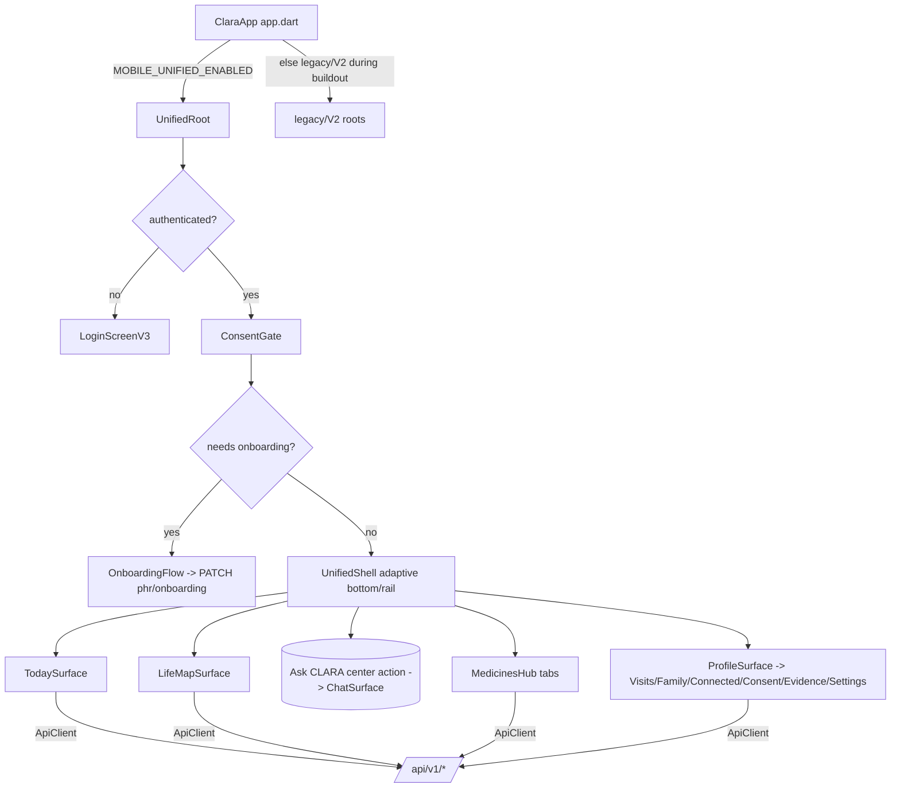

# Design — CLARA Mobile Unified

## Overview

One unified Flutter experience that matches the current web product and IA,
built on the existing Experience_V3 foundations (`web_palette`, `ClaraTokens`,
`ClaraTheme(polished)`, the `ChangeNotifier` controllers, `ApiClient`, shared
state widgets). It **absorbs** the good V3 surfaces (Cabinet, PHR, Scribe,
Settings, Login, Social), **adds** the missing consumer surfaces (Today, LifeMap,
Visits, Family, unified Medicines hub, onboarding), **rehomes** navigation to a
product-aligned shell, and **retires** the parallel legacy/V2 roots and dead code.

Guiding constraints:
- No server contract changes; all calls go through `ApiClient` on `/api/v1/*`.
- Reuse tested legacy widgets for Chat/Scribe/DDI where correct, but never the
  legacy shell or navigation.
- Guardrails (emergency fast-path, disclaimers, consent, no-PII analytics,
  offline guards, auth refresh) are invariants.
- Ships behind `MOBILE_UNIFIED_ENABLED` (now **default ON** after finalization;
  set `=false` to roll back).

## Architecture

## Components and Interfaces

### 1. Root & shell
- **`UnifiedRoot`** (`lib/experience/unified/unified_root.dart`): replaces the
  3-way branch for authenticated users when the flag is on. Wraps `ConsentGate`
  → `OnboardingGate` → `UnifiedShell`. Reuses `LoginScreenV3` when unauthenticated.
- **`UnifiedShell`** (`unified_shell.dart`): adaptive bottom nav (<600dp) / rail
  (≥600dp) with a **center Ask-CLARA action** (reusing the V3 centered-chat
  geometry). Destinations from a single `UnifiedDestination` list, role-aware.
  One active-state style via `web_palette`/status tokens.
- **Navigation:** stay on `Navigator` 1.0 (no new router dependency — matches the
  codebase and avoids scope creep). Primary destinations are in-shell
  `IndexedStack`; secondary surfaces are pushed routes.

### 2. New consumer surfaces (native, on `ApiClient`)
- **`TodaySurface`** — `GET /lifemap/today`; complete task
  `POST /lifemap/tasks/{id}/complete` (Idempotency-Key). Empty/error/offline via
  shared widgets. 409 → route to onboarding.
- **`LifeMapSurface`** — list episodes; create episode; add+accept task; optional
  next-question (flag/404 aware). All mutations Idempotency-Key.
- **`MedicinesHub`** — a `TabBar`/segmented control over three sections:
  `MedicinesListTab` (medication-courses), `CabinetTab` (reuse `CabinetScreenV3`
  logic), `SafetyTab` (reuse DDI `analyzeCareguard`). Consent gate + disclaimers
  preserved.
- **`VisitsSurface`** + **`FamilySurface`** — new `ApiClient` wrappers for
  `/visits/*`, `/visit-packs/*`, `/family/*`, `/care-tasks/*`; header-based family
  invitation acceptance.
- **`ProfileSurface`** — rehome of `MoreScreenV3` as a product "Profile" hub:
  PHR entry, Visits, Family Circle, Connected Health, Consent Center, Evidence,
  Settings, Guide — role-aware.

### 3. Reused surfaces (absorbed, entry via unified shell only)
- Chat (center action) → reuse `ChatScreen` streaming/emergency logic.
- Scribe/Council/Research → reached from Profile/role area, reuse existing
  screens; wire `CouncilSurfaceV3` in or delete it (no test-only dead code).
- PHR (`PhrSurfaceV3`), Settings (`SettingsScreenV3`), Social (`SocialSurfaceV3`).

### 4. `ApiClient` additions (new wrappers, `/api/v1/*`)
- LifeMap: `getLifeMapToday`, `createEpisode`, `createEpisodeTask`, `acceptTask`,
  `completeTask`, `createEvent` (all mutations take an `idempotencyKey`).
- Medication courses: `getMedicationCourses`, `createMedicationCourse`.
- PHR onboarding: `getPhrOnboarding`, `updatePhrOnboarding`.
- Visits: `listVisits`, `createVisit`, `getVisit`, `addConcern`, `answerIntake`,
  `extractPlan`, `confirmPlan`, `createVisitPack`, `approveVisitPack`.
- Family: `listRelationships`, `listFamilyNotifications`, `acknowledgeNotification`,
  `listAccessGrants`, `revokeAccessGrant`, `getAccessLog`, `inviteFamily`,
  `acceptFamilyInvitation` (header token).
- Evidence (optional, phase-gated): question create/confirm/run + run reads.
- A single private `_idempotencyKey()` helper (UUID-ish from time + random).

### 5. Idempotency & precision notes (from API audit)
- `lifemap_insights` and `evidence_questions` routers carry **no `/lifemap`
  prefix**: paths are `/api/v1/baselines`, `/api/v1/episodes/{id}/...`,
  `/api/v1/decisions/...`. Wrappers must use those exact paths.
- `medication-courses` list/create use an **empty route path** under the mount:
  `GET/POST /api/v1/medication-courses` (no trailing segment).
- All LifeMap mutations, `visits/plan/confirm`, `medication-courses` POST, and
  `evidence-questions/run` require an `Idempotency-Key` header.

## Data & state
- Continue the `ChangeNotifier` + constructor-injection pattern. New lightweight
  controllers only where a surface needs cross-widget state (e.g. `MedicinesHub`
  tab/consent). No new state-management dependency.
- Reuse `SessionStore`, `ConsentStore`, `ThemeController`, `LanguageController`.

## Theming
- Unified experience always uses `ClaraTheme.light/dark(polished: true)` →
  `webColorScheme` + `ClaraStatusColors`. Remove teal-seed usage from the unified
  path. Glass stays opt-in, chrome-only, opaque fallback (unchanged policy).

## Error handling & offline
- Every data surface: loading skeleton → content | `EmptyState` | `ErrorRetryView`;
  offline banner + mutation guard via `ConnectivityService`. Preserve `ApiClient`
  auth refresh + single 401-retry.

## Testing strategy
- Widget tests per new surface: render + empty + error + safety-gate (consent /
  disclaimer / offline). Reuse `test/fakes/FakeApiClient`, `FakeSessionStore`.
- Nav test: consumer primary order is Today, LifeMap, Medicines, Profile with Ask
  center action; Chat is not a primary conceptual home.
- Flag-off equivalence test until finalization.
- Keep pre-existing 22 legacy failures out of scope; do not regress the 369
  currently-green tests.

## Rollout / phases
Behind `MOBILE_UNIFIED_ENABLED`. During build-out it defaulted OFF so each phase
shipped dark and green; the finalization phase flipped the default ON, updated the
boot tests to verify the unified root, and documented the `=false` rollback path.

## Non-goals
- No new routing/state-management package.
- No server behavior change beyond already-specced, flagged mobile summary flags.
- Liquid-glass full visual program (separate spec) — only ensure opaque-safe.
- Wearable device adapters (blocked on external SDKs) — connected-health read/
  lifecycle only.
