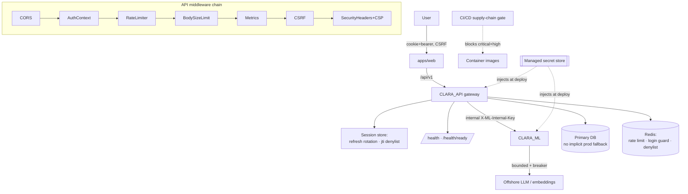
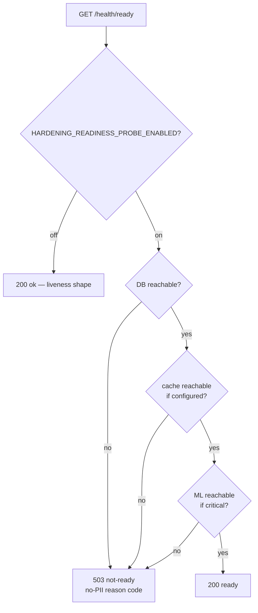
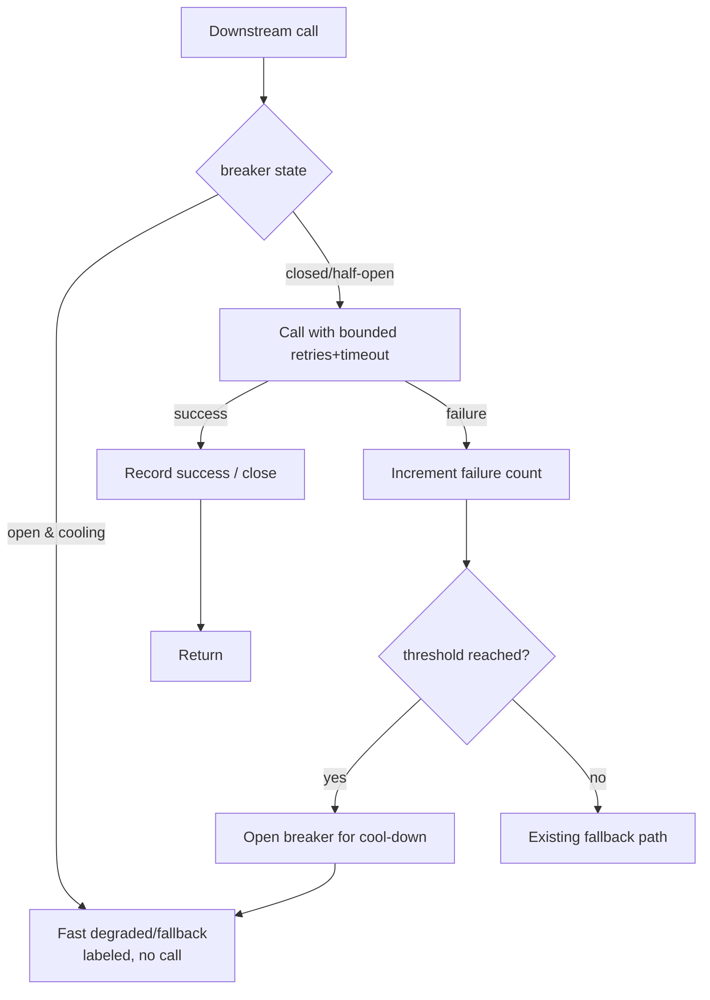

# Design Document

## Overview

This design hardens CLARA-Care to production grade across authentication/
authorization, reliability/resilience, performance, and security. It is purely
**additive and feature-flagged**; with every hardening flag off the system
behaves exactly as today. Nothing here changes clinical reasoning, the router,
or the RAG ranking pipeline.

The design reuses the platform's existing seams rather than rebuilding them:

| Hardening goal | Existing CLARA mechanism (reused) | New seam (added) |
|---|---|---|
| Secret management / rotation | `Settings` (pydantic) + prod startup guards in `main.py` | Managed-secret-store sourcing, plaintext-default removal, rotation runbook + key-overlap verify hook |
| Session hardening | `create_/decode_*_token`, `jti`, `AUTH_REFRESH_REJECT_CONFLICT`, `LoginGuard` | Refresh rotation + `jti` denylist (Redis-backed), reuse-detection event, fail-closed login mode |
| Authorization coverage | `require_roles`, `AuthContextMiddleware`, ML internal-key guard | Route-classification inventory + coverage test |
| Input validation / limits | Pydantic schemas, ML `_MAX_AUDIO_BYTES` | Body-size middleware + documented list/batch caps |
| Rate limiting / abuse | `RateLimiterMiddleware`, `RedisSecurityStore`, research-job caps | Fail-closed fallback + documented production config |
| Graceful degradation / probes | Static `/health`, `db/session.py` fallback, local synth fallback | Readiness probe, container healthchecks, circuit breaker, prod-fallback opt-in |
| Structured logging / no-PII | `logging`, `secure_error_messages`, `compliance/redaction.py` | JSON log config + redaction filter + correlation id |
| Dependency / supply chain | `ci.yml` pip-audit + npm audit + Trivy, `dependabot.yml` | Tighter gate (block highs on default branch), accepted-findings inventory |
| Backup / migration safety | Alembic migrations + `migration_guard.py` | Backup/restore runbook + drill + pre-migrate backup gate |
| Performance / resource | `pool_pre_ping`, timeout-floor invariant, retry/backoff | Worker + pool sizing, circuit breaker, bounded retries |

### Feature Flags (all default to current behavior)

```
HARDENING_REFRESH_ROTATION_ENABLED=false     # rotate + invalidate refresh tokens on exchange
HARDENING_TOKEN_DENYLIST_ENABLED=false        # revoke jti on logout, consult on each request
HARDENING_LOGIN_FAIL_CLOSED=false             # keep login throttling when limiter backend is down
HARDENING_RATE_LIMIT_FAIL_CLOSED=false        # fall back to in-process limiter instead of disabling
HARDENING_REQUEST_BODY_LIMIT_ENABLED=false    # enforce max request body size
HARDENING_READINESS_PROBE_ENABLED=false       # dependency-aware /health/ready
HARDENING_CIRCUIT_BREAKER_ENABLED=false       # open breaker on repeated downstream failures
HARDENING_STRUCTURED_LOGGING_ENABLED=false    # JSON logs + redaction filter + correlation id
HARDENING_CSP_ENABLED=false                   # Content-Security-Policy response header
```

Operational hardening that is configuration- or CI-only (secret sourcing,
prod-fallback opt-in, supply-chain gate thresholds, backup jobs, worker/pool
sizing) is governed by deploy/CI configuration rather than runtime flags, and is
described below. When a runtime flag is off, the corresponding enforcement is
skipped and behavior matches today (Requirement 11.1, 11.2).

## Architecture

### System context



### Where it lives

- **API (`services/api/src/clara_api/`)**: additive middleware (body-size limit,
  CSP header, structured-logging filter), a readiness router under the existing
  health module, a small `SessionSecurity` helper (refresh rotation + denylist)
  consulted by the auth endpoints, and new `HARDENING_*` settings in
  `core/config.py`. The DB-fallback default in `db/session.py` is governed by
  configuration only — no code semantics change is required, but the deploy
  stack stops forcing `DATABASE_FALLBACK_ENABLED=true` in production.
- **ML (`services/ml/src/clara_ml/`)**: a circuit-breaker wrapper around the
  existing DeepSeek/embedding client retry loop, and the structured-logging
  filter. The existing `/health` stays; `/health/details` is reused for
  readiness inputs.
- **Web (`apps/web`)**: no behavioral change; benefits from CSP and the
  dependency remediation.
- **Deploy (`deploy/docker/*`)**: remove plaintext default secrets, add
  `api`/`ml`/`web` healthchecks, stop defaulting production DB fallback on, and
  document worker/pool sizing.
- **CI/CD (`.github/workflows/*`)**: strengthen the supply-chain gate to block
  high-severity findings on the default branch, add a pre-migrate backup step
  and a migration-downgrade check, and keep the Trivy container scan.

### Request flow — readiness probe (Req 6)



### Request flow — circuit breaker (Req 6.5)



### Design principles

1. **Additive & reversible.** New settings, middleware, and helpers only. No
   destructive schema or behavior change; every runtime change is flag-gated.
2. **Fail closed for security, fail open for safety.** Security controls (rate
   limit, login throttle) gain a fail-closed mode; the emergency fast-path and
   medical disclaimers always render even under degradation.
3. **Reuse, don't reinvent.** Denylist and fail-closed modes reuse
   `RedisSecurityStore`; redaction reuses the compliance redaction projection;
   the breaker wraps the existing retry loop and local fallback.
4. **Honest signals.** Readiness reflects real dependency state; logs and
   metrics carry correlation ids but never PII.
5. **No new PII surfaces.** Reuse-detection events, breaker events, and audit
   records store types, counts, and opaque references only.

## Components and Interfaces

### A. Secret management & rotation (Req 1)

- Remove plaintext `${VAR:-secret}` defaults from
  `deploy/docker/docker-compose.app.yml` (JWT key, bootstrap admin password, ML
  internal key, Postgres/MinIO/Neo4j credentials); require these as
  externally-injected values, mirroring the `:?required` pattern already used in
  `docker-compose.deploy.yml` for `DATABASE_URL`/`JWT_SECRET_KEY`.
- A `docs/ops/secret-rotation.md` runbook enumerates each secret, its store
  location, rotation steps, and the JWT key-overlap procedure.
- The startup guards in `main.py` already reject `change-me` JWT keys and
  insecure bootstrap passwords in production; extend the documented set and add a
  no-secret-value-leak assertion to the logging filter.
- **SSH deploy credential**: the exposed password is rotated and SSH password
  auth is replaced with key-based auth; the private key lives only in the
  managed secret store / CI encrypted secrets. Recorded as completed in the
  rotation runbook.

### B. Session security — `SessionSecurity` (Req 2)

- `rotate_refresh(old_jti, subject, role) -> (new_refresh, new_jti)` invalidates
  `old_jti` (denylist + rotation marker in Redis) and mints a new refresh token;
  gated by `HARDENING_REFRESH_ROTATION_ENABLED`.
- `is_revoked(jti) -> bool` consulted by `get_current_token` when
  `HARDENING_TOKEN_DENYLIST_ENABLED`; logout adds the access+refresh `jti` with a
  TTL equal to the token's remaining lifetime.
- `record_reuse(jti)` writes a no-PII reuse-detection event when an invalidated
  refresh token is presented.
- Login fail-closed: when `HARDENING_LOGIN_FAIL_CLOSED` and the distributed
  limiter backend is unavailable, `LoginGuard` falls back to the in-process
  guard instead of returning 0 (no throttle).

### C. Authorization coverage (Req 3)

- A route-classification inventory (a test fixture) lists every API route as
  `public`, `authenticated`, or `role:<name>`; a coverage test fails if a route
  exists without a classification or a role-restricted route lacks a role
  dependency. Reuses the FastAPI route table.

### D. Input validation & request limits (Req 4)

- `RequestBodyLimitMiddleware` (gated) rejects bodies above a configurable
  maximum with a 413-class JSON response; preserves ML `_MAX_AUDIO_BYTES`.
- Documented list/batch caps reaffirm the existing research-job caps and add
  explicit maxima where unbounded.

### E. Rate limiting & abuse (Req 5)

- `RateLimiterMiddleware` gains a fail-closed branch: when distributed limiting
  is enabled but the backend is down, fall back to the in-process limiter
  (`HARDENING_RATE_LIMIT_FAIL_CLOSED`) instead of passing through.
- Deploy docs recommend `RATE_LIMIT_DISTRIBUTED_ENABLED=true` +
  `AUTH_LOGIN_DISTRIBUTED_ENABLED=true` with `REDIS_URL` in multi-replica
  production, and flag the current `false` defaults as insecure-by-omission.

### F. Health, readiness & degradation (Req 6)

- `GET /health` / `/api/v1/health` stay as liveness (unchanged shape).
- `GET /health/ready` (gated) probes DB (`SELECT 1`), Redis (if configured), and
  ML (`/health`) and returns 200 `ready` or 503 with a no-PII reason code.
- Deploy compose adds healthchecks for `api` (`/health`), `ml` (`/health`), and
  `web` (`/`).
- `CircuitBreaker` wraps the DeepSeek/embedding client: after N consecutive
  failures it opens for a cool-down window and returns the existing labeled
  local fallback without making the call.
- Production DB fallback is **off by default**: the deploy stack and CD stop
  emitting `DATABASE_FALLBACK_ENABLED=true`; enabling it in production requires
  an explicit, documented decision. The in-code prod guard already refuses
  implicit fallback.

### G. Structured logging without PII (Req 7)

- `configure_logging(settings)` installs a JSON formatter and a `RedactionFilter`
  (reusing the compliance redaction projection) when
  `HARDENING_STRUCTURED_LOGGING_ENABLED`; otherwise the current logging stands.
- A correlation-id middleware attaches a per-request id surfaced in logs and the
  response header; the generic exception handler logs error type + correlation
  id, never request bodies.

### H. Supply-chain gate (Req 8)

- `ci.yml` `security-audit` becomes blocking on HIGH and CRITICAL for
  default-branch pushes and PRs to `main`; `pip-audit` covers api+ml,
  `npm audit` covers web (with dev where feasible), Trivy keeps scanning images.
- `docs/security/accepted-findings.md` records any unfixable finding with a
  compensating control and a review date.

### I. Backup / migration safety (Req 9)

- `docs/ops/backup-restore.md` defines the Postgres backup schedule, retention,
  and a rehearsed restore drill.
- CD gains a pre-migrate backup step and a migration-downgrade presence check;
  the existing `migration_guard` continues to require migration-managed schema in
  production.

### J. Performance & resource limits (Req 10)

- Deploy docs set API/ML `UVICORN_WORKERS` to production values and define DB
  pool sizing relative to workers; `pool_pre_ping` stays. Every outbound call
  keeps an explicit timeout; retries stay bounded by the existing
  `DEEPSEEK_RETRIES_PER_BASE` ceiling.

## Data Models

All new state is small, additive, and stored in Redis (ephemeral, TTL-bound) or
as configuration/docs. No relational schema change is required.

### Redis keys (reusing `RedisSecurityStore`, prefix `clara:sec`)

| key | value | TTL | note |
|---|---|---|---|
| `clara:sec:jti:deny:<sha256(jti)>` | `1` | token remaining lifetime | revoked/rotated token id; no PII |
| `clara:sec:refresh:rot:<sha256(jti)>` | `1` | refresh lifetime | rotation marker for reuse detection |
| `clara:sec:reuse:<bucket>` | counter | window | no-PII reuse-detection event count |
| `clara:sec:cb:<dependency>` | state+count | cool-down | circuit-breaker state |

### Configuration records (docs, version-controlled)

- `docs/ops/secret-rotation.md`, `docs/ops/backup-restore.md`,
  `docs/security/accepted-findings.md`, `docs/ops/hardening-rollout.md` — all
  human-authored, no PII.

## Correctness Properties

*A property is a characteristic or behavior that should hold true across all valid executions of a system — essentially, a formal statement about what the system should do. Properties serve as the bridge between human-readable specifications and machine-verifiable correctness guarantees.*

### Property 1: Flags-off equivalence

For any request, with every `HARDENING_*` flag off, request/response shapes and side effects equal the pre-feature baseline.

**Validates: Requirements 11.1, 11.2**

### Property 2: No plaintext production secret

For any compose file or workflow in the deploy stack, no production secret is provided as a usable plaintext default; a scan finds none.

**Validates: Requirements 1.1, 1.6**

### Property 3: Fail-fast on missing secret

For any required production secret left absent, startup raises a descriptive error that contains no secret value rather than starting with an insecure default.

**Validates: Requirements 1.2**

### Property 4: Refresh rotation invalidates the old token

For any refresh-token exchange with rotation enabled, a new refresh token is issued and a subsequent presentation of the prior refresh token is rejected.

**Validates: Requirements 2.2, 2.3**

### Property 5: Reuse detection is recorded without PII

For any replayed (invalidated) refresh token, a reuse-detection event is recorded whose payload contains no PII.

**Validates: Requirements 2.3**

### Property 6: Denylisted token is rejected

For any token whose `jti` is denylisted after logout with the denylist enabled, the token is rejected on subsequent requests until its natural expiry.

**Validates: Requirements 2.4**

### Property 7: Login fail-closed

For any login attempt with fail-closed enabled and the distributed limiter backend unavailable, login throttling still applies and is not silently disabled.

**Validates: Requirements 2.5**

### Property 8: CSRF preserved

For any cookie-authenticated mutating request, a missing or invalid CSRF token causes rejection while a valid token permits it; bearer-authenticated requests remain exempt.

**Validates: Requirements 2.6, 11.3**

### Property 9: Route coverage

For every registered API route, an access classification exists, and every role-restricted route carries a role dependency.

**Validates: Requirements 3.2, 3.3**

### Property 10: Body-size enforcement

For any request with the body-size limit enabled, a body above the configured maximum is rejected with a 413-class response and a body at or below it is accepted.

**Validates: Requirements 4.1**

### Property 11: Ownership enforcement

For any client-supplied resource identifier, a subject can read or mutate the resource if and only if the subject owns it (or holds an authorized role).

**Validates: Requirements 4.4**

### Property 12: Rate-limit fail-closed

For any request stream with rate-limit fail-closed enabled and the distributed backend unavailable, the in-process limiter still enforces the configured cap.

**Validates: Requirements 5.3**

### Property 13: Proxy-trust soundness

For any request, a forwarded client IP is honored only when the immediate peer is a trusted proxy; otherwise the immediate peer address is used.

**Validates: Requirements 5.6**

### Property 14: Readiness reflects dependencies

For any dependency state with the readiness probe enabled, an unavailable critical dependency yields a 503 not-ready response while the liveness probe stays 200 if the process is healthy.

**Validates: Requirements 6.1, 6.2**

### Property 15: Liveness preserved

For any request to `/health`, `/api/v1/health`, or ML `/health`, the endpoint returns its current 200 liveness shape.

**Validates: Requirements 6.3**

### Property 16: Circuit breaker opens and degrades

For any sequence of downstream failures reaching the threshold, further calls are short-circuited to a labeled degraded/fallback response for the cool-down window, after which a half-open probe attempts recovery.

**Validates: Requirements 6.5**

### Property 17: No implicit prod DB fallback

For a production environment with fallback unset, the engine builder refuses implicit fallback to the ephemeral SQLite database and raises a descriptive error.

**Validates: Requirements 6.6**

### Property 18: Timeout-floor invariant preserved

For any timeout configuration, startup rejects an API ML request timeout that sits below the downstream synthesis floor.

**Validates: Requirements 6.7, 10.3**

### Property 19: No-PII logging

For any payload fed into a structured log, metric, or alert, the emitted projection contains no PII (names, emails, free-text queries/answers, drug lists, PHR).

**Validates: Requirements 7.2, 7.3**

### Property 20: Secure error messages preserved

For any unhandled error in production, the 5xx client response contains no internal detail (no stack trace, exception text, or internal identifiers).

**Validates: Requirements 7.4**

### Property 21: Supply-chain gate severity

For any dependency-vulnerability finding, the CI supply-chain gate exits non-zero on a critical finding and, for default-branch changes, on a high-severity finding.

**Validates: Requirements 8.2**

### Property 22: Accepted-findings completeness

For every ignored or unfixable finding, the accepted-findings record contains a justification, a compensating control, and a review date.

**Validates: Requirements 8.4, 8.6**

### Property 23: Migration downgrade presence

For every migration to be deployed, the migration module defines a downgrade and the deploy is preceded by a backup step.

**Validates: Requirements 9.3**

### Property 24: Migration-managed schema preserved

For a production environment, the schema guard rejects a schema produced by the create-all fallback rather than by migrations.

**Validates: Requirements 9.4**

### Property 25: Bounded retries

For any LLM or external dependency call, the number of retry attempts never exceeds the configured per-base ceiling.

**Validates: Requirements 10.4**

### Property 26: Guardrail preservation

For any request with hardening flags on or off, the emergency fast-path, FIDES CRITICAL-claim blocking, and no-PII telemetry remain intact.

**Validates: Requirements 11.3**

## Error Handling

- Security controls **fail closed** when their flag enables it (login throttle,
  rate limit), and **fail open for safety** otherwise so availability is not
  reduced by a misconfiguration.
- The readiness probe distinguishes liveness from readiness so orchestration
  restarts only truly-dead processes.
- The circuit breaker never raises into the request path; it returns the
  existing labeled fallback.
- All new endpoints and middleware return descriptive, PII-free errors; the
  generic 500 handler keeps the production secure-message behavior.

## Testing Strategy

- **Property tests** (`hypothesis` for Python under `services/api/tests` and
  `services/ml/tests`) for Properties 1–26, each tagged
  `Feature: clara-platform-hardening, Property {n}`, run ≥100 iterations.
- **Flags-off regression gate**: a test asserting that with every `HARDENING_*`
  flag off, the middleware chain, auth flow, health endpoints, and response
  envelopes are equivalent to baseline (Property 1).
- **No-PII CI guard**: feed adversarial PII into log/metric/alert writes and
  assert the persisted/emitted projection drops it (Property 19).
- **Deploy-stack scan test**: assert no compose file or workflow contains a
  usable plaintext production-secret default (Property 2).
- **Route-coverage test**: enumerate the FastAPI route table and assert each
  route is classified and role-gated as declared (Property 9).
- **CI gate self-test**: a workflow-level assertion that the supply-chain gate
  exits non-zero on a seeded high-severity finding for default-branch changes
  (Property 21).
- **Migration safety test**: assert every migration module defines `downgrade`
  and that CD runs a pre-migrate backup step (Property 23).

## Backward-Compatibility, Guardrail and Privacy Strategy

Every existing invariant (RBAC, CSRF, emergency fast-path, FIDES CRITICAL block,
no-PII telemetry, the timeout-floor invariant, the production migration guard) is
preserved and, where relevant, re-asserted by a new test. The feature ships dark
(runtime flags off), is enabled per environment in the staged order documented in
`docs/ops/hardening-rollout.md`, and each flag is independently reversible
without redeploying clinical code. Operational/CI hardening (secret sourcing,
prod-fallback opt-in, supply-chain thresholds, backups, worker/pool sizing) is
applied through deploy and CI configuration and is likewise reversible.
