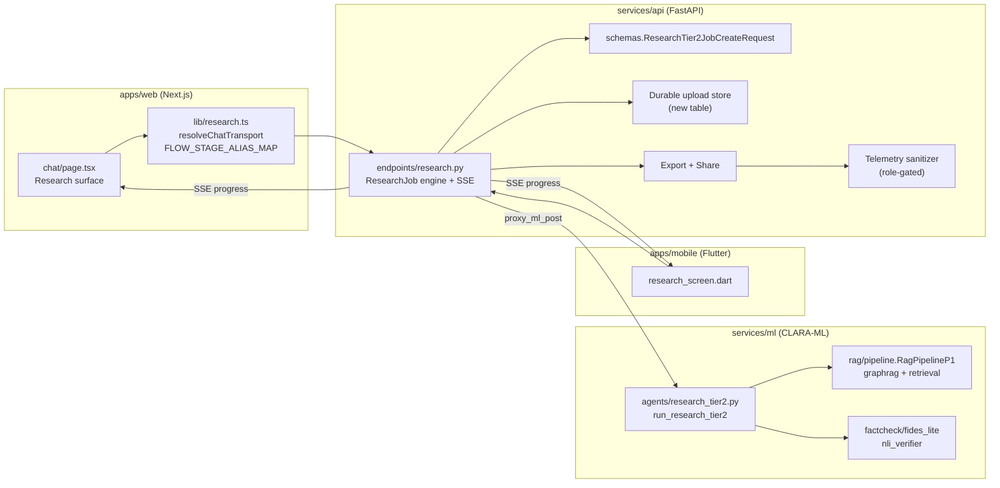
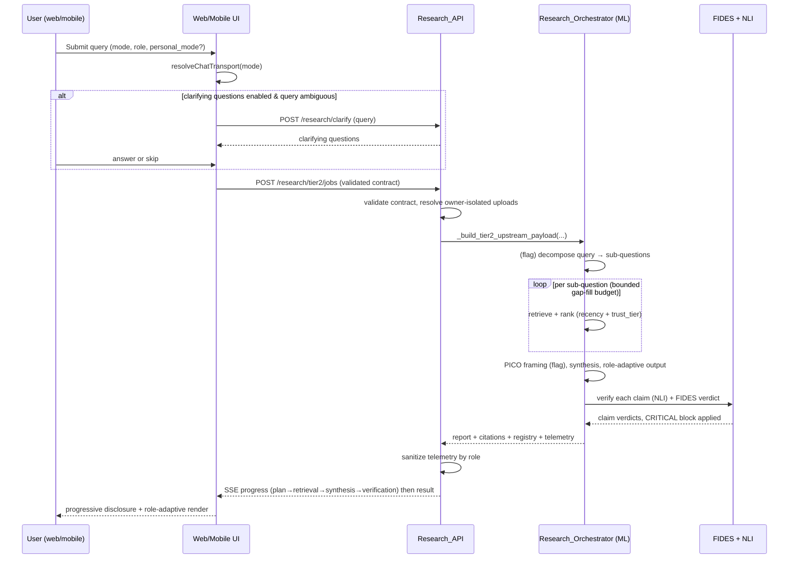
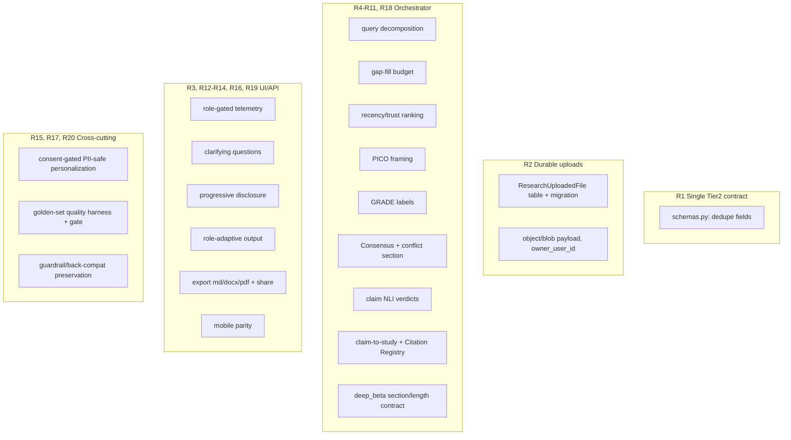
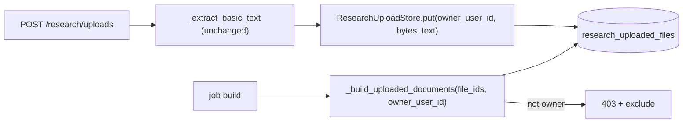
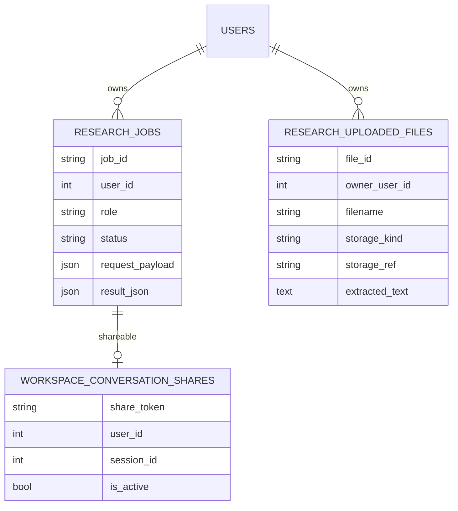

# Design Document

## Overview

This design enhances the existing **CLARA Research** feature (deep-research and
evidence-synthesis) across web, API, and ML so that it becomes a competitive,
EBM-grounded evidence-synthesis product while staying a **decision-support tool, not a
medical device**. Every behavior introduced here is **additive and feature-flagged**, defaults
**off**, and preserves the current code paths and medical-safety guardrails.

The work reuses the seams that already exist rather than rebuilding them:

| Concern | Existing seam reused |
| --- | --- |
| Web transport routing | `resolveChatTransport(mode)` in `apps/web/lib/research.ts` |
| Stage naming / telemetry mapping | `FLOW_STAGE_ALIAS_MAP` in `apps/web/lib/research.ts` |
| API → ML request shaping | `_build_tier2_upstream_payload()` in `endpoints/research.py` |
| Federated sources | Source Hub catalog + `_build_source_hub_documents()` |
| RAG runtime config | `rag_flow` / `rag_sources` (Control Tower) via `_load_research_rag_runtime()` |
| Claim verification | `factcheck/fides_lite.run_fides_lite` + `nli_verifier.verify_claims` |
| Report contract | `_REQUIRED_DEEP_BETA_MARKDOWN_HEADINGS` + `DEEP_BETA_REPORT_MIN_WORDS` |
| Async job engine | `ResearchJob` model + ThreadPool engine + SSE stream |
| Read-only sharing | `WorkspaceConversationShare` model + `/workspace/.../share` endpoints |

The design also resolves four known defects:

1. **Duplicated Tier2 request contract** — `ResearchTier2JobCreateRequest` currently declares
   `deep_pass_count`, `ui_language`, and `llm_runtime` **twice**, with conflicting bounds
   (`le=20` then `le=6`). We collapse these to a single authoritative definition.
2. **Non-durable uploaded files** — `_uploaded_research_files` is a process-local in-memory
   `dict`, so uploads vanish on restart and are invisible to other workers. We replace it with a
   DB-backed, owner-isolated table.
3. **Mis-gated telemetry** — the detailed telemetry rail is gated on a localStorage flag rather
   than the user role. We move gating to role, with fail-closed semantics.
4. **Missing claim-to-study traceability** — synthesized claims are not linked to specific
   citations with stable study identifiers. We add a Citation Registry and inline anchors.

### Guiding principles

- **Default-off flags.** A reader can disable every new flag and get byte-for-byte legacy
  behavior (Requirement 20.2).
- **Vietnamese-first.** Output and UI default to `vi`; `en` is opt-in via `ui_language`.
- **Guardrails are sacred.** DDI floor, dosage/legal block, consent gate, emergency fast-path,
  and the FIDES CRITICAL block are preserved and, where relevant, strengthened.
- **Measurable quality.** A Vietnamese golden-set harness defines a regression gate so no
  enhancement drops retrieval/synthesis quality below the legacy baseline.

## Architecture

### System context



### Request lifecycle (deep / deep_beta)



### Where each enhancement lands



## Feature Flags

All flags default to the value that preserves current behavior. ML flags live in
`services/ml/.../config.py`; API flags live in `services/api/.../core/config.py`. Naming follows
the existing `RESEARCH_*` / `RAG_*` / `DEEP_BETA_*` conventions.

| Flag (env) | Layer | Default | Controls |
| --- | --- | --- | --- |
| `RESEARCH_QUERY_DECOMPOSITION_ENABLED` | ML | `false` | R4 agentic sub-question decomposition |
| `RESEARCH_GAP_FILL_ENABLED` | ML | `false` | R5 iterative gap-fill retrieval |
| `RESEARCH_GAP_FILL_MAX_PASSES` | ML | `2` (reuses `deep_beta_gap_fill_max_passes`) | R5 budget bound |
| `RESEARCH_API_GAP_FILL_HARD_MAX` | API | `3` | R5.5 external enforcement ceiling |
| `RESEARCH_RECENCY_TRUST_RANKING_ENABLED` | ML | `false` | R6 recency+trust ranking surfaced |
| `RESEARCH_PICO_ENABLED` | ML | `false` | R7 PICO framing |
| `RESEARCH_GRADE_ENABLED` | ML | `false` | R8 GRADE certainty labels |
| `RESEARCH_CONSENSUS_ENABLED` | ML | `false` | R9 evidence-agreement view + conflict section |
| `RESEARCH_CLAIM_TRACE_ENABLED` | ML | `false` | R11 claim-to-study traceability + registry |
| `RESEARCH_CLARIFYING_QUESTIONS_ENABLED` | API+Web | `false` | R12 clarifying questions |
| `RESEARCH_ROLE_ADAPTIVE_OUTPUT_ENABLED` | ML | `false` | R14 role-adaptive output |
| `RESEARCH_ROLE_GATED_TELEMETRY_ENABLED` | API+Web | `false` | R3 role-gated telemetry rail |
| `RESEARCH_PERSONALIZATION_ENABLED` | API | `false` | R15 consent-gated personalization surface |
| `RESEARCH_EXPORT_ENABLED` | API | `false` | R16 export (md/docx/pdf) |
| `RESEARCH_SHARE_ENABLED` | API | `false` | R16 read-only share link |
| `RESEARCH_QUALITY_GATE_ENABLED` | API/CI | `false` | R17 golden-set regression gate |
| `RESEARCH_MOBILE_DEEP_ENABLED` | Mobile (remote config) | `false` | R19 mobile deep/deep_beta |
| `RESEARCH_DURABLE_UPLOADS_ENABLED` | API | `false` | R2 DB-backed upload store (in-memory remains fallback) |

NLI claim verification (R10), the FIDES CRITICAL block, the trust-tier ranking primitive
(`rag_trust_tier_ranking_enabled`), and the deep_beta report contract (`DEEP_BETA_REPORT_MIN_WORDS`,
`_REQUIRED_DEEP_BETA_MARKDOWN_HEADINGS`) already exist and are reused; their existing defaults are
unchanged. R10's surfaced *verdicts* in the UI are gated behind the existing telemetry/verification
rendering already present in `research.ts`.

## Components and Interfaces

### 1. Single Authoritative Tier2 Request Contract (R1)

The current `ResearchTier2JobCreateRequest` contains duplicate field declarations. Pydantic keeps
the **last** declaration, which silently overrides earlier bounds — `deep_pass_count` ends up
`le=6`, but the duplication is a latent defect: any reorder changes validation behavior. We
collapse to one declaration per field.

Authoritative schema (after fix):

```python
class ResearchTier2JobCreateRequest(BaseModel):
    query: str = Field(min_length=1, max_length=4000)
    message: str | None = None
    research_mode: Literal["fast", "deep", "deep_beta"] = "fast"
    personal_mode: bool = False
    retrieval_stack_mode: Literal["auto", "full"] = Field(
        default="auto",
        validation_alias=AliasChoices("retrieval_stack_mode", "stack_mode"),
    )
    # ui_language declared EXACTLY ONCE, accepts answer_language alias (R1.4)
    ui_language: Literal["vi", "en"] = Field(
        default="vi",
        validation_alias=AliasChoices("ui_language", "answer_language"),
    )
    # deep_pass_count declared EXACTLY ONCE with one bound set 1..6 (R1.2, R1.3)
    deep_pass_count: int | None = Field(default=None, ge=1, le=6)
    answer_format: str = "markdown"
    response_format: str = "markdown"
    render_hints: dict[str, Any] = Field(default_factory=dict)
    source_mode: str | None = None
    uploaded_file_ids: list[str] = Field(default_factory=list)
    source_ids: list[int] = Field(default_factory=list)
    source_hub_sources: list[SourceHubSourceKey] = Field(default_factory=list)
    # llm_runtime declared EXACTLY ONCE with a single type (R1.5)
    llm_runtime: dict[str, Any] = Field(default_factory=dict)
    # New optional clarifying-answer carrier (R12.2); additive, defaults empty
    clarifying_answers: dict[str, str] = Field(default_factory=dict)
```

Backward compatibility (R1.6): every field name and alias that the legacy payload used is
retained (`answer_language` → `ui_language`, `stack_mode` → `retrieval_stack_mode`). The persisted
`request_payload` shape produced by `_canonicalize_research_payload_contract()` is unchanged. The
only behavioral change is that `deep_pass_count > 6` is now *deterministically* rejected with a
422 that names `deep_pass_count`, which is allowed by R1.6 ("except where bounds in criterion 2
reject it").

### 2. Durable, Owner-Isolated Uploaded Files (R2)

Replace the in-memory `_uploaded_research_files` dict with a DB-backed table plus a content store.
The store keeps the existing extraction/OCR-bridge result (`_extract_basic_text`) so retrieval
behavior is identical (R2.6).

New SQLAlchemy model + Alembic migration:

```python
class ResearchUploadedFile(Base):
    __tablename__ = "research_uploaded_files"
    id: Mapped[int] = mapped_column(Integer, primary_key=True)
    file_id: Mapped[str] = mapped_column(String(64), unique=True, index=True)  # public id
    owner_user_id: Mapped[int] = mapped_column(
        ForeignKey("users.id", ondelete="CASCADE"), index=True
    )  # R2.3 owner association
    filename: Mapped[str] = mapped_column(String(512))
    content_type: Mapped[str] = mapped_column(String(128))
    size: Mapped[int] = mapped_column(Integer, default=0)
    storage_kind: Mapped[str] = mapped_column(String(16), default="db")  # "db" | "object"
    storage_ref: Mapped[str | None] = mapped_column(String(1024), nullable=True)  # object key
    raw_bytes: Mapped[bytes | None] = mapped_column(LargeBinary, nullable=True)  # db payload
    extracted_text: Mapped[str] = mapped_column(Text, default="")
    preview: Mapped[str] = mapped_column(Text, default="")
    token_count: Mapped[int] = mapped_column(Integer, default=0)
    ocr_bridge_kind: Mapped[str] = mapped_column(String(16), default="")  # text/pdf/image/other
    created_at: Mapped[datetime] = mapped_column(DateTime(timezone=True), server_default=func.now())
```

Storage strategy: a `ResearchUploadStore` abstraction with two backends selected by config:
- `db` (default when `RESEARCH_DURABLE_UPLOADS_ENABLED=true` and no object store configured):
  bytes inline in `raw_bytes`. Survives restart, visible to all workers via the shared DB (R2.1,
  R2.2, R2.5).
- `object` (when `RESEARCH_UPLOAD_OBJECT_STORE_URL` set): bytes in S3-compatible storage,
  `storage_ref` holds the key; the row holds metadata + extracted text.

Resolution path: `_build_uploaded_documents()` is rewritten to query
`ResearchUploadedFile` filtered by `owner_user_id == requesting user` (R2.3). A referenced
`file_id` not owned by the user raises 403 and is **excluded** from the job (R2.4). When the flag
is off, the legacy in-memory dict remains the backend (back-compat).



### 3. Role-Gated Research Telemetry (R3, R13.4, R19.4)

Move the detailed telemetry rail gate from a localStorage flag to the authenticated role.

- API: a `sanitize_telemetry(payload, *, role)` helper produces two views — the **detailed** rail
  (admin only) and a **sanitized** summary (everyone) that keeps `FLOW_STAGE_ALIAS_MAP` stage
  names but strips internal labels like "RAG mode" and "retrieval" (R3.2, R3.5). PII is excluded
  from all telemetry payloads (R3.4, R15.4) by an allow-list serializer.
- Web: `chat/page.tsx` reads the role from the auth store (not localStorage). The detailed rail
  renders only when `role === "admin"` (R3.1, R3.3). If role cannot be evaluated, the UI
  **denies** all telemetry (fail-closed, R3.6).
- Mobile mirrors the same gate; if role-gating cannot be evaluated, the job is blocked (R19.4).

```python
def sanitize_telemetry(raw: dict, *, role: str) -> dict:
    summary = _build_sanitized_summary(raw)   # FLOW_STAGE_ALIAS_MAP names only, no PII
    if role == "admin":
        return {"summary": summary, "detailed": _strip_pii(raw)}
    return {"summary": summary}                # detailed omitted
```

### 4. Agentic Query Decomposition (R4)

A new orchestrator stage `query_decomposition` (already aliased in `FLOW_STAGE_ALIAS_MAP`) runs
when `RESEARCH_QUERY_DECOMPOSITION_ENABLED` and mode ∈ {deep, deep_beta}. It produces an ordered
list of sub-questions; retrieval then runs per sub-question. If decomposition yields none, it
falls back to the original query (R4.5). Sub-questions are recorded in telemetry
(`search_plan.subqueries`), and a telemetry write failure does not abort the run (R4.6).

```python
def decompose_query(topic: str, *, enabled: bool, mode: str) -> list[str]:
    if not enabled or mode not in {"deep", "deep_beta"}:
        return [topic]                  # R4.3 unchanged single-query behavior
    subs = _llm_decompose(topic)        # ordered sub-questions
    return subs or [topic]              # R4.5 fallback
```

### 5. Iterative Gap-Fill Retrieval With Budget (R5)

Reuses the existing `deep_beta_gap_fill` node and `deep_beta_gap_fill_max_passes` config. When a
sub-question has insufficient supporting evidence (below `rag_min_results`), an extra retrieval
pass runs, bounded by `RESEARCH_GAP_FILL_MAX_PASSES`. The orchestrator counts passes in telemetry
(R5.4). The **API** independently enforces a hard ceiling `RESEARCH_API_GAP_FILL_HARD_MAX` and
forcibly terminates gap-fill once exceeded (R5.5) — defense in depth, so a misbehaving
orchestrator cannot run unbounded.

### 6. Recency and Trust-Tier Ranking Surfaced (R6)

Reuses the `trust_tier` primitive and `rag_trust_tier_ranking_enabled` from the RAG pipeline. A
ranking comparator orders sources by a composite key `(trust_tier asc, recency desc, base_score
desc)`. Each surfaced source carries `trust_tier` and `published_at`/effective date in the result
payload (R6.2); the web/mobile UI render both (R6.4). For two sources supporting the same claim,
the higher trust tier (lower tier number) sorts first (R6.3).

### 7. PICO-Structured Question Framing (R7)

When `RESEARCH_PICO_ENABLED` and the query is clinical, a `pico_frame` stage extracts Population,
Intervention, Comparison, Outcome. If any element cannot be determined, the orchestrator
**rejects** the request with an error naming the undetermined element rather than fabricating a
value (R7.2). The PICO structure is added to the result payload (R7.3). When disabled, synthesis
runs without PICO (R7.4).

```python
@dataclass(frozen=True)
class PicoFrame:
    population: str
    intervention: str
    comparison: str
    outcome: str
# raises PicoIncompleteError(element="comparison") when undetermined
```

### 8. GRADE-Style Evidence Certainty Labels (R8)

When `RESEARCH_GRADE_ENABLED`, each key claim is assigned a certainty label ∈ {high, moderate,
low, very_low} derived from the Evidence Hierarchy and `trust_tier` of supporting sources (R8.2).
Recommendation items also get strength ∈ {strong, conditional} (R8.3). The UI displays the label
only once assigned, never before (R8.4). Disabled → no labels (R8.5).

### 9. Evidence Agreement (Consensus) View + Conflicting Evidence (R9)

When `RESEARCH_CONSENSUS_ENABLED`, for each key claim the orchestrator computes support/contrast/
neutral counts derived from the per-source NLI verdict (R9.2), reusing `verify_claims`. The UI
renders the three counts (R9.3). When sources both support and contrast a claim, a structured
`conflicting_evidence` section lists the contrasting sources (R9.4). This maps to existing
`deep_beta_consensus` and `contradiction_miner` stages.

### 10. Claim-Level NLI Verification With Surfaced Verdicts (R10)

Reuses `nli_verifier.verify_claims` + `fides_lite.run_fides_lite`. Each synthesized claim gets a
`Claim_Verdict` ∈ {supported, unsupported, contradicted}; the UI renders it through the existing
`verificationMatrix` rendering (R10.1, R10.2). A CRITICAL medical-safety claim whose verdict is
not supported is blocked from output by the existing FIDES/safety override (R10.3). The existing
FIDES verdict-tightening by trust_tier/recency is preserved (R10.4). Out-of-scope queries halt
processing and refuse before retrieval/synthesis (R10.5), reusing the existing safety-ingress
fast path.

### 11. Claim-to-Study Traceability, Citation Registry, Inline Anchors (R11)

When `RESEARCH_CLAIM_TRACE_ENABLED`, the synthesis attaches to each claim the specific supporting
citation id(s). Each citation carries `study_id` (PMID/DOI/RXCUI), `source_type`, `trust_tier`,
and date (R11.2). The report includes a `citation_registry` appendix (R11.4). The web UI renders
inline sentence-level anchors linking each claim to its citation(s) (R11.3). A citation that does
not correspond to a retrieved source is never emitted (R11.5); a claim with no supporting
retrieved source is suppressed and never gets a fabricated citation (R11.6). This is the
faithfulness backbone shared with the FIDES CRITICAL block.

```python
@dataclass(frozen=True)
class CitationRef:
    citation_id: str
    study_id: str          # PMID|DOI|RXCUI
    source_type: str
    trust_tier: int
    published_at: str | None

@dataclass(frozen=True)
class TracedClaim:
    claim: str
    citation_ids: list[str]   # must be non-empty and all resolvable (R11.6, R11.5)
    verdict: str
    certainty: str | None     # GRADE label when R8 enabled
```

### 12. Clarifying Questions (R12)

New endpoint `POST /research/clarify` returns clarifying questions when the query is ambiguous and
the flag + mode gate are satisfied. The web UI presents them before starting the job (R12.1) and
will not start the job while questions are pending and neither answered nor skipped (R12.5).
Answers are carried in `clarifying_answers` (R12.2). Skip starts with the original query (R12.3);
unambiguous queries start without prompting (R12.4).

### 13. Progressive Disclosure (R13)

The SSE progress stream discloses `plan → retrieval → synthesis → verification` in order, mapped
through `FLOW_STAGE_ALIAS_MAP`. A stage is marked complete before the next is disclosed (R13.3).
The detail level honors the role-gating from R3 (R13.4). This reuses the existing job-progress
SSE shape (`flow_stages`, `flow_events`, `active_stage`).

### 14. Role-Adaptive Output (R14)

When `RESEARCH_ROLE_ADAPTIVE_OUTPUT_ENABLED`, the orchestrator selects exactly one output profile
by role: `normal` → plain language; `researcher` → evidence pack with citations; `doctor` →
IMRaD-structured clinical brief. Output defaults to Vietnamese unless `ui_language == "en"`
(R14.4). Every profile includes the decision-support disclaimer (R14.5); if the disclaimer asset
is unavailable, output is delivered without it and the omission is recorded (R14.6).

### 15. Consent-Gated, PII-Safe Personalization (R15)

Reuses `_build_personal_context_payload` / `_build_personal_context_suffix`. Personalization is
incorporated only when `personal_mode` + mode ∈ {deep, deep_beta} + consent granted (R15.1). The
API rejects any request with `personal_mode` while mode is fast, preserving "never (fast &&
personal)" (R15.2). No consent → run without personalization (R15.3). PHR/cabinet PII is excluded
from telemetry/analytics payloads (R15.4).

### 16. Export and Sharing (R16)

New endpoints under the research router:
- `POST /research/tier2/jobs/{job_id}/export?format=md|docx|pdf` — renders the completed report,
  always including citations + Citation Registry (R16.2). Rejects export when the report has not
  completed (R16.4).
- `POST /research/tier2/jobs/{job_id}/share` — creates a read-only link by reusing the
  `WorkspaceConversationShare` mechanism (`share_token`, `/share/{token}` public URL) (R16.3).

### 17. Measurable Quality Harness and Regression Gate (R17)

A `research_quality` harness evaluates against a curated Vietnamese golden set, computing
`recall@k`, `faithfulness`, `citation_accuracy`, `unsupported_claim_rate`, `refusal_compliance`.
The gate fails if `recall@k` drops below the recorded legacy baseline (R17.3) or any other metric
breaches its configured threshold (R17.4). Each metric is reported alongside its threshold
(R17.5). Runs in CI behind `RESEARCH_QUALITY_GATE_ENABLED` and reuses the `rag_eval` harness
patterns from the rag-knowledge-pipeline spec.

### 18. deep_beta Report Section and Length Contract (R18)

Reuses `_REQUIRED_DEEP_BETA_MARKDOWN_HEADINGS` and `DEEP_BETA_REPORT_MIN_WORDS`. For deep_beta,
generation produces all required sections (R18.1) and meets the min word count by generation
(R18.2). If content is short, an additional **generation** pass runs for deficient sections
*before* any fallback/padding (R18.3). Existing markdown naturalness sanitizers are preserved
(R18.4).

### 19. Mobile Research Parity (R19)

`research_screen.dart` gains fast/deep/deep_beta submission, SSE progress rendering, completed
result with citations (kept visible after completion), and role-gated telemetry that blocks the
job if gating fails. Reuses the same API endpoints and SSE contract.

### 20. Guardrail and Backward-Compatibility Preservation (R20)

A guardrail-preservation test suite asserts the DDI floor, dosage/legal block, consent gate,
emergency fast-path, and FIDES CRITICAL block remain in force, the per-user active cap (5) and
global pending cap (200) are preserved, RBAC for the four roles is unchanged, and the
decision-support disclaimer is retained. A "flags all off ⇒ legacy" snapshot test (R20.2) guards
back-compat.

## Data Models

### Tier2 result payload (additive fields)

The existing tier2 result is extended with optional, flag-gated fields. Absent fields mean the
corresponding flag was off (legacy shape preserved).

```jsonc
{
  "tier": "tier2",
  "answer": "…markdown…",
  "citations": [
    {
      "citation_id": "c1",
      "title": "…",
      "url": "https://…",
      "study_id": "PMID:12345678",   // R11.2
      "source_type": "systematic_review",
      "trust_tier": 1,                // R6.2
      "published_at": "2023-04-01"
    }
  ],
  "citation_registry": [ /* every cited study (R11.4) */ ],
  "traced_claims": [
    { "claim": "…", "citation_ids": ["c1"], "verdict": "supported", "certainty": "high" }
  ],
  "pico": { "population": "…", "intervention": "…", "comparison": "…", "outcome": "…" },
  "grade": [ { "claim": "…", "certainty": "moderate", "recommendation_strength": "conditional" } ],
  "consensus": [ { "claim": "…", "support": 4, "contrast": 1, "neutral": 2 } ],
  "conflicting_evidence": [ { "claim": "…", "contrasting_citation_ids": ["c5","c7"] } ],
  "verification_matrix": [ /* existing fides/nli rows */ ],
  "telemetry": { "summary": { /* sanitized */ }, "detailed": { /* admin only */ } },
  "subquestions": ["…","…"],           // R4.4
  "gap_fill_passes": 2,                 // R5.4
  "output_profile": "doctor",           // R14
  "disclaimer_present": true            // R14.5/14.6
}
```

### Entities



### Trust tier / evidence hierarchy mapping

| Evidence type | Hierarchy rank | Default trust_tier |
| --- | --- | --- |
| Systematic review / meta-analysis | 1 | 1 |
| Randomized controlled trial | 2 | 1–2 |
| Cohort / observational | 3 | 2–3 |
| Case study / series | 4 | 3 |
| Expert opinion / unranked web | 5 | 4 |

GRADE certainty is derived from the strongest supporting tier plus consistency (consensus
support ratio) and recency.

## Correctness Properties

*A property is a characteristic or behavior that should hold true across all valid executions of
a system — essentially, a formal statement about what the system should do. Properties serve as
the bridge between human-readable specifications and machine-verifiable correctness guarantees.*

These properties were derived from the prework analysis. Criteria classified as EXAMPLE,
EDGE_CASE, or pure UI rendering are covered by the Testing Strategy rather than by a universal
property. Redundant criteria were consolidated (e.g., the R3 telemetry criteria collapse into one
role-gating property; the R2 durability criteria collapse into one round-trip property; the R11
faithfulness criteria collapse into soundness properties).

### Property 1: deep_pass_count bound validation

*For any* integer `n`, validating a Tier2 request with `deep_pass_count = n` succeeds if and only
if `1 <= n <= 6`, and any rejection error identifies the field `deep_pass_count`.

**Validates: Requirements 1.2, 1.3**

### Property 2: ui_language single-field normalization

*For any* string supplied through either `ui_language` or its alias `answer_language`, the
resolved language is `vi` or `en` (rejected otherwise), and when neither field is present the
resolved language defaults to `vi`.

**Validates: Requirements 1.4**

### Property 3: Legacy request contract back-compatibility

*For any* legacy-valid Tier2 payload whose `deep_pass_count` is within `1..6`, the single
authoritative contract accepts it and the canonicalized `request_payload` persisted is identical
to the legacy persistence shape.

**Validates: Requirements 1.6**

### Property 4: Uploaded-file durability round-trip

*For any* uploaded file content, storing it through the durable store and then resolving it by its
`file_id` from a fresh store instance (simulating a process restart or a different worker) returns
the same bytes, the same extracted text, and the same OCR-bridge result that the existing upload
path produced.

**Validates: Requirements 2.1, 2.2, 2.5, 2.6**

### Property 5: Owner isolation of uploaded files

*For any* uploaded file owned by user A and any requesting user B, if `B != A` then resolving the
file as B raises an authorization error and the file content is excluded from B's job; the stored
record's owner identifier always equals the uploader's identifier.

**Validates: Requirements 2.3, 2.4**

### Property 6: Role-gated telemetry exposure

*For any* role and any telemetry payload, the sanitized progress summary is always present and its
stage labels are drawn only from `FLOW_STAGE_ALIAS_MAP` (never internal labels such as "RAG mode"
or "retrieval"), and the detailed telemetry rail is included if and only if the role is `admin`;
if the role cannot be evaluated, no telemetry is exposed.

**Validates: Requirements 3.1, 3.2, 3.3, 3.5, 3.6, 13.4, 19.4**

### Property 7: PII exclusion from telemetry and analytics

*For any* telemetry or analytics payload, including any embedded PHR or medicine-cabinet data, the
emitted payload contains none of the PII field values.

**Validates: Requirements 3.4, 15.4**

### Property 8: Query decomposition behavior and fallback

*For any* query, when decomposition is enabled and the mode is deep or deep_beta the orchestrator
retrieves exactly once per produced sub-question and records those sub-questions in telemetry;
when decomposition is disabled, or when decomposition produces no sub-questions, the result is the
single original query `[topic]`; a telemetry-recording failure does not change the produced
sub-question set.

**Validates: Requirements 4.1, 4.2, 4.3, 4.4, 4.5**

### Property 9: Gap-fill budget bound

*For any* evidence state and any configured maximum `N`, the number of gap-fill retrieval passes
performed is at most `min(N, API_hard_max)`, the executed count is recorded in telemetry, and
synthesis proceeds once the maximum is reached.

**Validates: Requirements 5.1, 5.2, 5.3, 5.4, 5.5**

### Property 10: Recency and trust-tier ranking monotonicity

*For any* list of retrieved sources, the ranked output is ordered non-decreasingly by
`trust_tier` and, within an equal `trust_tier`, non-increasingly by recency; consequently, for two
sources supporting the same claim the higher-authority (lower `trust_tier`) source is ordered
first.

**Validates: Requirements 6.1, 6.3**

### Property 11: Trust-tier and date surfaced per source

*For any* result, every surfaced source carries both its `trust_tier` and its
publication/effective date, and the rendered source row contains both values.

**Validates: Requirements 6.2, 6.4**

### Property 12: PICO completeness or named rejection

*For any* clinical query with PICO framing enabled, either a PICO structure with all four elements
(Population, Intervention, Comparison, Outcome) is produced and included in the payload, or the
request is rejected with an error naming the specific undetermined element — never with a
fabricated element value. When PICO framing is disabled, the payload contains no PICO structure.

**Validates: Requirements 7.1, 7.2, 7.3, 7.4**

### Property 13: GRADE certainty labeling

*For any* key claim with GRADE labeling enabled, the assigned certainty label is one of
{high, moderate, low, very_low} and is monotonic in supporting evidence strength (stronger
Evidence-Hierarchy rank and higher trust_tier never yield a lower certainty); recommendation items
additionally carry a strength of {strong, conditional}; when GRADE labeling is disabled, no claim
carries a certainty label.

**Validates: Requirements 8.1, 8.2, 8.3, 8.5**

### Property 14: Certainty label display gating

*For any* claim, the UI renders a certainty label if and only if a label has been assigned to that
claim.

**Validates: Requirements 8.4**

### Property 15: Consensus count partition

*For any* key claim and its set of evaluated source-claim NLI verdicts, the support, contrast, and
neutral counts sum exactly to the number of evaluated sources and each count matches the NLI
verdict mapping; the rendered claim shows all three counts.

**Validates: Requirements 9.1, 9.2, 9.3**

### Property 16: Conflicting-evidence section presence

*For any* key claim, a structured conflicting-evidence section listing exactly the contrasting
sources is present if and only if the claim has at least one supporting and at least one
contrasting source.

**Validates: Requirements 9.4**

### Property 17: Claim verdict assignment

*For any* synthesized claim and its evidence, the NLI verifier assigns a verdict in
{supported, unsupported, contradicted}, and the UI renders the verdict for that claim.

**Validates: Requirements 10.1, 10.2**

### Property 18: CRITICAL unsupported-claim block

*For any* claim classified as a CRITICAL medical-safety claim whose verdict is not `supported`, the
claim is excluded from the delivered output via the FIDES/safety override.

**Validates: Requirements 10.3**

### Property 19: FIDES verdict-tightening preservation

*For any* synthesized answer and evidence set, lowering the supporting sources' trust_tier or
recency never raises (i.e., can only tighten or hold) the FIDES verdict, preserving the existing
tightening behavior.

**Validates: Requirements 10.4**

### Property 20: Out-of-scope refusal halts processing

*For any* query that is out of scope for CLARA Research, the orchestrator refuses immediately and
neither retrieval nor synthesis is invoked.

**Validates: Requirements 10.5**

### Property 21: No fabricated citations (citation soundness)

*For any* research result, every emitted citation id corresponds to a retrieved source (the set of
emitted citation ids is a subset of the set of retrieved source ids); no citation is fabricated.

**Validates: Requirements 11.5**

### Property 22: Claim-to-citation faithfulness

*For any* synthesized claim that survives into the delivered output, the claim is linked to at
least one citation and every linked citation resolves to a real supporting retrieved source; any
candidate claim with no supporting retrieved source is suppressed and never receives a fabricated
citation.

**Validates: Requirements 11.1, 11.6**

### Property 23: Citation metadata completeness

*For any* emitted citation, it carries a `study_id` matching the PMID, DOI, or RXCUI form, a
source type, a `trust_tier`, and a publication/effective date.

**Validates: Requirements 11.2**

### Property 24: Citation Registry completeness and anchor resolution

*For any* report, every citation id referenced by a claim (including every inline sentence-level
anchor) appears in the Citation Registry appendix.

**Validates: Requirements 11.3, 11.4**

### Property 25: Clarifying-questions start gate

*For any* combination of query ambiguity and user action, the research job is permitted to start
if and only if the query is unambiguous, or the user has answered the clarifying questions, or the
user has chosen to skip; while a query is ambiguous and the user has neither answered nor skipped,
the job does not start. When the user answers, the answers are included in the job request; when
the user skips, the job starts with the original query.

**Validates: Requirements 12.1, 12.2, 12.3, 12.4, 12.5**

### Property 26: Progressive disclosure ordering

*For any* job progress SSE stream, the disclosed stages form an ordered subsequence of
[plan, retrieval, synthesis, verification], each disclosed stage is mapped through
`FLOW_STAGE_ALIAS_MAP`, and a stage is marked complete before the next stage is disclosed.

**Validates: Requirements 13.1, 13.2, 13.3**

### Property 27: Role-adaptive output exclusivity

*For any* user role, the orchestrator produces exactly one output profile matching the role
(`normal` → plain language, `researcher` → evidence pack, `doctor` → IMRaD clinical brief) and no
content from the other profiles, with the output language being `en` if and only if `ui_language`
is `en` (otherwise Vietnamese).

**Validates: Requirements 14.1, 14.2, 14.3, 14.4**

### Property 28: Decision-support disclaimer retention

*For any* role's output, the decision-support disclaimer is present whenever the disclaimer asset
is available.

**Validates: Requirements 14.5, 20.5**

### Property 29: Consent-gated personalization

*For any* request, the user's PHR and medicine cabinet are incorporated into the synthesis if and
only if `personal_mode` is set, the mode is deep or deep_beta, and consent has been granted;
otherwise the run proceeds without personalization.

**Validates: Requirements 15.1, 15.3**

### Property 30: Never fast-and-personal invariant

*For any* request that sets `personal_mode` while the mode is fast, the API rejects the request,
preserving the invariant "never (fast && personal)".

**Validates: Requirements 15.2**

### Property 31: Export completeness and status gate

*For any* completed report and any requested format (md, docx, pdf), the exported artifact includes
the citations and the Citation Registry; for any report whose status is not completed, the export
request is rejected.

**Validates: Requirements 16.2, 16.4**

### Property 32: Quality-gate threshold enforcement

*For any* vector of computed metrics (recall@k, faithfulness, citation_accuracy,
unsupported_claim_rate, refusal_compliance), the quality gate passes if and only if recall@k is at
least the recorded legacy baseline and every other metric meets its configured threshold; the
report includes each metric alongside its threshold.

**Validates: Requirements 17.3, 17.4, 17.5**

### Property 33: deep_beta section and length contract

*For any* deep_beta report, the generated content contains all required section headings
(`_REQUIRED_DEEP_BETA_MARKDOWN_HEADINGS`) and a word count of at least
`DEEP_BETA_REPORT_MIN_WORDS`; when an initial draft is below the minimum, an additional generation
pass for the deficient sections runs before any fallback or padding.

**Validates: Requirements 18.1, 18.2, 18.3**

### Property 34: Markdown sanitizer idempotence

*For any* generated report, applying the markdown naturalness sanitizers is idempotent
(`sanitize(sanitize(x)) == sanitize(x)`), preserving the existing sanitizer behavior.

**Validates: Requirements 18.4**

### Property 35: Flags-off legacy equivalence

*For any* request, when every new feature flag introduced by this enhancement is disabled, the
delivered result equals the result produced by the legacy pipeline.

**Validates: Requirements 20.2**

### Property 36: Job-cap invariants

*For any* sequence of job enqueue and completion operations, the number of active jobs per user
never exceeds 5 and the number of globally pending jobs never exceeds 200; enqueue attempts beyond
those caps are rejected.

**Validates: Requirements 20.3**

### Property 37: RBAC preservation

*For any* (role, research endpoint) pair, access is permitted if and only if the role is authorized
under the existing RBAC matrix for `normal`, `researcher`, `doctor`, and `admin`.

**Validates: Requirements 20.4**

## Error Handling

| Condition | Handling | Requirement |
| --- | --- | --- |
| `deep_pass_count` out of `1..6` | 422 with error naming `deep_pass_count` | 1.2, 1.3 |
| Invalid `ui_language` / `answer_language` value | 422 (Literal validation) | 1.4 |
| Reference to non-owned `uploaded_file_id` | 403; file excluded from job | 2.4 |
| Upload store backend unavailable | Fall back to in-memory only when flag off; otherwise surface 503 (no silent data loss) | 2.1 |
| Telemetry role cannot be evaluated | Fail closed: deny all telemetry | 3.6 |
| Telemetry write failure during decomposition | Log and continue research | 4.6 |
| Decomposition yields no sub-questions | Fall back to original query | 4.5 |
| Gap-fill exceeds budget | API forcibly terminates further passes, proceeds to synthesis | 5.3, 5.5 |
| Undetermined PICO element | Reject with error naming the element; never fabricate | 7.2 |
| CRITICAL claim not supported | Block claim via FIDES/safety override | 10.3 |
| Out-of-scope query | Immediate refusal; no retrieval/synthesis | 10.5 |
| Claim with no supporting source | Suppress claim; never attach fabricated citation | 11.6 |
| Disclaimer asset unavailable | Deliver output without disclaimer; record omission | 14.6 |
| `personal_mode` while mode is fast | Reject request | 15.2 |
| No consent for personalization | Run without personalization (not an error) | 15.3 |
| Export requested on non-completed report | Reject export | 16.4 |
| Quality gate metric breach | Gate fails; report metric vs threshold | 17.3, 17.4 |
| deep_beta draft below min words | Additional generation pass before fallback | 18.3 |
| Job caps exceeded | Reject enqueue (429/409) | 20.3 |

All error paths preserve the existing medical-safety guardrails; no new path can bypass the DDI
floor, dosage/legal block, consent gate, emergency fast-path, or FIDES CRITICAL block.

## Testing Strategy

### Dual approach

- **Property-based tests** verify the universal properties above across generated inputs.
- **Unit/example tests** cover specific scenarios, EXAMPLE/EDGE_CASE criteria, and integration
  points.
- **Integration/smoke tests** cover export rendering (md/docx/pdf), share-link creation, and the
  quality-harness wiring.

### Libraries and placement

| Layer | Framework | Property library | Location |
| --- | --- | --- | --- |
| ML (Python) | pytest | **Hypothesis** | `services/ml/tests/` |
| API (Python) | pytest | **Hypothesis** | `services/api/tests/` |
| Web (TypeScript) | Vitest/Jest | **fast-check** | `apps/web/**/__tests__/` |
| Mobile (Dart) | `flutter_test` | Dart unit/widget tests | `apps/mobile/test/` |

We do **not** implement property generators from scratch; we use Hypothesis and fast-check.

### Property test configuration

- Minimum **100 iterations** per property test.
- Each property test is tagged with a comment referencing its design property, in the format:
  **Feature: clara-research, Property {number}: {property_text}**.
- Each correctness property is implemented by a **single** property-based test.

### Property → layer mapping (high level)

- Request contract (P1–P3): Hypothesis over generated payloads against `ResearchTier2JobCreateRequest`.
- Durable uploads / owner isolation (P4–P5): Hypothesis with a fresh store instance to simulate restart.
- Telemetry role-gating and PII exclusion (P6–P7): Hypothesis (API) + fast-check (web render).
- Decomposition, gap-fill budget (P8–P9): Hypothesis with mocked retrieval to keep cost low.
- Ranking monotonicity, surfaced fields (P10–P11): Hypothesis over generated source lists; fast-check for render.
- PICO, GRADE, consensus, verdicts (P12–P20): Hypothesis over generated claims/evidence/verdict sets.
- Citation soundness/faithfulness/registry (P21–P24): Hypothesis — the core faithfulness suite.
- Clarifying gate, progressive disclosure (P25–P26): fast-check over (ambiguity, action) and SSE event streams.
- Role-adaptive output, disclaimer (P27–P28): Hypothesis over roles/languages.
- Personalization gate, fast&&personal (P29–P30): Hypothesis over (personal_mode, mode, consent).
- Export, quality gate, deep_beta contract, sanitizer (P31–P34): Hypothesis; export rendering also gets example tests.
- Back-compat, caps, RBAC (P35–P37): Hypothesis; flags-off equivalence uses a recorded legacy snapshot.

### Example / edge-case / integration tests (non-PBT)

- R1.1, R1.5: static assertions that each schema field is declared exactly once with one type.
- R3.6, R4.5, R4.6, R14.6: edge-case tests injecting failures/empties.
- R16.1, R16.3: integration tests for md/docx/pdf export and read-only share creation.
- R17.1, R17.2: harness wiring test that all five metrics are computed over the golden set.
- R19.1–R19.3: Dart widget tests for mobile submit/progress/result.
- R20.1: targeted guardrail tests asserting each safety guardrail still triggers.

### Vietnamese golden set (R17)

A curated `golden_set_vi` of representative clinical/medication queries with reference relevant
documents and reference answers. The harness records a **legacy baseline** for recall@k at
introduction; the regression gate fails on any drop below that baseline (Property 32). The golden
set is Vietnamese-first to match the product's default output language.

## Backward-Compatibility and Guardrail-Preservation Strategy

1. **Default-off flags.** Every new flag defaults to legacy behavior. Property 35 asserts that
   with all flags off, the pipeline output equals the legacy result. New result-payload fields are
   optional and omitted when their flag is off.
2. **Contract back-compat.** Property 3 asserts legacy-valid payloads (within the corrected bounds)
   are accepted with identical persisted shape; all legacy aliases (`answer_language`,
   `stack_mode`) are retained.
3. **Storage back-compat.** The in-memory upload dict remains the backend when
   `RESEARCH_DURABLE_UPLOADS_ENABLED` is off, so no behavior change occurs until cutover.
4. **Guardrail preservation suite.** Dedicated tests (Property 18, 19, 36, 37 plus R20.1 example
   tests) assert the DDI floor, dosage/legal block, consent gate, emergency fast-path, FIDES
   CRITICAL block, per-user active cap (5), global pending cap (200), RBAC matrix, and the
   decision-support disclaimer all remain in force.
5. **Decision-support framing.** All role outputs retain the disclaimer that outputs are not
   treatment orders and that CLARA-Care is not a medical device or EMR (Property 28); the
   Vietnamese-first default is preserved (Property 27).
