# Implementation Plan: CLARA Research Enhancement

## Overview

This plan converts the CLARA Research design into an incremental, feature-flagged implementation.
Every task is additive and default-off: new behavior lands behind a flag, is wired into an
existing seam (no orphaned code), and preserves legacy behavior when its flag is disabled.

Implementation languages and test frameworks (per design Testing Strategy):

- **ML** (`services/ml`, Python): pytest + **Hypothesis** for property tests (`services/ml/tests/`).
- **API** (`services/api`, Python): pytest + **Hypothesis** for property tests (`services/api/tests/`).
- **Web** (`apps/web`, TypeScript): Vitest + **fast-check** for property tests (`apps/web/**/__tests__/`).
- **Mobile** (`apps/mobile`, Dart): `flutter_test` unit/widget tests (`apps/mobile/test/`).

Conventions used below:

- Tasks marked with `*` are optional test sub-tasks and can be skipped for a faster MVP. Core
  implementation sub-tasks are never marked optional.
- Each property-based test sub-task cites the design **Property number(s)** it implements and the
  **requirement clause(s)** it validates. Each property test runs a minimum of 100 iterations and is
  tagged `Feature: clara-research, Property {n}: {property_text}`.
- All 37 design Correctness Properties are mapped to property-test sub-tasks (see Notes).

Subagent assignment legend (used in task headers): **[ML]**, **[API]**, **[Web]**, **[Mobile]**,
**[PBT]** (property-based test author — language matches the layer under test).

## Tasks

- [x] 1. Shared foundations: feature flags, result-payload schema, telemetry/PII allow-list primitives **[API/ML]**
  - [x] 1.1 Declare all new feature flags in config (default-off) **[API/ML]**
    - Add ML flags to `services/ml/src/clara_ml/config.py`: `RESEARCH_QUERY_DECOMPOSITION_ENABLED`,
      `RESEARCH_GAP_FILL_ENABLED`, `RESEARCH_GAP_FILL_MAX_PASSES` (default 2),
      `RESEARCH_RECENCY_TRUST_RANKING_ENABLED`, `RESEARCH_PICO_ENABLED`, `RESEARCH_GRADE_ENABLED`,
      `RESEARCH_CONSENSUS_ENABLED`, `RESEARCH_CLAIM_TRACE_ENABLED`, `RESEARCH_ROLE_ADAPTIVE_OUTPUT_ENABLED`.
    - Add API flags to `services/api/src/clara_api/core/config.py`: `RESEARCH_API_GAP_FILL_HARD_MAX` (default 3),
      `RESEARCH_CLARIFYING_QUESTIONS_ENABLED`, `RESEARCH_ROLE_GATED_TELEMETRY_ENABLED`,
      `RESEARCH_PERSONALIZATION_ENABLED`, `RESEARCH_EXPORT_ENABLED`, `RESEARCH_SHARE_ENABLED`,
      `RESEARCH_QUALITY_GATE_ENABLED`, `RESEARCH_DURABLE_UPLOADS_ENABLED`, `RESEARCH_UPLOAD_OBJECT_STORE_URL`.
    - Every flag defaults to the value that preserves current behavior.
    - **Testing prerequisite (Python):** ensure `hypothesis` is in `services/ml/pyproject.toml` and
      `services/api/pyproject.toml` dev dependencies; install via `uv sync`. This is the first task
      that needs it.
    - _Requirements: 20.2_

  - [x] 1.2 Add additive, optional Tier2 result-payload fields (ML emit, API passthrough) **[ML/API]**
    - Extend the tier2 result builder in `services/ml/src/clara_ml/agents/research_tier2.py` to carry
      optional keys: `citation_registry`, `traced_claims`, `pico`, `grade`, `consensus`,
      `conflicting_evidence`, `subquestions`, `gap_fill_passes`, `output_profile`, `disclaimer_present`,
      and per-citation `study_id`/`source_type`/`trust_tier`/`published_at`.
    - All fields omitted when their flag is off (legacy shape preserved).
    - _Requirements: 20.2, 6.2, 11.2_

  - [ ]* 1.3 Write property test for flags-off legacy equivalence (shared harness) **[PBT]**
    - **Property 35: Flags-off legacy equivalence**
    - Hypothesis (`services/ml/tests/`) with a recorded legacy snapshot; assert result equals legacy
      pipeline output when every new flag is disabled.
    - **Validates: Requirements 20.2**

- [x] 2. Epic 1a: Single authoritative Tier2 request contract (contract dedupe fix) **[API]**
  - [x] 2.1 Collapse duplicate field declarations in `ResearchTier2JobCreateRequest` **[API]** — done: deduped `deep_pass_count` (1..6), single `ui_language`/`llm_runtime`, added `clarifying_answers`; verified no duplicate fields.
    - In `services/api/src/clara_api/schemas.py`, declare `deep_pass_count` once (`ge=1, le=6`),
      `ui_language` once (`Literal["vi","en"]`, default `vi`, `AliasChoices("ui_language","answer_language")`),
      and `llm_runtime` once with a single type.
    - Add additive optional `clarifying_answers: dict[str, str]` carrier (default empty).
    - Preserve `stack_mode`→`retrieval_stack_mode` alias and the `_canonicalize_research_payload_contract()`
      persisted shape.
    - _Requirements: 1.1, 1.2, 1.4, 1.5, 1.6_

  - [ ]* 2.2 Write property test for deep_pass_count bounds **[PBT]**
    - **Property 1: deep_pass_count bound validation**
    - Hypothesis over integer `n`; accept iff `1<=n<=6`; rejection error names `deep_pass_count`.
    - **Validates: Requirements 1.2, 1.3**

  - [ ]* 2.3 Write property test for ui_language normalization **[PBT]**
    - **Property 2: ui_language single-field normalization**
    - Hypothesis over `ui_language`/`answer_language` inputs; resolved value ∈ {vi,en}; default vi.
    - **Validates: Requirements 1.4**

  - [ ]* 2.4 Write property test for legacy contract back-compat **[PBT]**
    - **Property 3: Legacy request contract back-compatibility**
    - Hypothesis over legacy-valid payloads; canonicalized `request_payload` identical to legacy shape.
    - **Validates: Requirements 1.6**

  - [ ]* 2.5 Write unit test for single-declaration / single-type schema invariant **[PBT]**
    - Static assertions that each field is declared exactly once with one type (R1.1, R1.5 examples).
    - _Requirements: 1.1, 1.5_

- [x] 3. Epic 1b: Durable, owner-isolated uploaded files **[API]**
  - [x] 3.1 Add `ResearchUploadedFile` model and Alembic migration **[API]**
    - Add model to `services/api/src/clara_api/db/models.py` (file_id unique/indexed, owner_user_id FK
      indexed, filename, content_type, size, storage_kind, storage_ref, raw_bytes, extracted_text,
      preview, token_count, ocr_bridge_kind, created_at).
    - Create Alembic migration in `services/api/alembic/versions/` for `research_uploaded_files`.
    - _Requirements: 2.1, 2.3_

  - [x] 3.2 Implement `ResearchUploadStore` abstraction with db + object backends **[API]**
    - New store module under `services/api/src/clara_api/` exposing `put(owner_user_id, bytes, text, meta)`
      and `get(file_id, owner_user_id)`; `db` backend inlines `raw_bytes`, `object` backend uses
      `RESEARCH_UPLOAD_OBJECT_STORE_URL` + `storage_ref`. Reuse `_extract_basic_text` so OCR-bridge result
      is identical.
    - Backend unavailable while flag on → surface 503 (no silent data loss).
    - _Requirements: 2.1, 2.2, 2.5, 2.6_

  - [x] 3.3 Wire upload endpoint and job resolution to the durable store behind the flag **[API]**
    - In `endpoints/research.py`, route `POST /research/uploads` through `ResearchUploadStore` when
      `RESEARCH_DURABLE_UPLOADS_ENABLED`; rewrite `_build_uploaded_documents()` to filter by
      `owner_user_id`. Non-owned `file_id` → 403 and excluded from the job. Keep the in-memory dict as
      the fallback backend when the flag is off.
    - _Requirements: 2.2, 2.3, 2.4, 2.5, 20.2_

  - [ ]* 3.4 Write property test for upload durability round-trip **[PBT]**
    - **Property 4: Uploaded-file durability round-trip**
    - Hypothesis with a fresh store instance (simulated restart/worker); same bytes, extracted text, OCR result.
    - **Validates: Requirements 2.1, 2.2, 2.5, 2.6**

  - [ ]* 3.5 Write property test for owner isolation **[PBT]**
    - **Property 5: Owner isolation of uploaded files**
    - Hypothesis over (owner A, requester B); B≠A → authorization error + content excluded; stored owner == uploader.
    - **Validates: Requirements 2.3, 2.4**

- [x] 4. Epic 2: Role-gated telemetry sanitizer + PII allow-list **[API]**
  - [x] 4.1 Implement `sanitize_telemetry(payload, *, role)` and PII allow-list serializer **[API]**
    - In `endpoints/research.py` (or a telemetry helper module): build sanitized summary using only
      `FLOW_STAGE_ALIAS_MAP` names (strip "RAG mode"/"retrieval"); include `detailed` rail iff role
      `admin`; fail-closed (deny all) if role cannot be evaluated. Apply allow-list `_strip_pii` so no
      PHR/cabinet PII reaches any telemetry/analytics payload.
    - _Requirements: 3.1, 3.2, 3.3, 3.4, 3.5, 3.6, 15.4_

  - [ ]* 4.2 Write property test for role-gated telemetry exposure **[PBT]**
    - **Property 6: Role-gated telemetry exposure**
    - Hypothesis over (role, payload); summary always present with alias-only labels; detailed iff admin; fail-closed.
    - **Validates: Requirements 3.1, 3.2, 3.3, 3.5, 3.6, 13.4, 19.4**

  - [ ]* 4.3 Write property test for PII exclusion **[PBT]**
    - **Property 7: PII exclusion from telemetry and analytics**
    - Hypothesis injecting PHR/cabinet data; assert no PII values appear in emitted payload.
    - **Validates: Requirements 3.4, 15.4**

- [x] 5. Epic 3: Agentic query decomposition + gap-fill budget **[ML/API]**
  - [x] 5.1 Implement `decompose_query` stage in the orchestrator **[ML]**
    - In `research_tier2.py`, add `query_decomposition` stage gated on `RESEARCH_QUERY_DECOMPOSITION_ENABLED`
      and mode ∈ {deep, deep_beta}; return `[topic]` when disabled or when decomposition yields none; run
      retrieval once per sub-question; record `search_plan.subqueries` in telemetry; telemetry write failure
      does not abort the run.
    - _Requirements: 4.1, 4.2, 4.3, 4.4, 4.5, 4.6_

  - [ ]* 5.2 Write property test for decomposition behavior and fallback **[PBT]**
    - **Property 8: Query decomposition behavior and fallback**
    - Hypothesis with mocked retrieval; one retrieval per sub-question; disabled/empty → `[topic]`; telemetry failure invariant.
    - **Validates: Requirements 4.1, 4.2, 4.3, 4.4, 4.5**

  - [x] 5.3 Implement bounded gap-fill retrieval in the orchestrator **[ML]**
    - Reuse `deep_beta_gap_fill` node; trigger an extra pass when a sub-question is below `rag_min_results`,
      gated on `RESEARCH_GAP_FILL_ENABLED` and bounded by `RESEARCH_GAP_FILL_MAX_PASSES`; record pass count
      in telemetry; proceed to synthesis at the bound.
    - _Requirements: 5.1, 5.2, 5.3, 5.4_

  - [x] 5.4 Enforce the API hard ceiling on gap-fill passes **[API]**
    - In `endpoints/research.py`, independently enforce `RESEARCH_API_GAP_FILL_HARD_MAX` and forcibly
      terminate gap-fill once exceeded (defense in depth).
    - _Requirements: 5.5_

  - [ ]* 5.5 Write property test for gap-fill budget bound **[PBT]**
    - **Property 9: Gap-fill budget bound**
    - Hypothesis over evidence states and `N`; passes ≤ `min(N, API_hard_max)`; count recorded; synthesis proceeds at max.
    - **Validates: Requirements 5.1, 5.2, 5.3, 5.4, 5.5**

- [x] 6. Epic 4: Recency / trust-tier ranking surfaced **[ML/Web]**
  - [x] 6.1 Implement composite ranking comparator in the orchestrator **[ML]**
    - In `research_tier2.py`, order sources by `(trust_tier asc, recency desc, base_score desc)` gated on
      `RESEARCH_RECENCY_TRUST_RANKING_ENABLED` (reuse `rag_trust_tier_ranking_enabled` primitive); include
      `trust_tier` and `published_at`/effective date per surfaced source in the payload.
    - _Requirements: 6.1, 6.2, 6.3_

  - [x] 6.2 Render trust_tier and date per source in web result **[Web]**
    - In `apps/web/app/chat/page.tsx` (+ `apps/web/lib/research.ts` mapping), display `trust_tier` and date
      on each surfaced source row.
    - _Requirements: 6.4_

  - [ ]* 6.3 Write property test for ranking monotonicity **[PBT]**
    - **Property 10: Recency and trust-tier ranking monotonicity**
    - Hypothesis over source lists; non-decreasing trust_tier, then non-increasing recency; higher authority first.
    - **Validates: Requirements 6.1, 6.3**

  - [ ]* 6.4 Write property test for surfaced trust_tier/date fields **[PBT]**
    - **Property 11: Trust-tier and date surfaced per source**
    - Hypothesis (ML payload) + fast-check (web render) that both values are present/rendered.
    - **Validates: Requirements 6.2, 6.4**

- [x] 7. Epic 5: PICO-structured question framing **[ML]**
  - [x] 7.1 Implement `pico_frame` stage with named-rejection semantics **[ML]**
    - In `research_tier2.py`, add `PicoFrame` extraction gated on `RESEARCH_PICO_ENABLED` for clinical
      queries; raise `PicoIncompleteError(element=...)` when an element is undetermined (never fabricate);
      include the PICO structure in the payload; no PICO when disabled.
    - _Requirements: 7.1, 7.2, 7.3, 7.4_

  - [ ]* 7.2 Write property test for PICO completeness or named rejection **[PBT]**
    - **Property 12: PICO completeness or named rejection**
    - Hypothesis over clinical queries; all-four-elements or named-element rejection; disabled → no PICO.
    - **Validates: Requirements 7.1, 7.2, 7.3, 7.4**

- [x] 8. Epic 6: GRADE evidence-certainty labels **[ML/Web]**
  - [x] 8.1 Implement GRADE certainty + recommendation-strength labeling **[ML]**
    - In `research_tier2.py`, derive certainty ∈ {high, moderate, low, very_low} from Evidence Hierarchy +
      trust_tier; assign recommendation strength ∈ {strong, conditional} for recommendations; gated on
      `RESEARCH_GRADE_ENABLED`; no labels when disabled.
    - _Requirements: 8.1, 8.2, 8.3, 8.5_

  - [x] 8.2 Render certainty label only when assigned (web) **[Web]**
    - In `chat/page.tsx`, display the certainty label iff a label exists for the claim.
    - _Requirements: 8.4_

  - [ ]* 8.3 Write property test for GRADE certainty labeling **[PBT]**
    - **Property 13: GRADE certainty labeling**
    - Hypothesis over claims/evidence; label ∈ set, monotonic in evidence strength; recommendations carry strength; disabled → none.
    - **Validates: Requirements 8.1, 8.2, 8.3, 8.5**

  - [ ]* 8.4 Write property test for certainty-label display gating **[PBT]**
    - **Property 14: Certainty label display gating**
    - fast-check (web): label rendered iff assigned.
    - **Validates: Requirements 8.4**

- [x] 9. Epic 7: Consensus view + conflicting-evidence section **[ML/Web]**
  - [x] 9.1 Compute support/contrast/neutral counts from NLI verdicts **[ML]**
    - In `research_tier2.py`, gated on `RESEARCH_CONSENSUS_ENABLED`, compute per-claim counts from per-source
      NLI verdicts (reuse `verify_claims`); emit a structured `conflicting_evidence` section listing
      contrasting sources when a claim has both supporting and contrasting sources.
    - _Requirements: 9.1, 9.2, 9.4_

  - [x] 9.2 Render consensus counts in web result **[Web]**
    - In `chat/page.tsx`, display support/contrast/neutral counts per key claim.
    - _Requirements: 9.3_

  - [ ]* 9.3 Write property test for consensus count partition **[PBT]**
    - **Property 15: Consensus count partition**
    - Hypothesis over verdict sets; counts sum to evaluated sources; match NLI mapping; all three rendered.
    - **Validates: Requirements 9.1, 9.2, 9.3**

  - [ ]* 9.4 Write property test for conflicting-evidence section presence **[PBT]**
    - **Property 16: Conflicting-evidence section presence**
    - Hypothesis: section present iff ≥1 supporting and ≥1 contrasting source; lists exactly contrasting sources.
    - **Validates: Requirements 9.4**

- [x] 10. Epic 8: Claim-level NLI verdicts surfaced + safety preservation **[ML/Web]**
  - [x] 10.1 Assign and surface Claim_Verdict; preserve CRITICAL block + scope refusal **[ML]**
    - In `research_tier2.py`, assign each claim a verdict ∈ {supported, unsupported, contradicted} via
      `nli_verifier.verify_claims` + `fides_lite.run_fides_lite`; block CRITICAL unsupported claims via the
      existing FIDES/safety override; preserve FIDES verdict-tightening; keep out-of-scope fast-path refusal
      before any retrieval/synthesis.
    - _Requirements: 10.1, 10.3, 10.4, 10.5_

  - [x] 10.2 Render Claim_Verdict in web via existing verification matrix **[Web]**
    - In `chat/page.tsx`, surface each claim's verdict through the existing `verificationMatrix` rendering.
    - _Requirements: 10.2_

  - [ ]* 10.3 Write property test for claim verdict assignment **[PBT]**
    - **Property 17: Claim verdict assignment**
    - Hypothesis over claims/evidence; verdict ∈ set; web render present.
    - **Validates: Requirements 10.1, 10.2**

  - [ ]* 10.4 Write property test for CRITICAL unsupported-claim block **[PBT]**
    - **Property 18: CRITICAL unsupported-claim block**
    - Hypothesis: CRITICAL + not-supported → excluded from delivered output.
    - **Validates: Requirements 10.3**

  - [ ]* 10.5 Write property test for FIDES verdict-tightening preservation **[PBT]**
    - **Property 19: FIDES verdict-tightening preservation**
    - Hypothesis: lowering trust_tier/recency never raises the FIDES verdict.
    - **Validates: Requirements 10.4**

  - [ ]* 10.6 Write property test for out-of-scope refusal **[PBT]**
    - **Property 20: Out-of-scope refusal halts processing**
    - Hypothesis: out-of-scope query → immediate refusal; retrieval/synthesis not invoked.
    - **Validates: Requirements 10.5**

- [x] 11. Epic 9: Claim-to-study traceability + Citation Registry + inline anchors **[ML/Web]**
  - [x] 11.1 Implement traced claims, citation metadata, and registry **[ML]**
    - In `research_tier2.py`, gated on `RESEARCH_CLAIM_TRACE_ENABLED`, build `TracedClaim`/`CitationRef`:
      attach supporting citation id(s) per claim; each citation carries `study_id` (PMID/DOI/RXCUI),
      `source_type`, `trust_tier`, date; build `citation_registry` appendix; never emit a citation without a
      retrieved source; suppress any claim with no supporting source (no fabricated citation).
    - _Requirements: 11.1, 11.2, 11.4, 11.5, 11.6_

  - [x] 11.2 Render inline sentence-level citation anchors in web **[Web]**
    - In `chat/page.tsx`, render inline anchors linking each claim to its supporting citation(s); ensure every
      anchor resolves into the Citation Registry appendix.
    - _Requirements: 11.3_

  - [ ]* 11.3 Write property test for citation soundness **[PBT]**
    - **Property 21: No fabricated citations (citation soundness)**
    - Hypothesis: emitted citation ids ⊆ retrieved source ids.
    - **Validates: Requirements 11.5**

  - [ ]* 11.4 Write property test for claim-to-citation faithfulness **[PBT]**
    - **Property 22: Claim-to-citation faithfulness**
    - Hypothesis: surviving claim linked to ≥1 resolvable citation; unsupported candidate suppressed.
    - **Validates: Requirements 11.1, 11.6**

  - [ ]* 11.5 Write property test for citation metadata completeness **[PBT]**
    - **Property 23: Citation metadata completeness**
    - Hypothesis: each citation carries study_id (PMID/DOI/RXCUI), source_type, trust_tier, date.
    - **Validates: Requirements 11.2**

  - [ ]* 11.6 Write property test for registry completeness and anchor resolution **[PBT]**
    - **Property 24: Citation Registry completeness and anchor resolution**
    - Hypothesis: every referenced/anchored citation id appears in the registry appendix.
    - **Validates: Requirements 11.3, 11.4**

- [x] 12. Epic 10: Clarifying questions endpoint + UI gate **[API/Web]**
  - [x] 12.1 Add `POST /research/clarify` endpoint **[API]**
    - In `endpoints/research.py`, gated on `RESEARCH_CLARIFYING_QUESTIONS_ENABLED` and mode ∈ {deep, deep_beta},
      return clarifying questions when the query is ambiguous; accept `clarifying_answers` on job create.
    - _Requirements: 12.1, 12.2_

  - [x] 12.2 Implement clarifying-question UI gate in web **[Web]**
    - In `chat/page.tsx` (+ `lib/research.ts`), present clarifying questions before starting a deep/deep_beta
      job; do not start while ambiguous and neither answered nor skipped; on answer, include answers in request;
      on skip, start with the original query; unambiguous queries start without prompting.
    - _Requirements: 12.1, 12.2, 12.3, 12.4, 12.5_

  - [ ]* 12.3 Write property test for clarifying-questions start gate **[PBT]**
    - **Property 25: Clarifying-questions start gate**
    - fast-check over (ambiguity, action); job starts iff unambiguous/answered/skipped; answers/skip semantics.
    - **Validates: Requirements 12.1, 12.2, 12.3, 12.4, 12.5**

- [x] 13. Epic 11: Progressive disclosure of the pipeline **[Web]**
  - [x] 13.1 Implement ordered stage disclosure via SSE in web **[Web]**
    - In `chat/page.tsx` (+ `lib/research.ts`), disclose `plan → retrieval → synthesis → verification` as an
      ordered subsequence mapped through `FLOW_STAGE_ALIAS_MAP`; mark a stage complete before disclosing the
      next; apply R3 role-gating to detail level. Reuse existing `flow_stages`/`flow_events`/`active_stage` SSE shape.
    - _Requirements: 13.1, 13.2, 13.3, 13.4_

  - [ ]* 13.2 Write property test for progressive disclosure ordering **[PBT]**
    - **Property 26: Progressive disclosure ordering**
    - fast-check over SSE event streams; disclosed stages are an ordered subsequence; mapped; complete-before-next.
    - **Validates: Requirements 13.1, 13.2, 13.3**

- [x] 14. Epic 12: Role-adaptive output **[ML]**
  - [x] 14.1 Implement exclusive role output profiles + disclaimer handling **[ML]**
    - In `research_tier2.py`, gated on `RESEARCH_ROLE_ADAPTIVE_OUTPUT_ENABLED`, select exactly one profile:
      `normal`→plain language, `researcher`→evidence pack, `doctor`→IMRaD clinical brief; default Vietnamese
      unless `ui_language=="en"`; include decision-support disclaimer in every profile; if disclaimer asset
      unavailable, deliver without it and record the omission (`disclaimer_present=false`).
    - _Requirements: 14.1, 14.2, 14.3, 14.4, 14.5, 14.6_

  - [ ]* 14.2 Write property test for role-adaptive output exclusivity **[PBT]**
    - **Property 27: Role-adaptive output exclusivity**
    - Hypothesis over roles/languages; exactly one matching profile; language en iff ui_language en.
    - **Validates: Requirements 14.1, 14.2, 14.3, 14.4**

  - [ ]* 14.3 Write property test for decision-support disclaimer retention **[PBT]**
    - **Property 28: Decision-support disclaimer retention**
    - Hypothesis: disclaimer present whenever asset available, for every role.
    - **Validates: Requirements 14.5, 20.5**

- [x] 15. Epic 13: Consent-gated, PII-safe personalization **[API/ML]**
  - [x] 15.1 Implement consent-gated personalization incorporation **[ML/API]**
    - Reuse `_build_personal_context_payload`/`_build_personal_context_suffix`; incorporate PHR + cabinet only
      when `personal_mode` + mode ∈ {deep, deep_beta} + consent granted (gated `RESEARCH_PERSONALIZATION_ENABLED`);
      no consent → run without personalization (not an error).
    - _Requirements: 15.1, 15.3_

  - [x] 15.2 Enforce "never (fast && personal)" at the API **[API]**
    - In `endpoints/research.py`/schema validation, reject any request that sets `personal_mode` while mode is fast.
    - _Requirements: 15.2_

  - [ ]* 15.3 Write property test for consent-gated personalization **[PBT]**
    - **Property 29: Consent-gated personalization**
    - Hypothesis over (personal_mode, mode, consent); incorporated iff all three hold; else no personalization.
    - **Validates: Requirements 15.1, 15.3**

  - [ ]* 15.4 Write property test for the never fast-and-personal invariant **[PBT]**
    - **Property 30: Never fast-and-personal invariant**
    - Hypothesis: personal_mode + fast → request rejected.
    - **Validates: Requirements 15.2**

- [x] 16. Backend checkpoint - quality gate **[API/ML]**
  - Ensure all tests pass, ask the user if questions arise. Run `make lint`, the ML test suite
    (`services/ml`), and the API test suite (`services/api`) before proceeding to surface/export work.

- [x] 17. Epic 14: Export (md/docx/pdf) + read-only share **[API]**
  - [x] 17.1 Implement export endpoint with citations + registry **[API]**
    - Add `POST /research/tier2/jobs/{job_id}/export?format=md|docx|pdf` to `endpoints/research.py`
      (gated `RESEARCH_EXPORT_ENABLED`); always include citations + Citation Registry; reject export when the
      report has not completed.
    - _Requirements: 16.1, 16.2, 16.4_

  - [x] 17.2 Implement read-only share via `WorkspaceConversationShare` **[API]**
    - Add `POST /research/tier2/jobs/{job_id}/share` (gated `RESEARCH_SHARE_ENABLED`) reusing the
      `WorkspaceConversationShare` mechanism (`share_token`, `/share/{token}` public URL).
    - _Requirements: 16.3_

  - [ ]* 17.3 Write property test for export completeness and status gate **[PBT]**
    - **Property 31: Export completeness and status gate**
    - Hypothesis over (status, format); completed → artifact includes citations+registry; non-completed → rejected.
    - **Validates: Requirements 16.2, 16.4**

  - [ ]* 17.4 Write integration tests for export rendering and share creation **[PBT]**
    - md/docx/pdf rendering and read-only share-link creation integration/smoke tests.
    - _Requirements: 16.1, 16.3_

- [x] 18. Epic 15: Vietnamese golden-set quality harness + regression gate **[ML/API]**
  - [x] 18.1 Build the Vietnamese golden set and metric computation **[ML]**
    - Add `research_quality` harness + curated `golden_set_vi`; compute `recall@k`, `faithfulness`,
      `citation_accuracy`, `unsupported_claim_rate`, `refusal_compliance`; record a legacy baseline for recall@k.
      Reuse `rag_eval` harness patterns.
    - _Requirements: 17.1, 17.2_

  - [x] 18.2 Implement the regression gate with threshold reporting **[API/ML]**
    - Gate fails if recall@k drops below the recorded baseline or any other metric breaches its configured
      threshold; report each metric alongside its threshold; run in CI behind `RESEARCH_QUALITY_GATE_ENABLED`.
    - _Requirements: 17.3, 17.4, 17.5_

  - [ ]* 18.3 Write property test for quality-gate threshold enforcement **[PBT]**
    - **Property 32: Quality-gate threshold enforcement**
    - Hypothesis over metric vectors; pass iff recall@k≥baseline and all others meet threshold; metrics reported with thresholds.
    - **Validates: Requirements 17.3, 17.4, 17.5**

  - [ ]* 18.4 Write harness-wiring test that all five metrics compute over the golden set **[PBT]**
    - Integration test asserting all five metrics are computed over `golden_set_vi`.
    - _Requirements: 17.1, 17.2_

- [x] 19. Epic 16: deep_beta section/length contract by generation **[ML]**
  - [x] 19.1 Enforce section + min-word contract via generation pass **[ML]**
    - In `research_tier2.py`, for deep_beta generate all `_REQUIRED_DEEP_BETA_MARKDOWN_HEADINGS` and meet
      `DEEP_BETA_REPORT_MIN_WORDS`; when a draft is short, run an additional generation pass for deficient
      sections before any fallback/padding; preserve existing markdown naturalness sanitizers.
    - _Requirements: 18.1, 18.2, 18.3, 18.4_

  - [ ]* 19.2 Write property test for deep_beta section and length contract **[PBT]**
    - **Property 33: deep_beta section and length contract**
    - Hypothesis: all required headings + word count ≥ minimum; short draft → extra generation pass before fallback.
    - **Validates: Requirements 18.1, 18.2, 18.3**

  - [ ]* 19.3 Write property test for markdown sanitizer idempotence **[PBT]**
    - **Property 34: Markdown sanitizer idempotence**
    - Hypothesis: `sanitize(sanitize(x)) == sanitize(x)`.
    - **Validates: Requirements 18.4**

- [x] 20. Epic 17: Mobile research parity **[Mobile]**
  - [x] 20.1 Implement fast/deep/deep_beta submission + SSE progress + result rendering **[Mobile]**
    - In `apps/mobile/lib/screens/research_screen.dart` (+ `lib/core/api_client.dart`), submit in all three
      modes, render SSE progress, show completed result with citations and keep final progress visible after
      completion. Reuse the same API endpoints/SSE contract (gated by `RESEARCH_MOBILE_DEEP_ENABLED` remote config).
    - _Requirements: 19.1, 19.2, 19.3_

  - [x] 20.2 Apply role-gated telemetry on mobile with fail-closed block **[Mobile]**
    - Mirror the R3 gate; if role-gating cannot be evaluated, block the research job.
    - _Requirements: 19.4_

  - [ ]* 20.3 Write Dart widget tests for submit / progress / result **[Mobile]**
    - `flutter_test` widget tests in `apps/mobile/test/` for submission, progress rendering, and result display.
    - _Requirements: 19.1, 19.2, 19.3_

- [x] 21. Epic 18: Guardrail + backward-compatibility preservation suite **[API/ML]**
  - [x] 21.1 Implement guardrail-preservation assertions **[API/ML]**
    - Targeted tests asserting the DDI floor, dosage/legal block, consent gate, emergency fast-path, FIDES
      CRITICAL block, and decision-support disclaimer remain in force.
    - _Requirements: 20.1, 20.5_

  - [ ]* 21.2 Write property test for job-cap invariants **[PBT]**
    - **Property 36: Job-cap invariants**
    - Hypothesis over enqueue/complete sequences; per-user active ≤ 5, global pending ≤ 200; beyond caps rejected.
    - **Validates: Requirements 20.3**

  - [ ]* 21.3 Write property test for RBAC preservation **[PBT]**
    - **Property 37: RBAC preservation**
    - Hypothesis over (role, endpoint); access permitted iff authorized under existing RBAC matrix.
    - **Validates: Requirements 20.4**

  - [ ]* 21.4 Write example guardrail-trigger tests **[PBT]**
    - Assert each safety guardrail still triggers (R20.1 example tests).
    - _Requirements: 20.1_

- [ ] 22. Final checkpoint - full quality gate **[All]**
  - Ensure all tests pass, ask the user if questions arise. Run the full gate: `make lint`, ML test suite
    (`services/ml`), API test suite (`services/api`), web tests (`apps/web`), and mobile tests (`apps/mobile`).
    Confirm flags-off legacy equivalence (Property 35) and the golden-set regression gate (Property 32) pass.

## Notes

### General

- Tasks marked with `*` are optional test sub-tasks and can be skipped for a faster MVP.
- Each task references specific requirement clauses for traceability; each property-test sub-task cites the
  design Property number(s) it implements.
- Checkpoints (tasks 16 and 22) ensure incremental validation. Task 16 is the backend quality gate; task 22 is
  the full cross-stack gate.
- Property tests use **Hypothesis** (Python: `services/ml`, `services/api`), **fast-check** (TypeScript:
  `apps/web`), and **Dart** widget tests (`apps/mobile`), each ≥100 iterations where property-based.

### Subagent assignment guidance

- **[ML]** — `services/ml/src/clara_ml/agents/research_tier2.py` and `config.py`: epics 3–9 (orchestrator),
  12, 13, 16, plus harness (15).
- **[API]** — `services/api/src/clara_api/` (`schemas.py`, `db/models.py`, `core/config.py`, `endpoints/research.py`,
  Alembic): epics 1, 1a, 1b, 2, gap-fill ceiling, 13, 14, 15.
- **[Web]** — `apps/web/app/chat/page.tsx`, `apps/web/lib/research.ts`: epics 4, 6–11 render, 10, 11.
- **[Mobile]** — `apps/mobile/lib/screens/research_screen.dart`: epic 17.
- **[PBT]** — property-test author in the language matching the layer under test.
- Same-file write isolation: ML edits to `research_tier2.py` (epics 3–9, 12, 16) are serialized across waves;
  web edits to `chat/page.tsx` are serialized; API edits to `endpoints/research.py` and `schemas.py` are
  serialized. The dependency graph places these in distinct waves to avoid write conflicts.

### Property → implementing-test task map (all 37 properties)

| Property | Task | Property | Task | Property | Task |
| --- | --- | --- | --- | --- | --- |
| 1 | 2.2 | 14 | 8.4 | 27 | 14.2 |
| 2 | 2.3 | 15 | 9.3 | 28 | 14.3 |
| 3 | 2.4 | 16 | 9.4 | 29 | 15.3 |
| 4 | 3.4 | 17 | 10.3 | 30 | 15.4 |
| 5 | 3.5 | 18 | 10.4 | 31 | 17.3 |
| 6 | 4.2 | 19 | 10.5 | 32 | 18.3 |
| 7 | 4.3 | 20 | 10.6 | 33 | 19.2 |
| 8 | 5.2 | 21 | 11.3 | 34 | 19.3 |
| 9 | 5.5 | 22 | 11.4 | 35 | 1.3 |
| 10 | 6.3 | 23 | 11.5 | 36 | 21.2 |
| 11 | 6.4 | 24 | 11.6 | 37 | 21.3 |
| 12 | 7.2 | 25 | 12.3 | | |
| 13 | 8.3 | 26 | 13.2 | | |

### Behavior-replacing changes carrying explicit regression tests

These tasks change/replace existing behavior (not purely additive) and therefore carry dedicated
regression coverage:

- **Contract dedupe** (task 2.1): duplicate field declarations collapsed → regression via Property 1 (2.2),
  Property 2 (2.3), Property 3 (2.4), and the single-declaration unit test (2.5). Only behavioral change is
  deterministic `deep_pass_count>6` rejection (allowed by R1.6).
- **Durable uploads cutover** (tasks 3.1–3.3): in-memory dict replaced by DB-backed store behind
  `RESEARCH_DURABLE_UPLOADS_ENABLED` → regression via Property 4 (3.4, round-trip parity incl. OCR result) and
  Property 5 (3.5, owner isolation); in-memory remains fallback when flag off.
- **Telemetry gating** (task 4.1): localStorage flag replaced by role gate with fail-closed → regression via
  Property 6 (4.2) and Property 7 (4.3, PII exclusion).
- **Flags-off legacy equivalence** (cross-cutting): Property 35 (task 1.3) guards byte-for-byte legacy behavior
  with all new flags disabled; reinforced by job-cap (Property 36, 21.2) and RBAC (Property 37, 21.3) invariants
  and the guardrail-trigger suite (21.4).

## Task Dependency Graph

```mermaid
graph TD
  subgraph Wave0["Wave 0 - foundations + independent epic starts"]
    T1_1["1.1 flags"]
    T3_1["3.1 upload model+migration"]
    T7_1["7.1 PICO"]
    T18_1["18.1 golden set"]
    T20_1["20.1 mobile submit/progress"]
  end
  subgraph Wave1["Wave 1"]
    T1_2["1.2 result payload"]
    T3_2["3.2 upload store"]
    T2_1["2.1 contract dedupe"]
    T4_1["4.1 telemetry sanitizer"]
    T7_2["7.2 PICO test"]
    T18_2["18.2 regression gate"]
    T20_2["20.2 mobile telemetry gate"]
  end
  subgraph Wave2["Wave 2 - ML orchestrator core (serialized file)"]
    T5_1["5.1 decomposition"]
    T3_3["3.3 upload wiring"]
    T2_2["2.2"]
    T2_3["2.3"]
    T2_4["2.4"]
    T2_5["2.5"]
    T4_2["4.2"]
    T4_3["4.3"]
    T1_3["1.3 flags-off"]
    T18_3["18.3"]
    T18_4["18.4"]
    T20_3["20.3 mobile tests"]
  end
  subgraph Wave3["Wave 3 - ML orchestrator (cont.) + upload tests"]
    T5_3["5.3 gap-fill"]
    T6_1["6.1 ranking"]
    T8_1["8.1 GRADE"]
    T5_2["5.2"]
    T3_4["3.4 upload round-trip"]
    T3_5["3.5 owner isolation"]
  end
  subgraph Wave4["Wave 4 - ML orchestrator (cont.) + API consumers"]
    T9_1["9.1 consensus"]
    T10_1["10.1 verdicts/safety"]
    T5_4["5.4 API ceiling"]
    T15_2["15.2 fast&&personal"]
    T6_3["6.3"]
    T8_3["8.3"]
  end
  subgraph Wave5["Wave 5 - ML traceability + role output + personalization"]
    T11_1["11.1 traceability"]
    T14_1["14.1 role output"]
    T15_1["15.1 personalization"]
    T19_1["19.1 deep_beta contract"]
    T5_5["5.5"]
    T9_3["9.3"]
    T9_4["9.4"]
    T10_3["10.3"]
    T10_4["10.4"]
    T10_5["10.5"]
    T10_6["10.6"]
  end
  subgraph Wave6["Wave 6 - web renders (serialized file) + ML tests"]
    T6_2["6.2 web ranking"]
    T11_3["11.3"]
    T11_4["11.4"]
    T11_5["11.5"]
    T11_6["11.6"]
    T14_2["14.2"]
    T14_3["14.3"]
    T15_3["15.3"]
    T15_4["15.4"]
    T19_2["19.2"]
    T19_3["19.3"]
  end
  subgraph Wave7["Wave 7 - web renders (cont.) + API export/share"]
    T8_2["8.2 web GRADE"]
    T9_2["9.2 web consensus"]
    T10_2["10.2 web verdict"]
    T12_1["12.1 clarify endpoint"]
    T17_1["17.1 export"]
    T17_2["17.2 share"]
    T21_1["21.1 guardrails"]
    T21_2["21.2"]
    T21_3["21.3"]
    T21_4["21.4"]
  end
  subgraph Wave8["Wave 8 - web renders (cont.) + tests"]
    T11_2["11.2 web anchors"]
    T13_1["13.1 progressive disclosure"]
    T12_2["12.2 web clarify gate"]
    T17_3["17.3"]
    T17_4["17.4"]
  end
  subgraph Wave9["Wave 9 - remaining web tests"]
    T6_4["6.4"]
    T8_4["8.4"]
    T12_3["12.3"]
    T13_2["13.2"]
    T14_2b["(14.2 done)"]
  end

  Wave0 --> Wave1 --> Wave2 --> Wave3 --> Wave4 --> Wave5 --> Wave6 --> Wave7 --> Wave8 --> Wave9
```



```json
{
  "waves": [
    { "id": 0, "tasks": ["1.1", "3.1", "7.1", "18.1", "20.1"] },
    { "id": 1, "tasks": ["1.2", "2.1", "3.2", "4.1", "7.2", "18.2", "20.2"] },
    { "id": 2, "tasks": ["2.2", "2.3", "2.4", "2.5", "3.3", "4.2", "4.3", "5.1", "1.3", "18.3", "18.4", "20.3"] },
    { "id": 3, "tasks": ["3.4", "3.5", "5.2", "5.3", "6.1", "8.1"] },
    { "id": 4, "tasks": ["5.4", "6.3", "8.3", "9.1", "10.1", "15.2"] },
    { "id": 5, "tasks": ["5.5", "9.3", "9.4", "10.3", "10.4", "10.5", "10.6", "11.1", "14.1", "15.1", "19.1"] },
    { "id": 6, "tasks": ["6.2", "11.3", "11.4", "11.5", "11.6", "14.3", "15.3", "15.4", "19.2", "19.3"] },
    { "id": 7, "tasks": ["8.2", "9.2", "10.2", "12.1", "17.1", "17.2", "21.1", "21.2", "21.3", "21.4"] },
    { "id": 8, "tasks": ["11.2", "12.2", "13.1", "17.3", "17.4"] },
    { "id": 9, "tasks": ["6.4", "8.4", "12.3", "13.2", "14.2"] }
  ]
}
```
