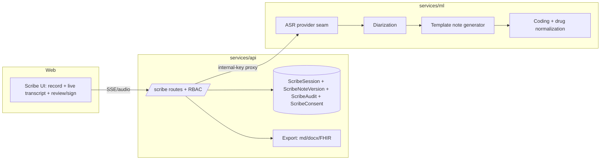

# Clara Scribe — Enterprise Design

## Overview

Clara Scribe Enterprise extends the existing batch scribe (ML `/v1/scribe/soap` +
`/v1/scribe/transcribe`; API `ScribeSession` CRUD) into an ambient, real-time,
review→sign→export clinical-documentation pipeline. The design is **additive and
flag-gated**: with all flags off the system is byte-for-byte the current behavior.

## Architecture

Architecture stays consistent with the rest of CLARA Care:
- **ML service** owns ASR, diarization, note generation, and coding (heavy/model work).
- **API service** owns auth/RBAC, persistence (`ScribeSession` + new audit/consent/version
  tables), the SSE proxy to ML, export, and analytics — proxying ML via `ml_proxy`
  + the internal-key header, mirroring the chat/research pattern.
- **Web** owns the recording/streaming UI, live transcript + process panel (reusing the
  chat SSE client + LogicFlow/Telemetry components), and the review/sign/export UI.



## High-Level Design

## Components and Interfaces

### 1. ASR provider seam (ML) — Requirement 2
A small interface decouples note flow from the transcription backend:

```python
class AsrProvider(Protocol):
    def transcribe(self, audio: bytes, *, language: str, content_type: str) -> AsrResult: ...
    def stream(self, audio_iter: Iterable[bytes], *, language: str) -> Iterator[AsrEvent]: ...

@dataclass(frozen=True)
class AsrSegment:
    text: str
    speaker: str = "unknown"        # clinician|patient|other|unknown
    start_ms: int = 0
    end_ms: int = 0
    confidence: float = 0.0
    degraded: bool = False

@dataclass(frozen=True)
class AsrResult:
    segments: list[AsrSegment]
    language: str
    provider: str
    degraded_count: int
```

Implementations: `WhisperDeepSeekAsr` (wraps the current `DeepSeekClient.transcribe_audio`),
`GoogleSttV2Asr` (Vietnamese + diarization + streaming via Chirp-3), optional
`PhoWhisperAsr` (self-hosted). A `CompositeAsr` tries the configured primary then the
fallback, total + import-safe (never raises; returns empty/degraded on failure). Code-switching:
the VN provider is configured to keep English tokens verbatim; a post-pass aligns drug
tokens to the RAG drug lexicon (Requirement 7.2) without rewriting transcript text.

### 2. Streaming transcription (ML + API + Web) — Requirement 1
Reuse the chat SSE pattern (already shipped: `streaming/chat_stream.py`,
`/v1/chat/stream`, API proxy, web `streamChatMessage`). New:
- ML `POST /v1/scribe/stream`: consumes incremental audio (or, v1, an uploaded audio blob
  re-emitted as live segments) and yields SSE `start` → `partial`/`segment` → `done`/`error`.
- API `POST /api/v1/scribe/sessions/{id}/stream`: clinician-RBAC SSE proxy to ML (mirrors
  `/api/v1/chat/stream` relay).
- Web: a `streamScribe()` client modeled on `streamChatMessage`, feeding a live transcript
  panel + the existing LogicFlow process panel.

### 3. Diarization (ML) — Requirement 3
Diarization is part of `AsrSegment.speaker`. When the provider lacks diarization, a
heuristic/secondary pass may assign labels; default `unknown`. The API exposes a
segment-relabel endpoint that writes an audit event and updates stored segments — text
is never mutated (additive metadata only).

### 4. Note generation (ML) — Requirement 6
`NoteGenerator.generate(transcript_or_segments, template_id) -> Note` where a `Template`
declares ordered section keys. SOAP is the default template (current behavior). Templates
registry is pure data (like the RAG source registry), extensible without touching the
generator. The generator guarantees: output has exactly the template's section keys
(empty strings allowed), flags `insufficient_input` on empty/unusable transcript, and
prompts carry the shared legal/medical guardrail. Structure-completeness + no-fabrication
are property-tested.

### 5. Coding + medication safety (ML) — Requirement 7
`CodingAssistant.suggest(note) -> {icd: [...], medications: [...], interactions: [...]}`.
Medications reuse `rag.normalize.drug_lexicon` + entity linker (lexicon-only, fast,
offline) to map to RxCUI; interactions reuse the CareGuard/DDI path as advisory insights.
All advisory, additive, clinician-confirm-required.

## Low-Level Design — persistence (API) — Requirements 5, 8

## Data Models

Extend the existing `ScribeSession` and add three append-only/versioned tables (Alembic
migration; additive only):

```
ScribeSession (existing, extended)
  + encounter_json (patient_ref opaque, visit_type, encounter_at)
  + asr_meta_json   (provider, language, degraded_count)
  + consent_id (nullable FK)
  status: draft|in_review|signed|exported|amended

ScribeNoteVersion (new)        # versioned notes (Req 8.2/8.5)
  id, session_id FK, version_no, template_id, sections_json,
  coding_json, created_by, created_at, signed (bool), signed_at, signed_by

ScribeConsent (new, immutable) # Req 4
  id, session_id FK, method, scope, captured_by, captured_at, revoked_at (nullable)

ScribeAudit (new, append-only) # Req 8.3/8.4
  id, session_id FK, actor, action, from_status, to_status, detail_json, created_at
```

Status transitions enforced by a pure `can_transition(from, to) -> bool` table
(property-tested for legality). Signed versions are immutable: a change inserts a new
`ScribeNoteVersion` with incremented `version_no` and `status=amended`.

## API surface (services/api/.../scribe.py) — additive
- Existing: create/get/update/regenerate/list session, `/analytics/summary` — unchanged.
- New (flag-gated):
  - `POST /scribe/sessions/{id}/consent` — capture consent (Req 4).
  - `POST /scribe/sessions/{id}/stream` — SSE transcription proxy (Req 1).
  - `PATCH /scribe/sessions/{id}/segments/{seg}` — relabel speaker (Req 3.3).
  - `POST /scribe/sessions/{id}/notes` — generate a note for a template (Req 6).
  - `POST /scribe/sessions/{id}/sign` / `.../amend` — sign/amend (Req 8).
  - `GET  /scribe/sessions/{id}/audit` — read audit trail (Req 8.4).
  - `GET  /scribe/sessions/{id}/export?format=md|docx|fhir` — export (Req 9).
All clinician-RBAC + owner-scoped; ML-heavy calls proxied with the internal key.

## Web (apps/web) — Requirement 1, 8
- `lib/scribe.ts`: `streamScribe()` (SSE, modeled on `streamChatMessage`), session/consent/
  note/sign/export clients.
- Scribe page: consent gate → record/stream → live transcript with speaker chips + live
  process panel (reuse LogicFlow/Telemetry) → template picker → generated note editor →
  sign → export. Falls back to batch when streaming flag/transport unavailable.

## Feature flags (config) — Requirement 11
`RAG_SCRIBE_STREAMING_ENABLED`, `RAG_SCRIBE_DIARIZATION_ENABLED`,
`RAG_SCRIBE_CONSENT_REQUIRED`, `RAG_SCRIBE_TEMPLATES_ENABLED`,
`RAG_SCRIBE_CODING_ENABLED`, `RAG_SCRIBE_SIGN_WORKFLOW_ENABLED`,
`RAG_SCRIBE_EXPORT_ENABLED`, `RAG_SCRIBE_FHIR_EXPORT_ENABLED`,
`SCRIBE_ASR_PRIMARY` / `SCRIBE_ASR_FALLBACK` (provider selection),
`SCRIBE_ASR_LANGUAGE` (default `vi`). All default off/legacy.

## Correctness Properties

### Property 1: Template completeness
For any template + any transcript, `generate(...)` returns exactly that template's section keys.

**Validates: Requirements 6.2, 6.3**

### Property 2: Transcript preservation
Applying/relabeling diarization never changes the concatenated segment text.

**Validates: Requirements 3.4**

### Property 3: No fabrication on empty/degraded input
Empty/unusable transcript yields all sections empty + `insufficient_input`; a degraded ASR chunk never yields fabricated text.

**Validates: Requirements 1.4, 6.4**

### Property 4: Audit append-only + signed immutability
A signed `ScribeNoteVersion` is never mutated; any edit creates a new version; audit entries are only ever appended.

**Validates: Requirements 8.2, 8.3**

### Property 5: Transition legality
`can_transition` permits only the declared lifecycle edges and rejects all others.

**Validates: Requirements 8.1**

### Property 6: PII-free telemetry
Scribe analytics payloads contain no raw transcript/patient identifiers (asserted against a redaction projection).

**Validates: Requirements 10.1**

## Error Handling

- **ASR failure**: `CompositeAsr` tries primary then fallback; on total failure it returns
  an empty/degraded `AsrResult` (never raises) and the streaming endpoint emits a terminal
  `error` SSE frame naming only the failure class (no provider internals). The batch path
  remains the safety net.
- **LLM/generation failure**: the note generator degrades to the template's empty sections
  flagged `insufficient_input` rather than fabricating content; the shared legal/medical
  guardrail produces a safe response on violation.
- **Persistence/transition errors**: an illegal status transition or an edit to a signed
  version is rejected with a clear 4xx; partial writes are avoided by performing version +
  audit inserts in a single transaction.
- **Consent missing/revoked**: transcription requests are rejected with a non-PII error
  when consent is required and absent/revoked.
- **Proxy/stream interruption**: the API SSE relay emits a terminal `error` frame so the
  web client falls back to the batch endpoint; no half-written session state is persisted.

## Testing Strategy

- **Property-based (P1–P6)** as listed in Correctness Properties — the enterprise-grade core.
- **Unit**: ASR seam (fallback/degraded/import-safety), templates registry shape, note
  generator structure, coding/drug-normalization, `can_transition` table.
- **Integration**: API routes (RBAC, owner-scoping, consent guard, sign/amend immutability,
  audit append-only, export gating), ML streaming SSE end-to-end, web streaming client.
- **Regression gate**: with all flags off the existing scribe suite + behavior are
  byte-for-byte unchanged.
- **Tooling**: ML `pytest`/`hypothesis` + `ruff`; API `pytest`; Web `vitest` + `tsc` + eslint.

## Rollout & testing
- Migrations additive (`CREATE TABLE IF NOT EXISTS` semantics via Alembic). No destructive
  change to `ScribeSession`.
- All flags off ⇒ existing tests + behavior unchanged (regression gate).
- Property tests (P1–P6) + unit/integration (ML ASR seam + generator + coding; API routes
  + RBAC + audit; Web streaming client + sign UI) + the existing scribe suite green.
