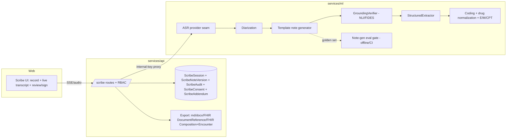
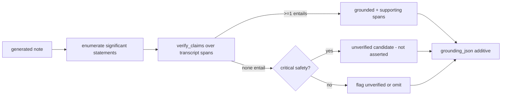

# Clara Scribe — Enterprise Design

## Overview

Clara Scribe Enterprise extends the existing batch scribe (ML `/v1/scribe/soap` +
`/v1/scribe/transcribe`; API `ScribeSession` CRUD) into an ambient, real-time,
review→sign→export clinical-documentation pipeline. The design is **additive and
flag-gated**: with all flags off the system is byte-for-byte the current behavior.

A second, deep-research-driven wave (R12–R20) layers **transcript grounding /
claim-traceability**, **structured clinical-data extraction**, **conservative E/M + CPT
coding**, **note-quality / efficiency metrics**, **ASR word-error-rate (WER) reporting**,
**structured FHIR `Composition` + `Encounter` export**, a **time-stamped addendum
workflow**, **specialty/macro template extensibility**, and a **golden-set evaluation
gate** on top of that baseline. Every R12–R20 capability is independently feature-flagged
and defaults off, so flags-off behavior remains byte-for-byte identical to the current
system, and each new pass is **additive metadata only** — it never mutates the note
clinical text or the transcript. The grounding and evaluation work deliberately reuse the
CLARA Research NLI/FIDES claim-verification approach and the research quality-gate harness
pattern rather than reinventing them.

## Architecture

Architecture stays consistent with the rest of CLARA Care:
- **ML service** owns ASR, diarization, note generation, and coding (heavy/model work).
- **API service** owns auth/RBAC, persistence (`ScribeSession` + new audit/consent/version
  tables), the SSE proxy to ML, export, and analytics — proxying ML via `ml_proxy`
  + the internal-key header, mirroring the chat/research pattern.
- **Web** owns the recording/streaming UI, live transcript + process panel (reusing the
  chat SSE client + LogicFlow/Telemetry components), and the review/sign/export UI.



## High-Level Design

## Components and Interfaces

### 1. ASR provider seam (ML) — Requirement 2
A small interface decouples note flow from the transcription backend:

```python
class AsrProvider(Protocol):
    def transcribe(self, audio: bytes, *, language: str, content_type: str) -> AsrResult: ...
    def stream(self, audio_iter: Iterable[bytes], *, language: str) -> Iterator[AsrEvent]: ...

@dataclass(frozen=True)
class AsrSegment:
    text: str
    speaker: str = "unknown"        # clinician|patient|other|unknown
    start_ms: int = 0
    end_ms: int = 0
    confidence: float = 0.0
    degraded: bool = False

@dataclass(frozen=True)
class AsrResult:
    segments: list[AsrSegment]
    language: str
    provider: str
    degraded_count: int
```

Implementations: `WhisperDeepSeekAsr` (wraps the current `DeepSeekClient.transcribe_audio`),
`GoogleSttV2Asr` (Vietnamese + diarization + streaming via Chirp-3), optional
`PhoWhisperAsr` (self-hosted). A `CompositeAsr` tries the configured primary then the
fallback, total + import-safe (never raises; returns empty/degraded on failure). Code-switching:
the VN provider is configured to keep English tokens verbatim; a post-pass aligns drug
tokens to the RAG drug lexicon (Requirement 7.2) without rewriting transcript text.

### 2. Streaming transcription (ML + API + Web) — Requirement 1
Reuse the chat SSE pattern (already shipped: `streaming/chat_stream.py`,
`/v1/chat/stream`, API proxy, web `streamChatMessage`). New:
- ML `POST /v1/scribe/stream`: consumes incremental audio (or, v1, an uploaded audio blob
  re-emitted as live segments) and yields SSE `start` → `partial`/`segment` → `done`/`error`.
- API `POST /api/v1/scribe/sessions/{id}/stream`: clinician-RBAC SSE proxy to ML (mirrors
  `/api/v1/chat/stream` relay).
- Web: a `streamScribe()` client modeled on `streamChatMessage`, feeding a live transcript
  panel + the existing LogicFlow process panel.

### 3. Diarization (ML) — Requirement 3
Diarization is part of `AsrSegment.speaker`. When the provider lacks diarization, a
heuristic/secondary pass may assign labels; default `unknown`. The API exposes a
segment-relabel endpoint that writes an audit event and updates stored segments — text
is never mutated (additive metadata only).

### 4. Note generation (ML) — Requirement 6
`NoteGenerator.generate(transcript_or_segments, template_id) -> Note` where a `Template`
declares ordered section keys. SOAP is the default template (current behavior). Templates
registry is pure data (like the RAG source registry), extensible without touching the
generator. The generator guarantees: output has exactly the template's section keys
(empty strings allowed), flags `insufficient_input` on empty/unusable transcript, and
prompts carry the shared legal/medical guardrail. Structure-completeness + no-fabrication
are property-tested.

### 5. Coding + medication safety (ML) — Requirement 7
`CodingAssistant.suggest(note) -> {icd: [...], medications: [...], interactions: [...]}`.
Medications reuse `rag.normalize.drug_lexicon` + entity linker (lexicon-only, fast,
offline) to map to RxCUI; interactions reuse the CareGuard/DDI path as advisory insights.
All advisory, additive, clinician-confirm-required.

---

## Wave 2 — research-driven components (R12–R20)

### Shared transcript-span / provenance model — Requirements 12, 13

R12 and R13 share one span model so an extracted item and its grounding reference the
**same** span identifiers (Req 13.6). A span is a referenceable region of the transcript
(a segment id plus optional character offsets); spans live in a per-session **span
registry** keyed by stable `span_id`, derived deterministically from the persisted ASR
segments. Nothing in this model mutates transcript text — spans only *point at* it.

```python
@dataclass(frozen=True)
class TranscriptSpan:
    span_id: str            # stable id, e.g. "seg-0007:12-48"
    segment_id: str         # references a persisted AsrSegment
    start_char: int = 0     # offset within the segment text (optional)
    end_char: int | None = None
    text: str = ""          # snippet copied (read-only) for evidence display

@dataclass(frozen=True)
class Provenance:
    span_ids: list[str]     # one or more supporting spans (resolvable in the registry)
    method: str             # "nli" | "lexicon" | "regex" | "llm" — how the link was derived
```

The registry exposes `resolve(span_id) -> TranscriptSpan | None`; both the
`GroundingVerifier` and the `StructuredExtractor` resolve through it, guaranteeing a single
shared identifier space.

### 6. GroundingVerifier — transcript grounding / claim traceability (ML) — Requirement 12

`GroundingVerifier` runs after note generation when `RAG_SCRIBE_GROUNDING_ENABLED` is true.
It enumerates the **clinically significant statements** in the generated note (discrete
factual assertions — findings, diagnoses, medications, allergies, vitals, procedures, plan
items — as opposed to boilerplate/headings), and for each one runs the CLARA Research /
FIDES claim-verification approach against transcript spans treated as the evidence rows,
**reusing** `factcheck.nli_verifier.verify_claims` / `classify_claim` and the
`fides_lite.run_fides_lite` CRITICAL-block discipline. No new verification engine is built.

```python
@dataclass(frozen=True)
class GroundedStatement:
    statement: str
    significant: bool          # clinically significant vs boilerplate
    critical_safety: bool      # medication|dose|allergy|vital|diagnosis
    grounded: bool             # True iff >=1 span entails (NLI "supported")
    supporting: Provenance     # span_ids that entail (empty when ungrounded)
    status: str                # "grounded" | "unverified"

@dataclass(frozen=True)
class GroundingReport:
    statements: list[GroundedStatement]
    grounded_claim_rate: float            # grounded_significant / total_significant
    unverified_candidates: list[str]      # critical ungrounded statements, NOT asserted
```

- **Grounding decision (Req 12.3):** a statement is `grounded` *iff* at least one transcript
  span entails it under the claim-verification pass (NLI `support_status == "supported"`);
  otherwise `ungrounded`. Each statement carries its indicator + the supporting span ids
  (Req 12.2).
- **Ungrounded handling (Req 12.4/12.5):** an ungrounded significant statement is flagged
  `unverified` or omitted; an ungrounded **critical safety** statement (medication, dose,
  allergy, vital, diagnosis) is **never** emitted into the asserted note clinical text — it
  is surfaced only as an `unverified_candidate` requiring clinician confirmation.
- **Additive (Req 12.6):** the report is written to `ScribeNoteVersion.grounding_json`
  only. The note `sections_json` text and the transcript are never altered, dropped, or
  reordered by the pass.
- **Surface + metric (Req 12.7/12.8):** the review UI renders a per-statement
  grounded/unverified chip with drill-down to the supporting span(s); the per-note
  `grounded_claim_rate` is recorded as non-PII session metadata for analytics/eval.



### 7. StructuredExtractor — structured clinical data extraction (ML) — Requirement 13

`StructuredExtractor` runs when `RAG_SCRIBE_STRUCTURED_EXTRACTION_ENABLED` is true and
produces machine-readable problems, medications, allergies, and vitals, each carrying
provenance into the shared span model. Medication normalization **reuses**
`rag.normalize.drug_lexicon.lookup` + `rag.normalize.entity_linker.EntityLinker` (lexicon
is O(1), offline, import-safe).

```python
@dataclass(frozen=True)
class ExtractedMedication:
    surface: str               # text as said/written
    rxcui: str | None          # drug_lexicon.lookup(surface).rxcui when known, else None
    provenance: Provenance

@dataclass(frozen=True)
class StructuredExtraction:
    problems: list[ExtractedItem]
    medications: list[ExtractedMedication]
    allergies: list[ExtractedItem]
    vitals: list[ExtractedVital]
    # absent type => empty list (never fabricated)
```

- **Provenance integrity (Req 13.3):** every extracted item references one or more
  `span_id`s resolvable in the session span registry plus an extraction `method`.
- **RxCUI (Req 13.4):** medications carry `rxcui` when the surface resolves in the drug
  lexicon/entity linker; otherwise `rxcui = None` and the surface text is preserved
  (graceful degradation).
- **No fabrication (Req 13.7):** a type with no supporting evidence yields `[]`; an item is
  never emitted without a supporting span.
- **Additive (Req 13.5):** output is written to `ScribeNoteVersion.extraction_json` only;
  note clinical text is never altered.
- **Shared spans (Req 13.6):** when grounding is also on, extraction and grounding draw
  span ids from the one shared registry, so an item and its grounding reference the same
  identifiers.

### 8. CodingAssistant extension — E/M + CPT with anti-upcoding (ML) — Requirement 14

The existing `CodingAssistant` (Req 7, ICD-10 + medication safety) is extended **additively**
behind `RAG_SCRIBE_EM_CPT_CODING_ENABLED`. When off, behavior is exactly Req 7.

```python
@dataclass(frozen=True)
class CodeSuggestion:
    system: str                # "ICD-10" | "E/M" | "CPT"
    code: str
    display: str
    justifying: Provenance     # note/transcript span(s) that justify the suggestion
    selected: bool = False     # never True without explicit clinician confirmation
    status: str = "advisory"   # always advisory until confirmed

def defensible_em_level(note, extraction) -> int: ...   # highest level the evidence supports
def suggest_em_cpt(note, extraction) -> list[CodeSuggestion]: ...
```

- **Justification (Req 14.2):** every E/M and CPT suggestion carries a justifying span.
- **Anti-upcoding (Req 14.4):** the suggested E/M level is **never higher** than
  `defensible_em_level(...)`; when evidence is insufficient for a higher level, the lower
  defensible level is suggested.
- **No auto-select/finalize (Req 14.3/14.5):** every suggestion is `selected = False`,
  `status = "advisory"` until a clinician explicitly confirms; nothing is finalized,
  submitted, or auto-applied.
- **VN localization (Req 14.6):** the suggestion set is localized to the Vietnamese
  clinical/coding context (Vietnamese-first, bilingual where applicable).
- **Additive (Req 14.7):** suggestions are written to `ScribeNoteVersion.coding_json`; note
  clinical text is never modified.

### 9. Note-quality + efficiency metrics (API) — Requirement 15

A pure `compute_scribe_metrics(session_meta) -> dict` derives, **only from non-PII session
metadata**, edit rate, time-saved estimate, degraded-ASR rate, grounded-claim rate (from
the GroundingVerifier metric), and a PDQI-9-style **structural-completeness proxy** (section
presence/fill only — explicitly *not* a clinical-accuracy judgement, Req 15.5). Gated by
`RAG_SCRIBE_QUALITY_METRICS_ENABLED`.

- **PII-free (Req 15.3):** computed against the existing analytics **redaction projection**;
  no patient identifiers or free-text transcript ever enter the payload.
- **Omit-on-missing (Req 15.6):** when a metric's input is unavailable (e.g. grounded-claim
  rate while grounding is disabled), the metric key is **omitted** rather than reported as a
  fabricated/zero value.
- **Exposure (Req 15.4):** surfaced through the **existing** analytics path (the same one
  `/scribe/analytics/summary` already uses).

### 10. ASR WER / fairness reporting (ML + API) — Requirement 16

When `RAG_SCRIBE_WER_REPORTING_ENABLED` is true, the system records a WER measurement (or a
confidence-based quality proxy where reference text is unavailable) **per language**, and,
where available, broken down **per accent/speaker label**, as non-PII evaluation metadata
(`ScribeNoteVersion.wer_json` / session eval metadata).

- **PII-free (Req 16.4):** stored payloads contain no raw transcript text or patient
  identifiers (asserted against the redaction projection).
- **Non-blocking (Req 16.5):** WER feeds evaluation/analytics only; it never gates, blocks,
  or alters the clinician's transcription or note workflow.

### 11. FHIR Composition + Encounter export (API) — Requirement 17

The export surface is extended behind `RAG_SCRIBE_FHIR_COMPOSITION_ENABLED`. When off,
export behaves exactly as Req 9 (Markdown/DOCX and, under its own flag, `DocumentReference`).
When on, a **signed** note additionally exports:

- a FHIR **`Composition`** whose `section[]` corresponds **1:1** to the note's template
  sections (one Composition section per template section), referencing the signing clinician
  + sign timestamp and the required source/medical attribution (Req 17.2/17.4);
- a FHIR **`Encounter`** derived from the session's encounter context (visit type, encounter
  datetime, opaque patient reference) (Req 17.3).

Both are **interface-only** JSON shapes — no live EHR write in v1 (Req 17.5) — emitted
**alongside** the existing `DocumentReference`. Export is permitted only for
`signed`/`exported` notes; exporting a `draft` is rejected (Req 17.6). When the addendum flag
is on, addenda are emitted as a clearly demarcated, time-stamped section without altering the
signed content (Req 18.6).

### 12. Addendum workflow (API) — Requirement 18

`RAG_SCRIBE_ADDENDUM_ENABLED` adds a **time-stamped addendum** attached to a `signed` note
**without** altering the signed `ScribeNoteVersion`. This is **distinct from amend** (Req 8):
an addendum creates **no new note version**; amend's new-`amended`-version semantics remain
available and unchanged. Addenda are stored append-only in the new `ScribeAddendum` table.

- Attaching an addendum leaves the signed version **byte-for-byte unchanged** (Req 18.3),
  preserving signed-note immutability (Req 8.2).
- Exactly one append-only `ScribeAudit` entry is recorded per addendum (Req 18.4).
- Export includes the addendum(s) as a demarcated, time-stamped section (Req 18.6).

### 13. Specialty / macro template extensibility (ML) — Requirement 19

`RAG_SCRIBE_SPECIALTY_TEMPLATES_ENABLED` extends the **pure-data** templates registry (the
same registry from Req 6.1) with specialty-specific templates and clinician-defined
macros/snippets — **without** changing the generation call site. Selecting a specialty
template preserves the structure-completeness guarantee (Req 19.4 == Req 6.2/6.3, the same
invariant as Property 1). Adding a template or macro never alters the structure or output of
any existing template (Req 19.5). Templates/macros are Vietnamese-first, bilingual where
applicable (Req 19.6).

### 14. Note-generation evaluation gate (offline/CI) — Requirement 20

A `scribe_eval` golden-set harness, gated by `RAG_SCRIBE_EVAL_GATE_ENABLED`, **mirrors the
CLARA Research quality-gate pattern** (`research_quality` / `rag_eval`). It runs note
generation over a curated, **non-PII** golden set of transcript→note pairs and computes at
least: structural completeness, grounded-claim rate, a no-fabrication check, and a
coding-precision proxy, each compared against a declared threshold.

```python
@dataclass(frozen=True)
class EvalMetric:
    name: str
    value: float
    threshold: float
    passed: bool                # value >= threshold

@dataclass(frozen=True)
class EvalGateResult:
    metrics: list[EvalMetric]
    passed: bool                # all(m.passed for m in metrics)
    failing: list[str]          # names of metrics that breached threshold
```

- **Threshold enforcement (Req 20.3/20.4):** the gate passes *iff* every metric meets its
  threshold; if any threshold is unmet it reports failure and names the breaching metric, so
  the regression blocks release.
- **PII-free (Req 20.5):** golden data and reports carry no patient identifiers.
- **Offline/CI only (Req 20.1/20.6):** the gate never runs in, or alters, the runtime
  note-generation path experienced by clinicians.

## Low-Level Design — persistence (API) — Requirements 5, 8, 12, 13, 14, 16, 18

## Data Models

Extend the existing `ScribeSession`, extend `ScribeNoteVersion` with additive JSON columns,
and add `ScribeConsent`, `ScribeAudit`, and the new append-only `ScribeAddendum` table
(Alembic migration; **additive only** — no destructive change, `CREATE TABLE IF NOT EXISTS`
/ nullable `ADD COLUMN` semantics):

```
ScribeSession (existing, extended)
  + encounter_json (patient_ref opaque, visit_type, encounter_at)
  + asr_meta_json   (provider, language, degraded_count)
  + consent_id (nullable FK)
  + metrics_json (nullable)     # R15 quality/efficiency metrics (non-PII)
  status: draft|in_review|signed|exported|amended

ScribeNoteVersion (existing, extended — all new columns nullable/additive)
  id, session_id FK, version_no, template_id, sections_json,
  coding_json,                   # existing; R7 ICD + R14 E/M/CPT suggestions
  created_by, created_at, signed (bool), signed_at, signed_by
  + grounding_json (nullable)    # R12 GroundingReport (statements, rate, candidates)
  + extraction_json (nullable)   # R13 StructuredExtraction (problems/meds/allergies/vitals)
  + wer_json (nullable)          # R16 per-language/accent/speaker WER or confidence proxy
  + quality_json (nullable)      # R15 per-version structural-completeness proxy inputs

ScribeConsent (new, immutable) # R4
  id, session_id FK, method, scope, captured_by, captured_at, revoked_at (nullable)

ScribeAudit (new, append-only) # R8.3/8.4, R12, R18
  id, session_id FK, actor, action, from_status, to_status, detail_json, created_at

ScribeAddendum (new, append-only) # R18
  id, session_id FK, note_version_id FK (the signed version it attaches to),
  author, text, created_at
```

Status transitions enforced by a pure `can_transition(from, to) -> bool` table
(property-tested for legality). Signed versions are immutable: an **amend** inserts a new
`ScribeNoteVersion` with incremented `version_no` and `status=amended`; an **addendum**
inserts a `ScribeAddendum` row and leaves the signed version untouched (no new version).

All new note-version columns are additive JSON written only by the corresponding flag-gated
pass; with flags off they are `NULL` and the persisted/observable shape is unchanged.

## API surface (services/api/.../scribe.py) — additive
- Existing: create/get/update/regenerate/list session, `/analytics/summary` — unchanged.
- New (flag-gated):
  - `POST /scribe/sessions/{id}/consent` — capture consent (Req 4).
  - `POST /scribe/sessions/{id}/stream` — SSE transcription proxy (Req 1).
  - `PATCH /scribe/sessions/{id}/segments/{seg}` — relabel speaker (Req 3.3).
  - `POST /scribe/sessions/{id}/notes` — generate a note for a template (Req 6/19);
    runs grounding (Req 12), structured extraction (Req 13), and E/M+CPT coding (Req 14)
    as additive passes when their flags are on.
  - `GET  /scribe/sessions/{id}/notes/{ver}/grounding` — read grounding report (Req 12.7).
  - `GET  /scribe/sessions/{id}/notes/{ver}/extraction` — read structured extraction (Req 13).
  - `POST /scribe/sessions/{id}/sign` / `.../amend` — sign/amend (Req 8).
  - `POST /scribe/sessions/{id}/notes/{ver}/addendum` — attach addendum (Req 18).
  - `GET  /scribe/sessions/{id}/audit` — read audit trail (Req 8.4).
  - `GET  /scribe/sessions/{id}/export?format=md|docx|fhir|fhir_composition` — export
    (Req 9, Req 17); `fhir_composition` emits `Composition` + `Encounter` alongside
    `DocumentReference`.
  - `GET  /scribe/analytics/quality` — quality/efficiency + WER metrics (Req 15/16) via
    the existing analytics path.
All clinician-RBAC + owner-scoped; ML-heavy calls proxied with the internal key.

## Web (apps/web) — Requirement 1, 8, 12
- `lib/scribe.ts`: `streamScribe()` (SSE, modeled on `streamChatMessage`), session/consent/
  note/sign/addendum/export clients.
- Scribe page: consent gate → record/stream → live transcript with speaker chips + live
  process panel (reuse LogicFlow/Telemetry) → template picker (incl. specialty templates +
  macros) → generated note editor with **per-statement grounded/unverified chips and
  span drill-down** (Req 12.7) and unverified-candidate review → sign → addendum → export.
  Falls back to batch when streaming flag/transport unavailable.

## Feature flags (config) — Requirement 11
Baseline (wave 1): `RAG_SCRIBE_STREAMING_ENABLED`, `RAG_SCRIBE_DIARIZATION_ENABLED`,
`RAG_SCRIBE_CONSENT_REQUIRED`, `RAG_SCRIBE_TEMPLATES_ENABLED`,
`RAG_SCRIBE_CODING_ENABLED`, `RAG_SCRIBE_SIGN_WORKFLOW_ENABLED`,
`RAG_SCRIBE_EXPORT_ENABLED`, `RAG_SCRIBE_FHIR_EXPORT_ENABLED`,
`SCRIBE_ASR_PRIMARY` / `SCRIBE_ASR_FALLBACK` (provider selection),
`SCRIBE_ASR_LANGUAGE` (default `vi`). All default off/legacy.

Wave 2 (R12–R20), **all default off** ⇒ byte-for-byte current behavior:

| Flag (env) | Default | Controls |
| --- | --- | --- |
| `RAG_SCRIBE_GROUNDING_ENABLED` | `false` | R12 transcript grounding / claim traceability |
| `RAG_SCRIBE_STRUCTURED_EXTRACTION_ENABLED` | `false` | R13 structured clinical-data extraction |
| `RAG_SCRIBE_EM_CPT_CODING_ENABLED` | `false` | R14 E/M + CPT coding (anti-upcoding) |
| `RAG_SCRIBE_QUALITY_METRICS_ENABLED` | `false` | R15 note-quality + efficiency metrics |
| `RAG_SCRIBE_WER_REPORTING_ENABLED` | `false` | R16 ASR WER / fairness reporting |
| `RAG_SCRIBE_FHIR_COMPOSITION_ENABLED` | `false` | R17 FHIR Composition + Encounter export |
| `RAG_SCRIBE_ADDENDUM_ENABLED` | `false` | R18 addendum workflow |
| `RAG_SCRIBE_SPECIALTY_TEMPLATES_ENABLED` | `false` | R19 specialty/macro templates |
| `RAG_SCRIBE_EVAL_GATE_ENABLED` | `false` | R20 note-generation evaluation gate (offline/CI) |

## Correctness Properties

*A property is a characteristic or behavior that should hold true across all valid executions
of a system — essentially, a formal statement about what the system should do. Properties
serve as the bridge between human-readable specifications and machine-verifiable correctness
guarantees.*

Properties 1–6 are the wave-1 core. Properties 7–15 cover R12–R20 and were derived from the
prework analysis; criteria classified EXAMPLE/EDGE_CASE/INTEGRATION (flags-off snapshots, UI
wiring, analytics-path integration, localization) are covered by the Testing Strategy rather
than by a universal property. Redundant criteria were consolidated: the additivity criteria
(12.6, 13.5, 14.7, and the signed-bytes aspect) collapse into one additivity property; the
PII-free / omit-on-missing criteria (12.8, 15.3, 15.6, 16.4, 20.5) collapse into one property;
and the specialty-template completeness criteria (19.2/19.4) reuse Property 1 rather than
duplicating it.

### Property 1: Template completeness
For any template (including specialty templates) + any transcript, `generate(...)` returns exactly that template's section keys.

**Validates: Requirements 6.2, 6.3, 19.2, 19.4**

### Property 2: Transcript preservation
Applying/relabeling diarization never changes the concatenated segment text.

**Validates: Requirements 3.4**

### Property 3: No fabrication on empty/degraded input
Empty/unusable transcript yields all sections empty + `insufficient_input`; a degraded ASR chunk never yields fabricated text.

**Validates: Requirements 1.4, 6.4**

### Property 4: Audit append-only + signed immutability
A signed `ScribeNoteVersion` is never mutated; any edit creates a new version; audit entries are only ever appended.

**Validates: Requirements 8.2, 8.3**

### Property 5: Transition legality
`can_transition` permits only the declared lifecycle edges and rejects all others.

**Validates: Requirements 8.1**

### Property 6: PII-free telemetry
Scribe analytics payloads contain no raw transcript/patient identifiers (asserted against a redaction projection).

**Validates: Requirements 10.1**

### Property 7: Additive metadata never mutates note text or transcript
*For any* note version and transcript, running any combination of the grounding pass,
structured-extraction pass, and E/M/CPT coding pass leaves the note's `sections_json`
clinical text and the transcript byte-for-byte unchanged (the only changes are to the
additive `grounding_json` / `extraction_json` / `coding_json` metadata).

**Validates: Requirements 12.6, 13.5, 14.7**

### Property 8: Grounding soundness and critical-safety suppression
*For any* generated note and transcript with grounding enabled, every clinically significant
statement carries a grounded/unverified indicator; a statement is marked `grounded` *if and
only if* at least one transcript span entails it under the claim-verification pass; and no
`ungrounded` critical-safety statement (medication, dose, allergy, vital, or diagnosis)
appears as an asserted fact in the note clinical text — it appears only as an `unverified`
candidate.

**Validates: Requirements 12.2, 12.3, 12.4, 12.5**

### Property 9: Structured-extraction provenance integrity, no-fabrication, and RxCUI mapping
*For any* transcript, every extracted item (problem, medication, allergy, vital) references at
least one transcript span resolvable in the shared span registry plus an extraction method;
a clinical type with no supporting evidence yields an empty list (no fabricated items); and
every extracted medication carries the lexicon `RxCUI` when its surface resolves in the drug
lexicon/entity linker and otherwise retains its surface text with a null identifier.

**Validates: Requirements 13.2, 13.3, 13.4, 13.6, 13.7**

### Property 10: Anti-upcoding coding suggestions
*For any* generated note, the suggested E/M visit level is never higher than the defensible
level supported by the documented evidence, every E/M and CPT suggestion carries a justifying
span, and no E/M or CPT code is in a selected/finalized state (all remain advisory) without
explicit clinician confirmation.

**Validates: Requirements 14.2, 14.3, 14.4, 14.5**

### Property 11: FHIR Composition / Encounter correspondence and gating
*For any* note over any template, exporting FHIR is permitted *if and only if* the note status
is `signed` or `exported`; and for a signed note the exported `Composition` has exactly one
section per template section with section text that round-trips the note sections, references
the signing clinician + sign timestamp + required attribution, and the exported `Encounter`
fields equal the session's encounter context (visit type, datetime, opaque patient reference,
with no PII added).

**Validates: Requirements 17.2, 17.3, 17.4, 17.6**

### Property 12: Addendum preserves the signed note
*For any* signed note, attaching an addendum leaves the signed `ScribeNoteVersion` byte-for-byte
unchanged, creates zero new note versions, appends exactly one audit entry, and the addendum
appears in export as a clearly demarcated section without altering the signed content.

**Validates: Requirements 18.2, 18.3, 18.4, 18.5, 18.6**

### Property 13: Quality/WER/eval metrics are PII-free and omit-on-missing
*For any* session metadata (including embedded transcript text or patient identifiers), every
quality-metric, WER-report, grounded-claim-rate, and evaluation-report payload contains none
of the PII field values (asserted against the redaction projection), and any metric whose
required input is unavailable is omitted rather than reported as a fabricated or placeholder
value.

**Validates: Requirements 12.8, 15.3, 15.6, 16.4, 20.5**

### Property 14: Template/macro addition isolation
*For any* existing template and any newly added specialty template or macro/snippet in the
registry, the generated output of every pre-existing template is unchanged (adding a template
or macro never alters the structure or output of existing templates).

**Validates: Requirements 19.5**

### Property 15: Evaluation-gate threshold enforcement
*For any* set of computed metrics and their declared thresholds, the evaluation gate reports
pass *if and only if* every metric meets its threshold, and when it fails it identifies the
breaching metric(s).

**Validates: Requirements 20.2, 20.3, 20.4**

## Error Handling

- **ASR failure**: `CompositeAsr` tries primary then fallback; on total failure it returns
  an empty/degraded `AsrResult` (never raises) and the streaming endpoint emits a terminal
  `error` SSE frame naming only the failure class (no provider internals). The batch path
  remains the safety net.
- **LLM/generation failure**: the note generator degrades to the template's empty sections
  flagged `insufficient_input` rather than fabricating content; the shared legal/medical
  guardrail produces a safe response on violation.
- **Grounding/extraction failure**: the grounding and extraction passes are additive and
  isolated — on internal failure they record empty/degraded metadata (no statements grounded,
  empty extraction lists) and never mutate the note text or block signing; a failure to
  verify a critical-safety statement defaults to treating it as `unverified` (never asserted).
- **Coding failure**: E/M/CPT suggestion failure yields an empty advisory suggestion set;
  the note and ICD/medication-safety path are unaffected; nothing is ever auto-selected.
- **Persistence/transition errors**: an illegal status transition or an edit to a signed
  version is rejected with a clear 4xx; an addendum against a non-signed note is rejected;
  version/audit/addendum inserts run in a single transaction to avoid partial writes.
- **Consent missing/revoked**: transcription requests are rejected with a non-PII error
  when consent is required and absent/revoked.
- **Export errors**: exporting a `draft` (Markdown/DOCX/FHIR/`fhir_composition`) is rejected;
  FHIR Composition/Encounter export performs no outbound EHR call (interface-only).
- **Eval-gate failure**: the offline/CI gate reports failure (naming breaching metrics) to
  block release; it never raises into or alters the runtime note-generation path.
- **Proxy/stream interruption**: the API SSE relay emits a terminal `error` frame so the
  web client falls back to the batch endpoint; no half-written session state is persisted.

## Testing Strategy

- **Property-based (P1–P15)** as listed in Correctness Properties — the enterprise-grade core.
  P1–P6 cover wave 1; P7–P15 cover R12–R20 (additivity, grounding soundness, extraction
  provenance/RxCUI, anti-upcoding, FHIR correspondence/gating, addendum immutability,
  metrics/WER/eval PII-free + omit-on-missing, template-addition isolation, eval-gate
  thresholds).
  - Library: ML `hypothesis`; Web `fast-check`. Minimum **100 iterations** per property test.
  - Each property test is tagged **Feature: clara-scribe-enterprise, Property {n}: {text}**
    and references the design property it validates.
  - Reuse, don't reinvent: P8 drives `factcheck.nli_verifier.verify_claims`; P9 drives
    `rag.normalize.drug_lexicon.lookup` / `EntityLinker`.
- **Unit**: ASR seam (fallback/degraded/import-safety), templates registry shape (incl.
  specialty templates + macros), note generator structure, ICD coding/drug-normalization,
  E/M `defensible_em_level` and VN localization, grounding statement-enumeration + significant/
  critical classification, structured-extractor per-type extraction, metric formulas
  (edit-rate, time-saved, degraded-ASR rate, PDQI-9 structural proxy), WER per-language/accent/
  speaker recording, FHIR `Composition`/`Encounter` shaping, `can_transition` table.
- **Integration**: API routes (RBAC, owner-scoping, consent guard, sign/amend immutability,
  audit append-only, addendum attach, grounding/extraction read endpoints, export gating incl.
  `fhir_composition`, quality/WER analytics path), ML streaming SSE end-to-end, web streaming
  client + per-statement grounded/unverified indicators with span drill-down.
- **Eval gate (R20)**: the `scribe_eval` golden-set harness runs in CI behind
  `RAG_SCRIBE_EVAL_GATE_ENABLED`, computing structural completeness, grounded-claim rate,
  no-fabrication, and coding-precision proxy with declared thresholds; it mirrors the research
  quality-gate pattern and uses only non-PII golden data.
- **Flags-off regression gate**: with **all** wave-1 and wave-2 flags off, the existing scribe
  suite + behavior are byte-for-byte unchanged (snapshot of note output, export output, and
  analytics payloads; no `grounding_json`/`extraction_json`/`wer_json`/`quality_json` present).
- **Tooling**: ML `pytest`/`hypothesis` + `ruff`; API `pytest`; Web `vitest`/`fast-check` +
  `tsc` + eslint.

## Rollout & testing
- Migrations additive (`CREATE TABLE IF NOT EXISTS` semantics via Alembic; new
  `ScribeNoteVersion` columns added as nullable; new `ScribeAddendum` table). No destructive
  change to `ScribeSession` or `ScribeNoteVersion`.
- All flags off ⇒ existing tests + behavior unchanged (regression gate), including the nine new
  R12–R20 flags defaulting off ⇒ byte-for-byte current behavior.
- Rollout sequencing (each independently flaggable, additive, reversible without data loss):
  1. **Grounding** (`RAG_SCRIBE_GROUNDING_ENABLED`) + **structured extraction**
     (`RAG_SCRIBE_STRUCTURED_EXTRACTION_ENABLED`) — share the span model; ship together.
  2. **E/M + CPT coding** (`RAG_SCRIBE_EM_CPT_CODING_ENABLED`) — anti-upcoding, advisory.
  3. **Quality metrics** + **WER reporting** (`RAG_SCRIBE_QUALITY_METRICS_ENABLED`,
     `RAG_SCRIBE_WER_REPORTING_ENABLED`) — observability, non-blocking.
  4. **FHIR Composition/Encounter** (`RAG_SCRIBE_FHIR_COMPOSITION_ENABLED`) + **addendum**
     (`RAG_SCRIBE_ADDENDUM_ENABLED`) — export + post-sign workflow.
  5. **Specialty templates** (`RAG_SCRIBE_SPECIALTY_TEMPLATES_ENABLED`) — pure-data registry.
  6. **Eval gate** (`RAG_SCRIBE_EVAL_GATE_ENABLED`) — offline/CI, gates releases of 1–5.
- Property tests (P1–P15) + unit/integration (ML ASR seam + generator + coding + grounding +
  extraction + WER; API routes + RBAC + audit + addendum + FHIR export; Web streaming client +
  sign UI + grounded/unverified indicators) + the existing scribe suite green; flipping any
  flag off at runtime restores prior behavior with existing sessions readable.
