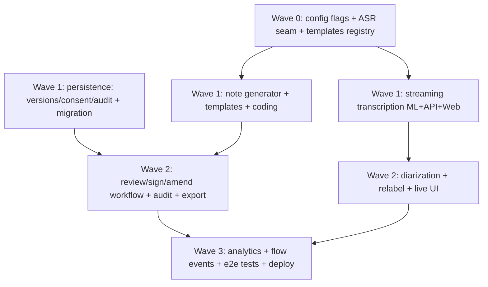

# Implementation Plan: Clara Scribe Enterprise

## Overview

Additive + flag-gated. Each leaf task references requirements. Property tests (P1–P15)
are first-class. "✅ done with all flags off ⇒ legacy unchanged" is the standing gate.

Waves 0–3 are the wave-1 baseline (R1–R11). Waves 4–10 are the research-driven wave-2
extension (R12–R20, Properties P7–P15): transcript grounding, structured extraction,
E/M + CPT coding, FHIR `Composition`/`Encounter` export, addendum workflow, quality/WER
metrics, specialty/macro templates, and a note-generation evaluation gate — every item
additive, default-off, and wired into the existing seams. Existing waves/tasks are
unchanged.

## Task Dependency Graph



Subagent assignment (run waves in order; tasks WITHIN a wave are parallel-safe — different files):
- **SA-ML** (`general-task-execution`): ML tasks (ASR seam, streaming, generator, coding, diarization).
- **SA-API** (`general-task-execution`): API tasks (persistence, routes, RBAC, audit, export, migration).
- **SA-WEB** (`general-task-execution`): Web tasks (scribe lib client, UI, sign/export).
- **SA-PBT** (`spec-task-execution`): property-based tests P1–P6.
Coordinate so SA-ML and SA-API do not edit the same files; Web depends on ML+API contracts.

```json
{
  "waves": [
    { "wave": 0, "name": "Foundations", "tasks": ["0.1", "0.2", "0.3", "0.4", "0.5"], "dependsOn": [] },
    { "wave": 1, "name": "Pipeline + persistence", "tasks": ["1.1", "1.2", "1.3", "1.4", "1.5", "1.6", "1.7"], "dependsOn": [0] },
    { "wave": 2, "name": "Workflow + diarization + export", "tasks": ["2.1", "2.2", "2.3", "2.4", "2.5", "2.6", "2.7"], "dependsOn": [1] },
    { "wave": 3, "name": "Observability + verification + deploy", "tasks": ["3.1", "3.2", "3.3", "3.4", "3.5"], "dependsOn": [2] },
    { "wave": 4, "name": "Grounding + structured extraction", "tasks": ["4.1", "4.2", "4.3", "4.4", "4.5", "4.6", "4.7", "4.8", "4.9"], "dependsOn": [1, 2] },
    { "wave": 5, "name": "E/M + CPT coding", "tasks": ["5.1", "5.2", "5.3"], "dependsOn": [4] },
    { "wave": 6, "name": "FHIR Composition/Encounter + addendum", "tasks": ["6.1", "6.2", "6.3", "6.4", "6.5"], "dependsOn": [4] },
    { "wave": 7, "name": "Quality + WER metrics", "tasks": ["7.1", "7.2", "7.3"], "dependsOn": [4] },
    { "wave": 8, "name": "Specialty/macro templates", "tasks": ["8.1", "8.2"], "dependsOn": [4] },
    { "wave": 9, "name": "Note-generation eval gate", "tasks": ["9.1", "9.2"], "dependsOn": [4, 5] },
    { "wave": 10, "name": "Wave-2 regression + verification + staged deploy", "tasks": ["10.1", "10.2", "10.3"], "dependsOn": [5, 6, 7, 8, 9] }
  ]
}
```

Wave-2 subagent assignment: **SA-ML** (grounding, extraction, E/M+CPT, specialty templates, eval gate), **SA-API** (migration columns + ScribeAddendum, note-gen pass wiring, FHIR Composition/Encounter export, addendum, quality/WER analytics), **SA-WEB** (grounded/unverified chips + span drill-down, E/M+CPT confirm, addendum UI), **SA-PBT** (`spec-task-execution`) for P7–P15. Same-file isolation: ML grounding/extraction/coding/templates/eval land in distinct modules; API edits to `scribe.py` are serialized across waves 4→6→7.

---

## Tasks

## Wave 0 — Foundations

- [x] 0.1 Add Scribe feature flags + ASR provider/language settings to `services/ml/.../config.py` and `services/api/.../core/config.py` (all default off/legacy). _Req 11_
- [x] 0.2 Define the ASR provider seam (`AsrProvider`, `AsrSegment`, `AsrResult`, `AsrEvent`) + `CompositeAsr` (primary→fallback, import-safe, never raises) in `services/ml/.../scribe/asr/`. Wrap current `DeepSeekClient.transcribe_audio` as `WhisperDeepSeekAsr`. _Req 2_
- [x] 0.3 Add a Vietnamese-capable provider impl (Google STT V2 Chirp-3 client, or PhoWhisper HTTP client) behind the seam; code-switching config to keep English tokens verbatim. _Req 2_
- [x] 0.4 Templates registry (pure data: SOAP + H&P + progress + referral + VN bệnh án) with ordered section keys in `services/ml/.../scribe/templates.py`. _Req 6_
- [x] 0.5 Unit tests for the ASR seam (fallback, degraded, import-safety) + templates registry shape.

## Wave 1 — Pipeline + persistence

- [x] 1.1 ML `POST /v1/scribe/stream` SSE (start→partial/segment→done/error), reusing the chat-stream SSE helpers; degraded chunk never fabricates text. _Req 1, 1.4_
- [x] 1.2 API `POST /scribe/sessions/{id}/stream` SSE proxy (clinician RBAC + internal key + relay), mirroring `/api/v1/chat/stream`. _Req 1.6_
- [x] 1.3 Web `lib/scribe.ts` `streamScribe()` SSE client (model on `streamChatMessage`) + vitest. _Req 1_
- [x] 1.4 Alembic migration (additive): extend `ScribeSession` (encounter_json, asr_meta_json, consent_id) + new `ScribeNoteVersion`, `ScribeConsent`, `ScribeAudit`. _Req 5, 8_
- [x] 1.5 ORM models + `can_transition` lifecycle table (pure) for status legality. _Req 8.1_
- [x] 1.6 ML `NoteGenerator.generate(transcript, template_id)` — exact section keys, `insufficient_input` on empty, guardrail prompt, no fabricated meds/allergies. _Req 6_
- [x] 1.7 ML `CodingAssistant.suggest(note)` — ICD suggestions + drug normalization via RAG lexicon + DDI advisory via CareGuard. _Req 7_

## Wave 2 — Workflow, diarization, export

- [x] 2.1 API consent capture `POST /scribe/sessions/{id}/consent` (immutable record + audit) + consent-required guard on transcription. _Req 4_
- [x] 2.2 API note lifecycle: `POST /notes` (generate+persist version), `POST /sign`, `POST /amend` (signed immutable → new version), enforce `can_transition`, write audit. _Req 8_
- [x] 2.3 API `GET /scribe/sessions/{id}/audit` (read-only, append-only). _Req 8.4_
- [x] 2.4 API segment relabel `PATCH /scribe/sessions/{id}/segments/{seg}` (text unchanged + audit). _Req 3.3, 3.4_
- [x] 2.5 Diarization wiring: surface `speaker` on segments from provider; default `unknown`. _Req 3_
- [x] 2.6 Export `GET /scribe/sessions/{id}/export?format=md|docx|fhir` (md + reuse workspace DOCX + FHIR DocumentReference shape; only signed/exported). _Req 9_
- [x] 2.7 Web review/sign/export UI: consent gate → live transcript w/ speaker chips + process panel → template picker → note editor → sign → export; batch fallback. _Req 1, 8, 9_

## Wave 3 — Observability + verification + deploy

- [x] 3.1 Scribe flow/telemetry events for pipeline stages (consent/transcribe/diarize/generate/code/sign), reusing the flow-event mechanism. _Req 10.3_
- [x] 3.2 Analytics: derive time-saved / edit-rate / degraded-rate from non-PII session metadata; assert PII-free telemetry. _Req 10.1, 10.4_
- [x] 3.3 **Property tests P1–P6** (template completeness, transcript preservation, no-fabrication, audit/sign immutability, transition legality, PII-free telemetry). _Verification_
- [x] 3.4 Integration tests: ML (ASR seam + generator + coding), API (routes + RBAC + audit + export), Web (streaming + sign). Existing scribe suite stays green. _Verification_
- [x] 3.5 Regression gate: all flags off ⇒ behavior byte-for-byte current; then staged flag enablement + deploy (ml→api→web) with disk monitoring + instant rollback.

---

## Wave 4 — Grounding + structured extraction (R12, R13)

- [x] 4.1 ML: shared `TranscriptSpan` / `Provenance` model + per-session span registry (`resolve(span_id)`), derived deterministically from persisted ASR segments; never mutates transcript text. _Req 12, 13.6_
- [x] 4.2 ML: `GroundingVerifier` (gated `RAG_SCRIBE_GROUNDING_ENABLED`) — enumerate clinically significant statements, verify each against transcript spans reusing `factcheck.nli_verifier.verify_claims` + `fides_lite.run_fides_lite`; grounded iff ≥1 span entails; ungrounded critical-safety statement never asserted (surfaced as `unverified_candidate`); write `GroundingReport` to `grounding_json`; record grounded-claim rate. _Req 12.1–12.6, 12.8_
- [x] 4.3 ML: `StructuredExtractor` (gated `RAG_SCRIBE_STRUCTURED_EXTRACTION_ENABLED`) — problems/medications/allergies/vitals with span+method provenance; RxCUI via `rag.normalize.drug_lexicon`/`EntityLinker`; empty list when absent (no fabrication); shares span registry with 4.1; write to `extraction_json`. _Req 13.1–13.7_
- [x] 4.4 API: additive Alembic migration — nullable `grounding_json`, `extraction_json`, `wer_json`, `quality_json` on `ScribeNoteVersion`; `metrics_json` on `ScribeSession`; new append-only `ScribeAddendum` table. No destructive change. _Req 12.6, 13.5, 15, 16, 18_
- [~] 4.5 API: `POST /scribe/sessions/{id}/notes` runs grounding (4.2) + extraction (4.3) as additive passes when flags on; add `GET .../notes/{ver}/grounding` and `.../notes/{ver}/extraction` read endpoints (clinician RBAC). _Req 12.7, 13_
- [~] 4.6 Web: per-statement grounded/unverified chips with transcript-span drill-down + unverified-candidate review panel in the note editor. _Req 12.7_
- [~] 4.7 **Property test P7** — additive metadata never mutates note `sections_json` text or transcript (grounding+extraction+coding combined). _Req 12.6, 13.5, 14.7_
- [~] 4.8 **Property test P8** — grounding soundness + critical-safety suppression (grounded iff a span entails; no ungrounded critical statement asserted). _Req 12.2, 12.3, 12.4, 12.5_
- [~] 4.9 **Property test P9** — structured-extraction provenance integrity + no-fabrication + RxCUI mapping. _Req 13.2, 13.3, 13.4, 13.6, 13.7_

## Wave 5 — E/M + CPT coding (R14)

- [~] 5.1 ML: extend `CodingAssistant` (gated `RAG_SCRIBE_EM_CPT_CODING_ENABLED`) with `defensible_em_level(...)` + `suggest_em_cpt(...)` — E/M visit level + CPT with justifying spans; advisory/`selected=False`; never exceed defensible level (anti-upcoding); VN localization; write to `coding_json` (never mutates note text). _Req 14.1–14.7_
- [~] 5.2 Web: render E/M + CPT suggestions with explicit per-code clinician confirm; nothing auto-selected. _Req 14.3, 14.5_
- [~] 5.3 **Property test P10** — anti-upcoding (suggested E/M ≤ defensible level; every suggestion carries a span; none selected without confirmation). _Req 14.2, 14.3, 14.4, 14.5_

## Wave 6 — FHIR Composition/Encounter export + addendum (R17, R18)

- [~] 6.1 API: extend `GET /scribe/sessions/{id}/export` with `format=fhir_composition` (gated `RAG_SCRIBE_FHIR_COMPOSITION_ENABLED`) — emit FHIR `Composition` (one section per template section, signing clinician + sign timestamp + attribution) and `Encounter` (from encounter context) alongside `DocumentReference`; interface-only; signed-gated. _Req 17.1–17.6_
- [~] 6.2 API: `POST /scribe/sessions/{id}/notes/{ver}/addendum` (gated `RAG_SCRIBE_ADDENDUM_ENABLED`) — append-only `ScribeAddendum`, leaves signed version byte-for-byte unchanged, one audit entry; export includes addendum as a demarcated time-stamped section. _Req 18.1–18.6_
- [~] 6.3 Web: addendum compose/view UI on a signed note (distinct from amend). _Req 18.2_
- [~] 6.4 **Property test P11** — FHIR Composition/Encounter section-correspondence + round-trip + signed-gating. _Req 17.2, 17.3, 17.4, 17.6_
- [~] 6.5 **Property test P12** — addendum preserves signed note (no new version, one audit entry, signed bytes unchanged, demarcated in export). _Req 18.2, 18.3, 18.4, 18.5, 18.6_

## Wave 7 — Quality + WER metrics (R15, R16)

- [~] 7.1 API: `compute_scribe_metrics(session_meta)` (gated `RAG_SCRIBE_QUALITY_METRICS_ENABLED`) — edit-rate, time-saved, degraded-ASR rate, grounded-claim rate, PDQI-9 structural proxy; PII-free projection; omit-on-missing; expose via `GET /scribe/analytics/quality` (existing analytics path). _Req 15.1–15.6_
- [~] 7.2 ML/API: WER measurement or confidence proxy per language (and per accent/speaker where available), non-PII, non-blocking → `wer_json`. _Req 16.1–16.5_
- [~] 7.3 **Property test P13** — quality/WER/eval metrics are PII-free and omit-on-missing. _Req 12.8, 15.3, 15.6, 16.4, 20.5_

## Wave 8 — Specialty / macro templates (R19)

- [~] 8.1 ML: extend the pure-data templates registry with specialty templates + clinician macros/snippets (gated `RAG_SCRIBE_SPECIALTY_TEMPLATES_ENABLED`), no change to the generation call site; existing templates' structure/output unchanged. _Req 19.1–19.6_
- [~] 8.2 **Property test P14** — template/macro addition isolation (adding a template/macro never alters existing templates' output); specialty templates reuse Property 1 for completeness. _Req 19.5_

## Wave 9 — Note-generation evaluation gate (R20)

- [~] 9.1 ML: `scribe_eval` golden-set harness (gated `RAG_SCRIBE_EVAL_GATE_ENABLED`) mirroring the research quality-gate — compute structural completeness, grounded-claim rate, no-fabrication check, coding-precision proxy; pass/fail vs declared thresholds; non-PII golden data; offline/CI only. _Req 20.1–20.6_
- [~] 9.2 **Property test P15** — eval-gate threshold enforcement (pass iff every metric meets threshold; names breaching metric). _Req 20.2, 20.3, 20.4_

## Wave 10 — Wave-2 regression + verification + staged deploy

- [~] 10.1 Extend the flags-off regression gate so ALL wave-1 AND wave-2 flags off ⇒ byte-for-byte current behavior (note output, export output, analytics payloads; no `grounding_json`/`extraction_json`/`wer_json`/`quality_json` present, no addendum endpoints active). _Req 11.2, 12.1, 13.1, 14.1, 15.1, 16.1, 17.1, 18.1, 19.1, 20.1_
- [~] 10.2 Integration tests for the new endpoints: grounding/extraction reads, addendum attach, `fhir_composition` export, quality/WER analytics; existing scribe suite stays green. _Verification_
- [~] 10.3 Staged flag-enablement deploy per the design rollout sequence (grounding+extraction → E/M+CPT → quality+WER → FHIR+addendum → specialty templates → eval gate), ml→api→web, with instant rollback. _Req 11_

---

## Notes

### Checkpoints
- After Wave 0: ML lint clean, ASR seam + templates unit tests green.
- After Wave 1: streaming SSE works end-to-end (curl), migration applies, generator/coding unit tests green.
- After Wave 2: full review→sign→export flow works; consent enforced; audit immutable.
- After Wave 3: P1–P6 + integration green; legacy regression green; deployed behind flags.
- After Wave 4: grounding + extraction passes additive (note text unchanged); P7–P9 green; migration 4.4 applies.
- After Waves 5–9: E/M+CPT anti-upcoding (P10), FHIR Composition/addendum (P11–P12), PII-free metrics/WER (P13), template isolation (P14), eval gate (P15) green.
- After Wave 10: ALL flags off ⇒ byte-for-byte current behavior; wave-2 integration green; staged deploy complete.

### Property → task map (wave 2)
| Property | Task | Property | Task |
| --- | --- | --- | --- |
| P7 additivity | 4.7 | P11 FHIR composition | 6.4 |
| P8 grounding soundness | 4.8 | P12 addendum preserves signed | 6.5 |
| P9 extraction provenance | 4.9 | P13 PII-free metrics/WER | 7.3 |
| P10 anti-upcoding | 5.3 | P14 template isolation | 8.2 |
| | | P15 eval-gate thresholds | 9.2 |

### Behavior-extending changes carrying explicit regression
- Note-generation endpoint now runs additive grounding/extraction/coding passes — guarded by P7 (text-unchanged) + 10.1 (flags-off byte-for-byte).
- Export gains `fhir_composition` — guarded by P11 + signed-gating; existing `md|docx|fhir` paths unchanged.
- Sign workflow gains addendum — guarded by P12 (signed version immutable); existing amend semantics unchanged.
