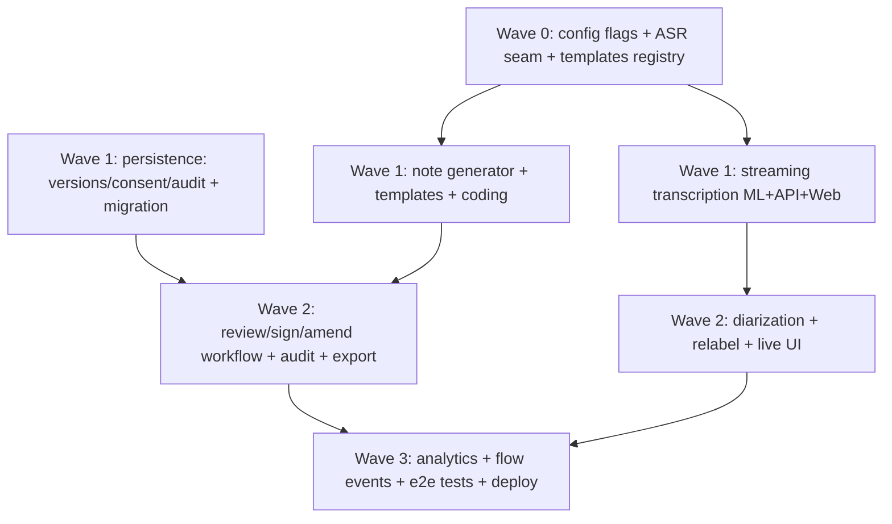

# Implementation Plan: Clara Scribe Enterprise

## Overview

Additive + flag-gated. Each leaf task references requirements. Property tests (P1–P6)
are first-class. "✅ done with all flags off ⇒ legacy unchanged" is the standing gate.

## Task Dependency Graph



Subagent assignment (run waves in order; tasks WITHIN a wave are parallel-safe — different files):
- **SA-ML** (`general-task-execution`): ML tasks (ASR seam, streaming, generator, coding, diarization).
- **SA-API** (`general-task-execution`): API tasks (persistence, routes, RBAC, audit, export, migration).
- **SA-WEB** (`general-task-execution`): Web tasks (scribe lib client, UI, sign/export).
- **SA-PBT** (`spec-task-execution`): property-based tests P1–P6.
Coordinate so SA-ML and SA-API do not edit the same files; Web depends on ML+API contracts.

```json
{
  "waves": [
    { "wave": 0, "name": "Foundations", "tasks": ["0.1", "0.2", "0.3", "0.4", "0.5"], "dependsOn": [] },
    { "wave": 1, "name": "Pipeline + persistence", "tasks": ["1.1", "1.2", "1.3", "1.4", "1.5", "1.6", "1.7"], "dependsOn": [0] },
    { "wave": 2, "name": "Workflow + diarization + export", "tasks": ["2.1", "2.2", "2.3", "2.4", "2.5", "2.6", "2.7"], "dependsOn": [1] },
    { "wave": 3, "name": "Observability + verification + deploy", "tasks": ["3.1", "3.2", "3.3", "3.4", "3.5"], "dependsOn": [2] }
  ]
}
```

---

## Tasks

## Wave 0 — Foundations

- [ ] 0.1 Add Scribe feature flags + ASR provider/language settings to `services/ml/.../config.py` and `services/api/.../core/config.py` (all default off/legacy). _Req 11_
- [ ] 0.2 Define the ASR provider seam (`AsrProvider`, `AsrSegment`, `AsrResult`, `AsrEvent`) + `CompositeAsr` (primary→fallback, import-safe, never raises) in `services/ml/.../scribe/asr/`. Wrap current `DeepSeekClient.transcribe_audio` as `WhisperDeepSeekAsr`. _Req 2_
- [ ] 0.3 Add a Vietnamese-capable provider impl (Google STT V2 Chirp-3 client, or PhoWhisper HTTP client) behind the seam; code-switching config to keep English tokens verbatim. _Req 2_
- [ ] 0.4 Templates registry (pure data: SOAP + H&P + progress + referral + VN bệnh án) with ordered section keys in `services/ml/.../scribe/templates.py`. _Req 6_
- [ ] 0.5 Unit tests for the ASR seam (fallback, degraded, import-safety) + templates registry shape.

## Wave 1 — Pipeline + persistence

- [ ] 1.1 ML `POST /v1/scribe/stream` SSE (start→partial/segment→done/error), reusing the chat-stream SSE helpers; degraded chunk never fabricates text. _Req 1, 1.4_
- [ ] 1.2 API `POST /scribe/sessions/{id}/stream` SSE proxy (clinician RBAC + internal key + relay), mirroring `/api/v1/chat/stream`. _Req 1.6_
- [ ] 1.3 Web `lib/scribe.ts` `streamScribe()` SSE client (model on `streamChatMessage`) + vitest. _Req 1_
- [ ] 1.4 Alembic migration (additive): extend `ScribeSession` (encounter_json, asr_meta_json, consent_id) + new `ScribeNoteVersion`, `ScribeConsent`, `ScribeAudit`. _Req 5, 8_
- [ ] 1.5 ORM models + `can_transition` lifecycle table (pure) for status legality. _Req 8.1_
- [ ] 1.6 ML `NoteGenerator.generate(transcript, template_id)` — exact section keys, `insufficient_input` on empty, guardrail prompt, no fabricated meds/allergies. _Req 6_
- [ ] 1.7 ML `CodingAssistant.suggest(note)` — ICD suggestions + drug normalization via RAG lexicon + DDI advisory via CareGuard. _Req 7_

## Wave 2 — Workflow, diarization, export

- [ ] 2.1 API consent capture `POST /scribe/sessions/{id}/consent` (immutable record + audit) + consent-required guard on transcription. _Req 4_
- [ ] 2.2 API note lifecycle: `POST /notes` (generate+persist version), `POST /sign`, `POST /amend` (signed immutable → new version), enforce `can_transition`, write audit. _Req 8_
- [ ] 2.3 API `GET /scribe/sessions/{id}/audit` (read-only, append-only). _Req 8.4_
- [ ] 2.4 API segment relabel `PATCH /scribe/sessions/{id}/segments/{seg}` (text unchanged + audit). _Req 3.3, 3.4_
- [ ] 2.5 Diarization wiring: surface `speaker` on segments from provider; default `unknown`. _Req 3_
- [ ] 2.6 Export `GET /scribe/sessions/{id}/export?format=md|docx|fhir` (md + reuse workspace DOCX + FHIR DocumentReference shape; only signed/exported). _Req 9_
- [ ] 2.7 Web review/sign/export UI: consent gate → live transcript w/ speaker chips + process panel → template picker → note editor → sign → export; batch fallback. _Req 1, 8, 9_

## Wave 3 — Observability + verification + deploy

- [ ] 3.1 Scribe flow/telemetry events for pipeline stages (consent/transcribe/diarize/generate/code/sign), reusing the flow-event mechanism. _Req 10.3_
- [ ] 3.2 Analytics: derive time-saved / edit-rate / degraded-rate from non-PII session metadata; assert PII-free telemetry. _Req 10.1, 10.4_
- [ ] 3.3 **Property tests P1–P6** (template completeness, transcript preservation, no-fabrication, audit/sign immutability, transition legality, PII-free telemetry). _Verification_
- [ ] 3.4 Integration tests: ML (ASR seam + generator + coding), API (routes + RBAC + audit + export), Web (streaming + sign). Existing scribe suite stays green. _Verification_
- [ ] 3.5 Regression gate: all flags off ⇒ behavior byte-for-byte current; then staged flag enablement + deploy (ml→api→web) with disk monitoring + instant rollback.

---

## Notes

### Checkpoints
- After Wave 0: ML lint clean, ASR seam + templates unit tests green.
- After Wave 1: streaming SSE works end-to-end (curl), migration applies, generator/coding unit tests green.
- After Wave 2: full review→sign→export flow works; consent enforced; audit immutable.
- After Wave 3: P1–P6 + integration green; legacy regression green; deployed behind flags.
