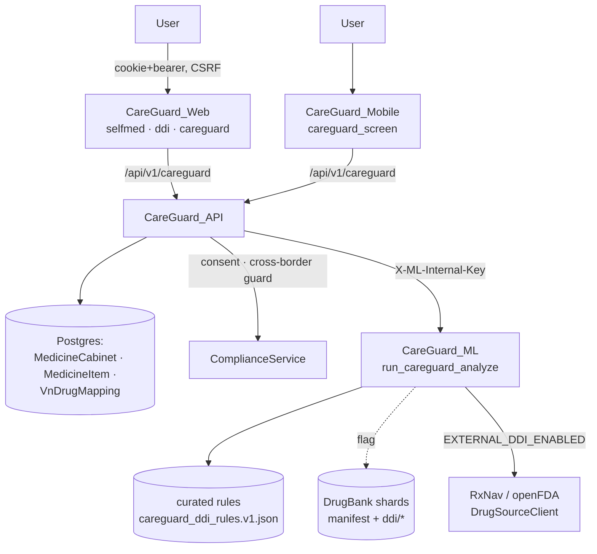
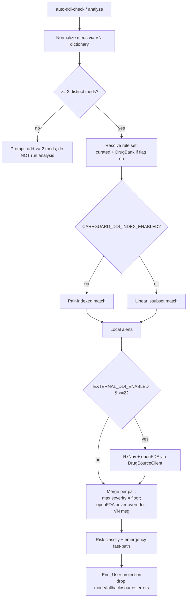

# Design Document

## Overview

This design hardens the existing Self-Medication, DDI, and CareGuard stack into
production-grade quality. It is purely **additive and feature-flagged**; with
every new flag off the system behaves exactly as today, and no clinical reasoning
or safety guardrail changes. It reuses the components already in the repo and
adds only the seams needed to fix the concrete gaps:

| Gap (today) | Existing CLARA mechanism (reused) | New seam (added) |
|---|---|---|
| Brand/manufacturer packed into `note` `[meta]` | `MedicineItem`, `_encode/_decode_item_note` | Structured columns + dual-read shim (flag) |
| Linear `issubset` scan over all rules | `_detect_ddi_alerts`, `_resolve_ddi_rules` | Pair-indexed matcher (flag), identical result set |
| Severity floor / openFDA-message protection only in comments | `_merge_drug_alerts` (INV-2/INV-3) | Pinned by property tests; explicit floor helper |
| DrugBank layer not scale-safe | `_load_drugbank_ddi_rules`, manifest+shards | Index build + integrity/version verification + provisioning runbook |
| No client offline fallback | server `fallback_used`, local-rules path | Cached last result labeled degraded (flag) |
| Partial mobile parity | `careguard_screen.dart` DDI check | Mobile cabinet CRUD against same API (flag) |
| Thin observability | `trackCareguardViewed/DdiChecked`, `ddi_aggregation` event | No-PII per-source/fallback/latency metrics (flag) |
| No expiry reminders | client-side expiry stats | Reminder state persistence (flag) |
| Uneven tests | API cabinet + proxy tests | Property suite P1..P12 + flags-off regression |

### Feature Flags (all default OFF / preserving current behavior)

```
SELFMED_CABINET_STRUCTURED_FIELDS_ENABLED=false  # first-class brand/manufacturer/form/expiry columns
SELFMED_EXPIRY_REMINDERS_ENABLED=false           # persist per-item expiry reminder state
CAREGUARD_DDI_INDEX_ENABLED=false                # pair-indexed matcher for scale
CAREGUARD_OFFLINE_FALLBACK_ENABLED=false         # client cached/last-known DDI result
CAREGUARD_MOBILE_CABINET_ENABLED=false           # mobile cabinet CRUD parity
CAREGUARD_OBSERVABILITY_ENABLED=false            # no-PII per-source/fallback/latency metrics
```

Existing flags are unchanged and remain the source of truth for their behavior:
`CAREGUARD_DRUGBANK_ENABLED` (default off), `EXTERNAL_DDI_ENABLED` (default off),
`OPENFDA_LABEL_ALERTS_ENABLED` (default on). When a new flag is off, the
corresponding endpoint/behavior reproduces today's output exactly (Requirement
12.1, 12.2).

## Architecture

### System context



### DDI analysis flow (with severity floor)



### Where it lives

- **API**: extend `services/api/src/clara_api/api/v1/endpoints/careguard.py`
  (cabinet CRUD, OCR, `auto-ddi-check`, `analyze` proxy). Structured-field
  persistence is a dual-read/dual-write shim behind
  `SELFMED_CABINET_STRUCTURED_FIELDS_ENABLED`, backed by a reversible Alembic
  migration adding nullable columns to `MedicineItem`.
- **ML**: extend `services/ml/src/clara_ml/agents/careguard.py` with a
  pair-indexed matcher and an explicit severity-floor helper; both inert behind
  flags / behaviorally identical to the linear path.
- **Data**: `nlp/seed_data/drugbank/` (flag-gated) plus
  `scripts/data/drugbank_ingest.py` for operator provisioning; the bulk shards
  are license-restricted and provisioned out of band.
- **Web**: `apps/web/app/selfmed/*`, `apps/web/app/careguard/page.tsx`, and
  `apps/web/lib/{selfmed,careguard}.ts` (projection + offline cache).
- **Mobile**: `apps/mobile/lib/screens/careguard_screen.dart` (+ a cabinet
  screen) behind `CAREGUARD_MOBILE_CABINET_ENABLED`.

### Design principles

1. **Additive & reversible.** New nullable columns and new modules only; every
   migration has a downgrade. No destructive schema change.
2. **Curated guidance is authoritative.** DrugBank, RxNav, and openFDA may only
   *raise* severity or *add* uncovered pairs; they never lower severity or
   overwrite curated Vietnamese copy.
3. **Safety floors are explicit and tested.** The severity floor and emergency
   fast-path become pinned properties, not just comments.
4. **End_User never sees internals.** The projection strips runtime mode,
   fallback flags, connector names, and `source_errors`.

## Components and Interfaces

### A. Cabinet persistence (Req 1, 2, 10)

- Alembic migration adds nullable `brand_name`, `manufacturer`, `dosage_form`,
  and a reminder-state column to `MedicineItem`.
- `_to_item_response` gains a dual-read: when structured fields are present use
  them; otherwise decode the legacy `[meta]` note (Req 1.4). Writes populate
  structured columns when `SELFMED_CABINET_STRUCTURED_FIELDS_ENABLED` is on, and
  continue the `[meta]` encoding when off (Req 1.2, 1.3).
- Duplicate guard keys on `(cabinet_id, normalized_name)` (Req 1.5); owner-scope
  check on every mutation (Req 1.6); quantity/expiry validation (Req 1.7).

### B. Normalization & OCR (Req 2)

- Reuse `_resolve_dictionary_mapping_with_source` (db → candidate → fallback)
  and the existing OCR correction (`correct_ocr_text`, noisy-char map, size
  bound). Low-confidence detections keep the explicit per-item confirm gate
  before import. Unmatched names are retained and flagged "needs review".

### C. DDI matcher & severity model (Req 3, 4, 5)

- `_resolve_ddi_rules()` keeps curated-first precedence; DrugBank merges only
  uncovered pairs (existing behavior, now pinned by test).
- **Pair-indexed matcher** (new, behind `CAREGUARD_DDI_INDEX_ENABLED`): build a
  `dict[frozenset[str], list[InteractionRule]]` once per rule-set version
  (cached by mtime). For a medicine set of size *n*, enumerate the C(n,2) pairs
  and look each up — O(n²) in meds instead of O(R) in rules. The returned alert
  set is asserted identical to the linear matcher (Req 5.4, Property P8).
- **Severity floor helper**: `_merge_drug_alerts` continues to take max severity
  per pair (`_SEVERITY_RANK`) and to protect curated Vietnamese messages from
  openFDA-only overrides (INV-2); openFDA severity stays capped at `high`
  (INV in `drug_sources.py`). These become Properties P3/P4/P5.
- Risk classification (`_risk_from_signals`) and the emergency fast-path
  (`_CRITICAL_SYMPTOMS` → escalate) are unchanged and pinned by P6/P9.

### D. DrugBank provisioning & integrity (Req 5)

- `scripts/data/drugbank_ingest.py` produces `manifest.json` (version, source,
  license, timestamp, per-shard counts) + `ddi/*` + `dictionary/*` shards.
- Loader verifies the manifest, caches by mtime, and degrades to curated-only on
  any missing/unparseable shard (Req 5.3). The active rule-set version label is
  surfaced in `metadata.local_ddi_rules_version` (e.g. `v1+drugbank-…`).
- A short runbook documents out-of-band provisioning and the curated-only
  default (Req 5.6).

### E. Offline / degraded mode (Req 6)

- Server already returns a local-rules result and records `fallback_used`.
- Client (web + mobile) caches the last successful `DdiUserView`; when offline
  and `CAREGUARD_OFFLINE_FALLBACK_ENABLED` is on, it renders the cached view
  labeled "offline / không phải thời gian thực" (Req 6.3). A read failure of the
  curated store fails closed with a safe Vietnamese message (Req 6.4).

### F. Mobile parity (Req 8)

- Add a cabinet screen calling the same `/api/v1/careguard/cabinet*` endpoints
  behind `CAREGUARD_MOBILE_CABINET_ENABLED`; reuse the Dart `_DdiUserView`
  projection so internals never surface.

### G. Observability (Req 9)

- Keep coarse product events. Behind `CAREGUARD_OBSERVABILITY_ENABLED`, emit
  no-PII metrics: per-source usage, fallback rate, normalization confidence,
  active rule-set version, per-check latency. Admin-only aggregate read.

## Data Models

All new columns are **additive + nullable**, created by a reversible Alembic
migration (next sequential number after the current head).

### `medicine_items` (extend)

| column | type | note |
|---|---|---|
| brand_name | varchar null | structured (replaces `[meta]` note encoding when flag on) |
| manufacturer | varchar null | structured |
| dosage_form | varchar null | structured |
| expiry_reminder_json | JSON null | per-item reminder state (flag-gated) |

Existing columns (`drug_name`, `normalized_name`, `dosage`, `quantity`,
`source`, `rx_cui`, `ocr_confidence`, `expires_on`, `note`) are unchanged. The
legacy `[meta]` note remains readable forever (Req 1.4).

### DDI rule index (in-memory, ML)

`dict[frozenset[str], list[InteractionRule]]` derived from the resolved rule
set; rebuilt when the rule-set version/mtime changes. Not persisted.

## Correctness Properties

Property 1: Cabinet CRUD round-trip — creating then reading an item returns the same drug name, normalized name, dosage, quantity, brand, and manufacturer regardless of whether structured-field persistence is on or the legacy `[meta]` encoding is used.
**Validates: Requirements 1.1, 1.2, 1.4**

Property 2: Owner isolation — a mutation or delete targeting an item not owned by the caller is rejected, and no other user's rows are affected.
**Validates: Requirements 1.6, 11.5**

Property 3: Severity floor — for every medication pair, the merged severity equals the maximum severity asserted by any contributing source; merging never lowers a pair's severity.
**Validates: Requirements 4.1, 4.2**

Property 4: openFDA message protection — an openFDA-only signal never replaces a curated rule's Vietnamese message and never creates a standalone alert for a pair no curated/RxNav source raised.
**Validates: Requirements 4.3**

Property 5: Free-text severity cap — any severity inferred from free-text label text is at most `high` (never `critical`).
**Validates: Requirements 4.4**

Property 6: Two-medicine guard — with fewer than two distinct normalized medicines, no DDI analysis runs and the user is prompted to add more.
**Validates: Requirements 3.1**

Property 7: End_User projection purity — the projected view contains no runtime mode, fallback flag, connector identifier, HTTP status detail, or `source_errors`, and all alert/recommendation copy is Vietnamese (no English passthrough).
**Validates: Requirements 3.4, 3.5, 6.2**

Property 8: Index equivalence — the pair-indexed matcher returns exactly the same alert set as the linear `issubset` matcher for any rule set and medicine list.
**Validates: Requirements 5.4, 11.3**

Property 9: Emergency fast-path — a recognized critical symptom escalates the risk level to at least `high` (and `critical` together with a high-risk DDI) and yields a "seek urgent care" recommendation, with no diagnosis or prescription text.
**Validates: Requirements 7.1, 7.2**

Property 10: DrugBank precedence and flags-off equivalence — with `CAREGUARD_DRUGBANK_ENABLED` off the DrugBank directory is never read and output equals the curated-only baseline; with it on, a curated pair's severity and message are preserved and DrugBank only adds uncovered pairs.
**Validates: Requirements 5.1, 5.2**

Property 11: No-PII telemetry — every CareGuard telemetry/metrics payload passes a redaction-projection assertion (no drug names, brands, notes, or user-id values).
**Validates: Requirements 9.2, 11.4, 12.3**

Property 12: Flags-off byte-equivalence — with all new flags off, the cabinet API responses, the ML analysis request payload, and the response envelope are byte-equivalent to the pre-feature baseline.
**Validates: Requirements 11.2, 12.1, 12.2**

## Error Handling

- **Fail closed for safety, never fabricate all-clear.** If the curated rule
  store cannot be read, the affected analysis returns a safe Vietnamese message
  rather than an empty "no interaction" result (Req 6.4).
- **External sources are best-effort.** Timeouts/errors are caught, recorded in
  `source_errors` internally, and never block the local result or leak to the
  End_User (Req 6.1, 6.5, 3.4).
- **Cabinet validation** rejects duplicates, non-owner mutations, and malformed
  quantity/expiry with descriptive, PII-free errors.
- **DrugBank degradation** falls back to curated-only on any missing/unparseable
  shard (Req 5.3).

## Testing Strategy

- **Property tests** (hypothesis on the API/ML Python side, fast-check / unit on
  the web TS side) for P1..P12, mirroring the existing
  `services/api/tests` and `apps/web/lib/careguard.test.ts` styles.
- **Flags-off regression gate**: assert byte-equivalence of cabinet responses,
  ML payload, and envelope with every new flag off (P12).
- **Index-equivalence test**: random rule sets + medicine lists, linear vs.
  indexed matcher (P8).
- **DrugBank merge test**: synthetic curated + DrugBank fixtures asserting
  precedence and uncovered-only contribution (P10).
- **No-PII guard**: adversarial drug names/identifiers fed into telemetry,
  asserting the persisted projection drops them (P11).
- **Migration round-trip**: upgrade/downgrade of the additive columns.

## Backward-Compatibility, Guardrail & Privacy Strategy

Every existing invariant — consent gate, cross-border transfer guard,
PHR-reconciliation, no-prescribing/no-diagnosis hard boundary, DDI severity
floor, emergency fast-path, no-PII telemetry, RBAC/owner-scoping, CSRF — is
preserved and, where relevant, re-asserted by a new test. The feature ships dark
(flags off), is enabled per environment, and can be fully disabled by flipping
flags without redeploying clinical code.
