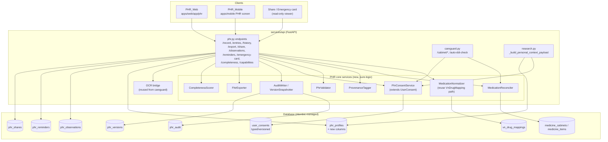
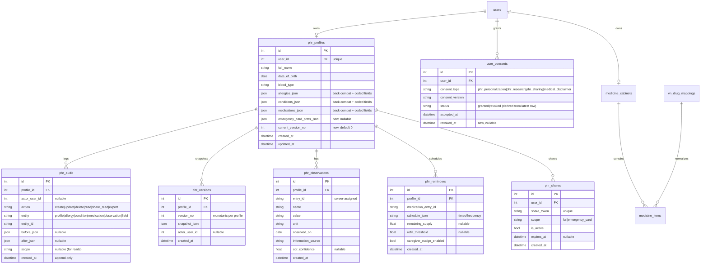
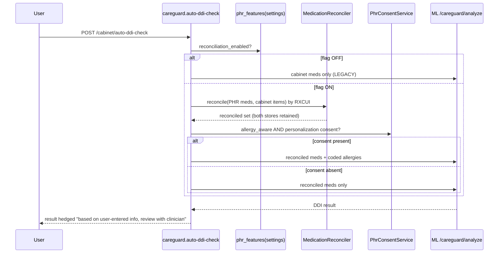

# Design Document

## Overview

This design enhances the **existing** Personal Health Record (PHR) capability so it becomes
standards-aligned, consent-gated, auditable, and a first-class driver of medication safety and
personalization — **without breaking the current behavior**. Today the PHR is a single
self-overwriting `PhrProfile` row (free-text `allergies_json` / `conditions_json` /
`medications_json`), served by `GET/PUT /api/v1/phr/record` in
`services/api/src/clara_api/api/v1/endpoints/phr.py`, edited at `apps/web/app/phr/page.tsx`, and
**ignored by CareGuard/DDI**, which reads only the `MedicineCabinet`.

The enhancement is **additive, feature-flagged, and back-compatible**. Every new behavior is gated
behind a feature flag that **defaults off**. With all flags off, `GET/PUT /record` returns the
exact current response shape and CareGuard sees only the `MedicineCabinet` — preserving existing
medical-safety guardrails. New capabilities layer on top:

- A versioned **Alembic migration** that resolves the long-standing gap where `phr_profiles` was
  only ever created by SQLAlchemy `create_all` (no migration). The migration creates the table if
  absent, preserves data if present, adds new structured columns, and creates new tables for
  audit, version snapshots, observations, reminders, and shares — all reversibly.
- **Structured + coded clinical data**: medications with structured dose/frequency/route and RXCUI
  (via the existing `VnDrugMapping` normalization path), allergies with coded substance / reaction
  / severity / `verificationStatus`, conditions with ICD-10 / SNOMED + clinical status.
- **Provenance** (`informationSource` ∈ `self-declared | ocr | imported`) and **verificationStatus**
  on every entry.
- **Unified medication reconciliation** that merges PHR meds with `MedicineCabinet` items by RXCUI
  (retaining both source stores) and feeds **allergy-aware DDI** into CareGuard.
- **Immutable audit + version snapshots + access logging**, **OCR import with mandatory human
  confirmation** (reusing the existing OCR bridge), **structured lab/Observation capture**,
  **FHIR-aligned export**, **revocable read-only sharing** (reusing the workspace share mechanism),
  an **emergency summary card**, **medication reminders / refill tracking / caregiver nudge**,
  stronger **validation/data sanity**, a **USCDI-aligned completeness meter**, and **mobile parity**.

The PHR remains **self-declared, decision-support data only** — not an EMR/EHR or medical device,
not legally binding, complementary to Sổ Sức Khỏe Điện Tử / VNeID. All decision-support output is
hedged and directs the user to a clinician. The UI is Vietnamese-first with bilingual vi/en copy.

### Feature Flags (all default OFF)

Flags follow the existing `Settings` (`services/api/src/clara_api/core/config.py`) pattern — a
pydantic `Field(default=False, validation_alias=...)`, mirroring the `rag_scribe_*` flags. A master
flag gates everything; sub-flags allow staged rollout. A sub-flag has effect only when the master
flag is also on.

| Setting (env alias) | Default | Gates |
|---|---|---|
| `phr_enhanced_enabled` (`PHR_ENHANCED_ENABLED`) | `False` | Master switch. OFF ⇒ legacy `GET/PUT /record` shape, no new endpoints active, CareGuard sees cabinet only. |
| `phr_consent_enforcement_enabled` (`PHR_CONSENT_ENFORCEMENT_ENABLED`) | `False` | Typed/versioned PHR consent gate for personalization, research, sharing (Req 2). |
| `phr_reconciliation_enabled` (`PHR_RECONCILIATION_ENABLED`) | `False` | Feed reconciled PHR+cabinet meds to CareGuard (Req 7). |
| `phr_allergy_aware_ddi_enabled` (`PHR_ALLERGY_AWARE_DDI_ENABLED`) | `False` | Add coded allergies to CareGuard checks (Req 7.3–7.4). |
| `phr_ocr_import_enabled` (`PHR_OCR_IMPORT_ENABLED`) | `False` | OCR candidate→confirm import into PHR (Req 9). |
| `phr_observations_enabled` (`PHR_OBSERVATIONS_ENABLED`) | `False` | Structured lab/Observation capture (Req 10). |
| `phr_export_enabled` (`PHR_EXPORT_ENABLED`) | `False` | FHIR-aligned export (Req 11). |
| `phr_sharing_enabled` (`PHR_SHARING_ENABLED`) | `False` | Read-only sharing + emergency card sharing (Req 12, 13). |
| `phr_reminders_enabled` (`PHR_REMINDERS_ENABLED`) | `False` | Reminders, refill tracking, caregiver nudge (Req 14). |
| `phr_completeness_meter_enabled` (`PHR_COMPLETENESS_METER_ENABLED`) | `False` | USCDI completeness score (Req 16). |

A single helper `phr_features(settings)` resolves effective flags (`master AND sub`) so call sites
never re-implement the AND. The web/mobile clients read effective flags from the existing
`MobileSummaryResponse.feature_flags` / a `GET /api/v1/phr/capabilities` projection.

## Architecture

### System context



### Data model (ER)



### Request flow (reconciliation + allergy-aware DDI)



### Design principles

- **Flag-gated additivity.** The legacy code path is the default. New logic branches only when
  `phr_features(...)` reports the relevant flag on. Flags-off ⇒ byte-for-byte legacy response shape
  (Req 18.1).
- **Both stores preserved.** Reconciliation is a *read-time projection*; it never deletes from the
  PHR medication list or the `MedicineCabinet` (Req 7.6).
- **Append-only history.** Audit and version tables are written, never updated or deleted in
  application code; immutability is enforced at the service boundary and asserted by tests (Req 8.4).
- **Server owns identity & sanity.** Entry IDs are assigned/verified server-side; future dates and
  out-of-range values are rejected before persistence (Req 15).
- **Privacy by projection.** Telemetry and analytics receive counts/flags/severities only — never
  names, free-text, drug lists, or codes — mirroring `product-polish-analytics`'s PII-free
  projection contract (Req 16.4, 18.6).
- **Consent before use.** PHR data enters personalization, research, or sharing only when a
  matching, non-revoked typed consent exists (Req 2), consistent with `clara-research`'s
  consent-gated personalization.
- **Back-compat coding.** New coded fields are *added alongside* existing JSON item fields; old
  fields keep their meaning and remain populated, so old clients and the legacy response keep working.

## Components and Interfaces

### A. Schema migration & hardening (Req 1)

**New migration** `services/api/alembic/versions/20260411_0010_phr_enhanced.py`
(`revision = "20260411_0010"`, `down_revision = "20260410_0009"` — the current head).

Because `phr_profiles` was historically created only by `create_all`, the migration must be
**idempotent about the table's existence** and **non-destructive**:

```python
def upgrade() -> None:
    bind = op.get_bind()
    inspector = sa.inspect(bind)
    tables = set(inspector.get_table_names())

    # 1. Create phr_profiles only if create_all never made it (Req 1.2).
    if "phr_profiles" not in tables:
        op.create_table("phr_profiles", ... all existing columns ...)
        op.create_index("ix_phr_profiles_user_id", "phr_profiles", ["user_id"], unique=True)
        existing_cols = set()
    else:
        existing_cols = {c["name"] for c in inspector.get_columns("phr_profiles")}

    # 2. Add new structured columns only when missing (Req 1.1, 1.3 — preserve data).
    with op.batch_alter_table("phr_profiles") as batch:
        for col in NEW_PHR_COLUMNS:            # emergency_card_prefs_json, current_version_no
            if col.name not in existing_cols:
                batch.add_column(col)

    # 3. Create new tables (each guarded by "not in tables").
    for name, creator in (("phr_audit", _create_audit), ("phr_versions", _create_versions),
                          ("phr_observations", _create_obs), ("phr_reminders", _create_reminders),
                          ("phr_shares", _create_shares)):
        if name not in tables:
            creator()
```

- New structured medication/allergy/condition fields live **inside the existing JSON columns**
  (see Data Models), so no column changes are needed for them — only `emergency_card_prefs_json`
  and `current_version_no` are new scalar columns.
- `downgrade()` drops the five new tables and the two new columns (reversible, Req 1.4). It does
  **not** drop `phr_profiles` itself (it predates this migration and may hold data).
- Alembic runs each migration in a transaction; on failure the transaction rolls back leaving the
  prior schema intact (Req 1.5). For SQLite, `batch_alter_table` provides the copy-and-move
  semantics already used in `20260410_0009`.
- A startup/CI guard asserts `phr_profiles` is migration-managed (no reliance on `create_all` in
  production), satisfying Req 1.2.

### B. Consent enforcement — `PhrConsentService` (Req 2)

Extends the existing `UserConsent` table and `core/consent.py` rather than introducing a new store.

- New consent types: `phr_personalization`, `phr_research`, `phr_sharing`. Each grant/revoke is a
  **new typed, versioned row** (`consent_type`, `consent_version`, `accepted_at`); revocation sets
  `revoked_at` on a new row with `status="revoked"`. "Currently granted" = the latest row for
  `(user_id, consent_type)` has `status="granted"` and a non-null `accepted_at` and null
  `revoked_at` (Req 2.1, 2.6).
- API:
  ```python
  class PhrConsentService:
      def is_granted(db, user_id, purpose: Literal["personalization","research","sharing"]) -> bool
      def grant(db, user_id, purpose, version) -> UserConsent
      def revoke(db, user_id, purpose) -> UserConsent   # appends a revoked row
  ```
- Enforcement points (only when `phr_consent_enforcement_enabled`):
  - `research._build_tier2_upstream_payload`: skip `personal_context` if personalization consent
    absent (Req 2.2); skip research personal-mode context if research consent absent (Req 2.3).
  - `careguard.auto-ddi-check`: include allergies only if personalization consent present (Req 7.3).
  - `phr.share` creation: reject with `409`/`428` descriptive error if sharing consent absent (Req 2.5, 12.6).
- Revocation takes effect on the **next** request because each request reads current consent (Req 2.4).
- New endpoints: `GET /api/v1/phr/consent`, `POST /api/v1/phr/consent` (`{purpose, granted}`).

### C. Structured & coded medications — `MedicationNormalizer` (Req 3)

Reuses the careguard normalization path (`_resolve_dictionary_mapping_with_source`, `VnDrugMapping`,
`VnDrugMappingAlias`, `DRUG_RXCUI_MAP`). Exposed as a thin importable service so PHR and CareGuard
share one code path.

- Each PHR medication item gains structured fields: `dose_amount` (float|null), `dose_unit`,
  `frequency`, `route`, `start_date`, `is_current`, plus coded `rx_cui`, `normalized_name`,
  `normalization_source`, `is_normalized` (Req 3.1).
- On save, name → `(display, normalized_name, rx_cui, source, confidence)`; when an RXCUI resolves
  it is stored; otherwise `rx_cui=""` and `is_normalized=false` (Req 3.2, 3.3).
- Two items resolving to the same non-empty RXCUI are flagged `duplicate_of` for reconciliation
  (Req 3.4).
- `dose_unit` must be in `SUPPORTED_DOSE_UNITS = {mg, g, mcg, ml, IU, %, tablet, capsule, drop,
  puff, unit}`; anything else ⇒ `422` naming the invalid unit (Req 3.5).

### D. Coded allergies (Req 4) & coded conditions (Req 5)

- Allergy item fields: existing `name`, `reaction`, `severity`, `note` **plus** `substance` (coded
  display), `coded_substance_id` (`""` when uncoded), `is_coded` (bool), `verification_status`
  (`unconfirmed` default for self-declared) (Req 4.1–4.4). Severity must be in
  `{mild, moderate, severe, unknown}` else `422` (Req 4.5).
- Condition item fields: existing `name`, `status`, `diagnosed_on`, `note` **plus** `icd10_code`,
  `snomed_code`, `is_coded` (Req 5.1–5.3). Status must be in
  `{active, resolved, monitoring, unknown}` else `422` (Req 5.4). A `ConditionCoder` offers codes
  when the name matches a known coding entry (seeded lookup), but acceptance never blocks on coding.

### E. Provenance & verification — `ProvenanceTagger` (Req 6)

- Every allergy/condition/medication/observation entry carries `information_source` ∈
  `{self-declared, ocr, imported}` and `verification_status` (Req 6.1).
- Manual edit ⇒ `self-declared`; OCR confirm ⇒ `ocr`; structured import ⇒ `imported` (Req 6.2–6.4).
  The tag is assigned **server-side based on the write path**, never trusted from the client.
- `PHR_Web` and `PHR_Mobile` render source + verification badges per entry (Req 6.5, 17.3).
- Any DDI/personalization output built from PHR data carries a hedge string ("dựa trên thông tin
  bạn tự khai / based on your self-entered information") (Req 6.6, 18.5).

### F. Reconciliation & allergy-aware DDI — `MedicationReconciler` (Req 7)

Pure function consumed by `careguard.auto-ddi-check` (and surfaced via `GET /phr/reconciliation`):

```python
def reconcile(phr_meds: list[PhrMed], cabinet_items: list[MedicineItem]) -> ReconciliationResult:
    # group by non-empty rx_cui; un-coded items keyed by normalized_name
    # each reconciled entry retains source refs: {"phr": [...ids], "cabinet": [...ids]}
```

- Flags-off (`phr_reconciliation_enabled` false): CareGuard receives cabinet data only — current
  behavior (Req 7.5).
- Flags-on: reconciled set = union keyed by RXCUI; same-RXCUI PHR + cabinet items collapse to one
  reconciled medication while **both source records are retained and referenced** (Req 7.1, 7.2, 7.6).
- When `phr_allergy_aware_ddi_enabled` and personalization consent present, coded allergies are
  added to the `/v1/careguard/analyze` payload; an allergy↔medication conflict is surfaced in the
  result `allergy_conflicts` array (Req 7.3, 7.4).
- Conservation invariant: every input med id appears in exactly one reconciled group's source refs;
  no input is dropped (Req 7.6).

### G. History, versioning & audit — `AuditWriter` / `VersionSnapshotter` (Req 8)

- On any committed create/update/delete of profile or entry, append a `phr_audit` row
  `{actor, action, entity, entity_id, before_json, after_json, created_at}` (Req 8.1).
- On each committed change, write a `phr_versions` snapshot with a **monotonically increasing**
  `version_no` (per profile) and bump `phr_profiles.current_version_no` (Req 8.2).
- Non-owner / share reads append an access audit row `{accessor, action="share_read"|"read",
  scope, created_at}` (Req 8.3).
- Audit/version rows are **append-only**: the service exposes only inserts and reads; no update/
  delete path exists; a test asserts immutability (Req 8.4).
- `GET /phr/history` returns version snapshots in reverse-chronological order (Req 8.5).
- Updates are applied at **entry/field level** via a diff/patch endpoint
  (`PATCH /phr/entries/{kind}/{id}`) so partial edits don't overwrite the whole profile (Req 8.6).
  The legacy `PUT /record` remains a whole-profile upsert for back-compat.

### H. OCR import with mandatory confirmation (Req 9)

Reuses the existing OCR bridge (`careguard._scan_with_tgc_ocr`, `_apply_ocr_correction`,
`_detect_drugs_from_text`) — no new OCR engine.

- `POST /phr/import/ocr/scan` (multipart) → returns **candidate** entries (meds/labs) with per-entry
  `ocr_confidence`; nothing is committed (Req 9.1, 9.6).
- `POST /phr/import/ocr/confirm` → accepts the user-edited candidate list; only then are entries
  written with `information_source="ocr"` and retained `ocr_confidence` (Req 9.2, 9.4).
- The web review UI lets the user edit/accept/discard each candidate (Req 9.3). Abandoning review
  commits nothing (candidates are never persisted server-side until confirm) (Req 9.5).
- Low-confidence candidates reuse careguard's `requires_manual_confirm`/`confirmed` gating so
  unconfirmed low-confidence rows are blocked from commit.

### I. Structured lab/Observation capture (Req 10)

- New `phr_observations` table + `POST/GET /phr/observations`. Fields: `name`, `value`, `unit`,
  `observed_on`, `information_source`, `ocr_confidence` (Req 10.1, 10.2).
- Units in `NUMERIC_UNITS` (e.g. mg/dL, mmol/L, mmHg, bpm, %) require a numeric `value`; otherwise
  `422` (Req 10.3).
- Observations export as FHIR `Observation` resources (Req 10.4).

### J. FHIR-aligned export — `FhirExporter` (Req 11)

- `GET /phr/export?resource=all|patient|allergy|condition|medication|observation` (Req 11.3).
- Produces a FHIR R4-aligned **Bundle** of `Patient`, `AllergyIntolerance`, `Condition`,
  `MedicationStatement`, `Observation` (Req 11.1). Self-declared resources set
  `informationSource`/`subject` to the patient (Req 11.2). `verificationStatus` maps onto each
  resource's `verificationStatus` element (Req 11.5).
- Returned as a downloadable `application/fhir+json` file with `Content-Disposition` (Req 11.4).
- Round-trip helper `from_bundle(to_bundle(record)) ≈ record` for the coded fields used in export
  (basis for Property 11).

### K. Read-only sharing & access logging (Req 12) + Emergency card (Req 13)

- Reuses the workspace share mechanism shape (`WorkspaceConversationShare`: `share_token`,
  `is_active`, `expires_at`). New `phr_shares` table with `scope ∈ {full, emergency_card}`.
- `POST /phr/share` creates a revocable read-only link (rejected if sharing consent absent — Req
  12.6); `DELETE /phr/share/{token}` revokes (Req 12.3). Public read endpoint
  `GET /phr/shared/{token}` is **read-only** — any write attempt via the share returns `405/403`
  (Req 12.2). Expired or revoked tokens deny access (Req 12.3, 12.5). Every share access appends an
  access audit row (Req 12.4, 13.2).
- Emergency card (`GET /phr/emergency-card`) projects allergies, current meds, conditions, blood
  type, emergency contact, with owner-controlled field inclusion (`emergency_card_prefs_json`)
  (Req 13.1, 13.3). Empty sections render as empty, never error (Req 13.4). The persistent
  self-declared/decision-support disclaimer is always rendered (Req 13.5).

### L. Reminders, refill tracking, caregiver nudge — `ReminderService` (Req 14)

- New `phr_reminders` table keyed to a medication entry. Reminders configurable only for current
  meds with a defined frequency (Req 14.1). Due reminders are issued to the owner (Req 14.2).
- Supply/refill: `remaining_supply` + `refill_threshold`; reaching the threshold issues a refill
  reminder (Req 14.3, 14.4).
- Caregiver missed-dose nudge: when enabled **and** an active caregiver share exists, an un-acked
  dose within the window notifies the designated caregiver (Req 14.5). Notification dispatch reuses
  the existing email/notification path; the scheduling/decision logic is pure and unit/property-tested.

### M. Validation & data sanity — `PhrValidator` (Req 15)

- Reject future `date_of_birth` (Req 15.1), future `diagnosed_on`/medication `start_date`/
  observation `observed_on` (Req 15.2) with descriptive `422`.
- Server assigns/verifies entry IDs; client-supplied IDs are regenerated/validated server-side
  (Req 15.3).
- Duplicate detection within a category (same RXCUI for meds, same normalized substance for
  allergies, same name+code for conditions) sets a `duplicate` flag (Req 15.4).
- Length/range limits reuse and extend the existing pydantic `Field(max_length=...)` constraints;
  violations ⇒ `422` (Req 15.5).

### N. Completeness meter — `CompletenessScorer` (Req 16)

- Pure function over USCDI-aligned classes (Patient demographics, Allergies, Medications, Problems,
  Immunizations, Procedures, Labs) → `{score: 0..1, present: [...], missing: [...]}` (Req 16.1).
- `PHR_Web` shows score + missing classes (Req 16.2). Adding data to a missing class monotonically
  increases the score on recompute (Req 16.3).
- Telemetry emitted during compute/display contains only the numeric score and class *names present/
  missing* — never values, names, or codes (PII-free projection) (Req 16.4).

### O. Web & Mobile (Req 6.5, 16.2, 17, 18.4, 18.7)

- **Web** (`apps/web/app/phr`, `apps/web/lib/phr.ts`): extend `PhrRecord` types with the new coded/
  provenance fields (optional, defaulted) so existing rendering keeps working; add provenance/
  verification badges, completeness meter, OCR review modal, export button, share manager,
  emergency-card editor, reminders panel. New surfaces use the shared `AsyncSection`
  loading/empty/error/populated pattern from `product-polish-analytics`. Persistent disclaimer
  banner on every PHR surface.
- **Mobile** (`apps/mobile/lib/screens/phr_screen.dart`, new): view/edit profile, allergies,
  conditions, medications with the same server-enforced validation; render source/verification
  badges and the persistent disclaimer; Vietnamese-first bilingual copy (Req 17.1–17.5).
- Both clients read effective flags from `GET /phr/capabilities` and hide flagged-off surfaces.

## Data Models

### Evolution strategy: additive, back-compatible JSON

The existing item shapes (`PhrAllergyItem`, `PhrConditionItem`, `PhrMedicationItem` in
`schemas.py`) are **extended, not replaced**. All existing fields keep their names and meaning; new
coded/provenance fields are **optional with safe defaults**, so:

- Old records (lacking new fields) deserialize fine — defaults fill the gaps.
- Old clients sending only legacy fields keep working (server fills provenance/coding server-side).
- The legacy `PhrRecordResponse` continues to validate when flags are off; new fields are only
  surfaced on the enhanced response variant.

#### Medication item (stored in `phr_profiles.medications_json`)

```jsonc
{
  // --- existing (unchanged) ---
  "id": "srv_…",            // server-assigned/verified (Req 15.3)
  "name": "Panadol",
  "dose": "500mg",          // legacy free-text retained for back-compat
  "frequency": "2x/day",
  "started_on": "2026-01-05",
  "is_current": true,
  "note": "",
  // --- new structured (Req 3) ---
  "dose_amount": 500.0,
  "dose_unit": "mg",        // must ∈ SUPPORTED_DOSE_UNITS
  "route": "oral",
  // --- new coded (Req 3.2/3.3) ---
  "normalized_name": "paracetamol",
  "rx_cui": "161",
  "normalization_source": "db",   // db|candidate|fallback
  "is_normalized": true,
  "duplicate_of": null,            // entry id when same RXCUI (Req 3.4/15.4)
  // --- new provenance (Req 6) ---
  "information_source": "self-declared",
  "verification_status": "unconfirmed",
  "ocr_confidence": null
}
```

#### Allergy item (in `allergies_json`)

```jsonc
{
  "id": "srv_…",
  "name": "Penicillin",              // existing
  "reaction": "rash",                // existing
  "severity": "moderate",            // existing, ∈ {mild,moderate,severe,unknown} (Req 4.5)
  "note": "",                         // existing
  "substance": "penicillin",         // new coded display (Req 4.1)
  "coded_substance_id": "7980",      // "" when uncoded (Req 4.2/4.4)
  "is_coded": true,
  "information_source": "self-declared",
  "verification_status": "unconfirmed"  // self-declared default (Req 4.3)
}
```

#### Condition item (in `conditions_json`)

```jsonc
{
  "id": "srv_…",
  "name": "Type 2 diabetes",         // existing
  "status": "active",                // existing, ∈ {active,resolved,monitoring,unknown} (Req 5.4)
  "diagnosed_on": "2024-09-01",      // existing, not future (Req 15.2)
  "note": "",                         // existing
  "icd10_code": "E11",               // new (Req 5.1)
  "snomed_code": "44054006",         // new
  "is_coded": true,
  "information_source": "self-declared",
  "verification_status": "unconfirmed"
}
```

### New columns on `phr_profiles`

| Column | Type | Null | Default | Purpose |
|---|---|---|---|---|
| `emergency_card_prefs_json` | JSON | yes | `null` | Owner-selected emergency card fields (Req 13.3) |
| `current_version_no` | Integer | no | `0` | Latest snapshot version pointer (Req 8.2) |

### New tables (created by `20260411_0010`)

- **`phr_audit`** — append-only edit/access log: `id, profile_id(FK→phr_profiles, CASCADE),
  actor_user_id(null), action, entity, entity_id, before_json, after_json, scope, created_at`
  (indexes on `profile_id`, `action`). (Req 8.1, 8.3)
- **`phr_versions`** — version snapshots: `id, profile_id(FK), version_no, snapshot_json,
  actor_user_id(null), created_at`. Unique `(profile_id, version_no)`; `version_no` monotonic
  per profile. (Req 8.2, 8.5)
- **`phr_observations`** — `id, profile_id(FK), entry_id, name, value, unit, observed_on,
  information_source, ocr_confidence(null), created_at`. (Req 10)
- **`phr_reminders`** — `id, profile_id(FK), medication_entry_id, schedule_json, remaining_supply
  (null), refill_threshold(null), caregiver_nudge_enabled(bool), created_at`. (Req 14)
- **`phr_shares`** — `id, user_id(FK), share_token(unique), scope(full|emergency_card),
  is_active(bool), expires_at(null), created_at`. (Req 12, 13)

### `user_consents` extension

No structural change required beyond a nullable `revoked_at` column (added by the migration if
absent). Typed PHR consents are new rows distinguished by `consent_type ∈ {phr_personalization,
phr_research, phr_sharing}`; "currently granted" is derived from the latest row per
`(user_id, consent_type)`. (Req 2.1, 2.6)

## Correctness Properties

*A property is a characteristic or behavior that should hold true across all valid executions of a
system — essentially, a formal statement about what the system should do. Properties serve as the
bridge between human-readable specifications and machine-verifiable correctness guarantees.*

The following properties were derived from the acceptance-criteria prework and consolidated to
remove redundancy. Each is universally quantified and implementable as a single property-based test.

### Property 1: Consent gate

*For any* user, PHR data class (personalization / research) or sharing action, and *any* sequence of
grant/revoke events, the PHR data is used (or the action is permitted) **if and only if** the latest
typed consent for that purpose is `granted` and not revoked; absence or revocation excludes the data
/ rejects the action with a descriptive error.

**Validates: Requirements 2.2, 2.3, 2.4, 2.5, 7.3, 12.6**

### Property 2: RXCUI normalization soundness

*For any* medication name, the normalizer returns the mapping's `normalized_name` and non-empty
`rx_cui` with `is_normalized = true` when the name resolves through the `VnDrugMapping`/alias path,
and returns `rx_cui = ""` with `is_normalized = false` when it does not.

**Validates: Requirements 3.2, 3.3**

### Property 3: Duplicate detection (dedup)

*For any* set of entries within one category, two entries are flagged as duplicates **iff** they
share the same non-empty RXCUI (medications) or the same normalized substance/condition code; no
entry sharing a key with another is left unflagged, and no entry with a unique key is flagged.

**Validates: Requirements 3.4, 15.4**

### Property 4: Coding soundness

*For any* allergy substance or condition name, when it matches a known coding entry the system
assigns the corresponding coded identifier (`coded_substance_id` / `icd10_code` / `snomed_code`) and
sets `is_coded = true`; otherwise it retains the free-text value and sets `is_coded = false`.

**Validates: Requirements 4.2, 4.4, 5.2, 5.3**

### Property 5: Validation rejection

*For any* entry containing an out-of-domain value — a future `date_of_birth`, `diagnosed_on`,
medication `start_date`, or observation `observed_on`; a dose unit outside `SUPPORTED_DOSE_UNITS`; a
severity outside `{mild, moderate, severe, unknown}`; a clinical status outside
`{active, resolved, monitoring, unknown}`; a non-numeric value for a numeric-required unit; or a
field exceeding its length/range limit — the write is rejected with a descriptive error that
identifies the offending field/value, and the stored record is unchanged.

**Validates: Requirements 3.5, 4.5, 5.4, 10.3, 15.1, 15.2, 15.5**

### Property 6: Provenance integrity

*For any* entry write, the stored `information_source` equals the write path (`self-declared` for
manual edit, `ocr` for OCR confirm, `imported` for structured import), every persisted entry carries
a valid `information_source`, and any entry created from self-declared input has
`verification_status = unconfirmed`.

**Validates: Requirements 4.3, 6.1, 6.2, 6.3, 6.4, 9.4, 10.2**

### Property 7: Decision-support output is hedged

*For any* DDI or personalization output produced from PHR data, the output text contains the
self-declared hedge and clinician-review guidance.

**Validates: Requirements 6.6, 18.5**

### Property 8: Reconciliation conservation

*For any* PHR medication set and `MedicineCabinet` item set, the reconciled set keyed by RXCUI is the
union in which items sharing a non-empty RXCUI collapse into exactly one reconciled medication whose
source references include every contributing PHR and cabinet id; every input id appears in exactly
one reconciled group, and neither input store is mutated or has entries removed.

**Validates: Requirements 7.1, 7.2, 7.6**

### Property 9: Allergy-aware conflict surfacing

*For any* reconciled medication set and coded allergy set, the CareGuard result includes an allergy
conflict **iff** a reconciled medication matches a recorded allergy substance under the conflict
rule.

**Validates: Requirements 7.4**

### Property 10: Audit is append-only and immutable

*For any* sequence of create/update/delete operations on a profile or its entries, each operation
appends exactly one audit row capturing actor, action, entity, and affected entry/field; previously
written audit rows are never modified or removed, and the audit log is strictly growing.

**Validates: Requirements 8.1, 8.4**

### Property 11: Version snapshot monotonicity

*For any* sequence of committed changes to a profile, each change produces a new version snapshot
whose `version_no` is strictly greater than all prior snapshots for that profile, and
`current_version_no` equals the maximum; the history returned to the owner is ordered by
`version_no` descending (reverse chronological).

**Validates: Requirements 8.2, 8.5**

### Property 12: Access logging on non-owner / share reads

*For any* read of PHR data through a share link or by a non-owner (including emergency-card access),
the system appends exactly one access audit row capturing the accessor, timestamp, and scope.

**Validates: Requirements 8.3, 12.4, 13.2**

### Property 13: Targeted update conservation

*For any* profile and *any* single entry/field patch, the targeted entry/field is updated and all
other entries and fields remain byte-for-byte unchanged.

**Validates: Requirements 8.6**

### Property 14: OCR never auto-commits

*For any* OCR scan input, performing a scan leaves the PHR record unchanged; PHR entries are written
only when an explicit confirm request is made, and abandoning review (no confirm) leaves the record
unchanged.

**Validates: Requirements 9.1, 9.2, 9.5**

### Property 15: FHIR export round-trip and shape

*For any* PHR record, the exported bundle contains a resource of the correct FHIR type for each
record element (Patient, AllergyIntolerance, Condition, MedicationStatement, Observation), sets
`informationSource`/subject to the patient for self-declared resources, preserves each entry's
`verificationStatus` on the corresponding resource, a single-resource export equals the matching
subset of the full bundle, and re-importing the bundle recovers the coded fields
(`from_bundle(to_bundle(record))` is equivalent to `record` on exported fields).

**Validates: Requirements 10.4, 11.1, 11.2, 11.3, 11.5**

### Property 16: Share access control

*For any* share token and access attempt at time `now`, read access is granted **iff** the share is
active and (`expires_at` is null or `now < expires_at`); a revoked or expired token is denied; and
any write/modification attempt through a share is always rejected.

**Validates: Requirements 12.2, 12.3, 12.5**

### Property 17: Emergency-card projection

*For any* PHR record and owner field-inclusion preferences, the emergency summary card contains a
critical field (allergies, current medications, conditions, blood type, emergency contact) **iff**
that field is enabled in the preferences, and an empty record yields empty sections without error.

**Validates: Requirements 13.1, 13.3, 13.4**

### Property 18: Reminder decision logic

*For any* medication and reminder/refill/nudge configuration, a medication reminder fires exactly
when the medication is current with a defined frequency and a configured time is reached; a refill
reminder fires exactly when `remaining_supply ≤ refill_threshold`; and a caregiver is notified
exactly when the missed-dose nudge is enabled, a caregiver share is active, and a dose is not marked
taken within the configured window.

**Validates: Requirements 14.1, 14.2, 14.3, 14.4, 14.5**

### Property 19: Completeness monotonicity

*For any* PHR record, the completeness score is a deterministic value in `[0, 1]` computed from the
present USCDI-aligned data classes, and adding data to a previously-missing class produces a score
that is strictly greater (never lower) on the next computation.

**Validates: Requirements 16.1, 16.3**

### Property 20: PII-free telemetry

*For any* PHR-derived telemetry or analytics payload (including completeness computation/display),
the emitted payload contains no PHR PII — no names, free-text, drug-name lists, codes, or contact
details — only counts, class names, severities, flags, and numeric scores.

**Validates: Requirements 16.4, 18.6**

### Property 21: RBAC and owner-only access

*For any* PHR request, access requires one of the roles `normal`, `researcher`, `doctor`, or
`admin`; write and full-read access succeed only for the owning user; a non-owner without an
explicit active share is denied; and a valid share grants read-only access only.

**Validates: Requirements 18.2, 18.3**

### Property 22: Flags-off legacy equivalence

*For any* `GET`/`PUT /api/v1/phr/record` request, when all PHR feature flags are off the response
equals the output of the current legacy serializer (same fields, same shape), and CareGuard receives
only `MedicineCabinet` data.

**Validates: Requirements 18.1, 7.5**

## Error Handling

- **Validation errors (`422`)** — `PhrValidator` returns descriptive, Vietnamese-first bilingual
  messages naming the offending field/value (invalid unit, severity, status, future date,
  out-of-range, non-numeric observation). Mirrors existing pydantic `Field`-based 422s.
- **Consent precondition (`428`/`409`)** — missing required PHR consent for personalization/research
  is silently skipped (data excluded, never an error to the research flow); a missing **sharing**
  consent on a share-creation request returns a descriptive error (Req 2.5, 12.6).
- **Authorization (`401`/`403`)** — unknown user → `401` (existing `_get_user_by_token`); non-owner
  access without share → `403`; write attempt via share → `403/405`.
- **Share access (`404`/`410`)** — unknown token → `404`; revoked/expired token → `410 Gone` with a
  clear message; never leaks whether a record exists for an invalid token.
- **OCR import** — scan failures surface the existing OCR-bridge error; low-confidence unconfirmed
  candidates are blocked at confirm with `422` (reusing careguard's `manual_confirmation_required`
  contract). Scan never partially commits.
- **Migration** — runs in a transaction; on failure Alembic rolls back, leaving the prior schema
  intact (Req 1.5). Existence checks make the migration safe to run against both fresh and
  `create_all`-seeded databases.
- **External hedge** — all PHR-derived DDI/personalization output is wrapped with the self-declared,
  decision-support-only hedge and a clinician-review prompt, so even partial/degraded results never
  read as clinical advice.

## Testing Strategy

### Dual approach

- **Property tests** verify the 22 universal properties above across generated inputs.
- **Unit/example tests** cover concrete shapes and storage (Req 2.1/2.6, 3.1, 4.1, 5.1, 10.1),
  downloadable-file behavior (11.4), and UI presence (disclaimer, badges, language toggle).
- **Integration tests** cover the migration (Req 1) and the OCR-bridge reuse (Req 9.6).

### Libraries & tagging

- **Python API**: `hypothesis`. Each property test runs **≥ 100 iterations**
  (`@settings(max_examples=100)`), tagged `# Feature: personal-health-record, Property {n}: {text}`.
  Targets: consent gate, normalization soundness, dedup, coding soundness, validation rejection,
  provenance, hedge, reconciliation conservation, allergy conflict, audit append-only, version
  monotonicity, access logging, targeted update, OCR-never-auto-commit, export round-trip/shape,
  share access control, emergency-card projection, reminder decision, completeness monotonicity,
  PII-free telemetry, RBAC/owner-only, flags-off equivalence (Properties 1–22).
- **Web (TypeScript)**: `fast-check` for client-side pure logic — provenance/verification badge
  mapping, completeness display projection, emergency-card field projection, DDI end-user view hedge
  presence, and PII-free analytics payload (reusing the `product-polish-analytics` `stripPii`
  contract). ≥ 100 runs each, same tag format.
- **Mobile (Dart)**: model/widget tests for the PHR screen — render parity, source/verification
  badges, persistent disclaimer, vi/en language toggle, and that the client submits to the same
  validated server contract (Req 17). Not property-based (UI rendering/parity).

### Migration tests (Req 1)

1. Upgrade on a fresh DB creates `phr_profiles` (with new columns) and the five new tables.
2. Seed `phr_profiles` via `create_all` + a populated row, run upgrade: assert the row's data is
   preserved and the new columns/tables exist (no `create_all` reliance).
3. Upgrade then downgrade: assert the five new tables and two new columns are dropped and prior
   schema/data remain intact.

### Generators

- Medications drawn from a mix of known `VnDrugMapping`/alias names (to exercise normalization) and
  random non-drug strings (to exercise the unnormalized path), with controlled RXCUI collisions for
  dedup/reconciliation.
- Dates spanning past/today/future to exercise future-date rejection.
- Consent event sequences (grant/revoke interleavings) per purpose.
- Records including the **empty record** and maximal-size records (to hit length limits and
  empty-section rendering).
- Share states across `(is_active, expires_at, now)` and access methods (read vs write).

## Backward-Compatibility, Guardrail & Privacy Strategy

- **Back-compat**: With all flags off, `GET/PUT /record` uses the unchanged legacy serializer and
  shape (Property 22). New JSON fields are additive and optional; old records and old clients keep
  working. The legacy whole-profile `PUT` is retained alongside the new entry/field-level `PATCH`.
- **Guardrails preserved**: RBAC roles `{normal, researcher, doctor, admin}` and owner-only access
  remain enforced (Property 21); the medical-disclaimer consent gate (`ensure_medical_disclaimer_
  consent`) is untouched; CareGuard's cabinet-only path is the default (Property 22). DDI output from
  PHR data is always hedged toward clinician review (Property 7).
- **Privacy**: PHR PII never enters telemetry/analytics; outward signals are produced by a PII-free
  projection emitting counts/classes/flags only (Property 20), consistent with
  `product-polish-analytics`. De-identification happens before any analytics use. Consent gates all
  personalization, research, and sharing use of PHR data (Property 1), consistent with
  `clara-research`.
- **Framing**: Every PHR surface (web + mobile + shared/emergency views) renders the persistent
  self-declared, decision-support-only, not-an-EMR/EHR, not-legally-binding disclaimer, Vietnamese-
  first with bilingual vi/en copy (Req 13.5, 18.4, 18.7).
- **Reversibility**: Each flag can be turned off independently to revert to prior behavior; the
  migration provides reversible downgrades; no destructive data operations are introduced.
