# Implementation Plan: Personal Health Record (Enhanced)

## Overview

This plan enhances the existing PHR capability into a standards-aligned, consent-gated, auditable
driver of medication safety and personalization — **additively and behind feature flags that default
off**. Each task builds on prior steps and is wired into the system so there is no orphaned code:
shared pure-logic services (consent, normalizer, reconciler, provenance, validator, FHIR exporter,
completeness, reminders) are built first, then consumed by the API endpoints, CareGuard, and
research call sites, then surfaced in web and mobile. With all flags off, `GET/PUT
/api/v1/phr/record` and CareGuard's cabinet-only path stay byte-for-byte equivalent to today.

The epics map to design components A–O:

| Epic | Design components | Theme |
|---|---|---|
| 1 | A | Alembic migration & schema hardening |
| 2 | B | Consent service + enforcement points |
| 3 | C | Structured + coded medications (normalizer) |
| 4 | D | Coded allergies |
| 5 | D | Coded conditions |
| 6 | E | Provenance + verification + hedge |
| 7 | F | Reconciliation + allergy-aware DDI |
| 8 | G | Audit / version snapshots + entry/field PATCH |
| 9 | H | OCR import candidate→confirm |
| 10 | I | Observations table + endpoints |
| 11 | J | FHIR exporter |
| 12 | K | Read-only sharing + access logging |
| 13 | K | Emergency card |
| 14 | L | Reminders / refill / caregiver nudge |
| 15 | M | PhrValidator |
| 16 | N | CompletenessScorer (PII-free) |
| 17 | O | Web surfaces + mobile PHR screen |
| 18 | — | Guardrail / back-compat / privacy preservation suite |

### Testing prerequisites (set up once, in task 1.1)

- **Python (`services/api`)**: `hypothesis` for property tests, `pytest` runner. Property tests run
  `@settings(max_examples=100)` and are tagged `# Feature: personal-health-record, Property {n}`.
  Migration tests use a throwaway SQLite DB plus an Alembic config harness.
- **Web (`apps/web`)**: `fast-check` for client-side pure logic, run with the existing test runner
  (`--run` single execution, not watch).
- **Mobile (`apps/mobile`)**: `flutter test` model/widget tests (not property-based).

Code paths referenced throughout:
`services/api/src/clara_api/api/v1/endpoints/phr.py`, `…/careguard.py`, `…/research.py`,
`…/schemas.py`, `services/api/src/clara_api/db/models.py`,
`services/api/src/clara_api/core/config.py`, `…/core/consent.py`,
`services/api/alembic/versions/`, `apps/web/app/phr/page.tsx`, `apps/web/lib/phr.ts`,
`apps/mobile/lib/screens/`.

---

## Tasks

- [x] 1. Feature-flag scaffolding and shared PHR test harness
  - [x] 1.1 Add PHR feature flags and the `phr_features()` resolver
    - In `core/config.py` add `phr_enhanced_enabled` (master) and the sub-flags
      `phr_consent_enforcement_enabled`, `phr_reconciliation_enabled`,
      `phr_allergy_aware_ddi_enabled`, `phr_ocr_import_enabled`, `phr_observations_enabled`,
      `phr_export_enabled`, `phr_sharing_enabled`, `phr_reminders_enabled`,
      `phr_completeness_meter_enabled`, each `Field(default=False, validation_alias=...)`
      mirroring the `rag_scribe_*` pattern.
    - Add a `phr_features(settings)` helper returning effective flags as `master AND sub`.
    - Add `GET /api/v1/phr/capabilities` projecting effective flags for web/mobile.
    - Set up the testing prerequisites listed above (`hypothesis`, `fast-check`, a SQLite Alembic
      migration-test harness) so later property/migration tasks can run.
    - _Requirements: 18.1_

  - [ ]* 1.2 Unit test the flag resolver
    - Assert sub-flags have no effect while the master flag is off, and that `capabilities`
      reflects `master AND sub`.
    - _Requirements: 18.1_

- [x] 2. Alembic migration & schema hardening (Component A)
  - [x] 2.1 Add new columns and ORM models to `db/models.py`
    - Add `emergency_card_prefs_json` (JSON, nullable) and `current_version_no` (Integer, default 0)
      to the `PhrProfile` model.
    - Add ORM models for `phr_audit`, `phr_versions`, `phr_observations`, `phr_reminders`,
      `phr_shares` per the ER diagram; add nullable `revoked_at` to `UserConsent`.
    - _Requirements: 1.1, 8.2, 2.1, 2.6, 10.1, 12.1, 13.1, 14.1_

  - [x] 2.2 Write the idempotent, reversible migration `20260411_0010_phr_enhanced.py`
    - `revision = "20260411_0010"`, `down_revision = "20260410_0009"`.
    - `upgrade()`: create `phr_profiles` only if absent (Req 1.2); add the two new columns only when
      missing via `batch_alter_table` (Req 1.1, 1.3); create the five new tables each guarded by a
      `not in tables` existence check; add `user_consents.revoked_at` if absent.
    - `downgrade()`: drop the five new tables and the two new columns (and `revoked_at`); never drop
      `phr_profiles`.
    - _Requirements: 1.1, 1.2, 1.3, 1.4, 1.5_

  - [ ]* 2.3 Write the three migration integration tests
    - Test A — fresh create: upgrade on an empty DB creates `phr_profiles` (with new columns) and
      the five new tables.
    - Test B — `create_all` preservation: seed `phr_profiles` via `create_all` + a populated row,
      run upgrade, assert the row data is preserved and new columns/tables exist.
    - Test C — upgrade/downgrade reversibility: upgrade then downgrade drops the five tables and two
      columns while prior schema/data remain intact.
    - _Requirements: 1.2, 1.3, 1.4, 1.5_

  - [x] 2.4 Add the startup/CI guard asserting `phr_profiles` is migration-managed
    - Assert production does not rely on `create_all` for `phr_profiles`.
    - _Requirements: 1.2_

- [ ] 3. Shared pure-logic services — consent, normalizer, provenance, validator
  - [x] 3.1 Implement `PhrConsentService` (Component B)
    - In `core/consent.py` add consent types `phr_personalization`, `phr_research`, `phr_sharing`;
      implement `is_granted`, `grant` (new typed/versioned row), `revoke` (appends a `revoked` row
      setting `revoked_at`); "granted" = latest row per `(user_id, consent_type)` is `granted` with
      null `revoked_at`.
    - _Requirements: 2.1, 2.4, 2.6_

  - [ ]* 3.2 Property test — consent gate
    - **Property 1: Consent gate**
    - **Validates: Requirements 2.2, 2.3, 2.4, 2.5, 7.3, 12.6**

  - [x] 3.3 Implement `MedicationNormalizer` (Component C)
    - Expose the careguard normalization path (`_resolve_dictionary_mapping_with_source`,
      `VnDrugMapping`, `VnDrugMappingAlias`, `DRUG_RXCUI_MAP`) as an importable service returning
      `(display, normalized_name, rx_cui, source, confidence, is_normalized)`; define
      `SUPPORTED_DOSE_UNITS`; implement same-RXCUI duplicate flagging (`duplicate_of`).
    - _Requirements: 3.2, 3.3, 3.4_

  - [ ]* 3.4 Property test — RXCUI normalization soundness
    - **Property 2: RXCUI normalization soundness**
    - **Validates: Requirements 3.2, 3.3**

  - [ ]* 3.5 Property test — duplicate detection
    - **Property 3: Duplicate detection (dedup)**
    - **Validates: Requirements 3.4, 15.4**

  - [x] 3.6 Implement `ProvenanceTagger` (Component E)
    - Assign `information_source` server-side from the write path (`self-declared` | `ocr` |
      `imported`), default `verification_status="unconfirmed"` for self-declared; provide the
      hedge-string helper ("dựa trên thông tin bạn tự khai / based on your self-entered information").
    - _Requirements: 6.1, 6.2, 6.3, 6.4_

  - [ ]* 3.7 Property test — provenance integrity
    - **Property 6: Provenance integrity**
    - **Validates: Requirements 4.3, 6.1, 6.2, 6.3, 6.4, 9.4, 10.2**

  - [ ]* 3.8 Property test — decision-support hedge
    - **Property 7: Decision-support output is hedged**
    - **Validates: Requirements 6.6, 18.5**

  - [x] 3.9 Implement `PhrValidator` and coding lookups (Components M, D)
    - Reject future `date_of_birth`/`diagnosed_on`/`start_date`/`observed_on`; enforce dose-unit,
      severity, clinical-status domains; enforce numeric-required observation units; enforce
      length/range limits; server-side entry-ID assignment/verification; duplicate flagging; provide
      allergy-substance and `ConditionCoder` lookups (coded id / ICD-10 / SNOMED) with `is_coded`.
    - _Requirements: 3.5, 4.2, 4.4, 4.5, 5.2, 5.3, 5.4, 10.3, 15.1, 15.2, 15.3, 15.4, 15.5_

  - [ ]* 3.10 Property test — validation rejection
    - **Property 5: Validation rejection**
    - **Validates: Requirements 3.5, 4.5, 5.4, 10.3, 15.1, 15.2, 15.5**

  - [ ]* 3.11 Property test — coding soundness
    - **Property 4: Coding soundness**
    - **Validates: Requirements 4.2, 4.4, 5.2, 5.3**

- [x] 4. Extend PHR schemas with coded/provenance fields (Component D, Data Models)
  - [x] 4.1 Extend item schemas in `schemas.py`
    - Add new optional, defaulted fields to medication (`dose_amount`, `dose_unit`, `route`,
      `normalized_name`, `rx_cui`, `normalization_source`, `is_normalized`, `duplicate_of`,
      `information_source`, `verification_status`, `ocr_confidence`), allergy (`substance`,
      `coded_substance_id`, `is_coded`, `information_source`, `verification_status`), and condition
      (`icd10_code`, `snomed_code`, `is_coded`, `information_source`, `verification_status`) items,
      keeping all legacy fields so old records/clients still validate.
    - _Requirements: 3.1, 4.1, 5.1, 6.1_

  - [ ]* 4.2 Unit test additive schema back-compat
    - Assert legacy-only payloads deserialize with safe defaults and the legacy response shape
      validates unchanged.
    - _Requirements: 3.1, 4.1, 5.1_

- [ ] 5. Reconciliation & audit pure logic
  - [x] 5.1 Implement `MedicationReconciler` (Component F)
    - Pure `reconcile(phr_meds, cabinet_items)` grouping by non-empty RXCUI (uncoded by
      normalized_name), collapsing same-RXCUI items into one reconciled entry that retains
      `{"phr": [...], "cabinet": [...]}` source refs; never mutate or drop inputs.
    - _Requirements: 7.1, 7.2, 7.6_

  - [ ]* 5.2 Property test — reconciliation conservation
    - **Property 8: Reconciliation conservation**
    - **Validates: Requirements 7.1, 7.2, 7.6**

  - [x] 5.3 Implement `AuditWriter` / `VersionSnapshotter` (Component G)
    - Append-only `phr_audit` rows on create/update/delete; monotonic `phr_versions` snapshots with
      `current_version_no` bump; access-audit rows for non-owner/share/emergency reads; no
      update/delete path exposed; history read in reverse-chronological order.
    - _Requirements: 8.1, 8.2, 8.3, 8.4, 8.5_

  - [ ]* 5.4 Property test — audit append-only/immutable
    - **Property 10: Audit is append-only and immutable**
    - **Validates: Requirements 8.1, 8.4**

  - [ ]* 5.5 Property test — version snapshot monotonicity
    - **Property 11: Version snapshot monotonicity**
    - **Validates: Requirements 8.2, 8.5**

  - [ ]* 5.6 Property test — access logging on non-owner/share reads
    - **Property 12: Access logging on non-owner / share reads**
    - **Validates: Requirements 8.3, 12.4, 13.2**

- [x] 6. FHIR exporter & completeness scorer pure logic
  - [x] 6.1 Implement `FhirExporter` (Component J)
    - `to_bundle(record)` producing FHIR R4-aligned Patient / AllergyIntolerance / Condition /
      MedicationStatement / Observation; set `informationSource`/subject to patient for
      self-declared; map `verificationStatus`; support single-resource subset; `from_bundle`
      round-trip helper for coded fields.
    - _Requirements: 10.4, 11.1, 11.2, 11.3, 11.5_

  - [ ]* 6.2 Property test — FHIR export round-trip and shape
    - **Property 15: FHIR export round-trip and shape**
    - **Validates: Requirements 10.4, 11.1, 11.2, 11.3, 11.5**

  - [x] 6.3 Implement `CompletenessScorer` (Component N)
    - Pure scorer over USCDI classes → `{score, present, missing}`; deterministic, monotonic;
      PII-free projection emitting only counts/class names/scores for telemetry.
    - _Requirements: 16.1, 16.3, 16.4_

  - [ ]* 6.4 Property test — completeness monotonicity
    - **Property 19: Completeness monotonicity**
    - **Validates: Requirements 16.1, 16.3**

  - [ ]* 6.5 Property test — PII-free telemetry
    - **Property 20: PII-free telemetry**
    - **Validates: Requirements 16.4, 18.6**

  - [x] 6.6 Implement `ReminderService` decision logic (Component L)
    - Pure decision logic: medication reminder fires when current + defined frequency + configured
      time reached; refill reminder when `remaining_supply ≤ refill_threshold`; caregiver nudge when
      enabled + active caregiver share + dose un-acked within window. Notification dispatch reuses
      the existing notification path; only the decision logic is pure here.
    - _Requirements: 14.1, 14.2, 14.3, 14.4, 14.5_

  - [ ]* 6.7 Property test — reminder decision logic
    - **Property 18: Reminder decision logic**
    - **Validates: Requirements 14.1, 14.2, 14.3, 14.4, 14.5**

- [x] 7. Checkpoint — pure-logic services
  - Ensure all tests pass, ask the user if questions arise.

- [x] 8. Wire medications, allergies, conditions, provenance & validation into `phr.py`
  - [x] 8.1 Integrate normalizer/validator/provenance into the PHR write path
    - On entry create/update, run `MedicationNormalizer`, `PhrValidator`, and `ProvenanceTagger`
      server-side behind `phr_enhanced_enabled`; flags-off keeps the legacy upsert untouched.
    - _Requirements: 3.1, 3.2, 3.3, 3.4, 3.5, 4.1, 4.2, 4.3, 4.4, 4.5, 5.1, 5.2, 5.3, 5.4, 6.1, 6.2, 6.5, 15.1, 15.2, 15.3, 15.4, 15.5_

  - [x] 8.2 Add entry/field-level `PATCH /phr/entries/{kind}/{id}`
    - Apply targeted updates without overwriting the whole profile; legacy `PUT /record` retained as
      whole-profile upsert; emit audit + version snapshot on commit.
    - _Requirements: 8.6, 8.1, 8.2_

  - [ ]* 8.3 Property test — targeted update conservation
    - **Property 13: Targeted update conservation**
    - **Validates: Requirements 8.6**

- [x] 9. Wire history & consent endpoints into `phr.py`
  - [x] 9.1 Add `GET /phr/history` and consent endpoints
    - `GET /phr/history` returns reverse-chronological version snapshots; `GET /phr/consent` and
      `POST /phr/consent` ({purpose, granted}) call `PhrConsentService`.
    - _Requirements: 8.5, 2.1, 2.4, 2.6_

- [x] 10. Wire consent enforcement into research & CareGuard (Components B, F)
  - [x] 10.1 Enforce consent in `research.py`
    - In `_build_tier2_upstream_payload`/`_build_personal_context_payload`, skip `personal_context`
      when personalization consent absent and skip research personal-mode context when research
      consent absent (only when `phr_consent_enforcement_enabled`).
    - _Requirements: 2.2, 2.3, 2.4_

  - [x] 10.2 Wire reconciliation + allergy-aware DDI into `careguard.py`
    - In `auto-ddi-check`: flags-off ⇒ cabinet-only (legacy); `phr_reconciliation_enabled` ⇒ feed
      reconciled meds (both stores retained); `phr_allergy_aware_ddi_enabled` + personalization
      consent ⇒ add coded allergies and surface `allergy_conflicts`; hedge all PHR-derived output.
    - _Requirements: 7.1, 7.2, 7.3, 7.4, 7.5, 7.6, 6.6, 18.5_

  - [ ]* 10.3 Property test — allergy-aware conflict surfacing
    - **Property 9: Allergy-aware conflict surfacing**
    - **Validates: Requirements 7.4**

- [x] 11. OCR import candidate→confirm in `phr.py` (Component H)
  - [x] 11.1 Add OCR scan and confirm endpoints
    - `POST /phr/import/ocr/scan` returns candidates with per-entry `ocr_confidence` (nothing
      committed) reusing the careguard OCR bridge; `POST /phr/import/ocr/confirm` writes the
      user-edited list with `information_source="ocr"`, retaining confidence and reusing
      `requires_manual_confirm` gating.
    - _Requirements: 9.1, 9.2, 9.3, 9.4, 9.5, 9.6_

  - [ ]* 11.2 Property test — OCR never auto-commits
    - **Property 14: OCR never auto-commits**
    - **Validates: Requirements 9.1, 9.2, 9.5**

- [x] 12. Observations endpoints in `phr.py` (Component I)
  - [x] 12.1 Add `POST/GET /phr/observations`
    - Persist to `phr_observations` with provenance and numeric-unit validation; include in FHIR
      export as Observation resources.
    - _Requirements: 10.1, 10.2, 10.3, 10.4_

- [x] 13. Export, sharing & emergency card in `phr.py` (Components J, K)
  - [x] 13.1 Add `GET /phr/export`
    - `resource=all|patient|allergy|condition|medication|observation`; downloadable
      `application/fhir+json` with `Content-Disposition`.
    - _Requirements: 11.1, 11.2, 11.3, 11.4, 11.5_

  - [x] 13.2 Add sharing endpoints + access logging
    - `POST /phr/share` (rejects when sharing consent absent), `DELETE /phr/share/{token}`,
      read-only `GET /phr/shared/{token}` (write attempts → 403/405; revoked/expired → 410); append
      access audit on every share access.
    - _Requirements: 12.1, 12.2, 12.3, 12.4, 12.5, 12.6, 2.5_

  - [ ]* 13.3 Property test — share access control
    - **Property 16: Share access control**
    - **Validates: Requirements 12.2, 12.3, 12.5**

  - [x] 13.4 Add `GET /phr/emergency-card`
    - Project allergies, current meds, conditions, blood type, emergency contact with
      owner-controlled `emergency_card_prefs_json`; empty sections render empty; persistent
      disclaimer; append access audit on access.
    - _Requirements: 13.1, 13.2, 13.3, 13.4, 13.5_

  - [ ]* 13.5 Property test — emergency-card projection
    - **Property 17: Emergency-card projection**
    - **Validates: Requirements 13.1, 13.3, 13.4**

- [x] 14. Reminders endpoints in `phr.py` (Component L)
  - [x] 14.1 Add reminders/refill/caregiver-nudge endpoints
    - Configure reminders for current meds with frequency; track `remaining_supply`/
      `refill_threshold`; wire `ReminderService` decisions to the existing notification dispatch.
    - _Requirements: 14.1, 14.2, 14.3, 14.4, 14.5_

- [x] 15. Backend quality-gate checkpoint
  - Ensure all tests pass (`make lint` + API service tests), ask the user if questions arise.

- [x] 16. Web PHR surfaces (Component O — `apps/web/app/phr`, `apps/web/lib/phr.ts`)
  - [x] 16.1 Extend web PHR types and capability gating in `lib/phr.ts`
    - Add new coded/provenance fields (optional, defaulted) to `PhrRecord` types; read effective
      flags from `GET /phr/capabilities` to hide flagged-off surfaces.
    - _Requirements: 6.5, 18.1_

  - [x] 16.2 Build provenance/verification badges, completeness meter, and persistent disclaimer
    - Render source + verification badges per entry; completeness score + missing classes via the
      `AsyncSection` pattern; persistent self-declared/decision-support disclaimer on every surface;
      Vietnamese-first bilingual copy.
    - _Requirements: 6.5, 16.2, 18.4, 18.7_

  - [ ]* 16.3 Property test — web client-side pure logic (fast-check)
    - Badge mapping, completeness display projection, emergency-card field projection, DDI view
      hedge presence, and PII-free analytics payload (reusing `stripPii`).
    - **Covers Property 7 (hedge), Property 17 (emergency-card projection), Property 20 (PII-free) at the web client layer**
    - **Validates: Requirements 6.5, 6.6, 13.3, 16.4**

  - [x] 16.4 Build OCR review modal, export button, share manager, emergency-card editor, reminders panel
    - OCR review modal lets the user edit/accept/discard each candidate before confirm; export
      download; share create/revoke manager; emergency-card field-inclusion editor; reminders panel.
    - _Requirements: 9.3, 11.4, 12.1, 12.3, 13.3, 14.1_

- [x] 17. Mobile PHR screen (Component O — `apps/mobile/lib/screens/phr_screen.dart`)
  - [x] 17.1 Build the mobile PHR screen
    - View/edit profile, allergies, conditions, medications submitting to the same server-validated
      contract; render source/verification badges and the persistent disclaimer; Vietnamese-first
      bilingual copy; register in app navigation.
    - _Requirements: 17.1, 17.2, 17.3, 17.4, 17.5_

  - [ ]* 17.2 Mobile model/widget tests
    - Render parity, badges, persistent disclaimer, vi/en toggle, validated-contract submission.
    - _Requirements: 17.1, 17.2, 17.3, 17.4, 17.5_

- [ ] 18. Guardrail, back-compat & privacy preservation suite
  - [ ]* 18.1 Property test — flags-off legacy equivalence
    - **Property 22: Flags-off legacy equivalence**
    - **Validates: Requirements 18.1, 7.5**

  - [ ]* 18.2 Property test — RBAC and owner-only access
    - **Property 21: RBAC and owner-only access**
    - **Validates: Requirements 18.2, 18.3**

  - [ ]* 18.3 Regression tests for behavior-replacing changes
    - Migration of the former `create_all` table preserves data; whole-profile `PUT` vs entry/field
      `PATCH` equivalence on full payloads; CareGuard cabinet-only (flags off) vs reconciled (flags
      on); flags-off legacy response/CareGuard equivalence.
    - _Requirements: 1.3, 7.5, 7.6, 8.6, 18.1_

- [x] 19. Final checkpoint — full quality gate
  - Ensure all tests pass: `make lint` + API service tests + web (`fast-check`, single-run) +
    mobile (`flutter test`). Ask the user if questions arise.

## Notes

- Tasks marked with `*` are optional (tests) and can be skipped for a faster MVP; core
  implementation tasks are never optional.
- Each task references specific requirement clauses for traceability.
- Checkpoints (tasks 7, 15, 19) ensure incremental validation: pure-logic gate, backend gate, full
  gate.

### Property → implementing test task

| Property | Test task | Validates (requirements) |
|---|---|---|
| 1 — Consent gate | 3.2 | 2.2, 2.3, 2.4, 2.5, 7.3, 12.6 |
| 2 — RXCUI normalization soundness | 3.4 | 3.2, 3.3 |
| 3 — Duplicate detection | 3.5 | 3.4, 15.4 |
| 4 — Coding soundness | 3.11 | 4.2, 4.4, 5.2, 5.3 |
| 5 — Validation rejection | 3.10 | 3.5, 4.5, 5.4, 10.3, 15.1, 15.2, 15.5 |
| 6 — Provenance integrity | 3.7 | 4.3, 6.1, 6.2, 6.3, 6.4, 9.4, 10.2 |
| 7 — Decision-support hedge | 3.8 (API), 16.3 (web) | 6.6, 18.5 |
| 8 — Reconciliation conservation | 5.2 | 7.1, 7.2, 7.6 |
| 9 — Allergy-aware conflict surfacing | 10.3 | 7.4 |
| 10 — Audit append-only/immutable | 5.4 | 8.1, 8.4 |
| 11 — Version snapshot monotonicity | 5.5 | 8.2, 8.5 |
| 12 — Access logging (non-owner/share) | 5.6 | 8.3, 12.4, 13.2 |
| 13 — Targeted update conservation | 8.3 | 8.6 |
| 14 — OCR never auto-commits | 11.2 | 9.1, 9.2, 9.5 |
| 15 — FHIR export round-trip and shape | 6.2 | 10.4, 11.1, 11.2, 11.3, 11.5 |
| 16 — Share access control | 13.3 | 12.2, 12.3, 12.5 |
| 17 — Emergency-card projection | 13.5 (API), 16.3 (web) | 13.1, 13.3, 13.4 |
| 18 — Reminder decision logic | 6.7 | 14.1, 14.2, 14.3, 14.4, 14.5 |
| 19 — Completeness monotonicity | 6.4 | 16.1, 16.3 |
| 20 — PII-free telemetry | 6.5 (API), 16.3 (web) | 16.4, 18.6 |
| 21 — RBAC and owner-only access | 18.2 | 18.2, 18.3 |
| 22 — Flags-off legacy equivalence | 18.1 | 18.1, 7.5 |

All 22 design properties are mapped to a property-test sub-task above.

### Behavior-replacing changes carrying explicit regression tests

These changes alter or extend existing behavior; each has a dedicated regression test (task 18.3,
plus the migration tests in 2.3):

- **Migration of the `create_all`-seeded `phr_profiles` table** — formerly created at runtime by
  `create_all`; now Alembic-managed. Regression: tasks 2.3 (Test B, data preservation) and 18.3.
- **Whole-profile `PUT /record` vs entry/field `PATCH`** — legacy whole-profile upsert is retained;
  new targeted `PATCH` must not overwrite untouched fields. Regression: task 18.3 (equivalence on
  full payloads) and Property 13 (task 8.3).
- **CareGuard cabinet-only vs reconciled** — default stays cabinet-only; reconciled+allergy-aware
  path is flag-gated and must retain both stores. Regression: task 18.3 and Property 8 (task 5.2),
  Property 9 (task 10.3).
- **Flags-off legacy equivalence** — `GET/PUT /record` response shape and CareGuard input are
  byte-for-byte legacy when all flags are off. Regression: Property 22 (task 18.1) and task 18.3.

### Subagent assignment guidance

- **API agents** (Python, `services/api`): epics 1–15 (flags, migration/models, pure-logic
  services, endpoint wiring, research/CareGuard integration).
- **Web agents** (TypeScript, `apps/web`): epic 16.
- **Mobile agents** (Dart, `apps/mobile`): epic 17.
- **PBT agents**: all `*` property/regression test sub-tasks (3.2, 3.4, 3.5, 3.7, 3.8, 3.10, 3.11,
  5.2, 5.4, 5.5, 5.6, 6.2, 6.4, 6.5, 6.7, 8.3, 10.3, 11.2, 13.3, 13.5, 16.3, 17.2, 18.1, 18.2,
  18.3) — dispatched in the wave after the code they exercise.

Same-file edits are isolated into different waves to avoid write conflicts: `phr.py` is touched by
8.1/8.2, 9.1, 10.1(research)/10.2(careguard), 11.1, 12.1, 13.1/13.2/13.4, 14.1; `schemas.py` by 4.1;
`db/models.py` by 2.1; `careguard.py` by 10.2; `research.py` by 10.1; web `phr` page/lib by
16.1→16.2→16.4.

## Task Dependency Graph

```mermaid
graph TD
  T11["1.1 flags+harness"] --> T12["1.2* flag test"]
  T11 --> T21["2.1 models"]
  T21 --> T22["2.2 migration"]
  T22 --> T23["2.3* migration tests"]
  T22 --> T24["2.4 mgmt guard"]

  T11 --> T31["3.1 consent svc"]
  T31 --> T32["3.2* P1"]
  T11 --> T33["3.3 normalizer"]
  T33 --> T34["3.4* P2"]
  T33 --> T35["3.5* P3"]
  T11 --> T36["3.6 provenance"]
  T36 --> T37["3.7* P6"]
  T36 --> T38["3.8* P7"]
  T11 --> T39["3.9 validator"]
  T39 --> T310["3.10* P5"]
  T39 --> T311["3.11* P4"]

  T21 --> T41["4.1 schemas"]
  T41 --> T42["4.2* schema back-compat"]

  T33 --> T51["5.1 reconciler"]
  T51 --> T52["5.2* P8"]
  T21 --> T53["5.3 audit/version"]
  T53 --> T54["5.4* P10"]
  T53 --> T55["5.5* P11"]
  T53 --> T56["5.6* P12"]

  T41 --> T61["6.1 fhir exporter"]
  T61 --> T62["6.2* P15"]
  T11 --> T63["6.3 completeness"]
  T63 --> T64["6.4* P19"]
  T63 --> T65["6.5* P20"]
  T11 --> T66["6.6 reminder logic"]
  T66 --> T67["6.7* P18"]

  T33 --> T81["8.1 wire entries"]
  T39 --> T81
  T36 --> T81
  T41 --> T81
  T53 --> T81
  T81 --> T82["8.2 PATCH"]
  T82 --> T83["8.3* P13"]

  T53 --> T91["9.1 history+consent ep"]
  T31 --> T91

  T31 --> T101["10.1 research enforce"]
  T51 --> T102["10.2 careguard recon"]
  T31 --> T102
  T102 --> T103["10.3* P9"]

  T81 --> T111["11.1 ocr import"]
  T111 --> T112["11.2* P14"]

  T82 --> T121["12.1 observations"]
  T61 --> T121

  T61 --> T131["13.1 export ep"]
  T31 --> T132["13.2 sharing ep"]
  T53 --> T132
  T132 --> T133["13.3* P16"]
  T81 --> T134["13.4 emergency card"]
  T53 --> T134
  T134 --> T135["13.5* P17"]

  T66 --> T141["14.1 reminders ep"]

  T11 --> T161["16.1 web types"]
  T161 --> T162["16.2 badges/meter"]
  T162 --> T163["16.3* web fast-check"]
  T162 --> T164["16.4 modals/panels"]

  T11 --> T171["17.1 mobile screen"]
  T171 --> T172["17.2* mobile tests"]

  T81 --> T181["18.1* P22"]
  T102 --> T181
  T81 --> T182["18.2* P21"]
  T134 --> T183["18.3* regression"]
  T102 --> T183
  T22 --> T183
```



```json
{
  "waves": [
    { "id": 0, "tasks": ["1.1"] },
    { "id": 1, "tasks": ["1.2", "2.1", "3.1", "3.3", "3.6", "3.9", "6.3", "6.6", "16.1", "17.1"] },
    { "id": 2, "tasks": ["2.2", "3.2", "3.4", "3.5", "3.7", "3.8", "3.10", "3.11", "4.1", "5.3", "6.4", "6.5", "6.7", "16.2", "17.2"] },
    { "id": 3, "tasks": ["2.3", "2.4", "4.2", "5.1", "5.4", "5.5", "5.6", "6.1", "9.1", "10.1", "16.3", "16.4"] },
    { "id": 4, "tasks": ["5.2", "6.2", "8.1"] },
    { "id": 5, "tasks": ["8.2", "10.2"] },
    { "id": 6, "tasks": ["8.3", "10.3", "11.1", "12.1", "13.1", "13.2", "13.4", "14.1", "18.1", "18.2"] },
    { "id": 7, "tasks": ["11.2", "13.3", "13.5", "18.3"] }
  ]
}
```
