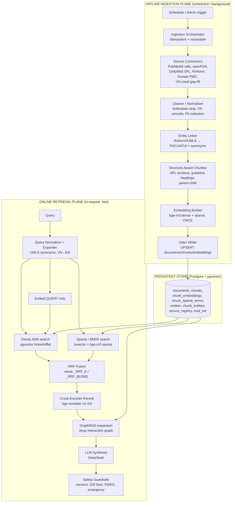
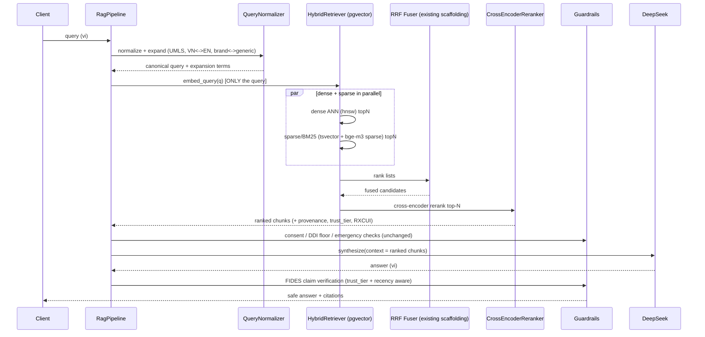
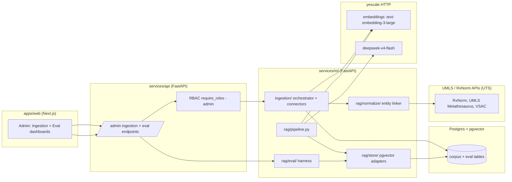
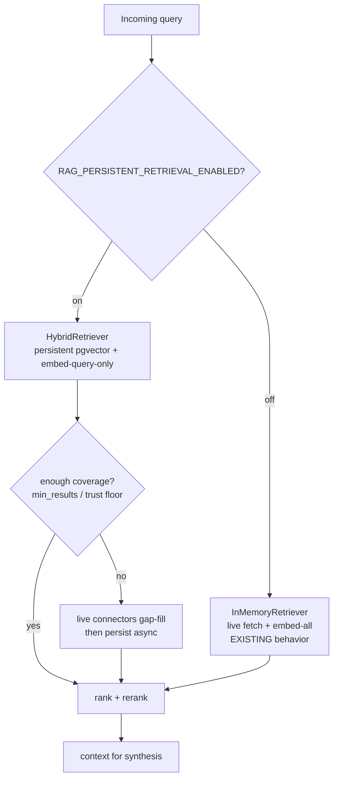
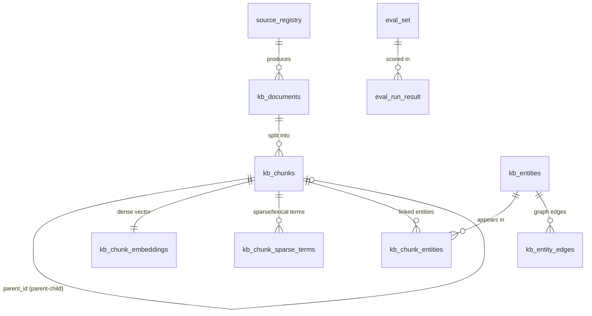

# Design Document: RAG Knowledge Pipeline (clara-care)

## Overview

clara-care today runs a RAG flow that is easy to replicate and hard to make fast or trustworthy: documents are fetched live per query (PubMed, openFDA, SearXNG) plus a small seed set, embedded **at query time** for every candidate document, scored in memory, and hard-truncated to 520 characters before synthesis. There is no persistent vector store, no chunking, no real BM25, and the embedder silently degrades to a 16-dimensional SHA-256 hash vector when the embedding API is unavailable. The result is high latency, occasional timeouts, and retrieval quality that can collapse without anyone noticing.

This feature transforms RAG into a defensible **knowledge pipeline**. The moat is an offline-built, curated, normalized, Vietnamese-localized medical corpus combined with hybrid retrieval and medical entity normalization built on the team's newly approved UMLS/RxNorm license. We split the system into an **offline ingestion plane** (background/scheduled, off the request path) that fetches → cleans → entity-links → structure-aware chunks → embeds once → persists; and an **online retrieval plane** (in-request, fast) that normalizes/expands the query, runs hybrid dense + sparse search over the persistent index, fuses with RRF, reranks with a cross-encoder, and synthesizes with the LLM. At query time we embed **only the query**.

The design is explicitly **phased (P0→P5)** and **backward compatible**. Every new capability lands behind a feature flag so the existing in-memory pipeline keeps serving traffic during rollout, and the medical-safety guardrails (legal_guard/dosage blocking, FIDES claim verification, consent gate, emergency fast-path, DDI medium-floor) are preserved unchanged. All user-facing copy stays Vietnamese; internal documentation and code identifiers are English.

### Goals

- Persist a curated medical corpus with structure-aware chunks, dense embeddings, sparse vectors, and rich provenance metadata in Postgres via pgvector.
- Move embedding and indexing offline; embed only the query online; eliminate per-request recomputation of document embeddings.
- Replace naive token-overlap "lexical" scoring with real BM25 (Postgres FTS) plus bge-m3 learned-sparse signals, fused via the existing RRF scaffolding.
- Add a medical entity normalization layer (RxNorm/UMLS) for drug→RXCUI/CUI linking and VN↔EN, brand↔generic query expansion.
- Replace the silent 16-dim hash fallback with a fail-loud / explicit degraded-mode embedding client.
- Provide an evaluation harness (golden VN Q&A, recall@k / nDCG / faithfulness / citation accuracy) as the evidence of improvement.

### Non-Goals

- Replacing DeepSeek (deepseek-v4-flash via yescale) as the synthesis LLM, or changing the embedding provider (yescale HTTP, default `text-embedding-3-large`, labeled `bge-m3`).
- Standing up a separate vector database product (Qdrant/Weaviate/Milvus) in this iteration. pgvector on the existing Postgres is the primary store; Qdrant is documented as a future scale option only.
- Changing or weakening any medical-safety guardrail. CareGuard DDI logic, FIDES verdicts, consent gating, emergency fast-path, and dosage/legal blocking behavior remain semantically unchanged.
- Building a general-purpose web crawler. Crawling is gap-fill only (e.g., VN guidelines / Cục Quản lý Dược), API-first, and robots.txt-respecting.
- Localizing internal developer docs to Vietnamese (only end-user copy is Vietnamese).

### What Stays Unchanged

- `factcheck/fides_lite.py` verdict thresholds and CRITICAL-blocking semantics.
- `agents/careguard.py` DDI medium-floor and severity inference (openFDA label severity capped at "high", never "critical" from free text).
- Consent gate (`selfmed-consent-gate.tsx`, `core/consent.py`) and emergency fast-path routing.
- The `Document` domain shape (`id`, `text`, `metadata`) and the RRF constants (`_RRF_K=60`, `_RRF_BLEND=0.14`) as the fusion contract — reused, not rewritten.
- Existing trust-tier metadata threading and `TRUST_TIER_FACTOR` / `SOURCE_SCORE_BIAS` tables.

## Phasing (P0 → P5)

The design and the eventual tasks are organized around six phases. Each phase is independently shippable and feature-flagged.

| Phase | Theme | Key deliverables | Primary flag(s) |
|-------|-------|------------------|-----------------|
| **P0** | Foundations | Enable pgvector; chunk/embedding/metadata schema + migrations; kill hash fallback (fail-loud / degraded-mode); config flags; backfill harness skeleton. Backward compatible. | `RAG_PERSISTENT_STORE_ENABLED=false`, `RAG_EMBEDDING_FAIL_LOUD=true` |
| **P1** | Offline ingestion + chunking | API-first connectors → clean/normalize → structure-aware chunk → embed once → persist. Idempotent, resumable, scheduled. | `RAG_INGESTION_ENABLED` |
| **P2** | Hybrid retrieval over persistent index | Dense ANN (pgvector hnsw/ivfflat) + real BM25 / bge-m3 sparse, RRF fusion reusing existing scaffolding; query-time embeds only the query; cross-encoder rerank. | `RAG_PERSISTENT_RETRIEVAL_ENABLED` |
| **P3** | Medical entity normalization | RxNorm/UMLS entity linker; query expansion (VN↔EN, brand↔generic); synonym-aware retrieval; wired into ingestion + online query. | `RAG_ENTITY_NORMALIZATION_ENABLED` |
| **P4** | Knowledge graph + provenance | Drug–interaction–contraindication graph via graphrag; authority tiering as ranking + FIDES input; recency/effective_date. | `RAG_BIOMED_GRAPH_ENABLED` (exists), `RAG_TRUST_TIER_RANKING_ENABLED` |
| **P5** | Eval + caching + hardening | Golden VN Q&A; recall@k / nDCG / faithfulness in CI; persistent embedding cache + semantic cache; scheduled incremental ingestion; observability; cutover + rollback. | `RAG_SEMANTIC_CACHE_ENABLED`, `RAG_EVAL_CI_ENABLED` |

**Rollout principle:** When a persistent-path flag is off, the system behaves exactly as it does today (in-memory retriever, live fetch). When on, the persistent store is consulted first and live fetch becomes a gap-fill fallback. A single query never mixes "embed every doc" and "embed only query" behavior — the flag selects one path deterministically.

---

## Architecture

### High-Level Component Map



### Offline Ingestion Flow

```mermaid
sequenceDiagram
    participant Sched as Scheduler/Admin
    participant Orch as IngestionOrchestrator
    participant Conn as Connector
    participant Clean as Normalizer
    participant Link as EntityLinker
    participant Chunk as StructureAwareChunker
    participant Emb as EmbeddingBuilder
    participant Store as DocumentStore (pgvector)

    Sched->>Orch: run(source_id, since=watermark)
    Orch->>Store: load source_registry + last watermark
    Orch->>Conn: fetch(query/window, cursor)
    Conn-->>Orch: raw_records[] (+ next_cursor)
    loop per record (resumable, checkpointed)
        Orch->>Store: content_hash exists? (idempotency)
        alt unchanged
            Store-->>Orch: skip (already current)
        else new or changed
            Orch->>Clean: normalize(raw) -> clean_text (PII redacted)
            Orch->>Link: link_entities(clean_text) -> [RXCUI/CUI + synonyms]
            Orch->>Chunk: chunk(clean_text, structure) -> parent/child chunks
            Orch->>Emb: embed_documents(chunk_texts) -> dense+sparse (ONCE)
            Emb-->>Orch: vectors (or DEGRADED flag)
            Orch->>Store: UPSERT document, chunks, embeddings, entities
        end
        Orch->>Store: checkpoint(cursor, watermark)
    end
    Orch-->>Sched: IngestionReport (counts, skipped, degraded, errors)
```

### Online Retrieval Flow



### Deployment View



### Backward-Compatibility / Cutover Architecture



---

## Data Models

The pgvector schema below defines the persistent corpus. All new tables live in the existing Postgres database used by `services/api` (SQLAlchemy `engine`/`SessionLocal`). The schema is owned by `services/ml` for write (ingestion) and read (retrieval), and exposed to `services/api` admin endpoints via the ML proxy. Migrations are additive and gated; no existing table is altered destructively.

### Extension and Embedding Dimensions

```sql
CREATE EXTENSION IF NOT EXISTS vector;      -- pgvector
CREATE EXTENSION IF NOT EXISTS pg_trgm;     -- fuzzy synonym matching (optional)
```

- Dense embedding dimension is fixed by the configured model (`text-embedding-3-large` → 3072 dims; labeled "bge-m3" in product copy). The dimension is stored in config (`RAG_EMBEDDING_DIM`) and asserted at write time. The column type is `vector(RAG_EMBEDDING_DIM)`.
- A `model_id` discriminator is carried on every embedding row so a future model swap can coexist (no silent dimension mismatch).

### ER Diagram



### Table: `source_registry`

The authoritative list of sources, their authority tier, license/attribution terms, fetch config, and ingestion watermark.

```sql
CREATE TABLE kb_source_registry (
    id              BIGSERIAL PRIMARY KEY,
    source_key      TEXT NOT NULL UNIQUE,        -- 'openfda','dailymed','pubmed','vn_dav',...
    display_name    TEXT NOT NULL,
    trust_tier      SMALLINT NOT NULL,           -- 1..4 (1 = regulator/label)
    base_url        TEXT NOT NULL DEFAULT '',
    fetch_mode      TEXT NOT NULL DEFAULT 'api', -- 'api' | 'crawl'
    license_code    TEXT NOT NULL DEFAULT '',    -- 'UMLS','RxNorm','openFDA-public',...
    attribution     TEXT NOT NULL DEFAULT '',    -- required attribution string
    robots_respect  BOOLEAN NOT NULL DEFAULT TRUE,
    enabled         BOOLEAN NOT NULL DEFAULT TRUE,
    config_json     JSONB NOT NULL DEFAULT '{}', -- connector-specific knobs
    last_watermark  TEXT NOT NULL DEFAULT '',    -- resumable cursor / timestamp
    last_run_at     TIMESTAMPTZ,
    created_at      TIMESTAMPTZ NOT NULL DEFAULT now(),
    updated_at      TIMESTAMPTZ NOT NULL DEFAULT now()
);
CREATE INDEX idx_kb_source_registry_tier ON kb_source_registry (trust_tier);
```

### Table: `kb_documents`

One row per source document (a PubMed abstract, an SPL label, a VN guideline). Whole-document provenance and idempotency hash.

```sql
CREATE TABLE kb_documents (
    id              BIGSERIAL PRIMARY KEY,
    source_id       BIGINT NOT NULL REFERENCES kb_source_registry(id) ON DELETE CASCADE,
    external_id     TEXT NOT NULL DEFAULT '',    -- PMID, setid, RXCUI doc, URL hash
    title           TEXT NOT NULL DEFAULT '',
    url             TEXT NOT NULL DEFAULT '',
    lang            TEXT NOT NULL DEFAULT 'en',  -- 'vi' | 'en'
    doc_type        TEXT NOT NULL DEFAULT '',    -- 'spl_label','guideline','rct','review'
    trust_tier      SMALLINT NOT NULL,           -- denormalized from source for ranking
    effective_date  DATE,                        -- recency signal
    content_hash    CHAR(64) NOT NULL,           -- sha256(clean_text) for idempotency
    raw_meta_json   JSONB NOT NULL DEFAULT '{}',
    is_active       BOOLEAN NOT NULL DEFAULT TRUE,
    ingested_at     TIMESTAMPTZ NOT NULL DEFAULT now(),
    updated_at      TIMESTAMPTZ NOT NULL DEFAULT now(),
    UNIQUE (source_id, external_id)
);
CREATE INDEX idx_kb_documents_hash ON kb_documents (content_hash);
CREATE INDEX idx_kb_documents_tier_date ON kb_documents (trust_tier, effective_date DESC);
```

### Table: `kb_chunks`

Structure-aware chunks with parent-child links. `section_path` captures SPL section / guideline heading provenance. `ord` preserves order for coverage checks.

```sql
CREATE TABLE kb_chunks (
    id              BIGSERIAL PRIMARY KEY,
    document_id     BIGINT NOT NULL REFERENCES kb_documents(id) ON DELETE CASCADE,
    parent_id       BIGINT REFERENCES kb_chunks(id) ON DELETE CASCADE, -- NULL for parent/root
    chunk_level     SMALLINT NOT NULL DEFAULT 0,   -- 0 = parent, 1 = child
    ord             INTEGER NOT NULL,              -- order within document
    section_path    TEXT NOT NULL DEFAULT '',      -- 'Drug Interactions' / 'Boxed Warning'
    section_type    TEXT NOT NULL DEFAULT '',      -- normalized: 'indications','contraindications','ddi','boxed_warning','dosage','guideline'
    text            TEXT NOT NULL,
    char_start      INTEGER NOT NULL DEFAULT 0,    -- offset in source clean_text (coverage proof)
    char_end        INTEGER NOT NULL DEFAULT 0,
    token_count     INTEGER NOT NULL DEFAULT 0,
    lang            TEXT NOT NULL DEFAULT 'en',
    trust_tier      SMALLINT NOT NULL,
    meta_json       JSONB NOT NULL DEFAULT '{}',   -- {source, url, effective_date, RXCUI[], tags}
    fts             TSVECTOR,                       -- generated for BM25-style FTS
    created_at      TIMESTAMPTZ NOT NULL DEFAULT now()
);
CREATE INDEX idx_kb_chunks_document ON kb_chunks (document_id, ord);
CREATE INDEX idx_kb_chunks_parent ON kb_chunks (parent_id);
CREATE INDEX idx_kb_chunks_section ON kb_chunks (section_type);
-- BM25-style full text search (Postgres ts_rank_cd)
CREATE INDEX idx_kb_chunks_fts ON kb_chunks USING GIN (fts);
```

`fts` is maintained on write using a language-aware configuration (`'simple'` for VN to avoid English stemming artifacts; `'english'` for EN content), e.g.:

```sql
UPDATE kb_chunks
SET fts = setweight(to_tsvector('simple', coalesce(text,'')), 'A');
```

### Table: `kb_chunk_embeddings` (dense)

```sql
CREATE TABLE kb_chunk_embeddings (
    chunk_id        BIGINT PRIMARY KEY REFERENCES kb_chunks(id) ON DELETE CASCADE,
    model_id        TEXT NOT NULL,                 -- 'text-embedding-3-large' (label bge-m3)
    dim             INTEGER NOT NULL,              -- asserted == RAG_EMBEDDING_DIM
    embedding       VECTOR(3072) NOT NULL,         -- dim parameterized by migration
    is_degraded     BOOLEAN NOT NULL DEFAULT FALSE,-- TRUE only if a degraded vector was stored (must never happen in prod)
    created_at      TIMESTAMPTZ NOT NULL DEFAULT now()
);
-- ANN index: HNSW (preferred for recall/latency); IVFFLAT alternative for very large corpora.
CREATE INDEX idx_kb_chunk_emb_hnsw
    ON kb_chunk_embeddings USING hnsw (embedding vector_cosine_ops)
    WITH (m = 16, ef_construction = 64);
-- Alternative (documented; choose one per environment):
-- CREATE INDEX idx_kb_chunk_emb_ivff
--     ON kb_chunk_embeddings USING ivfflat (embedding vector_cosine_ops) WITH (lists = 200);
```

Rationale: HNSW gives strong recall at low query latency and supports incremental inserts well (good for resumable ingestion). IVFFLAT is cheaper to build and lighter on memory but needs `ANALYZE`/list tuning and is better when the corpus is large and rebuilt in bulk. The migration parameterizes the index type via `RAG_ANN_INDEX_KIND`.

### Table: `kb_chunk_sparse_terms` (learned-lexical / bge-m3 sparse)

bge-m3 natively emits a sparse (lexical) vector alongside the dense vector. We persist it as term→weight rows so sparse retrieval can be done in SQL and fused with dense + BM25.

```sql
CREATE TABLE kb_chunk_sparse_terms (
    id              BIGSERIAL PRIMARY KEY,
    chunk_id        BIGINT NOT NULL REFERENCES kb_chunks(id) ON DELETE CASCADE,
    term            TEXT NOT NULL,                 -- token / subword surface
    weight          REAL NOT NULL,                 -- learned sparse weight from bge-m3
    model_id        TEXT NOT NULL
);
CREATE INDEX idx_kb_sparse_chunk ON kb_chunk_sparse_terms (chunk_id);
CREATE INDEX idx_kb_sparse_term ON kb_chunk_sparse_terms (term);
```

### Table: `kb_entities` (RxNorm / UMLS normalization layer — the moat core)

```sql
CREATE TABLE kb_entities (
    id              BIGSERIAL PRIMARY KEY,
    cui             TEXT NOT NULL DEFAULT '',      -- UMLS Concept Unique Identifier
    rxcui           TEXT NOT NULL DEFAULT '',      -- RxNorm concept id
    canonical_name  TEXT NOT NULL,
    entity_type     TEXT NOT NULL,                 -- 'drug','ingredient','condition','class'
    synonyms_json   JSONB NOT NULL DEFAULT '[]',   -- [{name, lang, kind: brand|generic|vn|en}]
    source_vocab    TEXT NOT NULL DEFAULT '',      -- 'RXNORM','SNOMEDCT_US','MSH',...
    created_at      TIMESTAMPTZ NOT NULL DEFAULT now(),
    UNIQUE (cui, rxcui, canonical_name)
);
CREATE INDEX idx_kb_entities_rxcui ON kb_entities (rxcui);
CREATE INDEX idx_kb_entities_cui ON kb_entities (cui);
CREATE INDEX idx_kb_entities_name_trgm ON kb_entities USING GIN (canonical_name gin_trgm_ops);
```

### Table: `kb_chunk_entities` (chunk ↔ entity mention links)

```sql
CREATE TABLE kb_chunk_entities (
    chunk_id        BIGINT NOT NULL REFERENCES kb_chunks(id) ON DELETE CASCADE,
    entity_id       BIGINT NOT NULL REFERENCES kb_entities(id) ON DELETE CASCADE,
    mention_text    TEXT NOT NULL DEFAULT '',
    confidence      REAL NOT NULL DEFAULT 1.0,
    PRIMARY KEY (chunk_id, entity_id)
);
CREATE INDEX idx_kb_chunk_entities_entity ON kb_chunk_entities (entity_id);
```

### Table: `kb_entity_edges` (drug–interaction–contraindication graph for graphrag)

Persists the biomedical domain graph that `graphrag.py` currently loads from a static JSON. Ingestion populates it from RxNorm/UMLS relationships and label-derived signals.

```sql
CREATE TABLE kb_entity_edges (
    id              BIGSERIAL PRIMARY KEY,
    source_entity   BIGINT NOT NULL REFERENCES kb_entities(id) ON DELETE CASCADE,
    target_entity   BIGINT NOT NULL REFERENCES kb_entities(id) ON DELETE CASCADE,
    relation        TEXT NOT NULL,                 -- 'major_interaction_with','contraindicated_with_drug',...
    weight          REAL NOT NULL DEFAULT 0.5,
    provenance      TEXT NOT NULL DEFAULT '',      -- source_key + url that asserts the edge
    created_at      TIMESTAMPTZ NOT NULL DEFAULT now(),
    UNIQUE (source_entity, target_entity, relation)
);
CREATE INDEX idx_kb_entity_edges_source ON kb_entity_edges (source_entity);
CREATE INDEX idx_kb_entity_edges_target ON kb_entity_edges (target_entity);
```

### Table: `eval_set` and `eval_run_result` (evidence of "we are better")

```sql
CREATE TABLE eval_set (
    id              BIGSERIAL PRIMARY KEY,
    qid             TEXT NOT NULL UNIQUE,          -- stable golden id
    question_vi     TEXT NOT NULL,                 -- Vietnamese question
    question_en     TEXT NOT NULL DEFAULT '',
    expected_rxcui  JSONB NOT NULL DEFAULT '[]',   -- gold entities
    relevant_doc_ids JSONB NOT NULL DEFAULT '[]',  -- gold chunk/doc ids for recall@k / nDCG
    gold_answer_vi  TEXT NOT NULL DEFAULT '',
    must_cite       JSONB NOT NULL DEFAULT '[]',   -- citation accuracy targets
    category        TEXT NOT NULL DEFAULT '',      -- 'ddi','dosage','contraindication',...
    created_at      TIMESTAMPTZ NOT NULL DEFAULT now()
);

CREATE TABLE eval_run_result (
    id              BIGSERIAL PRIMARY KEY,
    run_id          TEXT NOT NULL,                 -- groups a single harness execution
    qid             TEXT NOT NULL REFERENCES eval_set(qid) ON DELETE CASCADE,
    recall_at_k     REAL NOT NULL DEFAULT 0.0,
    ndcg_at_k       REAL NOT NULL DEFAULT 0.0,
    faithfulness    REAL NOT NULL DEFAULT 0.0,
    citation_acc    REAL NOT NULL DEFAULT 0.0,
    latency_ms      REAL NOT NULL DEFAULT 0.0,
    config_json     JSONB NOT NULL DEFAULT '{}',   -- flags/model snapshot for reproducibility
    created_at      TIMESTAMPTZ NOT NULL DEFAULT now()
);
CREATE INDEX idx_eval_run_result_run ON eval_run_result (run_id);
```

### Persisted-Data Validation Rules

- `kb_chunks.text` MUST be PII-redacted before insert (reuse `nlp/pii_filter.redact_pii`); persisted text contains no raw phone/ID/email.
- `kb_chunk_embeddings.dim` MUST equal `RAG_EMBEDDING_DIM`; mismatched dimensions are rejected at write time.
- `kb_chunk_embeddings.is_degraded = TRUE` rows MUST NOT be created when `environment='production'` (fail-loud instead).
- `content_hash` MUST be deterministic over normalized clean text so re-ingesting unchanged content is a no-op.
- `trust_tier` on chunk/document MUST be in `{1,2,3,4}` and consistent with `source_registry`.
- Every chunk's `[char_start, char_end)` ranges over a document MUST cover the source text without gaps that drop non-whitespace content (coverage property).

---

## Components and Interfaces

### Python Module Layout (services/ml/src/clara_ml/)

```
clara_ml/
  config.py                         # + new RAG_* flags (additive)
  ingestion/                        # P1 — OFFLINE plane
    __init__.py
    orchestrator.py                 # IngestionOrchestrator: idempotent, resumable, scheduled
    connectors/
      base.py                       # SourceConnector protocol + RawRecord
      pubmed_eutils.py              # E-utilities (NCBI key already wired)
      openfda.py                    # reuses clients/drug_sources patterns
      dailymed_spl.py               # SPL label sections
      rxnorm.py                     # RxNorm concepts + relationships
      europepmc.py
      vn_crawl.py                   # gap-fill crawl (robots.txt-respecting)
    cleaning.py                     # boilerplate strip, VN unicode normalize, PII redact
    chunking.py                     # StructureAwareChunker (SPL sections, headings, parent-child)
    embedding_builder.py            # embed ONCE (dense + bge-m3 sparse)
    scheduler.py                    # incremental schedule + watermark management
  rag/
    embedder.py                     # MODIFIED: degraded-mode fail-loud client (replaces hash stub)
    pipeline.py                     # MODIFIED: flag-routed persistent vs in-memory path
    graphrag.py                     # MODIFIED: load edges from kb_entity_edges (P4)
    store/                          # P0/P2 — persistence + retrieval adapters
      __init__.py
      schema.py                     # SQLAlchemy models / DDL for kb_* tables
      migrations.py                 # additive, gated migration runner
      document_store.py             # UPSERT documents/chunks/embeddings/entities
      hybrid_retriever.py           # dense ANN + sparse/BM25 + RRF + rerank (online)
      sparse_index.py               # bge-m3 sparse term read/write + BM25 query build
      cache.py                      # persistent embedding cache + semantic query cache (P5)
    normalize/                      # P3 — entity normalization + expansion
      __init__.py
      entity_linker.py              # RxNorm/UMLS linker: text -> RXCUI/CUI + synonyms
      umls_client.py                # UTS API client (license-aware, cached)
      query_expander.py             # VN<->EN, brand<->generic synonym expansion
    eval/                           # P5 — eval harness
      __init__.py
      golden_set.py                 # load/curate eval_set
      metrics.py                    # recall@k, nDCG, faithfulness, citation accuracy
      harness.py                    # run eval, write eval_run_result, CI gate
    retrieval/                      # EXISTING (reused): RRF + rerank scaffolding
      score_engine.py               # reuse RRF constants + fusion structure
      reranker.py                   # extend to cross-encoder strategy (bge-reranker-v2-m3)
```

### Component Responsibilities

#### IngestionOrchestrator (`ingestion/orchestrator.py`) — P1
- Drives fetch → clean → link → chunk → embed → persist for a source.
- Idempotent: skips records whose `content_hash` already exists and is current.
- Resumable: checkpoints `(cursor, watermark)` to `kb_source_registry` after each batch; a crash resumes from the last checkpoint.
- Emits an `IngestionReport` (fetched, inserted, updated, skipped, degraded, errors).

#### SourceConnector (`ingestion/connectors/base.py`) — P1
- Protocol: `fetch(window, cursor) -> (list[RawRecord], next_cursor | None)`.
- API-first; `vn_crawl` is the only HTML path and must respect robots.txt and allowed-domains config.
- Carries `trust_tier`, `license_code`, `attribution` from `source_registry`.

#### Normalizer / Cleaner (`ingestion/cleaning.py`) — P1
- Strips boilerplate/navigation, normalizes Vietnamese unicode (reuse `nlp/unicode_utils`), redacts PII (reuse `nlp/pii_filter`).
- Produces deterministic `clean_text` used for both `content_hash` and chunking.

#### StructureAwareChunker (`ingestion/chunking.py`) — P1
- SPL drug labels: split on canonical sections (Indications, Contraindications, Drug Interactions, Boxed Warning, Dosage).
- Guidelines: split on heading hierarchy; produce parent (section) and child (paragraph) chunks.
- Guarantees coverage (no non-whitespace data loss) and records `char_start/char_end`, `section_type`, `ord`.

#### EmbeddingBuilder (`ingestion/embedding_builder.py`) — P1
- Calls the embedding client once per chunk batch; writes dense vectors to `kb_chunk_embeddings` and bge-m3 sparse terms to `kb_chunk_sparse_terms`.
- In production, refuses to persist degraded vectors (fail-loud).

#### DegradedModeEmbeddingClient (`rag/embedder.py`) — P0 (MODIFIED)
- Removes the 16-dim SHA-256 `BgeM3EmbedderStub` fallback from the production path.
- On API failure: in production, raises `EmbeddingUnavailableError` (fail-loud); in dev/test, may return an explicit degraded vector flagged `is_degraded=True` only when `RAG_EMBEDDING_ALLOW_DEGRADED=true`.
- Never silently substitutes a semantically meaningless vector.

#### HybridRetriever (`rag/store/hybrid_retriever.py`) — P2
- Embeds **only the query**; runs dense ANN (pgvector hnsw) and sparse/BM25 (tsvector + bge-m3 sparse) in parallel; fuses via the existing RRF scaffolding; applies cross-encoder rerank top-N.
- Returns `Document` objects (same domain shape) with provenance metadata so downstream guardrails/FIDES are unchanged.

#### EntityLinker + QueryExpander (`rag/normalize/`) — P3
- `entity_linker`: maps drug/condition mentions to RXCUI/CUI with attached VN/EN/brand/generic synonyms (UTS API, cached).
- `query_expander`: expands a query with synonyms and VN↔EN translations; expansion is **additive and recall-only** (never drops the original query terms).

#### GraphRAG (`rag/graphrag.py`) — P4 (MODIFIED)
- Loads edges from `kb_entity_edges` (DB) instead of static JSON; graph-walk retrieval beyond pure similarity for DDI/contraindication.

#### EvalHarness (`rag/eval/`) — P5
- Runs the golden VN Q&A set, computes recall@k / nDCG / faithfulness / citation accuracy, writes `eval_run_result`, and enforces CI thresholds.

### services/api endpoints (admin, RBAC-protected)

New endpoints under `services/api/src/clara_api/api/v1/endpoints/admin_rag.py`, all behind `require_roles("admin")` and proxied to `services/ml`:

| Method & Path | Purpose | Auth |
|---|---|---|
| `POST /api/v1/admin/rag/ingestion/run` | Trigger ingestion for a source (async job) | admin |
| `GET /api/v1/admin/rag/ingestion/status/{job_id}` | Poll ingestion job status / report | admin |
| `GET /api/v1/admin/rag/sources` | List `source_registry` + watermarks | admin |
| `PATCH /api/v1/admin/rag/sources/{id}` | Enable/disable, set tier/weight | admin |
| `POST /api/v1/admin/rag/eval/run` | Run eval harness; returns `run_id` | admin |
| `GET /api/v1/admin/rag/eval/results/{run_id}` | Fetch eval metrics (recall@k/nDCG/faithfulness) | admin |
| `GET /api/v1/admin/rag/stats` | Corpus stats (docs, chunks, degraded count, coverage) | admin |

These reuse the existing `core/rbac.require_roles` dependency and the `ml_proxy` pattern. No new public (unauthenticated) endpoints are introduced.

### apps/web admin surfaces

Extend the existing `apps/web/app/admin/knowledge-sources/page.tsx` and add:
- `apps/web/app/admin/rag-ingestion/page.tsx` — trigger/monitor ingestion jobs, view per-source watermark, degraded-mode alerts. Copy in Vietnamese.
- `apps/web/app/admin/rag-eval/page.tsx` — eval dashboard: recall@k / nDCG / faithfulness / citation accuracy trends across runs. Copy in Vietnamese.

### Interface Definitions (Python)

```python
# rag/store/document_store.py
class DocumentStore(Protocol):
    def upsert_document(self, doc: IngestDocument) -> int: ...           # returns document_id
    def upsert_chunks(self, document_id: int, chunks: list[Chunk]) -> list[int]: ...
    def write_embeddings(self, rows: list[EmbeddingRow]) -> None: ...
    def write_sparse_terms(self, rows: list[SparseTermRow]) -> None: ...
    def link_entities(self, links: list[ChunkEntityLink]) -> None: ...
    def content_hash_exists(self, source_id: int, external_id: str, content_hash: str) -> bool: ...

# rag/store/hybrid_retriever.py
class HybridRetriever(Protocol):
    def retrieve(self, query: str, top_k: int, *, filters: RetrievalFilters | None = None) -> list[Document]: ...

# rag/normalize/entity_linker.py
class EntityLinker(Protocol):
    def link(self, text: str, *, lang: str) -> list[LinkedEntity]: ...   # RXCUI/CUI + synonyms

# rag/normalize/query_expander.py
class QueryExpander(Protocol):
    def expand(self, query: str, *, lang: str) -> ExpandedQuery: ...     # original + synonyms (additive)

# rag/embedder.py
class EmbeddingClient(Protocol):
    def embed_query(self, text: str) -> Vector: ...
    def embed_documents(self, texts: Sequence[str]) -> EmbedBatchResult: ...  # carries degraded flags
```

---

## Low-Level Design

Code is shown in Python (matching `services/ml`). Each function lists preconditions, postconditions, and loop invariants where relevant. These map directly to the Correctness Properties below.

### Core Types

```python
from dataclasses import dataclass, field
from typing import Protocol, Sequence

@dataclass(frozen=True)
class RawRecord:
    source_key: str
    external_id: str          # PMID / SPL setid / URL hash
    title: str
    url: str
    lang: str                 # 'vi' | 'en'
    doc_type: str             # 'spl_label' | 'guideline' | 'rct' | 'review'
    raw_text: str
    effective_date: str | None
    trust_tier: int           # 1..4

@dataclass(frozen=True)
class Chunk:
    ord: int
    parent_ord: int | None
    section_path: str
    section_type: str         # normalized section taxonomy
    text: str
    char_start: int
    char_end: int
    lang: str

@dataclass(frozen=True)
class EmbedBatchResult:
    vectors: list[list[float]]
    degraded: list[bool]      # per-vector degraded flag; all False in production

@dataclass(frozen=True)
class LinkedEntity:
    cui: str
    rxcui: str
    canonical_name: str
    entity_type: str
    synonyms: list[dict]      # [{name, lang, kind}]
    confidence: float

@dataclass(frozen=True)
class ExpandedQuery:
    original: str
    canonical: str
    terms: list[str]          # superset that always contains original terms
    synonym_groups: list[list[str]]
```

### 1. Structure-Aware Chunker (`ingestion/chunking.py`) — P1

```python
# Canonical SPL / guideline section taxonomy (normalized section_type values)
SECTION_TAXONOMY = {
    "indications", "contraindications", "ddi", "boxed_warning",
    "dosage", "warnings", "adverse_reactions", "guideline", "other",
}

def chunk_document(record: RawRecord, clean_text: str,
                   *, max_child_tokens: int = 380,
                   overlap_tokens: int = 48) -> list[Chunk]:
    """Split a cleaned document into structure-aware parent/child chunks.

    Preconditions:
      - clean_text is the normalized, PII-redacted text of `record`.
      - clean_text is non-empty (caller skips empty documents).
      - max_child_tokens > overlap_tokens >= 0.
    Postconditions:
      - Returns chunks ordered by `ord` ascending, contiguous from 0.
      - COVERAGE: concatenating chunk spans [char_start,char_end) over the
        document covers every non-whitespace character of clean_text at least once
        (no semantic data loss; contrast with the old 520-char blind cut).
      - Each child chunk has token_count <= max_child_tokens.
      - Each child chunk references a valid parent ord (parent_ord) when chunk_level=1.
      - section_type ∈ SECTION_TAXONOMY for every chunk.
      - No chunk text is empty after trimming.
    """
    sections = detect_sections(record.doc_type, clean_text)   # -> [(section_type, section_path, span)]
    chunks: list[Chunk] = []
    ord_counter = 0
    cursor = 0  # tracks coverage high-water mark

    for section_type, section_path, (sec_start, sec_end) in sections:
        # Loop invariant: cursor == sec_start (sections are contiguous & ordered);
        # all text in [0, cursor) already emitted into >=1 chunk.
        assert sec_start == cursor, "sections must tile the document without gaps"

        parent_ord = ord_counter
        chunks.append(make_parent_chunk(ord_counter, section_type, section_path,
                                        clean_text, sec_start, sec_end, record.lang))
        ord_counter += 1

        # Child chunks via token windowing WITH overlap, never crossing section bounds.
        windows = window_by_tokens(clean_text, sec_start, sec_end,
                                   max_child_tokens, overlap_tokens)
        for (w_start, w_end) in windows:
            # Loop invariant: w_start advances monotonically; union of windows
            # covers [sec_start, sec_end); adjacent windows overlap by <= overlap_tokens.
            chunks.append(make_child_chunk(ord_counter, parent_ord, section_type,
                                           section_path, clean_text, w_start, w_end,
                                           record.lang))
            ord_counter += 1
        cursor = sec_end

    assert cursor == len(clean_text), "coverage: chunker must consume full document"
    return chunks


def detect_sections(doc_type: str, text: str) -> list[tuple[str, str, tuple[int, int]]]:
    """Return ordered, gap-free (section_type, section_path, (start,end)) tiling.

    Postconditions:
      - Spans are sorted by start, contiguous (next.start == prev.end), and tile
        [0, len(text)) exactly. Unmatched regions become section_type='other'.
    """
    if doc_type == "spl_label":
        return _tile_spl_sections(text)       # Indications/Contraindications/DDI/Boxed Warning/...
    if doc_type in ("guideline",):
        return _tile_by_headings(text)        # heading hierarchy -> section_path
    return [("other", "", (0, len(text)))]    # default: single tile (still full coverage)
```

### 2. Degraded-Mode Embedding Client (`rag/embedder.py`) — P0 (MODIFIED)

```python
class EmbeddingUnavailableError(RuntimeError):
    """Raised when embeddings cannot be produced and degraded mode is not allowed."""

class HttpEmbeddingClient:
    def embed_documents(self, texts: Sequence[str]) -> EmbedBatchResult:
        """Embed multiple documents (OFFLINE path).

        Preconditions:
          - texts is non-empty; each text is normalized.
        Postconditions:
          - len(result.vectors) == len(texts) and each vector has dim == RAG_EMBEDDING_DIM.
          - DETERMINISM: same input + same model_id => identical vector (modulo provider noise;
            cache guarantees byte-identical re-reads).
          - FAIL-LOUD: if the embedding API fails AND environment == 'production'
            => raises EmbeddingUnavailableError (never returns a hash/degraded vector).
          - DEGRADED (non-prod only): if RAG_EMBEDDING_ALLOW_DEGRADED is true, returns
            explicit zero/sentinel vectors with degraded[i]=True; callers MUST NOT persist
            degraded vectors as production embeddings.
          - The legacy 16-dim SHA-256 stub is NOT reachable on any production path.
        """
        normalized = [normalize(t) for t in texts]
        try:
            vectors = self._request_remote_embeddings(normalized)   # exact-size checked
            assert_all_dims(vectors, expected=settings.rag_embedding_dim)
            return EmbedBatchResult(vectors=vectors, degraded=[False] * len(vectors))
        except Exception as exc:
            if settings.environment == "production" or not settings.rag_embedding_allow_degraded:
                raise EmbeddingUnavailableError(str(exc)) from exc
            # Non-prod degraded mode: explicit + flagged (never silent, never hash-as-semantic).
            log.warning("embedding_degraded_mode", extra={"reason": type(exc).__name__})
            return EmbedBatchResult(
                vectors=[degraded_sentinel(settings.rag_embedding_dim) for _ in normalized],
                degraded=[True] * len(normalized),
            )

    def embed_query(self, text: str) -> list[float]:
        """Embed ONLY the query (ONLINE path). Same fail-loud contract; cache-first."""
        cached = self._cache_get(text)
        if cached is not None:
            return cached
        result = self.embed_documents([text])
        if result.degraded[0] and settings.environment == "production":
            raise EmbeddingUnavailableError("degraded query embedding in production")
        self._cache_put(text, result.vectors[0])
        return result.vectors[0]
```

### 3. Hybrid Retriever (dense + sparse + RRF) (`rag/store/hybrid_retriever.py`) — P2

```python
def retrieve(self, query: str, top_k: int,
             *, filters: "RetrievalFilters | None" = None) -> list[Document]:
    """Online hybrid retrieval over the PERSISTENT index. Embeds only the query.

    Preconditions:
      - top_k >= 1; query is non-empty; the persistent index is populated.
    Postconditions:
      - Returns at most top_k Documents, sorted by fused+reranked score descending.
      - Exactly ONE embedding call is made (for the query). No document is re-embedded.
      - Result set ⊆ (dense_candidates ∪ sparse_candidates) (no fabricated docs).
      - Each Document carries provenance metadata {source, trust_tier, url,
        effective_date, RXCUI, lang} sufficient for FIDES + citations.
      - MONOTONICITY: if a chunk ranks top-1 in BOTH dense and sparse lists, it is
        ranked first after RRF fusion (see Property 8).
    """
    expanded = self.expander.expand(query, lang=detect_lang(query))   # additive (P3)
    q_vec = self.embedder.embed_query(expanded.canonical)             # ONLY the query

    # dense + sparse executed in parallel (asyncio / thread pool)
    dense = self._dense_search(q_vec, n=self.candidate_n, filters=filters)   # pgvector hnsw
    sparse = self._sparse_search(expanded, n=self.candidate_n, filters=filters) # tsvector + bge-m3 sparse

    fused = rrf_fuse(dense, sparse, k=RRF_K, blend=RRF_BLEND)   # reuse existing scaffolding
    reranked = self.reranker.rerank(query, fused, top_k=top_k)  # cross-encoder (P2)
    return reranked[:top_k]


def _dense_search(self, q_vec, n, filters) -> list[RankedChunk]:
    """ANN search via pgvector cosine distance.

    SQL (parameterized):
      SELECT c.id, 1 - (e.embedding <=> :qvec) AS score, c.meta_json, ...
      FROM kb_chunk_embeddings e JOIN kb_chunks c ON c.id = e.chunk_id
      WHERE (:tier_floor IS NULL OR c.trust_tier <= :tier_floor)
      ORDER BY e.embedding <=> :qvec      -- HNSW index
      LIMIT :n;
    Postconditions: returns up to n chunks ranked by cosine similarity desc.
    """

def rrf_fuse(dense: list[RankedChunk], sparse: list[RankedChunk],
             *, k: int = RRF_K, blend: float = RRF_BLEND) -> list[RankedChunk]:
    """Reciprocal Rank Fusion reusing the existing _RRF_K=60 / _RRF_BLEND scaffolding.

    Preconditions: k > 0; 0 <= blend <= 1.
    Postconditions:
      - score(c) = sum over lists L containing c of 1/(k + rank_L(c)).
      - A chunk present in both lists scores >= the same chunk present in only one
        list at equal ranks (fusion never penalizes corroboration).
      - Output is a permutation of the union of inputs (no additions/drops).
    """
```

### 4. Cross-Encoder Reranker Integration (`rag/retrieval/reranker.py`) — P2 (EXTENDED)

```python
def rerank(self, query: str, documents: Sequence[Document],
           *, top_k: int | None = None) -> RerankResult:
    """Add a 'cross_encoder' strategy (bge-reranker-v2-m3) alongside existing modes.

    Preconditions: documents may be empty; top_k is None or >= 0.
    Postconditions:
      - PERMUTATION: output documents are a reordering of the input prefix
        (reranker never invents or drops documents; remainder appended in order).
      - TIMEOUT-SAFE: on timeout/error, returns the ORIGINAL order (graceful fallback),
        identical to today's NeuralReranker contract.
      - DETERMINISM: same (query, documents, strategy) => same order (cache-consistent).
      - When strategy='cross_encoder', scores come from the cross-encoder model;
        otherwise behavior is unchanged from the existing embedding/LLM strategies.
    """
```

### 5. UMLS/RxNorm Entity Linker + Query Expander (`rag/normalize/`) — P3

```python
def link(self, text: str, *, lang: str) -> list[LinkedEntity]:
    """Link drug/condition mentions to RxNorm/UMLS concepts.

    Preconditions: text non-empty; lang ∈ {'vi','en'}.
    Postconditions:
      - Each LinkedEntity has a non-empty rxcui OR cui.
      - synonyms include at least the canonical name; brand/generic and VN/EN
        variants attached when available from UTS.
      - SOUNDNESS: a returned entity's canonical_name or one of its synonyms
        actually occurs (normalized) in `text` (no hallucinated links).
      - Idempotent w.r.t. the cache: repeated calls return the same entity set.
    """

def expand(self, query: str, *, lang: str) -> ExpandedQuery:
    """Expand the query with synonyms + VN<->EN translations.

    Preconditions: query non-empty.
    Postconditions:
      - SUPERSET (recall-only): set(original_terms) ⊆ set(result.terms). Expansion
        NEVER removes original query terms (cannot reduce recall).
      - Every added term is a synonym/translation traceable to a LinkedEntity or
        the curated VN<->EN lexicon (no arbitrary term injection).
      - canonical preserves the clinical intent (e.g., DDI queries keep both drugs).
    """
```

### 6. Ingestion Orchestrator (idempotent / resumable) (`ingestion/orchestrator.py`) — P1

```python
def run(self, source_key: str, *, since: str | None = None,
        batch_size: int = 100) -> IngestionReport:
    """Fetch -> clean -> link -> chunk -> embed once -> persist for one source.

    Preconditions:
      - source_key exists in kb_source_registry and is enabled.
      - DocumentStore + EmbeddingClient are available.
    Postconditions:
      - IDEMPOTENT: re-running with unchanged upstream data inserts 0 new chunks
        (records whose content_hash already exists are skipped).
      - RESUMABLE: on crash/restart, processing continues from the persisted
        watermark; no record is processed twice within a successful run.
      - ATOMIC PER DOCUMENT: a document's chunks+embeddings+entity links are
        committed together; a failure mid-document leaves no partial document.
      - NO DEGRADED PERSISTENCE: in production, a degraded embedding aborts the
        document (fail-loud) rather than persisting a meaningless vector.
      - Report counts satisfy: fetched == inserted + updated + skipped + failed.
    """
    src = self.store.load_source(source_key)
    cursor = since or src.last_watermark
    report = IngestionReport()

    while True:
        records, next_cursor = self.connectors[source_key].fetch(cursor=cursor,
                                                                  batch_size=batch_size)
        if not records:
            break
        for rec in records:
            # Loop invariant: report.fetched counts every record seen exactly once;
            # the store contains a consistent (non-partial) view of all prior records.
            report.fetched += 1
            clean = self.cleaner.normalize(rec.raw_text, lang=rec.lang)   # PII-redacted
            content_hash = sha256(clean)
            if self.store.content_hash_exists(src.id, rec.external_id, content_hash):
                report.skipped += 1
                continue
            try:
                with self.store.transaction():       # atomic per document
                    entities = self.linker.link(clean, lang=rec.lang)
                    chunks = chunk_document(rec, clean)
                    embed = self.embedder.embed_documents([c.text for c in chunks])
                    if any(embed.degraded) and is_production():
                        raise EmbeddingUnavailableError("degraded during ingestion")
                    doc_id = self.store.upsert_document(to_ingest_doc(rec, content_hash))
                    chunk_ids = self.store.upsert_chunks(doc_id, chunks)
                    self.store.write_embeddings(rows_for(chunk_ids, embed))
                    self.store.write_sparse_terms(sparse_rows_for(chunk_ids, chunks))
                    self.store.link_entities(links_for(chunk_ids, chunks, entities))
                report.inserted += 1
            except Exception as exc:
                report.failed += 1
                log.error("ingestion_doc_failed", extra={"external_id": rec.external_id,
                                                          "error": type(exc).__name__})
        cursor = next_cursor
        self.store.checkpoint(src.id, cursor)        # resumable watermark
        if next_cursor is None:
            break
    return report
```

### 7. Eval Harness (`rag/eval/harness.py`) — P5

```python
def run_eval(self, run_id: str, *, k: int = 10) -> EvalSummary:
    """Run the golden VN Q&A set and compute retrieval + answer-quality metrics.

    Preconditions: eval_set is non-empty; retrieval path is configured (flags snapshot recorded).
    Postconditions:
      - For each qid, writes one eval_run_result row with recall@k, nDCG@k,
        faithfulness, citation_acc, latency_ms.
      - METRIC BOUNDS: recall@k, nDCG@k, faithfulness, citation_acc all ∈ [0, 1].
      - REPRODUCIBILITY: config_json captures the flag/model snapshot used.
      - CI GATE: returns pass/fail vs configured thresholds (e.g., recall@10 floor,
        faithfulness floor) without mutating the corpus.
    """
    summary = EvalSummary(run_id=run_id)
    for item in self.golden.load():
        # Loop invariant: every processed qid contributes exactly one result row;
        # metrics computed so far are all within [0,1].
        ranked = self.retriever.retrieve(item.question_vi, top_k=k)
        recall = recall_at_k(ranked, item.relevant_doc_ids, k)
        ndcg = ndcg_at_k(ranked, item.relevant_doc_ids, k)
        answer = self.pipeline.answer(item.question_vi, context=ranked)
        faith = faithfulness(answer, ranked)             # claim support ratio
        cite = citation_accuracy(answer, item.must_cite) # cited ids vs gold
        self.store.write_eval_result(run_id, item.qid, recall, ndcg, faith, cite)
        summary.accumulate(recall, ndcg, faith, cite)
    return summary
```

---

## Correctness Properties

This codebase uses property-based testing (hypothesis for Python ≥100 iterations, fast-check for TypeScript). The following numbered properties are the contract the implementation must satisfy. Each is phrased for universal quantification over generated inputs.

Property 1: Chunk coverage (no data loss). For every document `d` with clean text `t`, the union of chunk spans `[char_start, char_end)` produced by `chunk_document` covers every non-whitespace character of `t` (contrast: the old 520-char blind truncation drops data).

Property 2: Chunk ordering and contiguity. For every document, chunk `ord` values are `0..n-1` with no gaps or duplicates, and child chunks reference an existing parent `ord`.

Property 3: Section bounded. Every child chunk lies entirely within its parent section's span; no chunk crosses a section boundary, and `section_type ∈ SECTION_TAXONOMY`.

Property 4: Child token bound. For every child chunk, `token_count <= max_child_tokens`; adjacent child windows overlap by at most `overlap_tokens`.

Property 5: Idempotent ingestion. Running ingestion twice over identical upstream data results in the same persisted chunk set (second run inserts 0 new chunks; `skipped == fetched`).

Property 6: Resumable ingestion. For any prefix `p` of a record stream processed before a simulated crash, resuming reprocesses no record already committed and eventually persists exactly the same corpus as an uninterrupted run.

Property 7: Atomic per-document persistence. For any injected mid-document failure, the store contains either all of a document's chunks/embeddings/entity-links or none — never a partial document.

Property 8: Embedding determinism (cache). For any text embedded twice with the same `model_id`, the cached vector returned is byte-identical on the second read.

Property 9: Degraded-mode fail-loud (production). For any embedding-API failure with `environment='production'`, the client raises `EmbeddingUnavailableError` and never returns a 16-dim hash or sentinel vector.

Property 10: No degraded persistence. No row in `kb_chunk_embeddings` has `is_degraded=TRUE` when produced under production settings; ingestion aborts the document instead.

Property 11: Embedding dimension invariant. Every persisted dense embedding has `dim == RAG_EMBEDDING_DIM`; writes with mismatched dimensions are rejected.

Property 12: Query-only embedding. For any online retrieval call, exactly one embedding request is issued (the query); no document is embedded at query time.

Property 13: RRF fusion monotonicity. For any two candidate lists, if chunk `c` ranks no worse than chunk `c'` in both lists, then `rrf_score(c) >= rrf_score(c')`; a chunk corroborated by both lists never scores below the same chunk appearing in only one list at equal rank.

Property 14: RRF set conservation. The fused output is exactly a permutation of the union of dense and sparse candidates — no fabricated or dropped chunks.

Property 15: BM25 ranking sanity. For a query term `q` and two chunks where chunk A contains `q` with higher TF and the corpus IDF favors `q`, A's BM25/FTS rank is at least as high as a chunk B not containing `q` (real IDF/TF-saturation/length-norm behavior, unlike naive overlap).

Property 16: Reranker permutation and timeout-safety. Reranker output is always a permutation of its input prefix; on timeout/error it returns the original order (never empties or fabricates results).

Property 17: Retrieval recall floor. Over the golden eval set, `recall@k` is greater than or equal to the configured floor (regression guard); persistent hybrid retrieval recall@k is `>=` the legacy in-memory baseline on the same set.

Property 18: Synonym-expansion soundness (recall-only). For any query, `set(original_terms) ⊆ set(expanded.terms)`; expansion never removes original terms and every added term traces to a linked entity or the curated VN↔EN lexicon.

Property 19: Entity-link soundness. For every `LinkedEntity` returned for a text, its canonical name or one of its synonyms occurs (normalized) in that text, and it carries a non-empty `rxcui` or `cui`.

Property 20: Citation / provenance integrity. Every chunk surfaced to synthesis carries `{source, url, trust_tier, effective_date}`; every citation in the answer resolves to a retrieved chunk's id/url (no dangling citations).

Property 21: Trust-tier ordering. Among chunks with equal pre-tier relevance, a higher-authority chunk (lower tier number) ranks at least as high as a lower-authority chunk; `trust_tier ∈ {1,2,3,4}` for all persisted rows.

Property 22: PII-free persisted data. No persisted `kb_chunks.text` contains a value matching the PII patterns (phone/ID/email) from `nlp/pii_filter`.

Property 23: RBAC on admin endpoints. Every new `/admin/rag/*` endpoint rejects non-admin tokens with 403 and missing tokens with 401 (property over generated roles/tokens).

Property 24: DDI medium-floor preserved. For any medication pair flagged by CareGuard, the surfaced severity is never below "medium"; openFDA free-text-derived severity is capped at "high" (never "critical").

Property 25: Dosage / legal block preserved. For any query that triggers dosage or legal_guard blocking today, the same block decision is produced after the pipeline change (no weakening).

Property 26: Consent gate preserved. For any self-medication flow without recorded consent, the consent gate blocks identically to current behavior.

Property 27: Emergency fast-path preserved. For any emergency-classified query, the emergency fast-path is taken before any retrieval/synthesis change can alter routing.

Property 28: FIDES CRITICAL block preserved. For any answer/evidence combination that yields a CRITICAL/contradiction FIDES verdict today, the same blocking verdict is produced; trust_tier and recency are inputs that can only tighten (never loosen) blocking.

---

## Error Handling

### Scenario: Embedding API unavailable (offline ingestion)
- **Condition:** yescale embeddings endpoint errors/timeouts during a batch.
- **Response:** In production, raise `EmbeddingUnavailableError`; abort the current document (atomic rollback) and increment `report.failed`. Do NOT persist degraded vectors.
- **Recovery:** Orchestrator continues to next document; failed documents are retried on the next scheduled run (their `content_hash` was never committed).

### Scenario: Embedding API unavailable (online query)
- **Condition:** query embedding fails.
- **Response:** In production, fail-loud → fall back to sparse/BM25-only retrieval for that request (degraded but explicit and logged), never a hash vector. Surface a Vietnamese soft-notice if results are thin.
- **Recovery:** Semantic cache and persistent embedding cache reduce dependence on live calls.

### Scenario: Persistent store empty / coverage gap
- **Condition:** persistent retrieval returns fewer than `min_results` or below a trust floor.
- **Response:** Trigger live connector gap-fill (existing connectors), serve results, and asynchronously persist the new content for next time.
- **Recovery:** Background ingestion closes the gap; subsequent identical queries hit the persistent index.

### Scenario: pgvector extension / migration not applied
- **Condition:** `RAG_PERSISTENT_*` flag on but `vector` extension or tables missing.
- **Response:** Startup self-check logs a clear error and forces the legacy in-memory path (flag treated as off) rather than crashing the request path.
- **Recovery:** Run gated migration; flip flag.

### Scenario: UMLS/UTS API rate-limited or unauthorized
- **Condition:** entity linker calls fail.
- **Response:** Use cached entities; if uncached, link with empty expansion (recall-only superset still holds — original terms preserved). Log and continue.
- **Recovery:** Backfill entity links on next ingestion run.

### Scenario: Reranker timeout
- **Condition:** cross-encoder exceeds `RAG_RERANKER_TIMEOUT_MS`.
- **Response:** Return RRF-fused order unchanged (existing graceful fallback contract).
- **Recovery:** None needed; latency budget protected.

### Scenario: Degraded vector detected at read time
- **Condition:** a chunk embedding row is unexpectedly flagged degraded.
- **Response:** Exclude it from dense results, count it in `/admin/rag/stats` degraded counter, and alert on the admin dashboard.
- **Recovery:** Re-ingest affected documents.

---

## Testing Strategy

### Unit Testing
- Chunker: section tiling, coverage, parent-child linkage, token bounds (table-driven + property tests).
- Embedding client: fail-loud vs degraded-mode branching by `environment`; dimension assertions; cache determinism.
- Hybrid retriever: single-embedding-call assertion (mock embedder call counter), SQL parameter binding, filter application.
- RRF fuser: monotonicity, set conservation (reuse existing RRF constants).
- Entity linker / expander: soundness and recall-only superset.

### Property-Based Testing
- **Library (Python):** `hypothesis`, minimum 100 iterations per property; strategies generate documents, section layouts, candidate lists, roles/tokens, and medication pairs.
- **Library (TypeScript):** `fast-check` for web admin logic (e.g., eval dashboard transforms, role-gated UI state).
- Properties 1–28 above each map to at least one property test. Safety-preservation properties (24–28) are tested against the existing guardrail modules to assert no behavioral drift (golden-output comparison before/after the flag).

### Integration Testing
- End-to-end offline: seed a small fixture corpus through the orchestrator into a test Postgres (pgvector) and assert idempotency/resumability across a simulated crash.
- End-to-end online: query the persistent index, assert query-only embedding, RRF + rerank ordering, and provenance metadata completeness.
- Cutover: same query under flag-off (legacy) vs flag-on (persistent) — assert guardrail decisions identical and recall@k not regressed.
- CI eval gate: run `rag/eval/harness` on the golden set; fail the build if recall@k / faithfulness drop below thresholds.

### Eval Harness as Evidence
- Golden VN medical Q&A set stored in `eval_set`; metrics (recall@k, nDCG@k, faithfulness, citation accuracy) tracked per `run_id` and surfaced on the admin eval dashboard to demonstrate measurable improvement over the legacy baseline.

---

## Performance Considerations

- **Latency root cause removed:** documents are embedded offline once; online path embeds only the query, eliminating the per-request `embed_batch([query] + all_docs)` that drives current latency/timeouts.
- **ANN index:** HNSW (`m=16, ef_construction=64`) for low-latency recall; `ef_search` tunable per query for recall/latency trade-off. IVFFLAT documented as a bulk-rebuild alternative for very large corpora.
- **Parallel dense + sparse:** the two retrieval arms run concurrently; RRF fuses the smaller candidate sets.
- **Caching (P5):** persistent embedding cache (avoid re-embedding identical text) and semantic query cache (reuse results for near-duplicate queries) cut both latency and yescale spend.
- **Candidate budgets:** `candidate_n` (per arm) and rerank `top_n` bounded to keep cross-encoder cost predictable; reranker timeout protects the request budget.
- **Batch ingestion:** connectors page with bounded `batch_size`; embeddings batched to amortize HTTP overhead.

---

## Security Considerations

- **No PII persisted:** all ingested text passes `nlp/pii_filter.redact_pii` before storage (Property 22). Eval gold answers are authored, not scraped from user data.
- **Secrets via env only:** UMLS/UTS key, NCBI E-utilities key, yescale keys read from environment/config (`config.py`), never hard-coded or persisted in the corpus tables.
- **Admin RBAC:** all `/admin/rag/*` endpoints require `require_roles("admin")` (Property 23); ingestion/eval triggers are admin-only; no unauthenticated network-exposed surface is added.
- **Crawl safety:** `vn_crawl` respects robots.txt and an allowed-domains list (reuse existing `web_crawl_allowed_domains` config); API-first reduces crawl surface.
- **License compliance (see Guidelines):** UMLS/SNOMED/RxNorm content is stored as normalized identifiers + permitted synonyms with attribution; no verbatim redistribution of copyrighted source text beyond fair-use snippets with attribution links.
- **Treat external content as untrusted:** connector payloads and crawled HTML are sanitized; no fetched content is executed or interpreted as instructions.

---

## Guidelines

### Coding & Testing Conventions
- Python: type hints, `from __future__ import annotations`, dataclasses for value types; follow existing `services/ml` style and `ruff` config. Tests use `hypothesis` (≥100 iterations) for the properties above.
- TypeScript (web admin): `fast-check` for property tests; keep all user-facing copy Vietnamese; route through existing analytics/error-sanitization helpers.
- Reuse existing scaffolding (RRF constants, `Document` domain, reranker fallback contract) rather than reimplementing.

### Migration Safety
- All schema changes are additive and gated; no destructive `ALTER`/`DROP` on existing tables. Migrations are idempotent (`IF NOT EXISTS`) and parameterize embedding dimension + ANN index kind.
- A startup self-check validates extension + tables before enabling persistent flags; otherwise the system stays on the legacy path.

### Feature-Flag Rollout & Backward Compatibility
- Each phase ships behind a flag (see Phasing table). Default state reproduces today's behavior exactly.
- Cutover is per-request flag-routed; a single query never mixes legacy and persistent embedding semantics.
- Rollback = flip the flag off; no data migration required to revert. Degraded-mode alerts and `/admin/rag/stats` provide go/no-go signals.

### Data Licensing / Attribution Compliance
- UMLS Metathesaurus, SNOMED CT, RxNorm: store concept identifiers (CUI/RXCUI) and license-permitted synonyms; honor UMLS license terms (UTS account). Do not redistribute full proprietary vocabularies.
- openFDA / DailyMed / PubMed: public-domain or permissive; retain source URL + `effective_date` for attribution.
- VN guidelines (Cục Quản lý Dược, etc.): API-first, crawl only to fill gaps, respect robots.txt; store attribution and link, avoid verbatim copyrighted full-text — persist normalized/structured snippets with citation.
- `source_registry.license_code` + `attribution` are mandatory per source and surfaced in citations.

### Security Conventions
- No PII in persisted corpus or eval set; secrets only via env; admin endpoints RBAC-gated; parameterized SQL everywhere (no string interpolation of user/query values into SQL).

---

## Dependencies

- **Postgres extension:** `pgvector` (dense ANN), `pg_trgm` (fuzzy synonym match) — on the existing Postgres used by `services/api`.
- **Embeddings:** yescale HTTP, model `text-embedding-3-large` (labeled `bge-m3`); bge-m3 multi-vector (dense + sparse) usage for the learned-lexical signal.
- **Reranker:** `bge-reranker-v2-m3` cross-encoder (served via the existing inference path / yescale-compatible client).
- **LLM:** DeepSeek `deepseek-v4-flash` via yescale (synthesis only; unchanged).
- **Normalization:** UMLS/UTS APIs (RxNorm, UMLS Metathesaurus, VSAC); NCBI E-utilities (key already wired).
- **Python libs:** `sqlalchemy` (existing), `pgvector` Python bindings or raw SQL via SQLAlchemy, `httpx` (existing), `hypothesis` (test).
- **TypeScript:** `fast-check` (test), existing Next.js admin stack.
- **Existing internal modules reused:** `rag/retrieval/score_engine.py` (RRF), `rag/retrieval/reranker.py`, `rag/graphrag.py`, `nlp/pii_filter.py`, `nlp/unicode_utils.py`, `clients/drug_sources.py`, `factcheck/fides_lite.py`, `core/rbac.py`.
