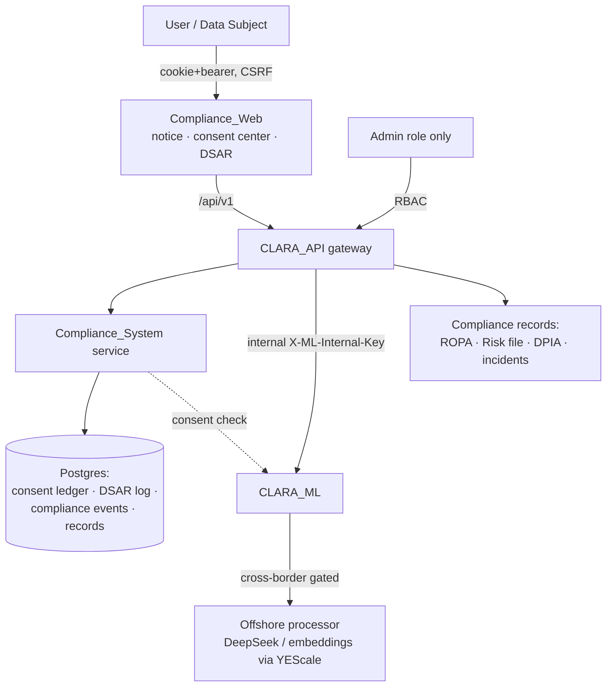
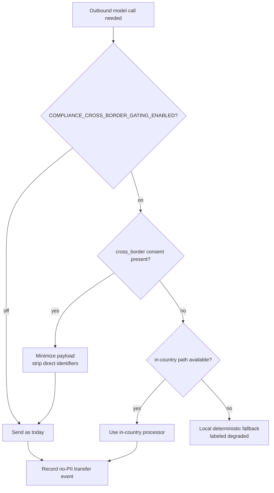

# Design Document

## Overview

This design turns CLARA-Care's existing safety architecture into an
auditable compliance layer for **AI Law No. 134/2025/QH15** and **Decree
13/2023/NĐ-CP (PDPD)**. It is purely **additive and feature-flagged**; with every
flag off the system behaves exactly as today. Nothing here changes clinical
reasoning, the router, or the RAG pipeline.

The design reuses what CLARA already has and only adds the legally-required
seams around it:

| Legal obligation | Existing CLARA mechanism (reused) | New seam (added) |
|---|---|---|
| Transparency / disclosure | Per-surface medical disclaimers, `MEDICAL_DISCLAIMER_VERSION` | Versioned `AiTransparencyNotice` + acknowledgement gate + model/version in response envelope |
| Lawful basis / consent | `UserConsent`, `/auth/consent`, consent gate | Purpose-typed consent (incl. cross-border) + self-service Consent Center |
| Data-subject rights | (none) | DSAR service: export, correct, delete/anonymize, restrict |
| Cross-border transfer | DeepSeek/embedding via offshore YEScale | Transfer Impact Assessment registry + consent-gated outbound path + data minimization |
| Human oversight | Legal hard-guard, emergency fast-path, FIDES CRITICAL block | Reaffirmed + recorded in compliance event log |
| Record-keeping / risk mgmt | Flow events, audit-context middleware | ROPA, Risk-Management File, DPIA, incident log, append-only compliance event log |
| Retention / minimization | No-PII telemetry invariant | Per-category retention policy + scheduled anonymization job |

### Feature Flags (all default OFF / preserving current behavior)

```
COMPLIANCE_TRANSPARENCY_NOTICE_ENABLED=false   # gate medical content on AI notice ack
COMPLIANCE_GRANULAR_CONSENT_ENABLED=false      # purpose-typed consent enforcement
COMPLIANCE_DSAR_ENABLED=false                  # expose DSAR self-service + admin queue
COMPLIANCE_CROSS_BORDER_GATING_ENABLED=false   # gate offshore model calls on consent
COMPLIANCE_RETENTION_JOB_ENABLED=false         # scheduled retention/anonymization
COMPLIANCE_MODEL_DISCLOSURE_ENABLED=false      # model/version + fallback label in envelope
COMPLIANCE_RECORDS_ADMIN_ENABLED=false         # admin compliance-records surfaces
```

When a flag is off, the corresponding endpoint returns a "feature disabled"
shape and the corresponding enforcement is skipped, exactly reproducing today's
behavior (Requirement 8.1, 8.2).

## Architecture

### System context



### Where it lives

- **Backend**: a new `compliance` module under `services/api/src/clara_api/`
  exposing endpoints under the existing `/api/v1` router with a `compliance`
  prefix, plus a small `ComplianceService` and SQLAlchemy models. The
  cross-border gate is a thin check the ML proxy consults before an outbound
  offshore call; when consent is missing it forces the in-country / local path.
- **Frontend**: `apps/web/app/legal` (extend), a new Consent Center under
  `apps/web/app/account/consent`, a DSAR self-service under
  `apps/web/app/account/data`, and a global AI Transparency Notice gate
  component mounted in the authenticated layout.
- **Records**: human-authored governance docs under `docs/compliance/` (ROPA,
  Risk-Management File, DPIA, Transfer Impact Assessments) plus their
  machine-readable manifest served read-only to admins.

### Request flow — cross-border consent gate (Req 4)



### Design principles

1. **Additive & reversible.** New tables and columns only; no destructive schema
   change. Every migration has a downgrade.
2. **No new PII surfaces.** DSAR and compliance logs store request *types*,
   timestamps, and opaque user references — never query text, drug lists, or
   free-text health data.
3. **Reuse, don't reinvent.** Consent extends `UserConsent`; the transfer gate
   wraps the existing ML proxy; disclosure reuses the response envelope the API
   already normalizes.
4. **Enforcement is centralized.** A single `ComplianceService` answers "may I
   process X for purpose Y for user Z?" so every caller is consistent.

## Components and Interfaces

### A. AI Transparency Notice (Req 1)

- `AiTransparencyNotice` versioned content (vi/en), served by
  `GET /api/v1/compliance/transparency-notice`.
- Acknowledgement recorded via `POST /api/v1/compliance/transparency-notice/ack`
  as a typed `UserConsent` row (`purpose="ai_transparency"`, `version=...`).
- Web gate component: when the flag is on and the current notice version is
  unacknowledged, intercept first medical-surface render and present the notice.
- Response envelope gains `ai_disclosure: { model_family, model_version,
  is_fallback }` when `COMPLIANCE_MODEL_DISCLOSURE_ENABLED` (Req 1.3, 1.4),
  sourced from the existing `model_used` field (`deepseek-v4-pro`,
  `local-synth-v1` ⇒ `is_fallback=true`).

### B. Granular Consent — `ComplianceConsentService` (Req 2)

- Purpose enum: `core_service`, `personalization`, `research`,
  `cross_border_processing`, `sharing`, `ai_transparency`.
- `grant(user, purpose, policy_version)` / `withdraw(user, purpose)` append to
  the consent ledger (never mutate in place) → satisfies Property "consent
  ledger is append-only".
- `has_consent(user, purpose) -> bool` is the single source of truth consulted
  by personalization, research, sharing, and the cross-border gate.
- Self-service Consent Center lists every purpose with grant/withdraw toggles
  (Req 2.6).

### C. DSAR Service — `DsarService` (Req 3)

- `request(user, kind)` where kind ∈ {`export`, `correct`, `delete`,
  `restrict`, `withdraw`}; writes an append-only `DsarRequest` row (type, ts,
  status), returns an acknowledgement id.
- `export(user)` assembles a machine-readable bundle from the user's own rows
  (profile, PHR, cabinet, consents) — reuses existing per-user read paths.
- `delete(user)` performs irreversible anonymization: nulls/【hashes】 identifiers
  on the user's rows and tombstones the account, while the DSAR log row (no PII)
  is retained (Req 3.7).
- Admin queue surface (RBAC) tracks resolution against the statutory window.

### D. Cross-Border Transfer Gate (Req 4)

- `TransferRegistry`: static-seeded records for each offshore processor
  (DeepSeek/YEScale LLM endpoint, embedding endpoint) with jurisdiction,
  purpose, and TIA reference; served read-only to admins and summarized in the
  privacy policy.
- `outbound_guard(user)` consulted by the ML proxy path: if gating is on and
  `cross_border_processing` consent is absent, the call does not transmit
  identifiable sensitive data — it uses an in-country path if configured, else
  degrades to the local deterministic answer (already implemented as the
  fallback) labeled degraded.
- Each outbound event writes a no-PII `ComplianceEvent` (processor, purpose,
  opaque ref).

### E. Records & Risk Management (Req 6)

- `docs/compliance/`: `ropa.md`, `risk-management-file.md`, `dpia.md`,
  `transfer-impact-assessments.md`, `incident-log.md` (human-authored, version
  controlled).
- `GET /api/v1/compliance/records` (admin-only) returns a manifest of these
  documents + the live `TransferRegistry` + retention policy, so an auditor
  view is assembled from source-of-truth, not duplicated.

### F. Retention & Minimization (Req 7)

- `RetentionPolicy`: per-category TTL declared in code + ROPA.
- Scheduled job (gated by `COMPLIANCE_RETENTION_JOB_ENABLED`) anonymizes/deletes
  expired rows; reuses the existing ops cron mechanism under `scripts/ops/`.
- Reaffirms no-PII telemetry by adding a CI guard test that asserts compliance
  log payloads contain no free-text/identifier fields.

## Data Models

All new, additive. Created by a new Alembic migration
`20260415_0011_compliance.py` (next after the PHR `..._0010`).

### `compliance_consents` (or extend `user_consents`)

Reuse `user_consents` with the broadened purpose enum above; no new table needed
if the existing `purpose`/`version`/`granted_at`/`revoked_at` columns suffice.
A `purpose` check is widened; ledger semantics (append-only) preserved.

### `dsar_requests`

| column | type | note |
|---|---|---|
| id | int pk | |
| user_ref | str(64) | opaque (hashed user id), no PII |
| kind | str(16) | export/correct/delete/restrict/withdraw |
| status | str(16) | received/in_progress/fulfilled/rejected |
| created_at | datetime | |
| resolved_at | datetime null | |
| due_at | datetime | statutory window tracking |

### `compliance_events` (append-only, no PII)

| column | type | note |
|---|---|---|
| id | int pk | |
| event_type | str(32) | consent_grant/consent_withdraw/dsar/transfer/incident |
| subject_ref | str(64) null | opaque ref |
| processor | str(64) null | for transfer events |
| severity | str(16) null | for incident events |
| meta_json | JSON | counts/flags only — **never** PII |
| created_at | datetime | |

### `transfer_assessments`

| column | type | note |
|---|---|---|
| id | int pk | |
| processor | str(64) | e.g. `yescale-deepseek` |
| jurisdiction | str(64) | |
| purpose | str(64) | |
| tia_doc_ref | str(128) | path under docs/compliance |
| active | bool | |

## Correctness Properties

1. **Consent ledger append-only**: a withdrawal never deletes the prior grant row; `has_consent` reflects the latest event.
2. **Gate soundness**: when `cross_border` consent is absent and gating is on, no identifiable sensitive payload leaves for an offshore processor.
3. **DSAR export completeness**: an export contains exactly the requesting user's own rows and no other subject's data.
4. **Deletion irreversibility + audit survival**: after deletion, the subject's PII is unrecoverable, yet the no-PII DSAR/compliance rows remain.
5. **No-PII compliance logs**: every `compliance_events.meta_json` and DSAR row passes a redaction-projection assertion (no email/name/query/drug strings).
6. **Flags-off equivalence**: with all compliance flags off, request/response shapes and side effects equal the pre-feature baseline.
7. **RBAC on records**: `/compliance/records` and admin DSAR queue return 401/403 for non-admin.
8. **Disclosure correctness**: `ai_disclosure.is_fallback` is true iff the answer came from `local-synth-*`.
9. **Transparency gate**: with the flag on and notice unacknowledged, medical content is not served until acknowledgement is recorded.
10. **CSRF preserved**: cookie-authenticated mutating compliance endpoints reject missing/invalid CSRF tokens.

## Error Handling

- Consent/DSAR/transfer checks **fail closed for processing, open for safety**:
  if the compliance store is unavailable, processing that requires consent is
  declined (degrade to local), but the emergency fast-path and disclaimers
  always still render.
- DSAR deletion is transactional; a partial failure rolls back and the request
  stays `in_progress` (never silently `fulfilled`).
- All new endpoints return descriptive, PII-free errors.

## Testing Strategy

- **Property tests** (hypothesis, mirroring existing `services/api/tests` style)
  for properties 1–10 above.
- **Flags-off regression gate**: a test asserting that with all compliance flags
  off, the consent gate, ML proxy, and response envelope are byte-equivalent to
  baseline.
- **No-PII CI guard**: a test that feeds adversarial PII into compliance log
  writes and asserts the persisted projection drops it.
- **Migration test**: upgrade/downgrade round-trip for `20260415_0011`.

## Backward-Compatibility, Guardrail & Privacy Strategy

Every existing invariant (RBAC, consent gate, emergency fast-path, FIDES
CRITICAL block, no-PII telemetry, CSRF) is preserved and, where relevant,
re-asserted by a new test. The feature ships dark (flags off), is enabled per
environment, and can be fully disabled by flipping flags without a redeploy of
clinical code.
