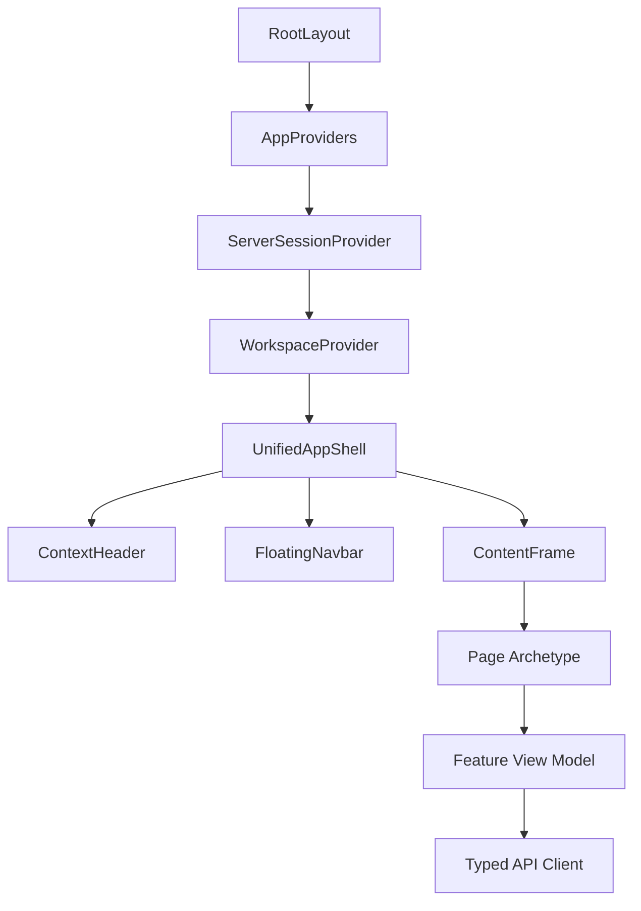
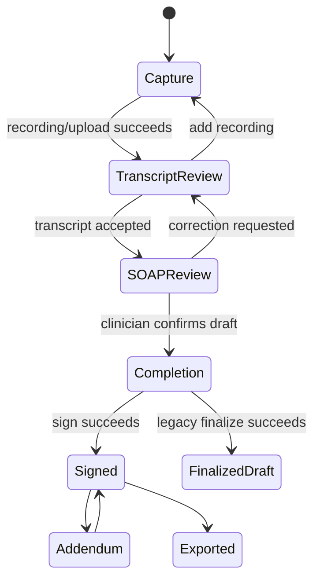
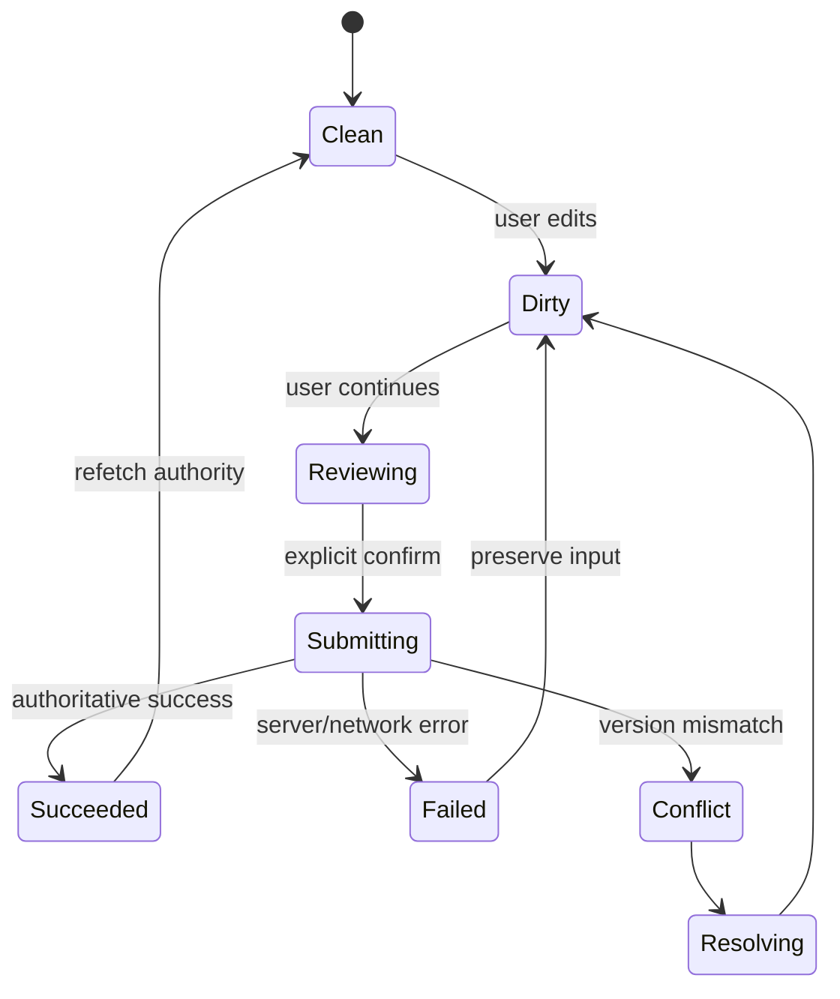
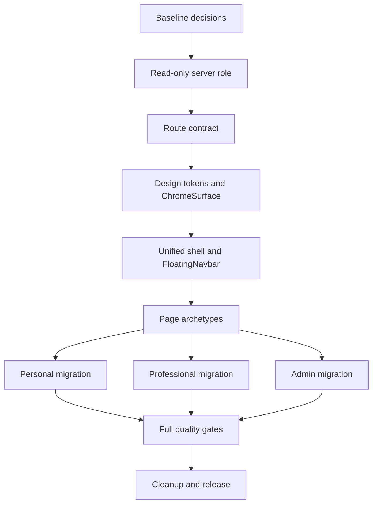

# CLARA Care Unified Glass UI/UX & Frontend Rebuild — Master Implementation Specification

> **Document ID:** CLARA-UX-FE-2026-UGX-v1  
> **Status:** Proposed implementation baseline  
> **Language:** Vietnamese (normative); English identifiers for code contracts  
> **Target repository:** `Project-CLARA-HBT/CLARA-Care`  
> **Baseline branch:** `codex/commitloop-phase-a`  
> **Baseline commit:** `3ee1ed05e6d983e4715a48b00b6ed96b7928a8ed`  
> **Baseline commit date:** 2026-08-24 13:33:48 +07:00  
> **Primary implementation scope:** `apps/web`  
> **Parity scope:** `apps/mobile` after Web shell/design contracts stabilize  
> **Decision authority:** This document supersedes prior shell, navigation, blur/glass, route-governance, and page-archetype decisions in `docs/ui-modernization/*`. Existing medical-safety, privacy, RBAC, consent, provenance, audit, and data-authority requirements remain binding unless this document explicitly strengthens them.

---

## `/goal`

```text
/goal Rebuild CLARA Care's production frontend into one coherent, safe, modern, Vietnamese-first health platform using a single authoritative session model, one workspace-aware UnifiedAppShell, one tokenized glass-chrome system, and one consistent floating navigation pattern across Personal, Clinical, Research, and Administration experiences. Eliminate dead or redirect-shadowed pages, broken links, duplicated shell/navigation implementations, unsafe client-side role mutation, contradictory blur CSS, fabricated or false-success UI states, page-level visual dialects, and giant untestable page components. Preserve every legitimate GLHS capability and all server-enforced RBAC, consent, CSRF, profile isolation, emergency, FIDES, DrugBank, provenance, audit, no-CoT, and no-PII invariants. Make role read-only from /auth/me; model workspace and admin preview strictly as presentation state. Use glass only for navigation chrome and overlays; keep medical records, evidence, tables, forms, and clinical decisions opaque and maximally readable. Deliver canonical route governance for every real page, one global floating dock with responsive variants and no redirect hops, reusable page archetypes, truthful async/mutation states, WCAG 2.2 AA behavior, four-viewport visual evidence, route-level E2E by role/workspace, bundle budgets, compatibility/rollback evidence, and zero Critical/High findings before release. Do not claim completion because components export, compile, or render in isolation: completion requires production routing, real shell composition, server-authoritative data behavior, accessibility, visual regression, and full release gates to pass.
```

---

## 0. How to use this specification

### 0.1 Normative language

- **MUST / PHẢI:** release-blocking requirement.
- **MUST NOT / KHÔNG ĐƯỢC:** prohibited behavior; violation is release-blocking.
- **SHOULD / NÊN:** expected behavior; deviation requires a written decision and evidence.
- **MAY / CÓ THỂ:** optional behavior that cannot weaken a MUST.
- **P0:** security, safety, authorization, broken navigation, unusable core flow, or shell architecture blocker.
- **P1:** major usability, accessibility, consistency, truthfulness, or maintainability blocker.
- **P2:** polish, optimization, or secondary experience improvement.

### 0.2 Required workflow for implementers

1. Read `AGENTS.md` and the safety invariants before touching production code.
2. Verify the current branch and record the new baseline SHA if it has advanced.
3. Generate the real route inventory from the filesystem; never trust a fixed denominator.
4. Complete Phase 0 gates before replacing shared shell or navigation.
5. Implement shared contracts before migrating page families.
6. Run focused tests after each task and milestone-wide gates before advancing.
7. Update the execution ledger, route contract, decision log, visual evidence, and rollback target at each checkpoint.
8. Do not modify server authorization to make frontend tests pass.
9. Do not silently delete a capability. Classify it as canonical, contextual, utility, compatibility alias, unavailable, or retired with evidence.
10. Do not mark a task done when it only exports, compiles, or passes a shallow render test.

### 0.3 Deliverables governed by this document

- Target product and experience requirements.
- Information architecture and canonical route governance.
- Unified shell and floating navigation specification.
- Glass/blur design-system specification.
- Page archetypes and per-family UX requirements.
- Frontend technical architecture and typed contracts.
- Accessibility, performance, privacy, safety, i18n, and telemetry requirements.
- Migration, feature-flag, compatibility, release, and rollback plans.
- Detailed implementation task backlog and acceptance gates.
- Final Codex `/goal` suitable for autonomous implementation.

---

## 1. Executive mandate

### 1.1 Product decision

The current frontend is **NO-GO for a coherent production experience** even though TypeScript, production build, and unit tests can pass. It contains multiple partially migrated shell models, contradictory glass rules, route aliases backed by large unreachable pages, role/workspace state conflation, monolithic page implementations, and page families that behave like separate products.

The redesign is not a cosmetic reskin. It is a controlled frontend architecture migration that must:

1. establish one source of truth for session role, workspace, routes, navigation, and visual material;
2. make every page visibly part of the same product;
3. make every visible action truthful and operational;
4. retain the full legitimate GLHS capability surface;
5. improve ordinary-user comprehension without hiding clinical safety;
6. preserve professional density where the task requires it;
7. remove accidental complexity rather than decorating it.

### 1.2 Baseline evidence at commit `3ee1ed0`

| Evidence | Baseline result | Interpretation |
|---|---:|---|
| Real `apps/web/app/**/page.tsx` routes | 114 | This is the dynamic denominator for current route governance. |
| Route capability checker | 114/114 pass | Capability matrix now sees the real filesystem route count. |
| Route layout checker | 79/79 pass | Still validates a fixed 79-row historical spec, not all real pages. It cannot be used as full route-layout coverage evidence. |
| Focused latest-commit tests | 56/56 pass | Confirms component behavior expected by the commit, not end-to-end usability or authorization integrity. |
| Full Vitest suite | 206 files / 1,651 tests pass | Exit code is green, but unexpected XHR `AggregateError`, jsdom navigation errors, and unwrapped `act(...)` warnings remain and are not clean release evidence. |
| TypeScript | Pass | Does not prove runtime composition, visual consistency, or truthful data behavior. |
| Next.js production build | Pass; 123 static variants generated | Build success confirms compilability. Several active pages remain ~270–304 kB first-load, and redirect-shadowed `/ask` still builds a 334 kB first-load implementation. |
| Giant route pages ≥800 lines | 23 | High page-local styling/state coupling. |
| TSX files with hard-coded hex | 52 | Design-token leakage and visual drift. |
| TSX files with inline style objects | 29 | Styling governance gap. |
| Web files using blur/filter | 23 | Blur is applied through multiple uncontrolled mechanisms. |
| Middleware legacy redirects | 10 | Several source pages and visible mental models remain duplicated. |
| Production use of `ConsumerLayout` / `ProfessionalLayout` | 0 | These layouts are tested/exported but not mounted in the real route tree. |

### 1.3 Latest-commit-specific findings that this spec corrects

The baseline commit adds role-adaptive dock parity and a comprehensive `/role-select` canvas. It improves direct dock destinations and makes the dock available on more workspaces, but it introduces or preserves the following P0/P1 defects:

- `/role-select` calls `setRole()` and writes `clara_role` for arbitrary cards, allowing presentation state to impersonate another role until the next server hydration.
- `SessionBoundary` exposes mutable role state even though role must be read-only and server-authoritative.
- `isRouteAllowedForRole()` gives any client state labelled `admin` implicit access to every client route. Server APIs still protect data, but the UI can show unauthorized surfaces, false capabilities, 403 churn, and misleading admin navigation.
- `effectiveRole` conflates admin preview persona with the role used to configure navigation.
- The dock is role-adaptive rather than workspace-adaptive, so doctor/research/admin users cannot cleanly preserve Personal, Clinical, Research, and Admin contexts.
- The expanded dock can horizontally scroll instead of using a true mobile navigation contract.
- Mobile dock labels are hidden even though bottom navigation needs visible labels for recognition.
- A global `Escape` listener hides the dock, conflicting with modal, sheet, command-palette, and dialog dismissal semantics.
- `EXPANDED`, `COMPACT`, `ORB_ONLY`, `HIDDEN_WITH_ESCAPE`, and `CONTEXTUAL` states add interaction complexity without a route-policy contract.
- The expanded dock renders more than one CLARA orb/action affordance.
- The top context bar and bottom dock use separate ad hoc opacity/blur classes rather than one material primitive.
- Native `<details>` menus and global `document.querySelectorAll("details")` closing create cross-component behavior and incomplete focus/menu semantics.
- `/role-select` is another 800-line page-local implementation rather than a shared workspace-management surface.

### 1.4 Release outcome

The target release is acceptable only when:

- every real route is classified by a generated contract;
- one and only one authenticated global shell is mounted;
- role is immutable client presentation data sourced from the server session;
- workspace switching cannot grant, imply, or simulate authorization;
- every primary navigation destination is canonical and operational;
- glass is consistent, tokenized, accessible, and limited to chrome/overlays;
- all core page families implement required loading, empty, partial, error, success, conflict, and permission states;
- mobile, tablet, laptop, and desktop behavior is intentionally designed;
- no Critical or High review issue remains open.

---

## 2. Scope

### 2.1 In scope

#### Web application

- `apps/web/app/**`
- `apps/web/components/**`
- `apps/web/lib/navigation*`, route registries, shell state, session presentation, i18n, analytics helpers, and typed API clients used by redesigned flows
- `apps/web/styles/**`, Tailwind configuration, design-token generation, CSS layers, and compatibility styles
- Unit, integration, accessibility, E2E, visual, route-contract, bundle, and static-governance tests
- UI modernization documentation, evidence, and migration ledger

#### Product surfaces

- Public marketing, legal, authentication, onboarding, and public shares
- Personal home/Today, LifeMap, health record/PHR, medicines, visits/care, family/sharing, profile/settings/privacy, Chat/Ask CLARA
- Research Chat mode, Evidence, Source Hub
- Clinical overview, patient/context surfaces that are actually server-backed, Council, Scribe
- Administration overview, knowledge, answer flow, monitoring, analytics, users, experiments, feedback, audit, DSAR, RAG tools, moderation, and system views where authorized and backed
- Global command palette, notifications/help/profile, capture entry, workspace switcher, and compatibility redirects

#### Mobile parity

- A shared semantic-token schema and navigation semantics for Flutter
- iOS-style floating glass bottom navigation with platform-appropriate Flutter implementation
- Route/capability and terminology parity
- Mobile parity begins after the Web contracts are stable; it does not block foundational Web work unless shared token/schema decisions would diverge

### 2.2 Out of scope

- Replacing Next.js, React, Tailwind, Flutter, FastAPI, or the ML architecture.
- Changing clinical decision logic to improve presentation.
- Weakening RBAC, consent, CSRF, emergency, FIDES, DrugBank, provenance, profile isolation, or audit requirements.
- Inventing patient directories, appointment systems, prescriptions, measured analytics, integrations, or persistence contracts absent from the backend.
- Merging medication course, cabinet, and PHR medication records by display name.
- Exposing raw chain-of-thought, prompts, hidden reasoning, provider secrets, uncalibrated confidence, or PII.
- Applying glass to clinical content merely to match a visual trend.
- Rewriting every page in one unreviewable commit.

### 2.3 Dependencies

- Authoritative `/auth/me` session contract.
- Existing API route-level RBAC and consent enforcement.
- Existing typed UI primitives and icon system as migration inputs.
- Existing redirect and capability matrices as historical inputs, not unquestioned truth.
- Stable Node 20 toolchain required by `apps/web/package.json`.
- Synthetic, non-PII fixtures for visual and E2E evidence.

---

## 3. Non-negotiable safety, privacy, and trust invariants

### 3.1 Authorization and identity

| ID | Requirement |
|---|---|
| INV-AUTH-001 | The server session role returned by `/auth/me` is immutable from ordinary production UI. |
| INV-AUTH-002 | Workspace, preview persona, route visibility, and dock composition are presentation state only. |
| INV-AUTH-003 | Client route guards improve UX but never authorize an API request. |
| INV-AUTH-004 | A stale or manipulated local workspace/role value fails closed and is reconciled with the server session. |
| INV-AUTH-005 | Admin preview never downgrades or upgrades server authorization; it changes only content density, terminology, and navigation presentation. |
| INV-AUTH-006 | A forbidden direct link shows an explicit access state or server-authored 403 handling; it does not silently redirect to unrelated content. |
| INV-AUTH-007 | Public/auth/share routes do not mount authenticated shell, profile data, or authenticated analytics. |

### 3.2 Medical safety

| ID | Requirement |
|---|---|
| INV-SAFE-001 | Emergency escalation is visible before ordinary answer content and cannot be collapsed. |
| INV-SAFE-002 | Failed CRITICAL FIDES verification blocks release; UI must not visually downgrade the block. |
| INV-SAFE-003 | DrugBank or medication authority unavailable never appears as “safe” or “no interaction”. |
| INV-SAFE-004 | AI-proposed health facts, medicine identities, LifeMap truth states, transcripts, and SOAP content remain unconfirmed until the responsible human action succeeds. |
| INV-SAFE-005 | Consent is explicit before recording or protected medical mutation when policy requires it. |
| INV-SAFE-006 | Scribe `draft`, `reviewed`, `finalized legacy draft`, `signed`, `exported`, and `amended` states are visually and semantically distinct. |
| INV-SAFE-007 | Clinical uncertainty, evidence limitations, provenance, source authority, and next safe action remain visible near the decision. |
| INV-SAFE-008 | The UI never generates diagnosis, prescription, or personal dosage authority absent from server behavior. |

### 3.3 Data truthfulness

| ID | Requirement |
|---|---|
| INV-DATA-001 | No fabricated metrics, fake activity, fake visits, fake patients, invented confidence, or demo health data may appear in production states. |
| INV-DATA-002 | Empty data renders an honest empty state; unavailable data renders unavailable/error, not a reassuring zero. |
| INV-DATA-003 | Local mutation success is not displayed as persisted success until the authoritative API returns success. |
| INV-DATA-004 | Optimistic updates must roll back on failure and identify the unsaved state. |
| INV-DATA-005 | Partial responses identify which sections loaded and which did not. |
| INV-DATA-006 | Concurrent record conflicts are surfaced; a section save must not silently overwrite another change. |

### 3.4 Privacy and observability

| ID | Requirement |
|---|---|
| INV-PRIV-001 | No PII, free-text health query, medicine list, token, raw record, or document content enters telemetry. |
| INV-PRIV-002 | Screenshots and fixtures use synthetic identities and synthetic medical data clearly marked for test use. |
| INV-PRIV-003 | Browser storage contains presentation preferences only; no role authority, access token, refresh token, PII, or health data. |
| INV-PRIV-004 | Consumer DOM does not receive admin-only telemetry, raw prompts, provider/model details, policy enums, or hidden reasoning. |
| INV-PRIV-005 | Share, sign, delete, release, override, and permission changes remain attributable and reviewable. |

---

## 4. Product goals and success metrics

### 4.1 Goals

| ID | Goal | Measure |
|---|---|---|
| G-001 | One coherent CLARA product across all workspaces | One shell, one chrome material, one route contract, consistent page archetypes. |
| G-002 | Ordinary users can act without understanding system architecture | Consumer primary pages contain one dominant task and plain-language copy. |
| G-003 | Professional users retain depth without contaminating consumer UX | Role/workspace-aware progressive disclosure and wider data archetypes. |
| G-004 | Every authorized capability remains discoverable | Primary dock, More/command palette, contextual actions, or direct links within two interactions. |
| G-005 | Navigation is predictable | Zero primary-link redirect hops, zero broken hrefs, one active destination, deterministic back behavior. |
| G-006 | Glass is recognizable but medically appropriate | Glass only on chrome/overlays; content surfaces remain opaque and readable. |
| G-007 | Mobile is first-class | No horizontal overflow, visible bottom-nav labels, safe-area support, 44px targets, purpose-built layouts. |
| G-008 | UI state is truthful | No fake success, fabricated values, or misleading zero/healthy states. |
| G-009 | Architecture supports safe iteration | Page controllers, view models, primitives, and route contracts are separated and tested. |
| G-010 | Release evidence is reproducible | Fixed commands, fixtures, viewport matrix, visual baselines, and traceability. |

### 4.2 Quantitative release targets

| Metric | Target |
|---|---:|
| Real page routes classified | 100% of filesystem scan |
| Primary dock destinations | 5 per active workspace on common viewports |
| Mobile primary destinations | 5 including center CLARA action; labels visible |
| Broken internal links | 0 |
| Primary-link redirect hops | 0 |
| Global shell instances | Exactly 1 on authenticated non-utility routes |
| Global nav instances | Exactly 1 on authenticated non-focus routes |
| Direct feature use of `backdrop-blur-*` | 0 outside design-system allowlist |
| Raw hex in feature TSX | 0 outside chart/visualization allowlist |
| Unclassified async states on core pages | 0 |
| WCAG automated Critical/Serious findings | 0 on release matrix |
| Horizontal overflow | 0 at 320, 390, 768, 1280, 1440 widths |
| Touch targets | ≥44×44 CSS px for primary interactive targets |
| Unexpected console/page errors | 0 in E2E |
| No-PII telemetry checks | 100% pass |
| Unit/integration/build/E2E/visual gates | 100% pass or explicitly not-applicable with approval |
| Open P0/P1 review findings | 0 |

---

## 5. Personas, roles, workspaces, and presentation modes

### 5.1 Separate the concepts

| Concept | Authority | Mutable in UI? | Persistence | Purpose |
|---|---|---:|---|---|
| `serverRole` | `/auth/me` and server RBAC | No | Server session | Authorization identity. |
| `permittedWorkspaces` | Derived from `serverRole`, flags, capabilities | No direct mutation | Recomputed | Presentation choices the user is allowed to enter. |
| `activeWorkspace` | Route contract + user selection | Yes, within permitted set | `clara_workspace_v2` only | Navigation and information architecture context. |
| `adminPreviewPersona` | Admin-only presentation control | Yes for admin | Session or versioned presentation storage | Preview density/copy/navigation; never authorization. |
| `activeProfile` | Server/profile context | Yes if permitted | Existing bounded profile contract | Whose health data is in context. |
| `shellMode` | Route contract + explicit task state | Controlled | Not durable unless specified | Standard, focus, immersive, contextual presentation. |

### 5.2 Role-to-workspace matrix

| Server role | Personal | Clinical | Research | Administration |
|---|---:|---:|---:|---:|
| `normal` | Yes | No | No, except consumer-safe evidence functions exposed through Chat | No |
| `researcher` | Yes | No | Yes | No |
| `doctor` | Yes | Yes | Yes | No |
| `admin` | Yes | Yes | Yes | Yes |

### 5.3 Personas

#### Personal user

- Wants the next safe action, understandable health record, medicine safety, visit preparation, and privacy control.
- Must not see internal RAG/NLI/FIDES/pipeline/provider language in primary flows.
- Must not have professional workspaces implied as selectable roles.

#### Researcher

- Wants evidence discovery, source authority, applicability, structured synthesis, provenance, and research history.
- May enter Personal or Research workspace while server role remains `researcher`.
- Does not receive clinical patient tools unless server-authorized through another role/capability.

#### Clinician

- Wants active patient/profile context, evidence, Council, Scribe, review states, and explicit safety/consent boundaries.
- May enter Personal, Clinical, or Research workspace while server role remains `doctor`.
- Needs higher information density but the same shell/material language.

#### Administrator

- Wants governance, knowledge operations, answer-flow controls, observability, audit, users, experiments, feedback, and compliance.
- May preview Personal/Clinical/Research presentation without changing server role.
- Admin preview MUST show an unmistakable, persistent preview badge and MUST NOT hide admin exit/recovery controls.

### 5.4 Workspace selection rules

1. Determine `serverRole` from the successfully hydrated server session.
2. Derive `permittedWorkspaces` from a pure function with exhaustive tests.
3. Derive the route’s canonical workspace from the route contract.
4. If a direct route belongs to a permitted workspace, select it without changing role.
5. If the stored workspace is stale or forbidden, ignore and overwrite it with a safe permitted value.
6. If a route is shared across workspaces, preserve the current permitted workspace; otherwise use the role-safe default.
7. The user may select only items in `permittedWorkspaces`.
8. A normal user never sees Admin/Clinical/Research as selectable role cards.
9. `/role-select` MUST be replaced by a workspace manager or retained only as a compatibility route to the permitted workspace surface.
10. `SessionContext.setRole()` MUST be removed from production consumer APIs. Test-only role injection uses explicit fixture/provider APIs excluded from production bundles.

### 5.5 Safe defaults

| Server role | Default route | Default workspace |
|---|---|---|
| `normal` | `/home` | Personal |
| `researcher` | `/dashboard` or `/evidence` according to product decision; choose once and test | Research |
| `doctor` | `/dashboard` | Clinical |
| `admin` | `/admin/overview` | Administration |

The implementation MUST resolve the researcher default ambiguity in one decision record. It must not vary between login, brand click, route guard, and workspace switcher.

---

## 6. Experience principles

1. **One product, multiple workspaces.** Workspaces change task emphasis, not the brand or interaction grammar.
2. **One dominant task per page.** Secondary actions use contextual menus, disclosures, drawers, or subsequent steps.
3. **Safety remains primary.** Emergency, consent, uncertainty, DDI unavailable, evidence block, and clinician-review states never move behind decorative disclosure.
4. **Data truth before visual completeness.** Empty and unavailable are valid; fabricated content is not.
5. **Canonical navigation.** Primary navigation never depends on a redirect to reach its destination.
6. **Glass is chrome, not content.** Floating navigation and overlays may blur; records and decisions do not.
7. **Progressive disclosure with recoverability.** Users can find secondary capability within two interactions and can return without losing context.
8. **Mobile is designed, not compressed.** No horizontal scrolling global nav, hidden labels, desktop sidebars, or hover-only meaning.
9. **Server authority is visible.** Client prediction never claims persistence or permission before server confirmation.
10. **Accessible by construction.** Shared primitives own focus, semantics, reduced motion, contrast, and target sizes.
11. **Vietnamese-first clarity.** Vietnamese primary copy is natural, concise, and free of internal system jargon.
12. **Consistency over page heroics.** A slightly simpler shared component is preferred over an impressive one-off page.
13. **Motion communicates state.** No ornamental pulsing, parallax, or glow in medical decision surfaces.
14. **No silent recovery.** Redirects, permission fallback, conflict resolution, and offline behavior explain what occurred.
15. **Implementation evidence beats checkboxes.** Completion requires route-level runtime proof.

---

## 7. Target frontend architecture

### 7.1 Component topology



### 7.2 Required provider boundaries

```text
RootLayout (server)
└── AppProviders
    ├── PreferenceProvider
    ├── ServerSessionProvider
    │   └── exposes read-only serverRole/session capabilities
    ├── ProfileProvider
    │   └── active profile and profile-scoped cache invalidation
    ├── WorkspaceProvider
    │   └── permittedWorkspaces, activeWorkspace, adminPreviewPersona
    ├── ShellModeProvider
    │   └── route-derived standard/focus/immersive/contextual mode
    └── UnifiedAppShell
        ├── PreviewBanner (admin preview only)
        ├── ContextHeader
        ├── ContentFrame
        ├── FloatingNavbar
        ├── CommandPalette
        └── OverlayHost
```

### 7.3 Ownership rules

| Concern | Owner | Forbidden duplication |
|---|---|---|
| Server role/session | `ServerSessionProvider` | Page-local `getRole()` and arbitrary `setRole()`. |
| Active profile | `ProfileProvider` | Page-local profile storage or unscoped cache. |
| Workspace | `WorkspaceProvider` | Role mutation, per-page workspace state. |
| Route classification | generated `route-contract.ts` | Fixed handwritten denominator or menu-derived access. |
| Primary navigation | `workspace-navigation.ts` | Page-specific global nav or duplicate mobile nav. |
| Shell mode | route contract + `ShellModeProvider` | Feature component hiding global shell ad hoc. |
| Glass material | `ChromeSurface` / CSS token layer | Feature `backdrop-blur-*`, hard-coded opacity/filter. |
| Page frame | page archetype primitives | Per-page max-width/padding/header reinvention. |
| Async state | route controller/view model | Visual component issuing unrelated fetches. |
| Medical authority | server/API response | CSS color or client inference claiming certainty. |

### 7.4 Proposed module structure

```text
apps/web/
├── app/
│   ├── layout.tsx
│   ├── (public)/...
│   ├── (authenticated)/...
│   └── ...existing canonical routes
├── components/
│   ├── shell/
│   │   ├── unified-app-shell.tsx
│   │   ├── context-header.tsx
│   │   ├── floating-navbar.tsx
│   │   ├── floating-navbar-item.tsx
│   │   ├── workspace-switcher.tsx
│   │   ├── command-palette.tsx
│   │   ├── preview-banner.tsx
│   │   ├── overlay-host.tsx
│   │   └── chrome-surface.tsx
│   ├── page/
│   │   ├── page-frame.tsx
│   │   ├── page-header.tsx
│   │   ├── hub-layout.tsx
│   │   ├── list-detail-layout.tsx
│   │   ├── workflow-layout.tsx
│   │   ├── conversation-layout.tsx
│   │   ├── command-center-layout.tsx
│   │   └── settings-layout.tsx
│   ├── ui/
│   └── features/...
├── lib/
│   ├── session/
│   │   ├── session.contract.ts
│   │   └── session-provider.tsx
│   ├── workspace/
│   │   ├── workspace.contract.ts
│   │   ├── workspace.config.ts
│   │   └── workspace-provider.tsx
│   ├── routing/
│   │   ├── route-contract.generated.ts
│   │   ├── route-aliases.ts
│   │   ├── route-access-presentation.ts
│   │   └── route-inventory.ts
│   └── navigation/
│       ├── workspace-navigation.ts
│       └── navigation-state.ts
└── styles/
    ├── index.css
    ├── tokens.css
    ├── base.css
    ├── chrome.css
    ├── primitives.css
    └── legacy-compat.css
```

This is a target ownership model, not permission to rename every file at once. Migration adapters may preserve current imports temporarily, but each adapter must have a removal task and retirement gate.

### 7.5 Session contract

```ts
export type ServerRole = "normal" | "researcher" | "doctor" | "admin";

export interface ServerSessionState {
  status: "loading" | "authenticated" | "unauthenticated" | "error";
  serverRole: ServerRole | null;
  capabilities: readonly string[];
  userId: string | null;
  refreshedAt: number | null;
}

export interface ServerSessionContextValue extends ServerSessionState {
  refreshSession(): Promise<void>;
  logout(): Promise<void>;
  // No setRole method in production.
}
```

### 7.6 Workspace contract

```ts
export type WorkspaceId = "personal" | "clinical" | "research" | "admin";
export type AdminPreviewPersona = "personal" | "clinical" | "research" | null;

export interface WorkspaceState {
  permitted: readonly WorkspaceId[];
  active: WorkspaceId;
  routeDerived: boolean;
  adminPreviewPersona: AdminPreviewPersona;
}

export interface WorkspaceActions {
  selectWorkspace(workspace: WorkspaceId): void;
  setAdminPreviewPersona(persona: AdminPreviewPersona): void;
  reconcileWithRoute(pathname: string): void;
}
```

### 7.7 Route contract

```ts
export type ShellMode = "public" | "standard" | "focus" | "immersive" | "contextual";
export type PageArchetype =
  | "marketing"
  | "auth"
  | "hub"
  | "task-dashboard"
  | "list-detail"
  | "record"
  | "workflow"
  | "conversation"
  | "evidence"
  | "command-center"
  | "settings"
  | "reader"
  | "utility";

export interface RouteContract {
  id: string;
  pattern: string;
  canonicalPath?: string;
  disposition: "canonical" | "alias" | "utility" | "public" | "retire";
  access: {
    roles: readonly ServerRole[];
    flags?: readonly string[];
    publicCapability?: boolean;
  };
  canonicalWorkspace?: WorkspaceId;
  sharedWorkspaces?: readonly WorkspaceId[];
  shellMode: ShellMode;
  pageArchetype: PageArchetype;
  navigation: "primary" | "more" | "context" | "hidden";
  contentWidth: "reading" | "standard" | "wide" | "full";
  dataAuthority: "server" | "public-token" | "static";
  safetyTags?: readonly string[];
}
```

### 7.8 Architecture prohibitions

- No page may call `getRole()` to decide authorization or global shell presentation.
- No production component may expose `setRole()`.
- No page may mount a second global sidebar, topbar, or bottom nav.
- No route checker may assert a hard-coded route total.
- No navigation item may point to an alias.
- No feature component may set global shell visibility with pathname string checks outside the route contract.
- No page may use arbitrary `max-w-*`, outer padding, or sticky header when a page archetype owns it, except via a documented variant.
- No new global CSS selector may override a design-system class later in the same cascade.
- No page-level mock fallback may ship in production code.

---

## 8. Information architecture and route governance

### 8.1 Canonical product map

```text
Public
├── Marketing
├── Authentication
├── Legal
└── Bounded public shares

Personal workspace
├── Home
│   ├── Today
│   └── current next actions
├── Health
│   ├── PHR
│   ├── LifeMap
│   ├── Measurements
│   ├── Results
│   ├── Documents
│   └── Medicines
├── Ask CLARA
│   ├── Chat
│   ├── conversation history
│   └── consumer-safe evidence
├── Care
│   ├── symptom triage
│   ├── visit preparation
│   ├── visits
│   └── family/support
└── You
    ├── profile
    ├── sharing
    ├── privacy/data
    ├── notifications
    ├── integrations
    └── settings/help

Clinical workspace
├── Professional overview
├── Clinical context
├── Ask CLARA
├── Council
└── Scribe

Research workspace
├── Research overview
├── Evidence
├── Ask CLARA in research mode
├── Source Hub
└── More/history/shares

Administration workspace
├── Overview
├── Knowledge
├── Answer Flow
├── Monitoring
├── Analytics
└── More: users, experiments, feedback, audit, DSAR, RAG tools, moderation, system
```

### 8.2 Personal primary navigation decision

The canonical Personal dock SHALL use intent-level destinations rather than module names:

| Slot | Label | Canonical target | Purpose |
|---:|---|---|---|
| 1 | Trang chủ | `/home` | Current day, next safe action, resumable work. |
| 2 | Sức khỏe | `/health` | Health hub for record, timeline, results, measurements, documents, medicines. |
| 3 | Hỏi CLARA | `/chat` | Center primary action; opens Chat without redirect. |
| 4 | Chăm sóc | `/care` | Symptoms, visit preparation, visits, family/support. |
| 5 | Cá nhân | `/you` | Profile, sharing, privacy, notifications, integrations, settings. |

Consequences:

- Remove the middleware redirect from `/health` to `/phr` and rebuild `/health` as the canonical Health hub.
- Keep `/phr`, `/lifemap`, `/medicines`, `/health/measurements`, `/health/results`, and `/health/documents` as focused child capabilities reachable from Health.
- Keep `/today` as a canonical task surface reachable from Home, but not as the global product home label.
- Keep `/visits` canonical and link it directly from Care; `/care/visits` remains compatibility-only.
- Keep `/chat` canonical; `/ask` becomes a lightweight compatibility redirect with no duplicate 700-line implementation.

### 8.3 Workspace primary navigation

#### Clinical

| Slot | Label | Canonical target | Notes |
|---:|---|---|---|
| 1 | Tổng quan | `/dashboard` | Role-scoped, truthful professional overview. |
| 2 | Lâm sàng | `/clinical/overview` | Context and supported clinical tasks; no invented queue. |
| 3 | Hỏi CLARA | `/chat` | Center action; clinical presentation mode. |
| 4 | Hội chẩn | `/council` | Council case context and escalation. |
| 5 | Scribe | `/scribe` | Consent-led documentation flow. |

Living Evidence is available through More/context/command palette and from relevant clinical results.

#### Research

| Slot | Label | Canonical target/action | Notes |
|---:|---|---|---|
| 1 | Tổng quan | `/dashboard` | Research-scoped measured overview. |
| 2 | Bằng chứng | `/evidence` | Evidence workflow. |
| 3 | Hỏi CLARA | `/chat?mode=research` | Query parameter may set safe initial mode; canonical route remains `/chat`. |
| 4 | Nguồn Y văn | `/research/source-hub` | Browse/sync source operations. |
| 5 | Thêm | Opens workspace More | History, shares, personal workspace, help/account. |

#### Administration

| Slot | Label | Canonical target/action | Notes |
|---:|---|---|---|
| 1 | Tổng quan | `/admin/overview` | Governance/operations home. |
| 2 | Tri thức | `/admin/knowledge-sources` | Knowledge source operations. |
| 3 | CLARA | Opens admin command palette or `/chat` | Center global action; behavior must be labelled and consistent. |
| 4 | Giám sát | `/admin/observability` | Operational health using measured data only. |
| 5 | Thêm | Opens admin More | Answer Flow, Analytics, Users, Experiments, Feedback, Audit, DSAR, RAG, System. |

The product owner must choose whether the center Admin action opens Chat or the command palette. The implementation MUST NOT silently use different actions with the same label. Recommended decision: label it `Lệnh CLARA` and open the command palette for Admin, while other workspaces label it `Hỏi CLARA` and open Chat.

### 8.4 Route-disposition policy

| Disposition | Definition | Implementation |
|---|---|---|
| Canonical | The supported URL for a distinct user task. | Real page, route contract, direct nav/context links, full states/tests. |
| Shared canonical | One URL serving multiple permitted workspaces. | Route derives presentation from workspace without changing access. |
| Contextual | Supported URL reached from a canonical parent or object. | No primary dock entry; breadcrumbs/back behavior defined. |
| Utility | Auth/onboarding/workspace/delete flow outside ordinary app navigation. | Focus shell or no dock as contract specifies. |
| Compatibility alias | Historical/bookmarked URL. | Minimal server/middleware redirect; no heavy duplicate page. |
| Public capability | Token-bounded share/accept surface. | Shell-free; no authenticated data or analytics. |
| Retire candidate | No distinct capability or backing contract. | Instrument usage, document replacement, then remove safely. |
| Unavailable | Route exists but required backend capability is absent. | Honest unavailable page or removal; never fake data/success. |

### 8.5 Route inventory requirements

The inventory generator MUST:

1. enumerate every `apps/web/app/**/page.tsx` route, including route groups and dynamic segments;
2. normalize route-group filesystem paths into public URL patterns;
3. fail on a missing contract;
4. fail on duplicate URL patterns;
5. fail when a contract points to a missing canonical route;
6. fail when a primary navigation item points to an alias or missing page;
7. fail when an alias lacks a redirect test;
8. fail when a route uses an incompatible shell/page archetype combination;
9. emit the current route total rather than assert `79`, `114`, or any fixed number;
10. generate a human-readable matrix committed with the code.

### 8.6 Full current-route disposition plan

The following table covers the 114-route baseline. `Keep` means retain as a distinct supported task; `Rebuild` means canonical but structurally redesign; `Alias` means eliminate duplicate implementation and preserve only redirect compatibility; `Audit` means verify server backing before presenting as operational.

#### Public, auth, legal, and public capability routes

| Route | Decision | Shell | Archetype | Key requirement |
|---|---|---|---|---|
| `/` | Rebuild/keep | Public | Marketing | Clear product value, role paths, safety boundary, no authenticated calls. |
| `/login` | Keep | Public | Auth | One task, password-manager friendly, errors preserved. |
| `/register` | Keep | Public | Auth | Progressive fields, consent links, no role self-elevation. |
| `/forgot-password` | Keep | Public | Auth | Enumeration-safe confirmation. |
| `/reset-password` | Keep | Public | Auth | Token state, password requirements, success redirect. |
| `/verify-email` | Keep | Public | Auth | Pending/success/expired/resend states. |
| `/auth/callback` | Keep | Public | Utility | Minimal progress/error, sanitized next path. |
| `/legal` | Keep | Public | Reader | Legal index. |
| `/legal/consent` | Keep | Public | Reader | Version, scope, withdrawal explanation. |
| `/legal/cookies` | Keep | Public | Reader | Actual cookie categories only. |
| `/legal/privacy` | Keep | Public | Reader | Data classes, retention, rights. |
| `/legal/terms` | Keep | Public | Reader | Versioned terms. |
| `/share/[token]` | Keep | Public capability | Reader | Invalid/expired/revoked state; no app shell. |
| `/chat/share/[token]` | Keep | Public capability | Conversation reader | No profile/session leakage. |
| `/phr/shared/[token]` | Keep | Public capability | Record reader | Explicit scope, expiry, non-editable. |

#### Personal home, health, and record routes

| Route | Decision | Shell | Archetype | Key requirement |
|---|---|---|---|---|
| `/home` | Rebuild canonical | Personal standard | Hub/task dashboard | Default personal home; current next action and resumable work. |
| `/today` | Keep contextual | Personal standard | Task dashboard | Truthful daily tasks; no fabricated completion. |
| `/today/tasks/[taskId]` | Keep contextual | Personal contextual | Workflow/detail | Versioned task state and explicit confirmation. |
| `/health` | Rebuild canonical; remove redirect | Personal standard | Hub | Health intent hub, not a PHR redirect. |
| `/phr` | Keep | Personal standard | Record hub | Focused record sections, consent/provenance. |
| `/phr/[section]` | Keep contextual | Personal focus | Record/form | Conflict-aware save and review. |
| `/health/measurements` | Keep | Personal standard | List/detail | Trends, source, units, no inferred diagnosis. |
| `/health/results` | Keep | Personal standard | List/detail | Lab/result status, ranges with context, source. |
| `/health/documents` | Keep | Personal standard | List/detail | Upload status, OCR review, provenance. |
| `/health/medications` | Alias → `/medicines` | — | — | Preserve safe query/context only. |
| `/health/timeline` | Alias → `/lifemap` | — | — | No duplicate page implementation. |
| `/lifemap` | Keep | Personal standard | Journey hub | Active journeys, truth-state, next action. |
| `/lifemap/new` | Keep contextual | Personal focus | Workflow entry | Create/resume draft. |
| `/lifemap/new/[draftId]/[step]` | Keep contextual | Personal focus | Workflow | URL-addressable, review before commit. |
| `/lifemap/timeline` | Keep contextual | Personal standard | Timeline reader | Source and revision visibility. |
| `/lifemap/visit-prep` | Alias → `/care/prepare` | — | — | Preserve compatible draft context. |

#### Ask CLARA and conversation routes

| Route | Decision | Shell | Archetype | Key requirement |
|---|---|---|---|---|
| `/chat` | Keep canonical | Shared immersive | Conversation | Answer-first, one global shell, safe modes. |
| `/chat/[chatId]` | Keep contextual | Shared immersive | Conversation | Ownership, not-found, archived, share states. |
| `/chat/shares` | Keep contextual/More | Shared standard | List | Active/revoked/expired shares. |
| `/ask` | Alias → `/chat`; delete duplicate implementation | — | — | No dead 700-line page or bundle. |
| `/chat/share/[token]` | Keep public | Public | Conversation reader | Covered above. |

#### Care, visits, family, and support routes

| Route | Decision | Shell | Archetype | Key requirement |
|---|---|---|---|---|
| `/care` | Rebuild canonical | Personal standard | Hub | Symptoms, visit prep, visits, supporter/family. |
| `/care/check-symptoms` | Keep | Personal focus | Workflow | Emergency fast-path, no diagnosis claim. |
| `/care/prepare` | Keep canonical | Personal focus | Workflow | Concerns, medicines/documents, questions, review/share. |
| `/care/visits` | Alias → `/visits` | — | — | No duplicate implementation. |
| `/visits` | Keep | Personal standard | List | Real visit data, loading/empty/error. |
| `/visits/new` | Keep contextual | Personal focus | Workflow | Resumable and explicit creation. |
| `/visits/[visitId]` | Keep contextual | Personal standard | Reader | Authoritative detail; no fake visit fallback. |
| `/family` | Keep | Personal standard | Hub/tabs | Shared-by-me, shared-with-me, access log. |
| `/family/invite` | Keep contextual | Personal focus | Workflow | Recipient, scope, duration, purpose, review. |
| `/family/accept` | Keep bounded capability | Utility/public-capability hybrid | Workflow | Preview before acceptance; identity boundary. |
| `/huong-dan` | Keep | Shared standard | Reader/help | Searchable task-oriented help. |
| `/community` | Conditional keep | Personal standard | Hub/list | Feature-flagged, moderation contract, no PHR access. |

#### Medicines routes and compatibility aliases

| Route | Decision | Shell | Archetype | Key requirement |
|---|---|---|---|---|
| `/medicines` | Keep canonical | Personal standard | Hub/list-detail | Distinguish courses, cabinet, safety. |
| `/medicines/[id]` | Keep contextual | Personal standard | Detail reader | Identity, source, course status, actions. |
| `/medicines/add` | Keep contextual | Personal focus | Workflow | Normalize, confirm identity/dose, interaction check. |
| `/medicines/cabinet` | Keep contextual | Personal standard | List | Unconfirmed packaged items clearly labelled. |
| `/medicines/cabinet/add` | Keep contextual | Personal focus | Workflow | OCR/manual review before commit. |
| `/selfmed` | Alias → `/medicines?tab=cabinet` | — | — | Preserve safe tab context. |
| `/selfmed/add` | Alias/shared canonical add flow | — | — | One implementation. |
| `/selfmed/ddi` | Alias → `/medicines?tab=safety` | — | — | Preserve selected IDs safely. |
| `/careguard` | Alias → `/medicines?tab=safety` | — | — | Keep product name only in contextual safety copy if needed. |

#### You, account, onboarding, and utility routes

| Route | Decision | Shell | Archetype | Key requirement |
|---|---|---|---|---|
| `/you` | Rebuild canonical | Personal standard | Settings hub | No fake Emergency QR or fabricated profile state. |
| `/you/profile` | Keep | Personal standard | Settings/form | Server-backed identity fields. |
| `/you/sharing` | Keep | Personal standard | Settings/list | Actual grants and revocation. |
| `/you/privacy` | Keep | Personal standard | Settings | Plain-language AI/data controls. |
| `/you/notifications` | Keep | Personal standard | Settings | Save authority and quiet-hour validation. |
| `/you/integrations` | Audit backing | Personal standard | Settings/list | Unavailable integrations must be explicit. |
| `/you/settings` | Keep | Personal standard | Settings | Theme/language/presentation only where appropriate. |
| `/account/consent` | Keep contextual | Personal focus | Settings/legal | Versioned grants and withdrawal effects. |
| `/account/data` | Keep contextual | Personal standard | Settings | Export/status/rights. |
| `/account/data/delete/[step]` | Keep utility | Focus | Destructive workflow | Re-auth, consequence, cooling/receipt as supported. |
| `/welcome` | Consolidate | Utility focus | Onboarding | Single canonical onboarding entry. |
| `/welcome/[step]` | Keep canonical | Utility focus | Workflow | Role-appropriate steps; no medical mutation before consent. |
| `/onboarding` | Alias or thin adapter → canonical welcome flow | Utility | — | Remove duplicate orchestration after parity. |
| `/role-select` | Alias → new `/workspace` manager or convert in place | Utility | Workspace manager | Never mutate role; show only permitted workspaces. |

#### Evidence and research routes

| Route | Decision | Shell | Archetype | Key requirement |
|---|---|---|---|---|
| `/evidence` | Keep canonical | Research/clinical standard | Evidence | Question → confirm → run → results. |
| `/research/source-hub` | Keep canonical | Research standard | Command/list-detail | Browse and sync clearly separated. |
| `/research` | Alias → `/chat?mode=research` | — | — | No redundant research page. |
| `/research/analyze` | Alias → Chat research context | — | — | Safe context only. |
| `/research/citations` | Alias → conversation source disclosure when valid | — | — | No orphan citations view. |
| `/research/deepdive` | Alias → Chat research mode | — | — | No duplicate implementation. |
| `/research/details` | Alias → contextual detail | — | — | Requires valid conversation context. |

#### Clinical, Council, and Scribe routes

| Route | Decision | Shell | Archetype | Key requirement |
|---|---|---|---|---|
| `/clinical` | Alias or canonical clinical launcher | Clinical standard | Hub | Decide once; avoid duplicate with `/clinical/overview`. |
| `/clinical/overview` | Keep canonical recommended | Clinical standard | Task dashboard | Supported tasks only. |
| `/clinical/patients` | Audit backing before primary use | Clinical standard | List/detail | No static fake roster or invented queue. |
| `/council` | Keep canonical | Clinical standard | Hub | Case history/empty state/new case. |
| `/council/new` | Keep contextual | Clinical focus | Workflow entry | Explicit case ownership/context. |
| `/council/new/intake` | Keep contextual | Clinical focus | Workflow | Structured intake, dirty-state recovery. |
| `/council/new/specialists` | Keep contextual | Clinical focus | Workflow | Selection rationale and capability. |
| `/council/new/review` | Keep contextual | Clinical focus | Workflow review | Consent/safety/check before run. |
| `/council/result` | Keep contextual | Clinical standard | Result reader | Escalation/recommendation/disagreement first. |
| `/council/analyze` | Consolidate into result disclosure/alias | Clinical | Context detail | Avoid separate shell/page dialect. |
| `/council/citations` | Consolidate into result disclosure/alias | Clinical | Context detail | Canonical source model. |
| `/council/deepdive` | Consolidate into expert disclosure/alias | Clinical | Context detail | Authorized only; no CoT. |
| `/council/details` | Consolidate into result detail/alias | Clinical | Context detail | Persistent case context. |
| `/council/research` | Keep contextual or alias to evidence panel | Clinical/research | Evidence detail | Preserve case-evidence relation. |
| `/scribe` | Keep canonical | Clinical immersive/contextual | Workflow | Capture → transcript → SOAP → completion/sign. |

#### Dashboard and administration routes

| Route | Decision | Shell | Archetype | Key requirement |
|---|---|---|---|---|
| `/dashboard` | Keep shared professional | Workspace standard | Task dashboard | Role/workspace-specific measured data only. |
| `/dashboard/control-tower` | Keep admin More | Admin wide | Command center | Actual controls/telemetry only. |
| `/dashboard/ecosystem` | Keep admin More | Admin wide | Command center | Actual ecosystem snapshot. |
| `/admin` | Alias → `/admin/overview` | — | — | Thin redirect. |
| `/admin/overview` | Keep primary | Admin wide | Command center | Health, alerts, next action. |
| `/admin/knowledge-sources` | Keep primary | Admin wide | List/detail | Source lifecycle and authority. |
| `/admin/answer-flow` | Keep primary/More according to final dock | Admin wide | Command center | Controlled flow configuration. |
| `/admin/observability` | Keep primary | Admin wide | Command center | Measured status only. |
| `/admin/analytics` | Keep primary/More | Admin wide | Analytics | Metric definitions and time bounds. |
| `/admin/analytics/clinical` | Keep More | Admin wide | Analytics | Aggregated, no PII. |
| `/admin/users` | Keep More | Admin wide | List/detail | Server-backed users and mutations. |
| `/admin/experiments` | Keep More | Admin wide | List/detail | Persisted flags/rollout/kill switch. |
| `/admin/feedback` | Keep More | Admin wide | List/detail | Server-backed review/status. |
| `/admin/system` | Keep More | Admin wide | Command center | Actual configuration/status; no fake success. |
| `/admin/audit` | Consolidate canonical audit experience | Admin wide | List/detail | Define relation to `/admin/audit-log`. |
| `/admin/audit-log` | Alias or focused canonical subview | Admin wide | List/detail | One audit data model and URL decision. |
| `/admin/community-moderation` | Conditional keep | Admin wide | List/detail | Social flag, fail-closed moderation. |
| `/admin/dsar` | Conditional keep | Admin wide | Workflow/list | Compliance flag and auditable status. |
| `/admin/rag-eval` | Keep More | Admin wide | Evaluation | Dataset/version/metric provenance. |
| `/admin/rag-ingestion` | Conditional keep | Admin wide | Workflow | Source status, retry, partial failure. |
| `/admin/rag-sources` | Alias → `/admin/knowledge-sources` | — | — | Thin redirect. |
| `/admin/source-hub` | Alias → `/admin/knowledge-sources` | — | — | Thin redirect. |

### 8.7 Route consolidation decisions requiring explicit sign-off

| Decision ID | Question | Recommended answer | Gate |
|---|---|---|---|
| IA-D01 | Is `/health` a real hub or an alias to PHR? | Real hub; remove redirect. | Product + route tests. |
| IA-D02 | Is `/clinical` or `/clinical/overview` canonical? | `/clinical/overview`; `/clinical` redirects. | Clinical IA review. |
| IA-D03 | Is `/admin/audit` or `/admin/audit-log` canonical? | `/admin/audit`; audit-log redirects or becomes query/tab. | API/client contract review. |
| IA-D04 | Is researcher default `/dashboard` or `/evidence`? | `/evidence` if dashboard lacks distinct research value; otherwise dashboard. | Truthful-data review. |
| IA-D05 | Does Admin center dock action open Chat or Command Palette? | Command Palette labelled `Lệnh CLARA`. | Usability test. |
| IA-D06 | Is `/workspace` introduced? | Yes; `/role-select` redirects after migration. | Compatibility test. |
| IA-D07 | Can `/clinical/patients` be primary? | No until real server-backed roster/intake exists. | Backend evidence. |

---

## 9. Unified shell specification

### 9.1 Shell variants

| Shell mode | Routes/examples | Header | Floating nav | Content behavior |
|---|---|---|---|---|
| `public` | landing, auth, legal, public share | Public-specific | None | Shell-free, no authenticated providers. |
| `standard` | hubs, lists, settings, admin | Minimal context header | Expanded/compact responsive | Standard page frame. |
| `focus` | onboarding, add/edit/review/delete flows | Compact flow header | Hidden by route contract or compact; never user-Escape hidden | Step-focused width and safe exit. |
| `immersive` | Chat, active Scribe capture | Minimal or integrated context | Compact/contextual according to route | Full-height workspace without duplicate global nav. |
| `contextual` | object detail with task actions | Context header | Contextual actions may replace secondary slots | Entity context and return path preserved. |

### 9.2 UnifiedAppShell contract

`UnifiedAppShell` MUST:

- read route contract, session, workspace, profile, preferences, and overlay state;
- mount exactly one `ContextHeader`, `FloatingNavbar`, `CommandPalette`, and `OverlayHost` when applicable;
- apply content width/padding through `ContentFrame` rather than page classes;
- reserve safe bottom space for the dock without page-local padding guesses;
- expose skip-link/main landmark behavior;
- reconcile active workspace with direct routes without changing server role;
- keep preview banner visible for admin persona preview;
- keep public/share/auth routes outside authenticated providers where possible;
- contain no feature-specific medical data transformation;
- avoid pathname-prefix arrays duplicated from the route contract.

### 9.3 Context header

The header is global context chrome, not a second primary navbar.

Required content:

- CLARA brand/home link appropriate to the active workspace.
- Workspace trigger only when more than one workspace is permitted.
- Active profile/patient context where relevant and authorized.
- Optional page-safe context/breadcrumb on desktop.
- Notifications/help when operational.
- One profile/menu trigger.

Prohibited content:

- Duplicate Ask CLARA primary CTA when the dock already exposes it.
- Duplicate global route list.
- Role-changing controls.
- Multiple profile/logout triggers.
- Fixed “4 Workspaces” copy for users who do not have four workspaces.
- Raw role enums as ordinary-user labels.
- Native `<details>` used as a complex menu without complete keyboard/focus behavior.
- `document.querySelectorAll("details")` or other global DOM cleanup.

### 9.4 Workspace switcher

- Render only if `permittedWorkspaces.length > 1`.
- List permitted workspaces only.
- Display current workspace, short description, and destination.
- Selecting a workspace updates `activeWorkspace` and navigates to its canonical home.
- Selecting a workspace never calls session role mutation.
- Admin preview is a separate labelled subsection, not mixed with ordinary workspace selection.
- Menu uses shared `PopoverMenu`/`Menu` primitive with roving focus, Escape, outside click, return focus, and `aria-current` or checked state.
- Mobile presentation uses a SideSheet or command palette section, not a tiny popover.

### 9.5 Profile trigger

- Exactly one per viewport.
- Shows active profile name/relationship only when authorized and safe.
- Contains profile selection, account, privacy/data, theme/language, help, and logout.
- Profile switch invalidates profile-scoped queries and cancels stale requests.
- The menu never includes role mutation.

### 9.6 Command palette

- Opens with `Ctrl+K` and `Meta+K`; never relies solely on `⌘K` copy on Windows/Linux.
- Searches only permitted canonical destinations and actions.
- Aliases are searchable synonyms but results navigate to canonical URLs.
- Admin-only actions are absent from non-admin DOM/data.
- Destructive and medical mutations do not execute directly; palette opens the review/confirmation flow.
- Results include workspace, label, short description, and shortcut where applicable.
- Query text stays local and is not logged with PII.

### 9.7 Shell loading and failure behavior

| State | Required presentation |
|---|---|
| Session loading | Stable shell skeleton or public page; no flash of cached role. |
| Session 401 | Clear local presentation cache and navigate to login with sanitized `next`. |
| Session transient error | Retry state; do not trust mutable local role as authority. |
| Profile loading | Shell remains stable; profile-dependent content skeleton. |
| Workspace stale | Reconcile to permitted route-derived/default workspace and announce only if user action is affected. |
| Route forbidden | Explicit access page with safe back/home; no redirect loop. |
| Flag disabled | Explicit unavailable state for direct link; hidden from navigation. |

---

## 10. Floating navigation specification

### 10.1 Core decision

CLARA uses one shared `FloatingNavbar` component with workspace configuration. It is not four separate navbars and it is not role-owned. The same material, geometry, animation language, active-state grammar, focus treatment, and responsive behavior apply across all workspaces.

### 10.2 Allowed states

Reduce the current five-state model to three controlled states:

| State | Use | Trigger | Persistence |
|---|---|---|---|
| `expanded` | Default standard shell | Viewport/route policy | May persist desktop preference only. |
| `compact` | Desktop constrained width or immersive workspace | Explicit control or route contract | Desktop session preference; never mobile. |
| `contextual` | A focused entity has 1–3 immediate actions | Route/controller supplies actions | Never persisted. |

Remove `ORB_ONLY` and `HIDDEN_WITH_ESCAPE` from ordinary product behavior. Global navigation MUST NOT disappear because the user pressed Escape. Escape belongs to the topmost dismissible overlay. Focus/immersive routes hide or compact navigation through the route contract, not a global key listener.

### 10.3 Geometry

#### Desktop ≥1024px

- Position: fixed, centered, bottom `24px` plus safe-area where applicable.
- Height: 64px target; maximum 72px including border.
- Width: intrinsic to content; max 880px; min sufficient for five slots without scroll.
- Padding: 8px outer; 4–8px item gap.
- Radius: 24px or pill depending final visual review; one value across workspaces.
- No horizontal scrolling.
- Labels visible in expanded state.
- Compact state uses icons with accessible tooltip and visible active indicator.

#### Tablet 768–1023px

- Width: `calc(100vw - 32px)` with max 760px.
- Five equal slots.
- Short labels visible where language fits; no clipping or scroll.
- Contextual secondary actions move to a sheet if they exceed width.

#### Mobile <768px

- Position: fixed, left/right 12px, bottom `max(8px, env(safe-area-inset-bottom))`.
- Five equal destinations/actions; center action may be visually emphasized.
- Height: 64px plus safe-area inset.
- Icon 20–24px; visible label 10–12px on every destination.
- Minimum interactive target 44×44px.
- No compact, orb-only, hidden, or horizontally scrolling state.
- No hover-only tooltip dependency.
- App content reserves dock height through shell CSS variable.

### 10.4 Material

`FloatingNavbar` MUST render through `ChromeSurface` and MUST NOT contain direct Tailwind blur classes.

```tsx
<ChromeSurface material="navigation" elevation="floating">
  <nav aria-label={label}>...</nav>
</ChromeSurface>
```

### 10.5 Navigation item contract

```ts
interface WorkspaceNavItem {
  id: string;
  kind: "route" | "action" | "more";
  labelKey: UITranslationKey;
  icon: IconName;
  canonicalRouteId?: string;
  actionId?: "open-chat" | "open-command" | "open-more";
  matchRouteIds?: readonly string[];
  priority: 1 | 2 | 3 | 4 | 5;
}
```

Rules:

- Route items reference route IDs, not raw duplicated href strings.
- `matchRouteIds` determines active state; no broad `/admin` prefix may activate every admin item.
- Exactly one route item may have `aria-current="page"`.
- Action items never receive page-current state.
- Badges are count/status only when backed by authoritative data and have accessible names.
- Labels come from typed i18n keys.
- Icons use bundled typed SVG.
- Center emphasis uses one CLARA orb; the dock MUST NOT render a second decorative/interactive orb.

### 10.6 Active-state behavior

- Use a tonal active capsule, icon/text contrast, and optional 2–3px indicator.
- Do not rely on color alone.
- Parent hub may be active for its defined child routes through route IDs.
- Shared `/chat` active state belongs to the current workspace without altering workspace.
- Alias URLs redirect before the dock renders; active logic never needs alias prefixes.

### 10.7 More behavior

- Desktop: anchored `WorkspaceMoreMenu` or command-palette filtered view.
- Mobile: `WorkspaceMoreSheet` with remaining canonical destinations, workspace switcher, and contextual account/help links.
- The current secondary route highlights the More slot and the matching item.
- Every capability is within two interactions from the active workspace.
- Compatibility aliases never appear.
- Disabled/unavailable features show only when a direct explanation is valuable; otherwise they are omitted according to product policy.

### 10.8 Contextual dock behavior

- May show entity label, one status badge, and up to three actions.
- Must retain a clear route back to normal navigation.
- Critical safety messaging belongs in page content, not solely in the dock.
- Destructive/clinical mutations open confirmation/review flows.
- On mobile, contextual actions exceeding three move into a bottom sheet.
- Contextual state is cleared on route change, profile change, or entity invalidation.

### 10.9 Keyboard and screen-reader behavior

- Tab order follows visible item order.
- Arrow-key roving focus is optional; if implemented it must not remove Tab access.
- `Escape` closes the currently open menu/sheet/palette only.
- Active destination uses `aria-current="page"`.
- The nav landmark has a localized unique label.
- Tooltips supplement, never replace, visible mobile labels.
- Focus rings are never clipped by the glass container.
- Reduced motion removes morph/translation animation without removing state visibility.

### 10.10 Dock acceptance tests

- Every server role × permitted workspace produces the exact approved item set.
- No generated route item is an alias or missing route.
- Normal user DOM contains no Clinical/Admin workspace destinations.
- Local storage manipulation cannot introduce unauthorized workspace items after session reconciliation.
- Pressing Escape with no overlay does not hide navigation.
- Pressing Escape with command palette open closes the palette and leaves navigation unchanged.
- Mobile labels remain visible at 320px and 390px.
- No horizontal scrolling at any required viewport.
- Safe-area inset is respected.
- Exactly one CLARA orb/action is interactive in the dock.
- Route transitions yield exactly one active item.

---

## 11. Unified glass and visual design system

### 11.1 Visual direction

CLARA should feel calm, precise, modern, and trustworthy rather than “futuristic medical dashboard”. The glass treatment is a recognizable application-chrome signature inspired by contemporary iOS floating navigation, but it must not reduce medical readability or become decorative noise.

The system has two visual layers:

1. **Content layer:** opaque canvas, cards, records, forms, tables, evidence, decisions, and clinical warnings.
2. **Chrome layer:** translucent context header, floating navigation, menus, sheets, popovers, and bounded overlays.

### 11.2 Material taxonomy

| Material | Intended components | Blur | Transparency | Shadow | Prohibited use |
|---|---|---:|---:|---|---|
| `content-base` | Main content/card/form/table | 0 | Opaque | None/subtle | Floating nav/overlay. |
| `content-raised` | Inspector/detail panel | 0 | Opaque | Tokenized low elevation | Full-screen decorative card stacks. |
| `chrome-navigation` | Context header, floating dock | 24px | 70–82% depending theme | Floating shadow | Medical records and tables. |
| `chrome-menu` | Menu, popover, command palette | 20–24px | 78–90% | Overlay shadow | Large page background. |
| `chrome-sheet` | Mobile More, filters, inspector sheet | 20px | 88–96% | Overlay shadow | Data table rows. |
| `overlay-backdrop` | Behind modal/sheet | 4–8px optional | Dark/light veil | None | Surface itself. |
| `status` | Warning, danger, success, info | 0 | Opaque/tonal | None | Decorative glass. |

### 11.3 Canonical token contract

All values live in generated semantic tokens. Feature code consumes semantic roles only.

```css
:root {
  /* Canvas and opaque content */
  --color-canvas: #f4f7fb;
  --color-content-base: #ffffff;
  --color-content-subtle: #edf3f8;
  --color-content-raised: #ffffff;
  --color-text-primary: #132033;
  --color-text-secondary: #516176;
  --color-text-muted: #718096;
  --color-border-subtle: rgba(25, 42, 62, 0.10);
  --color-border-control: rgba(25, 42, 62, 0.24);
  --color-border-strong: rgba(25, 42, 62, 0.42);

  /* Brand and actions */
  --color-brand: #2f6df6;
  --color-brand-hover: #2459d3;
  --color-brand-soft: rgba(47, 109, 246, 0.12);
  --color-on-brand: #ffffff;

  /* Glass chrome */
  --chrome-fill: rgba(248, 251, 255, 0.76);
  --chrome-fill-strong: rgba(248, 251, 255, 0.90);
  --chrome-border: rgba(25, 42, 62, 0.12);
  --chrome-highlight: rgba(255, 255, 255, 0.74);
  --chrome-blur: 24px;
  --chrome-menu-blur: 22px;
  --chrome-saturation: 140%;
  --chrome-shadow: 0 18px 60px rgba(20, 36, 56, 0.18);
  --chrome-shadow-compact: 0 10px 32px rgba(20, 36, 56, 0.14);

  /* Layout */
  --header-height: 56px;
  --floating-nav-height: 64px;
  --floating-nav-bottom: 24px;
  --floating-nav-reserved-space: 112px;
  --content-max-reading: 760px;
  --content-max-standard: 1120px;
  --content-max-wide: 1440px;
}

[data-theme="dark"] {
  --color-canvas: #071018;
  --color-content-base: #0f1924;
  --color-content-subtle: #142231;
  --color-content-raised: #182838;
  --color-text-primary: #f4f8fc;
  --color-text-secondary: #b5c3d2;
  --color-text-muted: #8495a8;
  --color-border-subtle: rgba(204, 222, 238, 0.10);
  --color-border-control: rgba(204, 222, 238, 0.22);
  --color-border-strong: rgba(204, 222, 238, 0.38);

  --color-brand: #6e9cff;
  --color-brand-hover: #8bafff;
  --color-brand-soft: rgba(110, 156, 255, 0.14);
  --color-on-brand: #071018;

  --chrome-fill: rgba(12, 24, 35, 0.74);
  --chrome-fill-strong: rgba(12, 24, 35, 0.90);
  --chrome-border: rgba(204, 222, 238, 0.14);
  --chrome-highlight: rgba(255, 255, 255, 0.08);
  --chrome-shadow: 0 18px 64px rgba(0, 0, 0, 0.42);
  --chrome-shadow-compact: 0 10px 36px rgba(0, 0, 0, 0.34);
}
```

These values are a normative starting palette and MUST be verified for contrast in real component states. Adjustments happen in tokens, not feature files.

### 11.4 ChromeSurface primitive

```tsx
type ChromeMaterial = "navigation" | "menu" | "sheet";
type ChromeElevation = "none" | "floating" | "overlay";

interface ChromeSurfaceProps {
  material: ChromeMaterial;
  elevation?: ChromeElevation;
  asChild?: boolean;
  className?: string;
  children: React.ReactNode;
}
```

CSS behavior:

```css
@layer components {
  .chrome-surface {
    border: 1px solid var(--chrome-border);
    background: var(--chrome-fill);
    box-shadow: inset 0 1px 0 var(--chrome-highlight);
    -webkit-backdrop-filter: blur(var(--chrome-blur)) saturate(var(--chrome-saturation));
    backdrop-filter: blur(var(--chrome-blur)) saturate(var(--chrome-saturation));
  }

  .chrome-surface[data-strength="strong"] {
    background: var(--chrome-fill-strong);
  }

  .chrome-surface[data-elevation="floating"] {
    box-shadow:
      inset 0 1px 0 var(--chrome-highlight),
      var(--chrome-shadow);
  }
}

@supports not ((backdrop-filter: blur(1px)) or (-webkit-backdrop-filter: blur(1px))) {
  .chrome-surface {
    background: var(--color-content-raised);
  }
}

@media (prefers-reduced-transparency: reduce) {
  .chrome-surface {
    background: var(--color-content-raised);
    -webkit-backdrop-filter: none;
    backdrop-filter: none;
  }
}
```

Where `prefers-reduced-transparency` support is absent, expose an application “Giảm độ trong suốt” preference using the same opaque fallback.

### 11.5 Blur governance

Allowed blur locations:

- `ChromeSurface` implementation.
- `OverlayBackdrop` implementation.
- Approved image/visualization processing component that does not contain medical text.

Forbidden:

- `backdrop-blur-*` in page or feature TSX.
- Arbitrary `[backdrop-filter:*]` values.
- Multiple blur scales for the same material.
- Blur on clinical text, records, results, forms, tables, safety panels, evidence claims, or modal content.
- Decorative blurred blobs behind ordinary pages.
- A compatibility rule that disables and later re-enables the same glass class.

Static enforcement:

- ESLint/custom AST rule scans TSX for `backdrop-blur`, raw `backdropFilter`, and `WebkitBackdropFilter` outside allowlisted design-system files.
- CSS check rejects duplicate declarations for protected token names across generated and handwritten layers.
- CSS check rejects selectors defined in multiple layers without an explicit compatibility annotation and removal date.

### 11.6 CSS layer architecture

Required order:

```css
@layer reset, tokens, base, typography, layout, components, utilities, compatibility;
```

File ownership:

| File | Allowed content |
|---|---|
| `tokens.generated.css` | Generated semantic/custom-property values only. |
| `tokens.aliases.css` | Temporary migration aliases with owner/removal issue. |
| `base.css` | Reset, body, native controls, focus baseline. |
| `typography.css` | Type roles and prose defaults. |
| `layout.css` | Page frames, shell variables, responsive gutters. |
| `chrome.css` | ChromeSurface, floating nav, header, menu, overlay. |
| `primitives.css` | Shared UI primitive styles. |
| `legacy-compat.css` | Audited selectors only, each annotated with consumers and retirement gate. |

`globals.css` becomes an import manifest. It MUST NOT remain a multi-thousand-line cascade containing conflicting product eras.

### 11.7 Color and status

- Brand blue indicates interaction, selection, and CLARA identity; it does not indicate medical safety.
- Success indicates confirmed successful system action, not a positive clinical outcome.
- Warning indicates review/attention, not diagnosis.
- Danger indicates urgent, blocked, destructive, or critical state with explicit text/action.
- Every status includes text and/or icon; never color alone.
- Charts use an audited semantic visualization palette with definitions and contrast checks.
- Raw Tailwind palette classes and hex colors are forbidden in feature TSX except approved data visualization mappings.

### 11.8 Typography

| Role | Desktop | Mobile | Weight | Line height |
|---|---:|---:|---:|---:|
| Display/marketing | 44–56 | 34–42 | 700–800 | 1.05–1.15 |
| Page title | 28–32 | 24–28 | 700–800 | 1.15–1.25 |
| Section title | 18–22 | 18–20 | 650–750 | 1.25–1.35 |
| Card title | 15–17 | 15–17 | 600–700 | 1.3–1.4 |
| Body | 15–16 | 15–16 | 400–500 | 1.5–1.65 |
| Button/nav | 13–15 | 11–14 | 550–700 | 1.2–1.35 |
| Caption/meta | 12–13 | 12–13 | 400–600 | 1.35–1.5 |

Requirements:

- Vietnamese diacritics must not clip at 200% zoom.
- Avoid uppercase paragraphs and letter-spaced medical labels.
- Use tabular numerals for measured values where useful.
- Do not use font-dependent icon ligatures.
- Load fonts locally or use a robust system fallback; font failure cannot destroy layout.

### 11.9 Spacing and layout scale

Use a 4px base with common 8px rhythm:

```text
0, 4, 8, 12, 16, 20, 24, 32, 40, 48, 64, 80, 96
```

- Page gutters: 16px mobile, 24px tablet, 32–48px desktop.
- Section gaps: 24–40px depending density.
- Card padding: 16px mobile, 20–24px desktop.
- Form field vertical gap: 16–20px.
- Clinical/admin dense tables may use 12–16px cell padding but must retain target size for actions.
- Nested cards deeper than two visual levels are prohibited.

### 11.10 Radius and elevation

| Element | Radius |
|---|---:|
| Input/button | 10–12px |
| Standard card | 16px |
| Raised/inspector card | 18–20px |
| Floating navigation | 22–26px |
| Menu/sheet | 20–24px |
| Badge/pill | Full pill only for compact status/filter |

Use no more than three elevation roles: content, raised content, floating chrome. Avoid decorative shadows on every card.

### 11.11 Iconography

- One bundled typed SVG system.
- 16px compact, 20px standard, 24px primary, 32px empty-state icon.
- Decorative icons are `aria-hidden`.
- Icon-only controls require localized accessible labels and visible tooltip on hover/focus where appropriate.
- Do not render the same CLARA orb as brand, Chat action, and command action simultaneously.
- Icons do not substitute for labels on mobile global navigation.

### 11.12 Motion

Allowed:

- 120–180ms hover/press/focus transitions.
- 180–260ms menu/sheet/navigation-state transition.
- State-preserving crossfade/translate ≤8px.
- Purposeful progress indicator tied to actual async state.

Prohibited:

- Infinite pulsing except truly urgent bounded attention with reduced-motion alternative.
- Decorative parallax, bouncing, or large blurred blob animation.
- Morph animation that changes global navigation semantics unexpectedly.
- Animation before medical or destructive confirmation.

Reduced motion removes nonessential transform/opacity animation and keeps state changes immediate and understandable.

### 11.13 Theme requirements

- Light and dark are peers; neither is a compatibility afterthought.
- System preference is supported.
- Theme initialization occurs before first paint.
- Glass opacity adapts by theme but geometry and semantics do not.
- Screenshots cover both themes for shell, core cards, forms, tables, status panels, menus, and overlays.
- No component introduces a separate “neon dark”, “editorial light”, or domain-specific color system.

---

## 12. Responsive and adaptive behavior

### 12.1 Required viewport matrix

| Label | Viewport | Primary purpose |
|---|---:|---|
| Small reflow | 320×640 | WCAG reflow and minimum-width robustness. |
| Mobile | 390×844 | Primary mobile product evidence. |
| Tablet portrait | 768×1024 | Tablet shell and two-pane thresholds. |
| Laptop | 1280×800 | Common constrained desktop. |
| Desktop | 1440×900 | Standard desktop evidence. |
| Wide admin/clinical | 1728×1117 optional | Dense data usability, not required for every route. |

### 12.2 Breakpoint behavior

| Range | Shell | Content | Overlay |
|---|---|---|---|
| `<640px` | Compact context header + labelled floating bottom nav | One column; no side rails | Full-width bottom sheet/modal. |
| `640–767px` | Same mobile nav | One column or carefully justified two-card grid | Bottom sheet or 90vw dialog. |
| `768–1023px` | Tablet floating dock | One/two columns; inspectors as sheets | Side/bottom sheet. |
| `1024–1279px` | Desktop header + expanded/compact dock | Standard or wide frame | Popover/side sheet/dialog. |
| `≥1280px` | Desktop | Reading/standard/wide contracts | Inspector may be persistent if task requires. |

### 12.3 Responsive prohibitions

- No desktop sidebar compressed into mobile.
- No global nav horizontal scrollbar.
- No fixed pixel card grid that overflows translated text.
- No information hidden solely because of viewport if it is safety-critical.
- No hover-only action.
- No tables that require unbounded horizontal scrolling without responsive alternative, sticky context, and accessible labels.
- No bottom dock overlap with composer, toast, flow controls, or system safe area.

### 12.4 Table/list adaptation

- Mobile uses labelled rows/cards for essential columns.
- Secondary columns move into row detail/inspector.
- Batch selection remains explicit and keyboard operable.
- Sticky headers/columns are permitted only if they do not create focus clipping.
- Horizontal scroll, when genuinely required for clinical/admin comparison, lives inside a labelled region and does not affect the page or global nav.

### 12.5 Composer and dock coexistence

Chat/Scribe composers must coordinate with shell variables:

```css
--shell-bottom-obstruction: calc(
  var(--floating-nav-height) +
  var(--floating-nav-bottom) +
  env(safe-area-inset-bottom)
);
```

Immersive routes may compact/hide the dock through route policy, but must provide a stable way back to global navigation. Page-level `pb-24`, `pb-28`, and guessed safe-area expressions are removed during migration.

---

## 13. Page archetype system

Every canonical route MUST declare exactly one archetype. Variants are explicit props, not page-local copies.

### 13.1 Shared page anatomy

```text
PageFrame
├── PageHeader
│   ├── Eyebrow/breadcrumb when useful
│   ├── One h1
│   ├── Supporting description/context
│   └── One primary action slot + overflow
├── Safety/permission/status boundary when applicable
├── Primary task/content
├── Secondary/contextual sections
└── Route-owned overlays through OverlayHost
```

### 13.2 Archetype catalog

| Archetype | Use | Width | Required primitives |
|---|---|---|---|
| Marketing | Landing/public value | Wide | PublicHeader, Hero, Proof, CTA, Footer. |
| Auth | Login/register/recovery | Reading | AuthCard, Field, Status, legal links. |
| Hub | Health/Care/You/Medicine | Standard | PageHeader, priority card, categorized actions, honest states. |
| Task dashboard | Home/Today/Dashboard | Standard/wide | NextAction, AlertBoundary, TaskList, secondary summary. |
| List-detail | Visits/users/sources | Wide | FilterBar, DataList/Table, Inspector, empty/error. |
| Record | PHR/measurement/result | Standard | RecordHeader, provenance, sections, edit/review. |
| Workflow | Add/prepare/onboard/share/delete | Reading/standard | Stepper, draft state, Back/Next, Review, confirmation. |
| Conversation | Chat | Full | History control, answer canvas, composer, source disclosure. |
| Evidence | Evidence/Council result | Standard/wide | Question/case context, evidence claims, sources, uncertainty. |
| Command center | Admin/control tower | Wide | Status summary, alerts, operations list, inspector. |
| Settings | You/account/privacy | Standard | SettingsNav, Section, Field/Toggle, save authority. |
| Reader | Visit detail/legal/share | Reading/standard | Metadata, content sections, bounded actions. |
| Utility | Callback/workspace/error | Reading | Single outcome/action. |

### 13.3 Archetype acceptance contract

Each archetype owns:

- outer gutters and content width;
- heading hierarchy;
- primary action placement;
- skeleton layout;
- empty/error/permission/unavailable presentation;
- responsive behavior;
- safe bottom spacing;
- optional inspector/drawer behavior;
- page-level landmark structure.

Pages own domain data and copy but MUST NOT override archetype shell geometry without a documented route variant.

### 13.4 Hub archetype

Required order:

1. Page identity and concise purpose.
2. Urgent/safety/permission notice if present.
3. One dominant current action or first-use action.
4. Categorized capability rows/cards.
5. Recent or secondary information only when real and useful.

Avoid generic grids of equally weighted cards. A hub is an intent router with current context, not a module showroom.

### 13.5 Task dashboard archetype

- Highest-priority real alert before ordinary tasks.
- One next action with consequence/context.
- Current tasks ordered by urgency and state.
- Honest caught-up/empty/unavailable states.
- Summaries never infer health stability from absent system alerts.
- Secondary activity is chronological and source-backed.

### 13.6 List-detail archetype

- Search/filter controls describe scope and active filters.
- Loading, empty, no-match, partial, error, and permission states differ.
- Selecting a row updates URL where deep-linking is valuable.
- Inspector retains list context and focus restoration.
- Mutations provide pending/success/failure receipts and refresh authoritative data.

### 13.7 Workflow archetype

- Step name and `n / total` visible.
- Back preserves accepted input.
- Refresh/re-auth recovery follows documented draft authority.
- Optional fields clearly labelled.
- No final mutation before review/explicit confirmation.
- Errors focus/announce the summary and preserve inputs.
- Exit warns only when unsaved policy-allowed data would be lost.
- Completion shows what was saved, what remains, and a canonical next action.

### 13.8 Conversation archetype

- At most two major columns including contextual history.
- Answer and composer are primary.
- History opens as drawer/sheet on constrained screens.
- Emergency/key answer/action/uncertainty/sources/rationale order is stable.
- Technical diagnostics are role-gated, lazy, and outside consumer payload/DOM.
- Composer never collides with floating dock.

### 13.9 Command-center archetype

- Measured service state and timestamp/scope.
- Highest-severity actionable alert.
- Operational task list and filters.
- Tables/charts define metric and time range.
- No simulated “live” data, estimated p95, fixed node count, or false success.
- Destructive/rollout/config changes require review and server receipt.

---

## 14. Shared component contracts

### 14.1 Required primitives

| Primitive | Contract |
|---|---|
| `PageFrame` | Route-owned width, gutters, bottom obstruction, landmarks. |
| `PageHeader` | Exactly one `h1`, description/context, action + overflow slots. |
| `Section` | Semantic heading/description/actions and consistent spacing. |
| `Surface` | Opaque content material only. |
| `ChromeSurface` | Tokenized navigation/menu/sheet glass only. |
| `Button` | Variant/tone/loading/disabled/icon semantics; no raw colors. |
| `IconButton` | Localized label, tooltip on focus/hover, 44px target where primary. |
| `Badge` / `StatusBadge` | Text + semantic state; not clinical certainty by color. |
| `Alert` | Severity, title, message, optional safe action; live semantics. |
| `EmptyState` | Cause/context, one primary action, optional text action. |
| `UnavailableState` | Explicit missing capability/service and safe next step. |
| `PermissionState` | What is unavailable and safe recovery/back; no data leakage. |
| `Skeleton` | Matches final layout; reduced motion. |
| `AsyncBoundary` | Loading/error/partial/retry ownership. |
| `FormField` | Label, hint, error, required/optional, `aria-invalid`. |
| `Tabs` | Keyboard semantics and URL state when meaningful. |
| `Stepper` | Flow name/current/completed/back/next/review. |
| `DataList` | List/table responsive state contract. |
| `Inspector` | Deep-link/focus/close/back semantics. |
| `Menu` | Roving focus, Escape/outside close, return focus. |
| `SideSheet` | Focus trap, inert background, Escape/back, safe area. |
| `Modal` | Focus trap, explicit title, safe dismissal policy. |
| `ConfirmDialog` | Consequence, confirm/cancel, pending/error, no accidental double submit. |
| `Toast` | Supplemental receipt only; never sole critical error/safety message. |
| `SourceDisclosure` | Canonical source model shared across Chat/Evidence/Council. |
| `ProvenanceBadge` | Source/verification state with inspectable explanation. |
| `WorkspaceSwitcher` | Permitted presentation only. |
| `FloatingNavbar` | Workspace-driven global navigation. |

### 14.2 Component API rules

- Use typed enums/unions rather than free-form style strings.
- Domain components receive view models, not raw multi-endpoint response trees.
- Shared components do not issue feature API requests.
- Components expose `data-testid` only for stable behavior targets, not CSS structure.
- Visible copy comes from typed i18n keys or server-authored sanitized content.
- Every overlay has a trigger/refocus contract.
- Every form mutation exposes pending, authoritative success, and error states.
- No component accepts arbitrary HTML or SVG.

### 14.3 Content-surface rule

`Surface`, cards, form panels, tables, evidence panels, and clinical records MUST be opaque. Existing `glass-card`, `glass-surface-*`, `clara-glass-panel`, `chrome-panel`, and domain-modern compatibility classes must be mapped to either `Surface` or `ChromeSurface`; then retired. There must be no class whose name says glass but whose final cascade disables blur.

### 14.4 Toast policy

- Success toast appears only after authoritative success.
- Error toast may summarize but the relevant region also renders persistent error state.
- Safety, permission, consent, conflict, and destructive consequences are never toast-only.
- Toast stack sits above the dock and below blocking modal surfaces using documented z-index tokens.

### 14.5 Z-index contract

| Layer | Token/order |
|---|---:|
| Page content | 0 |
| Sticky content header | 10 |
| Context header | 30 |
| Floating nav | 40 |
| Non-blocking toast | 50 |
| Menu/popover | 60 |
| Sheet backdrop/surface | 70/71 |
| Modal backdrop/surface | 80/81 |
| Emergency/system-blocking boundary | 90 when truly blocking |

No feature code may introduce arbitrary `z-[9999]` values.

---

## 15. Public, authentication, onboarding, and workspace UX

### 15.1 Marketing landing

#### Primary job

Explain what CLARA does, for whom, why it is trustworthy, and how to start without presenting it as a doctor replacement.

#### Required structure

1. Public header with brand, product explanation, safety/about, login, and one primary start CTA.
2. Hero with a concrete health-management benefit, not technical architecture.
3. Persona/module explanation: Personal, Clinical, Research, Administration as separate authorized experiences.
4. Core GLHS capabilities presented as user outcomes.
5. Safety and evidence principles.
6. Privacy/data-control explanation.
7. CTA and footer/legal links.

#### Requirements

- No authenticated consent/profile/API calls.
- No auto-playing medical animation.
- Public glass may be used for the header only; content remains readable.
- Mobile header collapses to an accessible menu.
- Claims must be supportable by implemented capability.
- “AI bác sĩ”, diagnosis, treatment, and replacement claims are prohibited.

### 15.2 Authentication

- One form task per screen.
- Password managers and autofill supported with correct `autocomplete` values.
- Server errors are mapped to safe, actionable copy.
- Email/user enumeration is avoided on recovery.
- Loading disables duplicate submission without clearing fields.
- Successful auth resolves the server role before rendering authenticated workspace.
- `next` path is sanitized and reconciled with server permission.
- Cached client role is never shown as authoritative during login transition.
- Legal/consent links open predictably and preserve form input where possible.

### 15.3 Onboarding

#### Personal

- Explain CLARA and medical boundaries.
- Obtain required consent before protected health setup.
- Ask only the minimum information necessary for the next task.
- Allow skip for optional setup.
- Do not block emergency/safety information behind complete profile setup.

#### Professional

- Do not require personal PHR onboarding to access authorized professional tools.
- Explain clinician/research/admin responsibilities and supported capabilities.
- Verify server role/capabilities; do not allow selecting a professional role.

#### State behavior

- One canonical flow under `/welcome/[step]` unless an explicit product decision keeps multiple tracks.
- URL-addressable steps.
- Server-backed draft only where contract exists.
- Refresh/re-auth restores documented fields.
- Completion routes to the role/workspace default.

### 15.4 Workspace manager

Replace the current role-selection canvas with a concise workspace manager.

#### Normal user

- Personal workspace only; no need to show a workspace chooser page.
- Compatibility `/role-select` redirects to `/home` or `/workspace` with a single Personal state.

#### Researcher

- Personal and Research choices only.

#### Doctor

- Personal, Clinical, and Research choices only.

#### Admin

- Personal, Clinical, Research, and Administration.
- A separately labelled Preview mode can simulate presentation density/copy while `serverRole` remains Admin.

#### Prohibitions

- No card can call `setRole()`.
- No client-selected role enum is written as authority.
- No normal user sees “Select Admin/Doctor/Researcher role”.
- No workspace card advertises a capability the user lacks.
- No safety disclaimer is used to justify a misleading role-changing control.

---

## 16. Personal workspace detailed specification

### 16.1 `/home` — Personal home

#### Job to be done

Help the user understand what matters now and continue one safe task.

#### Content priority

1. Greeting/context without decorative hero excess.
2. Critical safety/consent/profile issue if present.
3. One next action drawn from authoritative tasks/drafts.
4. Resume items: pending LifeMap, visit preparation, medicine confirmation, document review.
5. Small shortcuts to Health, Care, and Ask CLARA.
6. Recent activity only when real.

#### Required states

| State | Behavior |
|---|---|
| First use | Explain three safe starting paths; one recommended CTA plus Ask CLARA text action. |
| Active task | Show the single highest-priority actionable item. |
| Multiple tasks | Sort by urgency/deadline/confirmation; explain ordering. |
| Caught up | State there is no currently loaded action, not that health is stable. |
| Partial API | Show loaded regions and unavailable region with retry. |
| Error | Preserve shell and offer retry; do not render zeros. |
| Consent/profile required | Explain why and route to the exact setup step. |

#### Acceptance

- No duplicate Today/Home dashboards competing as defaults.
- No fabricated time, progress, health score, or clinician message.
- Primary action can be completed or resumed.
- Mobile shows primary task before shortcuts.

### 16.2 `/today`

- Represents task projection for the current local day and supported recent completion window.
- Highest-priority uncompleted accepted task first.
- Pending confirmation is visually distinct from complete.
- Completion mutation uses authoritative version/idempotency behavior.
- Completed state appears only after API confirmation.
- No task creation before the relevant journey/entity exists.
- Back from task detail returns to the prior Today state.

### 16.3 `/health` — Health hub

#### Job to be done

Give an understandable map of the user’s health information without forcing them to understand PHR/LifeMap/internal data models.

#### Sections

1. Current attention items: missing confirmation, flagged result, medicine identity, record conflict.
2. Health record summary: identity, measurements, allergies, conditions, medicines.
3. Timeline/LifeMap summary.
4. Results and documents.
5. Medicines and interaction safety.
6. Sharing/privacy context.

#### Requirements

- Hub cards show meaningful state, not fake completion percentages.
- Each destination is canonical and directly linked.
- PHR disclaimers/consent remain visible near record access.
- Values include source and date where relevant.
- Mobile uses a prioritized list rather than a six-card equal grid.

### 16.4 PHR hub and sections

#### PHR hub

- Group sections into understandable categories.
- Show `complete`, `needs review`, `not provided`, `unavailable`, and `conflict` states—not a clinical health score.
- One edit/continue action per section.
- Compact consent and self-reported-data explanation.
- No raw icon ligatures.

#### PHR section

- Page header identifies the section and current profile.
- View mode precedes edit mode for existing data.
- Edit form has labels, units, provenance, and validation.
- Save does not discard other sections.
- If full-record PUT remains, compare version/ETag or re-read before commit and surface conflicts.
- On failure, keep unsaved values and mark them unsaved.
- Successful save refetches the authoritative record.

#### Domain-specific requirements

- Allergies: “Không biết”, “Không có dị ứng đã biết”, and listed allergies are distinct.
- Conditions: active/inactive/resolved are not inferred from missing values.
- Medicines: distinguish current/inactive/historical and do not merge with cabinet items.
- Measurements: show unit, date, source, and trend; BMI explanation is non-diagnostic.
- Contact/insurance: avoid exposing identifiers in screenshots/analytics.
- Emergency card: generated only from actual user-confirmed fields; missing values stay missing.

### 16.5 LifeMap

#### Hub

- Lead with open journeys and next accepted task.
- First-use state has one Create Journey action.
- Timeline/replay/provenance/dispute/revision tools are contextual.
- Archive/closed journeys are separated.

#### Creation flow

1. What the user wants to track.
2. Schedule/structure only when backend supports persistence.
3. Reminders/support only when backed; otherwise offer post-create configuration.
4. Review.
5. Explicit commit.

#### Truth-state invariants

- AI cannot confirm a fact.
- Unknown/stale/disputed/proposed/confirmed states have explicit text.
- Revision history and provenance remain inspectable.
- Conflicts do not silently resolve.

### 16.6 Medicines

#### Hub tabs/models

| Model | Consumer explanation | Authority |
|---|---|---|
| Current medicine/course | Medicine the user confirmed they are taking or took | Course/PHR contract. |
| Cabinet item | Product/package captured for reference; may be unconfirmed | Cabinet/OCR contract. |
| Interaction safety | Check between resolved medicines | DrugBank-authoritative service. |

#### Add medicine flow

1. Enter Vietnamese name or capture package.
2. Normalize and show candidates.
3. Require clarification when identity is unresolved.
4. Confirm identity, strength/form, and user-entered schedule without providing dose advice.
5. Run interaction check when applicable.
6. Configure reminder if supported.
7. Review and commit.

#### Interaction result

- Authority/status displayed.
- Unavailable is fail-closed.
- Severity includes plain-language meaning and next safe action.
- Source and update date visible.
- “No identified interaction in the checked scope” is not “safe”.
- Critical warnings remain above disclosures.

### 16.7 `/care` — Care hub

#### Job to be done

Help the user decide the next care-preparation action, not diagnose them.

#### Primary categories

- Check symptoms safely.
- Prepare for a visit.
- Review visits.
- Family/support sharing.
- Ask CLARA.

#### Requirements

- Emergency guidance remains available without profile completeness.
- The hub does not imply appointments or clinician availability absent from the backend.
- Recent visit/preparation data is real and profile-scoped.
- One dominant current action when a draft/visit exists.

### 16.8 Symptom check

- Prominent non-diagnostic scope.
- Emergency red flags evaluated early through authoritative contract.
- Questions are one decision group per step.
- Users can exit to emergency guidance immediately.
- Result classifies urgency and next safe action, not diagnosis.
- No reassuring green “all clear” without appropriate authority.
- Input is not logged in analytics.

### 16.9 Visit preparation

Canonical sequence:

1. Visit information/reason.
2. Concerns and symptoms.
3. Medicines and documents.
4. Questions for clinician.
5. Review/export/share.

Requirements:

- Draft persistence is claimed only if server-backed.
- Back/refresh retains supported input.
- Documents/OCR have upload and review states.
- Sharing includes recipient/scope/expiry and review.
- Recording/Scribe consent appears in valid visit context only.
- Completion receipt identifies what was saved/shared.

### 16.10 Visits

#### List

- Upcoming/past or status grouping only if actual data supports it.
- Honest first-use and service-error states.
- Search/filter by non-sensitive supported metadata.
- Create/prepare action leads to the canonical flow.

#### Detail

- Real visit identity/date/source.
- Structured sections for concerns, notes, medicines, attachments, follow-up.
- SOAP/clinician note status and author clearly labelled.
- Follow-up completion persists server-side or is labelled local draft and not shown as saved.
- Share/export actions use authoritative endpoints and receipts.
- No fake default visit object.

### 16.11 Family and sharing

Tabs:

- `Tôi chia sẻ`
- `Được chia sẻ với tôi`
- `Nhật ký truy cập`

Invitation sequence:

1. Recipient.
2. Data scope.
3. Allowed actions.
4. Purpose.
5. Duration/expiry.
6. Review and explicit send.

Requirements:

- Grants show active/expired/revoked/pending.
- Revoke requires confirmation and authoritative receipt.
- Acceptance previews scope before action.
- Latest access/audit uses server data.
- Tokens and recipient details stay out of telemetry.

### 16.12 `/you` and account settings

#### You hub groups

- Profile and identity.
- Sharing and family access.
- Privacy, consent, and data rights.
- Notifications.
- Integrations.
- App preferences.
- Help and legal.

#### Requirements

- Every row navigates to a functioning route or is explicitly unavailable.
- No demo integrations or false “connected” state.
- No Emergency QR generated from placeholder data.
- Theme/language changes may be local; health/privacy settings require server persistence where applicable.
- Save buttons exist only where there is something to save.
- Notifications distinguish local UI preference from server delivery configuration.
- Delete/export flows expose authoritative status.

---

## 17. Chat, Evidence, Clinical, Council, and Scribe specification

### 17.1 Chat shell

#### Layout

- UnifiedAppShell is the only global shell.
- Conversation history is a collapsible sheet/rail, not a second app sidebar.
- Main answer canvas and composer remain primary.
- Optional sources/details use drawers/disclosures.
- Maximum two major columns at desktop; one at mobile.

#### Modes

| Mode | Audience | Presentation |
|---|---|---|
| Nhanh | All | Concise, action-oriented, source boundary. |
| Phân tích | All where supported | More structured explanation and uncertainty. |
| Nghiên cứu | Permitted/professional or consumer-safe variant | Evidence-heavy synthesis, applicability, source detail. |

Mode changes do not change role or authorization. Legacy `/research*` routes set a safe initial mode/context and redirect to Chat.

### 17.2 Answer hierarchy

1. Emergency/critical block if applicable.
2. Key answer.
3. What the user should do next.
4. Important uncertainty/limitations.
5. Canonical source disclosure.
6. User-safe rationale.
7. Authorized professional/admin detail.

Prohibited:

- Internal stages before the answer.
- Raw prompts, CoT, policy enums, provider/model IDs for consumers.
- Uncalibrated confidence score.
- Duplicate source lists.
- Hidden sensitive payload present in consumer DOM.

### 17.3 Chat composer

- Clear mode and profile/context disclosure.
- Text remains after transient send failure.
- Attachment status and supported types are explicit.
- Enter/Shift+Enter behavior documented and accessible.
- Sending is idempotent against double clicks where supported.
- Emergency help is accessible without typing.
- Composer respects keyboard and dock safe areas.

### 17.4 Conversation lifecycle

- New, loading, streaming, complete, blocked, insufficient evidence, error, cancelled, archived, deleted, shared, and revoked states.
- Stream interruption offers retry/continue according to server contract.
- Conversation titles do not leak sensitive text into analytics.
- Delete/share require review and receipt.
- Direct `/chat/[chatId]` handles forbidden/not-found without revealing existence.

### 17.5 Canonical source model

```ts
interface SourceViewModel {
  id: string;
  title: string;
  publisher?: string;
  authority: "regulator" | "guideline" | "peer-reviewed" | "database" | "other";
  publishedAt?: string;
  updatedAt?: string;
  locator?: string;
  claimIds: readonly string[];
  applicability?: string;
  limitations?: string;
  url?: string;
}
```

- Chat, Evidence, and Council use this model.
- Inline anchors and canonical list agree.
- Source authority is described without pretending that authority equals applicability.
- Invalid/unreleased sources are not shown as evidence.

### 17.6 Living Evidence

Canonical flow:

1. Question.
2. Scope/population/outcome clarification.
3. Review and explicit run.
4. Running state with cancellable progress when supported.
5. Results: key findings, certainty/limitations, applicability, sources.
6. Save/watch/subscription as secondary actions if backed.

Requirements:

- A blocked or insufficient evidence state does not synthesize a clinical conclusion.
- Dataset/query/version metadata is available for research users.
- Consumer copy avoids internal pipeline jargon.
- Admin telemetry is separate and lazy.

### 17.7 Source Hub

- Separate Browse sources from Sync/ingestion operations.
- Show source authority, status, last sync, scope, and errors.
- Normal/research users cannot see admin credentials or connector secrets.
- Manual sync/retry requires server authorization and authoritative receipt.
- Partial ingestion and validation failures remain visible.
- Empty state explains how sources become available without claiming a connector exists.

### 17.8 Clinical overview

- Shows active authorized profile/patient context when present.
- Does not fabricate a queue, patient count, appointment list, or pending cases.
- Primary actions map to supported Chat, Council, Scribe, evidence, or profile context.
- Broken `/clinical/intake` navigation is removed or implemented only with a real route and backend flow.
- Patient roster remains contextual/More until server-backed list and permissions are proven.

### 17.9 Council

#### Case creation

- One persistent case context.
- Intake, specialist selection, review/run steps.
- Dirty-state warning and draft ownership.
- Evidence IDs remain opaque and validated.
- Explicit review before execution.

#### Results hierarchy

1. Escalation/urgent boundary.
2. Recommendation or inability to recommend.
3. Disagreement/conflict between agents/sources.
4. Uncertainty and evidence limitations.
5. Clinician action/review.
6. Sources.
7. Authorized technical metrics/details.

#### Invariants

- No CoT.
- No model consensus visualized as clinical certainty.
- Handoff/oversight actions are auditable.
- DrugBank/FIDES blocks remain primary.
- Result subroutes share case context and one visual archetype.

### 17.10 Scribe

Canonical state machine:



Requirements:

- Consent captured before microphone/recording when required.
- Browser permission request happens only after consent and user action.
- Failed recording/upload/transcription preserves recoverable state.
- Transcript edits are explicit and auditable where supported.
- Generated SOAP is a draft until clinician confirmation.
- Failed sign never sets signed UI.
- Signed notes lock ordinary editing; addendum is separate/audited.
- History and analytics are secondary; current stage is primary.
- Mobile controls remain reachable above system/dock safe areas.

---

## 18. Administration workspace detailed specification

### 18.1 Admin shell

- Same ContextHeader, FloatingNavbar, ChromeSurface, typography, and interaction grammar as other workspaces.
- Wider content frame and denser list/table variants are allowed.
- Admin Preview banner is persistent when previewing another persona.
- Primary dock is concise; secondary tools live in Admin More/command palette.
- No separate opaque `AdminCommandStrip` as a competing global navigation system. Its useful actions migrate into shared admin navigation/context actions.

### 18.2 Admin overview

- System scope and last-updated time.
- Highest-severity actionable alert.
- Knowledge/answer-flow/monitoring/feedback/user tasks based on real data.
- No fixed node count, synthetic p95, fabricated activity, or calculated “health” without definition.
- Each status links to the canonical operational route.

### 18.3 Knowledge sources

- Source list with type, authority, status, last update, and ownership.
- Search/filter and inspector.
- Add/sync/disable actions depend on backend capability.
- Validation and ingestion status distinguish pending, partial, failed, and active.
- Credentials/secrets never render.

### 18.4 Answer Flow

- Present flow stages and currently active version.
- Configuration edits are draft/review/publish, not immediate local mutation.
- Show impact scope, dependencies, and rollback before publish.
- Release action requires confirmation and authoritative response.
- Audit trail links to actor/version/time.

### 18.5 Observability/System

- Every metric has definition, unit, scope, and time range.
- Derived values are labelled derived.
- Unavailable telemetry renders unavailable.
- Service health is not inferred from missing alerts.
- Retry/restart/config controls only appear if real authorized endpoints exist.
- Mutation result is verified by refetch or authoritative receipt.

### 18.6 Analytics

- Aggregated, no-PII metrics only.
- Metric definitions and denominator visible.
- Time range, timezone, filters, loading, empty, partial, and error states.
- Charts have accessible summaries and table alternatives.
- No decorative chart with fabricated series.

### 18.7 Users

- Server-backed list with pagination/filter/search.
- Role shown from server, not client local storage.
- Role/status changes require consequence review and authoritative result.
- Admin elevation has stronger confirmation and audit receipt.
- A user cannot edit their own critical access state accidentally where policy prohibits it.
- Failure rolls back optimistic presentation.

### 18.8 Experiments

- Real experiment/flag definitions, scope, status, owner, rollout percentage, and last update.
- No offline default experiments shown as though real.
- Rollout/kill-switch changes require review, server response, and refetch.
- Critical safety flags cannot be disabled from generic UI.
- Targeting avoids PII display.

### 18.9 Feedback

- Real queue with status, category, severity, assignment if supported.
- Health text is protected and not copied into telemetry.
- Status/assignment/reply actions persist or remain unavailable.
- No false success after local-only mutation.

### 18.10 Audit and DSAR

- One canonical audit experience.
- Immutable event facts: actor, action, object class, time, outcome, correlation ID where safe.
- Sensitive details are scoped/redacted.
- Filters and export follow permissions.
- DSAR lifecycle states are server-authored and auditable.
- Destructive/fulfillment actions require explicit confirmation and receipt.

### 18.11 RAG evaluation and ingestion

- Dataset, version, metric definitions, run status, and comparison baseline.
- Ingestion shows source, batch, validation, indexing, partial failure, retry.
- Raw document content/PII remains protected.
- “Pass” requires defined thresholds; no decorative score.
- Long-running operations support refresh/resume and do not rely on a local spinner indefinitely.

---

## 19. Data, async, mutation, and error-state contract

### 19.1 Standard async state model

```ts
type AsyncState<T> =
  | { status: "idle" }
  | { status: "loading"; previous?: T }
  | { status: "success"; data: T; receivedAt: number }
  | { status: "partial"; data: T; issues: readonly SectionIssue[] }
  | { status: "empty"; reason: EmptyReason }
  | { status: "forbidden"; safeMessage: string }
  | { status: "unavailable"; safeMessage: string; retryable: boolean }
  | { status: "error"; safeMessage: string; retryable: boolean };
```

Pages may use equivalent query-library state but must cover the same semantic outcomes.

### 19.2 Required distinction

| State | Meaning | Must not be confused with |
|---|---|---|
| Loading | No authoritative result yet | Empty/zero. |
| Empty | Successful response contains no items | Service unavailable. |
| No search match | Items exist but current filter matches none | First-use empty. |
| Partial | Some regions succeeded | Full success. |
| Forbidden | Identity lacks access | Not found. |
| Not found | Object absent or intentionally indistinguishable | Forbidden details. |
| Unavailable | Capability/service not currently usable | Safe/complete. |
| Conflict | Data changed since edit | Generic failure. |
| Offline | Network unavailable | Server rejection. |
| Stale | Cached data may be outdated | Current measured value. |

### 19.3 Mutation state machine



### 19.4 Mutation requirements

- Disable duplicate submit while pending.
- Preserve user input on failure.
- Use idempotency/version headers where the API supports them.
- Refetch or merge from the authoritative response after success.
- Roll back optimistic changes on failure.
- Success receipt identifies the result and next action.
- Do not rely solely on toast.
- Destructive/medical/share/sign/release mutations require review and confirmation.
- Cancel stale requests on profile/route change.
- Never apply a response for a previous profile to the current profile UI.

### 19.5 Error copy

- Use plain language and safe next action.
- Do not expose stack traces, upstream raw bodies, service secrets, model/provider IDs, or internal enums to consumers.
- Admin technical detail is bounded, sanitized, and optional.
- Retry labels identify the scope: `Thử tải lại kết quả`, not generic `Thử lại` where ambiguity matters.
- Critical errors remain persistent until resolved or navigated away.

---

## 20. Accessibility specification — WCAG 2.2 AA

### 20.1 Baseline commitment

Accessibility is part of component correctness, not a final audit phase. Automated tests are necessary but insufficient. The release requires automated and manual evidence for keyboard, screen-reader semantics, reflow, zoom, contrast, motion, and Vietnamese content.

### 20.2 Landmarks and headings

- One `main` landmark per page.
- One page `h1`; dialogs/sheets have their own labelled title hierarchy.
- Context header is `banner`; floating navigation is a uniquely labelled `nav`.
- Repeated lists/tables/regions have explicit accessible names.
- Skip link is the first focusable control and moves focus to main content.
- Heading levels reflect structure rather than font size.

### 20.3 Keyboard

- Every action is keyboard operable.
- Focus order follows visual/task order.
- No positive `tabindex`.
- Popovers, menus, tabs, drawers, dialogs, and command palette implement expected key behavior.
- Escape closes only the topmost dismissible layer.
- Focus returns to the invoking element unless navigation changed context.
- Route transitions focus the page heading/main landmark according to policy.
- Floating dock never traps focus.

### 20.4 Focus visibility

- Minimum 2px high-contrast focus indicator with sufficient offset.
- Glass and overflow containers cannot clip focus rings.
- Active and focus states are visually distinct.
- Focus remains visible in forced-colors mode.
- Disabled controls are not focusable unless discoverability requires an explanatory pattern.

### 20.5 Forms and errors

- Every control has a programmatic and visible label.
- Required/optional status is stated.
- Hints and errors use `aria-describedby`.
- Invalid fields use `aria-invalid`.
- Error summary receives focus after failed submit and links to fields.
- Accepted values remain after error.
- Units and input formats are explicit.
- Placeholder is never the only label/instruction.

### 20.6 Dynamic status

- Non-urgent async updates use polite `role=status` or equivalent.
- Urgent error uses `role=alert` sparingly.
- Streaming Chat does not announce every token; announce meaningful chunks/completion.
- Toasts do not duplicate persistent error announcement repeatedly.
- Progress exposes determinate values only when real.

### 20.7 Overlays

- Modal/sheet makes background inert.
- Initial focus follows the task, not the backdrop.
- Focus is trapped while blocking.
- Escape/backdrop behavior matches risk; destructive confirmation may require explicit cancel.
- Return focus is tested after async rerender and route change.
- Nested overlays are avoided; if unavoidable, a stack manager owns dismissal.

### 20.8 Visual accessibility

- Text contrast meets AA; large text threshold is not used to excuse small UI labels.
- Control boundaries remain perceivable in both themes and glass fallback.
- Status never relies only on color.
- Text supports 200% zoom without clipping/loss.
- 320px reflow has no two-dimensional page scrolling, excluding justified data regions.
- Touch targets are at least 44×44px for primary controls, with documented spacing exception only where WCAG permits.
- Reduced motion and reduced transparency are supported.

### 20.9 Tables and charts

- Tables use proper headers/scope and meaningful captions.
- Sort state is announced.
- Charts have accessible titles, metric definitions, and text/table summaries.
- Color series remain distinguishable; patterns/labels used when required.
- Interactive chart points have keyboard alternatives or equivalent table access.

### 20.10 Accessibility release matrix

Manually verify at minimum:

- Landing, login, workspace switcher.
- Home, Health, PHR edit, Medicines safety, Care prepare, You privacy.
- Chat answer/source/composer.
- Evidence run/result.
- Council creation/result.
- Scribe consent/capture/review/sign.
- Admin overview, list-detail, mutation confirmation.
- Floating nav expanded/mobile/More, command palette, profile menu.

---

## 21. Vietnamese-first content and internationalization

### 21.1 Language policy

- Vietnamese is the primary product language.
- English parity is required for shared UI and release-critical states.
- Server-authored content may remain Vietnamese-first only when contract limitations are documented; shell/action/safety labels remain typed.
- User-visible strings, aria labels, empty/loading/error/status copy, toast text, and confirmation copy use typed keys.

### 21.2 Terminology boundaries

#### Consumer-safe language

| Avoid | Use |
|---|---|
| RAG pipeline | Nguồn CLARA sử dụng / quá trình tìm nguồn |
| NLI verification | Kiểm tra mức độ được nguồn hỗ trợ |
| FIDES enum | Kiểm tra an toàn bằng chứng |
| provenance | Nguồn gốc thông tin |
| truth state | Trạng thái xác nhận |
| telemetry | Thông tin vận hành (admin only) |
| confidence score | Mức độ chắc chắn/điều chưa chắc chắn only when calibrated and meaningful |
| corpus | Bộ nguồn tham khảo |
| inference | Nhận định của CLARA, when appropriate |

Professional/research/admin surfaces may use precise terminology with concise explanations. Raw internal enums remain mapped to human-readable labels.

### 21.3 Copy style

- Lead with outcome or action.
- Use short sentences and concrete verbs.
- Explain why sensitive information/action is requested.
- Avoid paternalistic, alarmist, or overly reassuring tone.
- Avoid mixed Vietnamese/English labels such as `Preview · Admin` in ordinary UI unless the English term is a recognized product name.
- Do not expose role enums (`normal`, `doctor`) as primary labels.
- CTA labels state the action: `Xem lại và lưu`, `Thu hồi quyền truy cập`, `Thử tải lại kết quả`.

### 21.4 Translation QA

- Missing key fails CI.
- Unused keys are reported.
- Parameter/plural formats are type-checked.
- Long Vietnamese/English labels tested at mobile width.
- Diacritics and line height verified visually.
- Consumer terminology scan covers visible strings and aria attributes.
- Admin/professional allowlist has file, reason, owner, and review date.

---

## 22. Frontend performance specification

### 22.1 Goals

- Remove dead/redirect-shadowed bundles.
- Avoid shell hydration duplication.
- Split giant page controllers and lazy-load secondary tools.
- Preserve responsive interaction under ordinary mobile hardware.
- Make glass effects bounded and GPU-conscious.

### 22.2 Bundle policy

- Clean production build generates a per-route and shared baseline at Phase 0.
- Shared JS may not increase by more than 5% without approved evidence.
- Migrated core routes should meet or improve their baseline.
- Redirect aliases must not ship feature bundles.
- Chat history, Mermaid/diagrams, exports, admin diagnostics, large editors, and visualization libraries remain lazy.
- No second icon or component runtime library without explicit architecture approval.

### 22.3 Page decomposition

Any page over 500 lines triggers decomposition review. A page over 800 lines cannot be considered migration-complete unless a documented exception proves the code is declarative and cohesive.

Recommended structure:

```text
page.tsx                    server/route entry
feature-page.tsx            thin client composition
use-feature-controller.ts   orchestration
feature.viewmodel.ts        pure mapping
components/*                presentational sections
feature.api.ts              typed client adapter
feature.test.ts             pure/controller tests
feature.e2e.ts              route behavior
```

### 22.4 Rendering and data

- One `/auth/me` hydration request per application boot unless explicit refresh.
- Deduplicate profile/workspace requests.
- Cancel stale profile/route queries.
- Do not render hidden expensive panels.
- Virtualize genuinely large histories/lists while preserving accessibility.
- Use server components where safe and useful; do not move sensitive authorization into client-only code.
- Skeletons match layout and avoid cumulative shift.

### 22.5 Glass performance

- One bounded blur surface for header and one for dock; avoid full-screen backdrop blur.
- Menus/sheets blur only their own bounded surface.
- Reduced transparency and unsupported-filter fallback are opaque.
- Test scrolling on mobile/low-power emulation.
- Avoid nested backdrop-filter surfaces.

### 22.6 Performance evidence

- Build manifest diff.
- Route chunk sizes.
- Lighthouse/Web Vitals on representative routes with controlled environment.
- Long-task and interaction trace for dock, menu, Chat composer, table filter, and workflow steps.
- No hydration warning or layout shift caused by role/workspace reconciliation.

---

## 23. Analytics and product telemetry

### 23.1 Allowed event shape

```ts
interface SafeUiEvent {
  name: string;
  workspace: WorkspaceId;
  routeId: string;
  component?: string;
  action?: string;
  outcome?: "success" | "failure" | "cancel";
  latencyBucket?: string;
  viewportClass?: "mobile" | "tablet" | "desktop";
  // No free text, PII, health values, tokens, medicine names, or document IDs.
}
```

### 23.2 Required product measurements

- Navigation destination selection by anonymous aggregate route ID.
- More/command-palette discovery rate.
- Workflow start/step/complete/cancel by flow and step ID.
- Error/retry outcome by safe error category.
- Empty/unavailable occurrence by route ID.
- Accessibility preference classes only if policy permits and not fingerprinting.
- Performance buckets.

### 23.3 Prohibited telemetry

- Chat query/message content.
- Patient/user name/email/identifier.
- Medicine name, dosage, diagnosis, allergy, condition, measurement, result.
- Share token, invite recipient, document filename/content.
- Raw API error body.
- Raw search/filter text on health/admin data.
- Provider secret/model prompt/CoT.
- Exact active-profile identifiers.

### 23.4 Analytics QA

- Static event-schema validation.
- Property tests with arbitrary query/health strings proving exclusion.
- E2E network assertion for representative flows.
- Public share/auth routes load no authenticated analytics payload.
- Admin analytics displays only aggregated server-authorized results.

---

## 24. Frontend security specification

### 24.1 Authorization UX

- Client menu hiding is presentation only.
- API 401 triggers session recovery/login.
- API 403 renders a bounded permission state without leaking object existence/details.
- Admin client state cannot be created by workspace selection.
- Test fixtures inject role through explicit providers or mocked `/auth/me`, never production local-storage APIs.

### 24.2 Storage

Allowed local persistence:

- Theme preference.
- Language preference.
- `clara_workspace_v2` workspace ID.
- Desktop dock compact/expanded preference.
- Admin preview persona for authenticated admin only, if product requires persistence.

Forbidden:

- Access/refresh tokens.
- Server role as authority.
- Health/profile data.
- Chat queries or documents.
- Share/invite tokens.

### 24.3 CSRF and mutations

- Cookie-authenticated mutations preserve double-submit CSRF behavior.
- UI refactor does not exempt endpoints.
- Retry after CSRF refresh is bounded and safe.
- Destructive operations cannot be triggered through GET/navigation.

### 24.4 Content security

- No unsafe arbitrary HTML/SVG rendering.
- External links use appropriate `rel` behavior.
- User/server text is escaped.
- URL `next`, redirect, source, and share parameters are validated.
- CSP remains compatible with locally bundled icons/fonts and required app code.
- No inline script/style expansion without security review.

---

## 25. Test and verification plan

### 25.1 Test pyramid

| Layer | Purpose | Examples |
|---|---|---|
| Static governance | Enforce architecture/design rules | Route scan, canonical-link, CSS/token, forbidden blur/hex, i18n. |
| Pure/unit | Mapping and state correctness | Workspace derivation, route matching, view models, reducers. |
| Component | Interaction/semantics | Floating nav, menus, overlays, forms, status states. |
| Integration | API/controller behavior | Mutation success/failure/conflict, profile switching, stream states. |
| E2E | Real route composition | Role/workspace navigation, flows, redirects, accessibility. |
| Visual | Cross-page consistency | Four viewports, themes, states. |
| API/safety | Server authority | RBAC, consent, CSRF, emergency, FIDES, DrugBank. |

### 25.2 Mandatory static checks

- Real route inventory equals route contract.
- Primary nav contains only canonical route IDs.
- Alias targets exist and redirect tests exist.
- Exactly one global shell/nav import path in production route composition.
- No production import/use of retired `ConsumerLayout`, `ProfessionalLayout`, old AppTopbar, MobileBottomNav, duplicate sidebar.
- No `setRole` in production UI contract.
- No direct blur/filter outside allowlist.
- No raw feature hex outside visualization allowlist.
- No protected token duplicate declarations.
- No fixed route denominator.
- No broken internal href/router target.
- No visible consumer internal terminology outside allowlist.

### 25.3 Unit/property tests

#### Session/workspace

- Every server role derives exact permitted workspaces.
- Invalid role fails closed.
- Stale workspace falls back safely.
- Direct route chooses a permitted canonical workspace.
- Admin preview leaves server role/admin API authority unchanged.
- Local storage cannot inject a forbidden workspace.

#### Navigation

- Exact item order/labels/action semantics per workspace.
- At most five dock slots.
- Shared route active behavior.
- No alias destination.
- More covers all remaining permitted capabilities.
- Route children activate the intended hub only.

#### Components

- Menu/focus/overlay semantics.
- Floating nav three states only.
- Escape behavior.
- Chrome fallback/reduced transparency.
- Page archetype headings/landmarks.
- Mutation and error-state primitives.

### 25.4 Integration tests

- Session hydration and no cached-role flash.
- Profile switch cancels stale request.
- Workspace switch updates presentation and route only.
- Admin preview banner/nav/copy without role mutation.
- PHR conflict handling.
- Medicine identity clarification and DDI fail-closed.
- Visit draft/review/share.
- Family invite/revoke.
- Chat stream failure/retry/source disclosure.
- Council case context and result hierarchy.
- Scribe consent/permission/transcript/SOAP/sign failure.
- Admin users/experiments/feedback real mutation/rollback.

### 25.5 E2E projects

```text
e2e/projects/
├── desktop-1440
├── laptop-1280
├── tablet-768
├── mobile-390
└── reflow-320
```

Representative role fixtures:

- Normal with empty profile.
- Normal with populated health data and active task.
- Researcher with evidence history.
- Doctor with authorized profile/context and Scribe/Council capability.
- Admin with operational data and preview mode.
- Expired/401 session.
- Forbidden/403 capability.
- Feature flag off.

### 25.6 Shell/navigation E2E

- Public route has no authenticated shell.
- Login resolves server role before authenticated shell.
- Exactly one global header/nav.
- Normal user sees Personal only.
- Researcher/doctor/admin switch only among permitted workspaces.
- `/role-select` cannot mutate role.
- Direct deep links select canonical workspace.
- Primary items have no redirect hop.
- More reaches every secondary capability within two interactions.
- Mobile labels visible, no overflow, safe area respected.
- Escape closes overlay, not dock.
- Profile/logout trigger appears once.

### 25.7 Page-family E2E

At least one full happy path and critical failure path for:

- Home/Today.
- Health/PHR edit conflict.
- LifeMap create/review.
- Medicine add/DDI unavailable.
- Symptom emergency path.
- Visit prepare/share failure.
- Family grant/revoke.
- You privacy/data action.
- Chat emergency/insufficient evidence/stream failure.
- Evidence run/result.
- Council create/result conflict.
- Scribe consent/sign failure.
- Admin user role change failure.
- Admin experiment kill-switch review.
- Public share invalid/expired.

### 25.8 Visual regression matrix

Capture stable synthetic states for:

- Shell: each workspace, light/dark, desktop/mobile.
- Floating nav: expanded, compact, contextual, More open.
- Home: first-use, active, error.
- Health: hub, populated, partial.
- Chat: welcome, streaming, answer, emergency, sources.
- Care/medicine workflows: one active step and review.
- Council/Scribe: critical stages.
- Admin: overview, list-detail, modal mutation.
- Public/auth.

Review diffs manually. Snapshot update without review is prohibited.

### 25.9 Accessibility tests

- `axe` scans on representative routes and both themes.
- Keyboard journey recordings/checklist.
- Focus trap/restore component and E2E tests.
- 200% zoom and 320px reflow.
- Forced colors and reduced motion/transparency.
- Screen-reader smoke for navigation, form errors, streaming completion, and tables.

### 25.10 Release commands

```bash
cd apps/web
npm ci
npm run consumer-terminology:check
npm run i18n:check
npm run route-matrix:check
npm run route-layout:check
npm run lint
npm run type-check
npm run test:unit
npm run build
npm run bundle:check
npm run test:e2e
npm run test:a11y
npm run test:e2e:visual
```

If API contracts change:

```bash
make lint
make type-check
make test
```

Every command is recorded with SHA, runtime version, timestamp, result, and relevant artifact. A skipped command is “not run”, never “pass”.

### 25.11 Test-quality requirements

- No export-existence test is accepted as route usability evidence.
- Unit tests mount the same provider/shell composition used in production where relevant.
- E2E fails on `pageerror`, unexpected `console.error`, hydration warning, wrong URL, missing main landmark, and horizontal page overflow.
- Network mocks are typed and endpoint-specific, not catch-all 200 responses.
- UI-bypass mocks do not count as RBAC/consent proof.
- Existing XHR `AggregateError`, jsdom navigation errors, and unwrapped `act(...)` warnings are treated as test debt and removed; a green exit code with noisy errors is not clean evidence.

---

## 26. Migration, rollout, and rollback plan

### 26.1 Migration principles

- Incremental, reviewable, independently revertible commits.
- No destructive data migration for the core UI program.
- Shared architecture before page polish.
- Canonical routes before navigation changes.
- Adapters are temporary and tracked.
- Old and new shells must not remain concurrently mounted.
- No broad visual sweep before token/cascade governance.
- Feature flags do not alter safety or authorization.

### 26.2 Phase sequence

#### Phase 0 — Baseline and gates

- Freeze SHA/runtime and generate route, link, bundle, CSS, and page-size inventories.
- Capture latest runtime screenshots if browser environment is available.
- Record P0 flows and safety tests.
- Resolve IA-D01 through IA-D07.
- Create decision/traceability/rollback ledger.

Exit gate: dynamic route contract design approved; no shared shell code changed yet.

#### Phase 1 — Session, role, workspace correction

- Make server role read-only.
- Remove production `setRole` and role local-storage authority.
- Build WorkspaceProvider and admin preview persona.
- Replace `/role-select` behavior.
- Add trust-boundary tests.

Exit gate: client manipulation cannot reveal unauthorized workspace navigation; all role/workspace tests pass.

#### Phase 2 — Route governance and canonicalization

- Generate route contract for every page.
- Resolve canonical/alias/retire decisions.
- Convert alias pages to thin redirects and remove dead bundles.
- Fix broken internal links.
- Replace fixed 79-route layout checker.

Exit gate: 100% dynamic route classification, zero broken links, zero primary alias links.

#### Phase 3 — Design foundation

- Consolidate tokens and CSS layers.
- Implement ChromeSurface and opaque Surface contract.
- Add static blur/hex/token governance.
- Standardize typography, spacing, icons, focus, status.

Exit gate: no conflicting glass cascade; representative primitives pass visual/a11y tests.

#### Phase 4 — Unified shell and floating navigation

- Implement UnifiedAppShell, ContextHeader, WorkspaceSwitcher, FloatingNavbar, More, OverlayHost.
- Remove global Escape dock hiding.
- Migrate command/profile/notification behavior.
- Remove duplicate shell/nav composition.

Exit gate: one shell/nav per route; role/workspace/four-viewport E2E pass.

#### Phase 5 — Page archetypes

- Implement PageFrame/Header/Hub/Task/ListDetail/Workflow/Conversation/CommandCenter/Settings/Reader.
- Add standard async, permission, unavailable, conflict, and mutation primitives.
- Define content widths and responsive contracts.

Exit gate: archetype gallery/stories/tests pass both themes and viewports.

#### Phase 6 — Personal route migration

- Home/Today.
- Health/PHR/LifeMap.
- Medicines.
- Care/symptoms/visits/family.
- You/account/onboarding.

Exit gate: all Personal P0 flows operate on authoritative data; no fake success/data.

#### Phase 7 — Chat, Evidence, Clinical migration

- Chat/conversation/source model.
- Evidence/Source Hub.
- Clinical overview.
- Council.
- Scribe.

Exit gate: safety, consent, no-CoT, role, source, and stage semantics pass.

#### Phase 8 — Administration migration

- Admin shell parity.
- Overview/knowledge/answer flow/monitoring/analytics.
- Users/experiments/feedback/audit/DSAR/RAG/system.
- Replace false-success/offline defaults with authoritative states.

Exit gate: admin mutations persist and audit; no fabricated telemetry.

#### Phase 9 — Cleanup and mobile parity

- Delete retired layouts/nav/components/CSS/adapters.
- Split remaining giant pages.
- Apply shared token/navigation semantics to Flutter.
- Capture cross-platform parity evidence.

Exit gate: zero retired imports/selectors; Web/mobile terminology/material/nav parity accepted.

#### Phase 10 — Final verification and controlled release

- Full test matrix.
- Independent ruthless architecture, UX, accessibility, safety, and regression review.
- Repair all Critical/High findings.
- Bundle/performance/visual comparison.
- Release notes, monitoring, rollback rehearsal.

Exit gate: release checklist signed; rollback artifact verified.

### 26.3 Feature flags

Recommended temporary flags:

| Flag | Purpose | Prohibited use | Retirement |
|---|---|---|---|
| `NEXT_PUBLIC_UNIFIED_SHELL_V1` | Controlled shell rollout | Changing route access/RBAC | Remove after full rollout observation. |
| `NEXT_PUBLIC_GLASS_CHROME_V1` | Material rollout if needed | Hiding safety content | Remove when legacy CSS gone. |
| Existing Chat rollback flag | Preserve known Chat fallback | Bypassing safety contract | Retire after parity and production observation. |

Both flag paths MUST use the same route/access/session authority. A flag is not a rollback mechanism until both paths are tested and documented.

### 26.4 Commit boundaries

Recommended milestone commits:

1. `docs(ui): lock unified glass rebuild baseline and decisions`
2. `fix(auth-ui): separate server role from workspace presentation`
3. `refactor(routes): generate canonical route contract and aliases`
4. `refactor(styles): consolidate semantic tokens and chrome material`
5. `feat(shell): introduce unified app shell and floating navigation`
6. `feat(ui): add page archetypes and truthful async boundaries`
7. `feat(personal): migrate home health care and you workspaces`
8. `feat(chat-clinical): migrate chat evidence council and scribe`
9. `feat(admin): migrate command surfaces and persisted mutations`
10. `refactor(ui): retire legacy shell css and dead routes`
11. `test(ui): complete visual accessibility performance gates`

### 26.5 Rollback

1. Stop rollout and disable the specific UI flag if tested.
2. Identify the last stable milestone SHA.
3. Revert the offending milestone commit; do not reset or rewrite history.
4. Rebuild and run route/session/safety/shell smoke tests.
5. Preserve aliases, data, and server migrations.
6. Record incident, user impact, evidence, and follow-up.

High-risk notes:

- Rolling back shell cannot restore mutable client role authority.
- Rolling back glass must keep accessible opaque fallback.
- Rolling back route consolidation keeps canonical redirects.
- Rolling back Scribe/Council/medicine UI cannot change server truth/sign/safety state.
- Rolling back admin UI cannot revert server mutations automatically; receipts/audit determine recovery.

### 26.6 Production observation

Monitor safe aggregate signals:

- Login/session reconciliation failures.
- 403 rate by route ID and server role class.
- Navigation alias hits.
- Broken route/not-found rate.
- Workflow abandon/error buckets.
- Client errors/hydration warnings.
- Core Web Vitals by route class.
- Feature flag split health.

No health text or identity enters observation data.

---

## 27. Detailed implementation task backlog

Status values used during execution: `pending`, `in_progress`, `blocked`, `done`, `verified`. A task is `verified` only after its acceptance evidence is recorded.

### 27.1 Governance and baseline — `GOV-*`

| ID | Pri | Task | Deliverable | Acceptance | Dependencies |
|---|---:|---|---|---|---|
| GOV-001 | P0 | Record baseline SHA, branch, Node/npm, lockfile checksum | Baseline ledger | Exact values committed; working tree ownership recorded | None |
| GOV-002 | P0 | Generate filesystem route inventory | JSON/Markdown inventory | All 114 baseline pages normalized; dynamic/group routes correct | GOV-001 |
| GOV-003 | P0 | Generate internal href/router target inventory | Link report | Static links and router pushes mapped to route IDs | GOV-002 |
| GOV-004 | P0 | Capture middleware and page redirect inventory | Redirect report | Every alias has target, query policy, owner | GOV-002 |
| GOV-005 | P1 | Capture current bundle sizes | Bundle baseline | Shared and route chunks recorded from clean build | GOV-001 |
| GOV-006 | P1 | Capture CSS/token/selector inventory | CSS baseline | Duplicate tokens/selectors and blur usage reported | GOV-001 |
| GOV-007 | P1 | Capture page/component size inventory | Complexity report | Pages ≥500/800 and top components listed | GOV-001 |
| GOV-008 | P0 | Record safety and trust-boundary tests | Safety matrix | RBAC, consent, CSRF, emergency, FIDES, DrugBank, no-CoT mapped | GOV-001 |
| GOV-009 | P1 | Capture latest visual baseline | Synthetic screenshots | Required shell/page routes at four viewports when environment allows | GOV-001 |
| GOV-010 | P0 | Resolve IA-D01 through IA-D07 | Decision log | Each decision has owner, rationale, tests, migration impact | GOV-002–004 |
| GOV-011 | P0 | Establish shared-file ownership | Ownership map | Shell/nav/tokens/route primitives have one integrator | GOV-010 |
| GOV-012 | P1 | Create execution ledger template | Ledger | Task, SHA, files, commands, result, evidence, rollback fields | GOV-001 |
| GOV-013 | P1 | Reconcile old UI modernization docs | Supersession note | Historical evidence retained; conflicting decisions clearly superseded | GOV-010 |
| GOV-014 | P1 | Pin clean local/CI runtime | Node metadata/CI | Node 20/npm requirement enforced; no Node 24 ambiguity | GOV-001 |
| GOV-015 | P0 | Add “no shallow completion” review rule | PR checklist | Export/compile-only evidence explicitly insufficient | GOV-012 |

### 27.2 Server session, role, workspace, and profile — `WSP-*`

| ID | Pri | Task | Deliverable | Acceptance | Dependencies |
|---|---:|---|---|---|---|
| WSP-001 | P0 | Introduce `ServerSessionState` with read-only `serverRole` | Typed contract | Production context exposes no `setRole` | GOV-010 |
| WSP-002 | P0 | Rename current role concepts by authority | Refactor | `role`/`effectiveRole` ambiguity removed from shell code | WSP-001 |
| WSP-003 | P0 | Remove role mutation from `SessionBoundary` | Provider change | No production UI can change server role | WSP-001 |
| WSP-004 | P0 | Remove `clara_role` as authorization/presentation authority | Storage migration | Stale key ignored/removed after session hydration | WSP-003 |
| WSP-005 | P0 | Add explicit test-session role injector | Test utility | Only test bundles/fixtures can inject role | WSP-003 |
| WSP-006 | P0 | Implement pure role→workspace derivation | `workspace.config.ts` | Exhaustive role matrix/property tests pass | WSP-001 |
| WSP-007 | P0 | Implement `WorkspaceProvider` | Provider | Permitted/active/reconcile actions available | WSP-006, ROUTE-005 |
| WSP-008 | P0 | Add versioned `clara_workspace_v2` persistence | Storage adapter | Stores only workspace ID; stale values recover | WSP-007 |
| WSP-009 | P0 | Implement route-derived workspace reconciliation | Provider logic | Deep links select permitted canonical workspace | WSP-007 |
| WSP-010 | P0 | Implement admin preview persona separately | Preview state | Admin remains admin; presentation persona changes only | WSP-007 |
| WSP-011 | P0 | Guard preview state by server role | Reconciliation | Non-admin stored preview is cleared/ignored | WSP-010 |
| WSP-012 | P0 | Replace `/role-select` role mutation | Workspace manager | Cards limited to permitted workspaces; no role writes | WSP-007–011 |
| WSP-013 | P1 | Add `/workspace` canonical utility route if approved | Route/page | `/role-select` compatibility redirect tested | WSP-012, ROUTE-009 |
| WSP-014 | P0 | Remove page-local `getRole()` gates | Refactor sweep | All production page role reads use session context/server response | WSP-003 |
| WSP-015 | P0 | Reconcile session transient-error behavior | UX/provider | Local role is not trusted after failed `/auth/me`; retry/login safe | WSP-001 |
| WSP-016 | P0 | Ensure one `/auth/me` hydration request | Provider test | Route changes do not duplicate hydration | WSP-001 |
| WSP-017 | P0 | Add cross-tab preference/workspace sync | Storage events | Workspace sync cannot inject forbidden state | WSP-008 |
| WSP-018 | P0 | Harden profile-switch cache invalidation | Profile provider | Stale profile response never paints current profile | WSP-007 |
| WSP-019 | P1 | Add session/workspace loading skeleton | Shell state | No cached-role/workspace flash or layout shift | WSP-007 |
| WSP-020 | P0 | Trust-boundary tests for manipulated storage | Unit/E2E | Normal session remains Personal despite admin-like local values | WSP-004–011 |

### 27.3 Route governance and canonicalization — `ROUTE-*`

| ID | Pri | Task | Deliverable | Acceptance | Dependencies |
|---|---:|---|---|---|---|
| ROUTE-001 | P0 | Build filesystem route scanner | Script | Route groups/dynamics normalized correctly | GOV-002 |
| ROUTE-002 | P0 | Define typed `RouteContract` schema | Contract | All required fields type-checked | GOV-010 |
| ROUTE-003 | P0 | Create route-contract source data | Registry | Every scanned page has one entry | ROUTE-001–002 |
| ROUTE-004 | P0 | Generate machine and human outputs | Generated TS/MD | Deterministic output committed | ROUTE-003 |
| ROUTE-005 | P0 | Add route→workspace/shell/archetype selectors | Pure helpers | Exhaustive tests for all routes | ROUTE-003 |
| ROUTE-006 | P0 | Replace fixed 79-route layout gate | Dynamic checker | Current real denominator reported; missing route fails | ROUTE-004 |
| ROUTE-007 | P0 | Validate primary nav targets canonical routes | CI rule | Alias/missing target fails | ROUTE-003 |
| ROUTE-008 | P0 | Validate internal href/router targets | CI rule | Broken `/clinical/intake` and future broken targets fail | GOV-003, ROUTE-003 |
| ROUTE-009 | P0 | Define alias registry with safe query policy | Alias contract | All middleware/page redirects derive from one registry | GOV-004 |
| ROUTE-010 | P0 | Convert `/ask` to thin alias | Redirect/delete | Duplicate implementation removed; no route chunk | ROUTE-009 |
| ROUTE-011 | P0 | Rebuild `/health` canonical hub | Page + redirect removal | `/health` returns hub; primary nav no redirect | GOV-010, ARCH-004 |
| ROUTE-012 | P0 | Convert `/care/visits` to thin alias | Redirect/delete | `/visits` canonical and query-safe | ROUTE-009 |
| ROUTE-013 | P0 | Convert health medication/timeline aliases | Redirect/delete | No duplicate feature bundles | ROUTE-009 |
| ROUTE-014 | P0 | Consolidate `/clinical` vs overview | Redirect/launcher | One canonical clinical home | GOV-010 |
| ROUTE-015 | P0 | Consolidate admin audit routes | Route decision | One canonical data model and URL | GOV-010 |
| ROUTE-016 | P0 | Consolidate onboarding entry routes | Adapter/redirect | One orchestration path; role tracks preserved | WSP-012 |
| ROUTE-017 | P0 | Consolidate Council technical routes | Context/redirect adapters | Case context preserved; one result archetype | PRO-016 |
| ROUTE-018 | P0 | Consolidate Research aliases to Chat | Redirects | Safe mode/context, no duplicate page | ROUTE-009 |
| ROUTE-019 | P1 | Add route-use telemetry for retire candidates | Safe events | Aggregate route ID only; no PII | ROUTE-003, TEL-001 |
| ROUTE-020 | P0 | Add direct-link forbidden/unavailable contract | Page state | No silent unrelated home redirect | ROUTE-005 |
| ROUTE-021 | P0 | Add public/share shell classification tests | Tests | Public capability mounts no auth shell/analytics | ROUTE-005 |
| ROUTE-022 | P1 | Delete route source after alias parity evidence | Cleanup | Import/build/redirect/telemetry gates pass | ROUTE-010–018 |

### 27.4 Design tokens, CSS, and visual foundation — `DS-*`

| ID | Pri | Task | Deliverable | Acceptance | Dependencies |
|---|---:|---|---|---|---|
| DS-001 | P0 | Inventory all token definitions/overrides | Report | Duplicates and owners recorded | GOV-006 |
| DS-002 | P0 | Define canonical semantic token schema | Token source | Light/dark/chrome/status/layout tokens complete | DS-001 |
| DS-003 | P0 | Generate one canonical token output | Generated CSS | No protected token duplicate declarations | DS-002 |
| DS-004 | P0 | Create explicit CSS layers/import order | CSS manifest | Deterministic reset→compatibility order | DS-003 |
| DS-005 | P0 | Move globals into owned layer files | CSS refactor | `globals.css` is an import manifest | DS-004 |
| DS-006 | P0 | Implement `ChromeSurface` | Primitive | Navigation/menu/sheet materials and fallback tested | DS-002 |
| DS-007 | P0 | Implement opaque `Surface` contract | Primitive | Medical/content surfaces never blur | DS-002 |
| DS-008 | P0 | Remove contradictory glass compatibility rules | CSS cleanup | Same selector not disabled/re-enabled by cascade | DS-005–007 |
| DS-009 | P0 | Add reduced-transparency/unsupported fallback | CSS/preference | Opaque accessible fallback works | DS-006 |
| DS-010 | P0 | Add forbidden-blur static check | CI | Feature blur/filter causes failure | DS-006 |
| DS-011 | P1 | Add raw color/hex governance | CI | Only token/chart allowlist passes | DS-002 |
| DS-012 | P1 | Add selector/token duplicate check | CI | Duplicate protected names fail | DS-003–005 |
| DS-013 | P1 | Normalize typography roles | Tokens/classes | VI/EN/zoom visual tests pass | DS-002 |
| DS-014 | P1 | Normalize spacing/gutter/content widths | Layout tokens | Archetypes use shared variables | DS-002 |
| DS-015 | P1 | Normalize radius/elevation | Tokens/primitives | Three elevation roles only | DS-002 |
| DS-016 | P1 | Normalize status palette/semantics | Tokens/primitives | AA contrast; text+icon states | DS-002 |
| DS-017 | P1 | Complete typed SVG icon migration | Component/sweep | No raw icon ligatures on active routes | DS-013 |
| DS-018 | P1 | Add theme initialization/parity tests | Tests | No flash; light/dark component coverage | DS-003 |
| DS-019 | P1 | Add reduced-motion behavior | CSS/tests | Nonessential motion removed | DS-004 |
| DS-020 | P1 | Add z-index token contract | Tokens/static check | No arbitrary high z-index in features | DS-002 |
| DS-021 | P1 | Create design-system showcase route/test harness | Dev/test surface | All primitives/states/themes/viewports reviewable | DS-006–020 |
| DS-022 | P2 | Measure mobile blur/scroll performance | Performance evidence | Bounded chrome meets interaction budget | DS-006 |

### 27.5 Unified shell and floating navigation — `SHELL-*`

| ID | Pri | Task | Deliverable | Acceptance | Dependencies |
|---|---:|---|---|---|---|
| SHELL-001 | P0 | Implement `UnifiedAppShell` facade | Shell | Route contract owns shell mode/width | WSP-007, ROUTE-005, DS-006 |
| SHELL-002 | P0 | Implement `ContextHeader` | Header | One brand/workspace/profile context; no duplicate nav | SHELL-001 |
| SHELL-003 | P0 | Implement accessible `WorkspaceSwitcher` | Menu/sheet | Permitted workspaces only; no role mutation | WSP-007, PRIM-010 |
| SHELL-004 | P0 | Implement `FloatingNavbar` base | Component | Workspace-driven five-slot contract | SHELL-001, DS-006 |
| SHELL-005 | P0 | Implement Personal dock config | Config | Home/Health/Chat/Care/You canonical | ROUTE-011, SHELL-004 |
| SHELL-006 | P0 | Implement Clinical dock config | Config | Dashboard/Clinical/Chat/Council/Scribe | ROUTE-014, SHELL-004 |
| SHELL-007 | P0 | Implement Research dock config | Config | Dashboard/Evidence/Chat/Sources/More | SHELL-004 |
| SHELL-008 | P0 | Implement Admin dock config | Config | Approved center action and More | SHELL-004, GOV-010 |
| SHELL-009 | P0 | Remove global Escape dock behavior | Refactor/test | Escape only dismisses top overlay | SHELL-004 |
| SHELL-010 | P0 | Remove orb-only/hidden states | State simplification | Expanded/compact/contextual only | SHELL-004 |
| SHELL-011 | P0 | Remove duplicate CLARA orb/actions | Component | One interactive center/global action | SHELL-004 |
| SHELL-012 | P0 | Implement mobile labelled five-slot nav | Responsive component | 320/390 no overflow; labels visible | SHELL-004 |
| SHELL-013 | P0 | Implement tablet/desktop geometry | Responsive component | No nav scroll; compact only where allowed | SHELL-004 |
| SHELL-014 | P0 | Implement safe-area/content obstruction variables | Layout | Dock never overlaps page/composer | SHELL-004, ARCH-001 |
| SHELL-015 | P1 | Implement workspace More menu/sheet | Component | All permitted secondary features ≤2 interactions | SHELL-003–008 |
| SHELL-016 | P1 | Implement contextual dock actions | Component | ≤3 actions, no safety-only messaging, route reset | SHELL-004 |
| SHELL-017 | P1 | Refactor command palette to route IDs | Component | Canonical permitted results only | ROUTE-003, SHELL-001 |
| SHELL-018 | P1 | Consolidate profile/account/logout trigger | Component | Exactly one trigger per viewport | SHELL-002 |
| SHELL-019 | P1 | Consolidate notifications/help controls | Component | Operational controls only; no duplicates | SHELL-002 |
| SHELL-020 | P0 | Implement admin preview banner | Component | Persistent, labelled, exit action; role unchanged | WSP-010 |
| SHELL-021 | P0 | Remove/retire `ConsumerLayout`/`ProfessionalLayout` | Cleanup | No production/test dependency except migration archive | SHELL-001–020 |
| SHELL-022 | P0 | Retire old AppTopbar/MobileBottomNav/sidebar systems | Cleanup | Import scan zero; E2E parity passes | SHELL-001–020 |
| SHELL-023 | P0 | Migrate/remove AdminCommandStrip global behavior | Admin shell parity | Useful actions move to shared shell/context | SHELL-008, ADMIN-001 |
| SHELL-024 | P0 | Shell composition integration tests | Tests | Real root/provider composition, not isolated layouts | SHELL-001–023 |
| SHELL-025 | P0 | Four-viewport shell/workspace E2E | E2E | Role matrix, direct routes, More, Escape, focus, overflow pass | SHELL-024 |

### 27.6 Page archetypes and shared behavior — `ARCH-*`

| ID | Pri | Task | Deliverable | Acceptance | Dependencies |
|---|---:|---|---|---|---|
| ARCH-001 | P0 | Implement `PageFrame`/content-width variants | Primitive | Shell owns gutters/bottom obstruction | DS-014, SHELL-001 |
| ARCH-002 | P0 | Implement `PageHeader` | Primitive | One h1; action/overflow contract | ARCH-001 |
| ARCH-003 | P1 | Implement Marketing/Auth/Reader layouts | Archetypes | Public/auth/legal/share patterns tested | ARCH-001–002 |
| ARCH-004 | P0 | Implement Hub layout | Archetype | Priority/action/categories/states contract | ARCH-001–002 |
| ARCH-005 | P0 | Implement TaskDashboard layout | Archetype | Alert/next action/tasks/summary | ARCH-001–002 |
| ARCH-006 | P0 | Implement ListDetail layout | Archetype | Filter/list/inspector/mobile adaptation | ARCH-001–002 |
| ARCH-007 | P0 | Implement Record layout | Archetype | Provenance/sections/edit/review | ARCH-001–002 |
| ARCH-008 | P0 | Implement Workflow layout | Archetype | Stepper/draft/review/confirm/recovery | ARCH-001–002 |
| ARCH-009 | P0 | Implement Conversation layout | Archetype | Two-column max/composer/history/sources | ARCH-001–002 |
| ARCH-010 | P0 | Implement Evidence layout | Archetype | Question/case/findings/uncertainty/sources | ARCH-001–002 |
| ARCH-011 | P0 | Implement CommandCenter layout | Archetype | Measured state/alerts/tasks/operations | ARCH-001–002 |
| ARCH-012 | P1 | Implement Settings layout | Archetype | Grouped settings/save authority | ARCH-001–002 |
| ARCH-013 | P0 | Implement standardized async boundaries | Primitives | loading/empty/no-match/partial/error/forbidden/unavailable | DS-007 |
| ARCH-014 | P0 | Implement mutation/confirm/conflict primitives | Primitives | Pending/receipt/rollback/conflict semantics | ARCH-013 |
| ARCH-015 | P1 | Implement DataList/Table responsive variants | Primitives | Mobile rows, table a11y, inspector | ARCH-006 |
| ARCH-016 | P1 | Implement canonical source/provenance components | Primitives/model | Chat/Evidence/Council share model | ARCH-010 |
| ARCH-017 | P1 | Implement overlay stack manager | Infrastructure | Topmost Escape/focus/inert behavior | DS-020 |
| ARCH-018 | P1 | Create archetype gallery and tests | Test harness | Every archetype state/theme/viewport reviewable | ARCH-003–017 |

### 27.7 Personal workspace migration — `PER-*`

| ID | Pri | Task | Deliverable | Acceptance | Dependencies |
|---|---:|---|---|---|---|
| PER-001 | P0 | Define Personal route/view-model map | Migration map | Home/Health/Chat/Care/You ownership clear | ROUTE-003, ARCH-004–008 |
| PER-002 | P0 | Rebuild `/home` with Hub/TaskDashboard | Page | Real next action/first-use/caught-up/error | PER-001 |
| PER-003 | P0 | Consolidate `/today` relationship to Home | Navigation/content | No competing default; direct route remains useful | PER-002 |
| PER-004 | P0 | Add Home authoritative aggregator/view model | Controller | No fabricated fallback; partial states supported | PER-002 |
| PER-005 | P0 | Add Home/Today role/profile E2E | Tests | Empty/active/partial/error/profile switch | PER-002–004 |
| PER-006 | P0 | Build `/health` canonical hub | Page | PHR/LifeMap/results/documents/measurements/medicines direct links | ROUTE-011, ARCH-004 |
| PER-007 | P0 | Add Health attention-state view model | Controller | Only real conflicts/reviews/flags displayed | PER-006 |
| PER-008 | P1 | Migrate Health mobile hierarchy | Responsive page | Priority list before capability grid | PER-006 |
| PER-009 | P0 | Migrate PHR hub to Record archetype | Page | Honest section states; provenance/consent | ARCH-007 |
| PER-010 | P0 | Migrate PHR section controller/form | Page/controller | View/edit/save/error/conflict/refetch | ARCH-007, ARCH-014 |
| PER-011 | P0 | Implement PHR conflict detection | API/UI adapter | No silent full-record overwrite | PER-010 |
| PER-012 | P1 | Standardize allergy/condition/medicine states | Domain components | Unknown/none/inactive distinctions pass | PER-010 |
| PER-013 | P1 | Standardize measurement/result/document lists | Domain pages | Units/source/date/status/partial states | PER-006, ARCH-006–007 |
| PER-014 | P0 | Rebuild Emergency card from confirmed data | Component | Missing values remain missing; no placeholder QR | PER-009 |
| PER-015 | P0 | Migrate LifeMap hub | Page | Open journey/next task/first-use/archive | ARCH-004–005 |
| PER-016 | P0 | Migrate LifeMap creation workflow | Flow | URL steps/draft/review/commit | ARCH-008 |
| PER-017 | P0 | Preserve LifeMap truth/provenance/revision | View model/tests | AI cannot confirm; disputed/stale visible | PER-015–016 |
| PER-018 | P0 | Migrate Medicines hub/model copy | Page | Course/cabinet/safety distinct | ARCH-004, ARCH-006 |
| PER-019 | P0 | Migrate add-medicine workflow | Flow | Normalize/clarify/confirm/DDI/review | ARCH-008 |
| PER-020 | P0 | Migrate interaction-safety result | Component/page | DrugBank fail-closed and next action | PER-019 |
| PER-021 | P0 | Migrate cabinet OCR/manual review | Flow | No identity commit before confirmation | PER-019 |
| PER-022 | P0 | Rebuild `/care` hub | Page | Symptoms/prepare/visits/family/Ask | ARCH-004 |
| PER-023 | P0 | Migrate symptom-check flow | Flow | Emergency first, non-diagnostic outcome | ARCH-008 |
| PER-024 | P0 | Migrate visit-preparation flow | Flow | Info/concerns/meds-docs/questions/review | ARCH-008 |
| PER-025 | P0 | Migrate visits list | Page | Real list/empty/error/filter | ARCH-006 |
| PER-026 | P0 | Remove fake visit detail fallback | Page/controller | Not-found/error instead of demo visit | PER-025 |
| PER-027 | P0 | Persist follow-up/share actions authoritatively | Mutations | No local false success; receipts | PER-026, ARCH-014 |
| PER-028 | P0 | Migrate Family tabs and grants | Page | Shared-by/with/access-log URL states | ARCH-006 |
| PER-029 | P0 | Migrate invite/accept/revoke lifecycle | Flow | Scope/duration/review/receipt/audit | ARCH-008, PER-028 |
| PER-030 | P0 | Rebuild `/you` settings hub | Page | Every row works or explicitly unavailable | ARCH-004, ARCH-012 |
| PER-031 | P0 | Remove fabricated You/Emergency QR/integration states | Cleanup | No placeholder success/data | PER-030 |
| PER-032 | P1 | Migrate profile/sharing/privacy/settings pages | Pages | Shared settings pattern and save authority | ARCH-012 |
| PER-033 | P1 | Migrate notifications/integrations pages | Pages | Server/local distinction; unavailable state | ARCH-012 |
| PER-034 | P0 | Consolidate account consent/data/delete flows | Pages/flows | Versioned consent, export status, destructive review | ARCH-008, ARCH-012 |
| PER-035 | P0 | Consolidate onboarding tracks | Flow | Personal/professional paths, one authority | ROUTE-016, ARCH-008 |
| PER-036 | P1 | Split Personal pages ≥800 lines | Refactor | Controller/view model/sections; behavior tests pass | PER-002–035 |
| PER-037 | P0 | Personal visual/accessibility matrix | Evidence | Core states at four viewports and themes | PER-002–036 |
| PER-038 | P0 | Personal full-flow E2E | E2E | Safety/mutations/empty/error/profile isolation pass | PER-037 |

### 27.8 Chat, research, clinical, Council, and Scribe — `PRO-*`

| ID | Pri | Task | Deliverable | Acceptance | Dependencies |
|---|---:|---|---|---|---|
| PRO-001 | P0 | Migrate Chat to Conversation archetype | Layout | One global shell; answer/composer primary | ARCH-009, SHELL-001 |
| PRO-002 | P0 | Coordinate Chat composer and dock | Layout variables | No overlap on mobile/desktop | SHELL-014, PRO-001 |
| PRO-003 | P0 | Consolidate history to rail/sheet | Component | Max two columns; focus/back behavior | PRO-001 |
| PRO-004 | P0 | Define Chat mode contract | Typed state | Mode changes presentation, not role/access | WSP-007, PRO-001 |
| PRO-005 | P0 | Implement stable answer hierarchy | View model | Emergency→answer→action→uncertainty→sources | ARCH-016 |
| PRO-006 | P0 | Remove consumer telemetry/CoT/provider detail payload | Boundary/tests | Sensitive detail absent from consumer DOM | PRO-005 |
| PRO-007 | P0 | Implement stream interruption/retry states | Controller | Input/answer state recoverable | PRO-001 |
| PRO-008 | P0 | Implement conversation lifecycle states | Controller/pages | new/loading/blocked/error/archived/shared/revoked | PRO-001 |
| PRO-009 | P0 | Consolidate source disclosure | Component/model | Inline and canonical list agree | ARCH-016, PRO-005 |
| PRO-010 | P0 | Consolidate Research aliases | Redirects | Research mode enters Chat canonically | ROUTE-018, PRO-004 |
| PRO-011 | P0 | Migrate Evidence workflow | Page/flow | Question/scope/review/run/results | ARCH-008, ARCH-010 |
| PRO-012 | P0 | Implement insufficient-evidence/safe-stop states | Page/model | No partial clinical conclusion | PRO-011 |
| PRO-013 | P1 | Migrate Source Hub browse | Page | Authority/status/search/inspect states | ARCH-006 |
| PRO-014 | P0 | Separate Source Hub sync operations | Page/flow | Authorized mutation/partial failure/receipt | PRO-013, ARCH-014 |
| PRO-015 | P0 | Rebuild clinical overview with real capability | Page | No invented queue/patient count | ARCH-005 |
| PRO-016 | P0 | Remove broken `/clinical/intake` target | Link/route fix | Zero broken clinical links | ROUTE-008, PRO-015 |
| PRO-017 | P0 | Audit patient roster backend authority | Contract report | Static fake roster removed or replaced by real data/unavailable | PRO-015 |
| PRO-018 | P0 | Migrate Council hub/case context | Page/provider | Empty/history/new-case and owner context | ARCH-004, ARCH-010 |
| PRO-019 | P0 | Migrate Council intake/specialist/review flow | Flow | Draft/dirty/review/run semantics | ARCH-008, PRO-018 |
| PRO-020 | P0 | Migrate Council result hierarchy | Page/model | Escalation/recommendation/conflict/uncertainty first | PRO-018, ARCH-016 |
| PRO-021 | P0 | Consolidate Council technical subroutes | Routes/disclosures | One result archetype; context preserved | ROUTE-017, PRO-020 |
| PRO-022 | P0 | Preserve Council safety/no-CoT/audit invariants | Tests | Critical suite passes | PRO-019–021 |
| PRO-023 | P0 | Refactor Scribe canonical stage reducer | State machine | Server-derived stage; no ambiguous state | ARCH-008 |
| PRO-024 | P0 | Migrate Scribe consent/capture stage | Page/controller | Consent before browser permission/capture | PRO-023 |
| PRO-025 | P0 | Migrate transcript review | Page/controller | Edit/error/retry/audit semantics | PRO-023 |
| PRO-026 | P0 | Migrate SOAP review/completion | Page/controller | Generated draft vs confirmed | PRO-023 |
| PRO-027 | P0 | Enforce signed/finalized/exported/addendum distinctions | State/UI/tests | Failed sign never paints signed | PRO-026 |
| PRO-028 | P1 | Split Chat/Council/Scribe giant components | Refactor | Controllers/view models/sections; lazy secondary panels | PRO-001–027 |
| PRO-029 | P0 | Professional visual/accessibility matrix | Evidence | Chat/Evidence/Council/Scribe states/viewports/themes | PRO-001–028 |
| PRO-030 | P0 | Professional safety/E2E matrix | Tests | RBAC, consent, emergency, FIDES, no-CoT, sign pass | PRO-029 |

### 27.9 Administration migration — `ADMIN-*`

| ID | Pri | Task | Deliverable | Acceptance | Dependencies |
|---|---:|---|---|---|---|
| ADMIN-001 | P0 | Migrate Admin to shared shell/dock | Shell/page frames | No competing global AdminCommandStrip | SHELL-008, SHELL-023 |
| ADMIN-002 | P0 | Migrate Admin overview | Page | Measured status/alert/task/timestamp | ARCH-011 |
| ADMIN-003 | P0 | Migrate Knowledge Sources | List-detail | Real source lifecycle and operations | ARCH-006, ARCH-014 |
| ADMIN-004 | P0 | Migrate Answer Flow | Command/workflow | Draft/review/publish/rollback/audit | ARCH-011, ARCH-014 |
| ADMIN-005 | P0 | Migrate Observability | Command center | Metric definition/scope/time/unavailable | ARCH-011 |
| ADMIN-006 | P0 | Migrate Analytics | Analytics page | Aggregated no-PII metrics/table alternative | ADMIN-005 |
| ADMIN-007 | P0 | Migrate Users to authoritative API | List-detail/mutations | No fallback users; role change persists/refetches | ARCH-006, ARCH-014 |
| ADMIN-008 | P0 | Migrate Experiments to authoritative API | List-detail/mutations | No offline default presented real; kill switch audited | ARCH-006, ARCH-014 |
| ADMIN-009 | P0 | Migrate Feedback to authoritative API | List-detail/mutations | No local-only status success | ARCH-006, ARCH-014 |
| ADMIN-010 | P0 | Consolidate audit routes | Page/routes | One canonical audit list/inspector | ROUTE-015, ARCH-006 |
| ADMIN-011 | P0 | Migrate DSAR workflow | List/workflow | Flag, status, review, receipt, audit | ARCH-006, ARCH-008 |
| ADMIN-012 | P1 | Migrate community moderation | List-detail | Flag-gated, fail-closed, no PHR access | ARCH-006 |
| ADMIN-013 | P0 | Migrate RAG eval | Evaluation page | Dataset/version/metrics/threshold provenance | ARCH-011 |
| ADMIN-014 | P0 | Migrate RAG ingestion | Workflow/list | Batch status/partial failure/retry | ARCH-006, ARCH-008 |
| ADMIN-015 | P0 | Migrate System/control tower/ecosystem | Command pages | Actual endpoints or unavailable; no fake controls | ARCH-011 |
| ADMIN-016 | P0 | Add admin mutation audit receipts | Shared pattern | Actor/object/outcome/correlation shown safely | ADMIN-003–015 |
| ADMIN-017 | P1 | Split Admin pages ≥800 lines | Refactor | Page entries thin; controllers/models tested | ADMIN-002–016 |
| ADMIN-018 | P0 | Admin preview parity tests | Tests | Preview changes presentation only; admin exit remains | WSP-010, ADMIN-001 |
| ADMIN-019 | P0 | Admin visual/accessibility matrix | Evidence | Tables/charts/modals/dock at required viewports | ADMIN-001–018 |
| ADMIN-020 | P0 | Admin persisted-mutation E2E | E2E | Users/experiments/feedback/config failure/rollback pass | ADMIN-019 |

### 27.10 Accessibility, i18n, telemetry, performance, and quality — `QA-*`, `TEL-*`, `PERF-*`

| ID | Pri | Task | Deliverable | Acceptance | Dependencies |
|---|---:|---|---|---|---|
| QA-001 | P0 | Add global landmark/heading static+runtime checks | Tests | One main/h1 policy on representative routes | ARCH-001–002 |
| QA-002 | P0 | Harden Menu/Popover keyboard behavior | Primitive/tests | Roving focus/Escape/outside/return focus | ARCH-017 |
| QA-003 | P0 | Harden Sheet/Modal focus/inert stack | Primitive/tests | Nested/topmost behavior correct | ARCH-017 |
| QA-004 | P0 | Add form error-summary pattern | Primitive/tests | Focus/links/input preservation | ARCH-014 |
| QA-005 | P0 | Add route-transition focus policy | Router/shell | Heading/main focus without scroll chaos | SHELL-001 |
| QA-006 | P1 | Add forced-colors support | CSS/tests | Focus/status/control boundaries perceivable | DS-016 |
| QA-007 | P1 | Add reduced-motion/transparency tests | Tests | Both preferences honored | DS-009, DS-019 |
| QA-008 | P0 | Add 320px/200% zoom reflow tests | E2E | No page overflow/data loss | SHELL-012, ARCH-001 |
| QA-009 | P0 | Add touch-target audit | Static/E2E | Primary controls ≥44px | DS-014 |
| QA-010 | P0 | Add axe route matrix | E2E | Zero Critical/Serious on representatives | QA-001–009 |
| QA-011 | P1 | Add manual screen-reader checklist | Evidence | Nav/forms/status/stream/table reviewed | QA-001–010 |
| QA-012 | P0 | Migrate all visible copy to typed i18n | Sweep | VI/EN keys cover release-critical states | ARCH-003–017 |
| QA-013 | P0 | Expand consumer terminology scanner | CI | Copy/aria/error/loading/empty covered | QA-012 |
| QA-014 | P1 | Add long-copy/mobile localization tests | Visual tests | VI/EN labels do not overflow | QA-012 |
| TEL-001 | P0 | Define safe UI telemetry schema | Types/docs | Free text/PII/health fields impossible | GOV-008 |
| TEL-002 | P0 | Migrate navigation/workflow events | Analytics | Route/workspace/action IDs only | TEL-001 |
| TEL-003 | P0 | Add no-PII property tests | Tests | Arbitrary sensitive strings never emitted | TEL-001 |
| TEL-004 | P0 | Add public/share analytics boundary tests | E2E | No authenticated analytics payload | TEL-001, ROUTE-021 |
| TEL-005 | P1 | Add safe rollout/error/performance events | Analytics | Buckets only; no raw errors | TEL-001 |
| PERF-001 | P0 | Add clean-build bundle baseline/diff script | CI | Shared/per-route budget enforced | GOV-005 |
| PERF-002 | P0 | Ensure redirect aliases ship no feature bundle | Build test | Alias route output minimal | ROUTE-010–018 |
| PERF-003 | P1 | Lazy-load secondary panels/tools | Refactor | History/telemetry/diagrams/export chunks separate | PRO-003, ADMIN-017 |
| PERF-004 | P1 | Add request-deduplication tests | Integration | Session/profile/key queries bounded | WSP-016–018 |
| PERF-005 | P1 | Add hydration/console/pageerror E2E gate | E2E | Zero unexpected runtime warning/error | SHELL-024 |
| PERF-006 | P1 | Measure glass scroll/interaction | Evidence | No unacceptable jank; opaque fallback available | DS-022 |
| PERF-007 | P1 | Add Web Vitals route-class report | Evidence | Baseline/regression recorded | PERF-001 |
| QA-015 | P0 | Eliminate noisy Vitest XHR/navigation/act warnings | Test cleanup | Full suite exit 0 with no unexpected stderr | All migrations |
| QA-016 | P0 | Add broken-link scanner to CI | CI | Zero internal missing route targets | ROUTE-008 |
| QA-017 | P0 | Add CSS governance checks to CI | CI | Blur/hex/token/z-index rules enforced | DS-010–012, DS-020 |
| QA-018 | P0 | Add route-level visual snapshots | E2E/evidence | Required stable state matrix exists | DS/SHELL/page migrations |
| QA-019 | P0 | Add independent ruthless review template | Review | Architecture/UX/a11y/safety/regression findings ranked | GOV-012 |
| QA-020 | P0 | Repair all Critical/High findings | Code/tests | Review rerun has zero open P0/P1 | QA-019 |

### 27.11 Flutter/mobile parity — `MOB-*`

| ID | Pri | Task | Deliverable | Acceptance | Dependencies |
|---|---:|---|---|---|---|
| MOB-001 | P1 | Map Web semantic tokens to Flutter ThemeExtension | Token contract | Same roles, no raw per-screen palettes | DS-002–003 |
| MOB-002 | P1 | Implement Flutter glass chrome material | Widget | Blur/fallback/performance/reduced transparency | DS-006, MOB-001 |
| MOB-003 | P1 | Implement workspace-aware floating bottom nav | Widget | Same route semantics, visible labels, safe area | SHELL-004–008, MOB-002 |
| MOB-004 | P0 | Keep mobile role server-authoritative | Session refactor | No local role selection | WSP-001–011 |
| MOB-005 | P1 | Port workspace/route capability schema | Shared/generated mapping | Permitted destinations match Web/product contract | ROUTE-003 |
| MOB-006 | P1 | Align mobile page archetypes | Widget templates | Hub/workflow/list/settings consistency | ARCH-004–012 |
| MOB-007 | P0 | Preserve mobile medication/OCR/safety invariants | Tests | Manual confirm and fail-closed remain | PER-018–021 |
| MOB-008 | P0 | Preserve mobile LifeMap/consent/profile invariants | Tests | Truth/consent/profile isolation pass | PER-015–017 |
| MOB-009 | P1 | Align VI/EN terminology | Catalog/tests | Shared product terms and safety copy | QA-012–014 |
| MOB-010 | P1 | Add mobile golden/accessibility matrix | Tests/evidence | Key screens/nav/themes/text scale pass | MOB-001–009 |
| MOB-011 | P1 | Measure low-end device animation/blur | Performance evidence | Smooth interaction or automatic opacity fallback | MOB-002–003 |
| MOB-012 | P1 | Cross-platform parity review | Review | Intent/navigation/material/state deviations documented/approved | MOB-010–011 |

### 27.12 Cleanup, release, and operations — `REL-*`

| ID | Pri | Task | Deliverable | Acceptance | Dependencies |
|---|---:|---|---|---|---|
| REL-001 | P0 | Build legacy import/selector usage graph | Report | Every legacy shell/glass/page class has consumer/decision | All migrations |
| REL-002 | P0 | Remove dead shell/navigation components | Cleanup | Import scan zero; tests/build pass | SHELL-021–023 |
| REL-003 | P0 | Remove dead redirect-shadowed pages | Cleanup | Redirect/build/E2E/bundle gates pass | ROUTE-022, PERF-002 |
| REL-004 | P0 | Remove legacy contradictory CSS | Cleanup | Visual diff accepted; no selector orphan | DS-008, REL-001 |
| REL-005 | P1 | Remove migration token aliases | Cleanup | Feature code uses canonical tokens | DS-003, all pages |
| REL-006 | P1 | Enforce page-size/decomposition budget | CI/report | Remaining exceptions approved | PER-036, PRO-028, ADMIN-017 |
| REL-007 | P0 | Run full Web validation matrix | Evidence | All mandatory commands clean | QA-020 |
| REL-008 | P0 | Run affected API/ML safety suites | Evidence | Safety contracts pass | PER/PRO/ADMIN changes |
| REL-009 | P0 | Complete four-viewport visual review | Evidence | Approved diffs, no blind snapshot update | QA-018 |
| REL-010 | P0 | Complete accessibility manual review | Evidence | WCAG checklist signed | QA-011 |
| REL-011 | P0 | Complete performance/bundle review | Evidence | Budgets pass or approved exception | PERF-001–007 |
| REL-012 | P0 | Conduct architecture/UX/safety final review | Findings/repair | Zero Critical/High open | QA-019–020 |
| REL-013 | P0 | Prepare release notes and known limitations | Document | Truthful scope, no “complete” overclaim | REL-007–012 |
| REL-014 | P0 | Record deployment artifact/checksum | Release record | Artifact maps to reviewed SHA | REL-007–013 |
| REL-015 | P0 | Rehearse rollback | Evidence | Previous stable artifact/flag path verified | REL-014 |
| REL-016 | P0 | Controlled rollout | Deployment | Staged cohort/monitoring according to ops policy | REL-014–015 |
| REL-017 | P0 | Observe safe production signals | Report | Error/403/nav/perf aggregates within thresholds | REL-016 |
| REL-018 | P0 | Decide flag retirement | Decision | Both paths evidence; remove temporary flags | REL-017 |
| REL-019 | P1 | Archive historical docs/evidence | Documentation | Superseded artifacts labelled, not misleading | REL-018 |
| REL-020 | P0 | Final Definition-of-Done signoff | Signoff | All gates below satisfied | REL-001–019 |

---

## 28. Requirements traceability matrix

| Requirement area | Primary tasks | Evidence |
|---|---|---|
| Read-only role/server authority | WSP-001–005, WSP-020 | Session unit/property tests, manipulated-storage E2E, API RBAC tests. |
| Workspace presentation | WSP-006–013, SHELL-003 | Role/workspace matrix, direct-link tests. |
| Canonical route governance | ROUTE-001–022 | Dynamic inventory, alias/link checks, route E2E. |
| Unified shell | SHELL-001–025 | Composition tests, four-viewport shell E2E. |
| Floating navbar | SHELL-004–016 | Component/a11y/visual/role-workspace tests. |
| Glass/chrome consistency | DS-001–012 | Token/CSS static checks, visual and fallback tests. |
| Opaque clinical content | DS-007–010, ARCH-* | Static blur check and visual review. |
| Page consistency | ARCH-001–018 | Archetype gallery, page composition tests. |
| Personal usability | PER-001–038 | State, flow, safety, visual, E2E evidence. |
| Chat/research/clinical safety | PRO-001–030 | Privacy/source/safety/stage/E2E suites. |
| Admin truthfulness | ADMIN-001–020 | Authoritative mutation and telemetry tests. |
| Accessibility | QA-001–011 | Axe, keyboard, screen-reader, reflow, visual evidence. |
| i18n/terminology | QA-012–014 | Key/terminology/long-copy checks. |
| Privacy telemetry | TEL-001–005 | Type/property/network tests. |
| Performance | PERF-001–007 | Bundle, runtime, Web Vitals evidence. |
| Mobile parity | MOB-001–012 | Flutter tests, goldens, parity review. |
| Release/rollback | REL-001–020 | Full gate ledger, artifact, rollback rehearsal. |

---

## 29. Critical path and execution order

### 29.1 Critical path



The critical path cannot be shortened by parallel page reskins before session, route, token, shell, and archetype contracts stabilize. Doing so would reproduce the current fragmentation.

### 29.2 Parallelizable work after contracts stabilize

| Workstream | May start after | Shared ownership restriction |
|---|---|---|
| Personal pages | Archetypes and Personal route map | Must not modify shell/tokens independently. |
| Chat/Evidence | Conversation/Evidence archetypes | Canonical source model has one owner. |
| Council/Scribe | Workflow/Evidence archetypes | Safety state models reviewed centrally. |
| Admin pages | Command/ListDetail archetypes | Admin shell/navigation remains central. |
| Accessibility | Primitive availability | Cross-cutting repairs integrated by primitive owner. |
| Mobile parity | Token/workspace/nav contracts frozen | Does not fork semantic names. |

### 29.3 Integration checkpoints

1. **CP-1 Authority:** Role/workspace trust boundary verified.
2. **CP-2 Routes:** Dynamic route and alias gates verified.
3. **CP-3 Material:** Token/CSS/ChromeSurface verified.
4. **CP-4 Shell:** One shell/dock across roles/workspaces verified.
5. **CP-5 Archetypes:** Gallery and shared states verified.
6. **CP-6 Personal:** Personal P0 flows verified.
7. **CP-7 Professional:** Chat/Evidence/Council/Scribe safety verified.
8. **CP-8 Admin:** Persisted admin mutations verified.
9. **CP-9 Cleanup:** Dead code/CSS/routes removed with evidence.
10. **CP-10 Release:** Full matrix and rollback signed.

### 29.4 Work-in-progress limits

- At most one shared-shell branch/change set is active.
- At most one token/CSS foundation change set is active.
- A page family may have multiple bounded tasks, but only one migration owner edits its route controller at a time.
- No more than two page families migrate before the archetype defects they expose are repaired centrally.
- Critical/High review findings pause new migration work in the affected shared layer.

---

## 30. Risk register

| ID | Risk | Likelihood | Impact | Mitigation | Trigger/rollback |
|---|---|---:|---:|---|---|
| R-001 | Client role mutation leaks misleading admin/clinical UI | High baseline | Critical | Phase 1 read-only role and trust-boundary tests | Any non-admin sees admin workspace → stop rollout. |
| R-002 | Route consolidation breaks bookmarks/drafts | Medium | High | Alias registry, safe query mapping, redirect E2E | Increased not-found/abandonment → restore adapter. |
| R-003 | New shell duplicates old nav during migration | High | High | One composition owner, import/static tests | Two nav landmarks → block merge. |
| R-004 | Glass reduces readability/contrast | Medium | High | Chrome-only policy, opaque fallback, contrast tests | AA failure/user setting issue → force opaque material. |
| R-005 | Blur causes mobile jank | Medium | Medium/High | Bounded surfaces, performance test, reduced transparency | Interaction regression → lower/disable blur via token. |
| R-006 | CSS cleanup breaks legacy Chat/public/legal | High | High | Consumer inventory, visual/build gates, adapters | Visual/runtime regression → revert cleanup milestone. |
| R-007 | Simplified nav hides capability | Medium | High | Route contract, More coverage, command palette | Capability reachability failure → block release. |
| R-008 | Page refactor changes medical meaning | Medium | Critical | Safety invariants, domain tests, review | Any safety hierarchy regression → revert page milestone. |
| R-009 | Fake fallback survives behind green tests | High | High | Search/static review, API failure E2E, no catch-all mocks | False success/data → P0 repair. |
| R-010 | Profile switch paints stale health data | Medium | Critical | Query keys/cancellation/profile boundary tests | Cross-profile data → stop rollout/security incident process. |
| R-011 | Admin mutations claim success locally | High baseline | High | Authoritative API/refetch/receipt pattern | Mismatch on refresh → block route release. |
| R-012 | Onboarding blocks professionals | Medium | High | Server-role tracks and E2E | Doctor/research/admin redirect loop → revert onboarding adapter. |
| R-013 | Mobile bottom nav collides with composer/system UI | High | High | Shared obstruction variables, viewport E2E | Covered controls/overflow → block shell release. |
| R-014 | Generated route contract becomes stale | Medium | High | CI regeneration/diff check | Dirty generated output/missing route → fail CI. |
| R-015 | Test suite remains noisy and masks real errors | High baseline | Medium/High | QA-015, strict stderr/pageerror policies | Unexpected stderr → evidence not clean. |
| R-016 | Bundle grows through duplicate components | Medium | Medium | Budget and alias bundle checks | >5% unexplained → block milestone. |
| R-017 | Admin preview changes API behavior accidentally | Medium | Critical | Separate persona vs role, contract tests | Different authorization headers/requests → stop. |
| R-018 | Mobile/Web semantics fork | Medium | Medium | Shared schema and parity review | Different workspace/canonical task meaning → block parity release. |

---

## 31. Decision record template

Every unresolved or changed architectural/product decision uses:

```markdown
# ADR-XXX — Decision title

- Date:
- Status: proposed | accepted | superseded | rejected
- Owners:
- Baseline SHA:
- Affected routes/components/contracts:

## Context
What problem and source evidence require a decision?

## Options considered
1. Option A — benefits/costs/risks.
2. Option B — benefits/costs/risks.

## Decision
One precise, testable outcome.

## Safety/privacy/authorization impact
Explicitly state none or describe invariant handling.

## Migration and compatibility
Aliases, data, flags, adapters, rollout.

## Acceptance evidence
Tests, screenshots, metrics, review.

## Rollback
Exact milestone/flag/artifact path.
```

Required initial ADRs:

- ADR-001: `/health` as canonical intent hub.
- ADR-002: server role read-only; workspace presentation model.
- ADR-003: FloatingNavbar three-state contract.
- ADR-004: Chrome-only glass policy.
- ADR-005: researcher default destination.
- ADR-006: Admin center-dock action.
- ADR-007: clinical canonical home and patient roster boundary.
- ADR-008: audit canonical route.
- ADR-009: route contract generation and legacy spec retirement.

---

## 32. Pull request checklist

### Authority and safety

- [ ] Server role remains read-only.
- [ ] Workspace/preview does not alter authorization.
- [ ] RBAC, consent, CSRF, profile isolation, emergency, FIDES, DrugBank, provenance, audit, no-CoT, and no-PII behavior preserved.
- [ ] No fabricated data or false-success state introduced.
- [ ] Critical safety content remains primary.

### Routing and capability

- [ ] Route contract updated/generated.
- [ ] Canonical route exists.
- [ ] No new primary alias link.
- [ ] Redirect/query/deep-link behavior tested.
- [ ] More/context/direct-link reachability retained.
- [ ] No broken href/router target.

### UI and architecture

- [ ] Uses UnifiedAppShell and declared page archetype.
- [ ] Does not mount a duplicate global nav/header/sidebar.
- [ ] Uses semantic tokens and shared primitives.
- [ ] Glass only through ChromeSurface.
- [ ] Medical/content surfaces are opaque.
- [ ] Loading/empty/partial/error/permission/unavailable/conflict states addressed.
- [ ] Page/controller/view-model decomposition reviewed.

### Accessibility and responsive

- [ ] Heading/landmark structure correct.
- [ ] Keyboard/focus/overlay behavior tested.
- [ ] Labels/errors/live status correct.
- [ ] Light/dark and contrast verified.
- [ ] Reduced motion/transparency supported.
- [ ] 320/390/768/1280/1440 behavior reviewed as applicable.
- [ ] No horizontal page/global-nav overflow.

### Quality evidence

- [ ] Focused unit/integration tests pass cleanly.
- [ ] Relevant E2E passes with no unexpected console/page errors.
- [ ] Visual diffs reviewed.
- [ ] Bundle change measured.
- [ ] i18n/terminology/static governance passes.
- [ ] Execution ledger and rollback state updated.

---

## 33. Definition of Ready

A task is ready only when:

- scope and affected route IDs are explicit;
- dependency tasks are verified;
- data authority and API contract are known;
- safety/privacy/access implications are documented;
- canonical route and page archetype are chosen;
- existing behavior/tests are characterized;
- acceptance tests and visual states are listed;
- shared-file owner approves overlap;
- rollback boundary is known.

If a task depends on an absent backend contract, it is split into:

1. honest unavailable UI using current contract; and
2. separately approved API/schema work with migration/rollback/tests.

---

## 34. Definition of Done

### 34.1 Component done

- Typed API and semantic tokens.
- All defined states rendered.
- Keyboard/focus/aria behavior tested.
- Light/dark/reduced motion/transparency behavior verified.
- Responsive minimum verified.
- No forbidden blur/hex/z-index/visible string.

### 34.2 Page done

- Canonical route contract present.
- Correct shell mode/archetype mounted in production composition.
- One `h1` and main landmark.
- Real data authority, no mock fallback.
- Loading, empty, no-match, partial, unavailable, forbidden, error, conflict, success states addressed as applicable.
- Mutations persist, refetch, rollback, and show receipt.
- Mobile/tablet/laptop/desktop evidence.
- Accessibility and E2E evidence.
- Bundle impact acceptable.

### 34.3 Workspace done

- Exact permitted navigation matrix.
- All capabilities reachable within two interactions.
- No primary alias/redirect hop.
- Shared shell/material/page grammar consistent.
- Direct deep links reconcile workspace.
- Forbidden/flag-off behavior explicit.
- Visual and usability review has no P0/P1 findings.

### 34.4 Program done

- Dynamic route contract covers every real route.
- Server role cannot be mutated from production UI.
- Exactly one shell/global nav is mounted.
- Floating navbar follows this specification across workspaces and viewports.
- Glass is tokenized and chrome-only.
- Legacy shell/nav/dead pages/conflicting CSS are retired with evidence.
- All core user/admin actions are authoritative or explicitly unavailable.
- Full Web validation commands pass cleanly.
- Affected server safety suites pass.
- Mobile parity completed or explicitly scheduled as a separately accepted release scope.
- Independent ruthless reviews report zero Critical/High findings.
- Deployment artifact and rollback are verified.

### 34.5 “10/10” objective quality bar

A subjective model or reviewer score is not a completion gate. “10/10” means all objective program-done criteria pass and the following scorecard has no item below 9:

| Dimension | Required evidence |
|---|---|
| Architecture | One authority/shell/route/material model; no dead parallel system. |
| Usability | Core tasks completed by persona without broken/untruthful state. |
| Visual consistency | Approved cross-route visual matrix. |
| Accessibility | Automated and manual WCAG evidence. |
| Safety/trust | Full invariant and failure-state evidence. |
| Functionality | Authoritative mutations and realistic API/error tests. |
| Performance | Bundle/runtime budgets. |
| Maintainability | Archetypes, view models, static governance, bounded files. |
| Mobile/responsive | Required viewports and safe areas. |
| Release readiness | Clean tests, observations, rollback. |

Any Critical/High issue forces the relevant dimension below 9 and blocks release.

---

## 35. Final implementation runbook for Codex

### 35.1 Start conditions

1. Read `AGENTS.md`.
2. Verify newest remote commit and working-tree ownership.
3. Read this specification completely.
4. Read affected existing UI modernization docs only as historical evidence.
5. Start/update an execution plan with Phase 0.
6. Do not modify production frontend before baseline and IA decisions are locked.

### 35.2 Execution loop

For each task:

1. Confirm dependencies are `verified`.
2. Inspect current source and tests.
3. Write/adjust focused behavioral tests.
4. Implement the smallest coherent change.
5. Run focused validation.
6. Inspect runtime/visual behavior where applicable.
7. Repair failures and warnings.
8. Run milestone-level gates.
9. Update route contract, decision log, execution ledger, visual evidence, and rollback state.
10. Commit the bounded milestone only after clean evidence.

### 35.3 Mandatory stopping conditions

Stop and report rather than guessing when:

- server/API capability is absent but UI would imply persistence or authority;
- a safety invariant appears incompatible with the proposed UX;
- role/access behavior is ambiguous;
- a migration would delete user data or history;
- a protected shared file contains overlapping unowned work;
- a required test environment/credential/permission is unavailable;
- a rollback target cannot be identified;
- Critical/High review finding remains unresolved.

### 35.4 Final `/goal` command

```text
/goal Implement CLARA_CARE_UNIFIED_GLASS_UI_UX_FE_MASTER_SPEC_v1.md against the newest verified CLARA-Care commit. Begin with Phase 0 evidence and the seven required IA decisions. Then remove unsafe client role mutation by making serverRole read-only, create a presentation-only WorkspaceProvider/admin preview model, generate a dynamic route contract for every real page, canonicalize aliases and broken links, consolidate the token/CSS cascade, implement ChromeSurface plus opaque content surfaces, and replace all parallel shell/navigation implementations with one UnifiedAppShell and one workspace-aware FloatingNavbar. The dock must use canonical routes, visible mobile labels, safe-area spacing, exactly one center CLARA action, and only expanded/compact/contextual states; Escape must never hide global navigation. Rebuild page families through shared archetypes and authoritative async/mutation states, with no fabricated data or false success. Preserve all GLHS features and every RBAC, consent, CSRF, emergency, FIDES, DrugBank, provenance, audit, no-CoT, and no-PII invariant. Run focused tests after each task and the complete typecheck/unit/build/route/i18n/accessibility/E2E/visual/bundle/safety matrix at milestone gates. Update the execution ledger, route contract, decision records, visual evidence, and rollback target continuously. Do not claim completion from exports, compilation, shallow renders, or a subjective self-score. Stop only when all Definition-of-Done gates pass, the full app has zero broken primary routes and zero duplicate global shells, every visible critical action is authoritative, and independent ruthless review has zero Critical/High findings.
```

---

## Appendix A — Baseline source hotspots

The following baseline files require controlled, single-owner migration because they affect multiple workspaces:

```text
apps/web/app/layout.tsx
apps/web/components/app-shell.tsx
apps/web/components/shell/session-boundary.tsx
apps/web/components/shell/global-context-bar.tsx
apps/web/components/shell/floating-primary-dock.tsx
apps/web/components/shell/shell-mode-provider.tsx
apps/web/components/shell/admin-preview-banner.tsx
apps/web/app/role-select/page.tsx
apps/web/lib/auth-store.ts
apps/web/lib/navigation.access.ts
apps/web/lib/navigation.config.ts
apps/web/middleware.ts
apps/web/styles/globals.css
apps/web/styles/tokens.css
apps/web/styles/generated/tokens.css
apps/web/scripts/check-route-layout-registry.mjs
apps/web/scripts/check-route-capability-matrix.mjs
```

Additional giant pages and domain controllers are migrated by family after shared contracts stabilize.

---

## Appendix B — Required baseline and final evidence artifacts

```text
docs/ui-rebuild-v1/
├── 00-baseline.md
├── 01-decisions.md
├── 02-route-contract.generated.md
├── 03-token-and-css-audit.md
├── 04-shell-navigation-matrix.md
├── 05-page-archetype-matrix.md
├── 06-test-and-safety-matrix.md
├── 07-execution-ledger.md
├── 08-risk-and-rollback.md
├── 09-release-report.md
└── evidence/
    ├── baseline/
    ├── checkpoints/
    ├── final/
    ├── accessibility/
    ├── bundles/
    └── performance/
```

Artifacts must contain synthetic/no-PII data and identify their exact commit/runtime.

---

## Appendix C — Ruthless release questions

Before final sign-off, reviewers answer “yes” with evidence to every question:

1. Can a normal user manipulate local storage or `/role-select` and see admin navigation? The answer must be no.
2. Does every primary dock item resolve directly to a canonical working route? The answer must be yes.
3. Is there exactly one global nav and one profile trigger per viewport? The answer must be yes.
4. Can any page bypass the route contract to choose shell/layout? The answer must be no.
5. Can pressing Escape make global navigation disappear? The answer must be no.
6. Are mobile nav labels visible without horizontal scrolling at 320px? The answer must be yes.
7. Are all medical records, tables, forms, evidence claims, and warnings opaque? The answer must be yes.
8. Is every backdrop blur produced by an allowlisted design-system primitive? The answer must be yes.
9. Does any duplicate glass selector get disabled/re-enabled by cascade order? The answer must be no.
10. Does any core page render fabricated data or local-only success? The answer must be no.
11. Does any unavailable service look like empty, safe, or complete? The answer must be no.
12. Can profile switching paint a stale previous-profile response? The answer must be no.
13. Does Chat expose hidden reasoning, raw telemetry, provider detail, or uncalibrated confidence to consumers? The answer must be no.
14. Can DrugBank/FIDES/emergency/consent blocks be hidden behind disclosure? The answer must be no.
15. Can failed Scribe sign/finalize paint a signed state? The answer must be no.
16. Do Admin users/experiments/feedback actions survive refresh and appear in audit where required? The answer must be yes.
17. Does the route checker discover the current real denominator dynamically? The answer must be yes.
18. Are redirect aliases lightweight and excluded from primary navigation/bundle duplication? The answer must be yes.
19. Do full tests pass without unexpected stderr, page errors, hydration warnings, or console errors? The answer must be yes.
20. Can the reviewed release be rolled back without deleting data or weakening safety? The answer must be yes.

If any answer lacks evidence, the release is not complete.

---

**End of normative specification.**
