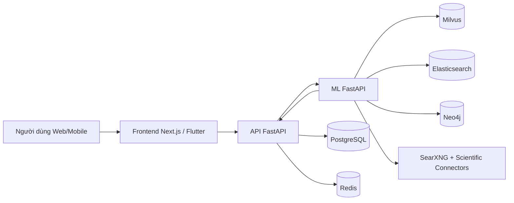
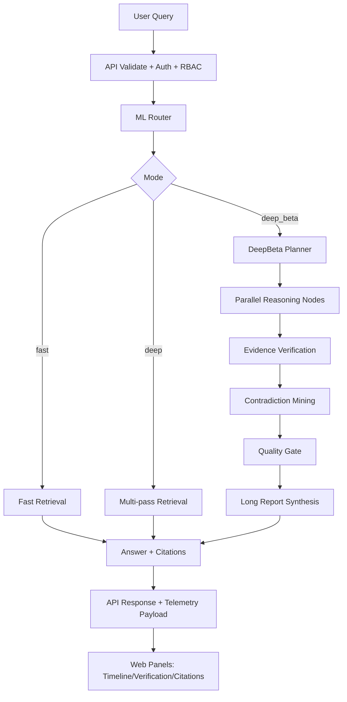
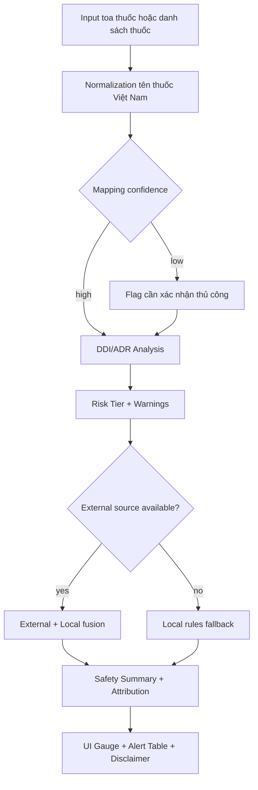
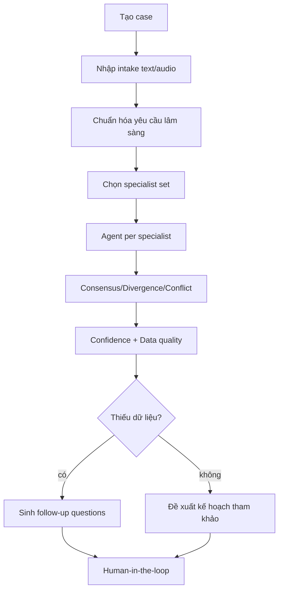
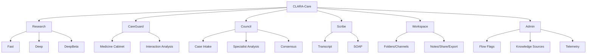

# BÁO CÁO KỸ THUẬT VÀ THUYẾT MINH ĐỀ TÀI
## Nền tảng CLARA-Care: Trợ lý y khoa đa mô-đun theo định hướng Safety-first AI

**Phiên bản tài liệu:** 1.0  
**Ngôn ngữ:** Tiếng Việt  
**Định dạng:** Markdown (sẵn sàng xuất PDF/in đóng quyển)

---

## Lời mở đầu
Trong lĩnh vực phần mềm y tế, câu hỏi quan trọng nhất không còn là “hệ thống trả lời nhanh đến mức nào”, mà là “hệ thống có đủ an toàn để hỗ trợ con người ra quyết định trong các tình huống nhiều rủi ro hay không”. CLARA-Care được xây dựng từ chính câu hỏi đó. Dự án không định vị mình là “AI bác sĩ”, không thay thế chuyên môn lâm sàng, và càng không khuyến khích tự ý điều trị. Thay vào đó, hệ thống tập trung vào ba trụ cột: truy xuất bằng chứng có nguồn gốc rõ ràng, phát hiện rủi ro sớm, và luôn duy trì đường lui an toàn (safe fallback) khi hạ tầng hoặc upstream model gặp sự cố.

Báo cáo này được biên soạn dựa trên việc đọc trực tiếp codebase thực tế của repository `/opt/clara-care`, bao gồm backend API, dịch vụ ML orchestration, frontend web, mobile starter, cấu hình triển khai, pipeline CI/CD, và tập kiểm thử. Toàn bộ nhận định kỹ thuật đều bám vào hiện trạng mã nguồn tại thời điểm khảo sát. Mục tiêu của tài liệu không chỉ là thuyết minh “làm gì”, mà còn lý giải “vì sao thiết kế như vậy”, “vận hành trong thực tế ra sao”, và “trình diễn trước hội đồng như thế nào để thuyết phục cả về kỹ thuật lẫn trải nghiệm người dùng”.

---

## Tóm tắt điều hành
CLARA-Care là một monorepo triển khai đầy đủ các lớp của một sản phẩm số y tế hiện đại: web app cho người dùng cuối, API gateway nghiệp vụ, ML service cho routing/RAG/agent, mô hình dữ liệu quan hệ, tầng observability, cùng hạ tầng triển khai container hóa. Không gian chức năng của hệ thống được tổ chức thành các phân hệ rõ ràng: Chat nghiên cứu y khoa, Research Tier-2 (fast/deep/deep_beta), CareGuard kiểm tra an toàn thuốc, Council hội chẩn đa chuyên khoa tham khảo, Scribe chuẩn hóa ghi chú SOAP, Workspace quản lý tri thức làm việc, và Admin Control Tower để điều phối cấu hình runtime.

Điểm nổi bật về kiến trúc là triết lý safety-by-design xuyên suốt. Ở lớp ML, hệ thống có legal hard guard để từ chối các yêu cầu vượt ranh giới pháp lý như kê đơn, chẩn đoán hay chỉ định liều cá nhân. Ở lớp API, hệ thống áp dụng đồng thời RBAC, CSRF cho mutating request theo cookie session, brute-force guard cho đăng nhập, rate limiting cục bộ hoặc phân tán qua Redis, và startup policy guard cho môi trường production. Ở lớp giao diện, hệ thống hiển thị rõ flow timeline, telemetry, verification matrix, contradiction summary để người dùng không chỉ “nhận kết quả”, mà còn nhìn thấy chất lượng lập luận và trạng thái tin cậy của đầu ra.

Về quy mô kỹ thuật, snapshot code hiện tại thể hiện một dự án có chiều sâu triển khai: hơn mười nghìn dòng cho API và ML, hàng chục nghìn dòng cho frontend web, hệ thống endpoint đa miền nghiệp vụ, cùng bộ test tự động ở cả hai service backend. Hạ tầng build/deploy có phân lớp rõ: compose cho data plane, compose cho app stack, Nginx reverse proxy, workflow CI/CD/release/CD trên GitHub Actions, cùng script vận hành backup/cleanup/env validation. Điều này giúp đề tài không dừng ở mức ý tưởng học thuật, mà tiến sát một sản phẩm có khả năng vận hành thật.

Về mặt thi cử và trình bày trước ban giám khảo, CLARA-Care có lợi thế nhờ khả năng “trình diễn có kiểm soát”: người trình bày có thể cho thấy một luồng end-to-end từ nhập bài toán y khoa, chạy multi-stage reasoning, đối chiếu chứng cứ, đến xuất báo cáo markdown giàu cấu trúc và tài liệu DOCX. Bên cạnh đó, các module như CareGuard và Council tạo được hiệu ứng trực quan cao, vì kết quả không chỉ là văn bản mà còn gồm ma trận rủi ro, conflict map, escalation note và timeline suy luận. Đây là chất liệu tốt để thuyết phục hội đồng cả ở tầng sản phẩm và tầng kỹ thuật nền.

---

## Phương pháp khảo sát codebase
Quá trình “init repository để hiểu cấu trúc, kiến trúc, nội dung dự án” được thực hiện theo hướng đọc mã nguồn thực tế theo chiều dọc từ hạ tầng đến chức năng, thay vì chỉ dựa vào README. Các bước gồm: lập bản đồ thư mục monorepo; đọc file entrypoint của từng service; truy vết router và contract request/response; khảo sát mô hình dữ liệu, middleware bảo mật, pipeline xử lý chính; đối chiếu với test suite và workflow CI/CD; cuối cùng tổng hợp thành tài liệu thuyết minh có thể dùng trực tiếp cho hồ sơ dự thi.

Các cụm mã nguồn đã được đọc sâu bao gồm:
- `services/api/src/clara_api/main.py` và toàn bộ endpoint trong `services/api/src/clara_api/api/v1/endpoints/*`.
- `services/ml/src/clara_ml/main.py`, `services/ml/src/clara_ml/agents/research_tier2.py`, các module RAG/retrieval/factcheck.
- `apps/web/app/*`, `apps/web/lib/*`, `apps/web/components/*` cho các màn chức năng chính.
- `apps/mobile/lib/*` để nắm phạm vi tích hợp di động.
- `deploy/docker/*`, `deploy/nginx/*`, `Makefile`, `.github/workflows/*`, `scripts/*`, `docs/*`.

Kết quả khảo sát cho phép xây dựng một bản thuyết minh vừa đúng bản chất kỹ thuật, vừa đủ thực dụng để phục vụ phần thi trình diễn sản phẩm.

---

## Chương 1. Tính cấp thiết của đề tài
Bối cảnh chăm sóc sức khỏe hiện nay đang chịu áp lực kép. Một mặt, người dân có nhu cầu tiếp cận thông tin y khoa nhanh chóng, thuận tiện, cá nhân hóa theo hoàn cảnh thực tế. Mặt khác, khối lượng thông tin y tế trên internet quá lớn, chất lượng không đồng đều, khiến người dùng dễ rơi vào hai trạng thái nguy hiểm: hoặc tự tin sai, hoặc hoang mang quá mức. Trong các tình huống liên quan đến thuốc và tương tác thuốc, sai lệch thông tin có thể dẫn tới hậu quả trực tiếp tới an toàn người bệnh.

Ở phía chuyên môn, đội ngũ bác sĩ và nhân viên y tế cũng đang đối diện bài toán thời gian. Các ca bệnh đa bệnh lý, đa thuốc, đa yếu tố nguy cơ ngày càng phổ biến, đòi hỏi tổng hợp thông tin từ nhiều nguồn tài liệu khác nhau trong thời gian ngắn. Nếu công cụ hỗ trợ chỉ mạnh về sinh văn bản nhưng yếu về kiểm chứng chứng cứ, hoặc không có cơ chế quản trị rủi ro rõ ràng, thì giá trị thực tế trong môi trường lâm sàng sẽ rất hạn chế.

Đề tài CLARA-Care ra đời để xử lý chính khoảng trống đó: cung cấp một nền tảng trợ lý y khoa có khả năng tổng hợp tri thức nhanh, nhưng đặt tiêu chí an toàn và minh bạch lên trước tốc độ trả lời. Tính cấp thiết của đề tài thể hiện ở ba điểm. Thứ nhất, đây là nhu cầu xã hội có thật, xuất hiện hàng ngày ở cả cộng đồng và cơ sở chăm sóc sức khỏe. Thứ hai, thị trường đang có nhiều sản phẩm AI y tế nhưng chưa phải sản phẩm nào cũng đầu tư đủ vào lớp legal guard, fallback strategy, và khả năng giải trình kỹ thuật. Thứ ba, trong bối cảnh giáo dục và nghiên cứu, một đề tài có đầy đủ từ kiến trúc hệ thống đến vận hành CI/CD sẽ cho thấy năng lực phát triển phần mềm ở mức trưởng thành, vượt khỏi phạm vi demo học thuật thuần túy.

Từ góc nhìn hội thi, “tính cấp thiết” không nên trình bày như một khẩu hiệu chung chung kiểu “AI giúp y tế tốt hơn”, mà phải gắn với kịch bản sử dụng cụ thể. Ví dụ, người dùng cá nhân thường quên tên thuốc đã dùng hoặc không biết nguy cơ tương tác khi tự bổ sung thuốc giảm đau; bác sĩ cần một công cụ tổng hợp nhanh bằng chứng và nhấn mạnh điểm còn bất định thay vì đưa ra kết luận tuyệt đối; nhà nghiên cứu cần truy xuất đa nguồn với dấu vết kiểm chứng rõ ràng để tiết kiệm thời gian đọc tài liệu ban đầu. CLARA-Care được thiết kế để phản hồi trực tiếp các kịch bản này.

---

## Chương 2. Mục tiêu, phạm vi và nguyên tắc thiết kế
Mục tiêu kỹ thuật của đề tài là xây dựng một nền tảng có thể vận hành end-to-end với các chức năng trọng tâm: hỗ trợ truy xuất và tổng hợp bằng chứng y khoa, hỗ trợ kiểm tra rủi ro tương tác thuốc, hỗ trợ hội chẩn tham khảo đa chuyên khoa, và hỗ trợ chuẩn hóa ghi chú lâm sàng. Tuy nhiên, mục tiêu sản phẩm không chỉ là “có nhiều tính năng”, mà là đảm bảo mọi tính năng đều nằm trong một khung an toàn nhất quán.

Phạm vi hiện tại của hệ thống tập trung vào decision support và information assistance. Hệ thống không đưa ra chỉ định điều trị bắt buộc, không tự động kê đơn, không thay thế quy trình khám chữa bệnh chính quy. Đây là ranh giới đạo đức và pháp lý được hiện thực hóa bằng cơ chế chặn ở backend, thay vì để phụ thuộc hoàn toàn vào lời nhắc prompt.

Ba nguyên tắc thiết kế xuyên suốt có thể tóm gọn như sau. Thứ nhất là an toàn ưu tiên: khi thiếu dữ liệu, khi gặp lỗi upstream, hoặc khi phát hiện yêu cầu ngoài phạm vi pháp lý, hệ thống phải ưu tiên giảm rủi ro hơn là cố gắng “trả lời cho bằng được”. Thứ hai là khả năng giải trình: output cần có citation, metadata, trace/telemetry để người dùng và người phản biện nhìn được nền tảng của kết luận. Thứ ba là khả năng vận hành: kiến trúc phải đi cùng cơ chế triển khai, kiểm thử, giám sát và bảo trì rõ ràng để sản phẩm không “đẹp ở demo nhưng vỡ ở production”.

---

## Chương 3. Toàn cảnh kiến trúc hệ thống
CLARA-Care được tổ chức theo kiến trúc dịch vụ tách lớp. Lớp trải nghiệm người dùng nằm ở web Next.js và mobile Flutter starter. Lớp nghiệp vụ API sử dụng FastAPI, đóng vai trò cổng chuẩn hóa contract, quản lý định danh người dùng, kiểm soát truy cập, và điều phối gọi ML service. Lớp ML là một FastAPI độc lập, chứa toàn bộ logic routing ý định, retrieval, fact-check, agent orchestration và legal guard. Bên dưới là data plane gồm PostgreSQL, Redis, Milvus, Elasticsearch, Neo4j và MinIO; lớp retrieval web dùng SearXNG cùng các connector khoa học.

Sơ đồ logic ở mức khái quát có thể mô tả như sau:

Điều đáng chú ý là API và ML được tách thành hai service độc lập nhưng ràng buộc bằng internal key và contract payload tương đối chặt. Kiến trúc này giúp nhóm phát triển có thể tiến hóa nhanh logic AI mà không làm rối tầng nghiệp vụ người dùng. Đồng thời, việc tách lớp giúp triển khai scale theo tải thực tế: có thể tăng worker API cho traffic CRUD và auth, tăng worker ML cho các tác vụ deep research tốn thời gian.

---

## Chương 4. Cấu trúc codebase và quy mô kỹ thuật
Repository được tổ chức theo mô hình monorepo với bốn trụ chính: `services/api`, `services/ml`, `apps/web`, `apps/mobile`. Ngoài ra còn có `deploy` cho hạ tầng, `scripts` cho vận hành và đánh giá, `docs` cho tài liệu kỹ thuật/hackathon, `data` cho dữ liệu mẫu và artifact.

Ảnh chụp quy mô mã nguồn tại thời điểm khảo sát:
- Mã Python của API: khoảng 16.251 dòng.
- Mã Python của ML service: khoảng 21.378 dòng.
- Mã TypeScript/TSX của web app: khoảng 34.707 dòng.
- Mã Dart của mobile starter: khoảng 1.128 dòng.

Tầng API hiện có khoảng 111 endpoint REST thuộc nhiều nhóm nghiệp vụ. Tầng ML có 15 endpoint/websocket cho infer và observability. Mô hình dữ liệu quan hệ khai báo 22 bảng chính trong `models.py`. Bộ kiểm thử backend gồm 166 test cho API và 150 test cho ML. Các con số này cho thấy dự án đã vượt ngưỡng một prototype đơn giản; đây là một hệ thống có đủ chiều sâu để trình bày như một đề tài phần mềm hoàn chỉnh.

---

## Chương 5. Giải pháp công nghệ
Về backend, cả API và ML đều sử dụng FastAPI để tận dụng hiệu năng bất đồng bộ, mô hình schema rõ ràng với Pydantic, và khả năng mở rộng endpoint theo module. API service kết hợp SQLAlchemy/Alembic cho dữ liệu quan hệ, `python-jose` cho JWT, Redis cho cơ chế bảo mật phân tán tùy chọn, cùng `python-docx` để xuất tài liệu. ML service kết hợp các module RAG tự xây dựng, client LLM, bộ fact-check và các agent domain.

Về frontend, web app dùng Next.js 15 với React 18 và Tailwind CSS. Tầng giao tiếp HTTP dùng Axios có interceptor cho access token, refresh flow, CSRF header cho mutating request. Web không chỉ là lớp hiển thị cơ bản mà còn có các adapter parse telemetry phức tạp để hiển thị stage span, flow events, verification matrix, contradiction summary, source reasoning và chart spec.

Về mobile, dự án hiện ở mức starter Flutter nhưng đã kết nối được các endpoint trọng yếu: đăng nhập, research tier2, careguard analyze, council run, system metrics, mobile summary. Thiết kế này phù hợp chiến lược phát triển từng bước: dùng web là bề mặt chính cho demo sâu, đồng thời giữ mobile như đường mở rộng thực dụng.

Về hạ tầng dữ liệu, hệ thống dùng PostgreSQL làm nguồn dữ liệu nghiệp vụ chuẩn, Redis cho rate limit/login guard phân tán khi cần, Milvus/Elasticsearch/Neo4j cho retrieval và graph expansion, MinIO làm storage phụ trợ Milvus. Triển khai được container hóa bằng Docker Compose, tách stack hạ tầng và stack ứng dụng để thao tác linh hoạt trong quá trình phát triển và demo.

## Chương 6. Kiến trúc API: cửa ngõ nghiệp vụ và an toàn
Điểm đặc trưng của API service CLARA nằm ở việc kết hợp vai trò gateway với vai trò policy enforcement. Nhiều dự án chọn cách để API chỉ “chuyển tiếp” request sang ML rồi trả về cho frontend. CLARA đi xa hơn: API còn chịu trách nhiệm cưỡng chế quy tắc vận hành cốt lõi, bảo đảm dữ liệu người dùng được phân quyền đúng, và duy trì chất lượng luồng nghiệp vụ khi một thành phần phía sau có dấu hiệu không ổn định.

### 6.1 Khởi động ứng dụng và guard môi trường production
File `services/api/src/clara_api/main.py` cho thấy startup hook kiểm tra một loạt điều kiện trước khi service chạy ở production. Nếu khóa JWT còn mặc định, nếu cookie bảo mật chưa bật đúng, nếu thiếu internal key khi gọi ML, hoặc nếu bật chế độ bootstrap admin với mật khẩu yếu, hệ thống chủ động từ chối khởi động. Đây là một quyết định kiến trúc quan trọng: thay vì để sai cấu hình lọt ra môi trường thật rồi khắc phục thủ công, hệ thống biến “kỷ luật vận hành” thành một phần của chương trình.

Ngoài ra, startup guard còn kiểm tra ràng buộc với Redis khi bật distributed limiter. Cách tiếp cận này tránh được tình trạng cấu hình “nửa vời” khiến bảo mật chỉ hoạt động trên giấy tờ. Trong bài thi, đây là điểm có thể trình bày như minh chứng rằng nhóm không chỉ viết tính năng, mà còn biết thiết kế cơ chế phòng ngừa lỗi vận hành ngay từ đầu.

### 6.2 Chuỗi middleware bảo mật
Trình tự middleware gồm CORS, Auth Context, Rate Limiter, API Metrics, Security Header và CSRF middleware. Việc đặt CSRF theo điều kiện thực tế của cookie-auth (và bỏ qua khi dùng Bearer token) thể hiện một hiểu biết khá chuẩn về cơ chế tấn công web hiện đại. Nếu áp CSRF cứng cho mọi request sẽ gây khó cho client di động hoặc service-to-service; nếu bỏ hẳn thì browser-based session lại tăng rủi ro. CLARA chọn đường ở giữa: bảo vệ mutating request theo ngữ cảnh xác thực, vừa an toàn vừa khả dụng.

### 6.3 Router nghiệp vụ đa miền
Router tập trung ở `services/api/src/clara_api/api/router.py` với prefix `/api/v1`, gom các nhóm endpoint theo domain: auth, mobile, chat, search, research, careguard, council, scribe, system, workspace. Cách chia domain như vậy giúp việc mở rộng tính năng về sau không phá vỡ thiết kế hiện có. Đối với hội đồng, có thể nhấn mạnh rằng hệ thống đã có khả năng phát triển theo module, không bị phụ thuộc vào một file endpoint “siêu lớn” khó bảo trì.

### 6.4 Quản trị phiên và xác thực người dùng
Phân hệ auth (`auth.py`) bao phủ đầy đủ vòng đời tài khoản: đăng ký, xác minh email, đăng nhập, làm mới token, quên/đặt lại mật khẩu, đổi mật khẩu, logout, đọc hồ sơ hiện tại, và quản lý consent. Refresh token được xử lý theo hướng an toàn, có kiểm soát xung đột nguồn token và có cơ chế single-use trong test bảo mật. Login guard chống brute-force có cả bản in-memory và bản phân tán Redis. Điều này rất phù hợp khi hệ thống mở rộng từ một instance demo lên nhiều replica.

### 6.5 Consent y tế như một precondition nghiệp vụ
Điểm rất đáng giá trong CLARA là consent không được xem là checkbox giao diện, mà là precondition được kiểm tra thật ở backend. Các endpoint nhạy cảm như cabinet/careguard bị chặn với mã trạng thái `428 Precondition Required` nếu người dùng chưa chấp nhận phiên bản miễn trừ trách nhiệm hiện hành. Cách làm này nâng chất lượng pháp lý của hệ thống và cũng giúp thuyết minh đề tài vững hơn trước câu hỏi phản biện của giám khảo.

---

## Chương 7. Phân hệ Research Tier-2: trái tim kỹ thuật của đề tài
Nếu phải chọn một module đại diện cho năng lực kỹ thuật của CLARA-Care, đó là luồng Research Tier-2. Đây là nơi hội tụ của planner, multi-source retrieval, multi-pass reasoning, fact-check, quality gate, telemetry, và report synthesis.

### 7.1 Hai cơ chế thực thi: synchronous và async job
API cung cấp cả endpoint chạy trực tiếp và endpoint tạo job bất đồng bộ. Với truy vấn nhẹ, synchronous path đủ đáp ứng. Với truy vấn nặng (đặc biệt deep/deep_beta), async job giúp frontend theo dõi tiến độ theo thời gian thực qua polling hoặc SSE stream. Đây là lựa chọn hợp lý cho UX: người dùng không phải nhìn spinner “đứng im”, mà thấy rõ hệ thống đang ở stage nào, pass nào, đã thu được bao nhiêu bằng chứng, có cảnh báo gì không.

### 7.2 Query planner và routing nguồn
Trong `research_tier2.py`, hệ thống xây planner hints từ nhiều tín hiệu: loại câu hỏi, source mode, role hint, query decomposition, và các cờ runtime như reranker/NLI/GraphRAG. Sau đó source router quyết định tuyến truy xuất `internal-heavy`, `scientific-heavy`, `web-assisted`, hoặc `file-grounded`. Thiết kế này cho phép hệ thống thích nghi với từng bài toán thay vì dùng một strategy duy nhất cho mọi câu hỏi.

### 7.3 Chế độ fast, deep, deep_beta
Chế độ `fast` ưu tiên tốc độ, có cơ chế hạ tải connector để giữ SLA. Chế độ `deep` thực hiện nhiều retrieval pass để tăng độ phủ bằng chứng. Chế độ `deep_beta` mở rộng thêm reasoning chain với các node chuyên biệt, gap-fill pass, evidence verification node, chain synthesis, quality gate và báo cáo dài có cấu trúc chặt.

Ở góc độ kỹ thuật, deep_beta thể hiện mô hình agentic RAG tương đối trưởng thành: không chỉ retrieve rồi sinh câu trả lời, mà còn đánh giá ngược chất lượng chứng cứ, săn bằng chứng trái chiều, và ghi lại chain status từng bước. Đây là yếu tố giúp phần trình diễn “có chiều sâu khoa học”, khác với demo chatbot thông thường.

### 7.4 Verification matrix và contradiction summary
Sau tổng hợp, hệ thống chạy lớp fact-check (FIDES-lite/NLI tùy cờ) để tạo ma trận claim-level: claim nào được hỗ trợ, claim nào chưa đủ bằng chứng, claim nào mâu thuẫn. Contradiction summary giúp người dùng hiểu đâu là vùng bất định của câu trả lời. Trong một đề tài y khoa, cơ chế này rất quan trọng vì nó cho thấy nhóm nhận thức rõ giới hạn của AI và biết biến giới hạn đó thành thông tin minh bạch cho người dùng.

### 7.5 Telemetry giàu ngữ nghĩa cho frontend
Output của tier2 không chỉ có `answer` và `citations`, mà còn có `metadata`, `flow_events`, `stage_spans`, `verification_matrix`, `source_attempts`, `source_errors`, `reasoning_steps`, `retrieval_budgets`, `reasoning_digest`, `chart_specs`, `visual_assets`, và bundle trace. Tầng web parse các payload này để dựng panel theo dõi gần realtime. Điều này tạo ra lợi thế lớn khi thuyết trình: giám khảo nhìn thấy hệ thống “nghĩ như thế nào”, không phải chỉ nghe “hệ thống đã nghĩ”.

---

## Chương 8. Phân hệ CareGuard và Self-Med: an toàn thuốc làm trung tâm
CareGuard là mô-đun có tính ứng dụng cao với người dùng phổ thông. Luồng chính bắt đầu từ quản lý tủ thuốc cá nhân, quét toa thuốc từ text hoặc file ảnh, chuẩn hóa tên thuốc, rồi chạy phân tích tương tác. Kết quả trả về gồm risk tier, danh sách cảnh báo DDI, khuyến nghị theo ngữ cảnh, thông tin attribution nguồn dữ liệu, trạng thái fallback, và lỗi nguồn nếu có.

Điểm đặc biệt nằm ở lớp chuẩn hóa thuốc Việt Nam. Hệ thống có bảng từ điển nội bộ (`vn_drug_mappings`, alias, audit), hỗ trợ mapping exact/candidate/fallback và cho phép xác nhận thủ công với các detection độ tin cậy thấp. Thiết kế này giúp hệ thống làm việc tốt hơn với dữ liệu thực tế vốn hay nhiễu do OCR, tên thương mại, và thói quen ghi đơn không đồng nhất.

Về UX, trang CareGuard trên web không chỉ hiện một danh sách text đơn thuần, mà có gauge điểm rủi ro, badge trạng thái runtime (external+local hay local-only), bảng cảnh báo ưu tiên, và insight tổng hợp. Từ góc độ trình diễn, đây là một màn “ăn điểm” vì vừa trực quan vừa dễ gắn với tình huống giả định trước hội đồng.

Từ góc nhìn kiến trúc, CareGuard còn là ví dụ điển hình của thiết kế fail-soft. Khi nguồn ngoài có vấn đề, hệ thống vẫn duy trì local rules để không làm “chết luồng” phân tích. Dù chất lượng có thể thấp hơn so với full connector mode, người dùng vẫn nhận được phản hồi an toàn cơ bản thay vì màn hình lỗi trống. Đây là tiêu chí rất thực tế trong các môi trường demo có mạng không ổn định.

---

## Chương 9. Phân hệ Council: hội chẩn tham khảo đa chuyên khoa
Council được xây dựng như một workflow có trạng thái, không phải một lệnh infer một lần rồi xong. Người dùng tạo case, nhập intake (text hoặc audio), chọn nhóm specialist, chạy hội chẩn, rồi xem kết quả ở các màn tách biệt: Analyze, Details, Citations, Research, Deepdive. Cách tách trang này giúp giảm quá tải nhận thức khi xử lý thông tin lâm sàng phức tạp.

Ở lớp dữ liệu, API lưu `council_cases` với status, payload intake, request chuẩn hóa, kết quả chạy và metadata liên quan. Ở lớp ML, council agent tổng hợp reasoning log theo từng specialist, tạo consensus/divergence/conflict, đánh giá confidence/data quality, phát hiện thiếu thông tin và sinh câu hỏi follow-up khi cần. Ngoài ra còn có neural risk ở shadow mode để hỗ trợ chấm mức ưu tiên, nhưng chưa thay thế logic rule-based.

Về mặt trình bày trước giám khảo, Council cho phép trình diễn rất thuyết phục vì có đủ ba yếu tố: quy trình có kỷ luật, kết quả giàu ngữ cảnh, và đường dẫn “human-in-the-loop” rõ ràng. Khi hệ thống phát hiện conflict hoặc dữ liệu thiếu, output nghiêng về cảnh báo và đề nghị bổ sung thông tin, thay vì ép ra một kết luận chắc chắn giả tạo.

---

## Chương 10. Phân hệ Scribe: chuẩn hóa ghi chú SOAP
Scribe trong CLARA phục vụ bài toán chuyển transcript thành cấu trúc SOAP (Subjective, Objective, Assessment, Plan), đồng thời hỗ trợ lưu phiên, cập nhật, tái sinh phiên và thống kê cơ bản. Ở frontend, module có giao diện workspace và review mode, cho phép theo dõi transcript chunk theo thời gian, insight sống, và mã lâm sàng gợi ý.

Điểm đáng chú ý là hệ thống giữ thế cân bằng giữa realtime và tính ổn định. Luồng ghi âm/transcribe được thiết kế có queue chunk và cơ chế append vào session thay vì phụ thuộc một request đơn khổng lồ. Đây là cách làm phù hợp với dữ liệu âm thanh thực tế, nơi mạng và thiết bị đầu cuối dễ biến động.

Trong hồ sơ dự thi, Scribe giúp bổ sung chiều rộng cho đề tài: thay vì chỉ có một chức năng hỏi đáp, dự án chứng minh năng lực xây dựng nhiều workflow y tế liên quan nhau, cùng dùng chung nền tảng bảo mật và dữ liệu.

---

## Chương 11. Workspace và Admin Control Tower
Workspace là phân hệ “năng suất tri thức” của CLARA. Người dùng có thể tổ chức hội thoại theo folder/channel, đánh dấu yêu thích, ghi chú markdown, chia sẻ conversation qua token công khai có kiểm soát, tìm kiếm tập trung và xuất tài liệu markdown/docx. Đây là phần tạo ra giá trị bền vững sau một phiên hỏi đáp: tri thức được lưu giữ, truy xuất lại và tái sử dụng.

Admin Control Tower là lớp điều phối cấu hình và observability. Admin có thể quản lý danh mục nguồn RAG, flow flags, low-context threshold, và theo dõi flow events realtime. Trong giao diện admin, các panel không chỉ hiện số liệu tĩnh mà có chart, matrix, runtime monitor và inventory tổng hợp giữa RAG connectors, knowledge sources, source hub catalog. Điều này cho thấy dự án quan tâm cả vòng đời vận hành, không chỉ trải nghiệm người dùng cuối.

Một chi tiết kỹ thuật đáng lưu ý: service control tower cưỡng chế một số cờ bắt buộc ở backend. Ví dụ một số flow flag được ép luôn bật theo policy sản phẩm. Cách làm này ngăn cấu hình “trượt chuẩn” do thao tác tay ở giao diện quản trị.

---

## Chương 12. Mô hình dữ liệu và quản trị trạng thái
Hệ thống dữ liệu quan hệ của CLARA gồm 22 bảng lõi. Đây là cấu trúc đủ phong phú để phục vụ cả nghiệp vụ người dùng lẫn vận hành hệ thống. Có thể nhóm thành bảy cụm chính.

Cụm định danh và phiên làm việc gồm `users`, `sessions`, `queries`, `auth_tokens`, `user_consents`. Cụm này đảm bảo khả năng theo dõi lịch sử tương tác, quản lý vòng đời token và thực thi consent theo phiên bản. Cụm nghiệp vụ AI gồm `research_jobs`, `council_cases`, `scribe_sessions`. Cụm chăm sóc thuốc gồm `medicine_cabinets`, `medicine_items`, cùng ba bảng mapping Việt Nam phục vụ chuẩn hóa tên thuốc. Cụm tri thức gồm `knowledge_sources`, `knowledge_documents`, `federated_source_records`. Cụm vận hành gồm `system_settings`. Cụm năng suất làm việc gồm các bảng workspace folders/channels/conversation meta/share/notes.

Thiết kế này thể hiện một quyết định đúng đắn: không dồn mọi thứ vào một bảng log chung, mà mô hình hóa theo domain để đảm bảo tính mở rộng và khả năng quản trị. Mỗi bảng có mục tiêu nghiệp vụ rõ ràng nên việc viết migration, kiểm thử và truy vấn phân tích về sau sẽ dễ kiểm soát hơn.

Về migration, dự án có chuỗi Alembic versioned tương đối mạch lạc, đi từ khởi tạo lõi người dùng đến bổ sung auth/cabinet, knowledge sources, consent log, rồi từ điển thuốc Việt Nam. Trình tự này phù hợp thực tế phát triển theo phase.

---

## Chương 13. Bảo mật ứng dụng
Bảo mật của CLARA-Care được thiết kế theo nhiều lớp, mỗi lớp xử lý một nhóm rủi ro khác nhau.

Lớp xác thực và phân quyền sử dụng JWT với access/refresh token, RBAC theo vai trò `normal/researcher/doctor/admin`, và guard riêng cho endpoint nhạy cảm. Lớp trình duyệt dùng cookie session kết hợp CSRF token cho mutating requests, đồng thời web client tự động đính `X-CSRF-Token` khi cần. Lớp chống lạm dụng có rate limiter theo cửa sổ thời gian, hỗ trợ cả in-memory và Redis distributed. Lớp chống brute-force đăng nhập có lockout theo khóa email+IP với tham số cấu hình.

Ở phía ML, internal key middleware chặn truy cập trái phép vào các endpoint `/v1/*` và metrics/health details khi chạy production. Legal hard guard xử lý riêng các intent vượt ranh giới pháp lý. Với research output, verification matrix và safety override giúp giảm rủi ro trả lời “mượt nhưng nguy hiểm”.

Một điểm đáng giá khác là security remediation được theo dõi bằng tài liệu riêng trong `docs/security/security-remediation-2026-04-03.md`, cho thấy nhóm có quy trình rà soát và đóng lỗ hổng theo vòng đời chứ không chỉ vá tức thời.

---

## Chương 14. Kho citation tách file để kiểm soát ngữ cảnh và truy vết học thuật
Để tránh tràn context khi viết báo cáo dài, toàn bộ citation khoa học được tách thành từng file độc lập trong thư mục `docs/research/citations/`. Mỗi citation có định danh rõ ràng (PMID/DOI/arXiv/ACL), trích dẫn chuẩn, hàm ý kỹ thuật rút ra cho CLARA, điểm chạm mã nguồn và KPI đánh giá.

Cách tổ chức này đem lại ba lợi ích trực tiếp. Thứ nhất, nhóm có thể viết và chỉnh từng cụm lập luận khoa học mà không phải nạp lại cả danh mục tài liệu tham khảo. Thứ hai, việc truy vết trở nên rõ ràng hơn vì mỗi luận điểm có thể liên kết thẳng tới một file nguồn nghiên cứu cụ thể. Thứ ba, khi cần cập nhật phiên bản nghiên cứu mới, ta chỉ sửa file citation liên quan thay vì chạm toàn bộ báo cáo tổng.

Chỉ mục danh mục citation nằm tại `docs/research/citations/README.md`. Bộ citation hiện có 18 file, bao phủ các trục chính: safety/deprescribing, DDI/ADR, agentic RAG, GraphRAG, hallucination benchmark và private/local RAG. Cấu trúc này cũng phù hợp với yêu cầu thuyết minh trước hội đồng: mọi phát biểu kỹ thuật trọng yếu đều có thể “mở bằng chứng” ngay tức thì.

---

## Chương 15. Tính mới và sáng tạo: CLARA-Care khác gì so với sản phẩm hiện có
Một báo cáo kỹ thuật mạnh không dừng ở mô tả tính năng. Hội đồng luôn đặt câu hỏi trực diện: giải pháp này có thật sự mới, hay chỉ là một biến thể giao diện của chatbot phổ thông? Ở điểm này, CLARA-Care cần được bảo vệ bằng lập luận kỹ thuật có chứng cứ.

Điểm khác biệt thứ nhất là mô hình “an toàn làm trục chính” thay vì “trả lời nhanh làm trục chính”. Nhiều hệ thống AI tiêu dùng tối ưu trải nghiệm hội thoại mượt mà, nhưng chưa có lớp cưỡng chế pháp lý rõ ràng ở backend. CLARA triển khai legal hard guard ngay ở service ML, nghĩa là câu hỏi vượt phạm vi tư vấn an toàn bị chặn ở tầng hệ thống trước khi model phát sinh nội dung. Đây không phải lựa chọn thẩm mỹ, mà là lựa chọn kiến trúc có hệ quả pháp lý và đạo đức rõ ràng.

Điểm khác biệt thứ hai là quy trình deep research có thể kiểm toán. Hệ thống không trả một khối text “đen hộp”, mà cung cấp flow events, stage spans, verification matrix và contradiction summary. Khi hội đồng yêu cầu giải trình “vì sao hệ thống kết luận như vậy”, nhóm có thể mở trace và chứng minh đường suy luận theo từng chặng. Trong bối cảnh các benchmark hallucination gần đây nhấn mạnh rủi ro overconfident output của LLM y sinh, khả năng truy vết này là lợi thế cạnh tranh thực chất, không phải mỹ từ trình bày.

Điểm khác biệt thứ ba là dữ liệu và workflow được đóng thành nền tảng thay vì nhiều demo rời rạc. Research, CareGuard, Council, Scribe và Workspace dùng chung một lõi danh tính, phiên làm việc, consent, quan sát vận hành và chính sách bảo mật. Cách làm này tạo giá trị tích lũy sau từng phiên sử dụng, khác hẳn mô hình “chạy một lần rồi mất dấu”.

Điểm khác biệt thứ tư là chiến lược “fail-soft” trong các luồng trọng yếu. Khi external connector lỗi hoặc mạng gián đoạn, hệ thống vẫn duy trì nhánh fallback có kiểm soát để trả về cảnh báo an toàn cơ bản. Trong thực địa trình diễn, đây là sự khác biệt giữa một sản phẩm vận hành được và một bản demo dễ sụp do phụ thuộc tuyệt đối vào hạ tầng bên ngoài.

### 15.1 So sánh theo tiêu chí hội đồng
| Tiêu chí | Ứng dụng AI phổ thông | CLARA-Care |
|---|---|---|
| Mức độ minh bạch suy luận | Thường thấp, khó kiểm toán | Có `flow_events`, `verification_matrix`, `contradiction_summary` |
| Cưỡng chế an toàn pháp lý | Chủ yếu ở prompt | Cưỡng chế ở backend guard + policy flags |
| Khả năng xử lý nghiệp vụ thuốc | Thường mô tả chung | Có CareGuard + chuẩn hóa thuốc Việt Nam + DDI/ADR framing |
| Kiến trúc triển khai | Monolith hoặc demo script | API/ML/Web tách lớp, contract rõ, có CI/workflow |
| Khả năng mở rộng nghiên cứu | Thêm prompt ad hoc | Deep/DeepBeta pipeline có stage và cờ runtime |
| Độ sẵn sàng trình diễn | Phụ thuộc mạng, dễ vỡ | Fail-soft và fallback rõ ràng |

### 15.2 Tính mới gắn với bằng chứng khoa học
Các file citation đã tách riêng cho phép nhóm trích dẫn trực tiếp theo luận điểm. Ví dụ:
- Khi lập luận về deprescribing cho người cao tuổi, dùng `docs/research/citations/c01-pmid-41609788.md` và `c02-pmid-40445620.md`.
- Khi bảo vệ việc chèn claim-level verification và contradiction mining, dùng `c03-pmid-40997804.md`, `c17-acl-2025-emnlp-main-143.md`, `c18-doi-10-3389-fpubh-2025-1635381.md`.
- Khi bảo vệ hướng GraphRAG và hybrid retrieval, dùng `c13-acl-2025-acl-long-1381.md`, `c15-arxiv-2512-10996.md`, `c12-pmid-41566090.md`.

Cách trích này giúp bản thuyết minh không rơi vào lỗi phổ biến: nói “theo nghiên cứu cho thấy” nhưng không chỉ ra nghiên cứu nào, áp vào module nào, đo bằng KPI nào.

---

## Chương 16. Sơ đồ thuật toán và luồng xử lý cốt lõi
Trong lĩnh vực phần mềm, sơ đồ thuật toán là bằng chứng trực quan cho tư duy hệ thống. Với CLARA, sơ đồ không chỉ để mô tả đường đi dữ liệu, mà còn để thể hiện điểm kiểm soát rủi ro.

### 16.1 Flowchart tổng quát cho Research Tier-2

### 16.2 Flowchart CareGuard: chuẩn hóa thuốc và đánh giá rủi ro

### 16.3 Flowchart Council: hội chẩn đa chuyên khoa

### 16.4 Nguyên tắc thiết kế thuật toán
Ba nguyên tắc kỹ thuật xuyên suốt toàn bộ flowchart:
1. Mỗi nhánh quan trọng phải có cổng kiểm tra an toàn trước khi sinh khuyến nghị.
2. Mỗi kết luận có giá trị hành động phải truy ngược được nguồn chứng cứ.
3. Mỗi điểm có thể lỗi ngoại vi phải có nhánh fallback không phá vỡ toàn luồng nghiệp vụ.

---

## Chương 17. Trình diễn sản phẩm: từ “chạy được” sang “thuyết phục được hội đồng”
Trong chấm thi phần mềm, sản phẩm thắng cuộc thường không phải sản phẩm nhiều tính năng nhất mà là sản phẩm trình diễn rõ nhất giá trị thực. Vì vậy, CLARA cần một chiến lược trình diễn có kịch bản, không ứng biến.

### 17.1 Bộ ảnh minh họa giao diện theo chuẩn mockup
Ảnh chụp màn hình thuần túy thường khiến hội đồng khó hình dung ngữ cảnh sử dụng. Phương án trình bày nên gồm:
1. Ảnh hero dashboard đặt trong mockup màn hình laptop để thể hiện bức tranh tổng.
2. Ảnh research deep_beta đặt trong khung browser, làm nổi timeline và verification matrix.
3. Ảnh CareGuard đặt trong mockup điện thoại để nhấn mạnh khả năng dùng nhanh ở điểm chăm sóc.
4. Ảnh Council dạng split-view để thể hiện chuyên gia đồng thuận và xung đột.
5. Ảnh Scribe ở trạng thái đang nhận transcript để làm rõ yếu tố realtime.

Quy tắc chọn ảnh: mỗi ảnh phải trả lời một câu hỏi kỹ thuật cụ thể. Nếu ảnh chỉ để “đẹp”, nên loại bỏ.

### 17.2 Kịch bản video demo 3-5 phút (bản nộp và bản trình chiếu)
Một video tốt không chỉ quay thao tác, mà phải dựng thành câu chuyện kỹ thuật:
1. Mở đầu 20-30 giây: nêu bài toán thực tiễn và rủi ro nếu làm thủ công.
2. 60-90 giây: chạy một truy vấn deep_beta, cho thấy hệ thống đi qua retrieval, verification, contradiction.
3. 45-60 giây: chạy CareGuard trên danh sách thuốc có nguy cơ tương tác, hiển thị risk gauge.
4. 45-60 giây: mở Council với tình huống dữ liệu thiếu, cho thấy hệ thống sinh follow-up thay vì kết luận bừa.
5. 30-45 giây: kết bằng dashboard vận hành và thông điệp về an toàn, khả năng kiểm toán.

Khi thu video, cần chèn phụ đề ngắn cho từng bước: “Input”, “Evidence”, “Verification”, “Recommendation”, “Safety Disclaimer”. Phụ đề này giúp hội đồng theo dõi mạch kỹ thuật ngay cả khi xem lướt.

### 17.3 Function Tree/Sitemap cho phần mềm

---

## Chương 18. Chuẩn bị sản phẩm thực tế để nộp và chấm thi
Mục tiêu ở giai đoạn này là giảm tối đa rủi ro “đến lúc chấm thì không chạy”. Với CLARA, cần xem đóng gói như một phần kỹ thuật bắt buộc, không phải công đoạn hành chính.

### 18.1 Đóng gói và triển khai
Nếu chấm theo hình thức online, cần chuẩn bị:
- URL staging ổn định.
- Tài khoản demo theo vai trò (`normal`, `researcher`, `doctor`, `admin`).
- Dữ liệu seed cho các ca minh họa.
- Kịch bản fallback khi connector ngoài bị chậm.

Nếu chấm offline tại phòng thi, cần chuẩn bị:
- Bộ docker-compose đã kiểm chứng chạy trên một máy sạch.
- `.env.demo` rút gọn, tránh lộ khóa production.
- Script khởi động một lệnh (`make up` hoặc script tương đương).
- Bản ghi sẵn video dự phòng nếu gặp sự cố hạ tầng.

### 18.2 Tài liệu hướng dẫn sử dụng đi kèm
Một bộ tài liệu nộp tối thiểu gồm:
1. `User Manual` cho người dùng cuối.
2. `Admin Manual` cho giám khảo kỹ thuật muốn kiểm tra sâu.
3. `Deployment Note` cho tình huống cần dựng lại nhanh trong buổi chấm.

Tài liệu càng ngắn càng tốt, nhưng mỗi bước phải tái lập được. Hội đồng thường đánh giá cao khả năng tái hiện hơn độ dày hình thức.

### 18.3 Hồ sơ mã nguồn
Không nên in toàn bộ code. Thay vào đó, chọn các đoạn “đinh” thể hiện năng lực kỹ thuật:
- Đoạn planner/routing trong research tier2.
- Đoạn verification matrix + contradiction summary.
- Đoạn legal hard guard.
- Đoạn fallback strategy khi external source lỗi.
- Đoạn parser telemetry ở frontend.

Mỗi đoạn code in kèm một chú giải ngắn: bài toán gì, vì sao viết như vậy, kiểm chứng ra sao. Khi phản biện, đây là lợi thế quyết định.

---

## Chương 19. Tài liệu hướng dẫn sử dụng mẫu (rút gọn)
Phần này được viết theo văn phong manual để có thể tách thành PDF độc lập khi cần.

### 19.1 Yêu cầu hệ thống
- Docker và Docker Compose.
- CPU 4 core, RAM 8 GB tối thiểu cho demo cơ bản.
- Kết nối mạng ổn định nếu dùng connector bên ngoài.

### 19.2 Các bước chạy nhanh
1. Clone repository và cấu hình biến môi trường từ `.env.example`.
2. Chạy stack bằng compose.
3. Kiểm tra API health và ML health.
4. Truy cập web app, đăng nhập bằng tài khoản demo.
5. Chạy luồng kiểm tra smoke: Research -> CareGuard -> Council -> Scribe.

### 19.3 Quy trình sử dụng Research DeepBeta
1. Nhập câu hỏi có phạm vi rõ ràng.
2. Chọn mode `deep_beta`.
3. Theo dõi timeline stage trên UI.
4. Mở bảng verification để xem claim nào đã có bằng chứng.
5. Đọc phần contradiction trước khi đọc recommendation.

### 19.4 Quy trình sử dụng CareGuard
1. Tạo tủ thuốc cá nhân.
2. Nhập danh sách thuốc từ text hoặc ảnh.
3. Xác nhận các thuốc có mapping confidence thấp.
4. Chạy phân tích tương tác.
5. Đọc risk tier và cảnh báo ưu tiên cao trước.

### 19.5 Lưu ý an toàn sử dụng
- Kết quả chỉ là thông tin tham khảo hỗ trợ quyết định.
- Không dùng để tự kê đơn hoặc tự thay đổi liều.
- Khi có dấu hiệu cảnh báo mức cao, bắt buộc escalates tới chuyên gia phù hợp.

---

## Chương 20. Kịch bản thuyết trình trước hội đồng và bộ câu hỏi phản biện
Trong phần thuyết trình trực tiếp, sai lầm hay gặp là kể quá nhiều về công nghệ nhưng không chứng minh được giá trị sử dụng. CLARA nên đi theo chiến lược “một tình huống, ba bằng chứng”.

### 20.1 Kịch bản 7 phút đề xuất
1. 60 giây mở đầu: nêu bài toán quá tải thông tin và rủi ro sai sót khi tư vấn thuốc.
2. 150 giây demo Research DeepBeta: cho thấy evidence synthesis + contradiction handling.
3. 90 giây demo CareGuard: cho thấy risk stratification và local fallback.
4. 90 giây demo Council: cho thấy dữ liệu thiếu thì hệ thống hỏi lại thay vì kết luận.
5. 30 giây kết: nhấn mạnh safety-by-design và khả năng kiểm toán.

### 20.2 Tình huống giả định nên dùng
“Giả sử một người cao tuổi đang dùng nhiều thuốc mạn tính và có thêm triệu chứng mới. Mục tiêu không phải để AI thay bác sĩ, mà để hệ thống giúp phát hiện vùng rủi ro, tổng hợp chứng cứ và đề xuất bước tiếp theo có trách nhiệm.”

Tình huống này tốt vì vừa có tính thực tiễn, vừa kích hoạt đầy đủ các mô-đun: research, careguard, council.

### 20.3 Bộ câu hỏi kỹ thuật khó và cách trả lời
Câu hỏi: “Nếu mất mạng thì phần mềm có chạy được không?”
Trả lời trọng tâm: hệ thống có fail-soft path, các chức năng phụ thuộc external connector sẽ giảm chất lượng nhưng không làm sập toàn luồng; careguard vẫn có local rules để cảnh báo an toàn cơ bản.

Câu hỏi: “Dữ liệu bảo mật như thế nào?”
Trả lời trọng tâm: auth token + RBAC + CSRF + rate limit + lockout + internal key giữa API/ML; đồng thời có log remediation và policy guard cho các intent nhạy cảm.

Câu hỏi: “Làm sao biết hệ thống không bịa?”
Trả lời trọng tâm: verification matrix theo claim-level, contradiction summary, citation payload và telemetry stage. Khi chưa đủ chứng cứ, hệ thống có thể giảm độ chắc chắn thay vì khẳng định tuyệt đối.

Câu hỏi: “Tính mới của đề tài nằm ở đâu?”
Trả lời trọng tâm: khác biệt nằm ở kiến trúc an toàn-kiểm toán được triển khai runtime, không chỉ ở prompt; có cơ chế đa workflow và dữ liệu liên thông, có khả năng vận hành thật thay vì demo cục bộ.

---

## Chương 21. Khung đánh giá khoa học và phương pháp trích dẫn trong báo cáo
Để lập luận sắc bén, mỗi nhận định kỹ thuật cần đi theo công thức: nhận định -> bằng chứng runtime -> citation khoa học -> KPI kiểm chứng. Nếu thiếu một trong bốn mắt xích này, lập luận sẽ yếu.

### 21.1 Ví dụ cấu trúc lập luận đạt chuẩn
Nhận định: “Claim-level verification giúp giảm nguy cơ kết luận thiếu căn cứ trong báo cáo y sinh.”
Bằng chứng runtime: payload có `verification_matrix`, `contradiction_summary` và cờ `verification_status`.
Citation khoa học: `c03-pmid-40997804.md`, `c17-acl-2025-emnlp-main-143.md`.
KPI kiểm chứng: `unsupported_claim_rate`, `hallucination_rate`, `groundedness_score`.

### 21.2 Ma trận truy vết citation trong bản thuyết minh
| Luận điểm | Runtime artifact | Citation file | KPI |
|---|---|---|---|
| Deprescribing cho người cao tuổi cần evidence-based support | Risk/output section cho polypharmacy | `c01-pmid-41609788.md`, `c02-pmid-40445620.md` | false-positive rate |
| DDI/ADR cần đánh giá theo claim và mức độ | CareGuard warnings + severity | `c04-pmid-40999995.md`, `c05-pmid-40385316.md`, `c06-pmid-40590636.md` | ADR precision@k |
| Multi-round agentic RAG tăng chất lượng tổng hợp | DeepBeta stage chain + reasoning digest | `c14-arxiv-2603-03292.md`, `c18-doi-10-3389-fpubh-2025-1635381.md` | contradiction resolved |
| Graph evidence giảm mất mát ngữ nghĩa quan hệ y sinh | GraphRAG sidecar metadata | `c13-acl-2025-acl-long-1381.md` | graph-supported claim ratio |
| Hybrid retrieval + rerank tăng độ phù hợp bằng chứng | retrieval trace + rerank metrics | `c12-pmid-41566090.md`, `c15-arxiv-2512-10996.md` | nDCG@10, MRR@10 |

### 21.3 Quy chuẩn trích dẫn trong toàn văn báo cáo
- Mỗi chương khi dùng luận cứ khoa học cần gắn mã citation file tương ứng.
- Tránh trích dẫn “treo” không liên quan trực tiếp tới chức năng đang mô tả.
- Tránh dùng citation như vật trang trí; chỉ dùng khi nó thực sự thay đổi quyết định thiết kế.

---

## Chương 22. Kế hoạch kiểm thử, benchmark và tiêu chí nghiệm thu
Một sản phẩm dự thi mạnh phải chứng minh được chất lượng bằng số liệu. Việc này không đòi hỏi bộ benchmark khổng lồ, nhưng phải có phương pháp đo rõ ràng, tái lập được.

### 22.1 Bộ test khuyến nghị cho vòng thi
1. Smoke test toàn hệ thống: xác thực các endpoint chính còn hoạt động.
2. Regression test cho Research Tier-2: tập trung claim support và contradiction handling.
3. Scenario test cho CareGuard: dữ liệu thuốc nhiễu, tên thương mại, thiếu thông tin.
4. Safety test cho legal guard: bộ prompt “bẫy” yêu cầu kê đơn/chỉ định liều.
5. UI trace test: đảm bảo panel timeline/verification hiển thị đúng payload.

### 22.2 KPI bắt buộc nên đưa vào slide kết quả
- `claim_support_rate`
- `unsupported_claim_rate`
- `refusal_compliance_rate`
- `source_success_rate_by_connector`
- `latency_p95` theo mode `fast/deep/deep_beta`

### 22.3 Ngưỡng chấp nhận gợi ý cho demo vòng hội đồng
- `unsupported_claim_rate` không vượt ngưỡng nội bộ đã chốt.
- `refusal_compliance_rate` đạt mức rất cao trên bộ prompt bẫy.
- `latency_p95` của deep_beta nằm trong mức hội đồng chấp nhận được cho demo trực tiếp.

Các ngưỡng cụ thể nên khóa trước ngày thi để tránh thay đổi tùy ý theo kết quả thuận lợi.

---

## Chương 23. Rủi ro kỹ thuật và phương án giảm thiểu
Phần này cần thẳng thắn. Hội đồng chuyên gia thường đánh giá cao đội ngũ nhận diện rủi ro đúng và có phương án chủ động.

### 23.1 Rủi ro dữ liệu và mô hình
Rủi ro lớn nhất là chất lượng đầu vào không đồng nhất, đặc biệt ở tên thuốc tự do, dữ liệu OCR và câu hỏi thiếu ngữ cảnh. Biện pháp giảm thiểu là chuẩn hóa đầu vào theo nhiều lớp, thêm bước xác nhận thủ công khi confidence thấp, và buộc hệ thống nêu rõ giả định khi thiếu dữ liệu.

### 23.2 Rủi ro hallucination và overconfidence
LLM có xu hướng trả lời trôi chảy ngay cả khi bằng chứng yếu. Biện pháp giảm thiểu của CLARA gồm verification matrix, contradiction miner, quality gate và policy ưu tiên giảm rủi ro. Ngoài ra cần duy trì benchmark lane độc lập để theo dõi drift theo thời gian.

### 23.3 Rủi ro vận hành
Trong demo thực địa, lỗi thường đến từ phụ thuộc mạng và dịch vụ ngoài. Biện pháp giảm thiểu gồm fallback logic, cache hợp lý, preflight check trước buổi chấm và video dự phòng có timestamp gần ngày thi.

### 23.4 Rủi ro pháp lý và đạo đức
Giải pháp AI y tế luôn đứng trước rủi ro bị hiểu sai là công cụ thay thế bác sĩ. Biện pháp giảm thiểu là tuyên bố phạm vi sử dụng rõ ràng, tăng cường disclaimer theo ngữ cảnh nguy cơ, và cưỡng chế từ chối với yêu cầu vượt phạm vi.

---

## Chương 24. Lộ trình phát triển sau cuộc thi
Đề tài dự thi cần cho thấy khả năng tiến hóa sau khi kết thúc vòng chấm, thay vì “xong cuộc thi là dừng”.

### 24.1 Mốc 0-3 tháng
- Hoàn thiện traceability `claim -> evidence -> source id` ở payload chuẩn.
- Bổ sung domain packs theo nhóm bệnh ưu tiên.
- Mở rộng bộ test tiếng Việt cho câu hỏi dược lý thực hành.

### 24.2 Mốc 3-6 tháng
- Xây human review console cho case rủi ro cao.
- Tích hợp pipeline đánh giá tự động sau mỗi lần cập nhật model/prompt.
- Chuẩn hóa export report cho nhu cầu audit nội bộ.

### 24.3 Mốc 6-12 tháng
- Tăng cường cá nhân hóa theo hồ sơ người dùng và lịch sử phiên.
- Nâng cấp observability từ dashboard mô tả sang dashboard chẩn đoán nguyên nhân gốc.
- Triển khai quy trình quản trị tri thức lâm sàng theo vòng đời tài liệu.

---

## Chương 25. Kết luận kỹ thuật của hồ sơ thuyết minh
CLARA-Care là một hệ thống phần mềm y sinh có định hướng rõ ràng: an toàn, minh bạch và có khả năng vận hành thực tế. Giá trị của đề tài không nằm ở việc “dùng AI” theo nghĩa chung chung, mà nằm ở cách tổ chức AI thành một kiến trúc có kỷ luật: có guard, có trace, có kiểm thử, có fallback, có quản trị.

Khi đặt dưới tiêu chí chấm thi phần mềm tin học, đề tài đáp ứng đồng thời ba tầng đánh giá. Tầng thứ nhất là tính kỹ thuật: kiến trúc tách lớp, dữ liệu có mô hình, thuật toán có sơ đồ và pipeline rõ. Tầng thứ hai là tính ứng dụng: quy trình sử dụng gắn với tình huống thực, có đóng gói và manual. Tầng thứ ba là tính thuyết phục học thuật: mỗi quyết định thiết kế quan trọng đều có thể neo vào bằng chứng khoa học và chỉ số đánh giá.

Điểm cần tiếp tục hoàn thiện chủ yếu nằm ở chiều sâu truy vết citation trực tiếp trong payload và độ dày benchmark tiếng Việt theo ngữ cảnh địa phương. Tuy nhiên, xét trên mặt bằng một đề tài dự thi cấp học sinh/sinh viên, mức độ hoàn thiện hiện tại đã vượt ngưỡng “prototype trình diễn” và tiến gần cấu trúc của một sản phẩm có thể vận hành có trách nhiệm.

---

## Chương 26. ADE (Agentic Document Extraction): trục kỹ thuật bổ sung của đề tài
Ngoài các trục Research, CareGuard, Council và Scribe, CLARA còn vận hành một luồng ADE để trích xuất ngữ cảnh từ tài liệu người dùng tải lên. Đây là năng lực quan trọng vì nhiều tình huống thực tế không thể giải quyết tốt nếu chỉ dựa vào tri thức nền chung của hệ thống.

Luồng ADE của CLARA có thể tóm tắt theo năm bước. Bước một, người dùng upload tài liệu qua API research, hệ thống kiểm tra an toàn định dạng và kích thước trước khi xử lý. Bước hai, hệ thống trích xuất nội dung theo loại file: text/json xử lý trực tiếp, PDF qua parser, ảnh qua OCR kết hợp metadata. Bước ba, nội dung trích xuất được chuẩn hóa thành dạng `uploaded_documents` để đưa vào retrieval pipeline. Bước bốn, source router ưu tiên route `file-grounded` khi có tài liệu upload và policy cho phép, giúp câu trả lời bám tài liệu người dùng. Bước năm, output cuối cùng gắn citation/trace từ chính tài liệu đó để đảm bảo khả năng giải trình.

Về mặt kiến trúc, ADE là ví dụ điển hình của “agentic pipeline” trong CLARA: mỗi thành phần làm một nhiệm vụ hẹp nhưng liên kết thành chuỗi có mục tiêu chung. Từ góc nhìn phản biện kỹ thuật, đây là điểm mạnh vì hệ thống không chỉ “đọc file”, mà biến file thành bằng chứng có thể truy vết trong quá trình suy luận.

Khi thuyết trình, nhóm nên demo một ca có tài liệu tải lên để hội đồng thấy rõ khác biệt giữa hai chế độ: không có ADE (câu trả lời mang tính tổng quát) và có ADE (câu trả lời bám ngữ cảnh hồ sơ đã đính kèm). Nếu cần mở tài liệu kỹ thuật riêng, dùng file `docs/research/citations/c19-ade-agentic-document-extraction.md`.

---

## Phụ lục A. Chỉ mục kho citation tách file
- Thư mục: `docs/research/citations/`
- Chỉ mục: `docs/research/citations/README.md`
- Tổng số citation hiện tại: 19

Danh mục mã citation sử dụng xuyên suốt báo cáo:
- C01: `c01-pmid-41609788.md`
- C02: `c02-pmid-40445620.md`
- C03: `c03-pmid-40997804.md`
- C04: `c04-pmid-40999995.md`
- C05: `c05-pmid-40385316.md`
- C06: `c06-pmid-40590636.md`
- C07: `c07-doi-s41746-025-01748-2.md`
- C08: `c08-pmid-40527504.md`
- C09: `c09-pmid-41467772.md`
- C10: `c10-pmid-41678290.md`
- C11: `c11-pmid-41646828.md`
- C12: `c12-pmid-41566090.md`
- C13: `c13-acl-2025-acl-long-1381.md`
- C14: `c14-arxiv-2603-03292.md`
- C15: `c15-arxiv-2512-10996.md`
- C16: `c16-doi-s41746-025-01802-z.md`
- C17: `c17-acl-2025-emnlp-main-143.md`
- C18: `c18-doi-10-3389-fpubh-2025-1635381.md`
- C19: `c19-ade-agentic-document-extraction.md`

---

## Phụ lục B. Mẫu checklist trước giờ thuyết trình
1. Xác nhận link hệ thống hoạt động và đăng nhập được cả 4 vai trò.
2. Chạy thử query deep_beta mẫu, đảm bảo panel verification hiển thị đầy đủ.
3. Chạy thử một ca CareGuard có nguy cơ cao và một ca an toàn.
4. Kiểm tra Council case có thể tạo, chạy, và hiển thị divergence.
5. Kiểm tra Scribe session có thể tạo và xuất SOAP.
6. Mở sẵn dashboard admin để chứng minh observability.
7. Chuẩn bị video dự phòng và file PDF manual phòng trường hợp mạng lỗi.
8. Chuẩn bị câu trả lời ngắn cho 5 câu hỏi khó nhất về an toàn, bảo mật, pháp lý, độ chính xác và lộ trình phát triển.

---

## Phụ lục C. Mẫu cấu trúc slide 12 trang cho vòng phản biện
1. Bài toán thực tiễn và mức độ cấp thiết.
2. Tư duy kiến trúc tổng thể.
3. Sơ đồ thuật toán trọng tâm.
4. DeepBeta pipeline và cơ chế kiểm chứng.
5. CareGuard và an toàn thuốc.
6. Council và cơ chế human-in-the-loop.
7. Scribe và quản trị tri thức phiên khám.
8. Bảo mật và quản trị rủi ro.
9. Kết quả benchmark/KPI.
10. Tính mới và đối sánh giải pháp khác.
11. Kế hoạch mở rộng sau cuộc thi.
12. Kết luận và lời mời phản biện kỹ thuật.

---

## Chương 27. Bản Việt hóa thuật ngữ và thuyết minh chi tiết đủ 45 nút của luồng CLARA Research

Phần này được viết theo yêu cầu dùng tiếng Việt tối đa. Những cụm bắt buộc giữ nguyên vì là định danh kỹ thuật hoặc tên giao thức được gom vào bảng chú giải ngay bên dưới để tránh mơ hồ.

### 27.1 Bảng chú giải thuật ngữ bắt buộc giữ nguyên

| Thuật ngữ | Diễn giải tiếng Việt |
|---|---|
| `API` | Giao diện lập trình ứng dụng; lớp giao tiếp giữa các thành phần hệ thống. |
| `UI` | Giao diện người dùng. |
| `OCR` | Nhận dạng ký tự quang học từ ảnh hoặc bản quét. |
| `RAG` | Tăng cường sinh nội dung bằng truy xuất tài liệu liên quan. |
| `GraphRAG` | Biến thể RAG có mở rộng quan hệ tri thức dạng đồ thị. |
| `NLI` | Suy luận ngôn ngữ tự nhiên để kiểm tra ủng hộ/mâu thuẫn giữa mệnh đề và bằng chứng. |
| `trace id` | Mã theo dõi xuyên suốt một yêu cầu từ đầu đến cuối pipeline. |
| `correlation id` | Mã liên kết nhiều sự kiện cùng một phiên xử lý. |
| `fallback` | Nhánh dự phòng khi nhánh chính gặp lỗi hoặc không đủ ngữ cảnh. |
| `timeout` | Giới hạn thời gian chờ tối đa cho một bước xử lý. |
| `payload` | Gói dữ liệu trao đổi giữa các nút hoặc dịch vụ. |
| `telemetry` | Dữ liệu đo đạc kỹ thuật theo thời gian chạy để quan sát hệ thống. |
| `contract` | Hợp đồng dữ liệu: cấu trúc trường bắt buộc giữa hai thành phần. |
| `deep_beta` | Chế độ nghiên cứu sâu mở rộng với nhiều bước suy luận song song. |
| `file-grounded` | Chế độ ưu tiên truy xuất bám vào tài liệu người dùng tải lên. |
| `KPI` | Chỉ số đánh giá hiệu năng/chất lượng then chốt. |

### 27.2 Danh mục đầy đủ 45 nút và thuyết minh vận hành chi tiết

Danh mục dưới đây bám đúng 45 nút đang khai báo trong mã nguồn `apps/web/components/admin/admin-flow-visualizer.tsx`. Mỗi nút đều có năm thành phần: đầu vào, xử lý chi tiết, đầu ra bàn giao, rủi ro và chỉ số theo dõi.

### Nút 01/45: Cổng tiếp nhận đầu vào (`input_gateway`)

**Mô tả chức năng:** Nhận query, gắn trace id, correlation id và request budget cho toàn bộ deep research run.
**Phạm vi triển khai:** Web / Mobile / API trigger.
**Đầu vào chi tiết:** Yêu cầu từ web, di động hoặc API; thông tin người dùng; cấu hình thời gian chờ của phiên.
**Cách xử lý chi tiết:** Nút này ghi định danh theo dõi xuyên suốt phiên, đóng gói ngân sách thời gian chờ và kiểm soát kích thước yêu cầu ngay tại cổng vào. Việc đóng gói sớm giúp toàn bộ nút phía sau dùng chung một ngữ cảnh điều phối, tránh tình trạng mỗi nhánh tự đặt ngưỡng khác nhau làm vỡ tính nhất quán.
**Đầu ra bàn giao:** Yêu cầu đã được gắn định danh theo dõi và ngân sách xử lý thống nhất.
**Rủi ro trọng yếu nếu vận hành sai:** Nếu thiếu trace/budget từ đầu thì không tối ưu được timeout, không debug được degraded path.
**Chỉ số theo dõi bắt buộc:** Tỷ lệ yêu cầu hợp lệ ngay từ cổng vào; thời gian tiền xử lý đầu vào; tỷ lệ yêu cầu vượt ngân sách.

### Nút 02/45: Lớp bảo vệ phiên làm việc (`session_guard`)

**Mô tả chức năng:** Chặn request chưa đăng nhập, token hết hạn, chưa qua consent/disclaimer và session stale.
**Phạm vi triển khai:** Auth, consent, session validity.
**Đầu vào chi tiết:** Mã xác thực, trạng thái phiên, trạng thái đồng thuận sử dụng và thời điểm hết hạn.
**Cách xử lý chi tiết:** Nút này xác thực phiên theo chuỗi: kiểm tra danh tính, kiểm tra thời hạn, kiểm tra đồng thuận và kiểm tra quyền truy cập theo vai trò. Nếu bất kỳ điều kiện nào không đạt, luồng dừng ngay tại đây để ngăn truy xuất trái phép vào các nút xử lý sâu.
**Đầu ra bàn giao:** Yêu cầu hợp lệ để đi tiếp hoặc phản hồi từ chối truy cập có lý do rõ ràng.
**Rủi ro trọng yếu nếu vận hành sai:** Bỏ guard này là hở access control và phá vỡ legal chain-of-custody của dữ liệu y tế.
**Chỉ số theo dõi bắt buộc:** Tỷ lệ chặn đúng yêu cầu sai quyền; tỷ lệ phiên hết hạn; tỷ lệ lỗi xác thực giả.

### Nút 03/45: Lớp tiền xử lý an toàn đầu vào (`safety_ingress`)

**Mô tả chức năng:** Giảm thiểu PII/PHI, chuẩn hóa query và tiền xử lý safety trước khi vào planner/retrieval.
**Phạm vi triển khai:** PII/PHI, triage, payload hygiene.
**Đầu vào chi tiết:** Nội dung câu hỏi thô, tệp đính kèm, siêu dữ liệu phiên và ngữ cảnh trước đó.
**Cách xử lý chi tiết:** Nút này làm sạch đầu vào: loại dữ liệu nhận dạng cá nhân không cần thiết, chuẩn hóa chữ viết và loại bỏ thành phần gây nhiễu. Đồng thời nó gắn cờ rủi ro ban đầu để legal guard và policy gate có dữ liệu đầu vào đồng nhất.
**Đầu ra bàn giao:** Nội dung đã làm sạch cùng cờ rủi ro ban đầu cho các nút an toàn phía sau.
**Rủi ro trọng yếu nếu vận hành sai:** Ngữ cảnh bẩn hoặc chứa PII đi sâu vào pipeline sẽ làm lệch ranking và tăng rủi ro pháp lý.
**Chỉ số theo dõi bắt buộc:** Tỷ lệ làm sạch thành công; tỷ lệ phát hiện dữ liệu nhạy cảm; tỷ lệ nhiễu còn sót.

### Nút 04/45: Lớp chặn pháp lý cứng (`legal_guard`)

**Mô tả chức năng:** Từ chối tuyệt đối các câu hỏi vượt ranh giới pháp lý như kê đơn, định liều, chẩn đoán.
**Phạm vi triển khai:** Dosage, kê đơn, chẩn đoán.
**Đầu vào chi tiết:** Nội dung đã qua tiền xử lý an toàn và kết quả phân loại rủi ro pháp lý ban đầu.
**Cách xử lý chi tiết:** Nút này áp tập quy tắc cấm tuyệt đối cho các yêu cầu vượt ranh giới pháp lý như kê đơn, định liều hoặc chẩn đoán thay chuyên gia. Khi vi phạm, hệ thống trả lời từ chối có giải thích lý do thay vì để mô hình sinh nội dung có nguy cơ sai phạm.
**Đầu ra bàn giao:** Quyết định cho qua hoặc chặn cứng theo phạm vi pháp lý.
**Rủi ro trọng yếu nếu vận hành sai:** Đây là lớp sống còn để chatbot không tự biến thành AI bác sĩ ngoài phạm vi cho phép.
**Chỉ số theo dõi bắt buộc:** Tỷ lệ từ chối đúng yêu cầu ngoài phạm vi; tỷ lệ lọt vi phạm; thời gian phản hồi chặn.

### Nút 05/45: Bộ định tuyến vai trò người dùng (`role_router`)

**Mô tả chức năng:** Ánh xạ role vào policy, mức explainability và ngân sách suy luận phù hợp.
**Phạm vi triển khai:** normal / researcher / doctor / admin.
**Đầu vào chi tiết:** Vai trò người dùng, phạm vi quyền hạn, chính sách mức giải thích được phép.
**Cách xử lý chi tiết:** Nút này ánh xạ vai trò người dùng sang hồ sơ xử lý: độ sâu giải thích, mức nghiêm ngặt kiểm chứng và ngưỡng cho phép nhánh truy xuất. Cùng một câu hỏi, vai trò khác nhau sẽ tạo cấu hình xử lý khác nhau nhằm giữ đúng nguyên tắc quyền hạn.
**Đầu ra bàn giao:** Hồ sơ xử lý theo vai trò để điều khiển độ sâu và mức kiểm soát.
**Rủi ro trọng yếu nếu vận hành sai:** Router sai role sẽ khiến cùng một truy vấn bị trả lời sai depth hoặc sai policy.
**Chỉ số theo dõi bắt buộc:** Độ chính xác ánh xạ vai trò; tỷ lệ sai nhánh do vai trò; độ trễ định tuyến.

### Nút 06/45: Bộ định tuyến ý định truy vấn (`intent_router`)

**Mô tả chức năng:** Nhận diện intent và chọn profile retrieval (fast/deep, strict/lenient, branch ưu tiên).
**Phạm vi triển khai:** quick / evidence / deep.
**Đầu vào chi tiết:** Câu hỏi đã chuẩn hóa, tín hiệu ngữ nghĩa, lịch sử lượt hỏi gần nhất.
**Cách xử lý chi tiết:** Nút này phân loại mục tiêu câu hỏi là phản hồi nhanh, hỏi bằng chứng hay nghiên cứu sâu. Kết quả phân loại điều khiển cả nhánh truy xuất, số vòng lặp và mức giám sát chất lượng ở các nút sau.
**Đầu ra bàn giao:** Loại ý định truy vấn dùng để kích hoạt nhánh xử lý phù hợp.
**Rủi ro trọng yếu nếu vận hành sai:** Intent lệch là nguyên nhân phổ biến nhất của retrieval sai nguồn.
**Chỉ số theo dõi bắt buộc:** Độ chính xác phân loại ý định; tỷ lệ nhầm nhánh; mức ổn định giữa các phiên.

### Nút 07/45: Bộ chuẩn hóa truy vấn (`query_canonicalizer`)

**Mô tả chức năng:** Chuẩn hóa thuật ngữ (VI/EN), map biệt dược-hoạt chất và mở rộng alias trước khi truy xuất.
**Phạm vi triển khai:** normalize + synonym expansion.
**Đầu vào chi tiết:** Truy vấn tự nhiên chứa từ viết tắt, biệt dược, lỗi chính tả và biến thể ngôn ngữ.
**Cách xử lý chi tiết:** Nút này chuẩn hóa thuật ngữ, mở rộng từ đồng nghĩa và hợp nhất biến thể viết tắt để tăng khả năng tìm đúng bằng chứng. Với miền thuốc, bước này đặc biệt quan trọng vì một hoạt chất có thể xuất hiện dưới nhiều tên khác nhau.
**Đầu ra bàn giao:** Truy vấn chuẩn hóa có khả năng truy xuất cao hơn.
**Rủi ro trọng yếu nếu vận hành sai:** Canonicalization yếu sẽ làm recall thấp dù connector/source tốt.
**Chỉ số theo dõi bắt buộc:** Mức tăng tỷ lệ truy xuất đúng sau chuẩn hóa; tỷ lệ chuẩn hóa sai thuật ngữ.

### Nút 08/45: Lớp hiệu chỉnh văn bản sau nhận dạng ảnh (`ocr_correction`)

**Mô tả chức năng:** Sửa lỗi OCR phổ biến (confusable chars, spacing, ký tự noise) trước khi alias-map và manual confirm.
**Phạm vi triển khai:** post-processing + typo repair.
**Đầu vào chi tiết:** Văn bản OCR từ ảnh tài liệu, điểm tin cậy từng vùng ký tự, danh sách lỗi thường gặp.
**Cách xử lý chi tiết:** Nút này sửa lỗi hậu OCR theo mẫu lỗi thường gặp, ví dụ lẫn ký tự gần hình dạng, tách/dính từ sai và nhiễu khoảng trắng. Sau hiệu chỉnh, chuỗi văn bản sạch hơn sẽ giúp từ điển thuốc và bộ tách truy vấn hoạt động chính xác hơn.
**Đầu ra bàn giao:** Văn bản sau OCR đã giảm nhiễu và tăng độ đọc máy.
**Rủi ro trọng yếu nếu vận hành sai:** Nếu bỏ hậu xử lý OCR, alias recall giảm mạnh với ảnh mờ và tăng false negative ở bước nhận diện thuốc.
**Chỉ số theo dõi bắt buộc:** Tỷ lệ giảm lỗi ký tự sau hiệu chỉnh; tỷ lệ tăng nhận diện đúng tên thuốc.

### Nút 09/45: Từ điển thuốc Việt Nam (`vn_drug_dictionary`)

**Mô tả chức năng:** Tra cứu mapping biệt dược Việt Nam từ bảng DB (alias + combo hoạt chất + RxCUI) để tăng recall đúng ngữ cảnh nội địa trước khi planner/retrieval chạy sâu.
**Phạm vi triển khai:** brand_vn -> ingredients -> normalized/rxcui.
**Đầu vào chi tiết:** Tên thương mại/hoạt chất tiếng Việt cần quy chuẩn hóa và đối sánh.
**Cách xử lý chi tiết:** Nút này đối sánh biệt dược tiếng Việt sang hoạt chất chuẩn và định danh liên thông. Nó là lớp nội địa hóa quan trọng để CLARA hiểu đúng ngữ cảnh tài liệu trong nước thay vì chỉ dựa từ điển quốc tế.
**Đầu ra bàn giao:** Chuỗi định danh thuốc chuẩn hóa cho các nút truy xuất và an toàn thuốc.
**Rủi ro trọng yếu nếu vận hành sai:** Dictionary thiếu coverage hoặc conflict alias sẽ gây map sai hoạt chất và có thể bỏ sót DDI critical.
**Chỉ số theo dõi bắt buộc:** Tỷ lệ ánh xạ đúng biệt dược- hoạt chất; tỷ lệ tên không nhận diện được.

### Nút 10/45: Bộ lập kế hoạch nghiên cứu (`planner`)

**Mô tả chức năng:** Lập kế hoạch pass, fan-out nguồn, top-k, fallback policy và ngưỡng low-context cho phiên.
**Phạm vi triển khai:** budget + source policy + pass plan.
**Đầu vào chi tiết:** Ý định đã xác định, vai trò người dùng, mức sâu nghiên cứu, giới hạn tài nguyên phiên.
**Cách xử lý chi tiết:** Nút này lập kế hoạch chạy theo mục tiêu câu hỏi: xác định số vòng truy xuất, mức mở rộng nguồn, ngưỡng ngữ cảnh thấp và giới hạn tài nguyên. Kế hoạch tốt sẽ giảm lãng phí tài nguyên trong khi vẫn giữ đủ độ phủ bằng chứng.
**Đầu ra bàn giao:** Kế hoạch chạy có giới hạn tài nguyên, ngưỡng và lộ trình rõ ràng.
**Rủi ro trọng yếu nếu vận hành sai:** Planner không kiểm soát budget sẽ gây timeout hoặc chi phí cao nhưng hiệu quả thấp.
**Chỉ số theo dõi bắt buộc:** Tỷ lệ hoàn tất phiên trong ngân sách; tỷ lệ timeout theo kế hoạch; chi phí trên mỗi phiên.

### Nút 11/45: Bộ định tuyến nguồn truy xuất (`source_router`)

**Mô tả chức năng:** Chọn retrieval route theo độ rủi ro và intent, xuất `retrieval_route` + `router_confidence` cho telemetry.
**Phạm vi triển khai:** internal/scientific/web/file policy.
**Đầu vào chi tiết:** Kế hoạch truy xuất, cờ bật/tắt nguồn, trạng thái có/không tài liệu người dùng.
**Cách xử lý chi tiết:** Nút này chọn tuyến nguồn ưu tiên giữa nội bộ, khoa học, web và tệp tải lên, đồng thời phát ra mức tin cậy định tuyến. Khi có tài liệu người dùng, nút có thể ưu tiên tuyến bám tài liệu để tăng tính ngữ cảnh.
**Đầu ra bàn giao:** Tuyến nguồn ưu tiên và mức tin cậy định tuyến.
**Rủi ro trọng yếu nếu vận hành sai:** Router lệch policy sẽ gây truy xuất sai nguồn hoặc thiếu evidence ở câu hỏi safety-critical.
**Chỉ số theo dõi bắt buộc:** Độ chính xác tuyến nguồn; tỷ lệ route file-grounded khi có tài liệu; độ lệch confidence.

### Nút 12/45: Bộ tách truy vấn thành câu hỏi con (`query_decomposition`)

**Mô tả chức năng:** Tách câu hỏi thành sub-query, giả thuyết và phản giả thuyết để tránh bias một chiều.
**Phạm vi triển khai:** sub-questions + counter hypotheses.
**Đầu vào chi tiết:** Câu hỏi tổng và mục tiêu nghiên cứu cần tách thành các câu hỏi con.
**Cách xử lý chi tiết:** Nút này chia câu hỏi tổng thành các câu hỏi con và phản giả thuyết để tránh thiên lệch một chiều. Nhờ đó, luồng truy xuất có thể thu được cả bằng chứng ủng hộ lẫn phản biện.
**Đầu ra bàn giao:** Bộ câu hỏi con và phản giả thuyết phục vụ truy xuất nhiều hướng.
**Rủi ro trọng yếu nếu vận hành sai:** Thiếu decomposition dễ bỏ sót bằng chứng phản biện hoặc subgroup rủi ro cao.
**Chỉ số theo dõi bắt buộc:** Số câu hỏi con hữu ích; tỷ lệ bao phủ phản giả thuyết; tỷ lệ trùng câu hỏi con.

### Nút 13/45: Bộ điều phối truy xuất đa nguồn (`retrieval_orchestrator`)

**Mô tả chức năng:** Điều phối đa nguồn theo pass, retry có kiểm soát và hợp nhất kết quả theo ưu tiên.
**Phạm vi triển khai:** fan-out / retry / timeout / merge.
**Đầu vào chi tiết:** Danh sách câu hỏi con, tuyến nguồn, ngân sách truy xuất và ngưỡng ngữ cảnh.
**Cách xử lý chi tiết:** Nút này điều phối truy xuất đa nguồn theo từng vòng, kiểm soát thời gian chờ, số lần thử lại và chiến lược hợp nhất. Nó là bộ nhạc trưởng giúp các nút truy xuất hoạt động nhịp nhàng thay vì chạy rời rạc.
**Đầu ra bàn giao:** Lịch thực thi truy xuất đa nguồn theo vòng và theo ngân sách.
**Rủi ro trọng yếu nếu vận hành sai:** Orchestrator kém sẽ làm pipeline thất thường, nguồn tốt vẫn cho output nhiễu.
**Chỉ số theo dõi bắt buộc:** Tỷ lệ hoàn thành fan-out; tỷ lệ thử lại thành công; độ trễ hợp nhất kết quả.

### Nút 14/45: Nhánh truy xuất sâu nhiều vòng (`deep_research`)

**Mô tả chức năng:** Chạy nhiều retrieval pass cho deep mode, gom bằng chứng theo vòng lặp trước khi hợp nhất về evidence index.
**Phạm vi triển khai:** multi-pass retrieval in deep mode.
**Đầu vào chi tiết:** Kế hoạch deep mode, danh sách pass truy xuất và tiêu chí dừng vòng lặp.
**Cách xử lý chi tiết:** Nút này kích hoạt truy xuất nhiều vòng ở chế độ sâu, mỗi vòng cập nhật tập bằng chứng trước khi chạy vòng kế tiếp. Nhờ lặp có kiểm soát, chất lượng bao phủ tri thức tăng mà không vượt ngân sách cứng.
**Đầu ra bàn giao:** Tập bằng chứng sâu theo nhiều pass truy xuất.
**Rủi ro trọng yếu nếu vận hành sai:** Nếu deep mode không thực sự chạy pass retrieval, timeline sẽ hiển thị đẹp nhưng không phản ánh runtime thật.
**Chỉ số theo dõi bắt buộc:** Số pass thực chạy; mức tăng độ phủ bằng chứng theo pass; độ trễ mỗi pass.

### Nút 15/45: Nút xác lập phạm vi Deep Beta (`deep_beta_router`)

**Mô tả chức năng:** Chuẩn hóa phạm vi research mode deep_beta, xác định phạm vi chủ đề và câu hỏi lõi trước khi lập giả thuyết.
**Phạm vi triển khai:** scope normalization + topic framing.
**Đầu vào chi tiết:** Yêu cầu chạy Deep Beta và khung chủ đề cốt lõi cần bám sát.
**Cách xử lý chi tiết:** Nút này chuẩn hóa phạm vi Deep Beta để bảo đảm truy xuất tập trung đúng chủ đề và không trượt khỏi câu hỏi lõi. Đây là bước khóa khung nghiên cứu trước khi đi vào các nút phân tích sâu.
**Đầu ra bàn giao:** Khung phạm vi Deep Beta nhất quán.
**Rủi ro trọng yếu nếu vận hành sai:** Scope sai sẽ kéo toàn bộ retrieval budget lệch chủ đề và làm giảm chất lượng evidence downstream.
**Chỉ số theo dõi bắt buộc:** Độ đúng phạm vi chủ đề; tỷ lệ trượt chủ đề; thời gian xác lập scope.

### Nút 16/45: Nút bản đồ giả thuyết Deep Beta (`deep_beta_hypothesis`)

**Mô tả chức năng:** Sinh hypothesis map và counter-claims để bám sát stage `deep_beta_hypothesis_map` từ ML runtime.
**Phạm vi triển khai:** claim map + counter-claim map.
**Đầu vào chi tiết:** Phạm vi Deep Beta và tập giả thuyết/đối giả thuyết ban đầu.
**Cách xử lý chi tiết:** Nút này sinh bản đồ giả thuyết và phản giả thuyết, giúp pipeline chủ động tìm bằng chứng đối nghịch thay vì chỉ xác nhận điều đã tin. Cơ chế này giảm rủi ro câu trả lời thiên lệch.
**Đầu ra bàn giao:** Bản đồ giả thuyết và phản giả thuyết có thể kiểm chứng.
**Rủi ro trọng yếu nếu vận hành sai:** Thiếu hypothesis map sẽ làm deep_beta mất định hướng trong multi-pass retrieval.
**Chỉ số theo dõi bắt buộc:** Số giả thuyết có thể kiểm chứng; tỷ lệ giả thuyết rỗng hoặc mơ hồ.

### Nút 17/45: Nút phân bổ ngân sách truy xuất Deep Beta (`deep_beta_critic`)

**Mô tả chức năng:** Tính retrieval budget cho deep_beta (max docs/pass caps) theo difficulty và mục tiêu độ phủ evidence.
**Phạm vi triển khai:** budget split + source budget caps.
**Đầu vào chi tiết:** Bản đồ giả thuyết và độ khó câu hỏi để chia ngân sách theo nguồn.
**Cách xử lý chi tiết:** Nút này phân bổ ngân sách truy xuất theo độ khó, mức rủi ro và độ quan trọng của từng nhánh giả thuyết. Nếu ngân sách được chia đúng, các nguồn quan trọng sẽ không bị bỏ đói tài nguyên.
**Đầu ra bàn giao:** Bảng phân bổ ngân sách truy xuất cho từng nhánh.
**Rủi ro trọng yếu nếu vận hành sai:** Budget phân bổ sai làm tăng timeout hoặc bỏ sót nguồn quan trọng ở truy vấn khó.
**Chỉ số theo dõi bắt buộc:** Độ cân bằng phân bổ ngân sách; tỷ lệ cạn ngân sách sớm ở nhánh quan trọng.

### Nút 18/45: Nút hợp nhất truy xuất nhiều vòng Deep Beta (`deep_beta_consensus`)

**Mô tả chức năng:** Chạy và hợp nhất nhiều `deep_beta_retrieval_pass`, tổng hợp source errors và trace cho chain synthesis.
**Phạm vi triển khai:** deep_beta_retrieval_pass aggregation.
**Đầu vào chi tiết:** Kết quả truy xuất nhiều vòng và các lỗi nguồn phát sinh theo từng pass.
**Cách xử lý chi tiết:** Nút này gom kết quả từ nhiều pass truy xuất, làm sạch trùng lặp và tổng hợp lỗi nguồn theo cấu trúc chuẩn. Đầu ra của nó là tập bằng chứng có thể đưa sang các nút suy luận song song.
**Đầu ra bàn giao:** Tập bằng chứng hợp nhất đa vòng có ghi lỗi nguồn.
**Rủi ro trọng yếu nếu vận hành sai:** Nếu aggregate pass lỗi, chain synthesis sẽ thiếu bằng chứng dù các connector vẫn hoạt động.
**Chỉ số theo dõi bắt buộc:** Tỷ lệ hợp nhất pass thành công; tỷ lệ mất bằng chứng khi hợp nhất.

### Nút 19/45: Nút suy luận song song Deep Beta (`deep_beta_reasoning`)

**Mô tả chức năng:** Chạy nhiều reasoning node song song để audit chất lượng evidence, dựng claim graph và đề xuất gap-fill queries.
**Phạm vi triển khai:** parallel reasoning nodes.
**Đầu vào chi tiết:** Bộ bằng chứng đã hợp nhất, ma trận mâu thuẫn và khoảng trống tri thức.
**Cách xử lý chi tiết:** Nút này chạy song song các tác tử suy luận: kiểm toán bằng chứng, dựng đồ thị mệnh đề, tìm lỗ hổng tri thức và đề xuất truy vấn bù. Cách chạy song song giúp tăng chiều sâu lập luận nhưng vẫn giữ thời gian xử lý ở mức chấp nhận được.
**Đầu ra bàn giao:** Kết quả suy luận song song và gợi ý lấp khoảng trống tri thức.
**Rủi ro trọng yếu nếu vận hành sai:** Nếu reasoning node chỉ là skeleton hoặc không đồng bộ với runtime stage, timeline sẽ lệch thực tế.
**Chỉ số theo dõi bắt buộc:** Số điểm mù tri thức được phát hiện; tỷ lệ đề xuất gap-fill có ích.

### Nút 20/45: Nút tổng hợp báo cáo dài Deep Beta (`deep_beta_report`)

**Mô tả chức năng:** Sinh báo cáo dài dạng markdown có bảng/mermaid/chart-spec cho cả deep và deep_beta trước khi qua quality gate và verification cuối.
**Phạm vi triển khai:** long-form markdown report writer.
**Đầu vào chi tiết:** Kết quả suy luận song song, dữ liệu kiểm chứng, cấu hình định dạng báo cáo.
**Cách xử lý chi tiết:** Nút này biến kết quả suy luận thành bản báo cáo dài có cấu trúc rõ, hỗ trợ bảng và các khối dữ liệu trực quan. Bản báo cáo được xây để vừa đọc được bởi người dùng vừa kiểm toán được bởi hội đồng kỹ thuật.
**Đầu ra bàn giao:** Bản thảo báo cáo dài có cấu trúc rõ.
**Rủi ro trọng yếu nếu vận hành sai:** Report synthesis yếu sẽ làm câu trả lời ngắn, thiếu chiều sâu dù retrieval tốt.
**Chỉ số theo dõi bắt buộc:** Độ đầy đủ cấu trúc báo cáo; độ dài đạt mục tiêu; tỷ lệ lỗi định dạng.

### Nút 21/45: Cổng chất lượng Deep Beta (`deep_beta_quality_gate`)

**Mô tả chức năng:** Đánh giá groundedness, completeness, revision_required trước khi phát hành câu trả lời cuối.
**Phạm vi triển khai:** groundedness/completeness gate.
**Đầu vào chi tiết:** Bản nháp báo cáo dài và tín hiệu độ bám bằng chứng/độ đầy đủ.
**Cách xử lý chi tiết:** Nút này chấm chất lượng theo ba trục: bám bằng chứng, độ đầy đủ và mức cần chỉnh sửa. Chỉ khi qua cổng này, kết quả mới được phép đi vào nhánh kiểm chứng cuối và xuất bản.
**Đầu ra bàn giao:** Quyết định đạt/chưa đạt chất lượng trước khi xuất bản.
**Rủi ro trọng yếu nếu vận hành sai:** Bỏ quality gate tăng nguy cơ claim không đủ bằng chứng đi thẳng ra responder.
**Chỉ số theo dõi bắt buộc:** Tỷ lệ qua cổng chất lượng; tỷ lệ yêu cầu sửa; tỷ lệ chặn đúng.

### Nút 22/45: Kho truy xuất nội bộ (`retrieval_internal`)

**Mô tả chức năng:** Lấy context từ kho nội bộ, curated registry và dữ liệu người dùng đã upload.
**Phạm vi triển khai:** Seed docs, source hub, uploaded files.
**Đầu vào chi tiết:** Kho tri thức nội bộ, tài liệu hệ thống và nguồn đã được kiểm duyệt.
**Cách xử lý chi tiết:** Nút này truy xuất từ kho tri thức nội bộ và nguồn đã tuyển chọn. Ưu điểm là độ ổn định cao, độ nhiễu thấp và khả năng kiểm soát chất lượng theo phiên bản tài liệu.
**Đầu ra bàn giao:** Tài liệu nội bộ liên quan đã xếp hạng sơ bộ.
**Rủi ro trọng yếu nếu vận hành sai:** Nếu corpus không versioned/curated, quality drift sẽ tăng nhanh theo thời gian.
**Chỉ số theo dõi bắt buộc:** Độ phủ tài liệu nội bộ; độ liên quan trung bình top-k.

### Nút 23/45: Kho truy xuất nguồn khoa học (`retrieval_scientific`)

**Mô tả chức năng:** Kéo bằng chứng chuyên môn từ nguồn khoa học và drug-safety connector.
**Phạm vi triển khai:** PubMed, Europe PMC, FDA, DailyMed.
**Đầu vào chi tiết:** Kết nối tới PubMed, Europe PMC, FDA, DailyMed và truy vấn đã chuẩn hóa.
**Cách xử lý chi tiết:** Nút này truy xuất từ nguồn khoa học và an toàn thuốc chuyên ngành để tăng tính xác thực cho các câu hỏi rủi ro cao. Nút cũng chịu trách nhiệm thống kê lỗi nguồn để minh bạch khi connector bên ngoài gặp sự cố.
**Đầu ra bàn giao:** Tài liệu khoa học trọng yếu cho câu hỏi chuyên sâu.
**Rủi ro trọng yếu nếu vận hành sai:** Đây là node nhạy với timeout, query rewrite và chất lượng connector nhất.
**Chỉ số theo dõi bắt buộc:** Tỷ lệ connector thành công; độ trễ khoa học p95; độ liên quan nguồn chuyên ngành.

### Nút 24/45: Kho truy xuất web có kiểm soát (`retrieval_web`)

**Mô tả chức năng:** Mở rộng recall bằng web retrieval và crawling có allowlist, chỉ dùng khi thật sự cần.
**Phạm vi triển khai:** SearXNG + controlled crawl.
**Đầu vào chi tiết:** Truy vấn mở rộng và chính sách thu thập web có danh sách cho phép.
**Cách xử lý chi tiết:** Nút này mở rộng độ bao phủ bằng truy xuất web có chính sách cho phép, chỉ bật khi thực sự cần. Cơ chế kiểm soát nguồn giúp giảm nguy cơ đưa vào bằng chứng chất lượng thấp.
**Đầu ra bàn giao:** Tài liệu web bổ trợ đã qua chính sách lọc nguồn.
**Rủi ro trọng yếu nếu vận hành sai:** Web retrieval mạnh nhưng dễ kéo nhiễu nếu trust/crawl policy không đủ chặt.
**Chỉ số theo dõi bắt buộc:** Tỷ lệ thu thập web hợp lệ; tỷ lệ nhiễu nguồn web; độ trễ crawl.

### Nút 25/45: Kho truy xuất tài liệu người dùng tải lên (`retrieval_file`)

**Mô tả chức năng:** Inject ngữ cảnh từ file người dùng tải lên để câu trả lời grounded vào case thực tế.
**Phạm vi triển khai:** User context grounding.
**Đầu vào chi tiết:** Tài liệu người dùng tải lên đã qua trích xuất văn bản và làm sạch.
**Cách xử lý chi tiết:** Nút này đưa tài liệu người dùng đã tải lên vào luồng truy xuất để tạo câu trả lời bám hồ sơ thực tế. Đây là mắt xích quan trọng của ADE, giúp cá thể hóa kết quả theo ca cụ thể.
**Đầu ra bàn giao:** Ngữ cảnh hồ sơ do người dùng tải lên đã sẵn sàng khai thác.
**Rủi ro trọng yếu nếu vận hành sai:** Tắt node này sẽ làm research mất context cá nhân hóa quan trọng.
**Chỉ số theo dõi bắt buộc:** Tỷ lệ tận dụng tài liệu tải lên; tỷ lệ trích dẫn xuất phát từ tệp người dùng.

### Nút 26/45: Nút lập chỉ mục và xếp hạng bằng chứng (`evidence_index`)

**Mô tả chức năng:** Dedupe + evidence search + hybrid ranking, sau đó đi qua neural reranker và GraphRAG sidecar (khi bật) để chọn evidence chất lượng cao.
**Phạm vi triển khai:** evidence_search / evidence_index / graphrag_sidecar.
**Đầu vào chi tiết:** Tập tài liệu ứng viên từ nhiều nguồn trước khi khử trùng lặp và xếp hạng.
**Cách xử lý chi tiết:** Nút này khử trùng lặp, lập chỉ mục và xếp hạng bằng chứng bằng nhiều lớp, có thể kèm tái xếp hạng bằng mô hình thần kinh và mở rộng đồ thị tri thức. Mục tiêu là đưa tập bằng chứng gọn nhưng giàu thông tin sang bước sinh câu trả lời.
**Đầu ra bàn giao:** Tập bằng chứng cuối đã khử trùng lặp và xếp hạng.
**Rủi ro trọng yếu nếu vận hành sai:** Nếu reranker không có timeout-safe fallback thì một connector chậm có thể làm gãy toàn bộ flow.
**Chỉ số theo dõi bắt buộc:** Tỷ lệ khử trùng lặp; chất lượng xếp hạng; độ ổn định top-k.

### Nút 27/45: Nút khai phá bằng chứng mâu thuẫn (`contradiction_miner`)

**Mô tả chức năng:** Tìm bằng chứng trái chiều, subgroup conflict và tạo matrix đồng thuận/bất đồng.
**Phạm vi triển khai:** counter-evidence & disagreement map.
**Đầu vào chi tiết:** Tập mệnh đề chính và nhóm bằng chứng ủng hộ/phản biện.
**Cách xử lý chi tiết:** Nút này rà mâu thuẫn giữa các nguồn, phát hiện xung đột theo nhóm bệnh nhân hoặc điều kiện dùng thuốc. Kết quả mâu thuẫn được đưa thẳng vào phần cảnh báo để tránh kết luận quá tự tin.
**Đầu ra bàn giao:** Danh sách mệnh đề mâu thuẫn và mức độ xung đột.
**Rủi ro trọng yếu nếu vận hành sai:** Không có bước này dễ dẫn đến câu trả lời quá tự tin dù evidence đang mâu thuẫn.
**Chỉ số theo dõi bắt buộc:** Tỷ lệ phát hiện mâu thuẫn đúng; tỷ lệ bỏ sót mâu thuẫn quan trọng.

### Nút 28/45: Nút sinh và tổng hợp câu trả lời (`synthesis`)

**Mô tả chức năng:** Gọi `llm_generation` (kèm retry khi cần), sau đó chuẩn hóa về `answer_synthesis` để render thống nhất trên UI.
**Phạm vi triển khai:** DeepSeek generation + markdown contract.
**Đầu vào chi tiết:** Bằng chứng đã chọn, cấu trúc trả lời và ràng buộc trình bày đầu ra.
**Cách xử lý chi tiết:** Nút này sinh nội dung trả lời dựa trên tập bằng chứng đã tuyển chọn và khuôn trình bày chuẩn. Nó bảo đảm câu trả lời cuối không chỉ đúng ý mà còn dễ đọc, có cấu trúc và có thể thẩm định.
**Đầu ra bàn giao:** Câu trả lời tổng hợp có cấu trúc theo hợp đồng hiển thị.
**Rủi ro trọng yếu nếu vận hành sai:** Nếu generation và synthesis không tách rõ, lỗi fallback/timeout sẽ khó truy vết trong flow events.
**Chỉ số theo dõi bắt buộc:** Độ rõ cấu trúc câu trả lời; mức bám bằng chứng; tỷ lệ phản hồi thiếu mục bắt buộc.

### Nút 29/45: Nút kiểm chứng nội dung (`verification`)

**Mô tả chức năng:** Đối chiếu claim với evidence, chạy contradiction miner và sinh tín hiệu safety trước khi policy gate.
**Phạm vi triển khai:** claim support + contradiction extraction.
**Đầu vào chi tiết:** Bản thảo trả lời, mệnh đề then chốt, tập bằng chứng theo mệnh đề.
**Cách xử lý chi tiết:** Nút này kiểm chứng câu trả lời theo từng mệnh đề, đối chiếu trực tiếp với bằng chứng đã truy xuất. Khi phát hiện mệnh đề yếu, nút sẽ gắn cảnh báo để policy gate xử lý đúng mức.
**Đầu ra bàn giao:** Trạng thái kiểm chứng của các mệnh đề trọng yếu.
**Rủi ro trọng yếu nếu vận hành sai:** Bỏ bước này thì câu trả lời có thể trông hợp lý nhưng không chứng minh được mức độ grounded.
**Chỉ số theo dõi bắt buộc:** Tỷ lệ mệnh đề được kiểm chứng; tỷ lệ mệnh đề chưa đủ chứng cứ.

### Nút 30/45: Nút ma trận kiểm chứng theo mệnh đề (`verification_matrix`)

**Mô tả chức năng:** Chuẩn hóa verdict claim-level (NLI style), severity, unsupported claims và safety override trước policy gate.
**Phạm vi triển khai:** supported / unsupported / contradicted / confidence.
**Đầu vào chi tiết:** Kết quả kiểm chứng ban đầu và danh sách mệnh đề cần gắn nhãn mức tin cậy.
**Cách xử lý chi tiết:** Nút này chuẩn hóa kết quả kiểm chứng thành ma trận: được hỗ trợ, chưa đủ bằng chứng, hoặc mâu thuẫn. Ma trận này là nền tảng để giao diện hiển thị mức tin cậy một cách minh bạch.
**Đầu ra bàn giao:** Ma trận mệnh đề có nhãn tin cậy và mức cảnh báo.
**Rủi ro trọng yếu nếu vận hành sai:** Claim matrix lệch hoặc thiếu contradiction signal sẽ đẩy policy gate về nhánh quyết định sai.
**Chỉ số theo dõi bắt buộc:** Tỷ lệ gán nhãn đúng; tỷ lệ mệnh đề mâu thuẫn được đánh dấu đầy đủ.

### Nút 31/45: Nút chọn trích dẫn (`citation_selection`)

**Mô tả chức năng:** Chọn nguồn được giữ lại cho UI, source attribution và telemetry chi tiết.
**Phạm vi triển khai:** Top evidence + source attribution payload.
**Đầu vào chi tiết:** Danh sách nguồn bằng chứng, điểm liên quan và mức ưu tiên trình bày.
**Cách xử lý chi tiết:** Nút này chọn trích dẫn cuối cùng để hiển thị, ưu tiên nguồn liên quan trực tiếp đến mệnh đề quan trọng. Việc chọn đúng trích dẫn quyết định độ thuyết phục học thuật của toàn bộ câu trả lời.
**Đầu ra bàn giao:** Danh mục trích dẫn cuối cùng để hiển thị và kiểm toán.
**Rủi ro trọng yếu nếu vận hành sai:** Citation bị chọn sai sẽ làm người dùng tin vào nguồn không liên quan.
**Chỉ số theo dõi bắt buộc:** Độ liên quan trích dẫn; tỷ lệ trích dẫn sai nguồn; độ phủ trích dẫn theo mệnh đề.

### Nút 32/45: Nút chuẩn hóa hợp đồng dữ liệu API (`api_contract_passthrough`)

**Mô tả chức năng:** Endpoint `/research/tier2` chuẩn hóa payload rồi pass-through đầy đủ telemetry + verification matrix + safety_override cho frontend.
**Phạm vi triển khai:** research endpoint normalization.
**Đầu vào chi tiết:** Gói kết quả ML đầy đủ cùng trường theo dõi kỹ thuật.
**Cách xử lý chi tiết:** Nút này bảo toàn hợp đồng dữ liệu giữa ML và giao diện, tránh rơi mất trường theo dõi kỹ thuật trong quá trình trung gian. Nó bảo đảm mọi thành phần cần cho kiểm toán đều tới được giao diện cuối.
**Đầu ra bàn giao:** Gói phản hồi đầy đủ trường để giao diện phân tích kỹ thuật.
**Rủi ro trọng yếu nếu vận hành sai:** Nếu contract bị cắt trường ở lớp API, UI sẽ mất trace quan trọng dù ML đã tính đúng.
**Chỉ số theo dõi bắt buộc:** Tỷ lệ giữ đủ trường hợp đồng dữ liệu; tỷ lệ lỗi parse phía giao diện.

### Nút 33/45: Nút hiển thị theo dõi kỹ thuật trên giao diện (`research_ui_telemetry`)

**Mô tả chức năng:** Panel research hiển thị claim matrix (support_status/claim_type), safety override và rerank telemetry (latency/topN/model).
**Phạm vi triển khai:** verification badges + rerank trace.
**Đầu vào chi tiết:** Dữ liệu ma trận kiểm chứng, sự kiện luồng và số đo hiệu năng.
**Cách xử lý chi tiết:** Nút này trình bày ma trận kiểm chứng, sự kiện luồng và chỉ số hiệu năng theo thời gian thực trên giao diện nghiên cứu. Nhờ đó người chấm có thể quan sát hệ thống đang suy luận ra sao thay vì chỉ xem kết quả cuối.
**Đầu ra bàn giao:** Các bảng hiển thị kỹ thuật đã bám đúng dữ liệu runtime.
**Rủi ro trọng yếu nếu vận hành sai:** Thiếu panel này thì Day 6 chỉ đúng backend, ban giám khảo không quan sát được contract thực tế.
**Chỉ số theo dõi bắt buộc:** Tỷ lệ hiển thị đúng số đo runtime; tỷ lệ panel rỗng dữ liệu.

### Nút 34/45: Cổng chính sách quyết định đầu ra (`policy_gate`)

**Mô tả chức năng:** Áp runtime policy để quyết định cho qua, cảnh báo, chặn hay degrade an toàn.
**Phạm vi triển khai:** allow, warn, block, fallback.
**Đầu vào chi tiết:** Tín hiệu kiểm chứng, mức rủi ro, chính sách vai trò và chế độ nghiêm ngặt.
**Cách xử lý chi tiết:** Nút này quyết định cho qua, cảnh báo, chặn hoặc hạ cấp phản hồi dựa trên tín hiệu kiểm chứng và chính sách an toàn. Đây là nút quyết định cuối cùng trước khi phản hồi đến người dùng.
**Đầu ra bàn giao:** Quyết định đầu ra: cho qua, cảnh báo, chặn hoặc hạ cấp.
**Rủi ro trọng yếu nếu vận hành sai:** Policy gate phải phản ánh đúng trạng thái strict-mode, không được mềm hóa ngầm.
**Chỉ số theo dõi bắt buộc:** Tỷ lệ quyết định đúng mức rủi ro; tỷ lệ cảnh báo giả; tỷ lệ chặn thiếu.

### Nút 35/45: Nhánh dự phòng khi ngữ cảnh yếu hoặc nguồn lỗi (`deepseek_fallback`)

**Mô tả chức năng:** Nhánh dự phòng khi low-context hoặc upstream lỗi, chỉ được phép khi runtime cho phép.
**Phạm vi triển khai:** Low-context or upstream degraded path.
**Đầu vào chi tiết:** Tín hiệu ngữ cảnh yếu, lỗi dịch vụ nguồn ngoài hoặc lỗi sinh câu trả lời.
**Cách xử lý chi tiết:** Nút này kích hoạt đường dự phòng khi ngữ cảnh yếu hoặc nhánh nguồn chính gặp lỗi, nhưng vẫn phải giữ ràng buộc an toàn. Mục tiêu là không để hệ thống sập luồng trong tình huống hạ tầng không ổn định.
**Đầu ra bàn giao:** Phản hồi dự phòng an toàn khi nhánh chính suy giảm.
**Rủi ro trọng yếu nếu vận hành sai:** Lạm dụng fallback sẽ phá toàn bộ lời hứa research grounded của sản phẩm.
**Chỉ số theo dõi bắt buộc:** Tỷ lệ kích hoạt fallback; tỷ lệ fallback do lỗi nguồn; chất lượng fallback.

### Nút 36/45: Nút trả phản hồi cuối cùng (`responder`)

**Mô tả chức năng:** Trả payload cuối về web/admin, ghi telemetry, attribution, flow events và lưu conversation.
**Phạm vi triển khai:** UI payload, logs, telemetry, DB.
**Đầu vào chi tiết:** Gói dữ liệu đã qua policy gate sẵn sàng trả về người dùng.
**Cách xử lý chi tiết:** Nút này đóng gói phản hồi cuối, gắn trích dẫn, gắn theo dõi kỹ thuật và trả dữ liệu về giao diện. Đồng thời nó lưu dấu vết cần thiết cho phân tích sau phiên.
**Đầu ra bàn giao:** Phản hồi cuối cùng đã sẵn sàng gửi tới người dùng và lưu vết.
**Rủi ro trọng yếu nếu vận hành sai:** Nếu responder thiếu metadata, research trông như đang chạy nhưng không kiểm toán được.
**Chỉ số theo dõi bắt buộc:** Độ trễ trả phản hồi cuối; tỷ lệ phản hồi thiếu trường; tỷ lệ lưu vết thành công.

### Nút 37/45: Luồng ghi sự kiện vận hành (`flow_event_stream`)

**Mô tả chức năng:** Ghi flow events runtime thật vào stream store: stage/status, source_errors, fallback_reason, degraded_path, retrieval_route, router_confidence, verification_matrix.
**Phạm vi triển khai:** research events + source-errors metadata.
**Đầu vào chi tiết:** Sự kiện theo giai đoạn, lý do giảm chất lượng và lỗi nguồn cụ thể.
**Cách xử lý chi tiết:** Nút này ghi toàn bộ sự kiện theo giai đoạn vào luồng nhật ký vận hành, bao gồm lỗi nguồn và lý do đi nhánh dự phòng. Đây là dữ liệu cốt lõi cho kiểm toán và cải tiến liên tục.
**Đầu ra bàn giao:** Nhật ký sự kiện có thể dùng cho kiểm toán và học cải tiến.
**Rủi ro trọng yếu nếu vận hành sai:** Thiếu event stream thì hard-negative mining từ production sẽ mù dữ liệu và không phản ánh runtime thực tế.
**Chỉ số theo dõi bắt buộc:** Tỷ lệ ghi sự kiện đầy đủ; độ trễ ghi sự kiện; tỷ lệ mất sự kiện.

### Nút 38/45: Nút điều phối lịch đánh giá chủ động (`active_eval_scheduler`)

**Mô tả chức năng:** Khởi tạo active-eval loop theo schedule và workflow_dispatch, đồng bộ run id, strict mode và artifact scope.
**Phạm vi triển khai:** cron + manual dispatch.
**Đầu vào chi tiết:** Lịch chạy định kỳ hoặc lệnh chạy tay cho vòng đánh giá chủ động.
**Cách xử lý chi tiết:** Nút này điều phối lịch chạy đánh giá chủ động theo chu kỳ hoặc theo lệnh tay, bảo đảm đầu vào đánh giá nhất quán. Sự nhất quán này là điều kiện tiên quyết để so sánh chất lượng qua thời gian.
**Đầu ra bàn giao:** Lệnh chạy đánh giá chủ động có định danh phiên rõ ràng.
**Rủi ro trọng yếu nếu vận hành sai:** Nếu scheduler không đồng bộ strict inputs, cùng một pipeline có thể pass/fail lệch giữa schedule và manual run.
**Chỉ số theo dõi bắt buộc:** Tỷ lệ chạy đúng lịch; tỷ lệ lệch cấu hình giữa lịch và chạy tay.

### Nút 39/45: Nút chạy đường cơ sở đánh giá chủ động (`active_eval_baseline`)

**Mô tả chức năng:** Chạy baseline KPI run, tạo artifact chuẩn làm mốc trước khi mine hard negatives.
**Phạm vi triển khai:** stage 1/4 baseline KPI run.
**Đầu vào chi tiết:** Bộ ca kiểm thử chuẩn và cấu hình đo chỉ số của lần chạy đường cơ sở.
**Cách xử lý chi tiết:** Nút này chạy đường cơ sở, tạo bộ số liệu mốc để các vòng sau so sánh. Không có mốc cơ sở thì mọi kết luận tăng/giảm chất lượng đều thiếu nền tảng.
**Đầu ra bàn giao:** Bộ chỉ số mốc của vòng đánh giá.
**Rủi ro trọng yếu nếu vận hành sai:** Thiếu baseline artifact thì toàn bộ loop mất mốc so sánh và strict gate phải fail.
**Chỉ số theo dõi bắt buộc:** Độ ổn định chỉ số đường cơ sở; tỷ lệ tạo được báo cáo chuẩn.

### Nút 40/45: Nút khai thác ca khó (`active_eval_mine`)

**Mô tả chức năng:** Khai thác hard negatives từ baseline artifacts + production flow events để mở rộng regression set.
**Phạm vi triển khai:** stage 2/4 hard-negative mining.
**Đầu vào chi tiết:** Kết quả baseline, luồng sự kiện sản xuất và nhật ký lỗi cần khai thác.
**Cách xử lý chi tiết:** Nút này khai thác ca khó từ dữ liệu vận hành thực để mở rộng bộ kiểm thử hồi quy. Nhờ khai thác ca khó, hệ thống học từ lỗi thật thay vì chỉ học từ bộ mẫu thuận lợi.
**Đầu ra bàn giao:** Danh sách ca khó mới để tăng sức nặng bộ hồi quy.
**Rủi ro trọng yếu nếu vận hành sai:** Mining lỗi hoặc dữ liệu rỗng kéo dài sẽ khiến loop tự tin giả và không học được regression thật.
**Chỉ số theo dõi bắt buộc:** Số ca khó hữu ích mỗi vòng; tỷ lệ ca khó trùng lặp hoặc không có giá trị.

### Nút 41/45: Nút chạy lại sau khai thác ca khó (`active_eval_rerun`)

**Mô tả chức năng:** Re-run KPI sau mining (luôn chạy để giữ stage chain deterministic cho strict gate).
**Phạm vi triển khai:** stage 3/4 post-negative rerun.
**Đầu vào chi tiết:** Bộ ca kiểm thử đã tăng cường từ bước khai thác ca khó.
**Cách xử lý chi tiết:** Nút này chạy lại toàn bộ bộ ca sau khi thêm ca khó, bảo đảm chuỗi giai đoạn đánh giá khép kín. Kết quả chạy lại dùng để đo tác động thực của bước khai thác ca khó.
**Đầu ra bàn giao:** Báo cáo chỉ số sau khi đưa ca khó vào kiểm thử.
**Rủi ro trọng yếu nếu vận hành sai:** Nếu bỏ rerun khi mined set rỗng, strict stage chain không đầy đủ và gate không minh bạch.
**Chỉ số theo dõi bắt buộc:** Mức biến động chỉ số sau khai thác ca khó; tỷ lệ hoàn tất vòng chạy lại.

### Nút 42/45: Nút so sánh kết quả giữa các vòng (`active_eval_compare`)

**Mô tả chức năng:** So sánh run hiện tại với baseline trước, tính drop-rate/latency drift và verdict compare_go.
**Phạm vi triển khai:** stage 4/4 compare with previous baseline.
**Đầu vào chi tiết:** Hai mốc kết quả: baseline trước đó và lần chạy mới nhất.
**Cách xử lý chi tiết:** Nút này so sánh vòng mới với baseline cũ theo chỉ số chất lượng và độ trễ. Kết quả so sánh được lượng hóa để tránh quyết định cảm tính.
**Đầu ra bàn giao:** Kết luận chênh lệch chất lượng giữa các vòng.
**Rủi ro trọng yếu nếu vận hành sai:** Không có compare hoặc compare thiếu previous baseline thì strict gate phải xem là incomplete.
**Chỉ số theo dõi bắt buộc:** Mức tụt chất lượng theo ngưỡng; tỷ lệ cảnh báo so sánh chính xác.

### Nút 43/45: Cổng nghiêm ngặt của vòng đánh giá chủ động (`active_eval_strict_gate`)

**Mô tả chức năng:** Hợp nhất `gate_passed`, `strict_stage_chain_ok`, outcome run loop và phát verdict strict gate cho PR/main.
**Phạm vi triển khai:** gate_passed + stage_chain + workflow outcome.
**Đầu vào chi tiết:** Kết quả bốn giai đoạn active eval và điều kiện cổng nghiêm ngặt.
**Cách xử lý chi tiết:** Nút này tổng hợp toàn bộ trạng thái vòng đánh giá và phát quyết định cổng nghiêm ngặt cho quy trình hợp nhất mã. Đây là hàng rào cuối để chặn suy giảm chất lượng trước khi phát hành.
**Đầu ra bàn giao:** Phán quyết cuối cho phép hoặc chặn hợp nhất mã.
**Rủi ro trọng yếu nếu vận hành sai:** Gate không surfaced rõ sẽ gây merge sai chất lượng dù loop đã phát hiện regression.
**Chỉ số theo dõi bắt buộc:** Tỷ lệ chặn đúng vòng kém chất lượng; tỷ lệ cho qua sai.

### Nút 44/45: Nút so sánh hồi quy với đường cơ sở (`baseline_regression`)

**Mô tả chức năng:** So sánh KPI run hiện tại với baseline run trước (kể cả profile baseline vs reranker+nli), phát hiện tụt chất lượng theo ngưỡng drop-rate/latency.
**Phạm vi triển khai:** current vs previous KPI report.
**Đầu vào chi tiết:** Báo cáo chỉ số hiện tại và báo cáo đường cơ sở gần nhất.
**Cách xử lý chi tiết:** Nút này làm phân tích hồi quy giữa báo cáo hiện tại và đường cơ sở, tập trung vào mức tụt chất lượng và độ trễ. Nó giúp phát hiện sớm suy giảm nhỏ trước khi trở thành lỗi lớn.
**Đầu ra bàn giao:** Bản phân tích hồi quy chất lượng và độ trễ.
**Rủi ro trọng yếu nếu vận hành sai:** Không có regression compare sẽ khó phát hiện quality degrade trước khi merge/deploy.
**Chỉ số theo dõi bắt buộc:** Mức độ phát hiện hồi quy sớm; độ nhạy với tụt nhẹ về chất lượng.

### Nút 45/45: Nút phản hồi đánh giá vào vòng cải tiến (`evaluation_feedback`)

**Mô tả chức năng:** Chạy active-eval loop (baseline -> mine -> rerun -> compare), sinh hard negatives và feed ngược về planner/reranker/router.
**Phạm vi triển khai:** online KPIs + hard-negative mining.
**Đầu vào chi tiết:** Các chênh lệch chất lượng, ca lỗi mới và đề xuất cải tiến pipeline.
**Cách xử lý chi tiết:** Nút này đưa kết quả đánh giá quay lại planner, bộ định tuyến và bộ xếp hạng để tạo vòng cải tiến kín. Nhờ vậy chất lượng không đứng yên mà tăng dần sau mỗi chu kỳ.
**Đầu ra bàn giao:** Danh mục cải tiến đẩy ngược vào pipeline vận hành.
**Rủi ro trọng yếu nếu vận hành sai:** Không có vòng lặp này thì quality không cải thiện bền vững sau mỗi lần deploy.
**Chỉ số theo dõi bắt buộc:** Tốc độ chuyển phản hồi thành cải tiến; mức giảm lỗi sau mỗi chu kỳ.

### 27.3 Gợi ý trình bày khi thuyết trình trực tiếp 45 nút

Để hội đồng không bị quá tải, nên trình bày 45 nút theo 5 lớp: lớp vào an toàn, lớp định tuyến kế hoạch, lớp truy xuất bằng chứng, lớp kiểm chứng xuất bản, và lớp tự đánh giá cải tiến. Khi hỏi sâu vào nút nào, mở đúng đoạn thuyết minh của nút đó trong chương này và đối chiếu ngay với định danh `id` tương ứng để chứng minh tính bám mã nguồn.

---

## Chương 28. Khung triển khai siêu chi tiết cho từng chương (dạng nhiều tầng 1-2-3 và a-b-c)

Chương này được bổ sung theo yêu cầu trình bày dài và có cấu trúc sâu. Mục tiêu là để mỗi chương không dừng ở mô tả khái quát mà có bộ khung triển khai đủ độ chi tiết để bạn phát triển thành bản in rất dài, mạch lạc và thuyết phục.

Nguyên tắc dùng khung này như sau: phần số (`1. 2. 3. 4.`) là lớp mục tiêu lớn, phần chữ (`a. b. c.`) là lớp luận điểm triển khai. Bạn có thể mở rộng từng ý chữ thành một tiểu mục nhiều đoạn mà vẫn giữ được logic tổng thể.

### 28.1 Khung mở rộng cho Chương 1: Tính cấp thiết của đề tài

1. Trục mục tiêu và câu hỏi trung tâm của chương về bài toán thực tiễn và khoảng trống cần giải.
a. Xác định bối cảnh của chương bằng ngôn ngữ đời thực, chỉ rõ vì sao chủ đề này ảnh hưởng trực tiếp đến chất lượng của toàn hệ thống CLARA.
b. Nêu câu hỏi kỹ thuật cốt lõi mà chương phải trả lời, tránh viết chung chung; câu hỏi phải đủ sắc để hội đồng thấy ngay điểm cần kiểm chứng.
c. Chốt phạm vi của chương bằng tiêu chí đo được: chương này chứng minh điều gì, chưa chứng minh điều gì và điều kiện nào khiến kết luận đổi chiều.
2. Lớp nội dung kỹ thuật bắt buộc phải triển khai sâu trong bản viết dài.
a. Mô tả cấu phần bên trong theo trình tự xử lý, nêu rõ điểm vào, điểm ra, dữ liệu trung gian và các nhánh quyết định trong runtime thật.
b. Đối chiếu từng cấu phần với mã nguồn hoặc cấu hình liên quan; mỗi luận điểm quan trọng cần có dấu vết thực thi để tránh cảm giác viết theo ý tưởng suông.
c. Bổ sung phân tích điểm mạnh và điểm yếu theo hướng kỹ sư: thành phần nào ổn định, thành phần nào nhạy lỗi, thành phần nào cần ưu tiên gia cường trước vòng chấm thi.
3. Lớp minh chứng học thuật, số liệu và chỉ số đánh giá.
a. Gắn từng khẳng định với một cụm chứng cứ gồm: hiện vật runtime, citation khoa học và chỉ số đo; tuyệt đối tránh khẳng định không có bằng chứng đi kèm.
b. Trình bày chỉ số theo hai mặt: mặt chất lượng nội dung và mặt vận hành hệ thống; phải nêu cả ngưỡng chấp nhận và hệ quả khi vượt ngưỡng.
c. Với các điểm còn bất định, nêu rõ giả định và kế hoạch kiểm chứng tiếp theo để thể hiện tư duy kỹ thuật trung thực, không tô hồng kết quả.
4. Lớp trình diễn trước hội đồng và chiến lược phản biện.
a. Chuyển nội dung chương thành một tình huống minh họa cụ thể để người nghe thấy ngay giá trị thực tế, không chỉ nghe lý thuyết.
b. Chuẩn bị trước câu hỏi phản biện khó nhất cho chính chương này, rồi trả lời bằng ngôn ngữ ngắn gọn nhưng có chứng cứ kỹ thuật đối chiếu.
c. Kết chương bằng một đoạn chốt có cấu trúc: kết luận, giới hạn, và bước nâng cấp kế tiếp; đây là cách giữ nhịp lập luận chắc từ chương đầu tới chương cuối.

### 28.2 Khung mở rộng cho Chương 2: Mục tiêu, phạm vi và nguyên tắc thiết kế

1. Trục mục tiêu và câu hỏi trung tâm của chương về biên giới vấn đề, mục tiêu đo được và tiêu chí thành công.
a. Xác định bối cảnh của chương bằng ngôn ngữ đời thực, chỉ rõ vì sao chủ đề này ảnh hưởng trực tiếp đến chất lượng của toàn hệ thống CLARA.
b. Nêu câu hỏi kỹ thuật cốt lõi mà chương phải trả lời, tránh viết chung chung; câu hỏi phải đủ sắc để hội đồng thấy ngay điểm cần kiểm chứng.
c. Chốt phạm vi của chương bằng tiêu chí đo được: chương này chứng minh điều gì, chưa chứng minh điều gì và điều kiện nào khiến kết luận đổi chiều.
2. Lớp nội dung kỹ thuật bắt buộc phải triển khai sâu trong bản viết dài.
a. Mô tả cấu phần bên trong theo trình tự xử lý, nêu rõ điểm vào, điểm ra, dữ liệu trung gian và các nhánh quyết định trong runtime thật.
b. Đối chiếu từng cấu phần với mã nguồn hoặc cấu hình liên quan; mỗi luận điểm quan trọng cần có dấu vết thực thi để tránh cảm giác viết theo ý tưởng suông.
c. Bổ sung phân tích điểm mạnh và điểm yếu theo hướng kỹ sư: thành phần nào ổn định, thành phần nào nhạy lỗi, thành phần nào cần ưu tiên gia cường trước vòng chấm thi.
3. Lớp minh chứng học thuật, số liệu và chỉ số đánh giá.
a. Gắn từng khẳng định với một cụm chứng cứ gồm: hiện vật runtime, citation khoa học và chỉ số đo; tuyệt đối tránh khẳng định không có bằng chứng đi kèm.
b. Trình bày chỉ số theo hai mặt: mặt chất lượng nội dung và mặt vận hành hệ thống; phải nêu cả ngưỡng chấp nhận và hệ quả khi vượt ngưỡng.
c. Với các điểm còn bất định, nêu rõ giả định và kế hoạch kiểm chứng tiếp theo để thể hiện tư duy kỹ thuật trung thực, không tô hồng kết quả.
4. Lớp trình diễn trước hội đồng và chiến lược phản biện.
a. Chuyển nội dung chương thành một tình huống minh họa cụ thể để người nghe thấy ngay giá trị thực tế, không chỉ nghe lý thuyết.
b. Chuẩn bị trước câu hỏi phản biện khó nhất cho chính chương này, rồi trả lời bằng ngôn ngữ ngắn gọn nhưng có chứng cứ kỹ thuật đối chiếu.
c. Kết chương bằng một đoạn chốt có cấu trúc: kết luận, giới hạn, và bước nâng cấp kế tiếp; đây là cách giữ nhịp lập luận chắc từ chương đầu tới chương cuối.

### 28.3 Khung mở rộng cho Chương 3: Toàn cảnh kiến trúc hệ thống

1. Trục mục tiêu và câu hỏi trung tâm của chương về cấu trúc hệ thống, ranh giới dịch vụ và luồng dữ liệu.
a. Xác định bối cảnh của chương bằng ngôn ngữ đời thực, chỉ rõ vì sao chủ đề này ảnh hưởng trực tiếp đến chất lượng của toàn hệ thống CLARA.
b. Nêu câu hỏi kỹ thuật cốt lõi mà chương phải trả lời, tránh viết chung chung; câu hỏi phải đủ sắc để hội đồng thấy ngay điểm cần kiểm chứng.
c. Chốt phạm vi của chương bằng tiêu chí đo được: chương này chứng minh điều gì, chưa chứng minh điều gì và điều kiện nào khiến kết luận đổi chiều.
2. Lớp nội dung kỹ thuật bắt buộc phải triển khai sâu trong bản viết dài.
a. Mô tả cấu phần bên trong theo trình tự xử lý, nêu rõ điểm vào, điểm ra, dữ liệu trung gian và các nhánh quyết định trong runtime thật.
b. Đối chiếu từng cấu phần với mã nguồn hoặc cấu hình liên quan; mỗi luận điểm quan trọng cần có dấu vết thực thi để tránh cảm giác viết theo ý tưởng suông.
c. Bổ sung phân tích điểm mạnh và điểm yếu theo hướng kỹ sư: thành phần nào ổn định, thành phần nào nhạy lỗi, thành phần nào cần ưu tiên gia cường trước vòng chấm thi.
3. Lớp minh chứng học thuật, số liệu và chỉ số đánh giá.
a. Gắn từng khẳng định với một cụm chứng cứ gồm: hiện vật runtime, citation khoa học và chỉ số đo; tuyệt đối tránh khẳng định không có bằng chứng đi kèm.
b. Trình bày chỉ số theo hai mặt: mặt chất lượng nội dung và mặt vận hành hệ thống; phải nêu cả ngưỡng chấp nhận và hệ quả khi vượt ngưỡng.
c. Với các điểm còn bất định, nêu rõ giả định và kế hoạch kiểm chứng tiếp theo để thể hiện tư duy kỹ thuật trung thực, không tô hồng kết quả.
4. Lớp trình diễn trước hội đồng và chiến lược phản biện.
a. Chuyển nội dung chương thành một tình huống minh họa cụ thể để người nghe thấy ngay giá trị thực tế, không chỉ nghe lý thuyết.
b. Chuẩn bị trước câu hỏi phản biện khó nhất cho chính chương này, rồi trả lời bằng ngôn ngữ ngắn gọn nhưng có chứng cứ kỹ thuật đối chiếu.
c. Kết chương bằng một đoạn chốt có cấu trúc: kết luận, giới hạn, và bước nâng cấp kế tiếp; đây là cách giữ nhịp lập luận chắc từ chương đầu tới chương cuối.

### 28.4 Khung mở rộng cho Chương 4: Cấu trúc codebase và quy mô kỹ thuật

1. Trục mục tiêu và câu hỏi trung tâm của chương về cấu trúc mã nguồn, mức độ mô-đun hóa và năng lực bảo trì.
a. Xác định bối cảnh của chương bằng ngôn ngữ đời thực, chỉ rõ vì sao chủ đề này ảnh hưởng trực tiếp đến chất lượng của toàn hệ thống CLARA.
b. Nêu câu hỏi kỹ thuật cốt lõi mà chương phải trả lời, tránh viết chung chung; câu hỏi phải đủ sắc để hội đồng thấy ngay điểm cần kiểm chứng.
c. Chốt phạm vi của chương bằng tiêu chí đo được: chương này chứng minh điều gì, chưa chứng minh điều gì và điều kiện nào khiến kết luận đổi chiều.
2. Lớp nội dung kỹ thuật bắt buộc phải triển khai sâu trong bản viết dài.
a. Mô tả cấu phần bên trong theo trình tự xử lý, nêu rõ điểm vào, điểm ra, dữ liệu trung gian và các nhánh quyết định trong runtime thật.
b. Đối chiếu từng cấu phần với mã nguồn hoặc cấu hình liên quan; mỗi luận điểm quan trọng cần có dấu vết thực thi để tránh cảm giác viết theo ý tưởng suông.
c. Bổ sung phân tích điểm mạnh và điểm yếu theo hướng kỹ sư: thành phần nào ổn định, thành phần nào nhạy lỗi, thành phần nào cần ưu tiên gia cường trước vòng chấm thi.
3. Lớp minh chứng học thuật, số liệu và chỉ số đánh giá.
a. Gắn từng khẳng định với một cụm chứng cứ gồm: hiện vật runtime, citation khoa học và chỉ số đo; tuyệt đối tránh khẳng định không có bằng chứng đi kèm.
b. Trình bày chỉ số theo hai mặt: mặt chất lượng nội dung và mặt vận hành hệ thống; phải nêu cả ngưỡng chấp nhận và hệ quả khi vượt ngưỡng.
c. Với các điểm còn bất định, nêu rõ giả định và kế hoạch kiểm chứng tiếp theo để thể hiện tư duy kỹ thuật trung thực, không tô hồng kết quả.
4. Lớp trình diễn trước hội đồng và chiến lược phản biện.
a. Chuyển nội dung chương thành một tình huống minh họa cụ thể để người nghe thấy ngay giá trị thực tế, không chỉ nghe lý thuyết.
b. Chuẩn bị trước câu hỏi phản biện khó nhất cho chính chương này, rồi trả lời bằng ngôn ngữ ngắn gọn nhưng có chứng cứ kỹ thuật đối chiếu.
c. Kết chương bằng một đoạn chốt có cấu trúc: kết luận, giới hạn, và bước nâng cấp kế tiếp; đây là cách giữ nhịp lập luận chắc từ chương đầu tới chương cuối.

### 28.5 Khung mở rộng cho Chương 5: Giải pháp công nghệ

1. Trục mục tiêu và câu hỏi trung tâm của chương về lý do chọn nền tảng, thư viện và cơ chế tích hợp.
a. Xác định bối cảnh của chương bằng ngôn ngữ đời thực, chỉ rõ vì sao chủ đề này ảnh hưởng trực tiếp đến chất lượng của toàn hệ thống CLARA.
b. Nêu câu hỏi kỹ thuật cốt lõi mà chương phải trả lời, tránh viết chung chung; câu hỏi phải đủ sắc để hội đồng thấy ngay điểm cần kiểm chứng.
c. Chốt phạm vi của chương bằng tiêu chí đo được: chương này chứng minh điều gì, chưa chứng minh điều gì và điều kiện nào khiến kết luận đổi chiều.
2. Lớp nội dung kỹ thuật bắt buộc phải triển khai sâu trong bản viết dài.
a. Mô tả cấu phần bên trong theo trình tự xử lý, nêu rõ điểm vào, điểm ra, dữ liệu trung gian và các nhánh quyết định trong runtime thật.
b. Đối chiếu từng cấu phần với mã nguồn hoặc cấu hình liên quan; mỗi luận điểm quan trọng cần có dấu vết thực thi để tránh cảm giác viết theo ý tưởng suông.
c. Bổ sung phân tích điểm mạnh và điểm yếu theo hướng kỹ sư: thành phần nào ổn định, thành phần nào nhạy lỗi, thành phần nào cần ưu tiên gia cường trước vòng chấm thi.
3. Lớp minh chứng học thuật, số liệu và chỉ số đánh giá.
a. Gắn từng khẳng định với một cụm chứng cứ gồm: hiện vật runtime, citation khoa học và chỉ số đo; tuyệt đối tránh khẳng định không có bằng chứng đi kèm.
b. Trình bày chỉ số theo hai mặt: mặt chất lượng nội dung và mặt vận hành hệ thống; phải nêu cả ngưỡng chấp nhận và hệ quả khi vượt ngưỡng.
c. Với các điểm còn bất định, nêu rõ giả định và kế hoạch kiểm chứng tiếp theo để thể hiện tư duy kỹ thuật trung thực, không tô hồng kết quả.
4. Lớp trình diễn trước hội đồng và chiến lược phản biện.
a. Chuyển nội dung chương thành một tình huống minh họa cụ thể để người nghe thấy ngay giá trị thực tế, không chỉ nghe lý thuyết.
b. Chuẩn bị trước câu hỏi phản biện khó nhất cho chính chương này, rồi trả lời bằng ngôn ngữ ngắn gọn nhưng có chứng cứ kỹ thuật đối chiếu.
c. Kết chương bằng một đoạn chốt có cấu trúc: kết luận, giới hạn, và bước nâng cấp kế tiếp; đây là cách giữ nhịp lập luận chắc từ chương đầu tới chương cuối.

### 28.6 Khung mở rộng cho Chương 6: Kiến trúc API: cửa ngõ nghiệp vụ và an toàn

1. Trục mục tiêu và câu hỏi trung tâm của chương về cấu trúc hệ thống, ranh giới dịch vụ và luồng dữ liệu.
a. Xác định bối cảnh của chương bằng ngôn ngữ đời thực, chỉ rõ vì sao chủ đề này ảnh hưởng trực tiếp đến chất lượng của toàn hệ thống CLARA.
b. Nêu câu hỏi kỹ thuật cốt lõi mà chương phải trả lời, tránh viết chung chung; câu hỏi phải đủ sắc để hội đồng thấy ngay điểm cần kiểm chứng.
c. Chốt phạm vi của chương bằng tiêu chí đo được: chương này chứng minh điều gì, chưa chứng minh điều gì và điều kiện nào khiến kết luận đổi chiều.
2. Lớp nội dung kỹ thuật bắt buộc phải triển khai sâu trong bản viết dài.
a. Mô tả cấu phần bên trong theo trình tự xử lý, nêu rõ điểm vào, điểm ra, dữ liệu trung gian và các nhánh quyết định trong runtime thật.
b. Đối chiếu từng cấu phần với mã nguồn hoặc cấu hình liên quan; mỗi luận điểm quan trọng cần có dấu vết thực thi để tránh cảm giác viết theo ý tưởng suông.
c. Bổ sung phân tích điểm mạnh và điểm yếu theo hướng kỹ sư: thành phần nào ổn định, thành phần nào nhạy lỗi, thành phần nào cần ưu tiên gia cường trước vòng chấm thi.
3. Lớp minh chứng học thuật, số liệu và chỉ số đánh giá.
a. Gắn từng khẳng định với một cụm chứng cứ gồm: hiện vật runtime, citation khoa học và chỉ số đo; tuyệt đối tránh khẳng định không có bằng chứng đi kèm.
b. Trình bày chỉ số theo hai mặt: mặt chất lượng nội dung và mặt vận hành hệ thống; phải nêu cả ngưỡng chấp nhận và hệ quả khi vượt ngưỡng.
c. Với các điểm còn bất định, nêu rõ giả định và kế hoạch kiểm chứng tiếp theo để thể hiện tư duy kỹ thuật trung thực, không tô hồng kết quả.
4. Lớp trình diễn trước hội đồng và chiến lược phản biện.
a. Chuyển nội dung chương thành một tình huống minh họa cụ thể để người nghe thấy ngay giá trị thực tế, không chỉ nghe lý thuyết.
b. Chuẩn bị trước câu hỏi phản biện khó nhất cho chính chương này, rồi trả lời bằng ngôn ngữ ngắn gọn nhưng có chứng cứ kỹ thuật đối chiếu.
c. Kết chương bằng một đoạn chốt có cấu trúc: kết luận, giới hạn, và bước nâng cấp kế tiếp; đây là cách giữ nhịp lập luận chắc từ chương đầu tới chương cuối.

### 28.7 Khung mở rộng cho Chương 7: Phân hệ Research Tier-2: trái tim kỹ thuật của đề tài

1. Trục mục tiêu và câu hỏi trung tâm của chương về pipeline nghiên cứu sâu, truy xuất bằng chứng và kiểm chứng mệnh đề.
a. Xác định bối cảnh của chương bằng ngôn ngữ đời thực, chỉ rõ vì sao chủ đề này ảnh hưởng trực tiếp đến chất lượng của toàn hệ thống CLARA.
b. Nêu câu hỏi kỹ thuật cốt lõi mà chương phải trả lời, tránh viết chung chung; câu hỏi phải đủ sắc để hội đồng thấy ngay điểm cần kiểm chứng.
c. Chốt phạm vi của chương bằng tiêu chí đo được: chương này chứng minh điều gì, chưa chứng minh điều gì và điều kiện nào khiến kết luận đổi chiều.
2. Lớp nội dung kỹ thuật bắt buộc phải triển khai sâu trong bản viết dài.
a. Mô tả cấu phần bên trong theo trình tự xử lý, nêu rõ điểm vào, điểm ra, dữ liệu trung gian và các nhánh quyết định trong runtime thật.
b. Đối chiếu từng cấu phần với mã nguồn hoặc cấu hình liên quan; mỗi luận điểm quan trọng cần có dấu vết thực thi để tránh cảm giác viết theo ý tưởng suông.
c. Bổ sung phân tích điểm mạnh và điểm yếu theo hướng kỹ sư: thành phần nào ổn định, thành phần nào nhạy lỗi, thành phần nào cần ưu tiên gia cường trước vòng chấm thi.
3. Lớp minh chứng học thuật, số liệu và chỉ số đánh giá.
a. Gắn từng khẳng định với một cụm chứng cứ gồm: hiện vật runtime, citation khoa học và chỉ số đo; tuyệt đối tránh khẳng định không có bằng chứng đi kèm.
b. Trình bày chỉ số theo hai mặt: mặt chất lượng nội dung và mặt vận hành hệ thống; phải nêu cả ngưỡng chấp nhận và hệ quả khi vượt ngưỡng.
c. Với các điểm còn bất định, nêu rõ giả định và kế hoạch kiểm chứng tiếp theo để thể hiện tư duy kỹ thuật trung thực, không tô hồng kết quả.
4. Lớp trình diễn trước hội đồng và chiến lược phản biện.
a. Chuyển nội dung chương thành một tình huống minh họa cụ thể để người nghe thấy ngay giá trị thực tế, không chỉ nghe lý thuyết.
b. Chuẩn bị trước câu hỏi phản biện khó nhất cho chính chương này, rồi trả lời bằng ngôn ngữ ngắn gọn nhưng có chứng cứ kỹ thuật đối chiếu.
c. Kết chương bằng một đoạn chốt có cấu trúc: kết luận, giới hạn, và bước nâng cấp kế tiếp; đây là cách giữ nhịp lập luận chắc từ chương đầu tới chương cuối.

### 28.8 Khung mở rộng cho Chương 8: Phân hệ CareGuard và Self-Med: an toàn thuốc làm trung tâm

1. Trục mục tiêu và câu hỏi trung tâm của chương về an toàn thuốc, nhận diện tương tác và phân tầng rủi ro.
a. Xác định bối cảnh của chương bằng ngôn ngữ đời thực, chỉ rõ vì sao chủ đề này ảnh hưởng trực tiếp đến chất lượng của toàn hệ thống CLARA.
b. Nêu câu hỏi kỹ thuật cốt lõi mà chương phải trả lời, tránh viết chung chung; câu hỏi phải đủ sắc để hội đồng thấy ngay điểm cần kiểm chứng.
c. Chốt phạm vi của chương bằng tiêu chí đo được: chương này chứng minh điều gì, chưa chứng minh điều gì và điều kiện nào khiến kết luận đổi chiều.
2. Lớp nội dung kỹ thuật bắt buộc phải triển khai sâu trong bản viết dài.
a. Mô tả cấu phần bên trong theo trình tự xử lý, nêu rõ điểm vào, điểm ra, dữ liệu trung gian và các nhánh quyết định trong runtime thật.
b. Đối chiếu từng cấu phần với mã nguồn hoặc cấu hình liên quan; mỗi luận điểm quan trọng cần có dấu vết thực thi để tránh cảm giác viết theo ý tưởng suông.
c. Bổ sung phân tích điểm mạnh và điểm yếu theo hướng kỹ sư: thành phần nào ổn định, thành phần nào nhạy lỗi, thành phần nào cần ưu tiên gia cường trước vòng chấm thi.
3. Lớp minh chứng học thuật, số liệu và chỉ số đánh giá.
a. Gắn từng khẳng định với một cụm chứng cứ gồm: hiện vật runtime, citation khoa học và chỉ số đo; tuyệt đối tránh khẳng định không có bằng chứng đi kèm.
b. Trình bày chỉ số theo hai mặt: mặt chất lượng nội dung và mặt vận hành hệ thống; phải nêu cả ngưỡng chấp nhận và hệ quả khi vượt ngưỡng.
c. Với các điểm còn bất định, nêu rõ giả định và kế hoạch kiểm chứng tiếp theo để thể hiện tư duy kỹ thuật trung thực, không tô hồng kết quả.
4. Lớp trình diễn trước hội đồng và chiến lược phản biện.
a. Chuyển nội dung chương thành một tình huống minh họa cụ thể để người nghe thấy ngay giá trị thực tế, không chỉ nghe lý thuyết.
b. Chuẩn bị trước câu hỏi phản biện khó nhất cho chính chương này, rồi trả lời bằng ngôn ngữ ngắn gọn nhưng có chứng cứ kỹ thuật đối chiếu.
c. Kết chương bằng một đoạn chốt có cấu trúc: kết luận, giới hạn, và bước nâng cấp kế tiếp; đây là cách giữ nhịp lập luận chắc từ chương đầu tới chương cuối.

### 28.9 Khung mở rộng cho Chương 9: Phân hệ Council: hội chẩn tham khảo đa chuyên khoa

1. Trục mục tiêu và câu hỏi trung tâm của chương về hội chẩn đa nhánh, đồng thuận và xử lý bất đồng.
a. Xác định bối cảnh của chương bằng ngôn ngữ đời thực, chỉ rõ vì sao chủ đề này ảnh hưởng trực tiếp đến chất lượng của toàn hệ thống CLARA.
b. Nêu câu hỏi kỹ thuật cốt lõi mà chương phải trả lời, tránh viết chung chung; câu hỏi phải đủ sắc để hội đồng thấy ngay điểm cần kiểm chứng.
c. Chốt phạm vi của chương bằng tiêu chí đo được: chương này chứng minh điều gì, chưa chứng minh điều gì và điều kiện nào khiến kết luận đổi chiều.
2. Lớp nội dung kỹ thuật bắt buộc phải triển khai sâu trong bản viết dài.
a. Mô tả cấu phần bên trong theo trình tự xử lý, nêu rõ điểm vào, điểm ra, dữ liệu trung gian và các nhánh quyết định trong runtime thật.
b. Đối chiếu từng cấu phần với mã nguồn hoặc cấu hình liên quan; mỗi luận điểm quan trọng cần có dấu vết thực thi để tránh cảm giác viết theo ý tưởng suông.
c. Bổ sung phân tích điểm mạnh và điểm yếu theo hướng kỹ sư: thành phần nào ổn định, thành phần nào nhạy lỗi, thành phần nào cần ưu tiên gia cường trước vòng chấm thi.
3. Lớp minh chứng học thuật, số liệu và chỉ số đánh giá.
a. Gắn từng khẳng định với một cụm chứng cứ gồm: hiện vật runtime, citation khoa học và chỉ số đo; tuyệt đối tránh khẳng định không có bằng chứng đi kèm.
b. Trình bày chỉ số theo hai mặt: mặt chất lượng nội dung và mặt vận hành hệ thống; phải nêu cả ngưỡng chấp nhận và hệ quả khi vượt ngưỡng.
c. Với các điểm còn bất định, nêu rõ giả định và kế hoạch kiểm chứng tiếp theo để thể hiện tư duy kỹ thuật trung thực, không tô hồng kết quả.
4. Lớp trình diễn trước hội đồng và chiến lược phản biện.
a. Chuyển nội dung chương thành một tình huống minh họa cụ thể để người nghe thấy ngay giá trị thực tế, không chỉ nghe lý thuyết.
b. Chuẩn bị trước câu hỏi phản biện khó nhất cho chính chương này, rồi trả lời bằng ngôn ngữ ngắn gọn nhưng có chứng cứ kỹ thuật đối chiếu.
c. Kết chương bằng một đoạn chốt có cấu trúc: kết luận, giới hạn, và bước nâng cấp kế tiếp; đây là cách giữ nhịp lập luận chắc từ chương đầu tới chương cuối.

### 28.10 Khung mở rộng cho Chương 10: Phân hệ Scribe: chuẩn hóa ghi chú SOAP

1. Trục mục tiêu và câu hỏi trung tâm của chương về chuẩn hóa ghi chú lâm sàng và tổ chức hồ sơ phiên.
a. Xác định bối cảnh của chương bằng ngôn ngữ đời thực, chỉ rõ vì sao chủ đề này ảnh hưởng trực tiếp đến chất lượng của toàn hệ thống CLARA.
b. Nêu câu hỏi kỹ thuật cốt lõi mà chương phải trả lời, tránh viết chung chung; câu hỏi phải đủ sắc để hội đồng thấy ngay điểm cần kiểm chứng.
c. Chốt phạm vi của chương bằng tiêu chí đo được: chương này chứng minh điều gì, chưa chứng minh điều gì và điều kiện nào khiến kết luận đổi chiều.
2. Lớp nội dung kỹ thuật bắt buộc phải triển khai sâu trong bản viết dài.
a. Mô tả cấu phần bên trong theo trình tự xử lý, nêu rõ điểm vào, điểm ra, dữ liệu trung gian và các nhánh quyết định trong runtime thật.
b. Đối chiếu từng cấu phần với mã nguồn hoặc cấu hình liên quan; mỗi luận điểm quan trọng cần có dấu vết thực thi để tránh cảm giác viết theo ý tưởng suông.
c. Bổ sung phân tích điểm mạnh và điểm yếu theo hướng kỹ sư: thành phần nào ổn định, thành phần nào nhạy lỗi, thành phần nào cần ưu tiên gia cường trước vòng chấm thi.
3. Lớp minh chứng học thuật, số liệu và chỉ số đánh giá.
a. Gắn từng khẳng định với một cụm chứng cứ gồm: hiện vật runtime, citation khoa học và chỉ số đo; tuyệt đối tránh khẳng định không có bằng chứng đi kèm.
b. Trình bày chỉ số theo hai mặt: mặt chất lượng nội dung và mặt vận hành hệ thống; phải nêu cả ngưỡng chấp nhận và hệ quả khi vượt ngưỡng.
c. Với các điểm còn bất định, nêu rõ giả định và kế hoạch kiểm chứng tiếp theo để thể hiện tư duy kỹ thuật trung thực, không tô hồng kết quả.
4. Lớp trình diễn trước hội đồng và chiến lược phản biện.
a. Chuyển nội dung chương thành một tình huống minh họa cụ thể để người nghe thấy ngay giá trị thực tế, không chỉ nghe lý thuyết.
b. Chuẩn bị trước câu hỏi phản biện khó nhất cho chính chương này, rồi trả lời bằng ngôn ngữ ngắn gọn nhưng có chứng cứ kỹ thuật đối chiếu.
c. Kết chương bằng một đoạn chốt có cấu trúc: kết luận, giới hạn, và bước nâng cấp kế tiếp; đây là cách giữ nhịp lập luận chắc từ chương đầu tới chương cuối.

### 28.11 Khung mở rộng cho Chương 11: Workspace và Admin Control Tower

1. Trục mục tiêu và câu hỏi trung tâm của chương về vận hành, quan sát hệ thống và điều phối cấu hình.
a. Xác định bối cảnh của chương bằng ngôn ngữ đời thực, chỉ rõ vì sao chủ đề này ảnh hưởng trực tiếp đến chất lượng của toàn hệ thống CLARA.
b. Nêu câu hỏi kỹ thuật cốt lõi mà chương phải trả lời, tránh viết chung chung; câu hỏi phải đủ sắc để hội đồng thấy ngay điểm cần kiểm chứng.
c. Chốt phạm vi của chương bằng tiêu chí đo được: chương này chứng minh điều gì, chưa chứng minh điều gì và điều kiện nào khiến kết luận đổi chiều.
2. Lớp nội dung kỹ thuật bắt buộc phải triển khai sâu trong bản viết dài.
a. Mô tả cấu phần bên trong theo trình tự xử lý, nêu rõ điểm vào, điểm ra, dữ liệu trung gian và các nhánh quyết định trong runtime thật.
b. Đối chiếu từng cấu phần với mã nguồn hoặc cấu hình liên quan; mỗi luận điểm quan trọng cần có dấu vết thực thi để tránh cảm giác viết theo ý tưởng suông.
c. Bổ sung phân tích điểm mạnh và điểm yếu theo hướng kỹ sư: thành phần nào ổn định, thành phần nào nhạy lỗi, thành phần nào cần ưu tiên gia cường trước vòng chấm thi.
3. Lớp minh chứng học thuật, số liệu và chỉ số đánh giá.
a. Gắn từng khẳng định với một cụm chứng cứ gồm: hiện vật runtime, citation khoa học và chỉ số đo; tuyệt đối tránh khẳng định không có bằng chứng đi kèm.
b. Trình bày chỉ số theo hai mặt: mặt chất lượng nội dung và mặt vận hành hệ thống; phải nêu cả ngưỡng chấp nhận và hệ quả khi vượt ngưỡng.
c. Với các điểm còn bất định, nêu rõ giả định và kế hoạch kiểm chứng tiếp theo để thể hiện tư duy kỹ thuật trung thực, không tô hồng kết quả.
4. Lớp trình diễn trước hội đồng và chiến lược phản biện.
a. Chuyển nội dung chương thành một tình huống minh họa cụ thể để người nghe thấy ngay giá trị thực tế, không chỉ nghe lý thuyết.
b. Chuẩn bị trước câu hỏi phản biện khó nhất cho chính chương này, rồi trả lời bằng ngôn ngữ ngắn gọn nhưng có chứng cứ kỹ thuật đối chiếu.
c. Kết chương bằng một đoạn chốt có cấu trúc: kết luận, giới hạn, và bước nâng cấp kế tiếp; đây là cách giữ nhịp lập luận chắc từ chương đầu tới chương cuối.

### 28.12 Khung mở rộng cho Chương 12: Mô hình dữ liệu và quản trị trạng thái

1. Trục mục tiêu và câu hỏi trung tâm của chương về mô hình dữ liệu, tính toàn vẹn và khả năng mở rộng.
a. Xác định bối cảnh của chương bằng ngôn ngữ đời thực, chỉ rõ vì sao chủ đề này ảnh hưởng trực tiếp đến chất lượng của toàn hệ thống CLARA.
b. Nêu câu hỏi kỹ thuật cốt lõi mà chương phải trả lời, tránh viết chung chung; câu hỏi phải đủ sắc để hội đồng thấy ngay điểm cần kiểm chứng.
c. Chốt phạm vi của chương bằng tiêu chí đo được: chương này chứng minh điều gì, chưa chứng minh điều gì và điều kiện nào khiến kết luận đổi chiều.
2. Lớp nội dung kỹ thuật bắt buộc phải triển khai sâu trong bản viết dài.
a. Mô tả cấu phần bên trong theo trình tự xử lý, nêu rõ điểm vào, điểm ra, dữ liệu trung gian và các nhánh quyết định trong runtime thật.
b. Đối chiếu từng cấu phần với mã nguồn hoặc cấu hình liên quan; mỗi luận điểm quan trọng cần có dấu vết thực thi để tránh cảm giác viết theo ý tưởng suông.
c. Bổ sung phân tích điểm mạnh và điểm yếu theo hướng kỹ sư: thành phần nào ổn định, thành phần nào nhạy lỗi, thành phần nào cần ưu tiên gia cường trước vòng chấm thi.
3. Lớp minh chứng học thuật, số liệu và chỉ số đánh giá.
a. Gắn từng khẳng định với một cụm chứng cứ gồm: hiện vật runtime, citation khoa học và chỉ số đo; tuyệt đối tránh khẳng định không có bằng chứng đi kèm.
b. Trình bày chỉ số theo hai mặt: mặt chất lượng nội dung và mặt vận hành hệ thống; phải nêu cả ngưỡng chấp nhận và hệ quả khi vượt ngưỡng.
c. Với các điểm còn bất định, nêu rõ giả định và kế hoạch kiểm chứng tiếp theo để thể hiện tư duy kỹ thuật trung thực, không tô hồng kết quả.
4. Lớp trình diễn trước hội đồng và chiến lược phản biện.
a. Chuyển nội dung chương thành một tình huống minh họa cụ thể để người nghe thấy ngay giá trị thực tế, không chỉ nghe lý thuyết.
b. Chuẩn bị trước câu hỏi phản biện khó nhất cho chính chương này, rồi trả lời bằng ngôn ngữ ngắn gọn nhưng có chứng cứ kỹ thuật đối chiếu.
c. Kết chương bằng một đoạn chốt có cấu trúc: kết luận, giới hạn, và bước nâng cấp kế tiếp; đây là cách giữ nhịp lập luận chắc từ chương đầu tới chương cuối.

### 28.13 Khung mở rộng cho Chương 13: Bảo mật ứng dụng

1. Trục mục tiêu và câu hỏi trung tâm của chương về phòng thủ nhiều lớp, kiểm soát truy cập và nhật ký sự cố.
a. Xác định bối cảnh của chương bằng ngôn ngữ đời thực, chỉ rõ vì sao chủ đề này ảnh hưởng trực tiếp đến chất lượng của toàn hệ thống CLARA.
b. Nêu câu hỏi kỹ thuật cốt lõi mà chương phải trả lời, tránh viết chung chung; câu hỏi phải đủ sắc để hội đồng thấy ngay điểm cần kiểm chứng.
c. Chốt phạm vi của chương bằng tiêu chí đo được: chương này chứng minh điều gì, chưa chứng minh điều gì và điều kiện nào khiến kết luận đổi chiều.
2. Lớp nội dung kỹ thuật bắt buộc phải triển khai sâu trong bản viết dài.
a. Mô tả cấu phần bên trong theo trình tự xử lý, nêu rõ điểm vào, điểm ra, dữ liệu trung gian và các nhánh quyết định trong runtime thật.
b. Đối chiếu từng cấu phần với mã nguồn hoặc cấu hình liên quan; mỗi luận điểm quan trọng cần có dấu vết thực thi để tránh cảm giác viết theo ý tưởng suông.
c. Bổ sung phân tích điểm mạnh và điểm yếu theo hướng kỹ sư: thành phần nào ổn định, thành phần nào nhạy lỗi, thành phần nào cần ưu tiên gia cường trước vòng chấm thi.
3. Lớp minh chứng học thuật, số liệu và chỉ số đánh giá.
a. Gắn từng khẳng định với một cụm chứng cứ gồm: hiện vật runtime, citation khoa học và chỉ số đo; tuyệt đối tránh khẳng định không có bằng chứng đi kèm.
b. Trình bày chỉ số theo hai mặt: mặt chất lượng nội dung và mặt vận hành hệ thống; phải nêu cả ngưỡng chấp nhận và hệ quả khi vượt ngưỡng.
c. Với các điểm còn bất định, nêu rõ giả định và kế hoạch kiểm chứng tiếp theo để thể hiện tư duy kỹ thuật trung thực, không tô hồng kết quả.
4. Lớp trình diễn trước hội đồng và chiến lược phản biện.
a. Chuyển nội dung chương thành một tình huống minh họa cụ thể để người nghe thấy ngay giá trị thực tế, không chỉ nghe lý thuyết.
b. Chuẩn bị trước câu hỏi phản biện khó nhất cho chính chương này, rồi trả lời bằng ngôn ngữ ngắn gọn nhưng có chứng cứ kỹ thuật đối chiếu.
c. Kết chương bằng một đoạn chốt có cấu trúc: kết luận, giới hạn, và bước nâng cấp kế tiếp; đây là cách giữ nhịp lập luận chắc từ chương đầu tới chương cuối.

### 28.14 Khung mở rộng cho Chương 14: Kho citation tách file để kiểm soát ngữ cảnh và truy vết học thuật

1. Trục mục tiêu và câu hỏi trung tâm của chương về truy vết học thuật, chuẩn hóa nguồn và tái sử dụng trích dẫn.
a. Xác định bối cảnh của chương bằng ngôn ngữ đời thực, chỉ rõ vì sao chủ đề này ảnh hưởng trực tiếp đến chất lượng của toàn hệ thống CLARA.
b. Nêu câu hỏi kỹ thuật cốt lõi mà chương phải trả lời, tránh viết chung chung; câu hỏi phải đủ sắc để hội đồng thấy ngay điểm cần kiểm chứng.
c. Chốt phạm vi của chương bằng tiêu chí đo được: chương này chứng minh điều gì, chưa chứng minh điều gì và điều kiện nào khiến kết luận đổi chiều.
2. Lớp nội dung kỹ thuật bắt buộc phải triển khai sâu trong bản viết dài.
a. Mô tả cấu phần bên trong theo trình tự xử lý, nêu rõ điểm vào, điểm ra, dữ liệu trung gian và các nhánh quyết định trong runtime thật.
b. Đối chiếu từng cấu phần với mã nguồn hoặc cấu hình liên quan; mỗi luận điểm quan trọng cần có dấu vết thực thi để tránh cảm giác viết theo ý tưởng suông.
c. Bổ sung phân tích điểm mạnh và điểm yếu theo hướng kỹ sư: thành phần nào ổn định, thành phần nào nhạy lỗi, thành phần nào cần ưu tiên gia cường trước vòng chấm thi.
3. Lớp minh chứng học thuật, số liệu và chỉ số đánh giá.
a. Gắn từng khẳng định với một cụm chứng cứ gồm: hiện vật runtime, citation khoa học và chỉ số đo; tuyệt đối tránh khẳng định không có bằng chứng đi kèm.
b. Trình bày chỉ số theo hai mặt: mặt chất lượng nội dung và mặt vận hành hệ thống; phải nêu cả ngưỡng chấp nhận và hệ quả khi vượt ngưỡng.
c. Với các điểm còn bất định, nêu rõ giả định và kế hoạch kiểm chứng tiếp theo để thể hiện tư duy kỹ thuật trung thực, không tô hồng kết quả.
4. Lớp trình diễn trước hội đồng và chiến lược phản biện.
a. Chuyển nội dung chương thành một tình huống minh họa cụ thể để người nghe thấy ngay giá trị thực tế, không chỉ nghe lý thuyết.
b. Chuẩn bị trước câu hỏi phản biện khó nhất cho chính chương này, rồi trả lời bằng ngôn ngữ ngắn gọn nhưng có chứng cứ kỹ thuật đối chiếu.
c. Kết chương bằng một đoạn chốt có cấu trúc: kết luận, giới hạn, và bước nâng cấp kế tiếp; đây là cách giữ nhịp lập luận chắc từ chương đầu tới chương cuối.

### 28.15 Khung mở rộng cho Chương 15: Tính mới và sáng tạo: CLARA-Care khác gì so với sản phẩm hiện có

1. Trục mục tiêu và câu hỏi trung tâm của chương về điểm khác biệt kỹ thuật và ưu thế trước giải pháp tương đương.
a. Xác định bối cảnh của chương bằng ngôn ngữ đời thực, chỉ rõ vì sao chủ đề này ảnh hưởng trực tiếp đến chất lượng của toàn hệ thống CLARA.
b. Nêu câu hỏi kỹ thuật cốt lõi mà chương phải trả lời, tránh viết chung chung; câu hỏi phải đủ sắc để hội đồng thấy ngay điểm cần kiểm chứng.
c. Chốt phạm vi của chương bằng tiêu chí đo được: chương này chứng minh điều gì, chưa chứng minh điều gì và điều kiện nào khiến kết luận đổi chiều.
2. Lớp nội dung kỹ thuật bắt buộc phải triển khai sâu trong bản viết dài.
a. Mô tả cấu phần bên trong theo trình tự xử lý, nêu rõ điểm vào, điểm ra, dữ liệu trung gian và các nhánh quyết định trong runtime thật.
b. Đối chiếu từng cấu phần với mã nguồn hoặc cấu hình liên quan; mỗi luận điểm quan trọng cần có dấu vết thực thi để tránh cảm giác viết theo ý tưởng suông.
c. Bổ sung phân tích điểm mạnh và điểm yếu theo hướng kỹ sư: thành phần nào ổn định, thành phần nào nhạy lỗi, thành phần nào cần ưu tiên gia cường trước vòng chấm thi.
3. Lớp minh chứng học thuật, số liệu và chỉ số đánh giá.
a. Gắn từng khẳng định với một cụm chứng cứ gồm: hiện vật runtime, citation khoa học và chỉ số đo; tuyệt đối tránh khẳng định không có bằng chứng đi kèm.
b. Trình bày chỉ số theo hai mặt: mặt chất lượng nội dung và mặt vận hành hệ thống; phải nêu cả ngưỡng chấp nhận và hệ quả khi vượt ngưỡng.
c. Với các điểm còn bất định, nêu rõ giả định và kế hoạch kiểm chứng tiếp theo để thể hiện tư duy kỹ thuật trung thực, không tô hồng kết quả.
4. Lớp trình diễn trước hội đồng và chiến lược phản biện.
a. Chuyển nội dung chương thành một tình huống minh họa cụ thể để người nghe thấy ngay giá trị thực tế, không chỉ nghe lý thuyết.
b. Chuẩn bị trước câu hỏi phản biện khó nhất cho chính chương này, rồi trả lời bằng ngôn ngữ ngắn gọn nhưng có chứng cứ kỹ thuật đối chiếu.
c. Kết chương bằng một đoạn chốt có cấu trúc: kết luận, giới hạn, và bước nâng cấp kế tiếp; đây là cách giữ nhịp lập luận chắc từ chương đầu tới chương cuối.

### 28.16 Khung mở rộng cho Chương 16: Sơ đồ thuật toán và luồng xử lý cốt lõi

1. Trục mục tiêu và câu hỏi trung tâm của chương về luồng xử lý theo giai đoạn và điểm chốt quyết định.
a. Xác định bối cảnh của chương bằng ngôn ngữ đời thực, chỉ rõ vì sao chủ đề này ảnh hưởng trực tiếp đến chất lượng của toàn hệ thống CLARA.
b. Nêu câu hỏi kỹ thuật cốt lõi mà chương phải trả lời, tránh viết chung chung; câu hỏi phải đủ sắc để hội đồng thấy ngay điểm cần kiểm chứng.
c. Chốt phạm vi của chương bằng tiêu chí đo được: chương này chứng minh điều gì, chưa chứng minh điều gì và điều kiện nào khiến kết luận đổi chiều.
2. Lớp nội dung kỹ thuật bắt buộc phải triển khai sâu trong bản viết dài.
a. Mô tả cấu phần bên trong theo trình tự xử lý, nêu rõ điểm vào, điểm ra, dữ liệu trung gian và các nhánh quyết định trong runtime thật.
b. Đối chiếu từng cấu phần với mã nguồn hoặc cấu hình liên quan; mỗi luận điểm quan trọng cần có dấu vết thực thi để tránh cảm giác viết theo ý tưởng suông.
c. Bổ sung phân tích điểm mạnh và điểm yếu theo hướng kỹ sư: thành phần nào ổn định, thành phần nào nhạy lỗi, thành phần nào cần ưu tiên gia cường trước vòng chấm thi.
3. Lớp minh chứng học thuật, số liệu và chỉ số đánh giá.
a. Gắn từng khẳng định với một cụm chứng cứ gồm: hiện vật runtime, citation khoa học và chỉ số đo; tuyệt đối tránh khẳng định không có bằng chứng đi kèm.
b. Trình bày chỉ số theo hai mặt: mặt chất lượng nội dung và mặt vận hành hệ thống; phải nêu cả ngưỡng chấp nhận và hệ quả khi vượt ngưỡng.
c. Với các điểm còn bất định, nêu rõ giả định và kế hoạch kiểm chứng tiếp theo để thể hiện tư duy kỹ thuật trung thực, không tô hồng kết quả.
4. Lớp trình diễn trước hội đồng và chiến lược phản biện.
a. Chuyển nội dung chương thành một tình huống minh họa cụ thể để người nghe thấy ngay giá trị thực tế, không chỉ nghe lý thuyết.
b. Chuẩn bị trước câu hỏi phản biện khó nhất cho chính chương này, rồi trả lời bằng ngôn ngữ ngắn gọn nhưng có chứng cứ kỹ thuật đối chiếu.
c. Kết chương bằng một đoạn chốt có cấu trúc: kết luận, giới hạn, và bước nâng cấp kế tiếp; đây là cách giữ nhịp lập luận chắc từ chương đầu tới chương cuối.

### 28.17 Khung mở rộng cho Chương 17: Trình diễn sản phẩm: từ “chạy được” sang “thuyết phục được hội đồng”

1. Trục mục tiêu và câu hỏi trung tâm của chương về kịch bản demo, nhịp trình bày và điểm nhấn kỹ thuật.
a. Xác định bối cảnh của chương bằng ngôn ngữ đời thực, chỉ rõ vì sao chủ đề này ảnh hưởng trực tiếp đến chất lượng của toàn hệ thống CLARA.
b. Nêu câu hỏi kỹ thuật cốt lõi mà chương phải trả lời, tránh viết chung chung; câu hỏi phải đủ sắc để hội đồng thấy ngay điểm cần kiểm chứng.
c. Chốt phạm vi của chương bằng tiêu chí đo được: chương này chứng minh điều gì, chưa chứng minh điều gì và điều kiện nào khiến kết luận đổi chiều.
2. Lớp nội dung kỹ thuật bắt buộc phải triển khai sâu trong bản viết dài.
a. Mô tả cấu phần bên trong theo trình tự xử lý, nêu rõ điểm vào, điểm ra, dữ liệu trung gian và các nhánh quyết định trong runtime thật.
b. Đối chiếu từng cấu phần với mã nguồn hoặc cấu hình liên quan; mỗi luận điểm quan trọng cần có dấu vết thực thi để tránh cảm giác viết theo ý tưởng suông.
c. Bổ sung phân tích điểm mạnh và điểm yếu theo hướng kỹ sư: thành phần nào ổn định, thành phần nào nhạy lỗi, thành phần nào cần ưu tiên gia cường trước vòng chấm thi.
3. Lớp minh chứng học thuật, số liệu và chỉ số đánh giá.
a. Gắn từng khẳng định với một cụm chứng cứ gồm: hiện vật runtime, citation khoa học và chỉ số đo; tuyệt đối tránh khẳng định không có bằng chứng đi kèm.
b. Trình bày chỉ số theo hai mặt: mặt chất lượng nội dung và mặt vận hành hệ thống; phải nêu cả ngưỡng chấp nhận và hệ quả khi vượt ngưỡng.
c. Với các điểm còn bất định, nêu rõ giả định và kế hoạch kiểm chứng tiếp theo để thể hiện tư duy kỹ thuật trung thực, không tô hồng kết quả.
4. Lớp trình diễn trước hội đồng và chiến lược phản biện.
a. Chuyển nội dung chương thành một tình huống minh họa cụ thể để người nghe thấy ngay giá trị thực tế, không chỉ nghe lý thuyết.
b. Chuẩn bị trước câu hỏi phản biện khó nhất cho chính chương này, rồi trả lời bằng ngôn ngữ ngắn gọn nhưng có chứng cứ kỹ thuật đối chiếu.
c. Kết chương bằng một đoạn chốt có cấu trúc: kết luận, giới hạn, và bước nâng cấp kế tiếp; đây là cách giữ nhịp lập luận chắc từ chương đầu tới chương cuối.

### 28.18 Khung mở rộng cho Chương 18: Chuẩn bị sản phẩm thực tế để nộp và chấm thi

1. Trục mục tiêu và câu hỏi trung tâm của chương về triển khai thực tế, khả năng tái lập và ổn định vận hành.
a. Xác định bối cảnh của chương bằng ngôn ngữ đời thực, chỉ rõ vì sao chủ đề này ảnh hưởng trực tiếp đến chất lượng của toàn hệ thống CLARA.
b. Nêu câu hỏi kỹ thuật cốt lõi mà chương phải trả lời, tránh viết chung chung; câu hỏi phải đủ sắc để hội đồng thấy ngay điểm cần kiểm chứng.
c. Chốt phạm vi của chương bằng tiêu chí đo được: chương này chứng minh điều gì, chưa chứng minh điều gì và điều kiện nào khiến kết luận đổi chiều.
2. Lớp nội dung kỹ thuật bắt buộc phải triển khai sâu trong bản viết dài.
a. Mô tả cấu phần bên trong theo trình tự xử lý, nêu rõ điểm vào, điểm ra, dữ liệu trung gian và các nhánh quyết định trong runtime thật.
b. Đối chiếu từng cấu phần với mã nguồn hoặc cấu hình liên quan; mỗi luận điểm quan trọng cần có dấu vết thực thi để tránh cảm giác viết theo ý tưởng suông.
c. Bổ sung phân tích điểm mạnh và điểm yếu theo hướng kỹ sư: thành phần nào ổn định, thành phần nào nhạy lỗi, thành phần nào cần ưu tiên gia cường trước vòng chấm thi.
3. Lớp minh chứng học thuật, số liệu và chỉ số đánh giá.
a. Gắn từng khẳng định với một cụm chứng cứ gồm: hiện vật runtime, citation khoa học và chỉ số đo; tuyệt đối tránh khẳng định không có bằng chứng đi kèm.
b. Trình bày chỉ số theo hai mặt: mặt chất lượng nội dung và mặt vận hành hệ thống; phải nêu cả ngưỡng chấp nhận và hệ quả khi vượt ngưỡng.
c. Với các điểm còn bất định, nêu rõ giả định và kế hoạch kiểm chứng tiếp theo để thể hiện tư duy kỹ thuật trung thực, không tô hồng kết quả.
4. Lớp trình diễn trước hội đồng và chiến lược phản biện.
a. Chuyển nội dung chương thành một tình huống minh họa cụ thể để người nghe thấy ngay giá trị thực tế, không chỉ nghe lý thuyết.
b. Chuẩn bị trước câu hỏi phản biện khó nhất cho chính chương này, rồi trả lời bằng ngôn ngữ ngắn gọn nhưng có chứng cứ kỹ thuật đối chiếu.
c. Kết chương bằng một đoạn chốt có cấu trúc: kết luận, giới hạn, và bước nâng cấp kế tiếp; đây là cách giữ nhịp lập luận chắc từ chương đầu tới chương cuối.

### 28.19 Khung mở rộng cho Chương 19: Tài liệu hướng dẫn sử dụng mẫu (rút gọn)

1. Trục mục tiêu và câu hỏi trung tâm của chương về quy trình thao tác, lỗi thường gặp và hướng khắc phục.
a. Xác định bối cảnh của chương bằng ngôn ngữ đời thực, chỉ rõ vì sao chủ đề này ảnh hưởng trực tiếp đến chất lượng của toàn hệ thống CLARA.
b. Nêu câu hỏi kỹ thuật cốt lõi mà chương phải trả lời, tránh viết chung chung; câu hỏi phải đủ sắc để hội đồng thấy ngay điểm cần kiểm chứng.
c. Chốt phạm vi của chương bằng tiêu chí đo được: chương này chứng minh điều gì, chưa chứng minh điều gì và điều kiện nào khiến kết luận đổi chiều.
2. Lớp nội dung kỹ thuật bắt buộc phải triển khai sâu trong bản viết dài.
a. Mô tả cấu phần bên trong theo trình tự xử lý, nêu rõ điểm vào, điểm ra, dữ liệu trung gian và các nhánh quyết định trong runtime thật.
b. Đối chiếu từng cấu phần với mã nguồn hoặc cấu hình liên quan; mỗi luận điểm quan trọng cần có dấu vết thực thi để tránh cảm giác viết theo ý tưởng suông.
c. Bổ sung phân tích điểm mạnh và điểm yếu theo hướng kỹ sư: thành phần nào ổn định, thành phần nào nhạy lỗi, thành phần nào cần ưu tiên gia cường trước vòng chấm thi.
3. Lớp minh chứng học thuật, số liệu và chỉ số đánh giá.
a. Gắn từng khẳng định với một cụm chứng cứ gồm: hiện vật runtime, citation khoa học và chỉ số đo; tuyệt đối tránh khẳng định không có bằng chứng đi kèm.
b. Trình bày chỉ số theo hai mặt: mặt chất lượng nội dung và mặt vận hành hệ thống; phải nêu cả ngưỡng chấp nhận và hệ quả khi vượt ngưỡng.
c. Với các điểm còn bất định, nêu rõ giả định và kế hoạch kiểm chứng tiếp theo để thể hiện tư duy kỹ thuật trung thực, không tô hồng kết quả.
4. Lớp trình diễn trước hội đồng và chiến lược phản biện.
a. Chuyển nội dung chương thành một tình huống minh họa cụ thể để người nghe thấy ngay giá trị thực tế, không chỉ nghe lý thuyết.
b. Chuẩn bị trước câu hỏi phản biện khó nhất cho chính chương này, rồi trả lời bằng ngôn ngữ ngắn gọn nhưng có chứng cứ kỹ thuật đối chiếu.
c. Kết chương bằng một đoạn chốt có cấu trúc: kết luận, giới hạn, và bước nâng cấp kế tiếp; đây là cách giữ nhịp lập luận chắc từ chương đầu tới chương cuối.

### 28.20 Khung mở rộng cho Chương 20: Kịch bản thuyết trình trước hội đồng và bộ câu hỏi phản biện

1. Trục mục tiêu và câu hỏi trung tâm của chương về lập luận kỹ thuật trước hội đồng và phương án trả lời câu hỏi khó.
a. Xác định bối cảnh của chương bằng ngôn ngữ đời thực, chỉ rõ vì sao chủ đề này ảnh hưởng trực tiếp đến chất lượng của toàn hệ thống CLARA.
b. Nêu câu hỏi kỹ thuật cốt lõi mà chương phải trả lời, tránh viết chung chung; câu hỏi phải đủ sắc để hội đồng thấy ngay điểm cần kiểm chứng.
c. Chốt phạm vi của chương bằng tiêu chí đo được: chương này chứng minh điều gì, chưa chứng minh điều gì và điều kiện nào khiến kết luận đổi chiều.
2. Lớp nội dung kỹ thuật bắt buộc phải triển khai sâu trong bản viết dài.
a. Mô tả cấu phần bên trong theo trình tự xử lý, nêu rõ điểm vào, điểm ra, dữ liệu trung gian và các nhánh quyết định trong runtime thật.
b. Đối chiếu từng cấu phần với mã nguồn hoặc cấu hình liên quan; mỗi luận điểm quan trọng cần có dấu vết thực thi để tránh cảm giác viết theo ý tưởng suông.
c. Bổ sung phân tích điểm mạnh và điểm yếu theo hướng kỹ sư: thành phần nào ổn định, thành phần nào nhạy lỗi, thành phần nào cần ưu tiên gia cường trước vòng chấm thi.
3. Lớp minh chứng học thuật, số liệu và chỉ số đánh giá.
a. Gắn từng khẳng định với một cụm chứng cứ gồm: hiện vật runtime, citation khoa học và chỉ số đo; tuyệt đối tránh khẳng định không có bằng chứng đi kèm.
b. Trình bày chỉ số theo hai mặt: mặt chất lượng nội dung và mặt vận hành hệ thống; phải nêu cả ngưỡng chấp nhận và hệ quả khi vượt ngưỡng.
c. Với các điểm còn bất định, nêu rõ giả định và kế hoạch kiểm chứng tiếp theo để thể hiện tư duy kỹ thuật trung thực, không tô hồng kết quả.
4. Lớp trình diễn trước hội đồng và chiến lược phản biện.
a. Chuyển nội dung chương thành một tình huống minh họa cụ thể để người nghe thấy ngay giá trị thực tế, không chỉ nghe lý thuyết.
b. Chuẩn bị trước câu hỏi phản biện khó nhất cho chính chương này, rồi trả lời bằng ngôn ngữ ngắn gọn nhưng có chứng cứ kỹ thuật đối chiếu.
c. Kết chương bằng một đoạn chốt có cấu trúc: kết luận, giới hạn, và bước nâng cấp kế tiếp; đây là cách giữ nhịp lập luận chắc từ chương đầu tới chương cuối.

### 28.21 Khung mở rộng cho Chương 21: Khung đánh giá khoa học và phương pháp trích dẫn trong báo cáo

1. Trục mục tiêu và câu hỏi trung tâm của chương về khung đo lường chất lượng và chứng cứ khoa học.
a. Xác định bối cảnh của chương bằng ngôn ngữ đời thực, chỉ rõ vì sao chủ đề này ảnh hưởng trực tiếp đến chất lượng của toàn hệ thống CLARA.
b. Nêu câu hỏi kỹ thuật cốt lõi mà chương phải trả lời, tránh viết chung chung; câu hỏi phải đủ sắc để hội đồng thấy ngay điểm cần kiểm chứng.
c. Chốt phạm vi của chương bằng tiêu chí đo được: chương này chứng minh điều gì, chưa chứng minh điều gì và điều kiện nào khiến kết luận đổi chiều.
2. Lớp nội dung kỹ thuật bắt buộc phải triển khai sâu trong bản viết dài.
a. Mô tả cấu phần bên trong theo trình tự xử lý, nêu rõ điểm vào, điểm ra, dữ liệu trung gian và các nhánh quyết định trong runtime thật.
b. Đối chiếu từng cấu phần với mã nguồn hoặc cấu hình liên quan; mỗi luận điểm quan trọng cần có dấu vết thực thi để tránh cảm giác viết theo ý tưởng suông.
c. Bổ sung phân tích điểm mạnh và điểm yếu theo hướng kỹ sư: thành phần nào ổn định, thành phần nào nhạy lỗi, thành phần nào cần ưu tiên gia cường trước vòng chấm thi.
3. Lớp minh chứng học thuật, số liệu và chỉ số đánh giá.
a. Gắn từng khẳng định với một cụm chứng cứ gồm: hiện vật runtime, citation khoa học và chỉ số đo; tuyệt đối tránh khẳng định không có bằng chứng đi kèm.
b. Trình bày chỉ số theo hai mặt: mặt chất lượng nội dung và mặt vận hành hệ thống; phải nêu cả ngưỡng chấp nhận và hệ quả khi vượt ngưỡng.
c. Với các điểm còn bất định, nêu rõ giả định và kế hoạch kiểm chứng tiếp theo để thể hiện tư duy kỹ thuật trung thực, không tô hồng kết quả.
4. Lớp trình diễn trước hội đồng và chiến lược phản biện.
a. Chuyển nội dung chương thành một tình huống minh họa cụ thể để người nghe thấy ngay giá trị thực tế, không chỉ nghe lý thuyết.
b. Chuẩn bị trước câu hỏi phản biện khó nhất cho chính chương này, rồi trả lời bằng ngôn ngữ ngắn gọn nhưng có chứng cứ kỹ thuật đối chiếu.
c. Kết chương bằng một đoạn chốt có cấu trúc: kết luận, giới hạn, và bước nâng cấp kế tiếp; đây là cách giữ nhịp lập luận chắc từ chương đầu tới chương cuối.

### 28.22 Khung mở rộng cho Chương 22: Kế hoạch kiểm thử, benchmark và tiêu chí nghiệm thu

1. Trục mục tiêu và câu hỏi trung tâm của chương về bộ kiểm thử, ngưỡng chấp nhận và nguyên tắc khóa kết quả.
a. Xác định bối cảnh của chương bằng ngôn ngữ đời thực, chỉ rõ vì sao chủ đề này ảnh hưởng trực tiếp đến chất lượng của toàn hệ thống CLARA.
b. Nêu câu hỏi kỹ thuật cốt lõi mà chương phải trả lời, tránh viết chung chung; câu hỏi phải đủ sắc để hội đồng thấy ngay điểm cần kiểm chứng.
c. Chốt phạm vi của chương bằng tiêu chí đo được: chương này chứng minh điều gì, chưa chứng minh điều gì và điều kiện nào khiến kết luận đổi chiều.
2. Lớp nội dung kỹ thuật bắt buộc phải triển khai sâu trong bản viết dài.
a. Mô tả cấu phần bên trong theo trình tự xử lý, nêu rõ điểm vào, điểm ra, dữ liệu trung gian và các nhánh quyết định trong runtime thật.
b. Đối chiếu từng cấu phần với mã nguồn hoặc cấu hình liên quan; mỗi luận điểm quan trọng cần có dấu vết thực thi để tránh cảm giác viết theo ý tưởng suông.
c. Bổ sung phân tích điểm mạnh và điểm yếu theo hướng kỹ sư: thành phần nào ổn định, thành phần nào nhạy lỗi, thành phần nào cần ưu tiên gia cường trước vòng chấm thi.
3. Lớp minh chứng học thuật, số liệu và chỉ số đánh giá.
a. Gắn từng khẳng định với một cụm chứng cứ gồm: hiện vật runtime, citation khoa học và chỉ số đo; tuyệt đối tránh khẳng định không có bằng chứng đi kèm.
b. Trình bày chỉ số theo hai mặt: mặt chất lượng nội dung và mặt vận hành hệ thống; phải nêu cả ngưỡng chấp nhận và hệ quả khi vượt ngưỡng.
c. Với các điểm còn bất định, nêu rõ giả định và kế hoạch kiểm chứng tiếp theo để thể hiện tư duy kỹ thuật trung thực, không tô hồng kết quả.
4. Lớp trình diễn trước hội đồng và chiến lược phản biện.
a. Chuyển nội dung chương thành một tình huống minh họa cụ thể để người nghe thấy ngay giá trị thực tế, không chỉ nghe lý thuyết.
b. Chuẩn bị trước câu hỏi phản biện khó nhất cho chính chương này, rồi trả lời bằng ngôn ngữ ngắn gọn nhưng có chứng cứ kỹ thuật đối chiếu.
c. Kết chương bằng một đoạn chốt có cấu trúc: kết luận, giới hạn, và bước nâng cấp kế tiếp; đây là cách giữ nhịp lập luận chắc từ chương đầu tới chương cuối.

### 28.23 Khung mở rộng cho Chương 23: Rủi ro kỹ thuật và phương án giảm thiểu

1. Trục mục tiêu và câu hỏi trung tâm của chương về nhận diện điểm gãy và kế hoạch giảm thiểu.
a. Xác định bối cảnh của chương bằng ngôn ngữ đời thực, chỉ rõ vì sao chủ đề này ảnh hưởng trực tiếp đến chất lượng của toàn hệ thống CLARA.
b. Nêu câu hỏi kỹ thuật cốt lõi mà chương phải trả lời, tránh viết chung chung; câu hỏi phải đủ sắc để hội đồng thấy ngay điểm cần kiểm chứng.
c. Chốt phạm vi của chương bằng tiêu chí đo được: chương này chứng minh điều gì, chưa chứng minh điều gì và điều kiện nào khiến kết luận đổi chiều.
2. Lớp nội dung kỹ thuật bắt buộc phải triển khai sâu trong bản viết dài.
a. Mô tả cấu phần bên trong theo trình tự xử lý, nêu rõ điểm vào, điểm ra, dữ liệu trung gian và các nhánh quyết định trong runtime thật.
b. Đối chiếu từng cấu phần với mã nguồn hoặc cấu hình liên quan; mỗi luận điểm quan trọng cần có dấu vết thực thi để tránh cảm giác viết theo ý tưởng suông.
c. Bổ sung phân tích điểm mạnh và điểm yếu theo hướng kỹ sư: thành phần nào ổn định, thành phần nào nhạy lỗi, thành phần nào cần ưu tiên gia cường trước vòng chấm thi.
3. Lớp minh chứng học thuật, số liệu và chỉ số đánh giá.
a. Gắn từng khẳng định với một cụm chứng cứ gồm: hiện vật runtime, citation khoa học và chỉ số đo; tuyệt đối tránh khẳng định không có bằng chứng đi kèm.
b. Trình bày chỉ số theo hai mặt: mặt chất lượng nội dung và mặt vận hành hệ thống; phải nêu cả ngưỡng chấp nhận và hệ quả khi vượt ngưỡng.
c. Với các điểm còn bất định, nêu rõ giả định và kế hoạch kiểm chứng tiếp theo để thể hiện tư duy kỹ thuật trung thực, không tô hồng kết quả.
4. Lớp trình diễn trước hội đồng và chiến lược phản biện.
a. Chuyển nội dung chương thành một tình huống minh họa cụ thể để người nghe thấy ngay giá trị thực tế, không chỉ nghe lý thuyết.
b. Chuẩn bị trước câu hỏi phản biện khó nhất cho chính chương này, rồi trả lời bằng ngôn ngữ ngắn gọn nhưng có chứng cứ kỹ thuật đối chiếu.
c. Kết chương bằng một đoạn chốt có cấu trúc: kết luận, giới hạn, và bước nâng cấp kế tiếp; đây là cách giữ nhịp lập luận chắc từ chương đầu tới chương cuối.

### 28.24 Khung mở rộng cho Chương 24: Lộ trình phát triển sau cuộc thi

1. Trục mục tiêu và câu hỏi trung tâm của chương về kế hoạch phát triển theo pha và đích kỹ thuật dài hạn.
a. Xác định bối cảnh của chương bằng ngôn ngữ đời thực, chỉ rõ vì sao chủ đề này ảnh hưởng trực tiếp đến chất lượng của toàn hệ thống CLARA.
b. Nêu câu hỏi kỹ thuật cốt lõi mà chương phải trả lời, tránh viết chung chung; câu hỏi phải đủ sắc để hội đồng thấy ngay điểm cần kiểm chứng.
c. Chốt phạm vi của chương bằng tiêu chí đo được: chương này chứng minh điều gì, chưa chứng minh điều gì và điều kiện nào khiến kết luận đổi chiều.
2. Lớp nội dung kỹ thuật bắt buộc phải triển khai sâu trong bản viết dài.
a. Mô tả cấu phần bên trong theo trình tự xử lý, nêu rõ điểm vào, điểm ra, dữ liệu trung gian và các nhánh quyết định trong runtime thật.
b. Đối chiếu từng cấu phần với mã nguồn hoặc cấu hình liên quan; mỗi luận điểm quan trọng cần có dấu vết thực thi để tránh cảm giác viết theo ý tưởng suông.
c. Bổ sung phân tích điểm mạnh và điểm yếu theo hướng kỹ sư: thành phần nào ổn định, thành phần nào nhạy lỗi, thành phần nào cần ưu tiên gia cường trước vòng chấm thi.
3. Lớp minh chứng học thuật, số liệu và chỉ số đánh giá.
a. Gắn từng khẳng định với một cụm chứng cứ gồm: hiện vật runtime, citation khoa học và chỉ số đo; tuyệt đối tránh khẳng định không có bằng chứng đi kèm.
b. Trình bày chỉ số theo hai mặt: mặt chất lượng nội dung và mặt vận hành hệ thống; phải nêu cả ngưỡng chấp nhận và hệ quả khi vượt ngưỡng.
c. Với các điểm còn bất định, nêu rõ giả định và kế hoạch kiểm chứng tiếp theo để thể hiện tư duy kỹ thuật trung thực, không tô hồng kết quả.
4. Lớp trình diễn trước hội đồng và chiến lược phản biện.
a. Chuyển nội dung chương thành một tình huống minh họa cụ thể để người nghe thấy ngay giá trị thực tế, không chỉ nghe lý thuyết.
b. Chuẩn bị trước câu hỏi phản biện khó nhất cho chính chương này, rồi trả lời bằng ngôn ngữ ngắn gọn nhưng có chứng cứ kỹ thuật đối chiếu.
c. Kết chương bằng một đoạn chốt có cấu trúc: kết luận, giới hạn, và bước nâng cấp kế tiếp; đây là cách giữ nhịp lập luận chắc từ chương đầu tới chương cuối.

### 28.25 Khung mở rộng cho Chương 25: Kết luận kỹ thuật của hồ sơ thuyết minh

1. Trục mục tiêu và câu hỏi trung tâm của chương về điểm chốt giá trị học thuật và giá trị vận hành.
a. Xác định bối cảnh của chương bằng ngôn ngữ đời thực, chỉ rõ vì sao chủ đề này ảnh hưởng trực tiếp đến chất lượng của toàn hệ thống CLARA.
b. Nêu câu hỏi kỹ thuật cốt lõi mà chương phải trả lời, tránh viết chung chung; câu hỏi phải đủ sắc để hội đồng thấy ngay điểm cần kiểm chứng.
c. Chốt phạm vi của chương bằng tiêu chí đo được: chương này chứng minh điều gì, chưa chứng minh điều gì và điều kiện nào khiến kết luận đổi chiều.
2. Lớp nội dung kỹ thuật bắt buộc phải triển khai sâu trong bản viết dài.
a. Mô tả cấu phần bên trong theo trình tự xử lý, nêu rõ điểm vào, điểm ra, dữ liệu trung gian và các nhánh quyết định trong runtime thật.
b. Đối chiếu từng cấu phần với mã nguồn hoặc cấu hình liên quan; mỗi luận điểm quan trọng cần có dấu vết thực thi để tránh cảm giác viết theo ý tưởng suông.
c. Bổ sung phân tích điểm mạnh và điểm yếu theo hướng kỹ sư: thành phần nào ổn định, thành phần nào nhạy lỗi, thành phần nào cần ưu tiên gia cường trước vòng chấm thi.
3. Lớp minh chứng học thuật, số liệu và chỉ số đánh giá.
a. Gắn từng khẳng định với một cụm chứng cứ gồm: hiện vật runtime, citation khoa học và chỉ số đo; tuyệt đối tránh khẳng định không có bằng chứng đi kèm.
b. Trình bày chỉ số theo hai mặt: mặt chất lượng nội dung và mặt vận hành hệ thống; phải nêu cả ngưỡng chấp nhận và hệ quả khi vượt ngưỡng.
c. Với các điểm còn bất định, nêu rõ giả định và kế hoạch kiểm chứng tiếp theo để thể hiện tư duy kỹ thuật trung thực, không tô hồng kết quả.
4. Lớp trình diễn trước hội đồng và chiến lược phản biện.
a. Chuyển nội dung chương thành một tình huống minh họa cụ thể để người nghe thấy ngay giá trị thực tế, không chỉ nghe lý thuyết.
b. Chuẩn bị trước câu hỏi phản biện khó nhất cho chính chương này, rồi trả lời bằng ngôn ngữ ngắn gọn nhưng có chứng cứ kỹ thuật đối chiếu.
c. Kết chương bằng một đoạn chốt có cấu trúc: kết luận, giới hạn, và bước nâng cấp kế tiếp; đây là cách giữ nhịp lập luận chắc từ chương đầu tới chương cuối.

### 28.26 Khung mở rộng cho Chương 26: ADE (Agentic Document Extraction): trục kỹ thuật bổ sung của đề tài

1. Trục mục tiêu và câu hỏi trung tâm của chương về trích xuất tài liệu tác tử và bám ngữ cảnh hồ sơ người dùng.
a. Xác định bối cảnh của chương bằng ngôn ngữ đời thực, chỉ rõ vì sao chủ đề này ảnh hưởng trực tiếp đến chất lượng của toàn hệ thống CLARA.
b. Nêu câu hỏi kỹ thuật cốt lõi mà chương phải trả lời, tránh viết chung chung; câu hỏi phải đủ sắc để hội đồng thấy ngay điểm cần kiểm chứng.
c. Chốt phạm vi của chương bằng tiêu chí đo được: chương này chứng minh điều gì, chưa chứng minh điều gì và điều kiện nào khiến kết luận đổi chiều.
2. Lớp nội dung kỹ thuật bắt buộc phải triển khai sâu trong bản viết dài.
a. Mô tả cấu phần bên trong theo trình tự xử lý, nêu rõ điểm vào, điểm ra, dữ liệu trung gian và các nhánh quyết định trong runtime thật.
b. Đối chiếu từng cấu phần với mã nguồn hoặc cấu hình liên quan; mỗi luận điểm quan trọng cần có dấu vết thực thi để tránh cảm giác viết theo ý tưởng suông.
c. Bổ sung phân tích điểm mạnh và điểm yếu theo hướng kỹ sư: thành phần nào ổn định, thành phần nào nhạy lỗi, thành phần nào cần ưu tiên gia cường trước vòng chấm thi.
3. Lớp minh chứng học thuật, số liệu và chỉ số đánh giá.
a. Gắn từng khẳng định với một cụm chứng cứ gồm: hiện vật runtime, citation khoa học và chỉ số đo; tuyệt đối tránh khẳng định không có bằng chứng đi kèm.
b. Trình bày chỉ số theo hai mặt: mặt chất lượng nội dung và mặt vận hành hệ thống; phải nêu cả ngưỡng chấp nhận và hệ quả khi vượt ngưỡng.
c. Với các điểm còn bất định, nêu rõ giả định và kế hoạch kiểm chứng tiếp theo để thể hiện tư duy kỹ thuật trung thực, không tô hồng kết quả.
4. Lớp trình diễn trước hội đồng và chiến lược phản biện.
a. Chuyển nội dung chương thành một tình huống minh họa cụ thể để người nghe thấy ngay giá trị thực tế, không chỉ nghe lý thuyết.
b. Chuẩn bị trước câu hỏi phản biện khó nhất cho chính chương này, rồi trả lời bằng ngôn ngữ ngắn gọn nhưng có chứng cứ kỹ thuật đối chiếu.
c. Kết chương bằng một đoạn chốt có cấu trúc: kết luận, giới hạn, và bước nâng cấp kế tiếp; đây là cách giữ nhịp lập luận chắc từ chương đầu tới chương cuối.

### 28.27 Khung mở rộng cho Chương 27: Bản Việt hóa thuật ngữ và thuyết minh chi tiết đủ 45 nút của luồng CLARA Research

1. Trục mục tiêu và câu hỏi trung tâm của chương về pipeline nghiên cứu sâu, truy xuất bằng chứng và kiểm chứng mệnh đề.
a. Xác định bối cảnh của chương bằng ngôn ngữ đời thực, chỉ rõ vì sao chủ đề này ảnh hưởng trực tiếp đến chất lượng của toàn hệ thống CLARA.
b. Nêu câu hỏi kỹ thuật cốt lõi mà chương phải trả lời, tránh viết chung chung; câu hỏi phải đủ sắc để hội đồng thấy ngay điểm cần kiểm chứng.
c. Chốt phạm vi của chương bằng tiêu chí đo được: chương này chứng minh điều gì, chưa chứng minh điều gì và điều kiện nào khiến kết luận đổi chiều.
2. Lớp nội dung kỹ thuật bắt buộc phải triển khai sâu trong bản viết dài.
a. Mô tả cấu phần bên trong theo trình tự xử lý, nêu rõ điểm vào, điểm ra, dữ liệu trung gian và các nhánh quyết định trong runtime thật.
b. Đối chiếu từng cấu phần với mã nguồn hoặc cấu hình liên quan; mỗi luận điểm quan trọng cần có dấu vết thực thi để tránh cảm giác viết theo ý tưởng suông.
c. Bổ sung phân tích điểm mạnh và điểm yếu theo hướng kỹ sư: thành phần nào ổn định, thành phần nào nhạy lỗi, thành phần nào cần ưu tiên gia cường trước vòng chấm thi.
3. Lớp minh chứng học thuật, số liệu và chỉ số đánh giá.
a. Gắn từng khẳng định với một cụm chứng cứ gồm: hiện vật runtime, citation khoa học và chỉ số đo; tuyệt đối tránh khẳng định không có bằng chứng đi kèm.
b. Trình bày chỉ số theo hai mặt: mặt chất lượng nội dung và mặt vận hành hệ thống; phải nêu cả ngưỡng chấp nhận và hệ quả khi vượt ngưỡng.
c. Với các điểm còn bất định, nêu rõ giả định và kế hoạch kiểm chứng tiếp theo để thể hiện tư duy kỹ thuật trung thực, không tô hồng kết quả.
4. Lớp trình diễn trước hội đồng và chiến lược phản biện.
a. Chuyển nội dung chương thành một tình huống minh họa cụ thể để người nghe thấy ngay giá trị thực tế, không chỉ nghe lý thuyết.
b. Chuẩn bị trước câu hỏi phản biện khó nhất cho chính chương này, rồi trả lời bằng ngôn ngữ ngắn gọn nhưng có chứng cứ kỹ thuật đối chiếu.
c. Kết chương bằng một đoạn chốt có cấu trúc: kết luận, giới hạn, và bước nâng cấp kế tiếp; đây là cách giữ nhịp lập luận chắc từ chương đầu tới chương cuối.

### 28.29 Khuyến nghị để mở rộng tài liệu thành bản rất dài

1. Mỗi mục `a`, `b`, `c` ở trên nên triển khai thành một tiểu mục riêng tối thiểu 2-4 đoạn, không viết dồn thành một đoạn ngắn.
2. Mỗi chương nên có thêm một tiểu mục “tình huống phản ví dụ” để chứng minh hệ thống xử lý được cả trường hợp bất lợi, tránh báo cáo một chiều.
3. Mỗi chương nên có một bảng “rủi ro - kiểm soát - chỉ số” để hội đồng kỹ thuật nhìn được độ chín của tư duy vận hành.
4. Các chương kỹ thuật nặng nên có thêm lưu đồ chi tiết và bảng dữ liệu vào/ra theo bước để tăng độ minh bạch.
5. Các chương mang tính trình diễn nên có kịch bản lời nói, thao tác, tín hiệu cần quan sát và tiêu chí thành công của từng phút demo.
6. Khi cần đẩy tài liệu dài hơn nữa, nhân đôi chiều sâu bằng cách thêm mục “so sánh phương án A/B/C” cho mỗi quyết định kiến trúc quan trọng.

---

## Chương 29. Thuyết minh mở rộng toàn bộ chương theo cấu trúc nhiều tầng

Chương này triển khai văn xuôi chi tiết cho tất cả các chương đã có, bám đúng yêu cầu cấu trúc nhiều tầng và ưu tiên tiếng Việt tự nhiên. Mỗi mục được viết để có thể dùng trực tiếp trong bản in dài, không dừng ở mức gạch ý tóm tắt.

### 29.1 Mở rộng chuyên sâu cho Chương 1: Tính cấp thiết của đề tài

1. Trục lập luận trung tâm của chương này xoay quanh tính cấp thiết của đề tài và khoảng trống mà cách làm cũ chưa xử lý ổn thỏa.
a. Trong cách viết dài, phần mở đầu của chương cần đặt người đọc vào bối cảnh cụ thể thay vì nêu khẩu hiệu. Điều cần làm là mô tả một tình huống thật có ràng buộc thời gian, ràng buộc dữ liệu và ràng buộc trách nhiệm, để người đọc thấy vì sao chương này là mảnh ghép bắt buộc của toàn hệ thống. Khi bối cảnh đã đủ cụ thể, mọi luận điểm phía sau sẽ có đất đứng vững và không rơi vào mô tả trừu tượng.
b. Câu hỏi kỹ thuật trung tâm của chương phải được viết thành câu hoàn chỉnh, có thể kiểm chứng và có tiêu chí đúng-sai. Một câu hỏi tốt không hỏi hệ thống “có tốt không” mà hỏi “hệ thống tốt hơn ở điểm nào, đo bằng gì, đổi lại chịu chi phí gì”. Khi giữ kỷ luật này, văn bản sẽ có sắc độ phản biện cao hơn và phù hợp kỳ vọng của hội đồng chuyên gia.
c. Để khóa phạm vi, chương cần chỉ rõ phần nào đã có bằng chứng runtime, phần nào mới ở mức thiết kế, và phần nào tạm thời chưa triển khai vì lý do nguồn lực. Cách nói thẳng giới hạn làm báo cáo đáng tin hơn, đồng thời giúp người đọc đánh giá đúng mức độ hoàn thiện theo từng lớp thay vì kỳ vọng sai vào bản demo.
2. Lớp triển khai kỹ thuật cần được trình bày theo dòng chảy xử lý thật, có điểm vào và điểm ra rõ ràng.
a. Chương này nên bám các điểm chạm mã nguồn tiêu biểu: `services/ml/src/clara_ml/agents/research_tier2.py`, `services/api/src/clara_api/api/v1/endpoints/research.py`. Khi mô tả một cơ chế, cần nêu dữ liệu vào, bước biến đổi và cấu trúc đầu ra mà bước sau tiêu thụ. Cách viết theo chuỗi xử lý giúp người đọc bám logic dễ hơn nhiều so với việc liệt kê công nghệ rời rạc.
b. Mỗi đoạn kỹ thuật nên luôn trả lời hai câu: “vì sao thiết kế này được chọn” và “nếu bỏ thiết kế này thì hỏng ở đâu”. Đây là cách đưa lập luận từ mức mô tả sang mức biện hộ kỹ thuật. Khi người đọc thấy được cả lợi ích lẫn cái giá phải trả, họ sẽ tin rằng quyết định thiết kế là có cân nhắc chứ không phải cảm tính.
c. Ngoài mô tả luồng thành công, bắt buộc bổ sung luồng suy giảm chất lượng: lỗi nguồn ngoài, thiếu dữ liệu, timeout và nhánh dự phòng. Một hệ thống thi thực tế được đánh giá cao khi nó thất bại có kiểm soát, chứ không phải chỉ chạy đẹp ở đường thuận lợi.
3. Lớp bằng chứng và đo lường phải đi cùng mọi khẳng định trọng yếu trong chương.
a. Chương cần chốt bộ chỉ số chính cho nội dung này: mức độ phù hợp bài toán, tỷ lệ tình huống thực tế được bao phủ và mức giảm rủi ro thao tác thủ công. Chỉ số phải có định nghĩa đo, nguồn dữ liệu đo và tần suất đo; nếu thiếu một trong ba thành phần, chỉ số sẽ trở thành con số trang trí.
b. Mỗi nhận định nên đi theo chuỗi bốn bước: nhận định, hiện vật runtime, nguồn học thuật và chỉ số theo dõi. Chuỗi này giúp giữ lập luận sắc bén và chống lại phản biện kiểu “đây chỉ là mô tả ý tưởng”. Khi viết theo chuỗi, người đọc có thể kiểm tra từng mắt xích mà không cần suy đoán.
c. Với phần còn bất định, nên ghi rõ giả định tạm thời, nguy cơ lệch giả định và kế hoạch kiểm chứng kế tiếp. Việc này thể hiện kỷ luật khoa học trong viết kỹ thuật và giúp bản thuyết minh giữ được độ trung thực khi đi qua các vòng phản biện sâu.
4. Lớp trình diễn và phản biện cần chuyển nội dung chương thành trải nghiệm kiểm chứng được.
a. Kịch bản trình diễn phù hợp cho chương này là: một tình huống thực địa cho thấy cách làm cũ dễ sai và cách CLARA giảm rủi ro rõ rệt. Khi trình diễn, nên đi theo nhịp “đặt vấn đề -> thao tác -> quan sát tín hiệu -> kết luận”, tránh nói dài mà không tạo được bằng chứng trực tiếp trước hội đồng.
b. Cần chuẩn bị trước bộ câu hỏi phản biện khó nhất và trả lời bằng cấu trúc ngắn: khẳng định, chứng cứ, ranh giới áp dụng. Cấu trúc này giúp phần đáp trở nên chắc, giảm nguy cơ lan man và giữ nhịp kiểm soát sân trình bày ngay cả khi hội đồng hỏi dồn.
c. Đoạn kết chương phải khép bằng ba ý: điều đã chứng minh, điều còn giới hạn và bước nâng cấp kế tiếp. Đây là công thức giữ mạch toàn văn luôn tiến về phía trước, đồng thời cho thấy nhóm có kế hoạch phát triển chứ không dừng ở mức “làm để dự thi”.

### 29.2 Mở rộng chuyên sâu cho Chương 2: Mục tiêu, phạm vi và nguyên tắc thiết kế

1. Trục lập luận trung tâm của chương này xoay quanh mục tiêu đo được, phạm vi kiểm soát và nguyên tắc thiết kế không thỏa hiệp.
a. Trong cách viết dài, phần mở đầu của chương cần đặt người đọc vào bối cảnh cụ thể thay vì nêu khẩu hiệu. Điều cần làm là mô tả một tình huống thật có ràng buộc thời gian, ràng buộc dữ liệu và ràng buộc trách nhiệm, để người đọc thấy vì sao chương này là mảnh ghép bắt buộc của toàn hệ thống. Khi bối cảnh đã đủ cụ thể, mọi luận điểm phía sau sẽ có đất đứng vững và không rơi vào mô tả trừu tượng.
b. Câu hỏi kỹ thuật trung tâm của chương phải được viết thành câu hoàn chỉnh, có thể kiểm chứng và có tiêu chí đúng-sai. Một câu hỏi tốt không hỏi hệ thống “có tốt không” mà hỏi “hệ thống tốt hơn ở điểm nào, đo bằng gì, đổi lại chịu chi phí gì”. Khi giữ kỷ luật này, văn bản sẽ có sắc độ phản biện cao hơn và phù hợp kỳ vọng của hội đồng chuyên gia.
c. Để khóa phạm vi, chương cần chỉ rõ phần nào đã có bằng chứng runtime, phần nào mới ở mức thiết kế, và phần nào tạm thời chưa triển khai vì lý do nguồn lực. Cách nói thẳng giới hạn làm báo cáo đáng tin hơn, đồng thời giúp người đọc đánh giá đúng mức độ hoàn thiện theo từng lớp thay vì kỳ vọng sai vào bản demo.
2. Lớp triển khai kỹ thuật cần được trình bày theo dòng chảy xử lý thật, có điểm vào và điểm ra rõ ràng.
a. Chương này nên bám các điểm chạm mã nguồn tiêu biểu: `services/api/src/clara_api/schemas.py`, `services/ml/src/clara_ml/main.py`. Khi mô tả một cơ chế, cần nêu dữ liệu vào, bước biến đổi và cấu trúc đầu ra mà bước sau tiêu thụ. Cách viết theo chuỗi xử lý giúp người đọc bám logic dễ hơn nhiều so với việc liệt kê công nghệ rời rạc.
b. Mỗi đoạn kỹ thuật nên luôn trả lời hai câu: “vì sao thiết kế này được chọn” và “nếu bỏ thiết kế này thì hỏng ở đâu”. Đây là cách đưa lập luận từ mức mô tả sang mức biện hộ kỹ thuật. Khi người đọc thấy được cả lợi ích lẫn cái giá phải trả, họ sẽ tin rằng quyết định thiết kế là có cân nhắc chứ không phải cảm tính.
c. Ngoài mô tả luồng thành công, bắt buộc bổ sung luồng suy giảm chất lượng: lỗi nguồn ngoài, thiếu dữ liệu, timeout và nhánh dự phòng. Một hệ thống thi thực tế được đánh giá cao khi nó thất bại có kiểm soát, chứ không phải chỉ chạy đẹp ở đường thuận lợi.
3. Lớp bằng chứng và đo lường phải đi cùng mọi khẳng định trọng yếu trong chương.
a. Chương cần chốt bộ chỉ số chính cho nội dung này: tỷ lệ mục tiêu đạt đúng hạn, số chỉ tiêu đo được và mức bám phạm vi đã công bố. Chỉ số phải có định nghĩa đo, nguồn dữ liệu đo và tần suất đo; nếu thiếu một trong ba thành phần, chỉ số sẽ trở thành con số trang trí.
b. Mỗi nhận định nên đi theo chuỗi bốn bước: nhận định, hiện vật runtime, nguồn học thuật và chỉ số theo dõi. Chuỗi này giúp giữ lập luận sắc bén và chống lại phản biện kiểu “đây chỉ là mô tả ý tưởng”. Khi viết theo chuỗi, người đọc có thể kiểm tra từng mắt xích mà không cần suy đoán.
c. Với phần còn bất định, nên ghi rõ giả định tạm thời, nguy cơ lệch giả định và kế hoạch kiểm chứng kế tiếp. Việc này thể hiện kỷ luật khoa học trong viết kỹ thuật và giúp bản thuyết minh giữ được độ trung thực khi đi qua các vòng phản biện sâu.
4. Lớp trình diễn và phản biện cần chuyển nội dung chương thành trải nghiệm kiểm chứng được.
a. Kịch bản trình diễn phù hợp cho chương này là: bảng mục tiêu có thể đo, trạng thái đạt/chưa đạt và lý do kỹ thuật kèm theo. Khi trình diễn, nên đi theo nhịp “đặt vấn đề -> thao tác -> quan sát tín hiệu -> kết luận”, tránh nói dài mà không tạo được bằng chứng trực tiếp trước hội đồng.
b. Cần chuẩn bị trước bộ câu hỏi phản biện khó nhất và trả lời bằng cấu trúc ngắn: khẳng định, chứng cứ, ranh giới áp dụng. Cấu trúc này giúp phần đáp trở nên chắc, giảm nguy cơ lan man và giữ nhịp kiểm soát sân trình bày ngay cả khi hội đồng hỏi dồn.
c. Đoạn kết chương phải khép bằng ba ý: điều đã chứng minh, điều còn giới hạn và bước nâng cấp kế tiếp. Đây là công thức giữ mạch toàn văn luôn tiến về phía trước, đồng thời cho thấy nhóm có kế hoạch phát triển chứ không dừng ở mức “làm để dự thi”.

### 29.3 Mở rộng chuyên sâu cho Chương 3: Toàn cảnh kiến trúc hệ thống

1. Trục lập luận trung tâm của chương này xoay quanh kiến trúc tổng thể, ranh giới dịch vụ và đường đi dữ liệu xuyên hệ thống.
a. Trong cách viết dài, phần mở đầu của chương cần đặt người đọc vào bối cảnh cụ thể thay vì nêu khẩu hiệu. Điều cần làm là mô tả một tình huống thật có ràng buộc thời gian, ràng buộc dữ liệu và ràng buộc trách nhiệm, để người đọc thấy vì sao chương này là mảnh ghép bắt buộc của toàn hệ thống. Khi bối cảnh đã đủ cụ thể, mọi luận điểm phía sau sẽ có đất đứng vững và không rơi vào mô tả trừu tượng.
b. Câu hỏi kỹ thuật trung tâm của chương phải được viết thành câu hoàn chỉnh, có thể kiểm chứng và có tiêu chí đúng-sai. Một câu hỏi tốt không hỏi hệ thống “có tốt không” mà hỏi “hệ thống tốt hơn ở điểm nào, đo bằng gì, đổi lại chịu chi phí gì”. Khi giữ kỷ luật này, văn bản sẽ có sắc độ phản biện cao hơn và phù hợp kỳ vọng của hội đồng chuyên gia.
c. Để khóa phạm vi, chương cần chỉ rõ phần nào đã có bằng chứng runtime, phần nào mới ở mức thiết kế, và phần nào tạm thời chưa triển khai vì lý do nguồn lực. Cách nói thẳng giới hạn làm báo cáo đáng tin hơn, đồng thời giúp người đọc đánh giá đúng mức độ hoàn thiện theo từng lớp thay vì kỳ vọng sai vào bản demo.
2. Lớp triển khai kỹ thuật cần được trình bày theo dòng chảy xử lý thật, có điểm vào và điểm ra rõ ràng.
a. Chương này nên bám các điểm chạm mã nguồn tiêu biểu: `services/api/src/clara_api/main.py`, `services/ml/src/clara_ml/main.py`, `apps/web/app/layout.tsx`. Khi mô tả một cơ chế, cần nêu dữ liệu vào, bước biến đổi và cấu trúc đầu ra mà bước sau tiêu thụ. Cách viết theo chuỗi xử lý giúp người đọc bám logic dễ hơn nhiều so với việc liệt kê công nghệ rời rạc.
b. Mỗi đoạn kỹ thuật nên luôn trả lời hai câu: “vì sao thiết kế này được chọn” và “nếu bỏ thiết kế này thì hỏng ở đâu”. Đây là cách đưa lập luận từ mức mô tả sang mức biện hộ kỹ thuật. Khi người đọc thấy được cả lợi ích lẫn cái giá phải trả, họ sẽ tin rằng quyết định thiết kế là có cân nhắc chứ không phải cảm tính.
c. Ngoài mô tả luồng thành công, bắt buộc bổ sung luồng suy giảm chất lượng: lỗi nguồn ngoài, thiếu dữ liệu, timeout và nhánh dự phòng. Một hệ thống thi thực tế được đánh giá cao khi nó thất bại có kiểm soát, chứ không phải chỉ chạy đẹp ở đường thuận lợi.
3. Lớp bằng chứng và đo lường phải đi cùng mọi khẳng định trọng yếu trong chương.
a. Chương cần chốt bộ chỉ số chính cho nội dung này: độ ổn định liên dịch vụ, tỷ lệ lỗi tích hợp và độ trễ liên tầng. Chỉ số phải có định nghĩa đo, nguồn dữ liệu đo và tần suất đo; nếu thiếu một trong ba thành phần, chỉ số sẽ trở thành con số trang trí.
b. Mỗi nhận định nên đi theo chuỗi bốn bước: nhận định, hiện vật runtime, nguồn học thuật và chỉ số theo dõi. Chuỗi này giúp giữ lập luận sắc bén và chống lại phản biện kiểu “đây chỉ là mô tả ý tưởng”. Khi viết theo chuỗi, người đọc có thể kiểm tra từng mắt xích mà không cần suy đoán.
c. Với phần còn bất định, nên ghi rõ giả định tạm thời, nguy cơ lệch giả định và kế hoạch kiểm chứng kế tiếp. Việc này thể hiện kỷ luật khoa học trong viết kỹ thuật và giúp bản thuyết minh giữ được độ trung thực khi đi qua các vòng phản biện sâu.
4. Lớp trình diễn và phản biện cần chuyển nội dung chương thành trải nghiệm kiểm chứng được.
a. Kịch bản trình diễn phù hợp cho chương này là: mở sơ đồ kiến trúc, đi theo một request thật từ đầu vào đến phản hồi. Khi trình diễn, nên đi theo nhịp “đặt vấn đề -> thao tác -> quan sát tín hiệu -> kết luận”, tránh nói dài mà không tạo được bằng chứng trực tiếp trước hội đồng.
b. Cần chuẩn bị trước bộ câu hỏi phản biện khó nhất và trả lời bằng cấu trúc ngắn: khẳng định, chứng cứ, ranh giới áp dụng. Cấu trúc này giúp phần đáp trở nên chắc, giảm nguy cơ lan man và giữ nhịp kiểm soát sân trình bày ngay cả khi hội đồng hỏi dồn.
c. Đoạn kết chương phải khép bằng ba ý: điều đã chứng minh, điều còn giới hạn và bước nâng cấp kế tiếp. Đây là công thức giữ mạch toàn văn luôn tiến về phía trước, đồng thời cho thấy nhóm có kế hoạch phát triển chứ không dừng ở mức “làm để dự thi”.

### 29.4 Mở rộng chuyên sâu cho Chương 4: Cấu trúc codebase và quy mô kỹ thuật

1. Trục lập luận trung tâm của chương này xoay quanh cấu trúc mã nguồn, mức mô-đun hóa và khả năng mở rộng đội phát triển.
a. Trong cách viết dài, phần mở đầu của chương cần đặt người đọc vào bối cảnh cụ thể thay vì nêu khẩu hiệu. Điều cần làm là mô tả một tình huống thật có ràng buộc thời gian, ràng buộc dữ liệu và ràng buộc trách nhiệm, để người đọc thấy vì sao chương này là mảnh ghép bắt buộc của toàn hệ thống. Khi bối cảnh đã đủ cụ thể, mọi luận điểm phía sau sẽ có đất đứng vững và không rơi vào mô tả trừu tượng.
b. Câu hỏi kỹ thuật trung tâm của chương phải được viết thành câu hoàn chỉnh, có thể kiểm chứng và có tiêu chí đúng-sai. Một câu hỏi tốt không hỏi hệ thống “có tốt không” mà hỏi “hệ thống tốt hơn ở điểm nào, đo bằng gì, đổi lại chịu chi phí gì”. Khi giữ kỷ luật này, văn bản sẽ có sắc độ phản biện cao hơn và phù hợp kỳ vọng của hội đồng chuyên gia.
c. Để khóa phạm vi, chương cần chỉ rõ phần nào đã có bằng chứng runtime, phần nào mới ở mức thiết kế, và phần nào tạm thời chưa triển khai vì lý do nguồn lực. Cách nói thẳng giới hạn làm báo cáo đáng tin hơn, đồng thời giúp người đọc đánh giá đúng mức độ hoàn thiện theo từng lớp thay vì kỳ vọng sai vào bản demo.
2. Lớp triển khai kỹ thuật cần được trình bày theo dòng chảy xử lý thật, có điểm vào và điểm ra rõ ràng.
a. Chương này nên bám các điểm chạm mã nguồn tiêu biểu: `services/api`, `services/ml`, `apps/web`, `apps/mobile`. Khi mô tả một cơ chế, cần nêu dữ liệu vào, bước biến đổi và cấu trúc đầu ra mà bước sau tiêu thụ. Cách viết theo chuỗi xử lý giúp người đọc bám logic dễ hơn nhiều so với việc liệt kê công nghệ rời rạc.
b. Mỗi đoạn kỹ thuật nên luôn trả lời hai câu: “vì sao thiết kế này được chọn” và “nếu bỏ thiết kế này thì hỏng ở đâu”. Đây là cách đưa lập luận từ mức mô tả sang mức biện hộ kỹ thuật. Khi người đọc thấy được cả lợi ích lẫn cái giá phải trả, họ sẽ tin rằng quyết định thiết kế là có cân nhắc chứ không phải cảm tính.
c. Ngoài mô tả luồng thành công, bắt buộc bổ sung luồng suy giảm chất lượng: lỗi nguồn ngoài, thiếu dữ liệu, timeout và nhánh dự phòng. Một hệ thống thi thực tế được đánh giá cao khi nó thất bại có kiểm soát, chứ không phải chỉ chạy đẹp ở đường thuận lợi.
3. Lớp bằng chứng và đo lường phải đi cùng mọi khẳng định trọng yếu trong chương.
a. Chương cần chốt bộ chỉ số chính cho nội dung này: mật độ mô-đun, thời gian tìm vị trí lỗi và tỷ lệ tái sử dụng mã. Chỉ số phải có định nghĩa đo, nguồn dữ liệu đo và tần suất đo; nếu thiếu một trong ba thành phần, chỉ số sẽ trở thành con số trang trí.
b. Mỗi nhận định nên đi theo chuỗi bốn bước: nhận định, hiện vật runtime, nguồn học thuật và chỉ số theo dõi. Chuỗi này giúp giữ lập luận sắc bén và chống lại phản biện kiểu “đây chỉ là mô tả ý tưởng”. Khi viết theo chuỗi, người đọc có thể kiểm tra từng mắt xích mà không cần suy đoán.
c. Với phần còn bất định, nên ghi rõ giả định tạm thời, nguy cơ lệch giả định và kế hoạch kiểm chứng kế tiếp. Việc này thể hiện kỷ luật khoa học trong viết kỹ thuật và giúp bản thuyết minh giữ được độ trung thực khi đi qua các vòng phản biện sâu.
4. Lớp trình diễn và phản biện cần chuyển nội dung chương thành trải nghiệm kiểm chứng được.
a. Kịch bản trình diễn phù hợp cho chương này là: duyệt cây thư mục và chứng minh ranh giới trách nhiệm từng phần. Khi trình diễn, nên đi theo nhịp “đặt vấn đề -> thao tác -> quan sát tín hiệu -> kết luận”, tránh nói dài mà không tạo được bằng chứng trực tiếp trước hội đồng.
b. Cần chuẩn bị trước bộ câu hỏi phản biện khó nhất và trả lời bằng cấu trúc ngắn: khẳng định, chứng cứ, ranh giới áp dụng. Cấu trúc này giúp phần đáp trở nên chắc, giảm nguy cơ lan man và giữ nhịp kiểm soát sân trình bày ngay cả khi hội đồng hỏi dồn.
c. Đoạn kết chương phải khép bằng ba ý: điều đã chứng minh, điều còn giới hạn và bước nâng cấp kế tiếp. Đây là công thức giữ mạch toàn văn luôn tiến về phía trước, đồng thời cho thấy nhóm có kế hoạch phát triển chứ không dừng ở mức “làm để dự thi”.

### 29.5 Mở rộng chuyên sâu cho Chương 5: Giải pháp công nghệ

1. Trục lập luận trung tâm của chương này xoay quanh lý do chọn công nghệ, đánh đổi kỹ thuật và ảnh hưởng tới vận hành dài hạn.
a. Trong cách viết dài, phần mở đầu của chương cần đặt người đọc vào bối cảnh cụ thể thay vì nêu khẩu hiệu. Điều cần làm là mô tả một tình huống thật có ràng buộc thời gian, ràng buộc dữ liệu và ràng buộc trách nhiệm, để người đọc thấy vì sao chương này là mảnh ghép bắt buộc của toàn hệ thống. Khi bối cảnh đã đủ cụ thể, mọi luận điểm phía sau sẽ có đất đứng vững và không rơi vào mô tả trừu tượng.
b. Câu hỏi kỹ thuật trung tâm của chương phải được viết thành câu hoàn chỉnh, có thể kiểm chứng và có tiêu chí đúng-sai. Một câu hỏi tốt không hỏi hệ thống “có tốt không” mà hỏi “hệ thống tốt hơn ở điểm nào, đo bằng gì, đổi lại chịu chi phí gì”. Khi giữ kỷ luật này, văn bản sẽ có sắc độ phản biện cao hơn và phù hợp kỳ vọng của hội đồng chuyên gia.
c. Để khóa phạm vi, chương cần chỉ rõ phần nào đã có bằng chứng runtime, phần nào mới ở mức thiết kế, và phần nào tạm thời chưa triển khai vì lý do nguồn lực. Cách nói thẳng giới hạn làm báo cáo đáng tin hơn, đồng thời giúp người đọc đánh giá đúng mức độ hoàn thiện theo từng lớp thay vì kỳ vọng sai vào bản demo.
2. Lớp triển khai kỹ thuật cần được trình bày theo dòng chảy xử lý thật, có điểm vào và điểm ra rõ ràng.
a. Chương này nên bám các điểm chạm mã nguồn tiêu biểu: `services/api/pyproject.toml`, `apps/web/package.json`, `services/ml/src/clara_ml/config.py`. Khi mô tả một cơ chế, cần nêu dữ liệu vào, bước biến đổi và cấu trúc đầu ra mà bước sau tiêu thụ. Cách viết theo chuỗi xử lý giúp người đọc bám logic dễ hơn nhiều so với việc liệt kê công nghệ rời rạc.
b. Mỗi đoạn kỹ thuật nên luôn trả lời hai câu: “vì sao thiết kế này được chọn” và “nếu bỏ thiết kế này thì hỏng ở đâu”. Đây là cách đưa lập luận từ mức mô tả sang mức biện hộ kỹ thuật. Khi người đọc thấy được cả lợi ích lẫn cái giá phải trả, họ sẽ tin rằng quyết định thiết kế là có cân nhắc chứ không phải cảm tính.
c. Ngoài mô tả luồng thành công, bắt buộc bổ sung luồng suy giảm chất lượng: lỗi nguồn ngoài, thiếu dữ liệu, timeout và nhánh dự phòng. Một hệ thống thi thực tế được đánh giá cao khi nó thất bại có kiểm soát, chứ không phải chỉ chạy đẹp ở đường thuận lợi.
3. Lớp bằng chứng và đo lường phải đi cùng mọi khẳng định trọng yếu trong chương.
a. Chương cần chốt bộ chỉ số chính cho nội dung này: chi phí vận hành trên mỗi phiên, độ trễ p95 và độ sẵn sàng môi trường. Chỉ số phải có định nghĩa đo, nguồn dữ liệu đo và tần suất đo; nếu thiếu một trong ba thành phần, chỉ số sẽ trở thành con số trang trí.
b. Mỗi nhận định nên đi theo chuỗi bốn bước: nhận định, hiện vật runtime, nguồn học thuật và chỉ số theo dõi. Chuỗi này giúp giữ lập luận sắc bén và chống lại phản biện kiểu “đây chỉ là mô tả ý tưởng”. Khi viết theo chuỗi, người đọc có thể kiểm tra từng mắt xích mà không cần suy đoán.
c. Với phần còn bất định, nên ghi rõ giả định tạm thời, nguy cơ lệch giả định và kế hoạch kiểm chứng kế tiếp. Việc này thể hiện kỷ luật khoa học trong viết kỹ thuật và giúp bản thuyết minh giữ được độ trung thực khi đi qua các vòng phản biện sâu.
4. Lớp trình diễn và phản biện cần chuyển nội dung chương thành trải nghiệm kiểm chứng được.
a. Kịch bản trình diễn phù hợp cho chương này là: so sánh nhanh phương án công nghệ đã chọn với phương án thay thế. Khi trình diễn, nên đi theo nhịp “đặt vấn đề -> thao tác -> quan sát tín hiệu -> kết luận”, tránh nói dài mà không tạo được bằng chứng trực tiếp trước hội đồng.
b. Cần chuẩn bị trước bộ câu hỏi phản biện khó nhất và trả lời bằng cấu trúc ngắn: khẳng định, chứng cứ, ranh giới áp dụng. Cấu trúc này giúp phần đáp trở nên chắc, giảm nguy cơ lan man và giữ nhịp kiểm soát sân trình bày ngay cả khi hội đồng hỏi dồn.
c. Đoạn kết chương phải khép bằng ba ý: điều đã chứng minh, điều còn giới hạn và bước nâng cấp kế tiếp. Đây là công thức giữ mạch toàn văn luôn tiến về phía trước, đồng thời cho thấy nhóm có kế hoạch phát triển chứ không dừng ở mức “làm để dự thi”.

### 29.6 Mở rộng chuyên sâu cho Chương 6: Kiến trúc API: cửa ngõ nghiệp vụ và an toàn

1. Trục lập luận trung tâm của chương này xoay quanh hợp đồng API, kiểm soát truy cập và tính nhất quán dữ liệu đầu-cuối.
a. Trong cách viết dài, phần mở đầu của chương cần đặt người đọc vào bối cảnh cụ thể thay vì nêu khẩu hiệu. Điều cần làm là mô tả một tình huống thật có ràng buộc thời gian, ràng buộc dữ liệu và ràng buộc trách nhiệm, để người đọc thấy vì sao chương này là mảnh ghép bắt buộc của toàn hệ thống. Khi bối cảnh đã đủ cụ thể, mọi luận điểm phía sau sẽ có đất đứng vững và không rơi vào mô tả trừu tượng.
b. Câu hỏi kỹ thuật trung tâm của chương phải được viết thành câu hoàn chỉnh, có thể kiểm chứng và có tiêu chí đúng-sai. Một câu hỏi tốt không hỏi hệ thống “có tốt không” mà hỏi “hệ thống tốt hơn ở điểm nào, đo bằng gì, đổi lại chịu chi phí gì”. Khi giữ kỷ luật này, văn bản sẽ có sắc độ phản biện cao hơn và phù hợp kỳ vọng của hội đồng chuyên gia.
c. Để khóa phạm vi, chương cần chỉ rõ phần nào đã có bằng chứng runtime, phần nào mới ở mức thiết kế, và phần nào tạm thời chưa triển khai vì lý do nguồn lực. Cách nói thẳng giới hạn làm báo cáo đáng tin hơn, đồng thời giúp người đọc đánh giá đúng mức độ hoàn thiện theo từng lớp thay vì kỳ vọng sai vào bản demo.
2. Lớp triển khai kỹ thuật cần được trình bày theo dòng chảy xử lý thật, có điểm vào và điểm ra rõ ràng.
a. Chương này nên bám các điểm chạm mã nguồn tiêu biểu: `services/api/src/clara_api/api/router.py`, `services/api/src/clara_api/auth.py`. Khi mô tả một cơ chế, cần nêu dữ liệu vào, bước biến đổi và cấu trúc đầu ra mà bước sau tiêu thụ. Cách viết theo chuỗi xử lý giúp người đọc bám logic dễ hơn nhiều so với việc liệt kê công nghệ rời rạc.
b. Mỗi đoạn kỹ thuật nên luôn trả lời hai câu: “vì sao thiết kế này được chọn” và “nếu bỏ thiết kế này thì hỏng ở đâu”. Đây là cách đưa lập luận từ mức mô tả sang mức biện hộ kỹ thuật. Khi người đọc thấy được cả lợi ích lẫn cái giá phải trả, họ sẽ tin rằng quyết định thiết kế là có cân nhắc chứ không phải cảm tính.
c. Ngoài mô tả luồng thành công, bắt buộc bổ sung luồng suy giảm chất lượng: lỗi nguồn ngoài, thiếu dữ liệu, timeout và nhánh dự phòng. Một hệ thống thi thực tế được đánh giá cao khi nó thất bại có kiểm soát, chứ không phải chỉ chạy đẹp ở đường thuận lợi.
3. Lớp bằng chứng và đo lường phải đi cùng mọi khẳng định trọng yếu trong chương.
a. Chương cần chốt bộ chỉ số chính cho nội dung này: tỷ lệ hợp đồng dữ liệu đúng chuẩn và tỷ lệ lỗi do payload sai cấu trúc. Chỉ số phải có định nghĩa đo, nguồn dữ liệu đo và tần suất đo; nếu thiếu một trong ba thành phần, chỉ số sẽ trở thành con số trang trí.
b. Mỗi nhận định nên đi theo chuỗi bốn bước: nhận định, hiện vật runtime, nguồn học thuật và chỉ số theo dõi. Chuỗi này giúp giữ lập luận sắc bén và chống lại phản biện kiểu “đây chỉ là mô tả ý tưởng”. Khi viết theo chuỗi, người đọc có thể kiểm tra từng mắt xích mà không cần suy đoán.
c. Với phần còn bất định, nên ghi rõ giả định tạm thời, nguy cơ lệch giả định và kế hoạch kiểm chứng kế tiếp. Việc này thể hiện kỷ luật khoa học trong viết kỹ thuật và giúp bản thuyết minh giữ được độ trung thực khi đi qua các vòng phản biện sâu.
4. Lớp trình diễn và phản biện cần chuyển nội dung chương thành trải nghiệm kiểm chứng được.
a. Kịch bản trình diễn phù hợp cho chương này là: gọi một endpoint tiêu biểu và giải thích hợp đồng dữ liệu hai chiều. Khi trình diễn, nên đi theo nhịp “đặt vấn đề -> thao tác -> quan sát tín hiệu -> kết luận”, tránh nói dài mà không tạo được bằng chứng trực tiếp trước hội đồng.
b. Cần chuẩn bị trước bộ câu hỏi phản biện khó nhất và trả lời bằng cấu trúc ngắn: khẳng định, chứng cứ, ranh giới áp dụng. Cấu trúc này giúp phần đáp trở nên chắc, giảm nguy cơ lan man và giữ nhịp kiểm soát sân trình bày ngay cả khi hội đồng hỏi dồn.
c. Đoạn kết chương phải khép bằng ba ý: điều đã chứng minh, điều còn giới hạn và bước nâng cấp kế tiếp. Đây là công thức giữ mạch toàn văn luôn tiến về phía trước, đồng thời cho thấy nhóm có kế hoạch phát triển chứ không dừng ở mức “làm để dự thi”.

### 29.7 Mở rộng chuyên sâu cho Chương 7: Phân hệ Research Tier-2: trái tim kỹ thuật của đề tài

1. Trục lập luận trung tâm của chương này xoay quanh pipeline Research Tier-2 với truy xuất, suy luận và kiểm chứng nhiều bước.
a. Trong cách viết dài, phần mở đầu của chương cần đặt người đọc vào bối cảnh cụ thể thay vì nêu khẩu hiệu. Điều cần làm là mô tả một tình huống thật có ràng buộc thời gian, ràng buộc dữ liệu và ràng buộc trách nhiệm, để người đọc thấy vì sao chương này là mảnh ghép bắt buộc của toàn hệ thống. Khi bối cảnh đã đủ cụ thể, mọi luận điểm phía sau sẽ có đất đứng vững và không rơi vào mô tả trừu tượng.
b. Câu hỏi kỹ thuật trung tâm của chương phải được viết thành câu hoàn chỉnh, có thể kiểm chứng và có tiêu chí đúng-sai. Một câu hỏi tốt không hỏi hệ thống “có tốt không” mà hỏi “hệ thống tốt hơn ở điểm nào, đo bằng gì, đổi lại chịu chi phí gì”. Khi giữ kỷ luật này, văn bản sẽ có sắc độ phản biện cao hơn và phù hợp kỳ vọng của hội đồng chuyên gia.
c. Để khóa phạm vi, chương cần chỉ rõ phần nào đã có bằng chứng runtime, phần nào mới ở mức thiết kế, và phần nào tạm thời chưa triển khai vì lý do nguồn lực. Cách nói thẳng giới hạn làm báo cáo đáng tin hơn, đồng thời giúp người đọc đánh giá đúng mức độ hoàn thiện theo từng lớp thay vì kỳ vọng sai vào bản demo.
2. Lớp triển khai kỹ thuật cần được trình bày theo dòng chảy xử lý thật, có điểm vào và điểm ra rõ ràng.
a. Chương này nên bám các điểm chạm mã nguồn tiêu biểu: `services/ml/src/clara_ml/agents/research_tier2.py`, `services/ml/src/clara_ml/rag/pipeline.py`. Khi mô tả một cơ chế, cần nêu dữ liệu vào, bước biến đổi và cấu trúc đầu ra mà bước sau tiêu thụ. Cách viết theo chuỗi xử lý giúp người đọc bám logic dễ hơn nhiều so với việc liệt kê công nghệ rời rạc.
b. Mỗi đoạn kỹ thuật nên luôn trả lời hai câu: “vì sao thiết kế này được chọn” và “nếu bỏ thiết kế này thì hỏng ở đâu”. Đây là cách đưa lập luận từ mức mô tả sang mức biện hộ kỹ thuật. Khi người đọc thấy được cả lợi ích lẫn cái giá phải trả, họ sẽ tin rằng quyết định thiết kế là có cân nhắc chứ không phải cảm tính.
c. Ngoài mô tả luồng thành công, bắt buộc bổ sung luồng suy giảm chất lượng: lỗi nguồn ngoài, thiếu dữ liệu, timeout và nhánh dự phòng. Một hệ thống thi thực tế được đánh giá cao khi nó thất bại có kiểm soát, chứ không phải chỉ chạy đẹp ở đường thuận lợi.
3. Lớp bằng chứng và đo lường phải đi cùng mọi khẳng định trọng yếu trong chương.
a. Chương cần chốt bộ chỉ số chính cho nội dung này: claim_support_rate, unsupported_claim_rate và contradiction_resolved_rate. Chỉ số phải có định nghĩa đo, nguồn dữ liệu đo và tần suất đo; nếu thiếu một trong ba thành phần, chỉ số sẽ trở thành con số trang trí.
b. Mỗi nhận định nên đi theo chuỗi bốn bước: nhận định, hiện vật runtime, nguồn học thuật và chỉ số theo dõi. Chuỗi này giúp giữ lập luận sắc bén và chống lại phản biện kiểu “đây chỉ là mô tả ý tưởng”. Khi viết theo chuỗi, người đọc có thể kiểm tra từng mắt xích mà không cần suy đoán.
c. Với phần còn bất định, nên ghi rõ giả định tạm thời, nguy cơ lệch giả định và kế hoạch kiểm chứng kế tiếp. Việc này thể hiện kỷ luật khoa học trong viết kỹ thuật và giúp bản thuyết minh giữ được độ trung thực khi đi qua các vòng phản biện sâu.
4. Lớp trình diễn và phản biện cần chuyển nội dung chương thành trải nghiệm kiểm chứng được.
a. Kịch bản trình diễn phù hợp cho chương này là: chạy deep_beta và hiển thị timeline, verification matrix, contradiction summary. Khi trình diễn, nên đi theo nhịp “đặt vấn đề -> thao tác -> quan sát tín hiệu -> kết luận”, tránh nói dài mà không tạo được bằng chứng trực tiếp trước hội đồng.
b. Cần chuẩn bị trước bộ câu hỏi phản biện khó nhất và trả lời bằng cấu trúc ngắn: khẳng định, chứng cứ, ranh giới áp dụng. Cấu trúc này giúp phần đáp trở nên chắc, giảm nguy cơ lan man và giữ nhịp kiểm soát sân trình bày ngay cả khi hội đồng hỏi dồn.
c. Đoạn kết chương phải khép bằng ba ý: điều đã chứng minh, điều còn giới hạn và bước nâng cấp kế tiếp. Đây là công thức giữ mạch toàn văn luôn tiến về phía trước, đồng thời cho thấy nhóm có kế hoạch phát triển chứ không dừng ở mức “làm để dự thi”.

### 29.8 Mở rộng chuyên sâu cho Chương 8: Phân hệ CareGuard và Self-Med: an toàn thuốc làm trung tâm

1. Trục lập luận trung tâm của chương này xoay quanh an toàn thuốc lấy người dùng làm trung tâm qua CareGuard và nhánh Self-Med.
a. Trong cách viết dài, phần mở đầu của chương cần đặt người đọc vào bối cảnh cụ thể thay vì nêu khẩu hiệu. Điều cần làm là mô tả một tình huống thật có ràng buộc thời gian, ràng buộc dữ liệu và ràng buộc trách nhiệm, để người đọc thấy vì sao chương này là mảnh ghép bắt buộc của toàn hệ thống. Khi bối cảnh đã đủ cụ thể, mọi luận điểm phía sau sẽ có đất đứng vững và không rơi vào mô tả trừu tượng.
b. Câu hỏi kỹ thuật trung tâm của chương phải được viết thành câu hoàn chỉnh, có thể kiểm chứng và có tiêu chí đúng-sai. Một câu hỏi tốt không hỏi hệ thống “có tốt không” mà hỏi “hệ thống tốt hơn ở điểm nào, đo bằng gì, đổi lại chịu chi phí gì”. Khi giữ kỷ luật này, văn bản sẽ có sắc độ phản biện cao hơn và phù hợp kỳ vọng của hội đồng chuyên gia.
c. Để khóa phạm vi, chương cần chỉ rõ phần nào đã có bằng chứng runtime, phần nào mới ở mức thiết kế, và phần nào tạm thời chưa triển khai vì lý do nguồn lực. Cách nói thẳng giới hạn làm báo cáo đáng tin hơn, đồng thời giúp người đọc đánh giá đúng mức độ hoàn thiện theo từng lớp thay vì kỳ vọng sai vào bản demo.
2. Lớp triển khai kỹ thuật cần được trình bày theo dòng chảy xử lý thật, có điểm vào và điểm ra rõ ràng.
a. Chương này nên bám các điểm chạm mã nguồn tiêu biểu: `services/ml/src/clara_ml/agents/careguard.py`, `apps/web/app/careguard/page.tsx`. Khi mô tả một cơ chế, cần nêu dữ liệu vào, bước biến đổi và cấu trúc đầu ra mà bước sau tiêu thụ. Cách viết theo chuỗi xử lý giúp người đọc bám logic dễ hơn nhiều so với việc liệt kê công nghệ rời rạc.
b. Mỗi đoạn kỹ thuật nên luôn trả lời hai câu: “vì sao thiết kế này được chọn” và “nếu bỏ thiết kế này thì hỏng ở đâu”. Đây là cách đưa lập luận từ mức mô tả sang mức biện hộ kỹ thuật. Khi người đọc thấy được cả lợi ích lẫn cái giá phải trả, họ sẽ tin rằng quyết định thiết kế là có cân nhắc chứ không phải cảm tính.
c. Ngoài mô tả luồng thành công, bắt buộc bổ sung luồng suy giảm chất lượng: lỗi nguồn ngoài, thiếu dữ liệu, timeout và nhánh dự phòng. Một hệ thống thi thực tế được đánh giá cao khi nó thất bại có kiểm soát, chứ không phải chỉ chạy đẹp ở đường thuận lợi.
3. Lớp bằng chứng và đo lường phải đi cùng mọi khẳng định trọng yếu trong chương.
a. Chương cần chốt bộ chỉ số chính cho nội dung này: tỷ lệ phát hiện tương tác rủi ro cao và tỷ lệ cảnh báo sai. Chỉ số phải có định nghĩa đo, nguồn dữ liệu đo và tần suất đo; nếu thiếu một trong ba thành phần, chỉ số sẽ trở thành con số trang trí.
b. Mỗi nhận định nên đi theo chuỗi bốn bước: nhận định, hiện vật runtime, nguồn học thuật và chỉ số theo dõi. Chuỗi này giúp giữ lập luận sắc bén và chống lại phản biện kiểu “đây chỉ là mô tả ý tưởng”. Khi viết theo chuỗi, người đọc có thể kiểm tra từng mắt xích mà không cần suy đoán.
c. Với phần còn bất định, nên ghi rõ giả định tạm thời, nguy cơ lệch giả định và kế hoạch kiểm chứng kế tiếp. Việc này thể hiện kỷ luật khoa học trong viết kỹ thuật và giúp bản thuyết minh giữ được độ trung thực khi đi qua các vòng phản biện sâu.
4. Lớp trình diễn và phản biện cần chuyển nội dung chương thành trải nghiệm kiểm chứng được.
a. Kịch bản trình diễn phù hợp cho chương này là: chạy một ca thuốc có nguy cơ tương tác để minh họa phân tầng rủi ro. Khi trình diễn, nên đi theo nhịp “đặt vấn đề -> thao tác -> quan sát tín hiệu -> kết luận”, tránh nói dài mà không tạo được bằng chứng trực tiếp trước hội đồng.
b. Cần chuẩn bị trước bộ câu hỏi phản biện khó nhất và trả lời bằng cấu trúc ngắn: khẳng định, chứng cứ, ranh giới áp dụng. Cấu trúc này giúp phần đáp trở nên chắc, giảm nguy cơ lan man và giữ nhịp kiểm soát sân trình bày ngay cả khi hội đồng hỏi dồn.
c. Đoạn kết chương phải khép bằng ba ý: điều đã chứng minh, điều còn giới hạn và bước nâng cấp kế tiếp. Đây là công thức giữ mạch toàn văn luôn tiến về phía trước, đồng thời cho thấy nhóm có kế hoạch phát triển chứ không dừng ở mức “làm để dự thi”.

### 29.9 Mở rộng chuyên sâu cho Chương 9: Phân hệ Council: hội chẩn tham khảo đa chuyên khoa

1. Trục lập luận trung tâm của chương này xoay quanh hội chẩn đa nhánh Council với cơ chế đồng thuận và xử lý bất đồng có kiểm soát.
a. Trong cách viết dài, phần mở đầu của chương cần đặt người đọc vào bối cảnh cụ thể thay vì nêu khẩu hiệu. Điều cần làm là mô tả một tình huống thật có ràng buộc thời gian, ràng buộc dữ liệu và ràng buộc trách nhiệm, để người đọc thấy vì sao chương này là mảnh ghép bắt buộc của toàn hệ thống. Khi bối cảnh đã đủ cụ thể, mọi luận điểm phía sau sẽ có đất đứng vững và không rơi vào mô tả trừu tượng.
b. Câu hỏi kỹ thuật trung tâm của chương phải được viết thành câu hoàn chỉnh, có thể kiểm chứng và có tiêu chí đúng-sai. Một câu hỏi tốt không hỏi hệ thống “có tốt không” mà hỏi “hệ thống tốt hơn ở điểm nào, đo bằng gì, đổi lại chịu chi phí gì”. Khi giữ kỷ luật này, văn bản sẽ có sắc độ phản biện cao hơn và phù hợp kỳ vọng của hội đồng chuyên gia.
c. Để khóa phạm vi, chương cần chỉ rõ phần nào đã có bằng chứng runtime, phần nào mới ở mức thiết kế, và phần nào tạm thời chưa triển khai vì lý do nguồn lực. Cách nói thẳng giới hạn làm báo cáo đáng tin hơn, đồng thời giúp người đọc đánh giá đúng mức độ hoàn thiện theo từng lớp thay vì kỳ vọng sai vào bản demo.
2. Lớp triển khai kỹ thuật cần được trình bày theo dòng chảy xử lý thật, có điểm vào và điểm ra rõ ràng.
a. Chương này nên bám các điểm chạm mã nguồn tiêu biểu: `services/ml/src/clara_ml/agents/council.py`, `apps/web/app/council`. Khi mô tả một cơ chế, cần nêu dữ liệu vào, bước biến đổi và cấu trúc đầu ra mà bước sau tiêu thụ. Cách viết theo chuỗi xử lý giúp người đọc bám logic dễ hơn nhiều so với việc liệt kê công nghệ rời rạc.
b. Mỗi đoạn kỹ thuật nên luôn trả lời hai câu: “vì sao thiết kế này được chọn” và “nếu bỏ thiết kế này thì hỏng ở đâu”. Đây là cách đưa lập luận từ mức mô tả sang mức biện hộ kỹ thuật. Khi người đọc thấy được cả lợi ích lẫn cái giá phải trả, họ sẽ tin rằng quyết định thiết kế là có cân nhắc chứ không phải cảm tính.
c. Ngoài mô tả luồng thành công, bắt buộc bổ sung luồng suy giảm chất lượng: lỗi nguồn ngoài, thiếu dữ liệu, timeout và nhánh dự phòng. Một hệ thống thi thực tế được đánh giá cao khi nó thất bại có kiểm soát, chứ không phải chỉ chạy đẹp ở đường thuận lợi.
3. Lớp bằng chứng và đo lường phải đi cùng mọi khẳng định trọng yếu trong chương.
a. Chương cần chốt bộ chỉ số chính cho nội dung này: tỷ lệ trường hợp đạt đồng thuận hợp lệ và tỷ lệ phát hiện xung đột có ý nghĩa. Chỉ số phải có định nghĩa đo, nguồn dữ liệu đo và tần suất đo; nếu thiếu một trong ba thành phần, chỉ số sẽ trở thành con số trang trí.
b. Mỗi nhận định nên đi theo chuỗi bốn bước: nhận định, hiện vật runtime, nguồn học thuật và chỉ số theo dõi. Chuỗi này giúp giữ lập luận sắc bén và chống lại phản biện kiểu “đây chỉ là mô tả ý tưởng”. Khi viết theo chuỗi, người đọc có thể kiểm tra từng mắt xích mà không cần suy đoán.
c. Với phần còn bất định, nên ghi rõ giả định tạm thời, nguy cơ lệch giả định và kế hoạch kiểm chứng kế tiếp. Việc này thể hiện kỷ luật khoa học trong viết kỹ thuật và giúp bản thuyết minh giữ được độ trung thực khi đi qua các vòng phản biện sâu.
4. Lớp trình diễn và phản biện cần chuyển nội dung chương thành trải nghiệm kiểm chứng được.
a. Kịch bản trình diễn phù hợp cho chương này là: mô phỏng ca hội chẩn có dữ liệu thiếu để thấy cơ chế hỏi bổ sung. Khi trình diễn, nên đi theo nhịp “đặt vấn đề -> thao tác -> quan sát tín hiệu -> kết luận”, tránh nói dài mà không tạo được bằng chứng trực tiếp trước hội đồng.
b. Cần chuẩn bị trước bộ câu hỏi phản biện khó nhất và trả lời bằng cấu trúc ngắn: khẳng định, chứng cứ, ranh giới áp dụng. Cấu trúc này giúp phần đáp trở nên chắc, giảm nguy cơ lan man và giữ nhịp kiểm soát sân trình bày ngay cả khi hội đồng hỏi dồn.
c. Đoạn kết chương phải khép bằng ba ý: điều đã chứng minh, điều còn giới hạn và bước nâng cấp kế tiếp. Đây là công thức giữ mạch toàn văn luôn tiến về phía trước, đồng thời cho thấy nhóm có kế hoạch phát triển chứ không dừng ở mức “làm để dự thi”.

### 29.10 Mở rộng chuyên sâu cho Chương 10: Phân hệ Scribe: chuẩn hóa ghi chú SOAP

1. Trục lập luận trung tâm của chương này xoay quanh chuẩn hóa ghi chú SOAP bằng Scribe và quản trị phiên làm việc liên tục.
a. Trong cách viết dài, phần mở đầu của chương cần đặt người đọc vào bối cảnh cụ thể thay vì nêu khẩu hiệu. Điều cần làm là mô tả một tình huống thật có ràng buộc thời gian, ràng buộc dữ liệu và ràng buộc trách nhiệm, để người đọc thấy vì sao chương này là mảnh ghép bắt buộc của toàn hệ thống. Khi bối cảnh đã đủ cụ thể, mọi luận điểm phía sau sẽ có đất đứng vững và không rơi vào mô tả trừu tượng.
b. Câu hỏi kỹ thuật trung tâm của chương phải được viết thành câu hoàn chỉnh, có thể kiểm chứng và có tiêu chí đúng-sai. Một câu hỏi tốt không hỏi hệ thống “có tốt không” mà hỏi “hệ thống tốt hơn ở điểm nào, đo bằng gì, đổi lại chịu chi phí gì”. Khi giữ kỷ luật này, văn bản sẽ có sắc độ phản biện cao hơn và phù hợp kỳ vọng của hội đồng chuyên gia.
c. Để khóa phạm vi, chương cần chỉ rõ phần nào đã có bằng chứng runtime, phần nào mới ở mức thiết kế, và phần nào tạm thời chưa triển khai vì lý do nguồn lực. Cách nói thẳng giới hạn làm báo cáo đáng tin hơn, đồng thời giúp người đọc đánh giá đúng mức độ hoàn thiện theo từng lớp thay vì kỳ vọng sai vào bản demo.
2. Lớp triển khai kỹ thuật cần được trình bày theo dòng chảy xử lý thật, có điểm vào và điểm ra rõ ràng.
a. Chương này nên bám các điểm chạm mã nguồn tiêu biểu: `services/ml/src/clara_ml/agents/scribe_soap.py`, `services/api/src/clara_api/api/v1/endpoints/scribe.py`. Khi mô tả một cơ chế, cần nêu dữ liệu vào, bước biến đổi và cấu trúc đầu ra mà bước sau tiêu thụ. Cách viết theo chuỗi xử lý giúp người đọc bám logic dễ hơn nhiều so với việc liệt kê công nghệ rời rạc.
b. Mỗi đoạn kỹ thuật nên luôn trả lời hai câu: “vì sao thiết kế này được chọn” và “nếu bỏ thiết kế này thì hỏng ở đâu”. Đây là cách đưa lập luận từ mức mô tả sang mức biện hộ kỹ thuật. Khi người đọc thấy được cả lợi ích lẫn cái giá phải trả, họ sẽ tin rằng quyết định thiết kế là có cân nhắc chứ không phải cảm tính.
c. Ngoài mô tả luồng thành công, bắt buộc bổ sung luồng suy giảm chất lượng: lỗi nguồn ngoài, thiếu dữ liệu, timeout và nhánh dự phòng. Một hệ thống thi thực tế được đánh giá cao khi nó thất bại có kiểm soát, chứ không phải chỉ chạy đẹp ở đường thuận lợi.
3. Lớp bằng chứng và đo lường phải đi cùng mọi khẳng định trọng yếu trong chương.
a. Chương cần chốt bộ chỉ số chính cho nội dung này: độ đầy đủ SOAP, độ nhất quán thuật ngữ và tỷ lệ phiên xử lý thành công. Chỉ số phải có định nghĩa đo, nguồn dữ liệu đo và tần suất đo; nếu thiếu một trong ba thành phần, chỉ số sẽ trở thành con số trang trí.
b. Mỗi nhận định nên đi theo chuỗi bốn bước: nhận định, hiện vật runtime, nguồn học thuật và chỉ số theo dõi. Chuỗi này giúp giữ lập luận sắc bén và chống lại phản biện kiểu “đây chỉ là mô tả ý tưởng”. Khi viết theo chuỗi, người đọc có thể kiểm tra từng mắt xích mà không cần suy đoán.
c. Với phần còn bất định, nên ghi rõ giả định tạm thời, nguy cơ lệch giả định và kế hoạch kiểm chứng kế tiếp. Việc này thể hiện kỷ luật khoa học trong viết kỹ thuật và giúp bản thuyết minh giữ được độ trung thực khi đi qua các vòng phản biện sâu.
4. Lớp trình diễn và phản biện cần chuyển nội dung chương thành trải nghiệm kiểm chứng được.
a. Kịch bản trình diễn phù hợp cho chương này là: cho thấy transcript vào và SOAP ra theo phiên. Khi trình diễn, nên đi theo nhịp “đặt vấn đề -> thao tác -> quan sát tín hiệu -> kết luận”, tránh nói dài mà không tạo được bằng chứng trực tiếp trước hội đồng.
b. Cần chuẩn bị trước bộ câu hỏi phản biện khó nhất và trả lời bằng cấu trúc ngắn: khẳng định, chứng cứ, ranh giới áp dụng. Cấu trúc này giúp phần đáp trở nên chắc, giảm nguy cơ lan man và giữ nhịp kiểm soát sân trình bày ngay cả khi hội đồng hỏi dồn.
c. Đoạn kết chương phải khép bằng ba ý: điều đã chứng minh, điều còn giới hạn và bước nâng cấp kế tiếp. Đây là công thức giữ mạch toàn văn luôn tiến về phía trước, đồng thời cho thấy nhóm có kế hoạch phát triển chứ không dừng ở mức “làm để dự thi”.

### 29.11 Mở rộng chuyên sâu cho Chương 11: Workspace và Admin Control Tower

1. Trục lập luận trung tâm của chương này xoay quanh Workspace và Control Tower như nền tảng năng suất và quan sát vận hành.
a. Trong cách viết dài, phần mở đầu của chương cần đặt người đọc vào bối cảnh cụ thể thay vì nêu khẩu hiệu. Điều cần làm là mô tả một tình huống thật có ràng buộc thời gian, ràng buộc dữ liệu và ràng buộc trách nhiệm, để người đọc thấy vì sao chương này là mảnh ghép bắt buộc của toàn hệ thống. Khi bối cảnh đã đủ cụ thể, mọi luận điểm phía sau sẽ có đất đứng vững và không rơi vào mô tả trừu tượng.
b. Câu hỏi kỹ thuật trung tâm của chương phải được viết thành câu hoàn chỉnh, có thể kiểm chứng và có tiêu chí đúng-sai. Một câu hỏi tốt không hỏi hệ thống “có tốt không” mà hỏi “hệ thống tốt hơn ở điểm nào, đo bằng gì, đổi lại chịu chi phí gì”. Khi giữ kỷ luật này, văn bản sẽ có sắc độ phản biện cao hơn và phù hợp kỳ vọng của hội đồng chuyên gia.
c. Để khóa phạm vi, chương cần chỉ rõ phần nào đã có bằng chứng runtime, phần nào mới ở mức thiết kế, và phần nào tạm thời chưa triển khai vì lý do nguồn lực. Cách nói thẳng giới hạn làm báo cáo đáng tin hơn, đồng thời giúp người đọc đánh giá đúng mức độ hoàn thiện theo từng lớp thay vì kỳ vọng sai vào bản demo.
2. Lớp triển khai kỹ thuật cần được trình bày theo dòng chảy xử lý thật, có điểm vào và điểm ra rõ ràng.
a. Chương này nên bám các điểm chạm mã nguồn tiêu biểu: `services/api/src/clara_api/api/v1/endpoints/workspace.py`, `apps/web/app/dashboard/control-tower/page.tsx`. Khi mô tả một cơ chế, cần nêu dữ liệu vào, bước biến đổi và cấu trúc đầu ra mà bước sau tiêu thụ. Cách viết theo chuỗi xử lý giúp người đọc bám logic dễ hơn nhiều so với việc liệt kê công nghệ rời rạc.
b. Mỗi đoạn kỹ thuật nên luôn trả lời hai câu: “vì sao thiết kế này được chọn” và “nếu bỏ thiết kế này thì hỏng ở đâu”. Đây là cách đưa lập luận từ mức mô tả sang mức biện hộ kỹ thuật. Khi người đọc thấy được cả lợi ích lẫn cái giá phải trả, họ sẽ tin rằng quyết định thiết kế là có cân nhắc chứ không phải cảm tính.
c. Ngoài mô tả luồng thành công, bắt buộc bổ sung luồng suy giảm chất lượng: lỗi nguồn ngoài, thiếu dữ liệu, timeout và nhánh dự phòng. Một hệ thống thi thực tế được đánh giá cao khi nó thất bại có kiểm soát, chứ không phải chỉ chạy đẹp ở đường thuận lợi.
3. Lớp bằng chứng và đo lường phải đi cùng mọi khẳng định trọng yếu trong chương.
a. Chương cần chốt bộ chỉ số chính cho nội dung này: mức sử dụng workspace, độ đầy đủ telemetry và thời gian phản hồi dashboard. Chỉ số phải có định nghĩa đo, nguồn dữ liệu đo và tần suất đo; nếu thiếu một trong ba thành phần, chỉ số sẽ trở thành con số trang trí.
b. Mỗi nhận định nên đi theo chuỗi bốn bước: nhận định, hiện vật runtime, nguồn học thuật và chỉ số theo dõi. Chuỗi này giúp giữ lập luận sắc bén và chống lại phản biện kiểu “đây chỉ là mô tả ý tưởng”. Khi viết theo chuỗi, người đọc có thể kiểm tra từng mắt xích mà không cần suy đoán.
c. Với phần còn bất định, nên ghi rõ giả định tạm thời, nguy cơ lệch giả định và kế hoạch kiểm chứng kế tiếp. Việc này thể hiện kỷ luật khoa học trong viết kỹ thuật và giúp bản thuyết minh giữ được độ trung thực khi đi qua các vòng phản biện sâu.
4. Lớp trình diễn và phản biện cần chuyển nội dung chương thành trải nghiệm kiểm chứng được.
a. Kịch bản trình diễn phù hợp cho chương này là: mở control tower và chứng minh luồng quan sát thời gian thực. Khi trình diễn, nên đi theo nhịp “đặt vấn đề -> thao tác -> quan sát tín hiệu -> kết luận”, tránh nói dài mà không tạo được bằng chứng trực tiếp trước hội đồng.
b. Cần chuẩn bị trước bộ câu hỏi phản biện khó nhất và trả lời bằng cấu trúc ngắn: khẳng định, chứng cứ, ranh giới áp dụng. Cấu trúc này giúp phần đáp trở nên chắc, giảm nguy cơ lan man và giữ nhịp kiểm soát sân trình bày ngay cả khi hội đồng hỏi dồn.
c. Đoạn kết chương phải khép bằng ba ý: điều đã chứng minh, điều còn giới hạn và bước nâng cấp kế tiếp. Đây là công thức giữ mạch toàn văn luôn tiến về phía trước, đồng thời cho thấy nhóm có kế hoạch phát triển chứ không dừng ở mức “làm để dự thi”.

### 29.12 Mở rộng chuyên sâu cho Chương 12: Mô hình dữ liệu và quản trị trạng thái

1. Trục lập luận trung tâm của chương này xoay quanh mô hình dữ liệu quan hệ theo miền nghiệp vụ và tính toàn vẹn lâu dài.
a. Trong cách viết dài, phần mở đầu của chương cần đặt người đọc vào bối cảnh cụ thể thay vì nêu khẩu hiệu. Điều cần làm là mô tả một tình huống thật có ràng buộc thời gian, ràng buộc dữ liệu và ràng buộc trách nhiệm, để người đọc thấy vì sao chương này là mảnh ghép bắt buộc của toàn hệ thống. Khi bối cảnh đã đủ cụ thể, mọi luận điểm phía sau sẽ có đất đứng vững và không rơi vào mô tả trừu tượng.
b. Câu hỏi kỹ thuật trung tâm của chương phải được viết thành câu hoàn chỉnh, có thể kiểm chứng và có tiêu chí đúng-sai. Một câu hỏi tốt không hỏi hệ thống “có tốt không” mà hỏi “hệ thống tốt hơn ở điểm nào, đo bằng gì, đổi lại chịu chi phí gì”. Khi giữ kỷ luật này, văn bản sẽ có sắc độ phản biện cao hơn và phù hợp kỳ vọng của hội đồng chuyên gia.
c. Để khóa phạm vi, chương cần chỉ rõ phần nào đã có bằng chứng runtime, phần nào mới ở mức thiết kế, và phần nào tạm thời chưa triển khai vì lý do nguồn lực. Cách nói thẳng giới hạn làm báo cáo đáng tin hơn, đồng thời giúp người đọc đánh giá đúng mức độ hoàn thiện theo từng lớp thay vì kỳ vọng sai vào bản demo.
2. Lớp triển khai kỹ thuật cần được trình bày theo dòng chảy xử lý thật, có điểm vào và điểm ra rõ ràng.
a. Chương này nên bám các điểm chạm mã nguồn tiêu biểu: `services/api/src/clara_api/db/models.py`, `services/api/migrations/versions`. Khi mô tả một cơ chế, cần nêu dữ liệu vào, bước biến đổi và cấu trúc đầu ra mà bước sau tiêu thụ. Cách viết theo chuỗi xử lý giúp người đọc bám logic dễ hơn nhiều so với việc liệt kê công nghệ rời rạc.
b. Mỗi đoạn kỹ thuật nên luôn trả lời hai câu: “vì sao thiết kế này được chọn” và “nếu bỏ thiết kế này thì hỏng ở đâu”. Đây là cách đưa lập luận từ mức mô tả sang mức biện hộ kỹ thuật. Khi người đọc thấy được cả lợi ích lẫn cái giá phải trả, họ sẽ tin rằng quyết định thiết kế là có cân nhắc chứ không phải cảm tính.
c. Ngoài mô tả luồng thành công, bắt buộc bổ sung luồng suy giảm chất lượng: lỗi nguồn ngoài, thiếu dữ liệu, timeout và nhánh dự phòng. Một hệ thống thi thực tế được đánh giá cao khi nó thất bại có kiểm soát, chứ không phải chỉ chạy đẹp ở đường thuận lợi.
3. Lớp bằng chứng và đo lường phải đi cùng mọi khẳng định trọng yếu trong chương.
a. Chương cần chốt bộ chỉ số chính cho nội dung này: tính toàn vẹn khóa ngoại, độ an toàn migration và hiệu năng truy vấn chính. Chỉ số phải có định nghĩa đo, nguồn dữ liệu đo và tần suất đo; nếu thiếu một trong ba thành phần, chỉ số sẽ trở thành con số trang trí.
b. Mỗi nhận định nên đi theo chuỗi bốn bước: nhận định, hiện vật runtime, nguồn học thuật và chỉ số theo dõi. Chuỗi này giúp giữ lập luận sắc bén và chống lại phản biện kiểu “đây chỉ là mô tả ý tưởng”. Khi viết theo chuỗi, người đọc có thể kiểm tra từng mắt xích mà không cần suy đoán.
c. Với phần còn bất định, nên ghi rõ giả định tạm thời, nguy cơ lệch giả định và kế hoạch kiểm chứng kế tiếp. Việc này thể hiện kỷ luật khoa học trong viết kỹ thuật và giúp bản thuyết minh giữ được độ trung thực khi đi qua các vòng phản biện sâu.
4. Lớp trình diễn và phản biện cần chuyển nội dung chương thành trải nghiệm kiểm chứng được.
a. Kịch bản trình diễn phù hợp cho chương này là: đối chiếu một luồng nghiệp vụ với các bảng dữ liệu chạm vào. Khi trình diễn, nên đi theo nhịp “đặt vấn đề -> thao tác -> quan sát tín hiệu -> kết luận”, tránh nói dài mà không tạo được bằng chứng trực tiếp trước hội đồng.
b. Cần chuẩn bị trước bộ câu hỏi phản biện khó nhất và trả lời bằng cấu trúc ngắn: khẳng định, chứng cứ, ranh giới áp dụng. Cấu trúc này giúp phần đáp trở nên chắc, giảm nguy cơ lan man và giữ nhịp kiểm soát sân trình bày ngay cả khi hội đồng hỏi dồn.
c. Đoạn kết chương phải khép bằng ba ý: điều đã chứng minh, điều còn giới hạn và bước nâng cấp kế tiếp. Đây là công thức giữ mạch toàn văn luôn tiến về phía trước, đồng thời cho thấy nhóm có kế hoạch phát triển chứ không dừng ở mức “làm để dự thi”.

### 29.13 Mở rộng chuyên sâu cho Chương 13: Bảo mật ứng dụng

1. Trục lập luận trung tâm của chương này xoay quanh bảo mật nhiều lớp theo triết lý phòng thủ chiều sâu.
a. Trong cách viết dài, phần mở đầu của chương cần đặt người đọc vào bối cảnh cụ thể thay vì nêu khẩu hiệu. Điều cần làm là mô tả một tình huống thật có ràng buộc thời gian, ràng buộc dữ liệu và ràng buộc trách nhiệm, để người đọc thấy vì sao chương này là mảnh ghép bắt buộc của toàn hệ thống. Khi bối cảnh đã đủ cụ thể, mọi luận điểm phía sau sẽ có đất đứng vững và không rơi vào mô tả trừu tượng.
b. Câu hỏi kỹ thuật trung tâm của chương phải được viết thành câu hoàn chỉnh, có thể kiểm chứng và có tiêu chí đúng-sai. Một câu hỏi tốt không hỏi hệ thống “có tốt không” mà hỏi “hệ thống tốt hơn ở điểm nào, đo bằng gì, đổi lại chịu chi phí gì”. Khi giữ kỷ luật này, văn bản sẽ có sắc độ phản biện cao hơn và phù hợp kỳ vọng của hội đồng chuyên gia.
c. Để khóa phạm vi, chương cần chỉ rõ phần nào đã có bằng chứng runtime, phần nào mới ở mức thiết kế, và phần nào tạm thời chưa triển khai vì lý do nguồn lực. Cách nói thẳng giới hạn làm báo cáo đáng tin hơn, đồng thời giúp người đọc đánh giá đúng mức độ hoàn thiện theo từng lớp thay vì kỳ vọng sai vào bản demo.
2. Lớp triển khai kỹ thuật cần được trình bày theo dòng chảy xử lý thật, có điểm vào và điểm ra rõ ràng.
a. Chương này nên bám các điểm chạm mã nguồn tiêu biểu: `services/api/src/clara_api/auth.py`, `services/api/src/clara_api/security`, `docs/security/security-remediation-2026-04-03.md`. Khi mô tả một cơ chế, cần nêu dữ liệu vào, bước biến đổi và cấu trúc đầu ra mà bước sau tiêu thụ. Cách viết theo chuỗi xử lý giúp người đọc bám logic dễ hơn nhiều so với việc liệt kê công nghệ rời rạc.
b. Mỗi đoạn kỹ thuật nên luôn trả lời hai câu: “vì sao thiết kế này được chọn” và “nếu bỏ thiết kế này thì hỏng ở đâu”. Đây là cách đưa lập luận từ mức mô tả sang mức biện hộ kỹ thuật. Khi người đọc thấy được cả lợi ích lẫn cái giá phải trả, họ sẽ tin rằng quyết định thiết kế là có cân nhắc chứ không phải cảm tính.
c. Ngoài mô tả luồng thành công, bắt buộc bổ sung luồng suy giảm chất lượng: lỗi nguồn ngoài, thiếu dữ liệu, timeout và nhánh dự phòng. Một hệ thống thi thực tế được đánh giá cao khi nó thất bại có kiểm soát, chứ không phải chỉ chạy đẹp ở đường thuận lợi.
3. Lớp bằng chứng và đo lường phải đi cùng mọi khẳng định trọng yếu trong chương.
a. Chương cần chốt bộ chỉ số chính cho nội dung này: refusal_compliance_rate, tỷ lệ chặn truy cập trái phép và số sự cố bảo mật lặp lại. Chỉ số phải có định nghĩa đo, nguồn dữ liệu đo và tần suất đo; nếu thiếu một trong ba thành phần, chỉ số sẽ trở thành con số trang trí.
b. Mỗi nhận định nên đi theo chuỗi bốn bước: nhận định, hiện vật runtime, nguồn học thuật và chỉ số theo dõi. Chuỗi này giúp giữ lập luận sắc bén và chống lại phản biện kiểu “đây chỉ là mô tả ý tưởng”. Khi viết theo chuỗi, người đọc có thể kiểm tra từng mắt xích mà không cần suy đoán.
c. Với phần còn bất định, nên ghi rõ giả định tạm thời, nguy cơ lệch giả định và kế hoạch kiểm chứng kế tiếp. Việc này thể hiện kỷ luật khoa học trong viết kỹ thuật và giúp bản thuyết minh giữ được độ trung thực khi đi qua các vòng phản biện sâu.
4. Lớp trình diễn và phản biện cần chuyển nội dung chương thành trải nghiệm kiểm chứng được.
a. Kịch bản trình diễn phù hợp cho chương này là: mô phỏng yêu cầu trái phép và chứng minh hệ thống chặn đúng lớp. Khi trình diễn, nên đi theo nhịp “đặt vấn đề -> thao tác -> quan sát tín hiệu -> kết luận”, tránh nói dài mà không tạo được bằng chứng trực tiếp trước hội đồng.
b. Cần chuẩn bị trước bộ câu hỏi phản biện khó nhất và trả lời bằng cấu trúc ngắn: khẳng định, chứng cứ, ranh giới áp dụng. Cấu trúc này giúp phần đáp trở nên chắc, giảm nguy cơ lan man và giữ nhịp kiểm soát sân trình bày ngay cả khi hội đồng hỏi dồn.
c. Đoạn kết chương phải khép bằng ba ý: điều đã chứng minh, điều còn giới hạn và bước nâng cấp kế tiếp. Đây là công thức giữ mạch toàn văn luôn tiến về phía trước, đồng thời cho thấy nhóm có kế hoạch phát triển chứ không dừng ở mức “làm để dự thi”.

### 29.14 Mở rộng chuyên sâu cho Chương 14: Kho citation tách file để kiểm soát ngữ cảnh và truy vết học thuật

1. Trục lập luận trung tâm của chương này xoay quanh kho citation tách file để kiểm soát ngữ cảnh và truy vết học thuật.
a. Trong cách viết dài, phần mở đầu của chương cần đặt người đọc vào bối cảnh cụ thể thay vì nêu khẩu hiệu. Điều cần làm là mô tả một tình huống thật có ràng buộc thời gian, ràng buộc dữ liệu và ràng buộc trách nhiệm, để người đọc thấy vì sao chương này là mảnh ghép bắt buộc của toàn hệ thống. Khi bối cảnh đã đủ cụ thể, mọi luận điểm phía sau sẽ có đất đứng vững và không rơi vào mô tả trừu tượng.
b. Câu hỏi kỹ thuật trung tâm của chương phải được viết thành câu hoàn chỉnh, có thể kiểm chứng và có tiêu chí đúng-sai. Một câu hỏi tốt không hỏi hệ thống “có tốt không” mà hỏi “hệ thống tốt hơn ở điểm nào, đo bằng gì, đổi lại chịu chi phí gì”. Khi giữ kỷ luật này, văn bản sẽ có sắc độ phản biện cao hơn và phù hợp kỳ vọng của hội đồng chuyên gia.
c. Để khóa phạm vi, chương cần chỉ rõ phần nào đã có bằng chứng runtime, phần nào mới ở mức thiết kế, và phần nào tạm thời chưa triển khai vì lý do nguồn lực. Cách nói thẳng giới hạn làm báo cáo đáng tin hơn, đồng thời giúp người đọc đánh giá đúng mức độ hoàn thiện theo từng lớp thay vì kỳ vọng sai vào bản demo.
2. Lớp triển khai kỹ thuật cần được trình bày theo dòng chảy xử lý thật, có điểm vào và điểm ra rõ ràng.
a. Chương này nên bám các điểm chạm mã nguồn tiêu biểu: `docs/research/citations/README.md`, `docs/research/citations`. Khi mô tả một cơ chế, cần nêu dữ liệu vào, bước biến đổi và cấu trúc đầu ra mà bước sau tiêu thụ. Cách viết theo chuỗi xử lý giúp người đọc bám logic dễ hơn nhiều so với việc liệt kê công nghệ rời rạc.
b. Mỗi đoạn kỹ thuật nên luôn trả lời hai câu: “vì sao thiết kế này được chọn” và “nếu bỏ thiết kế này thì hỏng ở đâu”. Đây là cách đưa lập luận từ mức mô tả sang mức biện hộ kỹ thuật. Khi người đọc thấy được cả lợi ích lẫn cái giá phải trả, họ sẽ tin rằng quyết định thiết kế là có cân nhắc chứ không phải cảm tính.
c. Ngoài mô tả luồng thành công, bắt buộc bổ sung luồng suy giảm chất lượng: lỗi nguồn ngoài, thiếu dữ liệu, timeout và nhánh dự phòng. Một hệ thống thi thực tế được đánh giá cao khi nó thất bại có kiểm soát, chứ không phải chỉ chạy đẹp ở đường thuận lợi.
3. Lớp bằng chứng và đo lường phải đi cùng mọi khẳng định trọng yếu trong chương.
a. Chương cần chốt bộ chỉ số chính cho nội dung này: tỷ lệ luận điểm có citation, thời gian truy vết nguồn và tỷ lệ cập nhật citation đúng hạn. Chỉ số phải có định nghĩa đo, nguồn dữ liệu đo và tần suất đo; nếu thiếu một trong ba thành phần, chỉ số sẽ trở thành con số trang trí.
b. Mỗi nhận định nên đi theo chuỗi bốn bước: nhận định, hiện vật runtime, nguồn học thuật và chỉ số theo dõi. Chuỗi này giúp giữ lập luận sắc bén và chống lại phản biện kiểu “đây chỉ là mô tả ý tưởng”. Khi viết theo chuỗi, người đọc có thể kiểm tra từng mắt xích mà không cần suy đoán.
c. Với phần còn bất định, nên ghi rõ giả định tạm thời, nguy cơ lệch giả định và kế hoạch kiểm chứng kế tiếp. Việc này thể hiện kỷ luật khoa học trong viết kỹ thuật và giúp bản thuyết minh giữ được độ trung thực khi đi qua các vòng phản biện sâu.
4. Lớp trình diễn và phản biện cần chuyển nội dung chương thành trải nghiệm kiểm chứng được.
a. Kịch bản trình diễn phù hợp cho chương này là: mở một luận điểm trong báo cáo và truy ngược ngay đến file citation tương ứng. Khi trình diễn, nên đi theo nhịp “đặt vấn đề -> thao tác -> quan sát tín hiệu -> kết luận”, tránh nói dài mà không tạo được bằng chứng trực tiếp trước hội đồng.
b. Cần chuẩn bị trước bộ câu hỏi phản biện khó nhất và trả lời bằng cấu trúc ngắn: khẳng định, chứng cứ, ranh giới áp dụng. Cấu trúc này giúp phần đáp trở nên chắc, giảm nguy cơ lan man và giữ nhịp kiểm soát sân trình bày ngay cả khi hội đồng hỏi dồn.
c. Đoạn kết chương phải khép bằng ba ý: điều đã chứng minh, điều còn giới hạn và bước nâng cấp kế tiếp. Đây là công thức giữ mạch toàn văn luôn tiến về phía trước, đồng thời cho thấy nhóm có kế hoạch phát triển chứ không dừng ở mức “làm để dự thi”.

### 29.15 Mở rộng chuyên sâu cho Chương 15: Tính mới và sáng tạo: CLARA-Care khác gì so với sản phẩm hiện có

1. Trục lập luận trung tâm của chương này xoay quanh tính mới sáng tạo được chứng minh bằng khác biệt kiến trúc, không chỉ khác biệt giao diện.
a. Trong cách viết dài, phần mở đầu của chương cần đặt người đọc vào bối cảnh cụ thể thay vì nêu khẩu hiệu. Điều cần làm là mô tả một tình huống thật có ràng buộc thời gian, ràng buộc dữ liệu và ràng buộc trách nhiệm, để người đọc thấy vì sao chương này là mảnh ghép bắt buộc của toàn hệ thống. Khi bối cảnh đã đủ cụ thể, mọi luận điểm phía sau sẽ có đất đứng vững và không rơi vào mô tả trừu tượng.
b. Câu hỏi kỹ thuật trung tâm của chương phải được viết thành câu hoàn chỉnh, có thể kiểm chứng và có tiêu chí đúng-sai. Một câu hỏi tốt không hỏi hệ thống “có tốt không” mà hỏi “hệ thống tốt hơn ở điểm nào, đo bằng gì, đổi lại chịu chi phí gì”. Khi giữ kỷ luật này, văn bản sẽ có sắc độ phản biện cao hơn và phù hợp kỳ vọng của hội đồng chuyên gia.
c. Để khóa phạm vi, chương cần chỉ rõ phần nào đã có bằng chứng runtime, phần nào mới ở mức thiết kế, và phần nào tạm thời chưa triển khai vì lý do nguồn lực. Cách nói thẳng giới hạn làm báo cáo đáng tin hơn, đồng thời giúp người đọc đánh giá đúng mức độ hoàn thiện theo từng lớp thay vì kỳ vọng sai vào bản demo.
2. Lớp triển khai kỹ thuật cần được trình bày theo dòng chảy xử lý thật, có điểm vào và điểm ra rõ ràng.
a. Chương này nên bám các điểm chạm mã nguồn tiêu biểu: `services/ml/src/clara_ml/rag/retrieval/source_router.py`, `services/ml/src/clara_ml/factcheck/nli_verifier.py`. Khi mô tả một cơ chế, cần nêu dữ liệu vào, bước biến đổi và cấu trúc đầu ra mà bước sau tiêu thụ. Cách viết theo chuỗi xử lý giúp người đọc bám logic dễ hơn nhiều so với việc liệt kê công nghệ rời rạc.
b. Mỗi đoạn kỹ thuật nên luôn trả lời hai câu: “vì sao thiết kế này được chọn” và “nếu bỏ thiết kế này thì hỏng ở đâu”. Đây là cách đưa lập luận từ mức mô tả sang mức biện hộ kỹ thuật. Khi người đọc thấy được cả lợi ích lẫn cái giá phải trả, họ sẽ tin rằng quyết định thiết kế là có cân nhắc chứ không phải cảm tính.
c. Ngoài mô tả luồng thành công, bắt buộc bổ sung luồng suy giảm chất lượng: lỗi nguồn ngoài, thiếu dữ liệu, timeout và nhánh dự phòng. Một hệ thống thi thực tế được đánh giá cao khi nó thất bại có kiểm soát, chứ không phải chỉ chạy đẹp ở đường thuận lợi.
3. Lớp bằng chứng và đo lường phải đi cùng mọi khẳng định trọng yếu trong chương.
a. Chương cần chốt bộ chỉ số chính cho nội dung này: mức cải thiện có ý nghĩa so với baseline và tỷ lệ khác biệt được chứng minh bằng dữ liệu. Chỉ số phải có định nghĩa đo, nguồn dữ liệu đo và tần suất đo; nếu thiếu một trong ba thành phần, chỉ số sẽ trở thành con số trang trí.
b. Mỗi nhận định nên đi theo chuỗi bốn bước: nhận định, hiện vật runtime, nguồn học thuật và chỉ số theo dõi. Chuỗi này giúp giữ lập luận sắc bén và chống lại phản biện kiểu “đây chỉ là mô tả ý tưởng”. Khi viết theo chuỗi, người đọc có thể kiểm tra từng mắt xích mà không cần suy đoán.
c. Với phần còn bất định, nên ghi rõ giả định tạm thời, nguy cơ lệch giả định và kế hoạch kiểm chứng kế tiếp. Việc này thể hiện kỷ luật khoa học trong viết kỹ thuật và giúp bản thuyết minh giữ được độ trung thực khi đi qua các vòng phản biện sâu.
4. Lớp trình diễn và phản biện cần chuyển nội dung chương thành trải nghiệm kiểm chứng được.
a. Kịch bản trình diễn phù hợp cho chương này là: đặt cạnh một sản phẩm phổ thông và chỉ ra khác biệt ở lớp an toàn/kiểm toán. Khi trình diễn, nên đi theo nhịp “đặt vấn đề -> thao tác -> quan sát tín hiệu -> kết luận”, tránh nói dài mà không tạo được bằng chứng trực tiếp trước hội đồng.
b. Cần chuẩn bị trước bộ câu hỏi phản biện khó nhất và trả lời bằng cấu trúc ngắn: khẳng định, chứng cứ, ranh giới áp dụng. Cấu trúc này giúp phần đáp trở nên chắc, giảm nguy cơ lan man và giữ nhịp kiểm soát sân trình bày ngay cả khi hội đồng hỏi dồn.
c. Đoạn kết chương phải khép bằng ba ý: điều đã chứng minh, điều còn giới hạn và bước nâng cấp kế tiếp. Đây là công thức giữ mạch toàn văn luôn tiến về phía trước, đồng thời cho thấy nhóm có kế hoạch phát triển chứ không dừng ở mức “làm để dự thi”.

### 29.16 Mở rộng chuyên sâu cho Chương 16: Sơ đồ thuật toán và luồng xử lý cốt lõi

1. Trục lập luận trung tâm của chương này xoay quanh sơ đồ thuật toán như bằng chứng tư duy hệ thống và kiểm soát rủi ro.
a. Trong cách viết dài, phần mở đầu của chương cần đặt người đọc vào bối cảnh cụ thể thay vì nêu khẩu hiệu. Điều cần làm là mô tả một tình huống thật có ràng buộc thời gian, ràng buộc dữ liệu và ràng buộc trách nhiệm, để người đọc thấy vì sao chương này là mảnh ghép bắt buộc của toàn hệ thống. Khi bối cảnh đã đủ cụ thể, mọi luận điểm phía sau sẽ có đất đứng vững và không rơi vào mô tả trừu tượng.
b. Câu hỏi kỹ thuật trung tâm của chương phải được viết thành câu hoàn chỉnh, có thể kiểm chứng và có tiêu chí đúng-sai. Một câu hỏi tốt không hỏi hệ thống “có tốt không” mà hỏi “hệ thống tốt hơn ở điểm nào, đo bằng gì, đổi lại chịu chi phí gì”. Khi giữ kỷ luật này, văn bản sẽ có sắc độ phản biện cao hơn và phù hợp kỳ vọng của hội đồng chuyên gia.
c. Để khóa phạm vi, chương cần chỉ rõ phần nào đã có bằng chứng runtime, phần nào mới ở mức thiết kế, và phần nào tạm thời chưa triển khai vì lý do nguồn lực. Cách nói thẳng giới hạn làm báo cáo đáng tin hơn, đồng thời giúp người đọc đánh giá đúng mức độ hoàn thiện theo từng lớp thay vì kỳ vọng sai vào bản demo.
2. Lớp triển khai kỹ thuật cần được trình bày theo dòng chảy xử lý thật, có điểm vào và điểm ra rõ ràng.
a. Chương này nên bám các điểm chạm mã nguồn tiêu biểu: `apps/web/components/admin/admin-flow-visualizer.tsx`, `services/ml/src/clara_ml/agents/research_tier2.py`. Khi mô tả một cơ chế, cần nêu dữ liệu vào, bước biến đổi và cấu trúc đầu ra mà bước sau tiêu thụ. Cách viết theo chuỗi xử lý giúp người đọc bám logic dễ hơn nhiều so với việc liệt kê công nghệ rời rạc.
b. Mỗi đoạn kỹ thuật nên luôn trả lời hai câu: “vì sao thiết kế này được chọn” và “nếu bỏ thiết kế này thì hỏng ở đâu”. Đây là cách đưa lập luận từ mức mô tả sang mức biện hộ kỹ thuật. Khi người đọc thấy được cả lợi ích lẫn cái giá phải trả, họ sẽ tin rằng quyết định thiết kế là có cân nhắc chứ không phải cảm tính.
c. Ngoài mô tả luồng thành công, bắt buộc bổ sung luồng suy giảm chất lượng: lỗi nguồn ngoài, thiếu dữ liệu, timeout và nhánh dự phòng. Một hệ thống thi thực tế được đánh giá cao khi nó thất bại có kiểm soát, chứ không phải chỉ chạy đẹp ở đường thuận lợi.
3. Lớp bằng chứng và đo lường phải đi cùng mọi khẳng định trọng yếu trong chương.
a. Chương cần chốt bộ chỉ số chính cho nội dung này: độ trùng khớp giữa lưu đồ và runtime events. Chỉ số phải có định nghĩa đo, nguồn dữ liệu đo và tần suất đo; nếu thiếu một trong ba thành phần, chỉ số sẽ trở thành con số trang trí.
b. Mỗi nhận định nên đi theo chuỗi bốn bước: nhận định, hiện vật runtime, nguồn học thuật và chỉ số theo dõi. Chuỗi này giúp giữ lập luận sắc bén và chống lại phản biện kiểu “đây chỉ là mô tả ý tưởng”. Khi viết theo chuỗi, người đọc có thể kiểm tra từng mắt xích mà không cần suy đoán.
c. Với phần còn bất định, nên ghi rõ giả định tạm thời, nguy cơ lệch giả định và kế hoạch kiểm chứng kế tiếp. Việc này thể hiện kỷ luật khoa học trong viết kỹ thuật và giúp bản thuyết minh giữ được độ trung thực khi đi qua các vòng phản biện sâu.
4. Lớp trình diễn và phản biện cần chuyển nội dung chương thành trải nghiệm kiểm chứng được.
a. Kịch bản trình diễn phù hợp cho chương này là: chọn một node trong lưu đồ rồi mở sự kiện runtime tương ứng. Khi trình diễn, nên đi theo nhịp “đặt vấn đề -> thao tác -> quan sát tín hiệu -> kết luận”, tránh nói dài mà không tạo được bằng chứng trực tiếp trước hội đồng.
b. Cần chuẩn bị trước bộ câu hỏi phản biện khó nhất và trả lời bằng cấu trúc ngắn: khẳng định, chứng cứ, ranh giới áp dụng. Cấu trúc này giúp phần đáp trở nên chắc, giảm nguy cơ lan man và giữ nhịp kiểm soát sân trình bày ngay cả khi hội đồng hỏi dồn.
c. Đoạn kết chương phải khép bằng ba ý: điều đã chứng minh, điều còn giới hạn và bước nâng cấp kế tiếp. Đây là công thức giữ mạch toàn văn luôn tiến về phía trước, đồng thời cho thấy nhóm có kế hoạch phát triển chứ không dừng ở mức “làm để dự thi”.

### 29.17 Mở rộng chuyên sâu cho Chương 17: Trình diễn sản phẩm: từ “chạy được” sang “thuyết phục được hội đồng”

1. Trục lập luận trung tâm của chương này xoay quanh chiến lược trình diễn sản phẩm để chuyển kỹ thuật phức tạp thành trải nghiệm thuyết phục.
a. Trong cách viết dài, phần mở đầu của chương cần đặt người đọc vào bối cảnh cụ thể thay vì nêu khẩu hiệu. Điều cần làm là mô tả một tình huống thật có ràng buộc thời gian, ràng buộc dữ liệu và ràng buộc trách nhiệm, để người đọc thấy vì sao chương này là mảnh ghép bắt buộc của toàn hệ thống. Khi bối cảnh đã đủ cụ thể, mọi luận điểm phía sau sẽ có đất đứng vững và không rơi vào mô tả trừu tượng.
b. Câu hỏi kỹ thuật trung tâm của chương phải được viết thành câu hoàn chỉnh, có thể kiểm chứng và có tiêu chí đúng-sai. Một câu hỏi tốt không hỏi hệ thống “có tốt không” mà hỏi “hệ thống tốt hơn ở điểm nào, đo bằng gì, đổi lại chịu chi phí gì”. Khi giữ kỷ luật này, văn bản sẽ có sắc độ phản biện cao hơn và phù hợp kỳ vọng của hội đồng chuyên gia.
c. Để khóa phạm vi, chương cần chỉ rõ phần nào đã có bằng chứng runtime, phần nào mới ở mức thiết kế, và phần nào tạm thời chưa triển khai vì lý do nguồn lực. Cách nói thẳng giới hạn làm báo cáo đáng tin hơn, đồng thời giúp người đọc đánh giá đúng mức độ hoàn thiện theo từng lớp thay vì kỳ vọng sai vào bản demo.
2. Lớp triển khai kỹ thuật cần được trình bày theo dòng chảy xử lý thật, có điểm vào và điểm ra rõ ràng.
a. Chương này nên bám các điểm chạm mã nguồn tiêu biểu: `apps/web/components/research`, `apps/web/components/admin`. Khi mô tả một cơ chế, cần nêu dữ liệu vào, bước biến đổi và cấu trúc đầu ra mà bước sau tiêu thụ. Cách viết theo chuỗi xử lý giúp người đọc bám logic dễ hơn nhiều so với việc liệt kê công nghệ rời rạc.
b. Mỗi đoạn kỹ thuật nên luôn trả lời hai câu: “vì sao thiết kế này được chọn” và “nếu bỏ thiết kế này thì hỏng ở đâu”. Đây là cách đưa lập luận từ mức mô tả sang mức biện hộ kỹ thuật. Khi người đọc thấy được cả lợi ích lẫn cái giá phải trả, họ sẽ tin rằng quyết định thiết kế là có cân nhắc chứ không phải cảm tính.
c. Ngoài mô tả luồng thành công, bắt buộc bổ sung luồng suy giảm chất lượng: lỗi nguồn ngoài, thiếu dữ liệu, timeout và nhánh dự phòng. Một hệ thống thi thực tế được đánh giá cao khi nó thất bại có kiểm soát, chứ không phải chỉ chạy đẹp ở đường thuận lợi.
3. Lớp bằng chứng và đo lường phải đi cùng mọi khẳng định trọng yếu trong chương.
a. Chương cần chốt bộ chỉ số chính cho nội dung này: tỷ lệ người xem hiểu đúng luồng sau demo và tỷ lệ thao tác demo thành công. Chỉ số phải có định nghĩa đo, nguồn dữ liệu đo và tần suất đo; nếu thiếu một trong ba thành phần, chỉ số sẽ trở thành con số trang trí.
b. Mỗi nhận định nên đi theo chuỗi bốn bước: nhận định, hiện vật runtime, nguồn học thuật và chỉ số theo dõi. Chuỗi này giúp giữ lập luận sắc bén và chống lại phản biện kiểu “đây chỉ là mô tả ý tưởng”. Khi viết theo chuỗi, người đọc có thể kiểm tra từng mắt xích mà không cần suy đoán.
c. Với phần còn bất định, nên ghi rõ giả định tạm thời, nguy cơ lệch giả định và kế hoạch kiểm chứng kế tiếp. Việc này thể hiện kỷ luật khoa học trong viết kỹ thuật và giúp bản thuyết minh giữ được độ trung thực khi đi qua các vòng phản biện sâu.
4. Lớp trình diễn và phản biện cần chuyển nội dung chương thành trải nghiệm kiểm chứng được.
a. Kịch bản trình diễn phù hợp cho chương này là: trình diễn video ngắn 3-5 phút với nhịp thao tác và chú thích rõ. Khi trình diễn, nên đi theo nhịp “đặt vấn đề -> thao tác -> quan sát tín hiệu -> kết luận”, tránh nói dài mà không tạo được bằng chứng trực tiếp trước hội đồng.
b. Cần chuẩn bị trước bộ câu hỏi phản biện khó nhất và trả lời bằng cấu trúc ngắn: khẳng định, chứng cứ, ranh giới áp dụng. Cấu trúc này giúp phần đáp trở nên chắc, giảm nguy cơ lan man và giữ nhịp kiểm soát sân trình bày ngay cả khi hội đồng hỏi dồn.
c. Đoạn kết chương phải khép bằng ba ý: điều đã chứng minh, điều còn giới hạn và bước nâng cấp kế tiếp. Đây là công thức giữ mạch toàn văn luôn tiến về phía trước, đồng thời cho thấy nhóm có kế hoạch phát triển chứ không dừng ở mức “làm để dự thi”.

### 29.18 Mở rộng chuyên sâu cho Chương 18: Chuẩn bị sản phẩm thực tế để nộp và chấm thi

1. Trục lập luận trung tâm của chương này xoay quanh chuẩn bị sản phẩm thực tế để nộp/chấm với khả năng tái lập cao.
a. Trong cách viết dài, phần mở đầu của chương cần đặt người đọc vào bối cảnh cụ thể thay vì nêu khẩu hiệu. Điều cần làm là mô tả một tình huống thật có ràng buộc thời gian, ràng buộc dữ liệu và ràng buộc trách nhiệm, để người đọc thấy vì sao chương này là mảnh ghép bắt buộc của toàn hệ thống. Khi bối cảnh đã đủ cụ thể, mọi luận điểm phía sau sẽ có đất đứng vững và không rơi vào mô tả trừu tượng.
b. Câu hỏi kỹ thuật trung tâm của chương phải được viết thành câu hoàn chỉnh, có thể kiểm chứng và có tiêu chí đúng-sai. Một câu hỏi tốt không hỏi hệ thống “có tốt không” mà hỏi “hệ thống tốt hơn ở điểm nào, đo bằng gì, đổi lại chịu chi phí gì”. Khi giữ kỷ luật này, văn bản sẽ có sắc độ phản biện cao hơn và phù hợp kỳ vọng của hội đồng chuyên gia.
c. Để khóa phạm vi, chương cần chỉ rõ phần nào đã có bằng chứng runtime, phần nào mới ở mức thiết kế, và phần nào tạm thời chưa triển khai vì lý do nguồn lực. Cách nói thẳng giới hạn làm báo cáo đáng tin hơn, đồng thời giúp người đọc đánh giá đúng mức độ hoàn thiện theo từng lớp thay vì kỳ vọng sai vào bản demo.
2. Lớp triển khai kỹ thuật cần được trình bày theo dòng chảy xử lý thật, có điểm vào và điểm ra rõ ràng.
a. Chương này nên bám các điểm chạm mã nguồn tiêu biểu: `deploy/docker`, `deploy/nginx`, `Makefile`. Khi mô tả một cơ chế, cần nêu dữ liệu vào, bước biến đổi và cấu trúc đầu ra mà bước sau tiêu thụ. Cách viết theo chuỗi xử lý giúp người đọc bám logic dễ hơn nhiều so với việc liệt kê công nghệ rời rạc.
b. Mỗi đoạn kỹ thuật nên luôn trả lời hai câu: “vì sao thiết kế này được chọn” và “nếu bỏ thiết kế này thì hỏng ở đâu”. Đây là cách đưa lập luận từ mức mô tả sang mức biện hộ kỹ thuật. Khi người đọc thấy được cả lợi ích lẫn cái giá phải trả, họ sẽ tin rằng quyết định thiết kế là có cân nhắc chứ không phải cảm tính.
c. Ngoài mô tả luồng thành công, bắt buộc bổ sung luồng suy giảm chất lượng: lỗi nguồn ngoài, thiếu dữ liệu, timeout và nhánh dự phòng. Một hệ thống thi thực tế được đánh giá cao khi nó thất bại có kiểm soát, chứ không phải chỉ chạy đẹp ở đường thuận lợi.
3. Lớp bằng chứng và đo lường phải đi cùng mọi khẳng định trọng yếu trong chương.
a. Chương cần chốt bộ chỉ số chính cho nội dung này: tỷ lệ tái lập môi trường thành công ngay lần đầu và độ ổn định trong giờ chấm. Chỉ số phải có định nghĩa đo, nguồn dữ liệu đo và tần suất đo; nếu thiếu một trong ba thành phần, chỉ số sẽ trở thành con số trang trí.
b. Mỗi nhận định nên đi theo chuỗi bốn bước: nhận định, hiện vật runtime, nguồn học thuật và chỉ số theo dõi. Chuỗi này giúp giữ lập luận sắc bén và chống lại phản biện kiểu “đây chỉ là mô tả ý tưởng”. Khi viết theo chuỗi, người đọc có thể kiểm tra từng mắt xích mà không cần suy đoán.
c. Với phần còn bất định, nên ghi rõ giả định tạm thời, nguy cơ lệch giả định và kế hoạch kiểm chứng kế tiếp. Việc này thể hiện kỷ luật khoa học trong viết kỹ thuật và giúp bản thuyết minh giữ được độ trung thực khi đi qua các vòng phản biện sâu.
4. Lớp trình diễn và phản biện cần chuyển nội dung chương thành trải nghiệm kiểm chứng được.
a. Kịch bản trình diễn phù hợp cho chương này là: khởi động hệ thống trên máy sạch theo checklist triển khai. Khi trình diễn, nên đi theo nhịp “đặt vấn đề -> thao tác -> quan sát tín hiệu -> kết luận”, tránh nói dài mà không tạo được bằng chứng trực tiếp trước hội đồng.
b. Cần chuẩn bị trước bộ câu hỏi phản biện khó nhất và trả lời bằng cấu trúc ngắn: khẳng định, chứng cứ, ranh giới áp dụng. Cấu trúc này giúp phần đáp trở nên chắc, giảm nguy cơ lan man và giữ nhịp kiểm soát sân trình bày ngay cả khi hội đồng hỏi dồn.
c. Đoạn kết chương phải khép bằng ba ý: điều đã chứng minh, điều còn giới hạn và bước nâng cấp kế tiếp. Đây là công thức giữ mạch toàn văn luôn tiến về phía trước, đồng thời cho thấy nhóm có kế hoạch phát triển chứ không dừng ở mức “làm để dự thi”.

### 29.19 Mở rộng chuyên sâu cho Chương 19: Tài liệu hướng dẫn sử dụng mẫu (rút gọn)

1. Trục lập luận trung tâm của chương này xoay quanh hướng dẫn sử dụng để người dùng và giám khảo thao tác đúng ngay lần đầu.
a. Trong cách viết dài, phần mở đầu của chương cần đặt người đọc vào bối cảnh cụ thể thay vì nêu khẩu hiệu. Điều cần làm là mô tả một tình huống thật có ràng buộc thời gian, ràng buộc dữ liệu và ràng buộc trách nhiệm, để người đọc thấy vì sao chương này là mảnh ghép bắt buộc của toàn hệ thống. Khi bối cảnh đã đủ cụ thể, mọi luận điểm phía sau sẽ có đất đứng vững và không rơi vào mô tả trừu tượng.
b. Câu hỏi kỹ thuật trung tâm của chương phải được viết thành câu hoàn chỉnh, có thể kiểm chứng và có tiêu chí đúng-sai. Một câu hỏi tốt không hỏi hệ thống “có tốt không” mà hỏi “hệ thống tốt hơn ở điểm nào, đo bằng gì, đổi lại chịu chi phí gì”. Khi giữ kỷ luật này, văn bản sẽ có sắc độ phản biện cao hơn và phù hợp kỳ vọng của hội đồng chuyên gia.
c. Để khóa phạm vi, chương cần chỉ rõ phần nào đã có bằng chứng runtime, phần nào mới ở mức thiết kế, và phần nào tạm thời chưa triển khai vì lý do nguồn lực. Cách nói thẳng giới hạn làm báo cáo đáng tin hơn, đồng thời giúp người đọc đánh giá đúng mức độ hoàn thiện theo từng lớp thay vì kỳ vọng sai vào bản demo.
2. Lớp triển khai kỹ thuật cần được trình bày theo dòng chảy xử lý thật, có điểm vào và điểm ra rõ ràng.
a. Chương này nên bám các điểm chạm mã nguồn tiêu biểu: `README.md`, `docs`, `apps/web/lib/research.ts`. Khi mô tả một cơ chế, cần nêu dữ liệu vào, bước biến đổi và cấu trúc đầu ra mà bước sau tiêu thụ. Cách viết theo chuỗi xử lý giúp người đọc bám logic dễ hơn nhiều so với việc liệt kê công nghệ rời rạc.
b. Mỗi đoạn kỹ thuật nên luôn trả lời hai câu: “vì sao thiết kế này được chọn” và “nếu bỏ thiết kế này thì hỏng ở đâu”. Đây là cách đưa lập luận từ mức mô tả sang mức biện hộ kỹ thuật. Khi người đọc thấy được cả lợi ích lẫn cái giá phải trả, họ sẽ tin rằng quyết định thiết kế là có cân nhắc chứ không phải cảm tính.
c. Ngoài mô tả luồng thành công, bắt buộc bổ sung luồng suy giảm chất lượng: lỗi nguồn ngoài, thiếu dữ liệu, timeout và nhánh dự phòng. Một hệ thống thi thực tế được đánh giá cao khi nó thất bại có kiểm soát, chứ không phải chỉ chạy đẹp ở đường thuận lợi.
3. Lớp bằng chứng và đo lường phải đi cùng mọi khẳng định trọng yếu trong chương.
a. Chương cần chốt bộ chỉ số chính cho nội dung này: thời gian hoàn thành tác vụ theo manual và tỷ lệ lỗi người dùng mới. Chỉ số phải có định nghĩa đo, nguồn dữ liệu đo và tần suất đo; nếu thiếu một trong ba thành phần, chỉ số sẽ trở thành con số trang trí.
b. Mỗi nhận định nên đi theo chuỗi bốn bước: nhận định, hiện vật runtime, nguồn học thuật và chỉ số theo dõi. Chuỗi này giúp giữ lập luận sắc bén và chống lại phản biện kiểu “đây chỉ là mô tả ý tưởng”. Khi viết theo chuỗi, người đọc có thể kiểm tra từng mắt xích mà không cần suy đoán.
c. Với phần còn bất định, nên ghi rõ giả định tạm thời, nguy cơ lệch giả định và kế hoạch kiểm chứng kế tiếp. Việc này thể hiện kỷ luật khoa học trong viết kỹ thuật và giúp bản thuyết minh giữ được độ trung thực khi đi qua các vòng phản biện sâu.
4. Lớp trình diễn và phản biện cần chuyển nội dung chương thành trải nghiệm kiểm chứng được.
a. Kịch bản trình diễn phù hợp cho chương này là: cho người mới thao tác theo manual và đo thời gian hoàn thành. Khi trình diễn, nên đi theo nhịp “đặt vấn đề -> thao tác -> quan sát tín hiệu -> kết luận”, tránh nói dài mà không tạo được bằng chứng trực tiếp trước hội đồng.
b. Cần chuẩn bị trước bộ câu hỏi phản biện khó nhất và trả lời bằng cấu trúc ngắn: khẳng định, chứng cứ, ranh giới áp dụng. Cấu trúc này giúp phần đáp trở nên chắc, giảm nguy cơ lan man và giữ nhịp kiểm soát sân trình bày ngay cả khi hội đồng hỏi dồn.
c. Đoạn kết chương phải khép bằng ba ý: điều đã chứng minh, điều còn giới hạn và bước nâng cấp kế tiếp. Đây là công thức giữ mạch toàn văn luôn tiến về phía trước, đồng thời cho thấy nhóm có kế hoạch phát triển chứ không dừng ở mức “làm để dự thi”.

### 29.20 Mở rộng chuyên sâu cho Chương 20: Kịch bản thuyết trình trước hội đồng và bộ câu hỏi phản biện

1. Trục lập luận trung tâm của chương này xoay quanh kịch bản thuyết trình và phản biện kỹ thuật trước hội đồng chuyên gia.
a. Trong cách viết dài, phần mở đầu của chương cần đặt người đọc vào bối cảnh cụ thể thay vì nêu khẩu hiệu. Điều cần làm là mô tả một tình huống thật có ràng buộc thời gian, ràng buộc dữ liệu và ràng buộc trách nhiệm, để người đọc thấy vì sao chương này là mảnh ghép bắt buộc của toàn hệ thống. Khi bối cảnh đã đủ cụ thể, mọi luận điểm phía sau sẽ có đất đứng vững và không rơi vào mô tả trừu tượng.
b. Câu hỏi kỹ thuật trung tâm của chương phải được viết thành câu hoàn chỉnh, có thể kiểm chứng và có tiêu chí đúng-sai. Một câu hỏi tốt không hỏi hệ thống “có tốt không” mà hỏi “hệ thống tốt hơn ở điểm nào, đo bằng gì, đổi lại chịu chi phí gì”. Khi giữ kỷ luật này, văn bản sẽ có sắc độ phản biện cao hơn và phù hợp kỳ vọng của hội đồng chuyên gia.
c. Để khóa phạm vi, chương cần chỉ rõ phần nào đã có bằng chứng runtime, phần nào mới ở mức thiết kế, và phần nào tạm thời chưa triển khai vì lý do nguồn lực. Cách nói thẳng giới hạn làm báo cáo đáng tin hơn, đồng thời giúp người đọc đánh giá đúng mức độ hoàn thiện theo từng lớp thay vì kỳ vọng sai vào bản demo.
2. Lớp triển khai kỹ thuật cần được trình bày theo dòng chảy xử lý thật, có điểm vào và điểm ra rõ ràng.
a. Chương này nên bám các điểm chạm mã nguồn tiêu biểu: `apps/web/app/research/page.tsx`, `apps/web/app/careguard/page.tsx`, `apps/web/app/council`. Khi mô tả một cơ chế, cần nêu dữ liệu vào, bước biến đổi và cấu trúc đầu ra mà bước sau tiêu thụ. Cách viết theo chuỗi xử lý giúp người đọc bám logic dễ hơn nhiều so với việc liệt kê công nghệ rời rạc.
b. Mỗi đoạn kỹ thuật nên luôn trả lời hai câu: “vì sao thiết kế này được chọn” và “nếu bỏ thiết kế này thì hỏng ở đâu”. Đây là cách đưa lập luận từ mức mô tả sang mức biện hộ kỹ thuật. Khi người đọc thấy được cả lợi ích lẫn cái giá phải trả, họ sẽ tin rằng quyết định thiết kế là có cân nhắc chứ không phải cảm tính.
c. Ngoài mô tả luồng thành công, bắt buộc bổ sung luồng suy giảm chất lượng: lỗi nguồn ngoài, thiếu dữ liệu, timeout và nhánh dự phòng. Một hệ thống thi thực tế được đánh giá cao khi nó thất bại có kiểm soát, chứ không phải chỉ chạy đẹp ở đường thuận lợi.
3. Lớp bằng chứng và đo lường phải đi cùng mọi khẳng định trọng yếu trong chương.
a. Chương cần chốt bộ chỉ số chính cho nội dung này: tỷ lệ trả lời phản biện có dẫn chứng kỹ thuật trực tiếp. Chỉ số phải có định nghĩa đo, nguồn dữ liệu đo và tần suất đo; nếu thiếu một trong ba thành phần, chỉ số sẽ trở thành con số trang trí.
b. Mỗi nhận định nên đi theo chuỗi bốn bước: nhận định, hiện vật runtime, nguồn học thuật và chỉ số theo dõi. Chuỗi này giúp giữ lập luận sắc bén và chống lại phản biện kiểu “đây chỉ là mô tả ý tưởng”. Khi viết theo chuỗi, người đọc có thể kiểm tra từng mắt xích mà không cần suy đoán.
c. Với phần còn bất định, nên ghi rõ giả định tạm thời, nguy cơ lệch giả định và kế hoạch kiểm chứng kế tiếp. Việc này thể hiện kỷ luật khoa học trong viết kỹ thuật và giúp bản thuyết minh giữ được độ trung thực khi đi qua các vòng phản biện sâu.
4. Lớp trình diễn và phản biện cần chuyển nội dung chương thành trải nghiệm kiểm chứng được.
a. Kịch bản trình diễn phù hợp cho chương này là: diễn tập phần hỏi đáp kỹ thuật với ba câu khó nhất. Khi trình diễn, nên đi theo nhịp “đặt vấn đề -> thao tác -> quan sát tín hiệu -> kết luận”, tránh nói dài mà không tạo được bằng chứng trực tiếp trước hội đồng.
b. Cần chuẩn bị trước bộ câu hỏi phản biện khó nhất và trả lời bằng cấu trúc ngắn: khẳng định, chứng cứ, ranh giới áp dụng. Cấu trúc này giúp phần đáp trở nên chắc, giảm nguy cơ lan man và giữ nhịp kiểm soát sân trình bày ngay cả khi hội đồng hỏi dồn.
c. Đoạn kết chương phải khép bằng ba ý: điều đã chứng minh, điều còn giới hạn và bước nâng cấp kế tiếp. Đây là công thức giữ mạch toàn văn luôn tiến về phía trước, đồng thời cho thấy nhóm có kế hoạch phát triển chứ không dừng ở mức “làm để dự thi”.

### 29.21 Mở rộng chuyên sâu cho Chương 21: Khung đánh giá khoa học và phương pháp trích dẫn trong báo cáo

1. Trục lập luận trung tâm của chương này xoay quanh khung đánh giá khoa học và phương pháp gắn citation vào từng luận điểm.
a. Trong cách viết dài, phần mở đầu của chương cần đặt người đọc vào bối cảnh cụ thể thay vì nêu khẩu hiệu. Điều cần làm là mô tả một tình huống thật có ràng buộc thời gian, ràng buộc dữ liệu và ràng buộc trách nhiệm, để người đọc thấy vì sao chương này là mảnh ghép bắt buộc của toàn hệ thống. Khi bối cảnh đã đủ cụ thể, mọi luận điểm phía sau sẽ có đất đứng vững và không rơi vào mô tả trừu tượng.
b. Câu hỏi kỹ thuật trung tâm của chương phải được viết thành câu hoàn chỉnh, có thể kiểm chứng và có tiêu chí đúng-sai. Một câu hỏi tốt không hỏi hệ thống “có tốt không” mà hỏi “hệ thống tốt hơn ở điểm nào, đo bằng gì, đổi lại chịu chi phí gì”. Khi giữ kỷ luật này, văn bản sẽ có sắc độ phản biện cao hơn và phù hợp kỳ vọng của hội đồng chuyên gia.
c. Để khóa phạm vi, chương cần chỉ rõ phần nào đã có bằng chứng runtime, phần nào mới ở mức thiết kế, và phần nào tạm thời chưa triển khai vì lý do nguồn lực. Cách nói thẳng giới hạn làm báo cáo đáng tin hơn, đồng thời giúp người đọc đánh giá đúng mức độ hoàn thiện theo từng lớp thay vì kỳ vọng sai vào bản demo.
2. Lớp triển khai kỹ thuật cần được trình bày theo dòng chảy xử lý thật, có điểm vào và điểm ra rõ ràng.
a. Chương này nên bám các điểm chạm mã nguồn tiêu biểu: `docs/research/citations`, `services/ml/tests`. Khi mô tả một cơ chế, cần nêu dữ liệu vào, bước biến đổi và cấu trúc đầu ra mà bước sau tiêu thụ. Cách viết theo chuỗi xử lý giúp người đọc bám logic dễ hơn nhiều so với việc liệt kê công nghệ rời rạc.
b. Mỗi đoạn kỹ thuật nên luôn trả lời hai câu: “vì sao thiết kế này được chọn” và “nếu bỏ thiết kế này thì hỏng ở đâu”. Đây là cách đưa lập luận từ mức mô tả sang mức biện hộ kỹ thuật. Khi người đọc thấy được cả lợi ích lẫn cái giá phải trả, họ sẽ tin rằng quyết định thiết kế là có cân nhắc chứ không phải cảm tính.
c. Ngoài mô tả luồng thành công, bắt buộc bổ sung luồng suy giảm chất lượng: lỗi nguồn ngoài, thiếu dữ liệu, timeout và nhánh dự phòng. Một hệ thống thi thực tế được đánh giá cao khi nó thất bại có kiểm soát, chứ không phải chỉ chạy đẹp ở đường thuận lợi.
3. Lớp bằng chứng và đo lường phải đi cùng mọi khẳng định trọng yếu trong chương.
a. Chương cần chốt bộ chỉ số chính cho nội dung này: mật độ chứng cứ trên mỗi luận điểm và mức đồng nhất giữa citation với code/runtime. Chỉ số phải có định nghĩa đo, nguồn dữ liệu đo và tần suất đo; nếu thiếu một trong ba thành phần, chỉ số sẽ trở thành con số trang trí.
b. Mỗi nhận định nên đi theo chuỗi bốn bước: nhận định, hiện vật runtime, nguồn học thuật và chỉ số theo dõi. Chuỗi này giúp giữ lập luận sắc bén và chống lại phản biện kiểu “đây chỉ là mô tả ý tưởng”. Khi viết theo chuỗi, người đọc có thể kiểm tra từng mắt xích mà không cần suy đoán.
c. Với phần còn bất định, nên ghi rõ giả định tạm thời, nguy cơ lệch giả định và kế hoạch kiểm chứng kế tiếp. Việc này thể hiện kỷ luật khoa học trong viết kỹ thuật và giúp bản thuyết minh giữ được độ trung thực khi đi qua các vòng phản biện sâu.
4. Lớp trình diễn và phản biện cần chuyển nội dung chương thành trải nghiệm kiểm chứng được.
a. Kịch bản trình diễn phù hợp cho chương này là: chọn một claim và chứng minh chuỗi claim -> evidence -> source id. Khi trình diễn, nên đi theo nhịp “đặt vấn đề -> thao tác -> quan sát tín hiệu -> kết luận”, tránh nói dài mà không tạo được bằng chứng trực tiếp trước hội đồng.
b. Cần chuẩn bị trước bộ câu hỏi phản biện khó nhất và trả lời bằng cấu trúc ngắn: khẳng định, chứng cứ, ranh giới áp dụng. Cấu trúc này giúp phần đáp trở nên chắc, giảm nguy cơ lan man và giữ nhịp kiểm soát sân trình bày ngay cả khi hội đồng hỏi dồn.
c. Đoạn kết chương phải khép bằng ba ý: điều đã chứng minh, điều còn giới hạn và bước nâng cấp kế tiếp. Đây là công thức giữ mạch toàn văn luôn tiến về phía trước, đồng thời cho thấy nhóm có kế hoạch phát triển chứ không dừng ở mức “làm để dự thi”.

### 29.22 Mở rộng chuyên sâu cho Chương 22: Kế hoạch kiểm thử, benchmark và tiêu chí nghiệm thu

1. Trục lập luận trung tâm của chương này xoay quanh kế hoạch kiểm thử, benchmark và tiêu chí nghiệm thu có ngưỡng rõ.
a. Trong cách viết dài, phần mở đầu của chương cần đặt người đọc vào bối cảnh cụ thể thay vì nêu khẩu hiệu. Điều cần làm là mô tả một tình huống thật có ràng buộc thời gian, ràng buộc dữ liệu và ràng buộc trách nhiệm, để người đọc thấy vì sao chương này là mảnh ghép bắt buộc của toàn hệ thống. Khi bối cảnh đã đủ cụ thể, mọi luận điểm phía sau sẽ có đất đứng vững và không rơi vào mô tả trừu tượng.
b. Câu hỏi kỹ thuật trung tâm của chương phải được viết thành câu hoàn chỉnh, có thể kiểm chứng và có tiêu chí đúng-sai. Một câu hỏi tốt không hỏi hệ thống “có tốt không” mà hỏi “hệ thống tốt hơn ở điểm nào, đo bằng gì, đổi lại chịu chi phí gì”. Khi giữ kỷ luật này, văn bản sẽ có sắc độ phản biện cao hơn và phù hợp kỳ vọng của hội đồng chuyên gia.
c. Để khóa phạm vi, chương cần chỉ rõ phần nào đã có bằng chứng runtime, phần nào mới ở mức thiết kế, và phần nào tạm thời chưa triển khai vì lý do nguồn lực. Cách nói thẳng giới hạn làm báo cáo đáng tin hơn, đồng thời giúp người đọc đánh giá đúng mức độ hoàn thiện theo từng lớp thay vì kỳ vọng sai vào bản demo.
2. Lớp triển khai kỹ thuật cần được trình bày theo dòng chảy xử lý thật, có điểm vào và điểm ra rõ ràng.
a. Chương này nên bám các điểm chạm mã nguồn tiêu biểu: `services/api/tests`, `services/ml/tests`, `docs/hackathon/scientific-eval-testkit-guide-2026-04-01.md`. Khi mô tả một cơ chế, cần nêu dữ liệu vào, bước biến đổi và cấu trúc đầu ra mà bước sau tiêu thụ. Cách viết theo chuỗi xử lý giúp người đọc bám logic dễ hơn nhiều so với việc liệt kê công nghệ rời rạc.
b. Mỗi đoạn kỹ thuật nên luôn trả lời hai câu: “vì sao thiết kế này được chọn” và “nếu bỏ thiết kế này thì hỏng ở đâu”. Đây là cách đưa lập luận từ mức mô tả sang mức biện hộ kỹ thuật. Khi người đọc thấy được cả lợi ích lẫn cái giá phải trả, họ sẽ tin rằng quyết định thiết kế là có cân nhắc chứ không phải cảm tính.
c. Ngoài mô tả luồng thành công, bắt buộc bổ sung luồng suy giảm chất lượng: lỗi nguồn ngoài, thiếu dữ liệu, timeout và nhánh dự phòng. Một hệ thống thi thực tế được đánh giá cao khi nó thất bại có kiểm soát, chứ không phải chỉ chạy đẹp ở đường thuận lợi.
3. Lớp bằng chứng và đo lường phải đi cùng mọi khẳng định trọng yếu trong chương.
a. Chương cần chốt bộ chỉ số chính cho nội dung này: tỷ lệ test pass, tỷ lệ hồi quy bị chặn và độ ổn định chỉ số đánh giá. Chỉ số phải có định nghĩa đo, nguồn dữ liệu đo và tần suất đo; nếu thiếu một trong ba thành phần, chỉ số sẽ trở thành con số trang trí.
b. Mỗi nhận định nên đi theo chuỗi bốn bước: nhận định, hiện vật runtime, nguồn học thuật và chỉ số theo dõi. Chuỗi này giúp giữ lập luận sắc bén và chống lại phản biện kiểu “đây chỉ là mô tả ý tưởng”. Khi viết theo chuỗi, người đọc có thể kiểm tra từng mắt xích mà không cần suy đoán.
c. Với phần còn bất định, nên ghi rõ giả định tạm thời, nguy cơ lệch giả định và kế hoạch kiểm chứng kế tiếp. Việc này thể hiện kỷ luật khoa học trong viết kỹ thuật và giúp bản thuyết minh giữ được độ trung thực khi đi qua các vòng phản biện sâu.
4. Lớp trình diễn và phản biện cần chuyển nội dung chương thành trải nghiệm kiểm chứng được.
a. Kịch bản trình diễn phù hợp cho chương này là: trình bày bảng chỉ số trước và sau một vòng cải tiến testkit. Khi trình diễn, nên đi theo nhịp “đặt vấn đề -> thao tác -> quan sát tín hiệu -> kết luận”, tránh nói dài mà không tạo được bằng chứng trực tiếp trước hội đồng.
b. Cần chuẩn bị trước bộ câu hỏi phản biện khó nhất và trả lời bằng cấu trúc ngắn: khẳng định, chứng cứ, ranh giới áp dụng. Cấu trúc này giúp phần đáp trở nên chắc, giảm nguy cơ lan man và giữ nhịp kiểm soát sân trình bày ngay cả khi hội đồng hỏi dồn.
c. Đoạn kết chương phải khép bằng ba ý: điều đã chứng minh, điều còn giới hạn và bước nâng cấp kế tiếp. Đây là công thức giữ mạch toàn văn luôn tiến về phía trước, đồng thời cho thấy nhóm có kế hoạch phát triển chứ không dừng ở mức “làm để dự thi”.

### 29.23 Mở rộng chuyên sâu cho Chương 23: Rủi ro kỹ thuật và phương án giảm thiểu

1. Trục lập luận trung tâm của chương này xoay quanh quản trị rủi ro kỹ thuật, pháp lý và vận hành một cách chủ động.
a. Trong cách viết dài, phần mở đầu của chương cần đặt người đọc vào bối cảnh cụ thể thay vì nêu khẩu hiệu. Điều cần làm là mô tả một tình huống thật có ràng buộc thời gian, ràng buộc dữ liệu và ràng buộc trách nhiệm, để người đọc thấy vì sao chương này là mảnh ghép bắt buộc của toàn hệ thống. Khi bối cảnh đã đủ cụ thể, mọi luận điểm phía sau sẽ có đất đứng vững và không rơi vào mô tả trừu tượng.
b. Câu hỏi kỹ thuật trung tâm của chương phải được viết thành câu hoàn chỉnh, có thể kiểm chứng và có tiêu chí đúng-sai. Một câu hỏi tốt không hỏi hệ thống “có tốt không” mà hỏi “hệ thống tốt hơn ở điểm nào, đo bằng gì, đổi lại chịu chi phí gì”. Khi giữ kỷ luật này, văn bản sẽ có sắc độ phản biện cao hơn và phù hợp kỳ vọng của hội đồng chuyên gia.
c. Để khóa phạm vi, chương cần chỉ rõ phần nào đã có bằng chứng runtime, phần nào mới ở mức thiết kế, và phần nào tạm thời chưa triển khai vì lý do nguồn lực. Cách nói thẳng giới hạn làm báo cáo đáng tin hơn, đồng thời giúp người đọc đánh giá đúng mức độ hoàn thiện theo từng lớp thay vì kỳ vọng sai vào bản demo.
2. Lớp triển khai kỹ thuật cần được trình bày theo dòng chảy xử lý thật, có điểm vào và điểm ra rõ ràng.
a. Chương này nên bám các điểm chạm mã nguồn tiêu biểu: `docs/security`, `services/ml/src/clara_ml/main.py`, `services/api/src/clara_api/api/v1/endpoints/research.py`. Khi mô tả một cơ chế, cần nêu dữ liệu vào, bước biến đổi và cấu trúc đầu ra mà bước sau tiêu thụ. Cách viết theo chuỗi xử lý giúp người đọc bám logic dễ hơn nhiều so với việc liệt kê công nghệ rời rạc.
b. Mỗi đoạn kỹ thuật nên luôn trả lời hai câu: “vì sao thiết kế này được chọn” và “nếu bỏ thiết kế này thì hỏng ở đâu”. Đây là cách đưa lập luận từ mức mô tả sang mức biện hộ kỹ thuật. Khi người đọc thấy được cả lợi ích lẫn cái giá phải trả, họ sẽ tin rằng quyết định thiết kế là có cân nhắc chứ không phải cảm tính.
c. Ngoài mô tả luồng thành công, bắt buộc bổ sung luồng suy giảm chất lượng: lỗi nguồn ngoài, thiếu dữ liệu, timeout và nhánh dự phòng. Một hệ thống thi thực tế được đánh giá cao khi nó thất bại có kiểm soát, chứ không phải chỉ chạy đẹp ở đường thuận lợi.
3. Lớp bằng chứng và đo lường phải đi cùng mọi khẳng định trọng yếu trong chương.
a. Chương cần chốt bộ chỉ số chính cho nội dung này: số rủi ro đã có phương án giảm thiểu và thời gian phục hồi khi có sự cố. Chỉ số phải có định nghĩa đo, nguồn dữ liệu đo và tần suất đo; nếu thiếu một trong ba thành phần, chỉ số sẽ trở thành con số trang trí.
b. Mỗi nhận định nên đi theo chuỗi bốn bước: nhận định, hiện vật runtime, nguồn học thuật và chỉ số theo dõi. Chuỗi này giúp giữ lập luận sắc bén và chống lại phản biện kiểu “đây chỉ là mô tả ý tưởng”. Khi viết theo chuỗi, người đọc có thể kiểm tra từng mắt xích mà không cần suy đoán.
c. Với phần còn bất định, nên ghi rõ giả định tạm thời, nguy cơ lệch giả định và kế hoạch kiểm chứng kế tiếp. Việc này thể hiện kỷ luật khoa học trong viết kỹ thuật và giúp bản thuyết minh giữ được độ trung thực khi đi qua các vòng phản biện sâu.
4. Lớp trình diễn và phản biện cần chuyển nội dung chương thành trải nghiệm kiểm chứng được.
a. Kịch bản trình diễn phù hợp cho chương này là: mô phỏng sự cố connector và cho thấy nhánh fail-soft vẫn an toàn. Khi trình diễn, nên đi theo nhịp “đặt vấn đề -> thao tác -> quan sát tín hiệu -> kết luận”, tránh nói dài mà không tạo được bằng chứng trực tiếp trước hội đồng.
b. Cần chuẩn bị trước bộ câu hỏi phản biện khó nhất và trả lời bằng cấu trúc ngắn: khẳng định, chứng cứ, ranh giới áp dụng. Cấu trúc này giúp phần đáp trở nên chắc, giảm nguy cơ lan man và giữ nhịp kiểm soát sân trình bày ngay cả khi hội đồng hỏi dồn.
c. Đoạn kết chương phải khép bằng ba ý: điều đã chứng minh, điều còn giới hạn và bước nâng cấp kế tiếp. Đây là công thức giữ mạch toàn văn luôn tiến về phía trước, đồng thời cho thấy nhóm có kế hoạch phát triển chứ không dừng ở mức “làm để dự thi”.

### 29.24 Mở rộng chuyên sâu cho Chương 24: Lộ trình phát triển sau cuộc thi

1. Trục lập luận trung tâm của chương này xoay quanh lộ trình phát triển hậu cuộc thi theo các mốc khả thi.
a. Trong cách viết dài, phần mở đầu của chương cần đặt người đọc vào bối cảnh cụ thể thay vì nêu khẩu hiệu. Điều cần làm là mô tả một tình huống thật có ràng buộc thời gian, ràng buộc dữ liệu và ràng buộc trách nhiệm, để người đọc thấy vì sao chương này là mảnh ghép bắt buộc của toàn hệ thống. Khi bối cảnh đã đủ cụ thể, mọi luận điểm phía sau sẽ có đất đứng vững và không rơi vào mô tả trừu tượng.
b. Câu hỏi kỹ thuật trung tâm của chương phải được viết thành câu hoàn chỉnh, có thể kiểm chứng và có tiêu chí đúng-sai. Một câu hỏi tốt không hỏi hệ thống “có tốt không” mà hỏi “hệ thống tốt hơn ở điểm nào, đo bằng gì, đổi lại chịu chi phí gì”. Khi giữ kỷ luật này, văn bản sẽ có sắc độ phản biện cao hơn và phù hợp kỳ vọng của hội đồng chuyên gia.
c. Để khóa phạm vi, chương cần chỉ rõ phần nào đã có bằng chứng runtime, phần nào mới ở mức thiết kế, và phần nào tạm thời chưa triển khai vì lý do nguồn lực. Cách nói thẳng giới hạn làm báo cáo đáng tin hơn, đồng thời giúp người đọc đánh giá đúng mức độ hoàn thiện theo từng lớp thay vì kỳ vọng sai vào bản demo.
2. Lớp triển khai kỹ thuật cần được trình bày theo dòng chảy xử lý thật, có điểm vào và điểm ra rõ ràng.
a. Chương này nên bám các điểm chạm mã nguồn tiêu biểu: `docs/research/latest-science-map-2026-04-04.md`, `services/ml/src/clara_ml/rag`. Khi mô tả một cơ chế, cần nêu dữ liệu vào, bước biến đổi và cấu trúc đầu ra mà bước sau tiêu thụ. Cách viết theo chuỗi xử lý giúp người đọc bám logic dễ hơn nhiều so với việc liệt kê công nghệ rời rạc.
b. Mỗi đoạn kỹ thuật nên luôn trả lời hai câu: “vì sao thiết kế này được chọn” và “nếu bỏ thiết kế này thì hỏng ở đâu”. Đây là cách đưa lập luận từ mức mô tả sang mức biện hộ kỹ thuật. Khi người đọc thấy được cả lợi ích lẫn cái giá phải trả, họ sẽ tin rằng quyết định thiết kế là có cân nhắc chứ không phải cảm tính.
c. Ngoài mô tả luồng thành công, bắt buộc bổ sung luồng suy giảm chất lượng: lỗi nguồn ngoài, thiếu dữ liệu, timeout và nhánh dự phòng. Một hệ thống thi thực tế được đánh giá cao khi nó thất bại có kiểm soát, chứ không phải chỉ chạy đẹp ở đường thuận lợi.
3. Lớp bằng chứng và đo lường phải đi cùng mọi khẳng định trọng yếu trong chương.
a. Chương cần chốt bộ chỉ số chính cho nội dung này: tỷ lệ mốc hoàn thành đúng kế hoạch và mức cải thiện sau mỗi mốc. Chỉ số phải có định nghĩa đo, nguồn dữ liệu đo và tần suất đo; nếu thiếu một trong ba thành phần, chỉ số sẽ trở thành con số trang trí.
b. Mỗi nhận định nên đi theo chuỗi bốn bước: nhận định, hiện vật runtime, nguồn học thuật và chỉ số theo dõi. Chuỗi này giúp giữ lập luận sắc bén và chống lại phản biện kiểu “đây chỉ là mô tả ý tưởng”. Khi viết theo chuỗi, người đọc có thể kiểm tra từng mắt xích mà không cần suy đoán.
c. Với phần còn bất định, nên ghi rõ giả định tạm thời, nguy cơ lệch giả định và kế hoạch kiểm chứng kế tiếp. Việc này thể hiện kỷ luật khoa học trong viết kỹ thuật và giúp bản thuyết minh giữ được độ trung thực khi đi qua các vòng phản biện sâu.
4. Lớp trình diễn và phản biện cần chuyển nội dung chương thành trải nghiệm kiểm chứng được.
a. Kịch bản trình diễn phù hợp cho chương này là: trình bày roadmap theo quý với mục tiêu kỹ thuật từng mốc. Khi trình diễn, nên đi theo nhịp “đặt vấn đề -> thao tác -> quan sát tín hiệu -> kết luận”, tránh nói dài mà không tạo được bằng chứng trực tiếp trước hội đồng.
b. Cần chuẩn bị trước bộ câu hỏi phản biện khó nhất và trả lời bằng cấu trúc ngắn: khẳng định, chứng cứ, ranh giới áp dụng. Cấu trúc này giúp phần đáp trở nên chắc, giảm nguy cơ lan man và giữ nhịp kiểm soát sân trình bày ngay cả khi hội đồng hỏi dồn.
c. Đoạn kết chương phải khép bằng ba ý: điều đã chứng minh, điều còn giới hạn và bước nâng cấp kế tiếp. Đây là công thức giữ mạch toàn văn luôn tiến về phía trước, đồng thời cho thấy nhóm có kế hoạch phát triển chứ không dừng ở mức “làm để dự thi”.

### 29.25 Mở rộng chuyên sâu cho Chương 25: Kết luận kỹ thuật của hồ sơ thuyết minh

1. Trục lập luận trung tâm của chương này xoay quanh kết luận kỹ thuật và giá trị thực thi của toàn bộ đề tài.
a. Trong cách viết dài, phần mở đầu của chương cần đặt người đọc vào bối cảnh cụ thể thay vì nêu khẩu hiệu. Điều cần làm là mô tả một tình huống thật có ràng buộc thời gian, ràng buộc dữ liệu và ràng buộc trách nhiệm, để người đọc thấy vì sao chương này là mảnh ghép bắt buộc của toàn hệ thống. Khi bối cảnh đã đủ cụ thể, mọi luận điểm phía sau sẽ có đất đứng vững và không rơi vào mô tả trừu tượng.
b. Câu hỏi kỹ thuật trung tâm của chương phải được viết thành câu hoàn chỉnh, có thể kiểm chứng và có tiêu chí đúng-sai. Một câu hỏi tốt không hỏi hệ thống “có tốt không” mà hỏi “hệ thống tốt hơn ở điểm nào, đo bằng gì, đổi lại chịu chi phí gì”. Khi giữ kỷ luật này, văn bản sẽ có sắc độ phản biện cao hơn và phù hợp kỳ vọng của hội đồng chuyên gia.
c. Để khóa phạm vi, chương cần chỉ rõ phần nào đã có bằng chứng runtime, phần nào mới ở mức thiết kế, và phần nào tạm thời chưa triển khai vì lý do nguồn lực. Cách nói thẳng giới hạn làm báo cáo đáng tin hơn, đồng thời giúp người đọc đánh giá đúng mức độ hoàn thiện theo từng lớp thay vì kỳ vọng sai vào bản demo.
2. Lớp triển khai kỹ thuật cần được trình bày theo dòng chảy xử lý thật, có điểm vào và điểm ra rõ ràng.
a. Chương này nên bám các điểm chạm mã nguồn tiêu biểu: `bao-cao-thuyet-minh-clara-care-200-trang.md`. Khi mô tả một cơ chế, cần nêu dữ liệu vào, bước biến đổi và cấu trúc đầu ra mà bước sau tiêu thụ. Cách viết theo chuỗi xử lý giúp người đọc bám logic dễ hơn nhiều so với việc liệt kê công nghệ rời rạc.
b. Mỗi đoạn kỹ thuật nên luôn trả lời hai câu: “vì sao thiết kế này được chọn” và “nếu bỏ thiết kế này thì hỏng ở đâu”. Đây là cách đưa lập luận từ mức mô tả sang mức biện hộ kỹ thuật. Khi người đọc thấy được cả lợi ích lẫn cái giá phải trả, họ sẽ tin rằng quyết định thiết kế là có cân nhắc chứ không phải cảm tính.
c. Ngoài mô tả luồng thành công, bắt buộc bổ sung luồng suy giảm chất lượng: lỗi nguồn ngoài, thiếu dữ liệu, timeout và nhánh dự phòng. Một hệ thống thi thực tế được đánh giá cao khi nó thất bại có kiểm soát, chứ không phải chỉ chạy đẹp ở đường thuận lợi.
3. Lớp bằng chứng và đo lường phải đi cùng mọi khẳng định trọng yếu trong chương.
a. Chương cần chốt bộ chỉ số chính cho nội dung này: mức độ đáp ứng tiêu chí hội đồng và độ bền của kết luận kỹ thuật. Chỉ số phải có định nghĩa đo, nguồn dữ liệu đo và tần suất đo; nếu thiếu một trong ba thành phần, chỉ số sẽ trở thành con số trang trí.
b. Mỗi nhận định nên đi theo chuỗi bốn bước: nhận định, hiện vật runtime, nguồn học thuật và chỉ số theo dõi. Chuỗi này giúp giữ lập luận sắc bén và chống lại phản biện kiểu “đây chỉ là mô tả ý tưởng”. Khi viết theo chuỗi, người đọc có thể kiểm tra từng mắt xích mà không cần suy đoán.
c. Với phần còn bất định, nên ghi rõ giả định tạm thời, nguy cơ lệch giả định và kế hoạch kiểm chứng kế tiếp. Việc này thể hiện kỷ luật khoa học trong viết kỹ thuật và giúp bản thuyết minh giữ được độ trung thực khi đi qua các vòng phản biện sâu.
4. Lớp trình diễn và phản biện cần chuyển nội dung chương thành trải nghiệm kiểm chứng được.
a. Kịch bản trình diễn phù hợp cho chương này là: kết bằng ma trận tiêu chí hội đồng và mức đáp ứng của đề tài. Khi trình diễn, nên đi theo nhịp “đặt vấn đề -> thao tác -> quan sát tín hiệu -> kết luận”, tránh nói dài mà không tạo được bằng chứng trực tiếp trước hội đồng.
b. Cần chuẩn bị trước bộ câu hỏi phản biện khó nhất và trả lời bằng cấu trúc ngắn: khẳng định, chứng cứ, ranh giới áp dụng. Cấu trúc này giúp phần đáp trở nên chắc, giảm nguy cơ lan man và giữ nhịp kiểm soát sân trình bày ngay cả khi hội đồng hỏi dồn.
c. Đoạn kết chương phải khép bằng ba ý: điều đã chứng minh, điều còn giới hạn và bước nâng cấp kế tiếp. Đây là công thức giữ mạch toàn văn luôn tiến về phía trước, đồng thời cho thấy nhóm có kế hoạch phát triển chứ không dừng ở mức “làm để dự thi”.

### 29.26 Mở rộng chuyên sâu cho Chương 26: ADE (Agentic Document Extraction): trục kỹ thuật bổ sung của đề tài

1. Trục lập luận trung tâm của chương này xoay quanh ADE như trục năng lực bám ngữ cảnh hồ sơ tài liệu người dùng.
a. Trong cách viết dài, phần mở đầu của chương cần đặt người đọc vào bối cảnh cụ thể thay vì nêu khẩu hiệu. Điều cần làm là mô tả một tình huống thật có ràng buộc thời gian, ràng buộc dữ liệu và ràng buộc trách nhiệm, để người đọc thấy vì sao chương này là mảnh ghép bắt buộc của toàn hệ thống. Khi bối cảnh đã đủ cụ thể, mọi luận điểm phía sau sẽ có đất đứng vững và không rơi vào mô tả trừu tượng.
b. Câu hỏi kỹ thuật trung tâm của chương phải được viết thành câu hoàn chỉnh, có thể kiểm chứng và có tiêu chí đúng-sai. Một câu hỏi tốt không hỏi hệ thống “có tốt không” mà hỏi “hệ thống tốt hơn ở điểm nào, đo bằng gì, đổi lại chịu chi phí gì”. Khi giữ kỷ luật này, văn bản sẽ có sắc độ phản biện cao hơn và phù hợp kỳ vọng của hội đồng chuyên gia.
c. Để khóa phạm vi, chương cần chỉ rõ phần nào đã có bằng chứng runtime, phần nào mới ở mức thiết kế, và phần nào tạm thời chưa triển khai vì lý do nguồn lực. Cách nói thẳng giới hạn làm báo cáo đáng tin hơn, đồng thời giúp người đọc đánh giá đúng mức độ hoàn thiện theo từng lớp thay vì kỳ vọng sai vào bản demo.
2. Lớp triển khai kỹ thuật cần được trình bày theo dòng chảy xử lý thật, có điểm vào và điểm ra rõ ràng.
a. Chương này nên bám các điểm chạm mã nguồn tiêu biểu: `services/api/src/clara_api/api/v1/endpoints/research.py`, `services/ml/src/clara_ml/rag/retrieval/document_builder.py`. Khi mô tả một cơ chế, cần nêu dữ liệu vào, bước biến đổi và cấu trúc đầu ra mà bước sau tiêu thụ. Cách viết theo chuỗi xử lý giúp người đọc bám logic dễ hơn nhiều so với việc liệt kê công nghệ rời rạc.
b. Mỗi đoạn kỹ thuật nên luôn trả lời hai câu: “vì sao thiết kế này được chọn” và “nếu bỏ thiết kế này thì hỏng ở đâu”. Đây là cách đưa lập luận từ mức mô tả sang mức biện hộ kỹ thuật. Khi người đọc thấy được cả lợi ích lẫn cái giá phải trả, họ sẽ tin rằng quyết định thiết kế là có cân nhắc chứ không phải cảm tính.
c. Ngoài mô tả luồng thành công, bắt buộc bổ sung luồng suy giảm chất lượng: lỗi nguồn ngoài, thiếu dữ liệu, timeout và nhánh dự phòng. Một hệ thống thi thực tế được đánh giá cao khi nó thất bại có kiểm soát, chứ không phải chỉ chạy đẹp ở đường thuận lợi.
3. Lớp bằng chứng và đo lường phải đi cùng mọi khẳng định trọng yếu trong chương.
a. Chương cần chốt bộ chỉ số chính cho nội dung này: upload_success_rate, extraction_success_rate, file_grounded_route_rate. Chỉ số phải có định nghĩa đo, nguồn dữ liệu đo và tần suất đo; nếu thiếu một trong ba thành phần, chỉ số sẽ trở thành con số trang trí.
b. Mỗi nhận định nên đi theo chuỗi bốn bước: nhận định, hiện vật runtime, nguồn học thuật và chỉ số theo dõi. Chuỗi này giúp giữ lập luận sắc bén và chống lại phản biện kiểu “đây chỉ là mô tả ý tưởng”. Khi viết theo chuỗi, người đọc có thể kiểm tra từng mắt xích mà không cần suy đoán.
c. Với phần còn bất định, nên ghi rõ giả định tạm thời, nguy cơ lệch giả định và kế hoạch kiểm chứng kế tiếp. Việc này thể hiện kỷ luật khoa học trong viết kỹ thuật và giúp bản thuyết minh giữ được độ trung thực khi đi qua các vòng phản biện sâu.
4. Lớp trình diễn và phản biện cần chuyển nội dung chương thành trải nghiệm kiểm chứng được.
a. Kịch bản trình diễn phù hợp cho chương này là: upload tài liệu thật và so sánh câu trả lời có ADE và không ADE. Khi trình diễn, nên đi theo nhịp “đặt vấn đề -> thao tác -> quan sát tín hiệu -> kết luận”, tránh nói dài mà không tạo được bằng chứng trực tiếp trước hội đồng.
b. Cần chuẩn bị trước bộ câu hỏi phản biện khó nhất và trả lời bằng cấu trúc ngắn: khẳng định, chứng cứ, ranh giới áp dụng. Cấu trúc này giúp phần đáp trở nên chắc, giảm nguy cơ lan man và giữ nhịp kiểm soát sân trình bày ngay cả khi hội đồng hỏi dồn.
c. Đoạn kết chương phải khép bằng ba ý: điều đã chứng minh, điều còn giới hạn và bước nâng cấp kế tiếp. Đây là công thức giữ mạch toàn văn luôn tiến về phía trước, đồng thời cho thấy nhóm có kế hoạch phát triển chứ không dừng ở mức “làm để dự thi”.

### 29.27 Mở rộng chuyên sâu cho Chương 27: Bản Việt hóa thuật ngữ và thuyết minh chi tiết đủ 45 nút của luồng CLARA Research

1. Trục lập luận trung tâm của chương này xoay quanh bản Việt hóa và giải phẫu 45 nút để tăng khả năng kiểm toán kỹ thuật.
a. Trong cách viết dài, phần mở đầu của chương cần đặt người đọc vào bối cảnh cụ thể thay vì nêu khẩu hiệu. Điều cần làm là mô tả một tình huống thật có ràng buộc thời gian, ràng buộc dữ liệu và ràng buộc trách nhiệm, để người đọc thấy vì sao chương này là mảnh ghép bắt buộc của toàn hệ thống. Khi bối cảnh đã đủ cụ thể, mọi luận điểm phía sau sẽ có đất đứng vững và không rơi vào mô tả trừu tượng.
b. Câu hỏi kỹ thuật trung tâm của chương phải được viết thành câu hoàn chỉnh, có thể kiểm chứng và có tiêu chí đúng-sai. Một câu hỏi tốt không hỏi hệ thống “có tốt không” mà hỏi “hệ thống tốt hơn ở điểm nào, đo bằng gì, đổi lại chịu chi phí gì”. Khi giữ kỷ luật này, văn bản sẽ có sắc độ phản biện cao hơn và phù hợp kỳ vọng của hội đồng chuyên gia.
c. Để khóa phạm vi, chương cần chỉ rõ phần nào đã có bằng chứng runtime, phần nào mới ở mức thiết kế, và phần nào tạm thời chưa triển khai vì lý do nguồn lực. Cách nói thẳng giới hạn làm báo cáo đáng tin hơn, đồng thời giúp người đọc đánh giá đúng mức độ hoàn thiện theo từng lớp thay vì kỳ vọng sai vào bản demo.
2. Lớp triển khai kỹ thuật cần được trình bày theo dòng chảy xử lý thật, có điểm vào và điểm ra rõ ràng.
a. Chương này nên bám các điểm chạm mã nguồn tiêu biểu: `apps/web/components/admin/admin-flow-visualizer.tsx`. Khi mô tả một cơ chế, cần nêu dữ liệu vào, bước biến đổi và cấu trúc đầu ra mà bước sau tiêu thụ. Cách viết theo chuỗi xử lý giúp người đọc bám logic dễ hơn nhiều so với việc liệt kê công nghệ rời rạc.
b. Mỗi đoạn kỹ thuật nên luôn trả lời hai câu: “vì sao thiết kế này được chọn” và “nếu bỏ thiết kế này thì hỏng ở đâu”. Đây là cách đưa lập luận từ mức mô tả sang mức biện hộ kỹ thuật. Khi người đọc thấy được cả lợi ích lẫn cái giá phải trả, họ sẽ tin rằng quyết định thiết kế là có cân nhắc chứ không phải cảm tính.
c. Ngoài mô tả luồng thành công, bắt buộc bổ sung luồng suy giảm chất lượng: lỗi nguồn ngoài, thiếu dữ liệu, timeout và nhánh dự phòng. Một hệ thống thi thực tế được đánh giá cao khi nó thất bại có kiểm soát, chứ không phải chỉ chạy đẹp ở đường thuận lợi.
3. Lớp bằng chứng và đo lường phải đi cùng mọi khẳng định trọng yếu trong chương.
a. Chương cần chốt bộ chỉ số chính cho nội dung này: tỷ lệ node được mô tả đầy đủ đầu vào-xử lý-đầu ra-rủi ro. Chỉ số phải có định nghĩa đo, nguồn dữ liệu đo và tần suất đo; nếu thiếu một trong ba thành phần, chỉ số sẽ trở thành con số trang trí.
b. Mỗi nhận định nên đi theo chuỗi bốn bước: nhận định, hiện vật runtime, nguồn học thuật và chỉ số theo dõi. Chuỗi này giúp giữ lập luận sắc bén và chống lại phản biện kiểu “đây chỉ là mô tả ý tưởng”. Khi viết theo chuỗi, người đọc có thể kiểm tra từng mắt xích mà không cần suy đoán.
c. Với phần còn bất định, nên ghi rõ giả định tạm thời, nguy cơ lệch giả định và kế hoạch kiểm chứng kế tiếp. Việc này thể hiện kỷ luật khoa học trong viết kỹ thuật và giúp bản thuyết minh giữ được độ trung thực khi đi qua các vòng phản biện sâu.
4. Lớp trình diễn và phản biện cần chuyển nội dung chương thành trải nghiệm kiểm chứng được.
a. Kịch bản trình diễn phù hợp cho chương này là: mở trực tiếp node 1 đến node 45 theo cụm để hội đồng kiểm tra ngẫu nhiên. Khi trình diễn, nên đi theo nhịp “đặt vấn đề -> thao tác -> quan sát tín hiệu -> kết luận”, tránh nói dài mà không tạo được bằng chứng trực tiếp trước hội đồng.
b. Cần chuẩn bị trước bộ câu hỏi phản biện khó nhất và trả lời bằng cấu trúc ngắn: khẳng định, chứng cứ, ranh giới áp dụng. Cấu trúc này giúp phần đáp trở nên chắc, giảm nguy cơ lan man và giữ nhịp kiểm soát sân trình bày ngay cả khi hội đồng hỏi dồn.
c. Đoạn kết chương phải khép bằng ba ý: điều đã chứng minh, điều còn giới hạn và bước nâng cấp kế tiếp. Đây là công thức giữ mạch toàn văn luôn tiến về phía trước, đồng thời cho thấy nhóm có kế hoạch phát triển chứ không dừng ở mức “làm để dự thi”.

### 29.28 Mở rộng chuyên sâu cho Chương 28: Khung triển khai siêu chi tiết cho từng chương (dạng nhiều tầng 1-2-3 và a-b-c)

1. Trục lập luận trung tâm của chương này xoay quanh khung triển khai đa tầng để mở rộng độ dài và chiều sâu toàn văn bản.
a. Trong cách viết dài, phần mở đầu của chương cần đặt người đọc vào bối cảnh cụ thể thay vì nêu khẩu hiệu. Điều cần làm là mô tả một tình huống thật có ràng buộc thời gian, ràng buộc dữ liệu và ràng buộc trách nhiệm, để người đọc thấy vì sao chương này là mảnh ghép bắt buộc của toàn hệ thống. Khi bối cảnh đã đủ cụ thể, mọi luận điểm phía sau sẽ có đất đứng vững và không rơi vào mô tả trừu tượng.
b. Câu hỏi kỹ thuật trung tâm của chương phải được viết thành câu hoàn chỉnh, có thể kiểm chứng và có tiêu chí đúng-sai. Một câu hỏi tốt không hỏi hệ thống “có tốt không” mà hỏi “hệ thống tốt hơn ở điểm nào, đo bằng gì, đổi lại chịu chi phí gì”. Khi giữ kỷ luật này, văn bản sẽ có sắc độ phản biện cao hơn và phù hợp kỳ vọng của hội đồng chuyên gia.
c. Để khóa phạm vi, chương cần chỉ rõ phần nào đã có bằng chứng runtime, phần nào mới ở mức thiết kế, và phần nào tạm thời chưa triển khai vì lý do nguồn lực. Cách nói thẳng giới hạn làm báo cáo đáng tin hơn, đồng thời giúp người đọc đánh giá đúng mức độ hoàn thiện theo từng lớp thay vì kỳ vọng sai vào bản demo.
2. Lớp triển khai kỹ thuật cần được trình bày theo dòng chảy xử lý thật, có điểm vào và điểm ra rõ ràng.
a. Chương này nên bám các điểm chạm mã nguồn tiêu biểu: `bao-cao-thuyet-minh-clara-care-200-trang.md`. Khi mô tả một cơ chế, cần nêu dữ liệu vào, bước biến đổi và cấu trúc đầu ra mà bước sau tiêu thụ. Cách viết theo chuỗi xử lý giúp người đọc bám logic dễ hơn nhiều so với việc liệt kê công nghệ rời rạc.
b. Mỗi đoạn kỹ thuật nên luôn trả lời hai câu: “vì sao thiết kế này được chọn” và “nếu bỏ thiết kế này thì hỏng ở đâu”. Đây là cách đưa lập luận từ mức mô tả sang mức biện hộ kỹ thuật. Khi người đọc thấy được cả lợi ích lẫn cái giá phải trả, họ sẽ tin rằng quyết định thiết kế là có cân nhắc chứ không phải cảm tính.
c. Ngoài mô tả luồng thành công, bắt buộc bổ sung luồng suy giảm chất lượng: lỗi nguồn ngoài, thiếu dữ liệu, timeout và nhánh dự phòng. Một hệ thống thi thực tế được đánh giá cao khi nó thất bại có kiểm soát, chứ không phải chỉ chạy đẹp ở đường thuận lợi.
3. Lớp bằng chứng và đo lường phải đi cùng mọi khẳng định trọng yếu trong chương.
a. Chương cần chốt bộ chỉ số chính cho nội dung này: độ phủ cấu trúc nhiều tầng trên toàn bộ tài liệu. Chỉ số phải có định nghĩa đo, nguồn dữ liệu đo và tần suất đo; nếu thiếu một trong ba thành phần, chỉ số sẽ trở thành con số trang trí.
b. Mỗi nhận định nên đi theo chuỗi bốn bước: nhận định, hiện vật runtime, nguồn học thuật và chỉ số theo dõi. Chuỗi này giúp giữ lập luận sắc bén và chống lại phản biện kiểu “đây chỉ là mô tả ý tưởng”. Khi viết theo chuỗi, người đọc có thể kiểm tra từng mắt xích mà không cần suy đoán.
c. Với phần còn bất định, nên ghi rõ giả định tạm thời, nguy cơ lệch giả định và kế hoạch kiểm chứng kế tiếp. Việc này thể hiện kỷ luật khoa học trong viết kỹ thuật và giúp bản thuyết minh giữ được độ trung thực khi đi qua các vòng phản biện sâu.
4. Lớp trình diễn và phản biện cần chuyển nội dung chương thành trải nghiệm kiểm chứng được.
a. Kịch bản trình diễn phù hợp cho chương này là: trình bày cách nhân rộng độ sâu từ một chương mẫu sang toàn bộ báo cáo. Khi trình diễn, nên đi theo nhịp “đặt vấn đề -> thao tác -> quan sát tín hiệu -> kết luận”, tránh nói dài mà không tạo được bằng chứng trực tiếp trước hội đồng.
b. Cần chuẩn bị trước bộ câu hỏi phản biện khó nhất và trả lời bằng cấu trúc ngắn: khẳng định, chứng cứ, ranh giới áp dụng. Cấu trúc này giúp phần đáp trở nên chắc, giảm nguy cơ lan man và giữ nhịp kiểm soát sân trình bày ngay cả khi hội đồng hỏi dồn.
c. Đoạn kết chương phải khép bằng ba ý: điều đã chứng minh, điều còn giới hạn và bước nâng cấp kế tiếp. Đây là công thức giữ mạch toàn văn luôn tiến về phía trước, đồng thời cho thấy nhóm có kế hoạch phát triển chứ không dừng ở mức “làm để dự thi”.

### 29.30 Hướng dẫn dùng Chương 29 để kéo dài bản in một cách chất lượng

1. Với mỗi chương, triển khai riêng từng mục `a`, `b`, `c` thành tiểu mục độc lập, mỗi tiểu mục tối thiểu hai đoạn đầy đủ chủ-vị.
2. Sau mỗi mục số `1`, `2`, `3`, `4`, bổ sung một bảng tóm tắt “đầu vào - xử lý - đầu ra - chỉ số” để tăng tính hệ thống và giúp người đọc tra cứu nhanh.
3. Thêm ví dụ phản biện ngược cho từng chương, tức một tình huống mà thiết kế hiện tại có thể yếu, rồi nêu phương án gia cường tương ứng.
4. Khi mở rộng thêm độ dài, ưu tiên mở rộng bằng chiều sâu lập luận và dữ liệu đo, không mở rộng bằng lặp câu hoặc đổi từ đồng nghĩa đơn thuần.
5. Tại các chương kỹ thuật nặng, đặt thêm tiểu mục “đánh đổi kiến trúc” để giải thích rõ cái được và cái mất của từng quyết định.
6. Trước khi in bản cuối, chạy một vòng kiểm tra tính nhất quán: thuật ngữ, chỉ số, nguồn citation và các mốc thời gian phải khớp nhau trên toàn tài liệu.
