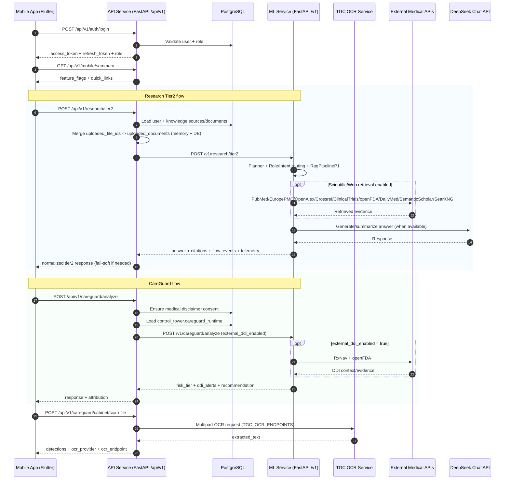
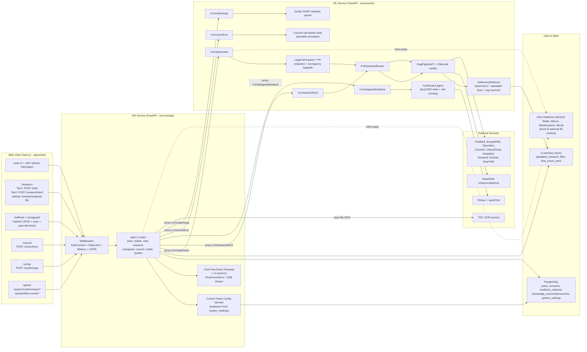

# CUỘC THI SÁNG TẠO THANH THIẾU NIÊN, NHI ĐỒNG  
## THÀNH PHỐ HUẾ LẦN THỨ 19, NĂM 2026

# CLARA-Care

**Tác giả/đồng tác giả:** Nguyễn Ngọc Thiện, Nguyễn Hải Duy, Trịnh Minh Quang  
**Đơn vị:** THPT Hai Bà Trưng, Thành phố Huế  
**Lĩnh vực dự thi:** Các giải pháp kỹ thuật nhằm ứng phó với biến đổi khí hậu, bảo vệ môi trường và phát triển kinh tế  
**Ngày:** **Thứ Ba, ngày 31 tháng 3 năm 2026**

---

## PHẦN 1: TÓM TẮT ĐỀ TÀI

### 1. Tên đề tài
**CLARA-Care**

### 2. Lý do chọn đề tài
Hệ thống y tế Việt Nam đang chịu “gánh nặng kép”: vừa xử lý bệnh cấp tính, vừa đối mặt với sự gia tăng nhanh của bệnh mạn tính (tim mạch, tăng huyết áp, đái tháo đường). Ở cấp hộ gia đình, đa trị liệu, tự ý dùng thuốc, tuân thủ điều trị chưa tốt và tra cứu thông tin thiếu kiểm chứng làm tăng rủi ro sức khỏe.

Trong học tập và nghiên cứu y khoa, rào cản ngôn ngữ và dữ liệu phân mảnh khiến quá trình đối chiếu tài liệu tốn thời gian, dễ sai sót. Song song, phát triển AI y tế cần bám chặt yêu cầu bảo mật dữ liệu theo Nghị định 13/2023/NĐ-CP và nguyên tắc an toàn của WHO.

Từ đó, nhóm xây dựng CLARA-Care như một nền tảng hỗ trợ gồm:
- **CLARA Research**: trợ lý tổng hợp y văn có trích dẫn.
- **CLARA Self-MED**: hỗ trợ quản lý tủ thuốc tại nhà, cảnh báo tương tác thuốc.
- **CLARA Medical Scribe (baseline)**: chuyển transcript thành khung SOAP ở mức cơ bản.

### 3. Tính mới, tính sáng tạo

#### 3.1 Tính mới
- Tích hợp nhiều luồng nghiệp vụ trong cùng một nền tảng thay vì ứng dụng rời rạc.
- Áp dụng kiến trúc RAG có trích dẫn và cơ chế fallback an toàn khi thiếu ngữ cảnh hoặc lỗi dịch vụ.
- Định tuyến hai lớp `Role -> Intent` để điều chỉnh hành vi trả lời theo nhóm người dùng.
- Có lớp cấu hình runtime (Control Tower) cho phép bật/tắt một số luồng xử lý mà không cần sửa code.
- Hỗ trợ xây dựng **Sổ tay sức khỏe cá nhân (PHR)** do người dùng tự khai báo để phục vụ quản lý thuốc tại nhà.

#### 3.2 Tính sáng tạo
- Kết hợp lớp an toàn nhiều tầng: legal guard, kiểm tra tín hiệu rủi ro, lọc dữ liệu nhạy cảm, fallback.
- Mô hình cảnh báo tương tác thuốc lai: local rules + nguồn bên ngoài (khi khả dụng).
- Tích hợp OCR toa thuốc trong luồng quản lý tủ thuốc gia đình.
- Không định vị như chatbot tự do, mà là công cụ hỗ trợ tham khảo có kiểm soát rủi ro.

### 4. Khả năng áp dụng của sản phẩm

#### 4.1 Tại cơ sở y tế (mức hỗ trợ tham khảo)
- Hỗ trợ bác sĩ thực tập/sinh viên tra cứu nhanh tài liệu và tương tác thuốc.
- Giảm thời gian tra cứu thủ công trong các tình huống học tập, thảo luận ca.
- **Không thay thế quyết định lâm sàng, không thay thế quy trình chuyên môn của bệnh viện.**

#### 4.2 Tại cơ sở giáo dục y khoa
- Hỗ trợ sinh viên và nghiên cứu sinh tổng hợp tài liệu có trích dẫn.
- Tăng tốc bước tổng quan y văn và tiếp cận y học thực chứng (EBM).

#### 4.3 Tại cộng đồng và gia đình
- Quét và quản lý tủ thuốc tại nhà.
- Cảnh báo tương tác thuốc nguy cơ cao.
- Hỗ trợ người chăm sóc theo dõi việc dùng thuốc an toàn.

### 5. Hiệu quả kinh tế - xã hội (điều chỉnh theo phạm vi thực tế)
- Góp phần nâng cao nhận thức cộng đồng về sử dụng thuốc an toàn.
- Giảm một phần rủi ro dùng sai thuốc trong phạm vi hộ gia đình.
- Hỗ trợ sinh viên y khoa tra cứu tài liệu nhanh hơn, có căn cứ hơn.
- Là công cụ tham khảo phục vụ chuyển đổi số ở mức thí điểm học đường/cộng đồng.
- **Không tuyên bố chuẩn hóa quy trình khám chữa bệnh của địa phương.**

---

## PHẦN 2: THUYẾT MINH ĐỀ TÀI

### 1. Lý do chọn đề tài
Việt Nam đang bước vào giai đoạn già hóa dân số và gia tăng bệnh không lây nhiễm. Điều này làm nhu cầu quản lý sức khỏe chủ động tại gia đình trở nên cấp thiết, đặc biệt với nhóm đa bệnh nền và đa trị liệu.

Các thách thức chính:
- Nguy cơ tương tác thuốc bất lợi do dùng đồng thời nhiều thuốc.
- Tự mua và tự sử dụng thuốc khi chưa có tư vấn chuyên môn.
- Tuân thủ điều trị chưa cao ở một số nhóm bệnh mạn.
- Khó tổng hợp nguồn tài liệu y khoa đa ngôn ngữ một cách nhanh và có kiểm chứng.

Nhóm phát triển CLARA-Care để giải quyết bài toán hỗ trợ tra cứu và an toàn dùng thuốc ở mức thực dụng, có giới hạn trách nhiệm rõ ràng.

### 2. Mô tả mô hình và nguyên tắc hoạt động

#### 2.1 Lớp Client (Web + Mobile)
- Người dùng nhập câu hỏi, khai báo thuốc, hoặc gửi ảnh toa thuốc.
- Frontend gửi dữ liệu chuẩn hóa về backend và hiển thị kết quả kèm cảnh báo an toàn.

#### 2.2 Lớp Truy cập và Định danh (Access & Identity)
- Đăng ký/đăng nhập/xác thực người dùng.
- JWT access/refresh token và phân vai trò người dùng.

#### 2.3 Lớp Điều phối API (API Orchestration)
- Nhận request từ client, gọi đúng dịch vụ ML/API.
- Tổng hợp response thống nhất cho frontend.

#### 2.4 Lớp Định tuyến (Routing: Role -> Intent)
- Bước 1: xác định vai trò.
- Bước 2: xác định ý định truy vấn (chat/research/careguard/...).
- Chọn luồng xử lý phù hợp theo policy.

#### 2.5 Lớp An toàn (Safety Layer)
- Phát hiện yêu cầu vượt thẩm quyền (kê đơn/chẩn đoán/chỉ định liều) để từ chối.
- Lọc dữ liệu nhạy cảm cơ bản và xử lý fail-soft khi dịch vụ lỗi.
- Ưu tiên phản hồi an toàn trong ngữ cảnh thiếu dữ liệu.

#### 2.6 Lớp Tri thức và Suy luận (Knowledge & Reasoning)
- RAG truy xuất ngữ cảnh từ tập tài liệu và connector.
- Agent nghiệp vụ theo từng bài toán (careguard/research/scribe/council).
- LLM tổng hợp phản hồi dựa trên ngữ cảnh và policy an toàn.

#### 2.7 Lớp Dữ liệu và Hạ tầng (Data & Infra)

**Đang dùng trực tiếp trong phiên bản hiện tại:**
- PostgreSQL cho dữ liệu người dùng và nghiệp vụ.
- In-memory retrieval + external connectors cho một số luồng RAG.

**Đã chuẩn bị hạ tầng để mở rộng:**
- Redis, Milvus, Elasticsearch, Neo4j (ở mức infra readiness).

Lưu ý: ở bản hiện tại phục vụ cuộc thi, chưa tuyên bố production retrieval lõi qua toàn bộ vector/graph/search stack.

#### 2.8 Lớp Điều khiển và Giám sát (Control Tower & Observability)
- Quản trị cấu hình nguồn RAG và flow runtime.
- Theo dõi health/metrics/flow events cho vận hành.
- Một số dashboard đang ở mức mô phỏng để phục vụ demo.

### 3. Tính mới, tính sáng tạo (phiên bản bám sát triển khai)

#### 3.1 Tính mới
- Tích hợp Research + Self-MED + Scribe baseline trong một hệ thống thống nhất.
- Có consent gate và safety guard ở backend.
- Có attribution/citation/fallback metadata trong một số response trọng yếu.

#### 3.2 Tính sáng tạo
- Kết hợp rule-based safety với nguồn dữ liệu bên ngoài để tăng độ tin cậy cảnh báo.
- Thiết kế luồng legal-first để giảm rủi ro trả lời vượt phạm vi.
- Có khả năng chuyển trạng thái online/offline fallback cho một số chức năng cảnh báo.

### 4. Khả năng áp dụng

#### 4.1 Ở bệnh viện/trường y (hỗ trợ tham khảo)
- Hỗ trợ tra cứu nhanh, hỗ trợ đào tạo và thảo luận ca.
- Không dùng để thay thế chẩn đoán/kê đơn.

#### 4.2 Ở cộng đồng
- Tập trung bài toán quản lý tủ thuốc và cảnh báo tương tác thuốc tại nhà.
- Tăng hiểu biết dùng thuốc an toàn cho người dùng không chuyên.

### 5. Hiệu quả xã hội (điều chỉnh claim)

#### 5.1 Đối với người dùng cá nhân/gia đình
- Hỗ trợ nhận biết nguy cơ tương tác thuốc.
- Hỗ trợ tổ chức thông tin thuốc rõ ràng hơn.
- Góp phần giảm nhầm lẫn trong sử dụng thuốc tại nhà.

#### 5.2 Đối với sinh viên và giảng viên y khoa
- Rút ngắn thời gian tổng hợp tài liệu.
- Tăng thói quen kiểm tra nguồn và trích dẫn.

#### 5.3 Đối với hệ sinh thái số y tế
- Cung cấp một hướng tiếp cận “AI hỗ trợ tham khảo có kiểm soát”.
- Là nền tảng thí điểm để hoàn thiện kỹ thuật trước khi mở rộng.

### 6. Phạm vi triển khai: Đã làm / Đang làm / Chưa làm

#### 6.1 Đã làm (có trong bản hiện tại)
- `Legal guard` chặn nhóm yêu cầu vượt thẩm quyền (kê đơn/chẩn đoán/chỉ định liều).
- Consent gate ở backend trước khi xử lý dữ liệu nhạy cảm.
- Luồng cảnh báo tương tác thuốc theo mô hình lai: local rules + nguồn ngoài khi khả dụng.
- RAG mức cơ bản với trích dẫn/fallback metadata cho một số response trọng yếu.
- Hệ thống quản lý người dùng, phân quyền và JWT access/refresh token.
- Quản lý tủ thuốc gia đình và OCR toa thuốc ở mức phục vụ demo nghiệp vụ.

#### 6.2 Đang làm (đã có nền nhưng chưa hoàn thiện production)
- Củng cố chất lượng parser tài liệu nghiên cứu (đặc biệt PDF/image dài và cấu trúc phức tạp).
- Chuẩn hóa bộ đánh giá RAG/hallucination (test set, coverage, faithfulness, tracking theo phiên bản).
- Hoàn thiện observability/dashboard vận hành (một số thành phần hiện còn mức mô phỏng).
- Nâng độ ổn định của các connector bên ngoài khi timeout hoặc lỗi định dạng phản hồi.

#### 6.3 Chưa làm (hoặc chưa đủ điều kiện để tuyên bố)
- Chưa vận hành retrieval production lõi trên toàn bộ stack Redis/Milvus/Elasticsearch/Neo4j.
- Chưa có xác nhận lâm sàng đa trung tâm hoặc thử nghiệm triển khai diện rộng.
- Chưa định vị/chứng nhận như SaMD (Software as a Medical Device).
- Chưa tích hợp chính thức vào quy trình nghiệp vụ bắt buộc của bệnh viện/cơ quan quản lý.

### 7. Rủi ro & biện pháp giảm thiểu

#### 7.1 Rủi ro false alert (cảnh báo sai hoặc quá nhạy)
- **Rủi ro:** hệ thống cảnh báo tương tác thuốc khi mức bằng chứng thấp, gây lo lắng không cần thiết.
- **Giảm thiểu:** gắn mức độ cảnh báo (high/medium/low), hiển thị nguồn và mức chắc chắn; yêu cầu người dùng xác nhận với dược sĩ/bác sĩ ở mức cảnh báo cao.

#### 7.2 Rủi ro bỏ sót cảnh báo (false negative)
- **Rủi ro:** dữ liệu thuốc thiếu hoạt chất, tên biệt dược nhập sai hoặc thiếu liều dùng làm hệ thống không phát hiện tương tác.
- **Giảm thiểu:** chuẩn hóa tên thuốc theo từ điển thuốc, áp dụng fuzzy matching có ngưỡng, cảnh báo “thiếu dữ liệu” thay vì kết luận an toàn.

#### 7.3 Rủi ro dữ liệu người dùng nhập sai
- **Rủi ro:** người dùng nhập sai triệu chứng, sai lịch dùng thuốc, ảnh toa mờ làm OCR sai.
- **Giảm thiểu:** bắt buộc bước xác nhận lại dữ liệu trước khi phân tích; đánh dấu trường “độ tin cậy thấp”; ưu tiên khuyến nghị đi khám khi thông tin không nhất quán.

#### 7.4 Rủi ro outage dịch vụ ngoài hoặc hệ thống nội bộ
- **Rủi ro:** connector (ví dụ nguồn tra cứu thuốc) timeout/lỗi mạng làm suy giảm chất lượng phản hồi.
- **Giảm thiểu:** timeout ngắn + retry có kiểm soát; fallback sang local rules; trả về trạng thái “dịch vụ ngoài không khả dụng” thay vì trả lời suy đoán.

#### 7.5 Rủi ro pháp lý và hiểu nhầm phạm vi sử dụng
- **Rủi ro:** người dùng hiểu nhầm kết quả AI là chỉ định điều trị chính thức.
- **Giảm thiểu:** nhãn pháp lý bắt buộc trong UI/API, từ chối câu hỏi vượt phạm vi, luôn kèm tuyên bố “công cụ tham khảo - không thay thế bác sĩ/dược sĩ”.

### 8. Giới hạn và tuyên bố pháp lý bắt buộc
- CLARA-Care là **công cụ hỗ trợ tham khảo**, không thay thế bác sĩ/dược sĩ.
- CLARA-Care **không phải** hồ sơ bệnh án điện tử của cơ sở y tế.
- Dữ liệu người dùng nhập là **PHR (Personal Health Record)** do người dùng tự khai báo.
- PHR không có giá trị pháp lý tương đương EMR/EHR.
- Kết quả từ hệ thống không phải chỉ định điều trị.
- Dự án chưa định vị như SaMD (Software as a Medical Device).

### 9. Tình huống minh họa (điều chỉnh thực tế)

#### 9.1 CLARA Research
- Người học đặt câu hỏi nghiên cứu bằng ngôn ngữ tự nhiên.
- Hệ thống truy xuất tài liệu phù hợp, trả lời kèm trích dẫn.
- Mục tiêu: hỗ trợ bước đầu tổng quan y văn, không thay thế phản biện học thuật cuối cùng.

#### 9.2 CLARA Self-MED
- Người dùng quét/nhập thuốc vào tủ thuốc cá nhân.
- Hệ thống phân tích tương tác, đưa cảnh báo theo mức độ.
- Mục tiêu: hỗ trợ quản lý thuốc tại nhà an toàn hơn.

---

## DANH MỤC TỪ VIẾT TẮT

| STT | Từ viết tắt | Thuật ngữ tiếng Anh | Giải nghĩa tiếng Việt |
|---|---|---|---|
| 1 | AI | Artificial Intelligence | Trí tuệ nhân tạo |
| 2 | API | Application Programming Interface | Giao diện lập trình ứng dụng |
| 3 | DB | Database | Cơ sở dữ liệu |
| 4 | EBM | Evidence-Based Medicine | Y học dựa trên bằng chứng |
| 5 | EMR/EHR | Electronic Medical/Health Record | Hồ sơ bệnh án điện tử do cơ sở y tế quản lý |
| 6 | PHR | Personal Health Record | Sổ tay sức khỏe cá nhân do người dùng tự khai báo |
| 7 | LLM | Large Language Model | Mô hình ngôn ngữ lớn |
| 8 | ML | Machine Learning | Học máy |
| 9 | OCR | Optical Character Recognition | Nhận dạng ký tự quang học |
| 10 | PII | Personally Identifiable Information | Dữ liệu định danh cá nhân |
| 11 | RAG | Retrieval-Augmented Generation | Sinh văn bản tăng cường truy xuất |
| 12 | RxNorm | - | Hệ thống danh pháp chuẩn hóa thuốc |
| 13 | WHO | World Health Organization | Tổ chức Y tế Thế giới |

---

## PHỤ LỤC

### Phụ lục 1: Sơ đồ luồng hoạt động tổng thể CLARA
(API Service, ML Service, Mobile App)

### Phụ lục 2: Sơ đồ kiến trúc hệ thống và tích hợp Web Client
(Routing qua chat/research/careguard/council/scribe và kết nối dịch vụ ngoài)

### Phụ lục 3: Hệ thống website CLARA

### Phụ lục 4: Mã QR website CLARA
