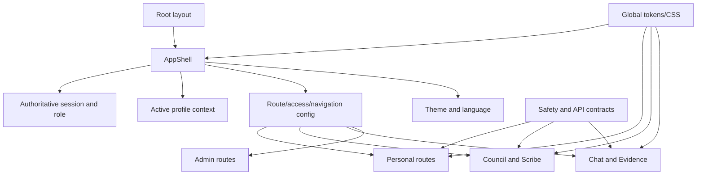

# CLARA Web UI Modernization — Current-state audit

Date: 2026-08-06  
Branch: `feat/ui-modernization-v2`  
Scope: `apps/web`, its route contracts, shared terminology, tests, and the API contracts directly exercised by redesigned flows.

## Evidence and method

The source is authoritative. Seven independent read-only audits covered frontend architecture, product/IA, design/accessibility, Chat/Research, personal care, Council/Scribe, and testing/performance. No task-attached screenshots were available to the agents or workspace. Synthetic, PII-free baseline screenshots were therefore captured from the running app in `docs/ui-modernization/evidence/baseline/`.

Baseline environment:

- Repository CI implies Node 20; the repository did not pin Node before this program. The audit host runs Node `v24.13.1`, npm `11.8.0`.
- Web stack: Next.js 15.5.22, React 18.3.1, TypeScript 5.6.2, Tailwind 3.4.13, npm lockfile.
- `npm run lint`: pass, with eight pre-existing Hook dependency warnings.
- `npx tsc --noEmit`: pass.
- `npm run test -- --reporter=dot`: 87 files, 677 tests passed.
- `npm run build`: pass; 91 generated pages, 104 kB shared first-load JS.
- E2E baseline is recorded in the ExecPlan once its run completes.

## Current route and shell architecture

The App Router exposes 79 `page.tsx` routes. Major families are:

```text
public/auth/legal: /, /login, /register, /legal/*, public shares
personal: /today, /lifemap*, /visits*, /family*, /phr*, /medicines*
chat/research: /chat*, /evidence, /research/source-hub
clinical: /council*, /scribe
administration: /dashboard*, /admin/*
compatibility: /selfmed*, /careguard, /research legacy aliases
account/support: /welcome*, /account/*, /huong-dan, /community
```

The existing `navigation.config.ts` combines route access, menu presentation, page metadata, translations, flags, role membership, mobile priority, and compatibility-route allowance. `AppShell` owns session hydration, role, profile context, onboarding, theme, language, notifications, desktop/mobile navigation, logout, route guarding, and layout selection.

## Principal findings

| ID | Severity | Finding | User/product impact |
|---|---|---|---|
| AUD-01 | Critical | No workspace model; a role-filtered flat menu can expose 8–25 destinations. | Personal, clinical, research, and admin work are mixed; prior attempts to hide items risked losing feature access. |
| AUD-02 | Critical | Route access and navigation visibility use the same model. | Simplifying the menu can accidentally block direct links. |
| AUD-03 | Critical | `AppShell` is a 675-line client controller and renderer. | High regression risk and duplicated requests/state. |
| AUD-04 | Critical | PHR uses unloaded `material-symbols-rounded` while only Outlined is loaded. | Raw strings such as `badge` and `clinical_notes` visibly replace icons. |
| AUD-05 | High | Ask CLARA, profile, preferences, and logout appear in multiple shell locations. | Competing actions and inconsistent focus/navigation behavior. |
| AUD-06 | High | Mobile drawer is marked modal but lacks focus trap, inert background, and restoration. | Keyboard and screen-reader users can escape the drawer. |
| AUD-07 | High | `globals.css` is a 2,618-line token, domain, and compatibility stack. | Overrides are hard to reason about; legacy neon/glass rules remain. |
| AUD-08 | High | LifeMap, Council, Scribe, PHR, and Chat orchestration components are very large. | Hidden panels still compete visually and changes risk state/safety regressions. |
| AUD-09 | High | Dashboard contains synthetic fallback activity and an uncalibrated “confidence” calculation. | Fabricated-looking health/operations data reduces trust. |
| AUD-10 | High | Chat can show global nav + conversation rail + answer plus telemetry before the answer. | Three-column density and developer-first hierarchy. |
| AUD-11 | High | Scribe has competing workspace/review/enterprise flows and ambiguous finalized/signed labels. | Consent and clinician attestation can be misunderstood. |
| AUD-12 | High | PHR section updates PUT the whole record. | Concurrent edits can overwrite unrelated sections; UI must detect conflicts until a PATCH/ETag contract exists. |
| AUD-13 | High | Medication courses, cabinet items, and PHR medicines are distinct but visually conflated. | Users may assume unconfirmed cabinet items are current medicines. |
| AUD-14 | High | Current tests lack workspace/role E2E, visual baselines, systematic axe scans, and focus tests for several dialogs. | Major shell and flow regressions can escape CI. |

## Existing strengths to preserve

- Server RBAC, profile isolation, consent gates, CSRF, emergency fast-path, FIDES, DrugBank fail-closed behavior, audit history, and no-PII telemetry are already regression-locked.
- Chat has virtualized message/history lists, lazy admin telemetry, and a tested focus-trapped workspace drawer.
- Guided-flow primitives and URL-addressable onboarding/LifeMap creation already exist.
- PHR already exposes focused `/phr/[section]` routes.
- Medicines already consolidates list, cabinet, and safety behind a canonical hub, with legacy redirects.
- Research execution is already unified into Chat; legacy `/research*` routes redirect.
- Shared Button, Field, Badge, Surface, Tabs, Modal, PageShell, AsyncSection, and guided-flow components provide a migration base.
- Theme initialization prevents a flash; source-contract tests cover contrast, focus, token use, i18n, and terminology.

## Dependency and risk map



Shared files requiring single-owner edits are `app-shell.tsx`, `navigation.config.ts` and its replacements, `components/navigation/*`, `styles/*`, `app/layout.tsx`, and shared UI primitives.

## Compatibility classification

| Category | Examples | Policy |
|---|---|---|
| Active | Today, LifeMap, Medicines, Chat V2, Council, Scribe | Modernize incrementally. |
| Supported rollback | legacy Chat behind its flag | Keep until parity and production observation are complete. |
| Compatibility alias | `/selfmed*`, `/careguard`, `/research*`, admin aliases | Keep redirect and deep-link tests; do not show in primary nav. |
| Audit artifact | archived Research workspace/right rail | Keep out of new imports; document removal criterion. |
| Verified dead | obsolete sidebar and proven-unused CSS only | Remove after import, flag, visual, and build evidence. |

## Audit limitations

- No task-attached screenshot payload was visible. The generated baseline is the comparison source.
- Mocked UI screenshots do not prove live API authorization or medical behavior.
- Existing `.next` sizes are useful baseline evidence, not a clean-room performance benchmark.
- Dense clinical and admin data must be validated with representative synthetic fixtures during implementation.

