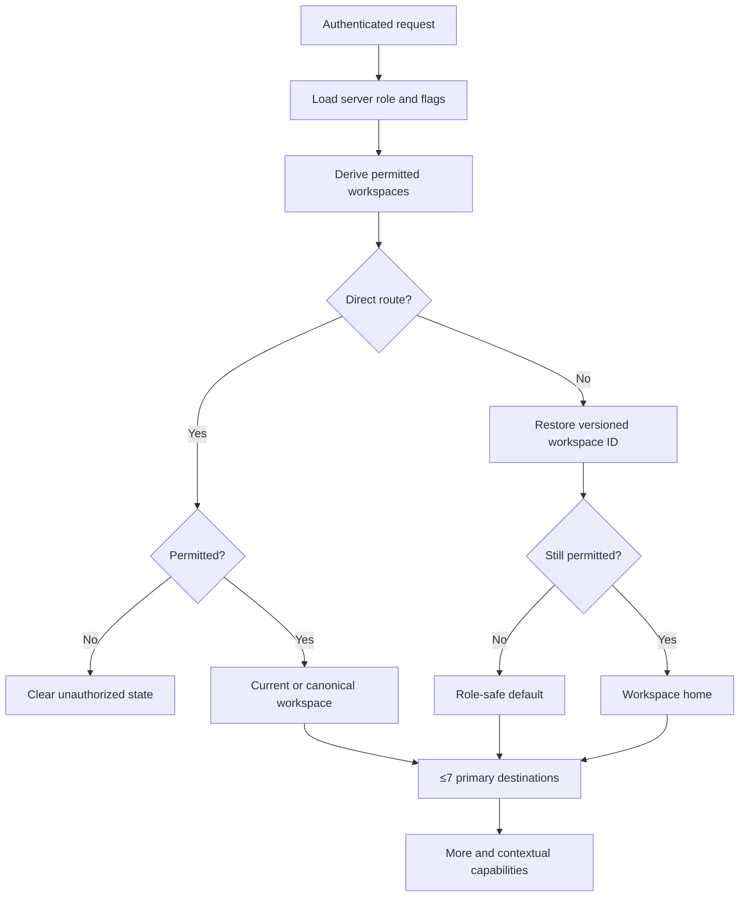
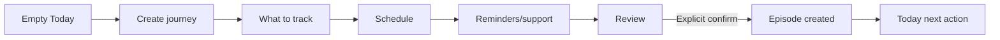
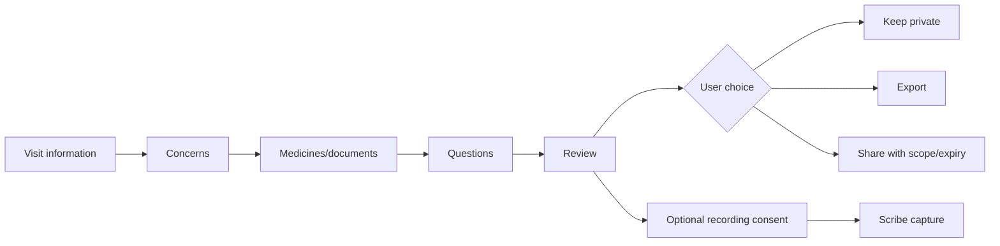
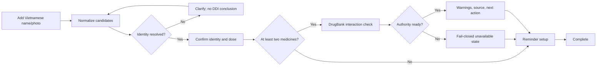
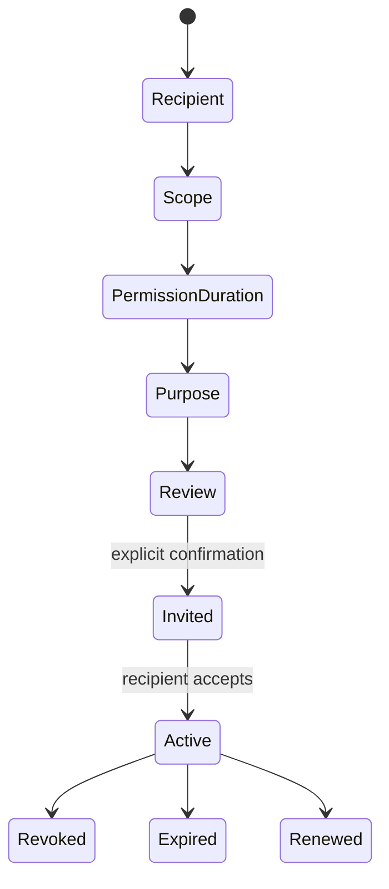
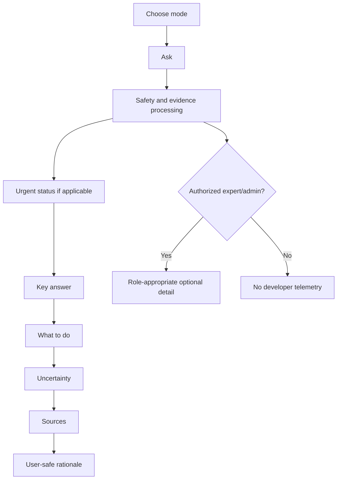
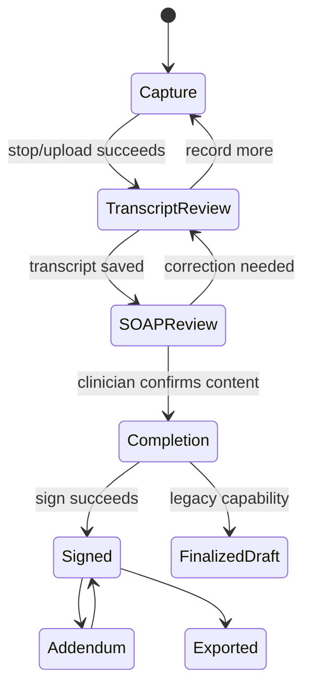

# Personas and user journeys

## Role-to-persona model

The server role remains authoritative. A workspace is a presentation context, never a role selector.

| Server role | Personas | Permitted workspaces |
|---|---|---|
| `normal` | Personal user, self-carer, family-supported user | Personal |
| `researcher` | Researcher who may also use personal care | Personal, Research |
| `doctor` | Clinician who may also use personal care/research | Personal, Clinical, Research |
| `admin` | Operator/governance user with other permitted capabilities | Personal, Clinical, Research, Administration |

## Needs and hazards

### Personal user

Needs plain language, the next safe action, a visible uncertainty boundary, and control of what is saved/shared. Hazards include interpreting absence of a DDI warning as absolute safety, assuming AI-confirmed LifeMap facts, and losing trust when technical labels or raw icons appear.

### Researcher

Needs traceable claims, source metadata, scope, applicability, and history. Does not need connector health or raw execution logs in the answer. Hazards include citation duplication and mistaking a verifier enum for clinical certainty.

### Clinician

Needs persistent case/session context, escalation before metrics, transcript/note control, and a clear signed/finalized distinction. Hazards include recording before consent, navigating away with unsaved content, and treating generated SOAP as signed documentation.

### Administrator

Needs operational status and diagnostic depth without contaminating consumer views. Hazards include exposing model/provider/PII data, changing release policy from the care flow, and losing access to secondary governance routes after menu simplification.

### Support recipient

Needs a bounded invitation preview and explicit scope/duration. Hazards include accepting an overbroad grant or assuming access remains after revocation/expiry.

## Core journeys

### Workspace resolution and direct link

### Empty Today to active journey

At every step Back preserves draft data; optional choices are labelled; no episode/truth-state mutation happens before confirmation.

### Visit preparation and optional Scribe

### Medicine onboarding

### Family share lifecycle

### Chat and evidence disclosure

### Scribe clinician-control lifecycle

## Journey-wide acceptance criteria

- Users always know the current task, current step, and safe exit.
- Back/refresh/re-auth preserve policy-allowed drafts.
- API errors do not clear accepted input.
- Critical safety messages are visible without opening a disclosure.
- Health mutations require explicit confirmation.
- Sharing shows data, recipient, permissions, duration, revocation, and latest access.
- Clinician signing and legacy finalization are never presented as equivalent.
- Keyboard focus follows the task and returns after overlays close.

