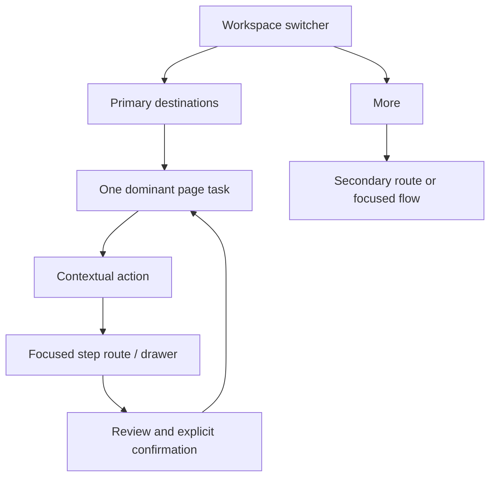
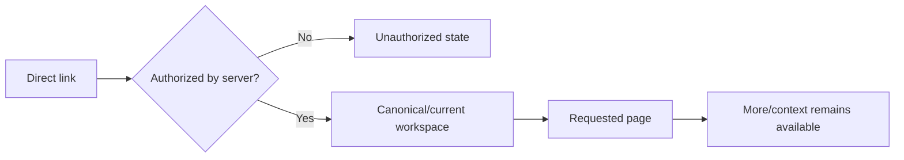

# Information architecture

## Current route tree and visible navigation

The current tree is documented in `00-current-state-audit.md`. Navigation is a single role-filtered list grouped as care, medicines, explore, clinical, admin, and support. Base counts are 8 personal, 12 researcher, 14 doctor, and 21 admin destinations, with flags increasing the total.

## Proposed route tree

No active capability is removed. New route-level splits are introduced only where they materially improve a focused workflow and existing API state can support them.

```text
Personal
├─ /today
├─ /chat
├─ /lifemap
│  ├─ /new/[draftId]/[step]
│  └─ episode-focused URL-backed sections (incremental)
├─ /medicines
├─ /phr and /phr/[section]
└─ More: /visits*, /family*, /community*, /huong-dan, /account/*

Clinical
├─ /dashboard (real-data role view; no invented patient directory/work queue)
├─ /chat
├─ /council and /council/new/*
└─ /scribe

Research
├─ /chat (research mode)
├─ /evidence
├─ /research/source-hub
└─ More: /chat/shares, help/account

Administration
├─ /admin/overview
├─ /admin/knowledge-sources
├─ /admin/answer-flow
├─ /admin/observability
├─ /admin/analytics
└─ More: clinical analytics, moderation, DSAR, audit, RAG eval/ingestion
```

## Navigation by role/workspace

| Workspace | Primary (≤7) | Secondary / More |
|---|---|---|
| Personal | Hôm nay, Hỏi CLARA, Hành trình, Thuốc, Hồ sơ | Chuẩn bị đi khám, Người thân hỗ trợ, Cộng đồng when enabled, Quyền riêng tư & dữ liệu, Trợ giúp |
| Clinical | Tổng quan công việc (`/dashboard`), Hỏi CLARA (`/chat`), Hội chẩn (`/council`), Ghi chép khám (`/scribe`) | Hồ sơ đang xem (`/phr`), Chuẩn bị buổi khám, Thuốc & tương tác, Bằng chứng |
| Research | Hỏi CLARA, Thư viện bằng chứng, Nguồn nghiên cứu | Lịch sử inside Chat, Chia sẻ truy vấn, Help/account |
| Administration | Tổng quan, Nguồn tri thức, Luồng trả lời, Giám sát, Phân tích | Clinical analytics, moderation, DSAR, audit log, RAG tools |

`normal` receives Personal. `researcher` receives Personal + Research. `doctor` receives Personal + Clinical + Research. `admin` receives all four. “Tổng quan công việc” maps to the existing `/dashboard`; it must render only measured API data and must not imply a patient directory or work queue that does not exist. “Hồ sơ đang xem” remains contextual/More and uses the existing active-profile context; it is shown with that label only when a permitted non-self profile is selected, otherwise it is “Hồ sơ cá nhân”.

## Old-to-new route map

| Old/bookmarked route | Canonical behavior |
|---|---|
| `/selfmed` | `/medicines?tab=cabinet` |
| `/selfmed/add` | Shared canonical cabinet-add component/route |
| `/selfmed/ddi`, `/careguard` | `/medicines?tab=safety` |
| `/research`, `/research/analyze`, `/research/deepdive` | `/chat`, preserving a safe mode/context hint when available |
| `/research/citations`, `/research/details` | `/chat`; source disclosure opens only when conversation context exists |
| `/admin` | `/admin/overview` |
| `/admin/rag-sources`, `/admin/source-hub` | `/admin/knowledge-sources` |
| `/role-select` | Compatibility redirect; never navigation |
| `/council/*` technical routes | Preserve bookmarks, then render/redirect into case-context result sections |
| `/lifemap/visit-prep` | Preserve; guide to canonical Visit flow without losing draft context |

Redirects cannot bypass auth, consent, profile isolation, CSRF, DrugBank, or release gates.

## Desktop navigation

- Expanded width 232–248 px; collapsed 64–72 px.
- Workspace switcher below brand, showing only permitted workspaces.
- One active route state.
- Primary items followed by More.
- One profile trigger at the bottom or topbar, not both.
- Collapse control remains, with tooltip and persisted presentation-only state.
- Page content owns the heading; topbar carries breadcrumb/context, help/notifications, and profile.

## Mobile navigation

- Four frequent workspace destinations plus More.
- More opens a tested SideSheet containing remaining workspace items, workspace switcher, and profile/preferences.
- Drawer traps/restores focus, locks background, supports Escape/backdrop, and has ≥44 px targets.
- Direct links can select another permitted workspace without forcing the user through the drawer.

## Breadcrumbs

- Standard: Workspace / Feature / Current object or step.
- No breadcrumb on focused public/auth entry pages.
- Guided flows announce flow name and `Bước n trên m`; breadcrumb never replaces the Stepper.
- Object names are sanitized and truncated; no sensitive detail enters analytics.

## More menu behavior

More is a discovery surface, not an authorization boundary. Its visible text label is present on desktop and mobile; every item has a plain-language label and short description, the current secondary route marks its group active, and no feature is more than two interactions from its workspace. It groups secondary capabilities by task, includes status badges only when meaningful, and never contains compatibility aliases. Feature-flagged entries disappear when unavailable, while a permitted direct link receives an explicit unavailable/unauthorized state. Desktop More can be an anchored menu; mobile More is a SideSheet with Back/browser-back handling and focus restoration.

## Workspace switching rules

1. Use the server-verified role and effective flags.
2. UI workspaces never grant permission.
3. A direct route chooses the current workspace if it contains the route, otherwise its canonical permitted workspace.
4. Store only `clara_workspace_v1 = WorkspaceId`.
5. Stale/forbidden values fall back safely: personal `/today`, researcher Research `/chat`, doctor Clinical `/dashboard`, admin Administration `/admin/overview`.
6. A profile switch invalidates route-local health caches but does not persist profile data in workspace storage.
7. Public shares/auth/legal routes mount no authenticated workspace shell.

The exhaustive route capability matrix is maintained in `route-capability-matrix.md` and CI must assert that every `app/**/page.tsx` route is classified exactly once.

## Feature discovery strategy

- Primary: high-frequency workspace destinations.
- More: infrequent but generally discoverable destinations.
- Contextual: add task, open source, invite supporter, export/share, specialist details.
- Guided completion: optional next steps at the end of LifeMap, medicine, visit, and onboarding flows.
- Help: searchable plain-language descriptions, never internal service names.
- Direct links: fully preserved and classified.

## User flows




