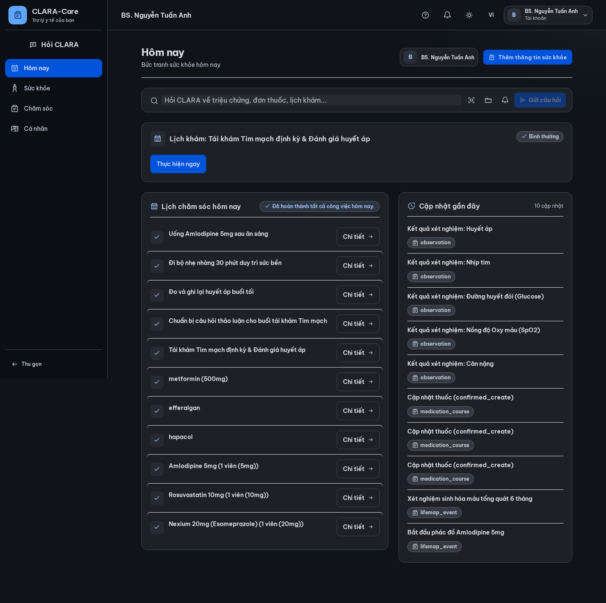
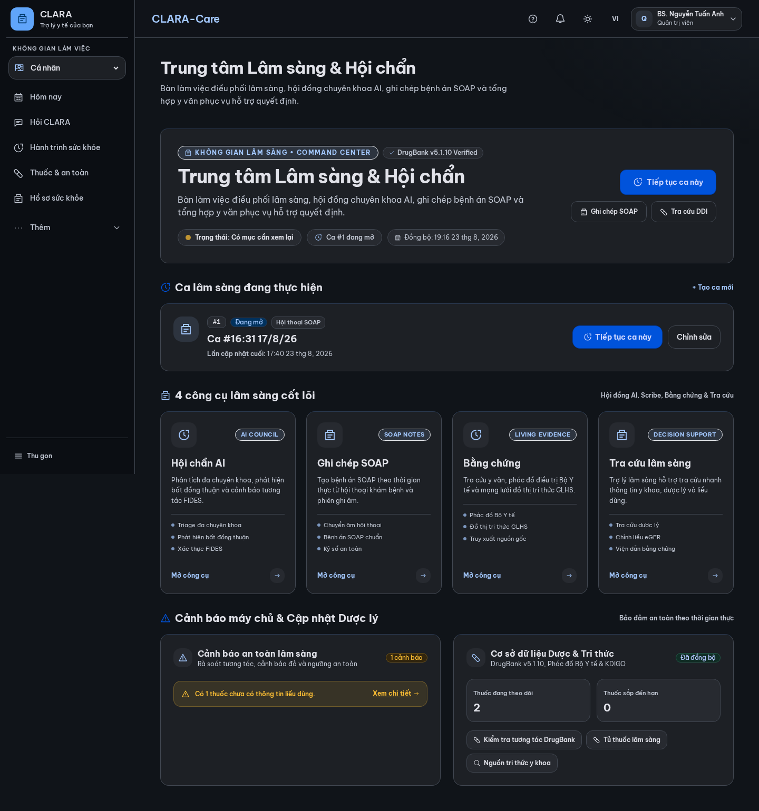
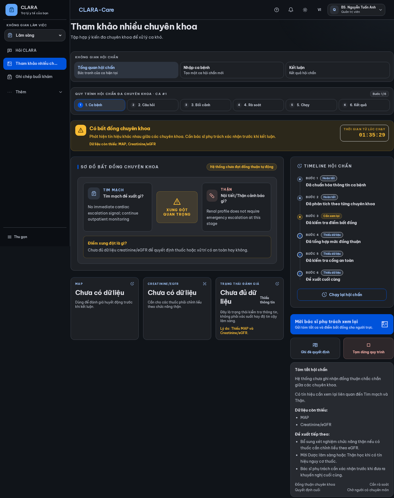
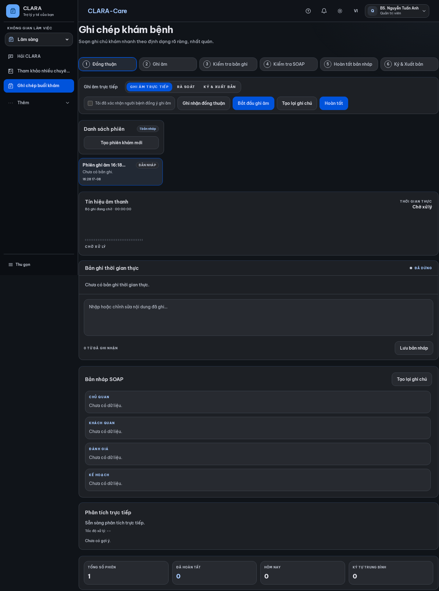
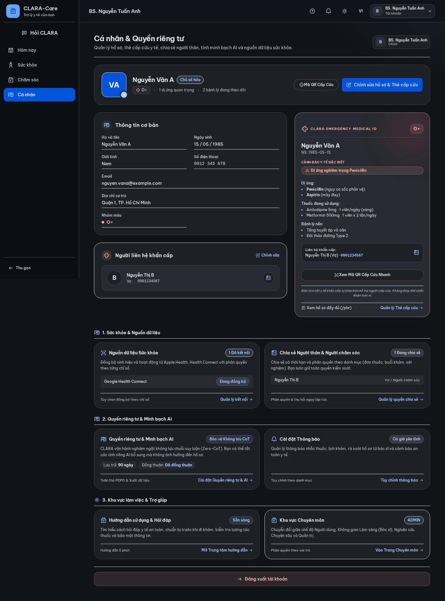

# CLARA Care — Toàn Bộ Ảnh Chụp Giao Diện (Screenshots Catalog)

**Hệ thống:** CLARA Care (Next.js 15 + Tailwind CSS + CLARA Spatial Care v3.0)  
**Địa chỉ Live:** [https://theclaracare.com/](https://theclaracare.com/)  
**Thời gian chụp:** 19:17:29 23/8/2026  
**Thư mục lưu trữ:** `docs/ui-transformation-v3/screenshots/`  

---

## Danh Sách Chi Tiết Các Màn Hình

| STT | Tên Màn Hình / Chức Năng | Đường Dẫn (Route) | Phân Loại | Ảnh Desktop (1440px) | Ảnh Mobile (390px) |
|---|---|---|---|:---:|:---:|
| 1 | **Trang chủ CLARA Care (Landing Page)** | `/` | Public | [Xem ảnh](01_landing_home_desktop.png) | [Xem ảnh](01_landing_home_mobile.png) |
| 2 | **Màn hình Đăng nhập (Sign In)** | `/login` | Public | [Xem ảnh](02_auth_login_desktop.png) | [Xem ảnh](02_auth_login_mobile.png) |
| 3 | **Màn hình Đăng ký tài khoản (Sign Up)** | `/register` | Public | [Xem ảnh](03_auth_register_desktop.png) | [Xem ảnh](03_auth_register_mobile.png) |
| 4 | **Màn hình Quên mật khẩu** | `/forgot-password` | Public | [Xem ảnh](04_auth_forgot_password_desktop.png) | [Xem ảnh](04_auth_forgot_password_mobile.png) |
| 5 | **Màn hình Xác thực Email** | `/verify-email` | Public | [Xem ảnh](05_auth_verify_email_desktop.png) | [Xem ảnh](05_auth_verify_email_mobile.png) |
| 6 | **Trung tâm Hướng dẫn & Trợ giúp (Guide Center)** | `/huong-dan` | Public | [Xem ảnh](06_help_guide_center_desktop.png) | [Xem ảnh](06_help_guide_center_mobile.png) |
| 7 | **Điều khoản sử dụng (Terms of Service)** | `/legal/terms` | Public | [Xem ảnh](07_legal_terms_desktop.png) | [Xem ảnh](07_legal_terms_mobile.png) |
| 8 | **Chính sách quyền riêng tư (Privacy Policy)** | `/legal/privacy` | Public | [Xem ảnh](08_legal_privacy_desktop.png) | [Xem ảnh](08_legal_privacy_mobile.png) |
| 9 | **Đồng thuận Y tế (Medical Consent)** | `/legal/consent` | Public | [Xem ảnh](09_legal_consent_desktop.png) | [Xem ảnh](09_legal_consent_mobile.png) |
| 10 | **Bảng điều khiển Hôm nay (Today Dashboard)** | `/today` | Authenticated | [Xem ảnh](10_consumer_today_dashboard_desktop.png) | [Xem ảnh](10_consumer_today_dashboard_mobile.png) |
| 11 | **Trò chuyện & Hỏi CLARA (Ask CLARA Chat)** | `/chat` | Authenticated | [Xem ảnh](11_ask_clara_chat_desktop.png) | [Xem ảnh](11_ask_clara_chat_mobile.png) |
| 12 | **Trung tâm Quản lý Thuốc (Medicines Tri-Concept)** | `/medicines` | Authenticated | [Xem ảnh](12_medicines_hub_desktop.png) | [Xem ảnh](12_medicines_hub_mobile.png) |
| 13 | **Thêm thuốc vào tủ (Add Medicine)** | `/medicines/add` | Authenticated | [Xem ảnh](13_medicines_add_flow_desktop.png) | [Xem ảnh](13_medicines_add_flow_mobile.png) |
| 14 | **Hồ sơ Sức khỏe Cá nhân (Personal Health Record)** | `/phr` | Authenticated | [Xem ảnh](14_phr_health_records_desktop.png) | [Xem ảnh](14_phr_health_records_mobile.png) |
| 15 | **Chuẩn bị Khám & Lịch sử Khám (Visits)** | `/visits` | Authenticated | [Xem ảnh](15_visits_preparation_desktop.png) | [Xem ảnh](15_visits_preparation_mobile.png) |
| 16 | **Hành trình Sức khỏe LifeMap** | `/lifemap` | Authenticated | [Xem ảnh](16_lifemap_journey_desktop.png) | [Xem ảnh](16_lifemap_journey_mobile.png) |
| 17 | **Chia sẻ Gia đình & Vòng Chăm sóc (Family Circle)** | `/family` | Authenticated | [Xem ảnh](17_family_sharing_desktop.png) | [Xem ảnh](17_family_sharing_mobile.png) |
| 18 | **Tổng quan Hồ sơ & Thẻ Cấp Cứu Bento Grid** | `/you` | Authenticated | [Xem ảnh](18_profile_you_overview_desktop.png) | [Xem ảnh](18_profile_you_overview_mobile.png) |
| 19 | **Trung tâm Quyền riêng tư & Minh bạch AI (Zero-CoT)** | `/you/privacy` | Authenticated | [Xem ảnh](19_privacy_ai_transparency_desktop.png) | [Xem ảnh](19_privacy_ai_transparency_mobile.png) |
| 20 | **Quản lý Quyền Truy cập & Chia sẻ** | `/you/sharing` | Authenticated | [Xem ảnh](20_sharing_management_desktop.png) | [Xem ảnh](20_sharing_management_mobile.png) |
| 21 | **Cài đặt Thông báo & Nhắc nhở** | `/you/notifications` | Authenticated | [Xem ảnh](21_notifications_settings_desktop.png) | [Xem ảnh](21_notifications_settings_mobile.png) |
| 22 | **Thiết bị & Kết nối Dữ liệu (Integrations)** | `/you/integrations` | Authenticated | [Xem ảnh](22_connected_integrations_desktop.png) | [Xem ảnh](22_connected_integrations_mobile.png) |
| 23 | **Trung tâm Lâm sàng & Hội chẩn (Clinician Command Center)** | `/clinical` | Authenticated | [Xem ảnh](23_clinical_command_center_desktop.png) | [Xem ảnh](23_clinical_command_center_mobile.png) |
| 24 | **Hội đồng Hội chẩn AI (Council Workspace)** | `/council` | Authenticated | [Xem ảnh](24_council_case_hub_desktop.png) | [Xem ảnh](24_council_case_hub_mobile.png) |
| 25 | **Khởi tạo Ca Hội chẩn Mới (New Council Case)** | `/council/new` | Authenticated | [Xem ảnh](25_council_new_case_desktop.png) | [Xem ảnh](25_council_new_case_mobile.png) |
| 26 | **Nhập liệu Bệnh sử & Triệu chứng Ca bệnh** | `/council/new/intake` | Authenticated | [Xem ảnh](26_council_intake_form_desktop.png) | [Xem ảnh](26_council_intake_form_mobile.png) |
| 27 | **Lựa chọn Hội đồng Chuyên khoa** | `/council/new/specialists` | Authenticated | [Xem ảnh](27_council_specialists_select_desktop.png) | [Xem ảnh](27_council_specialists_select_mobile.png) |
| 28 | **Xem lại Ca bệnh trước khi Deliberate** | `/council/new/review` | Authenticated | [Xem ảnh](28_council_review_checklist_desktop.png) | [Xem ảnh](28_council_review_checklist_mobile.png) |
| 29 | **Ghi chép Khám Lâm sàng SOAP (CLARA Scribe)** | `/scribe` | Authenticated | [Xem ảnh](29_scribe_clinical_notes_desktop.png) | [Xem ảnh](29_scribe_clinical_notes_mobile.png) |
| 30 | **Không gian Bằng chứng Sống (Living Evidence)** | `/evidence` | Authenticated | [Xem ảnh](30_living_evidence_workspace_desktop.png) | [Xem ảnh](30_living_evidence_workspace_mobile.png) |
| 31 | **Trung tâm Nguồn Tri thức Y khoa** | `/research/source-hub` | Authenticated | [Xem ảnh](31_research_sources_hub_desktop.png) | [Xem ảnh](31_research_sources_hub_mobile.png) |
| 32 | **Tổng quan Quản trị Hệ thống (Admin Overview)** | `/admin/overview` | Authenticated | [Xem ảnh](32_admin_system_overview_desktop.png) | [Xem ảnh](32_admin_system_overview_mobile.png) |
| 33 | **Giám sát & Đo kiểm Telemetry (Observability)** | `/admin/observability` | Authenticated | [Xem ảnh](33_admin_observability_desktop.png) | [Xem ảnh](33_admin_observability_mobile.png) |
| 34 | **Nhật ký Kiểm toán Bất biến (Audit Log)** | `/admin/audit-log` | Authenticated | [Xem ảnh](34_admin_audit_log_desktop.png) | [Xem ảnh](34_admin_audit_log_mobile.png) |
| 35 | **Xử lý Yêu cầu Dữ liệu Cá nhân (DSAR)** | `/admin/dsar` | Authenticated | [Xem ảnh](35_admin_dsar_requests_desktop.png) | [Xem ảnh](35_admin_dsar_requests_mobile.png) |
| 36 | **Quản lý Nguồn Tri thức & Ingestion** | `/admin/knowledge-sources` | Authenticated | [Xem ảnh](36_admin_knowledge_sources_desktop.png) | [Xem ảnh](36_admin_knowledge_sources_mobile.png) |
| 37 | **Tiến trình Nhập liệu & Chỉ mục RAG** | `/admin/rag-ingestion` | Authenticated | [Xem ảnh](37_admin_rag_ingestion_desktop.png) | [Xem ảnh](37_admin_rag_ingestion_mobile.png) |

---

## Xem Trước Một Số Màn Hình Trọng Tâm

### 1. Bảng Điều Khiển "Hôm Nay" (Today Dashboard)

### 2. Trung Tâm Lâm Sàng Bác Sĩ (Clinician Command Center)

### 3. Hội Đồng Hội Chẩn AI (Council Workspace)

### 4. Ghi Chép Khám Lâm Sàng SOAP (CLARA Scribe)

### 5. Hồ Sơ & Thẻ Cấp Cứu Bento Grid (Emergency Medical Card)

